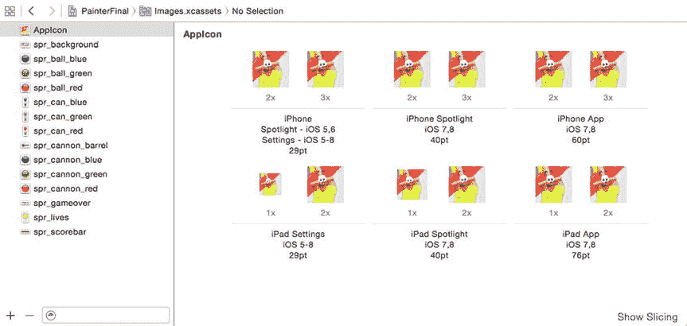
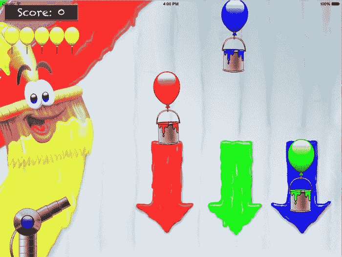

# 完成“画家”游戏

电子补充材料：本章的在线版本 (doi:[10.1007/978-1-4842-0650-8_11](http://dx.doi.org/10.1007/978-1-4842-0650-8_11)) 包含补充材料，可供授权用户获取。

在本章中，你将通过添加一些额外功能（如运动效果、音效和音乐，以及维护和显示分数）来完成“画家”游戏。最后，你将更详细地了解字符和字符串。

## 添加运动效果

为了使游戏更具视觉吸引力，你可以让油漆罐轻微地来回摆动，以模拟风力和摩擦力对下落运动的影响。本章附带的 `PainterFinal` 程序是游戏的最终版本，其中为罐子添加了这种运动效果。添加这样的效果并不复杂。得益于你在前一章所做的工作，只需在 `PaintCan` 类的 `updateDelta` 方法中添加一行代码即可。因为 `PaintCan` 是 `ThreeColorGameObject` 的子类，而 `ThreeColorGameObject` 又是 `SKNode` 的子类，所以它拥有一个 `zRotation` 属性，你可以利用该属性来旋转油漆罐。

为了实现运动效果，你使用了 `sin` 函数。通过让值取决于罐子的当前位置，你可以根据位置获得不同的数值。然后，你使用这个值对精灵应用旋转。以下是你添加到 `PaintCan` 类 `updateDelta` 方法中的代码行：

```
self.zRotation = sin(position.y / 50) * 0.04
```

这条指令利用油漆罐位置的 y 坐标来获取不同的旋转值。此外，你将其除以 50 以获得一个不错的缓慢运动效果，并将结果乘以 0.04 来减小正弦波的振幅，使旋转看起来或多或少显得真实。如果你愿意，可以尝试不同的数值，看看它们如何影响油漆罐的行为。

### 创建精灵

即使你不是艺术家，能够自己制作简单的精灵也会有所帮助。这使你能够快速制作游戏原型——也许还能发现自己体内潜藏着艺术天赋。要创建精灵，你首先需要好的工具。大多数艺术家会使用像 Adobe Photoshop 这样的绘画程序或像 Adobe Illustrator 这样的矢量绘图程序，但也有人使用像画图板这样简单的工具，或者功能更全面且免费的 GIMP。每种工具都需要练习。通过一些教程逐步学习，并确保你对其众多不同功能有所了解。通常，你想要实现的效果可以通过简单的方式达成。

最好创建非常大的游戏对象图像，然后再将其缩小到所需尺寸。这样做的好处是，你可以在以后更改游戏所需的尺寸，并且还能消除因图像由像素表示而产生的锯齿效应。在缩放图像时，抗锯齿技术会混合颜色，使图像保持平滑。如果你在图像中保持游戏对象外部透明，那么在缩放时，边缘像素将自动变为部分透明。只有在你想创建经典的像素风格时，才应以实际需要的尺寸创建精灵。

最后，在网上四处看看。有很多免费可用的精灵资源。务必检查许可条款，确保你所使用的精灵包对于你的开发是合法的。然后，你可以将它们作为制作自己精灵的基础。但归根结底，要意识到当你与经验丰富的艺术家合作时，游戏的质量会显著提升。


## 添加声音与音乐

让游戏更有趣的另一个方法是添加一些声音。这款游戏同时使用了背景音乐和音效。为了让 Swift 中的声音处理更简单，我们添加了一个`Sound`类，它可以用来播放和循环播放声音。以下是该类的一部分（完整类请参见 PainterFinal 示例）：

```
class Sound {
    var audioPlayer = AVAudioPlayer()
    init(_ fileName: String) {
        let soundURL = NSBundle.mainBundle().URLForResource(fileName, withExtension: "mp3")
        audioPlayer = try! AVAudioPlayer(contentsOfURL: soundURL!)
    }
    ...
}
```

该类包含一个名为`audioPlayer`的存储属性，负责播放声音。在初始化方法中，我们根据传入的文件名参数创建一个新的音频播放器对象。创建`AVAudioPlayer`对象的语法可能看起来有点陌生。创建`AVAudioPlayer`对象可能会产生错误（例如，如果找不到声音文件）。Swift 强制你选择是处理还是忽略这类错误。由于这类错误处理超出了本书范围，我使用`try!`来忽略可能发生的任何错误。

现在让我们为`Sound`类添加一些功能，让播放各种声音变得更简单。许多游戏都需要的一个功能是循环播放声音的选项。通常，背景音乐应该循环播放；而音效（例如发射颜料球）则不必循环。

`Sound`类包含一个（计算）属性`looping`，用于指示声音是否应该循环播放。你可以通过将`audioPlayer`对象中的`numberOfLoops`属性设置为适当的值来循环播放声音。如果选择值为 0，声音将不会循环播放（这正是音效需要的效果）。正值表示声音应该循环播放的次数。值为-1 则会使声音无限循环，直到程序结束（这是背景音乐的好选择）。以下是完整的属性：

```
var looping: Bool {
    get {
        return audioPlayer.numberOfLoops < 0
    }
    set {
        if newValue {
            audioPlayer.numberOfLoops = -1
        } else {
            audioPlayer.numberOfLoops = 0
        }
    }
}
```

我们再添加一个属性来改变正在播放的声音的音量。这特别有用，因为通常你希望音效比背景音乐更响亮。在某些游戏中，玩家可以调整这些音量（稍后本书会介绍如何实现）。每当你在游戏中引入声音时，一定要确保提供音量控制，至少要有静音控制。无法静音的游戏会通过用户评论招致愤怒玩家的声讨！以下是`volume`属性，它很直接：

```
var volume: Float {
    get {
        return audioPlayer.volume
    }
    set {
        audioPlayer.volume = newValue
    }
}
```

最后，我们添加一个名为`play`的方法，它做两件事。首先，它将声音的播放起始位置设置在最开始（即时间 0 处）。然后，它在`audioPlayer`对象上调用`play`方法：

```
func play() {
    audioPlayer.currentTime = 0
    audioPlayer.play()
}
```

现在你可以使用`Sound`类轻松地在游戏中加载和播放各种声音。在 Painter 游戏中，既有背景音乐也有音效。对于你想要播放的每个特定声音，你需要在使用的类中添加一个属性。例如，对于背景音乐，我们在`GameWorld`中添加了以下属性：

```
var backgroundMusic = Sound("snd_music")
```

在初始化方法中，我们以较低的音量开始循环播放背景音乐，如下所示：

```
backgroundMusic.looping = true
backgroundMusic.volume = 0.5
backgroundMusic.play()
```

你还需要播放音效。例如，当玩家发射球时，他们希望能听到声音！因此，当玩家开始发射球时，我们播放这个音效。在`Ball`类中，我们添加一个属性来表示音效：

```
var shootPaintSound = Sound("snd_shoot_paint")
```

然后，当球被发射时播放声音，这在`Ball`类的`handleInput`方法中处理：

```
if (!inputHelper.isTouching && readyToShoot && self.hidden) {
    self.hidden = false
    readyToShoot = false
    velocity.x = (inputHelper.touchLocation.x -
        GameScene.world.cannon.position.x) * 1.4
    velocity.y = (inputHelper.touchLocation.y -
        GameScene.world.cannon.position.y) * 1.4
    shootPaintSound.play()
}
```

类似地，当正确颜色的颜料罐掉出屏幕时，也会播放一个声音（实际代码请参见 PainterFinal 示例中的`PaintCan`类）。

## 维护分数

分数通常是激励玩家继续玩游戏的非常有效的方式。高分榜在这方面尤为有效，因为它为游戏引入了竞争因素：你希望比 AAA 或 XYZ 做得更好（许多早期街机游戏只允许在高分榜中每个名字使用三个字符，从而催生了非常富有想象力的名字）。高分榜如此有激励作用，以至于有些第三方系统专门将其集成到游戏中。这些系统允许用户将自己与世界各地成千上万的其他玩家进行比较。在 Painter 游戏中，我们保持简单，在`GameWorld`类中添加了`score`属性来存储当前分数：

```
var score = 0
```

玩家从零分开始。每次颜料罐掉出屏幕时，分数就会更新。如果一个正确颜色的颜料罐掉出屏幕，则加 10 分。如果颜色不对，玩家就会失去一条命。

分数是所谓游戏经济的一部分。游戏经济基本上描述了游戏中不同的成本与收益以及它们之间的互动关系。当你制作自己的游戏时，思考其经济结构总是很有用的。各种事物消耗什么成本？玩家执行不同行动会获得什么收益？这两者之间是否平衡？

我们在`PaintCan`类中更新分数，在这里可以检查颜料罐是否掉出屏幕。如果是，则检查它的颜色是否正确，并相应地更新分数和玩家的生命数。然后隐藏`PaintCan`对象，以便它可以再次落下，如下所示：

```
let top = CGPoint(x: self.position.x, y: self.position.y + red.size.height/2)
if GameScene.world.isOutsideWorld(top) {
    if color != targetColor {
        GameScene.world.lives -= 1
    } else {
        GameScene.world.score += 10
        collectPointsSound.play()
    }
    self.hidden = true
}
```

在这段代码中，你还可以看到，每当正确颜色的颜料罐掉出屏幕时，会播放一个存储在`collectPointsSound`属性中的音效。


## 字符与字符串

由于游戏现在记录了分数，它也需要在屏幕上以某种方式显示这个分数。这意味着你必须要在屏幕上绘制数字。为了让玩家清楚这是分数而非随机数字，你还将在数字前绘制“分数：”字样。Swift 有一种用于表示文本的类型，称为 `String`。就像数字或布尔值一样，字符串在 Swift 中是一种结构体。以下是声明字符串变量的示例：

`var name = "Patrick"`

在 Swift 中，字符串由双引号字符界定。当使用字符串值并将其与其他变量组合时，使用引号时需格外小心。如果忘记引号，你就不再是书写文本或字符，而是在编写一段 Swift 程序！以下几者之间有着显著区别：

- 字符串 `"hello"` 与变量名 `hello`
- 字符串 `"123"` 与数值 `123`
- 字符串值 `"+"` 与运算符 `+`

使用 `+` 运算符来组合（或称拼接）多个字符串：

```swift
var string1 = "hello "
var string2 = "world"
var string3 = string1 + string2 // string3 现在包含 "hello world"
```

注意：拼接操作仅当处理文本时才有意义。例如，无法将两个数字进行“拼接”：表达式 `1 + 2` 的结果是 `3`，而非 `12`。当然，你可以拼接以文本形式表示的数字：`"1" + "2"` 的结果是 `"12"`。通过使用双引号来区分文本和数字。若要将字符串与数字（或其他类型的变量，如布尔值）组合成单个字符串，可以使用特殊的 `\()` 符号，如下所示：

```swift
var age = 24
var info = "Peter is \(age) years old"
print(info) // 输出字符串 "Peter is 24 years old"
```

这一特性称为字符串插值，在 Painter 示例中用于显示分数非常实用。首先，在游戏世界中添加一个标签节点：

`var scoreLabel = SKLabelNode(fontNamed: "Chalkduster")`

然后，在 `GameWorld` 的 `updateDelta` 方法中，使用字符串插值将当前分数赋值给标签：

`scoreLabel.text = "Score: \(score)"`

由于游戏循环的每次迭代都会更新标签，当前分数将始终显示在屏幕上。

### 特殊字符

除了 `\()` 符号之外，字符串中还有其他一些也使用反斜杠符号的特殊字符，例如：

- `\n` 用于换行符
- `\r` 用于回车符（注意，在 iOS 字符串中换行时，直接使用 `\n` 即可）
- `\t` 用于制表符

这引入了一个新问题：如何表示反斜杠字符本身。反斜杠字符通过双反斜杠来表示。类似地，反斜杠符号也用于表示双引号字符：

- `\\` 用于反斜杠符号
- `\"` 用于双引号字符

例如，

```
print("\"You are crazy,\" she said.") // 输出: "You are crazy," she said.
```

## 添加应用图标

需要为 Painter 游戏添加的最后一件事是应用图标。应用图标需要多种尺寸，每种尺寸用途不同。有些图标还需要多种分辨率（1x、2x 或 3x）。图 11-1 展示了 Xcode 的屏幕截图，其中显示了为 Painter 游戏添加的图标。



图 11-1. Painter 游戏中的图标

为应用设计高质量图标非常重要。当大多数人看到你的游戏安装在朋友的设备上，或者他们在 App Store 中寻找好玩的游戏时，他们首先看到的就是图标。如果你的图标不出众，人们就不会购买你的游戏。作为一般性建议，尽量保持图标简洁，以便人们容易识别。同时，避免在图标上放置文字，因为用户在较小的屏幕上可能无法看清文字。最后，设计应用图标时，要与你创建的游戏风格保持一致。如果你的游戏非常卡通化，那么应用图标也应如此。如果你的游戏氛围阴暗忧郁，确保图标也能反映出这一点。如同常规艺术作品一样，以高分辨率设计你的应用图标，然后将其导出为缩小后的图像文件。有一些在线工具可以帮助你设计并自动导出正确格式的应用图标，例如 [`appicontemplate.com`](http://appicontemplate.com/) 或 [`makeappicon.com`](http://makeappicon.com/)。

## 最后几点补充

恭喜你——你完成了自己的第一款游戏！图 11-2 展示了最终的游戏版本。在开发这款游戏的过程中，你学到了许多重要概念。在下一款游戏中，你将基于现有工作继续拓展。同时，别忘了玩一玩游戏！你会注意到几分钟后游戏会变得非常困难，因为油漆罐下落的速度越来越快。



图 11-2. 游戏《玩游戏的画家？》的最终版本

你可能认为游戏主要是由年轻男性玩，但这完全不对。玩游戏的人占了相当大的比例。2014 年在美国有 1.88 亿活跃玩家，这超过了总人口（包括婴儿）的一半。他们在多种不同的设备上玩游戏。53% 的玩家在智能手机上玩游戏，41% 的玩家在无线设备上玩游戏（来源：美国娱乐软件协会，2014 年）。

如果你开发游戏，最好先想想你想要面向的受众。面向幼儿的游戏与面向中年女性的游戏不同。这些游戏应有不同的玩法、不同的视觉风格以及不同的目标。

尽管主机游戏往往发生在大型 3D 世界中，但移动设备上的休闲游戏通常是 2D 且大小有限。此外，主机游戏的设计使其可以（并且需要）连续玩上数小时，而休闲游戏通常设计为可以在仅几分钟的片段中游玩。还有许多类型的严肃游戏，这类游戏用于培训专业人员，例如消防员、市长和医生。要意识到，你喜欢的游戏不一定就是目标受众喜欢的游戏。

## 本章所学内容

在本章中，你学到了以下内容：

- 如何向游戏中添加音乐和音效
- 如何维护和显示分数
- 如何使用字符串来表示和处理文本

