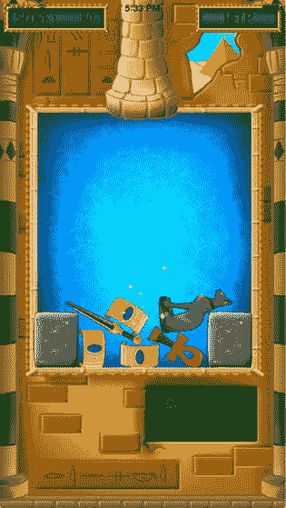

# 第三部分

## 图坦卡蒙之墓

图坦卡蒙之墓是一款玩家需要收集法老图坦宝藏的游戏（截图见图 III-1）。各种宝藏掉入墓穴中，通过将相同的宝藏拖到一起，你就可以收集它们并获得分数。不过要注意：如果一件宝藏留在墓穴中太久，就会变成一块无用的岩石并占用空间。宝藏会不断加速下落。如果你没有从墓穴中移除足够多的宝藏，墓穴就会被完全填满，游戏结束。在接下来的章节中，你将开发这款游戏。如果你想玩完整版以体验游戏如何运作，请运行第 16 章的示例！

图 III-1. 图坦卡蒙之墓的截图

