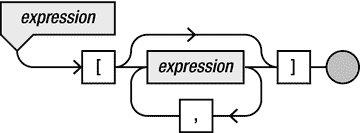
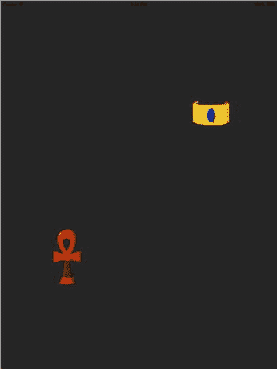

# 12. 高级输入处理

电子补充材料 本章的在线版本（doi:[10.​1007/​978-1-4842-0650-8_​12](http://dx.doi.org/10.1007/978-1-4842-0650-8_12)）包含补充材料，仅供授权用户使用。

在本章中，你将创建一个更高级的输入处理机制。同时，还将介绍一些重要的编程概念，例如数组和字典。在《画家》游戏中，输入处理相当基础。你只跟踪了玩家触摸的最后一个位置。对于《画家》而言，这已经足够，因为玩家仅用一根手指玩游戏。在更复杂的游戏中，这种基础的输入处理方法就不够用了。特别是在《图特的坟墓》中，玩家可能使用多根手指在屏幕上拖拽物体。在本章中，你将扩展 `InputHelper` 类，使其能够处理多点触控输入。

## 创建触摸对象

你需要解决的主要问题是，`InputHelper` 类目前只跟踪单个触摸的信息。它存储了最后记录的触摸位置，以及玩家是否进行了点击（换句话说，玩家是否刚刚开始用手指触摸屏幕）。以下是存储这些信息的两个属性：

`var touchLocation = CGPoint(x: 0, y: 0)`

`var hasTapped: Bool = false`

为了处理多点触控输入，你需要同时存储和跟踪多个位置的信息。除此之外，你还需要一种方法来区分不同的触摸，例如，让玩家可以用一根手指移动一个物体，同时用另一根手指按下一个按钮。这意味着每个触摸位置都需要一个唯一的标识符。为了方便实现这一点，让我们创建一个表示触摸的类型。到目前为止，你一直使用类来创建自己的类型。另一种创建类型的方法是使用结构体。如前所述，与类不同，结构体是按值复制而非按引用复制。这意味着每次复制一个类型为结构体的变量时，其值都会在内存中被复制。因此，结构体通常更适用于较小的数据结构。触摸就是一个典型的小数据结构的例子。以下是定义结构体来表示触摸的示例：

```
struct Touch {
    var id = 0
    var location = CGPoint()
    var tapped = true
}
```

如你所见，定义结构体与定义类相同，只是使用 `struct` 关键字代替 `class` 关键字。这个结构体有三个属性：一个标识符、一个位置以及一个布尔变量，用于指示触摸是否为点击。现在，你可以用一种非常简单的方式创建 `Touch` 对象：

`var myTouch = Touch()`

默认情况下，这个 `Touch` 对象的 `id` 为 0，但你需要每个 `Touch` 对象都有一个唯一的标识符。有一种相对简单的方法可以实现这一点。如果你还记得，类属性是属于类本身的属性，而非属于某个对象。`world` 属性就是一个很好的例子：它属于 `GameScene` 类。无论有多少个 `GameScene` 实例，始终只有一个 `world` 属性，你可以这样访问它：

`GameScene.world`

类似地，结构体有一种称为静态属性的特性。如果某个属性是静态的，那么它属于结构体本身，而非结构体的某个实例。请看以下结构体定义：

```
struct Touch {
    var id = 0
    var location = CGPoint()
    var tapped = true
    static var idgen: Int = 0
}
```

这个结构体有一个静态属性 `idgen`，初始化为 0。由于此属性属于结构体本身而非任何特定实例，你可以用它来生成唯一标识符。具体做法是：在创建实例时，将 `idgen` 属性的当前值赋给 `id` 属性，然后将 `idgen` 属性加 1，从而为新的 `Touch` 实例生成 ID。这个任务可以在初始化器中完成：

```
init() {
    id = Touch.idgen
    Touch.idgen++
}
```

还有一种更简洁的方法，即更巧妙地使用 `++` 后缀运算符。当你递增一个变量时，`++` 后缀运算符会返回该变量递增前的旧值。你可以将此结果存储到另一个变量中，如下所示：

```
var a = 12
var b = a++ // 执行这条指令后，a = 13, b = 12
```

在此示例中，第二条指令执行后，变量 `b` 包含了 `a` 的旧值（递增前），而 `a` 包含了递增后的值。你也可以将 `++` 运算符写在变量前面。这个 `++` 前缀运算符会返回递增后的新值，如下所示：

```
var c = 10
var d = ++c // 执行这条指令后，c = 11, d = 11
```

在这种情况下，第二条指令执行后，`c` 和 `d` 都包含递增后的值（11）。如果你将这个思路应用到 `Touch` 结构体中，那么就不再需要初始化器；只需递增 `idgen` 属性，并将其旧值赋给 `id` 属性：

```
struct Touch {
    var id = idgen++
    var location = CGPoint()
    var tapped = true
    static var idgen: Int = 0
}
```

结果是，你现在可以创建 `Touch` 实例，并且每个实例都会自动获得一个唯一标识符：

```
var aTouch = Touch()          // aTouch 的 id 为 0
var anotherTouch = Touch()    // anotherTouch 的 id 为 1
var yetAnotherTouch = Touch() // yetAnotherTouch 的 id 为 2
```


### 数组

现在你已经有了一个简单的方法来生成携带唯一标识符的触摸位置，你需要扩展 `InputHelper` 类，使其支持存储这些触摸的多个实例。在 Swift 中，实现这一目标非常便捷的方式是使用**数组**。数组本质上是一个编号列表。请看以下示例：

`var emptyArray: [Int] = []`

`var intArray = [4, 8, 15, 16, 23, 42]`

这里展示了两个数组变量的声明与初始化。第一个声明是一个可以包含 `Int` 值的空数组（无元素）。第二个变量 `intArray` 指向一个长度为 6 的数组。你可以通过索引访问数组中的元素，其中数组第一个元素的索引为 0：

`var v = intArray[0]  // 包含值 4`

`var v2 = intArray[4] // 包含值 23`

你使用方括号来访问数组中的元素。同样也可以使用方括号修改数组中的值：

`intArray[1] = 13 // intArray 现在是 [4, 13, 15, 16, 23, 42]`

还可以向数组中添加元素：

`intArray.append(-3) // intArray 现在是 [4, 13, 15, 16, 23, 42, -3]`

最后，每个数组都有一个 `count` 变量，你可以通过访问它来获取数组长度：

`var l = intArray.count // 包含值 7`

你可以将数组与 `for` 循环结合使用来实现有趣的功能。示例如下：

`for var i = 0; i < intArray.count; i++ {`

    `intArray[i] += 10`

`}`

这段代码遍历数组中的所有元素，并为每个元素加 10。因此，执行完这段代码后，`intArray` 指向 `[14, 23, 25, 26, 33, 52, 7]`。或者，你也可以使用带范围的 `for` 循环来实现相同的效果：

`for i in 0..<intArray.count {`

    `intArray[i] += 10`

`}`

除了你刚才看到的那种初始化数组的方式，还有另一种更类似类的方式可以创建数组：

`var myArray = Array<Int>(count: 3, repeatedValue: 10)`

这个例子创建了一个大小为 3 的数组，每个元素的值都是 10。因此，上述指令与下面这条指令相同：

`var myArray = [10, 10, 10]`

你甚至可以在 Swift 中创建多维数组，如下所示：

`var anotherArray: [[Int]] = [[1, 2, 3], [4, 5, 6]]`

变量 `anotherArray` 是一个由整型数组组成的数组。所以，如你所见，数组的元素本身也可以是数组。数组的数组在表示网格结构时特别有用。许多游戏都使用某种网格结构来表示游戏世界。例如，你可以使用二维数组来表示井字棋游戏的棋盘：

`var tictactoe : [[String]] = [["x", "o", " "], [" ", "x", "o"], [" ", "o", "x"]]`

下面是一种使用一维数组来表示二维网格的简单方法：

`var rows = 10, cols = 15`

`var myGrid = Array<Int>(count: rows * cols, repeatedValue: 0)`

现在，可以通过以下方式访问第 `i` 行、第 `j` 列的元素：

`var elem = myGrid[i * cols + j]`

图 12-1 展示了表达式语法图的一部分，其中包含了用于指定数组的语法。



图 12-1. 表达式部分语法图

### 字典

除了数组，Swift 还有一种集合类型，称为**字典**。字典与数组非常相似，区别在于它表示的不是一个编号列表，而是一种从一种类型到另一种类型的映射。字典是一系列键/值对，通过不同的键来访问关联的值。键和值可以是任意类型。这与数组形成对比，在数组中，“键”始终是数组索引。以下示例应该能说明这一点：

`var translator = [String:String]()`

`translator["house"] = "maison"`

`translator["tree"] = "arbre"`

`translator["dog"] = "chien"`

如你所见，字典允许你存储一个映射关系。在这个例子中，映射是从一个字符串（键）到另一个字符串（值）的映射，如果你想实现一个翻译表，这会非常有用。不过，使用的类型不必相同：

`var ages = [String:Int]()`

`ages["mary"] = 45`

`ages["john"] = 12`


### 可选类型

在继续代码示例之前，让我们仔细看看 Swift 语言中一个颇具创新性的特性：**可选类型**。可选类型是一种机制，它允许你拥有一个变量，其类型可以有选择地指向一个实际对象。这听起来可能没什么用，但让我们再考虑一下翻译器示例：

```
var translator = [String:String]()
translator["house"] = "maison"
translator["tree"] = "arbre"
translator["dog"] = "chien"
```

现在假设你输入以下指令：

```
var houseTranslated = translator["house"]
```

由于你已将 "house" 键存入字典，你可以将查找该值的结果存入一个变量。但现在假设你输入以下内容：

```
var carTranslated = translator["car"]
```

`translator` 字典中没有包含 car 的条目。那么在这种情况下应该发生什么呢？你可以想象编译器在编译程序时会报错。但编译器不可能在所有情况下都知道 `translator` 字典的内容。假设当程序启动时，这个字典的内容是从服务器检索而来的呢？或者当程序运行时，由用户输入呢？编译器根本无法总是知道字典里有什么，所以它无法检测到这类错误。但如果编译器检测不到，当条目不存在时，`carTranslated` 变量中会存储什么值呢？在 Swift 中，这个值是 `nil`。表达式 `translator["car"]` 返回的值在某些情况下可能是 `nil`。这就是为什么该表达式的类型被称为可选类型。你可以通过其名称后的问号来识别可选类型。`carTranslated` 的类型是 `String?`。你在声明变量时也可以这样写：

```
var carTranslated: String? = translator["car"]
```

因为 `carTranslated` 变量是可选类型，你可以给它赋值为 `nil`：

```
carTranslated = nil
```

你还可以在 `if` 指令中测试它是否为 `nil`：

```
if carTranslated == nil {
    print("翻译不可用。")
}
```

现在假设你想将翻译结果转换成大写字母。`String` 类型有一个 `capitalizedString` 属性可以实现这一点。然而，以下指令会导致编译器报错：

```
var strWithCapitals = carTranslated.capitalizedString
```

编译器报错的原因是 `carTranslated` 可能指向 `nil` 而非字符串值。如果出现这种情况，`capitalizedString` 属性就不能被使用。为了解决这个问题，你可以使用一种叫做**可选链**的方法，如下所示：

```
var strWithCapitals = carTranslated?.capitalizedString
```

可选链会检查 `carTranslated` 是否为 `nil`。如果不是，属性的结果会存储在 `strWithCapitals` 中。如果 `carTranslated` 是 `nil`，那么 `nil` 值会被存储在 `strWithCapitals` 中。这意味着 `strWithCapitals` 变量本身也是一个可选类型 `String?`。

如果你非常确定 `carTranslated` 永远不会包含 `nil` 值，你也可以将其解包为实际的 `String` 类型。这可以通过感叹号来实现：

```
var strWithCapitals = carTranslated!.capitalizedString
```

由于假设 `carTranslated` 永远不会是 `nil`，现在 `strWithCapitals` 的类型是 `String` 而不是 `String?`。但使用这种方法时要小心。如果你的程序存在一个 bug，导致 `carTranslated` 意外变成 `nil`，那么程序执行会因错误而停止。

Swift 为 `if` 指令提供了一个很好的扩展，使其仅在值解包成功时才执行一段代码块：

```
if let carTranslated = translator["car"] {
    // 执行某些操作
}
```

这个 `if` 指令的主体仅在表达式 `carTranslated` 不为 `nil` 时才执行。如果是这种情况，`carTranslated` 的类型是 `String`，并包含 `translator["car"]` 解包后的值。因此，上面的 `if` 指令与以下代码的功能相同：

```
let carTranslatedOptional = translator["car"]
if carTranslatedOptional != nil {
    let carTranslated = carTranslatedOptional!
    // 执行某些操作
}
```

如你所见，结合值解包的 `if` 指令是一个有用的扩展，能生成更短、更易读的代码。

### 注意

可选类型和解包机制是目前仅在 Swift 语言中可用的特性。其他编程语言，如 C# 或 Java，并不具备这些特性。通过在编程语言本身中显式处理可选值，Swift 迫使程序员思考某个值是确定的，还是有时可能不存在。因此，在编写代码时请记得预先考虑好如何处理每种情况。这是一件好事，因为它能带来更健壮的程序。然而，如果你没有精心设计你的类和方法，最终可能会得到充满问号和感叹号的代码，这会让你的代码非常难以理解。


## 存储多点触摸

现在，你将学习如何使用数组、字典和可选类型来处理多点触摸，通过创建一个新的 `InputHelper` 类。这个类现在包含一个名为 `touches` 的属性，它是一个 `Touch` 对象的数组：

`var touches: [Touch] = []`

你需要处理三种类型的触摸事件：

* 玩家开始用其中一根手指触摸屏幕。
* 玩家移动已触摸屏幕的手指。
* 玩家将手指从屏幕上移开。

针对上述每一种情况，让我们向 `InputHelper` 中添加一个处理方法。在本章稍后部分，你将把这些方法连接到实际的触摸事件上。第一种情况是玩家开始触摸屏幕。在这种情况下，需要创建一个 `Touch` 实例，将其位置设置为记录的触摸位置，最后将该 `Touch` 实例添加到数组中。以下是完整的方法：

```
func touchBegan(loc: CGPoint) -> Int {
    var touch = Touch()
    touch.location = loc
    touches.append(touch)
    return touch.id
}
```

如你所见，该方法期望一个代表触摸位置的 `CGPoint` 对象作为参数。该方法会返回所创建 `Touch` 实例的标识符。这很有用，因为这样方法的调用者在之后使用 `InputHelper` 实例时，就知道如何引用那个特定的触摸。

当玩家移动手指时，应调用 `InputHelper` 中的另一个名为 `touchMoved` 的方法：

```
func touchMoved(id: Int, loc: CGPoint) {
    if let index = findIndex(id) {
        touches[index].location = loc
    }
}
```

该方法期望一个触摸标识符和新的触摸位置作为参数。它依赖于一个名为 `findIndex` 的方法，该方法在 `touches` 数组中搜索与标识符对应的索引，并返回一个可选的 `Int` 值。在这个方法中，你使用 `for` 循环遍历 `touches` 数组中的所有元素。当找到与你正在查找的触摸数据标识符匹配的触摸时，你就返回该数据。如果找不到触摸数据，则返回 nil。以下是 `findIndex` 的声明和主体：

```
func findIndex(id: Int) -> Int? {
    for index in 0..<touches.count {
        if touches[index].id == id {
            return index
        }
    }
    return nil
}
```

一旦找到索引，你就可以将数组中 `Touch` 实例的 `location` 属性设置为新位置，这正是 `touchMoved` 方法中第二条指令所做的。

最后，当玩家将手指从屏幕上移开时，应调用 `touchEnded` 方法，该方法将 `Touch` 实例从数组中移除：

```
func touchEnded(id: Int) {
    if let index = findIndex(id) {
        touches.removeAtIndex(index)
    }
}
```

如你所见，从数组中移除元素是通过 `removeAtIndex` 方法完成的。该方法接受一个索引作为参数：该索引指示应移除元素的位置。示例如下：

```
var fib = [1, 1, 2, 3, 5, 8, 13]
fib.removeAtIndex(3) // fib 现在为 [1, 1, 2, 5, 8, 13]
```

## 让处理触摸输入更简单

你可以向 `InputHelper` 类添加更多方法，使其在游戏中更易于使用。第一个是一个简单的方法，用于检索具有给定 id 的触摸的位置：

```
func getTouch(id: Int) -> CGPoint {
    if let index = findIndex(id) {
        return touches[index].location
    } else {
        return CGPoint.zeroPoint
    }
}
```

检查玩家是否正在触摸屏幕的某个特定区域也很有用。例如，如果你想在游戏中添加一个按钮，你需要检查玩家是否点击了按钮精灵所代表的区域。可以使用以下方法处理这种情况：

```
func containsTouch(rect: CGRect) -> Bool {
    for touch in touches {
        if rect.contains(touch.location) {
            return true
        }
    }
    return false
}
```

在该方法体中，有一个 `for` 循环，它会检查数组中的每个触摸，看其位置是否落在矩形内。根据检查结果，该方法返回 `true` 或 `false`。为了找到矩形内触摸的 id，可以调用以下方法：

```
func getIDInRect(rect: CGRect) -> Int? {
    for touch in touches {
        if rect.contains(touch.location) {
            return touch.id
        }
    }
    return nil
}
```

此方法有助于检查触摸 id 是否仍然有效：

```
func isTouching(id: Int) -> Bool {
    return findIndex(id) != nil
}
```

最后，这个方法指示玩家是否在某个区域内点击了（刚刚开始触摸）：

```
func containsTap(rect: CGRect) -> Bool {
    for touch in touches {
        if rect.contains(touch.location) && touch.tapped {
            return true
        }
    }
    return false
}
```

在 `InputHelper` 类中还有更多方法，这些方法在你将在本书中开发的后续游戏中会很有用。概述请参阅属于本章的 TutsTomb1 示例中的 `InputHelper` 类。


### 将触摸事件关联至输入辅助类

`InputHelper`类已经准备就绪，但你仍需确保在必要时能调用`touchBegan`、`touchMoved`和`touchEnded`方法。在 Painter 游戏中，你通过在`GameScene`类中添加触摸事件处理方法实现了这一点。例如，以下是处理触摸开始的方法：

```
override func touchesBegan(touches: Set<UITouch>, withEvent event: UIEvent?) {

let touch = touches.first!

inputHelper.touchLocation = touch.locationInNode(self)

inputHelper.nrTouches += touches.count

inputHelper.hasTapped = true

}
```

该方法的第一个参数类型为`Set<UITouch>`。请注意，`Set<UITouch>`也是一种集合类型，与`Array`类似。数组与集合的区别在于：数组元素有序，而集合无序。此外，集合不允许重复元素，而数组允许。根据游戏需求，你可以选择不同的数据结构。例如，集合可能适用于表示玩家背包，尤其是当玩家每种物品只能拥有一个时。

触摸点存储在集合中是合理的，因为你只允许存储特定的触摸点一次，且触摸顺序并不重要。在`InputHelper`类中，你完全可以用集合而非数组来存储触摸点。在`Set`关键字后的尖括号内，你会看到`UITouch`类型。回顾一下，在 Swift 以及许多支持**泛型**的编程语言中，这表示该集合包含`UITouch`类型的对象。`Set`类型本身是一个泛型，只有指定了集合具体包含何种对象时才能使用。例如，你也可以声明一个字符串集合：

```
var stringSet = Set<String>()
```

在`touchesBegan`方法内部，你需要处理多点触摸的可能性。这意味着你要处理集合中的所有触摸点。有一种特殊的`for`循环语法，可以对集合中的每个元素执行操作。请看以下示例：

```
var intArray = [2, 3, 4, 6]

for value: Int in intArray {

print(value)

}
```

这个示例使用`for`循环对数组中的每个元素执行任务。在很多情况下，你可以省略类型，因为它可以从你遍历的集合中推断出来：

```
var intArray = [2, 3, 4, 6]

for value in intArray {

print(value)

}
```

类似地，你也可以对集合中的每个元素执行操作：

```
for touch in touches {

// 处理触摸

}
```

在`for`循环体内，你可以使用`touch`变量（类型为`UITouch`）来计算触摸位置并将其存储在常量中，如下所示：

```
let location = touch.locationInNode(self)
```

接着，调用`InputHelper`中的`touchBegan`方法，将触摸点添加到数组中。该方法会返回一个 ID，你需要将其存储在变量中：

```
let id = inputHelper.touchBegan(location)
```

你还可以使用字典来存储`UITouch`对象与`InputHelper`类生成的 ID 之间的映射：

```
var touchmap = [UITouch:Int]()
```

在`touchesBegan`事件处理方法的最后一条指令中，将该 ID 存储到映射中：

```
touchmap[touch] = inputHelper.touchBegan(location)
```

在`touchesMoved`方法中，你需要使用这个 ID 来更新输入辅助类中的触摸位置。与`touchesBegan`一样，你使用`for`循环对每个移动的触摸位置执行此操作。以下是完整的方法：

```
override func touchesMoved(touches: Set<UITouch>, withEvent event: UIEvent) {

for touch in touches {

let touchid = touchmap[touch]!

inputHelper.touchMoved(touchid, loc: touch.locationInNode(self))

}

}
```

首先，你在字典中查找与该对象对应的 ID。然后，调用`InputHelper`类中的`touchMoved`方法来更新触摸位置信息。

```
let touchid = touchmap[touch]!
```

请注意末尾感叹号。这是必需的，因为你需要解包字典查找返回的可选`Int`值。

当玩家停止触摸屏幕时，应从字典中移除触摸点与 ID 的对应关系。可通过将字典元素赋值为`nil`来实现，如下所示：

```
let touchid = touchmap[touch]!

touchmap[touch] = nil
```

最后，调用`touchEnded`方法来更新输入辅助类：

```
inputHelper.touchEnded(touchid)
```

有关处理多点触摸输入的完整代码，请参阅本章附带的 TutsTomb1 示例中的`InputHelper`和`GameScene`类。

## 拖动精灵

作为示例，让我们使用新的`InputHelper`类在屏幕上拖动精灵。请再次查看 TutsTomb1 程序。在其中，你将找到更新后的`InputHelper`类，以及一个简单的示例：加载几个精灵，将其绘制在屏幕上，并允许你通过拖动在屏幕上移动精灵。该程序还包含一个名为`Treasure`的基础类，用于在图坦卡蒙墓游戏中表示宝藏。

在 TutsTomb1 示例中，该游戏的大部分功能尚未实现。屏幕上只绘制了两个`Treasure`对象，玩家可以用手指拖动它们。对象拖动的实现位于该类的`handleInput`方法中。该方法包含两部分。第一部分，检查玩家是否刚刚开始拖动对象。如果是，则需要存储该触摸的 ID，以便后续用该 ID 跟踪玩家手指的移动位置。在`Treasure`类中，有一个名为`touchid`的属性（类型为`Int?`），用于存储当前正在拖动该对象的触摸 ID。如果对象未被拖动，该 ID 设置为`nil`。一旦玩家开始拖动，就将触摸 ID 存储在该属性中：

```
if inputHelper.containsTap(self.box) {

    touchid = inputHelper.getIDInRect(self.box)

}
```

`handleInput`方法的下一步是，只要用户的手指仍在触摸屏幕，就更新宝藏的位置，使其跟随用户手指移动。一旦玩家抬起手指，就将`touchid`属性重置为`nil`。以下指令涵盖了所有这些逻辑：

```
if let touchUnwrap = touchid {

    if inputHelper.isTouching(touchUnwrap) {

        self.position = inputHelper.getTouch(touchUnwrap)

    } else {

        touchid = nil

    }

}
```

就是这样！如你所见，实现拖动功能并不困难，但如果有一些用于处理（多点）触摸输入的实用方法，确实能简化工作。在这种情况下，`containsTap`方法使得判断玩家何时开始拖动对象变得非常简单。



图 12-2. TutsTomb1 示例

## 本章所学内容

在本章中，你学习了以下内容：

*   如何处理游戏中的多点触摸输入
*   什么是数组和字典，以及如何使用它们
*   什么是可选类型，以及应如何使用它们


