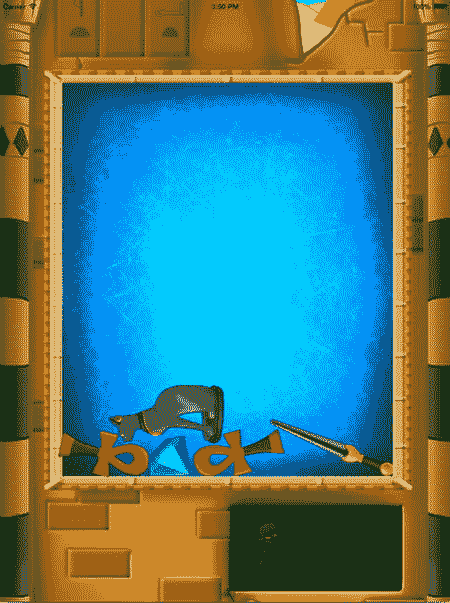

# 13. 游戏物理

**电子补充材料** 本章的在线版本（doi:[10.1007/978-1-4842-0650-8_13](http://dx.doi.org/10.1007/978-1-4842-0650-8_13)）包含补充材料，可供授权用户使用。

在《画家》游戏中，你创建了一个非常基础的机制，用于处理游戏世界中物体的移动和相互碰撞。但在《图坦之墓》中，这已不再够用。物体需要根据重力下落，需要从墙壁反弹，还需要以不同的方式处理碰撞。在本章中，你将调整游戏结构，使其更适合这些高级交互。你会发现，在 SpriteKit 中为游戏对象添加符合物理规律的行为其实相当简单。

## 游戏对象的基础类

大多数游戏都拥有复杂的游戏对象结构。首先，可能有一个由多层移动物体（山脉、天空、树木等）构成的背景。其次，还有交互式物体在四处移动。这些物体可能是玩家的敌人，因此需要一定程度的智能；它们也可能更加静态，比如能量道具、树木、门或梯子。一个代表房屋的游戏对象可能由许多其他游戏对象组成，例如门、楼梯、窗户和厨房（而厨房又可能由不同的游戏对象组成）。

考虑到这些不同类型的游戏对象以及它们之间的关系，可以说游戏对象通常构成了一个表示游戏世界的层级结构。大多数游戏都使用某种游戏对象的层级结构。尤其是在 3D 游戏中，由于三维环境的复杂性，这种层级结构非常重要。3D 游戏中的对象通常不是由精灵图表示，而是由一个或多个 3D 模型表示。层级结构的优势在于这些对象可以被分组在一起，这样当你拿起一个里面装有写着魔法文字的卷轴的花瓶时，卷轴会随着花瓶一起移动。

在《画家》游戏中，游戏对象的基本类型由`ThreeColorGameObject`类表示。到目前为止，你一直这样表示游戏对象，仅仅是因为这对于你正在处理的基础示例来说已经足够。如果你想开发更大、更复杂的游戏，就必须放弃游戏对象是一个三色精灵图的基本前提。

在 SpriteKit 中，最基本的游戏对象是`SKNode`类型的对象。`SKNode`唯一假设的是游戏对象应该是某种层级结构（代表游戏世界）的一部分。本书中创建的游戏依赖于一种设计，该设计在游戏对象类本身中定义了游戏对象如何成为游戏循环的一部分。例如，在《画家》中，`Cannon`类处理与炮管相关的输入，而`Ball`类处理与球相关的输入。此外，球的位置以及任何游戏对象交互都在`Ball`类的`update`方法中处理。最后，每当游戏重新启动时，每个游戏对象都会重置为其初始状态。这意味着如果游戏对象拥有`handleInput`方法、`update`方法和`reset`方法，那可能会很有用。

在 TutsTomb2 示例中，你可以找到一个名为`GameObjectNode`的类，它是`SKNode`的子类。`GameObjectNode`类恰好添加了上一段中提到的三个游戏循环方法。由于任何`GameObjectNode`类型的对象也是`SKNode`对象，它可以有子节点。例如，如果在`GameObjectNode`实例上调用了`handleInput`方法，你需要确保任何类型为`GameObjectNode`的子节点也能处理输入。因此，在`handleInput`方法的主体内部，你使用一个`for`循环遍历子节点，将它们转换为`GameObjectNode`实例，如果转换成功，则在子对象上调用`handleInput`方法，如下所示：

```
func handleInput(inputHelper: InputHelper) {
    for obj in children {
        if let node = obj as? GameObjectNode {
            node.handleInput(inputHelper)
        }
    }
}
```

注意用于在`if`指令中将可选值赋给变量的特殊写法。`as?`运算符尝试将对象转换为给定的类型（本例中为`GameObjectNode`）。如果转换不可能，该运算符返回`nil`。因此，如果`node`包含一个实际的`GameObjectNode`实例，就在其上调用`handleInput`方法。如果你查看`GameObjectNode`类，你会看到`updateDelta`和`reset`方法的实现也非常相似。

## 游戏对象子类

由于《图坦之墓》游戏涉及掉落的宝藏，TutsTomb2 示例中包含一个`Treasure`类，它现在是`GameObjectNode`的子类。`Treasure`类重写了`handleInput`方法以实现拖拽。

另一个是`GameObjectNode`子类的类是`GameWorld`。游戏世界在`setup`方法中填充游戏对象，该方法在场景初始化时于`GameScene`类中被调用。以下是`setup`方法中将几个`Treasure`实例添加到游戏世界的部分：

```
for i in 0...4 {
    var treasure = Treasure()
    treasure.position = CGPoint(x: -250 + i * 120, y: 200)
    treasures.addChild(treasure)
}
```

如你所见，这段代码创建了五个`Treasure`实例，根据循环计数器`i`定位它们，并将它们添加到属于游戏世界的`treasures`节点。

`GameWorld`作为`GameObjectNode`子类的好处在于，由于`GameObjectNode`的设计方式，游戏循环方法现在会自动在其子节点上被调用。这意味着如果你将`Treasure`实例添加为另一个游戏对象的子节点，那么`handleInput`方法调用现在会自动传播给这些宝藏。`GameWorld`的`handleInput`方法在`GameScene`中被调用，该方法随后会对游戏世界中所有游戏对象的子节点（以及子节点的子节点，包括宝藏）调用`handleInput`方法。这产生了一个简洁、清晰的设计，使得后续创建更复杂的游戏对象交互变得容易得多。如同你在 TutsTomb2 示例中看到的，`Treasure`的`handleInput`方法调用了其超类（`GameObjectNode`）的`handleInput`方法。通过这种方式，你可以确保`handleInput`方法调用的链条不会中断，即使将来你决定向`Treasure`实例添加子节点。


## 为游戏对象添加物理属性

到目前为止，你一直通过在游戏循环中改变游戏对象的位置来使其移动。在《画家》游戏中，球等部分对象拥有一个 `velocity` 属性，你通过操作该属性来让球移动。在物理世界中，情况要稍微复杂一些。物体会移动是因为有力作用在它们身上。例如，世界上的任何物体都受到重力的影响。如果你朝某个方向推一个物体，你就是在对该物体施加一个力。而当物体之间发生碰撞时，它们需要对这些碰撞做出自然的反应。

如果你希望游戏世界以更符合物理规律的方式运行，就需要一个能模拟物理世界的模型，并将其作为游戏的一部分。SpriteKit 框架的妙处在于，它内部已经集成了一个物理引擎，你可以用它为游戏对象添加逼真的物理行为。在《画家》游戏中，你是自己编写物理代码的。例如，在 `Ball` 类中你做过这样的事：

```
velocity.x *= 0.99
velocity.y -= 15
```

第一行是一个简单的空气摩擦模型。第二行是对重力如何影响物体速度的近似处理。在图坦卡蒙之墓游戏中，你将使用 SpriteKit 的物理引擎来模拟物理效果，而不是自己编写代码。你会看到，为游戏世界添加物理属性非常简单。`SKNode` 的任何实例（或其子类）都有一个名为 `physicsBody` 的属性，它允许你控制该对象在物理系统中的参与方式。如果你想为一个对象添加物理行为，`physicsBody` 属性应指向一个 `SKPhysicsBody` 实例。这个实例通常是游戏对象在物理世界中的简化表示。例如，在 `Treasure` 类中，你可以在初始化器里添加以下代码：

```
self.physicsBody = SKPhysicsBody(circleOfRadius: 100)
```

这会为宝物创建一个物理表示。在这个例子中，物理表示是一个具有给定半径的圆形。你也可以使用其他形状，比如矩形：

```
self.physicsBody = SKPhysicsBody(rectangleOfSize: CGSize(width: 100, height: 100))
```

你也可以使用精灵（纹理）的形状来创建物理体形状：

```
self.physicsBody = SKPhysicsBody(texture: sprite.texture!, size: sprite.size)
```

如果你希望游戏能在多种不同设备上流畅运行，那么确保物理计算不会过于复杂是一个好主意。对于 2D 游戏来说，这通常已不再是主要问题，但如果你有很多游戏对象带有物理行为并相互移动碰撞，你可能会选择使用简化形状来更高效地处理物理问题。而如果一个形状看起来已经很接近矩形或圆形，那么使用简化形状进行物理计算，视觉效果通常也不会差。

在图坦卡蒙之墓游戏中，你将使用实际的精灵形状进行物理计算。既然 `Treasure` 实例有了 `physicsBody`，它们会立即表现出物理行为。在 TutsTomb2 示例中，为了测试目的，已经在游戏世界中添加了几个 `Treasure` 实例。

如果你不加任何额外对象直接运行游戏，你会看到你添加的五个对象会立刻掉出屏幕。这是因为这些对象默认会受到重力的影响。为了将游戏对象限制在游戏世界中，你需要创建地面和墙壁。下面我们给游戏世界添加一个地板。这个地板也需要一个物理体，以便它能与其他游戏对象交互：

```
let floor = SKNode()
floor.position.y = -400
var square = CGSize(width: GameScene.world.size.width, height: 200)
floor.physicsBody = SKPhysicsBody(rectangleOfSize: square)
```

如你所见，地板是一个附加了物理体的 `SKNode` 对象，所以并没有实际的地板精灵。你只是希望物体不再继续下落。为了在物理世界中表示地板，你使用了一个简化形状——这里是一个矩形。但是等等，既然地板也是一个物理对象，它会不会像其他游戏对象一样直接掉下去呢？是的，它会。因此，你需要明确告诉物理系统，地板在游戏世界中位于一个固定位置，并且它不响应动力学（包括力）。操作方法如下：

```
floor.physicsBody?.dynamic = false
```

最后，将 `floor` 对象添加到游戏世界：

```
addChild(floor)
```

类似地，你还可以为游戏世界添加天花板、左墙和右墙。完整代码请参考 TutsTomb2 示例。

现在游戏世界有了地板、天花板和侧墙，游戏物体会下落，并与围墙和彼此之间发生碰撞。当你使用 SpriteKit 提供的物理引擎时，所有这些行为都是免费获得的。有时在调试时，在屏幕上显示实际的物理体是很有用的。你可以通过设置 `SKView` 对象中的 `showPhysics` 属性来实现。`GameViewController` 类中的以下这行代码就实现了这一点：

```
skView.showsPhysics = true
```


### 交互

既然已经为每个游戏对象定义了物理实体，现在可以通过施加力来操控对象。例如，可以像这样为物理实体赋予一个速度：

`physicsBody?.velocity = CGVector(dx: 10, dy: 10)`

如你所见，`physicsBody` 属性是可选的，这很合理，因为如果对象不属于物理系统，该属性就是 `nil`。`physicsBody` 的 `velocity` 属性的类型是 `CGVector`，它代表一个二维向量。一旦为对象指定了速度，随着游戏进程推进，它会根据该速度自动计算出自身位置。在 `Treasure` 类中，你可以利用这一特性实现对物理对象的拖拽操作：

```
var moveVector = inputHelper.getTouch(touchid)
moveVector.x -= position.x
moveVector.y -= position.y
physicsBody?.velocity = CGVector(dx: moveVector.x * 10, dy: moveVector.y * 10)
```

首先，计算出一个向量，它代表物理实体应当移动的方向。具体做法是获取触摸位置，然后从中减去当前对象的位置。为了让对象足够快地移动到触摸位置，速度向量的 `x` 和 `y` 分量需要乘以一个常量（10）。一旦将这个向量赋值给物理实体的 `velocity` 属性，对象的位置就会自动更新。

另一种需要处理的交互类型是对象之间的碰撞。在游戏中，当对象相互碰撞时，通常需要执行某种操作。如果玩家与道具发生碰撞，玩家生命值应增加；如果玩家与敌人碰撞，玩家将受到伤害；如果玩家与星星碰撞，则应为玩家增加分数。

在 SpriteKit 中，你可以指定由哪个对象负责处理碰撞（或接触）。如果这个对象拥有特定的方法，那么每当物理实体之间发生接触时，该方法就会被调用。SpriteKit 使用一种 Swift 特性——协议（protocol）来强制执行这一点。协议本质上是一组方法（或属性）头的定义，旨在帮助开发者编写更连贯的代码。以下是一个名为 `SKPhysicsContactDelegate` 的协议示例：

```
protocol SKPhysicsContactDelegate : NSObjectProtocol {
    optional func didBeginContact(contact: SKPhysicsContact)
    optional func didEndContact(contact: SKPhysicsContact)
}
```

如你所见，该协议包含两个方法头：`didBeginContact` 和 `didEndContact`。现在我们来修改 `GameWorld` 类，使其遵循 `SKPhysicsContactDelegate` 协议。实现方式与继承非常相似：

```
class GameWorld : GameObjectNode, SKPhysicsContactDelegate {
    // 待完成：类主体
}
```

如果一个类遵循某个协议，也可以说这个类实现了该协议。在此例中，`GameWorld` 现在实现了 `SKPhysicsContactDelegate` 协议。该协议描述了任何实现它的类，并可选地定义 `didBeginContact` 和 `didEndContact` 方法。还有一些协议强制要求实现它的类必须定义方法、属性，甚至是初始化器。请看以下协议：

```
protocol NSCoding {
    func encodeWithCoder(aCoder: NSCoder)
    init(coder aDecoder: NSCoder)
}
```

如果一个类实现了这个协议，它就必须拥有协议中定义的方法和初始化器。`SKNode` 实现了这个协议，这也是为什么 `SKNode` 的任何子类（包括 `GameObjectNode`）都需要定义一个特定的初始化器：

```
required init?(coder aDecoder: NSCoder) {
    fatalError("init(coder:) has not been implemented")
}
```

在 `GameWorld` 类中，添加以下来自 `SKPhysicsContactDelegate` 协议定义的方法：

```
func didBeginContact(contact: SKPhysicsContact) {
    let firstBody = contact.bodyA.node as? Treasure
    let secondBody = contact.bodyB.node as? Treasure
    print("Contact at position \(contact.contactPoint)")
}
```

从方法主体中可以看到，`contact` 参数包含了哪些物理实体发生了接触，以及接触在游戏世界中的位置等信息。为了测试，每当两个物理体之间的接触开始时，会在屏幕上打印接触位置。你也可以实现 `didEndContact` 方法，这样就能在两个对象停止接触时执行特定动作。例如，当玩家从桌子上拿走一颗钻石时，你可以触发警报。在接下来的章节中，你将定义游戏对象接触时更复杂的行为。

你还需再做一件事，以确保每当两个物理体接触时都能调用 `didBeginContact`：你需要告知场景，负责处理接触的对象是 `GameWorld` 实例。为此，在 `GameScene` 的 `didMoveToView` 方法中添加以下这行代码：

`physicsWorld.contactDelegate = GameScene.world`

至此，TutsTomb2 示例就完成了。图 13-1 展示了当前游戏的截图。请自行运行这个示例，看看它是如何工作的。尝试调整物理引擎的设置，例如，你能改变重力吗？同时，试着改变游戏对象物理体的形状，观察游戏玩法会发生什么变化。



**图 13-1.** TutsTomb2 示例程序的截图

**注意** 在游戏中使用物理引擎时，一个有趣的方面是调整物理引擎的参数。大多数物理引擎（包括 SpriteKit 内置的）都允许你修改诸如重力大小，或哪些对象受重力影响等参数。这对于设定在具有不同重力的外星世界的游戏非常有用。此外，游戏的可玩性比物理正确性更重要。在策略游戏中，飞机飞行速度可以像士兵在地上行走一样快。这完全不符合现实，但它让游戏变得可玩。不要犹豫，大胆改变物理引擎的设置来提升游戏体验。不妨查看一下 `SKPhysicsBody` 类的属性和方法，以了解其可能性。

## 本章所学

在本章中，你学习了以下内容：

-   如何使用基础的游戏对象类，在场景图中组织游戏对象
-   如何为游戏添加物理行为
-   如何通过拖拽的方式与物理世界中的对象进行交互
-   如何在两个对象相互碰撞时执行动作

