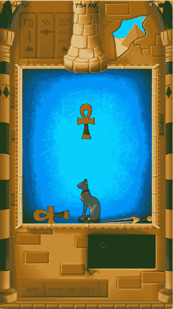
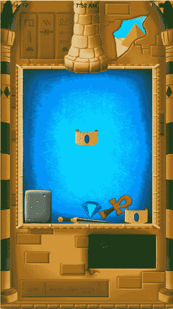

# 14. 游戏玩法编程

电子补充材料：本章的在线版本（doi:[10.1007/978-1-4842-0650-8_14](http://dx.doi.org/10.1007/978-1-4842-0650-8_14)）包含补充材料，仅供授权用户访问。

本章将探讨“图坦卡蒙之墓”游戏的玩法编程。你将学习如何使用动作（actions）来轻松地为游戏世界添加行为。此外，你还将处理游戏对象之间的交互（例如，当两个相同类型的宝藏发生碰撞时）。


## 游戏对象行为

此前，您在游戏中添加行为的方式是在每个游戏对象类中定义 `handleInput` 和 `update` 方法，然后确保在游戏循环中为每个实例调用这些方法。这种方法的好处在于每个游戏对象负责自身的行为。例如，Painter 游戏中球的行为在 `Ball` 类中定义；Tut's Tomb 游戏中宝藏的行为则在 `Treasure` 类中定义。

在类的方法中定义行为确实不错：查看类定义时，您就能立即了解该类实例所包含的行为。但这种方法也有其局限性。最重要的是，无法在不同类之间复制行为。Painter 游戏中的油漆罐会反复掉落，且间隔时间随机。在 Tut's Tomb 中，宝藏也会掉落，但除了在类之间复制粘贴代码外，没有简单的方法可以将油漆罐的行为复制给宝藏。

总的来说，游戏对象在行为上往往有许多共同点。大多数平台游戏都会有某种巡逻敌人，从左到右移动，然后再返回。像玩家奖励生命这样的对象，会随机或在固定时间间隔出现在场景中。游戏对象可能拥有简单的特效，比如旋转或缩放（例如，对于即将爆炸的炸弹）。如果能够以某种方式将这些行为从游戏对象本身分离出来，从而更轻松地在类之间复制，那岂不是很好？

### 动作

SpriteKit 框架提供了一种非常优雅的解决方案，用于以更通用的方式定义游戏对象行为：即使用所谓的“动作”。在 SpriteKit 中，您可以将这些动作附加到 `SKNode` 的实例上，并决定它们的执行频率和顺序。您可以将动作视为预定义行为的简单模块，可以按任意方式组合。您甚至可以定义自己的自定义动作，并将其添加到游戏对象中。让我们来看几个例子。

当您希望游戏对象以动作的形式拥有预定义行为时，需要做两件事。首先，您需要定义动作，然后需要告诉游戏对象执行该动作。定义动作需要使用 `SKAction` 类。请看下面的动作定义：

`let rotate = SKAction.rotateByAngle(CGFloat(2 * M_PI), duration: 3)`

`SKAction` 类有许多可供调用的类方法。每个方法都会创建某种类型的动作。在这个例子中，定义了一个旋转动作，该动作会在三秒内使对象围绕其原点旋转 2π 弧度（360 度）。例如，您可以在游戏对象类的初始化器中定义此动作。然后，您可以告诉游戏对象执行此动作，如下所示：

`self.runAction(rotate)`

现在，当您创建游戏对象时，它将围绕其原点旋转一次。这是另一个动作的例子：

`let fadein = SKAction.fadeInWithDuration(5)`

`self.runAction(fadein)`

这个动作会在 5 秒内淡入一个游戏对象（从完全透明到完全不透明）。再来看另一个例子：

`let playSound = SKAction.playSoundFileNamed("snd_music.mp3", waitForCompletion: false)`

这个动作会播放音效。使用动作播放音效比本书前面介绍的方法更简单。然而，对于像这样的动作，无法控制音量，因此虽然使用动作播放声音非常方便，但您可能需要在游戏中对声音进行更多控制。

除了只执行单个动作，您还可以创建一个动作序列，并执行该序列，如下所示：

`let seq = SKAction.sequence([fadein, rotate])`

`sequence` 方法需要一个 `SKAction` 对象数组，它会创建一个新动作，该动作就是数组中各动作的顺序组合。您可以像执行其他任何动作一样执行这个序列：

`self.runAction(seq)`

此外，除了只执行一次动作，您还可以创建重复执行的动作，如下所示：

`let repeat = SKAction.repeatActionForever(seq)`

`self.runAction(repeat)`

您甚至可以创建一个仅执行代码块的动作。这里有一个例子：

`let customAction = SKAction.runBlock({`

    `// 在此处编写您自己的代码`

`})`

如您所见，SpriteKit 中的动作是定义游戏对象行为的非常强大的工具。在下一节中，您将使用动作为 Tut's Tomb 游戏定义一些行为。


### 使用动作实现宝物掉落

在图坦卡蒙之墓中，宝物需要每隔几秒掉落一次。动作非常适合用来简洁地定义这一行为。宝物掉落动作需要无限重复，而且在每次掉落之间游戏需要等待片刻，以免宝物立即堆满屏幕。在本节中，你将在`GameWorld`类中定义这个动作。

为了让游戏随着时间推移更有趣，每隔一段时间就会出现新类型的宝物。每次宝物掉落时，你都需要递增一个计数器。计数器的值决定了宝物类型的多样性。让我们修改`Treasure`类来支持这一行为。首先需要的是一个接受宝物类型作为参数的初始化器：

```
init(type: UInt32) {
    super.init()
    self.type = type
    sprite = SKSpriteNode(imageNamed: "spr_treasure_\(self.type)")
    sprite.zPosition = 1
    self.position.y = 500
    self.addChild(sprite)
    self.physicsBody = SKPhysicsBody(texture: sprite.texture!, size: sprite.size)
    self.physicsBody?.contactTestBitMask = 1
}
```

这个初始化器根据宝物类型创建了一个精灵节点。宝物类型用一个整数值表示。`UInt32`类型代表一个 32 位无符号整数值。"无符号"意味着该整数没有正负号。换言之，该类型不区分正数和负数。这很好，因为各种宝物类型都是用正数表示的。现在你可以添加一个便捷初始化器，在指定类型范围内随机创建宝物：

```
convenience init(range: UInt32) {
    let finalRange = min(range, 20)
    let tp = arc4random_uniform(finalRange)
    self.init(type: tp)
}
```

这个便捷初始化器做了三件事。首先，它确保范围不会超过可用精灵的最大数量（在图坦卡蒙之墓中为 20）。第二行在范围内生成一个随机整数，最后你调用了指定初始化器。

现在你已经以这种方式扩展了`Treasure`类，就可以轻松定义一个掉落宝物的动作了。首先，在`GameWorld`类中声明一个`counter`属性：

```
var counter = 0
```

在`GameWorld`初始化器中，你将定义掉落宝物所需的动作。你通过创建`Treasure`实例并将其添加到游戏世界来掉落宝物。`Treasure`初始化器已经将对象放置在正确的位置（参见本节中的初始化器代码）。根据计数器当前的值，你可以计算出所需的范围。例如，你可以从范围 5 开始，每掉落 10 个宝物就增加 1：

```
let r: UInt32 = 5 + self.counter/10
```

根据这个范围创建`Treasure`实例并将其添加到游戏世界，现在只需一行代码即可完成：

```
self.treasures.addChild(Treasure(range: r))
```

在宝物掉落动作中唯一需要做的另一件事就是递增计数器。因此，这就是掉落宝物的动作：

```
let dropTreasureAction = SKAction.runBlock({
    let r: UInt32 = 5 + self.counter/10
    self.treasures.addChild(Treasure(range: r))
    self.counter++
})
```

如你所见，这个动作被定义为一个需要执行的指令块。为了在宝物掉落之间等待，你可以使用`waitForDuration`方法来创建一个等待动作。以下是这两个动作的序列，游戏在掉落宝物后等待两秒：

```
let seq = SKAction.sequence([dropTreasureAction, SKAction.waitForDuration(2)])
```

然后整个动作无限重复这个序列：

```
let totalAction = SKAction.repeatActionForever(seq)
self.runAction(totalAction)
```

作为这个动作的结果，每两秒就会掉落一个宝物。为了让宝物看起来像从烟囱里掉出来，让我们在游戏世界中添加一个烟囱精灵，它绘制在宝物掉落前出现的位置上方。烟囱绘制在更高的 z 位置，这样宝物就会绘制在它后面：

```
let chimney = SKSpriteNode(imageNamed:"spr_chimney")
chimney.zPosition = 10
chimney.position.y = 510
addChild(chimney)
```

属于本章的`TutsTomb3`示例包含了本节解释的代码。当你运行它时，你会看到宝物以两秒的固定间隔掉落（见图 14-1）。尝试修改示例代码，看看你是否能改变这些动作的行为。你能让宝物出现得更频繁吗？



图 14-1. TutsTomb3 示例中宝物掉落


### 特殊类型的宝藏

为了让游戏更有趣一些，这里设计了若干特殊类型的宝藏。第一种类型是岩石。如果一个宝藏待在场景中太久，它就会变成一块无用的岩石，并且不会从场景中移除（即使它与另一块岩石碰撞）。第二种特殊宝藏类型是魔法水晶，它会移除任何与其碰撞的东西（甚至包括无用的岩石）。在代码中，你需要一种方法来区分各种类型的宝藏。一种方法是定义代表特殊宝藏类型的常量值。例如，你可以在 `Treasure` 类中定义如下常量：

```
static let RockType: UInt32 = 99

static let MagicType: UInt32 = 100
```

注意，这里我使用了 `static` 属性，这样可以在不需要 `Treasure` 实例的情况下引用它们。这些常量的类型是 `UInt32`，与普通宝藏类型相同。

另一种选择是使用一个单独的类或结构体来定义特殊类型。看看这段代码：

```
struct TreasureType {

static let Rock : UInt32 = 99

static let Magic : UInt32 = 100

}
```

这里，使用了一个单独的 `struct` 来定义各种宝藏类型。这也是 TutsTomb3（及后续）示例中所采用的方法。由于结构体中的常量是 `static` 的，你无需实例化该结构体即可访问这些属性。例如：

```
if type == TreasureType.Rock {

sprite = SKSpriteNode(imageNamed: "spr_rock")

}
```

在这段代码（取自 `Treasure` 的初始化器）中，你检查作为参数传入的类型是否是岩石。如果是，则加载岩石精灵。

在某些情况下，你想要创建魔法水晶而不是普通宝藏。这是通过以下（部分） `if` 指令来完成的：

```
if arc4random_uniform(6) == 0 {

sprite = SKSpriteNode(imageNamed: "spr_magic")

self.type = TreasureType.Magic

}
```

这里你可以看到，我使用了一个随机数生成器，以便有时创建魔法水晶而不是普通宝藏。

有时候，你需要一种类型来表示不同类别的事物，类似于不同类型的宝藏。Swift 有一个专门用于此目的的特性，称为枚举。枚举非常适合表示具有类别值的变量，或表示特定状态的变量。例如，你可能想通过枚举来存储玩家所代表的角色类型。你可以自行决定你的类型中包含哪些不同的状态。因此，在使用枚举之前，你必须先定义它：

```
enum CharacterClan {

case Warrior

case Wizard

case Elf

case Spy

}
```

`enum` 关键字表示你要定义一个枚举。之后，写上枚举的名称，并在花括号内编写不同的 case。每个 case 前面都有关键字 `case`。

类型定义可以放在方法内部，但你也可以将其定义在类体级别，这样类中的所有方法都可以使用该类型。你甚至可以在全局作用域（类体外部）中定义它。以下是使用 `CharacterClan` 枚举的示例：

```
let myClan = CharacterClan.Warrior
```

在这种情况下，你创建了一个 `CharacterClan` 类型的变量，它可以包含四个值之一：`CharacterClan.Warrior`、`CharacterClan.Wizard`、`CharacterClan.Elf` 或 `CharacterClan.Spy`。如果变量的类型已明确指定，你不需要写出枚举类型的全名。例如：

```
let myClan: CharacterClan = .Warrior
```

使用枚举的另一个例子是定义一个类型来表示一周中的天数或一年中的月份：

```
enum MonthType {

case January, February, March, April, May, June, July, August, September, October, November,

December

}

enum DayType {

case Sunday, Monday, Tuesday, Wednesday, Thursday, Friday, Saturday

}

let currentMonth = MonthType.February

let today = DayType.Tuesday
```

正如你在这些示例中所看到的，你不需要在每个 case 前面都写 `case` 关键字。这使得创建具有许多不同 case 的枚举类型更加容易。

尽管枚举在游戏中非常有用，但在 TutsTomb3 示例中，我并没有使用它们来表示各种宝藏类型。原因是，你需要一个数值来表示类型，因为它决定了加载哪个精灵。枚举不是数值。TutsTomb3 示例中定义的 `struct` 在代码中的行为非常像枚举，但其 case 是数值。一些编程语言，如 C#，允许枚举用作数值。这可能会很方便，但在 Swift 相当严格的类型系统中不太适用。

### 将宝藏变成岩石

如果一个宝藏待在场景中太久，它将被替换为一块岩石。这可以使用动作非常容易地实现。`SKNode` 类有一个版本的 `runAction` 方法，它接受两个参数而不是一个。第一个参数是要运行的动作，第二个参数是一个代码块，该代码块应在动作完成后执行。如果你使用一个等待动作，那么你可以使用这种方法在经过一定时间后执行一段代码：

```
self.runAction(SKAction.waitForDuration(20), completion: {

    // 这段代码将在 20 秒后执行

})
```

在代码块内部，是用于将此宝藏替换为岩石的指令。第一步是使用特殊岩石类型创建一个岩石：

```
var rock = Treasure(type: TreasureType.Rock)
```

你将当前宝藏的位置赋给岩石，这样它就会被放置在正被替换的宝藏的同一位置：

```
rock.position = self.position
```

然后，你将岩石添加到场景中，通过将其添加为当前宝藏父节点（即 `GameWorld` 类中的 `treasures` 节点）的子节点来实现：

```
self.parent?.addChild(rock)
```

最后，你将当前宝藏从其父节点中移除，使其不再被绘制：

```
self.removeFromParent()
```

请查看本章所属的 TutsTomb3 示例中的 `Treasure` 类，以了解该动作的完整代码。图 14-2 显示了一些宝藏已经变成了岩石！



图 14-2.
宝藏变成了无用的岩石


## 处理物理接触

在结束本章之前，让我们来看看游戏玩法的最后一部分：处理宝藏之间的接触。在上一章中，你已经了解了如何为游戏对象添加物理行为。你还了解到，如果在 `GameWorld` 类（该类实现了 `SKPhysicsContactDelegate` 协议）内部定义特定的方法，就可以处理接触事件：

```
func didBeginContact(contact: SKPhysicsContact) {
    let firstBody = contact.bodyA.node as? Treasure
    let secondBody = contact.bodyB.node as? Treasure
    // 在这里处理两个物体之间的接触
}
```

你需要通过考虑几种不同的情况来处理两个物体之间的接触。第一种情况是将物体节点转换为 `Treasure` 实例失败。如果其中一个物体根本不是宝藏（例如，它是一堵墙），就会发生这种情况。在这种情况下，你可以直接从这个方法中返回，因为当宝藏与墙壁碰撞时，你不需要做任何特殊处理：

```
if firstBody == nil || secondBody == nil {
    return
}
```

如果两个物体发生碰撞，且它们属于同一类型（或者其中一个是魔法水晶），那么两个物体都将从场景中移除。为了避免多次从场景中移除物体（当物体的不同部分同时发生接触时可能会发生这种情况），你需要检查是否已经处理了这两个物体之间的接触。如果这两个物体中的任何一个没有父节点（换句话说，它已经被从场景中移除了），则表示接触已经被处理过，代码如下：

```
if firstBody?.parent == nil || secondBody?.parent == nil {
    return
}
```

还有一种情况是两个岩石发生碰撞。在这种情况下，你也需要从方法中返回，因为当两个岩石碰撞时，什么都不会发生——它们只会留在场景中，如下所示：

```
if firstBody?.type == TreasureType.Rock &&
    secondBody?.type == TreasureType.Rock {
    return
}
```

最后一种情况是需要将物体从场景中移除。当两个宝藏的类型匹配，或者其中一个宝藏是魔法水晶时，就会发生这种情况。在这种情况下，两个物体都会使用 `removeFromParent` 方法从场景中移除：

```
if firstBody?.type == secondBody?.type || firstBody?.type == TreasureType.Magic
    || secondBody?.type == TreasureType.Magic {
    firstBody?.removeFromParent()
    secondBody?.removeFromParent()
}
```

请查看 TutsTomb3 示例中的 `GameWorld` 类，以了解该方法的完整代码。请注意，方法体内 `if` 指令的编写顺序非常重要。例如，处理岩石的代码之所以能够正确工作，正是因为顺序。如果比较岩石类型的 `if` 指令放在方法体的末尾，那么两个岩石碰撞时也将从场景中被移除，这是不可取的。编写此类代码时，仔细考虑需要处理哪些情况非常重要。如果不小心，很容易引入错误！

## 本章所学内容

在本章中，你学习了以下内容：

-   如何编写游戏玩法逻辑以及游戏对象之间的交互
-   如何使用动作来定义游戏对象的行为
-   如何在图坦卡蒙之墓游戏中处理物理接触

