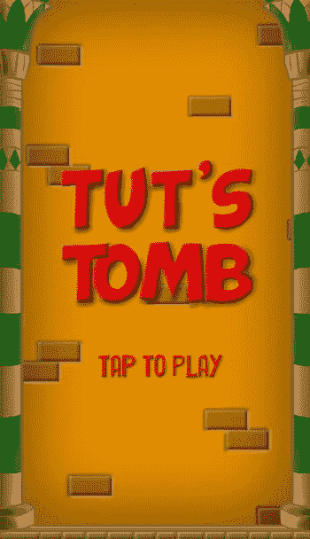
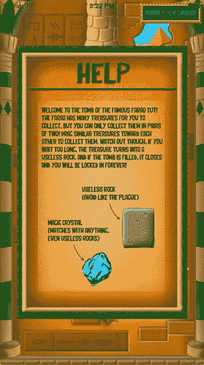
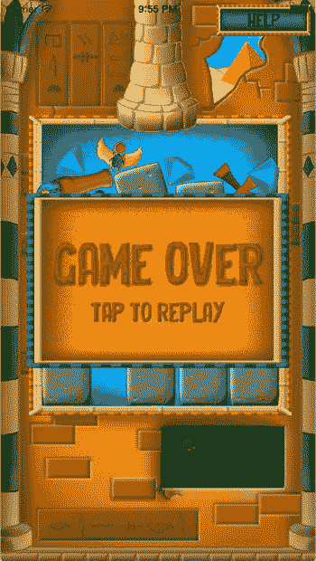

# 游戏状态

电子补充材料 本章的在线版本（doi:[10.​1007/​978-1-4842-0650-8_​15](http://dx.doi.org/10.1007/978-1-4842-0650-8_15)）包含补充材料，可供授权用户使用。

在上一章中，你编写了图坦卡蒙之墓游戏的主要玩法元素。然而，目前的游戏还远未完成。例如，当墓室完全被宝藏填满时，什么也不会发生。此外，当你启动程序时，游戏会立即开始，没有任何警告。我们仍然需要一种将菜单和覆盖层整合到游戏中的方法，以便玩家能够获取帮助或开始玩游戏。例如，当玩家处于菜单界面时，与游戏的交互类型与玩家解谜或尽力存活时的交互方式截然不同。在编写游戏程序时，你必须考虑如何整合这些不同的游戏状态，并在它们之间切换。

现代游戏有许多不同的游戏状态，例如菜单、地图、物品栏、启动画面、过场动画等等。本章将展示如何为图坦卡蒙之墓游戏添加不同的游戏状态。由于这个游戏目前还不太复杂，你可以通过对现有类进行一些简单的扩展来实现。然而，如果你想制作一款商业游戏，就必须妥善处理游戏状态的管理。第 18 章将介绍一种使用类的软件设计方法，这种方法能够以非常优雅和通用的方式处理游戏状态。

## 更好的图层处理

处理不同游戏状态时，一个重要的方面是内容要在不同的图层上绘制。为此，你需要使用 `SKNode` 类的 `zPosition` 属性。使用固定的数字来表示图层可能不太容易记住。你需要跟踪哪个图层代表场景，哪个代表覆盖层，哪个代表背景。在 TutsTomb4 示例中，我使用了一个结构体来表示不同的图层，这与定义各种宝藏类型的方式非常相似（请参阅 `GameScene.swift` 文件）：

```
struct Layer {
    static let Background: CGFloat = 0
    static let Scene: CGFloat = 1
    static let Scene1: CGFloat = 2
    static let Scene2: CGFloat = 3
    static let Overlay: CGFloat = 10
    static let Overlay1: CGFloat = 11
    static let Overlay2: CGFloat = 12
}
```

如你所见，我为背景、场景和覆盖层定义了几个有用的图层。现在，你可以非常方便地使用这些常量来定义图层：

```
background.zPosition = Layer.Background
```

请查看 TutsTomb4 示例中的代码，了解如何使用这些图层来构建游戏世界中对象的绘制顺序。


### 添加标题画面

让游戏看起来更完整的第一步就是添加标题画面。标题画面能让玩家做好准备再开始游戏，而不是直接进入游戏。你可以扩展 `GameWorld` 类，使其能够加载并显示由单张图片构成的标题画面。为此，你需要创建一个 `SKSpriteNode` 实例，并将其添加到游戏世界中，代码如下：

```
var titleScreen = SKSpriteNode(imageNamed:"spr_title")
...
titleScreen.zPosition = Layer.Overlay2
addChild(titleScreen)
```

你将标题画面设置为 `Layer.Overlays2` 图层，这样就能确保标题绘制在所有内容的上方。但你还需要额外做些工作来正确处理输入并更新游戏世界，因为只有在标题画面不再可见时游戏才会开始。你可以在 `handleInput` 方法中添加一些指令来区分两种状态：一种是显示标题画面的状态，另一种是玩家正在玩游戏的状态：

```
if !titleScreen.hidden {
    if inputHelper.hasTapped {
        titleScreen.hidden = true
        self.runAction(totalAction)
    }
} ... else {
    super.handleInput(inputHelper)
    ...
}
```

查看这些 `if` 指令，你会发现如果标题画面是可见的，那么游戏只会在玩家点击屏幕时做出反应。在这种情况下，你会将标题画面的隐藏标志设为 `true`，这样它就不会再被绘制出来。同时，你也会启动每几秒掉落一次宝藏的动作。因此，只要标题画面可见，游戏唯一会做出的反应就是玩家的触摸屏幕操作。如果标题画面不可见，你就会调用父类的 `handleInput` 方法；换句话说，当玩家正在游戏时，游戏会按预期对玩家操作做出反应。

对于 `updateDelta` 方法，你也遵循了几乎相同的流程：只有标题不可见时才会更新游戏世界：

```
if titleScreen.hidden {
    super.updateDelta(delta)
}
```

现在，当玩家开始游戏时，他们会在游戏开始前看到一个标题画面（见图 15-1）。但这还没结束。在下一节中，你将添加一个简单的按钮 GUI 元素，用于显示帮助框。



图 15-1. 图坦卡蒙之墓的标题画面

### 添加用于显示帮助框的按钮

本节将讲解如何为游戏添加按钮，并用它来显示帮助框。为此，你需要在程序中添加另一个类 `Button`。你继承自 `GameObjectNode` 类，并添加一些简单的行为来检查玩家是否按下了按钮。在 `Button` 类中，你声明一个布尔属性，用于指示按钮是否被点击。然后重写 `handleInput` 方法，检查玩家是否点击了屏幕上的按钮。如果触摸位置在按钮精灵的边界内，就表明玩家点击了按钮，并将该属性的值设为 `true`。如何检查触摸位置是否在精灵的边界内？通过使用 `GameObjectNode` 类的 `box` 属性以及 `InputHelper` 类中的 `containsTap` 方法即可。以下是 `Button` 类中完整的 `handleInput` 方法：

```
override func handleInput(inputHelper: InputHelper) {
    super.handleInput(inputHelper)
    tapped = inputHelper.containsTap(self.box)
}
```

完整的 `Button` 类，请参见 `TutsTomb4` 示例。现在，让我们向游戏世界添加一个帮助按钮。在 `GameWorld` 类中，你添加一个属性来表示帮助按钮：

```
var helpbutton = Button(imageNamed: "spr_button_help")
```

下一步是将帮助按钮定位到屏幕上并将其添加到游戏世界中。在图坦卡蒙之墓中，无论使用什么设备，帮助按钮都应始终显示在屏幕的右上角。为了实现这一点，你需要在 `GameWorld` 类中添加一个名为 `topRight` 的方法，用于计算屏幕右上角对应的位置：

```
func topRight() -> CGPoint {
    return CGPoint(x: size.width/2, y: size.height/2)
}
```

使用这个方法，你现在可以计算出帮助按钮的所需位置：

```
var helppos = topRight()
helppos.x -= helpbutton.sprite.size.width/2 + 10
helppos.y -= helpbutton.sprite.size.height/2 + 10
```

由于精灵的原点默认在中心，你需要从右上角位置减去帮助按钮精灵宽度和高度的一半。再减去 10 个像素，是为了在按钮和屏幕边缘之间留出一点边距。

因为你想在玩家按下帮助按钮时显示帮助框，所以还需要向游戏世界添加一个帮助框。你将其隐藏标志设为 `true`，这样它就不会立即显示：

```
var helpframe = SKSpriteNode(imageNamed: "spr_help")
helpframe.zPosition = Layer.Overlay2
helpframe.hidden = true
```

现在，你需要确保当玩家点击帮助按钮时，帮助框能够显示出来。你可以通过在 `GameWorld` 类的 `handleInput` 方法中添加以下 `if` 指令来实现：

```
if helpbutton.tapped {
    helpframe.hidden = false
    self.removeAllActions()
}
```

你还需要确保在显示帮助框时游戏不会被更新。这可以通过调用 `removeAllActions` 方法部分实现，该方法会禁用掉落宝藏的动作。同时，你还需要确保只在帮助框不可见时才更新游戏对象。因此，你将 `GameWorld` 类的 `updateDelta` 方法修改如下：

```
if titleScreen.hidden && helpframe.hidden {
    super.updateDelta(delta)
}
```

图 15-2 展示了游戏中显示帮助框时的画面。



图 15-2. 游戏中帮助框显示的截图


### 叠加层

向玩家呈现信息的一种非常常见的方式是使用叠加层。叠加层本质上是可以显示在游戏世界之上的图像，用于呈现信息或提供用户界面，例如菜单、小地图、状态信息等。上一节介绍的帮助框是叠加层的另一个示例。

叠加层可以呈现全新的游戏状态（例如游戏结束叠加层），或者它们可以通过向玩家提供信息来补充游戏世界。例如，许多策略游戏会提供关于已选单位数量、可用资源、进行中的建造过程、已收集物品等信息。这类叠加层通常一直显示在屏幕上，它们合起来被称为平视显示器（HUD）。《图坦卡蒙之墓》有一个非常基础的 HUD：它由一个显示当前分数的框（你将在下一章中添加）和一个玩家可以点击以查看帮助信息框的帮助按钮组成。

除了 HUD 之外，当墓室完全被宝藏填满时，你还需要显示一个游戏结束叠加层。你需要将此叠加层添加到游戏世界中，并将其隐藏状态设置为 `true`：

```swift
var gameover = SKSpriteNode(imageNamed: "spr_gameover")
self.addChild(gameover)
gameover.zPosition = Layer.Overlay2
gameover.hidden = true
```

该精灵的原点是其中心点，游戏场景的原点也在中心。后者是通过在 `GameScene` 类中添加以下代码行实现的：

```swift
anchorPoint = CGPoint(x: 0.5, y: 0.5)
```

这样，游戏结束叠加层就会自动完美地居中显示在屏幕中央。你只需要扩展 `GameWorld` 类，以便在需要时显示该叠加层。首先，你需要检查游戏何时真正结束，即墓室完全被填满的情况。那么如何衡量这一点呢？一个简单的解决方案是扩展处理物理接触的方法。如果两个宝藏对象发生接触，并且其中任何一个的 Y 轴位置高于某个阈值，则意味着墓室可能已经相当满了，否则碰撞会发生在屏幕中较低的位置。在 `didBeginContact` 方法中，以下 `if` 指令检查了这一点：

```swift
if firstBody?.position.y > 400 || secondBody?.position.y > 400 {
    gameover.hidden = false
    self.removeAllActions()
}
```

如果游戏结束，叠加层变为可见，并且所有动作都被移除，这样宝藏就不会再掉落了。

不过，这个解决方案还不完美。玩家可以拖住一个宝藏并将其保持在烟囱下方。掉落的宝藏会与玩家拖住的宝藏发生碰撞，这将导致游戏结束事件，即使墓室可能完全空着。解决这个问题的一个简单方法是，当宝藏达到略低于游戏结束阈值的某个阈值时，就禁止玩家拖动它。这可以通过扩展 `Treasure` 类的 `handleInput` 方法来实现，如下所示：

```swift
if position.y >= 200 {
    touchid = nil
    if physicsBody?.velocity.dy >= 0 {
        physicsBody?.velocity = CGVector.zeroVector
    }
    return
}
```

如果 Y 轴位置大于阈值 200，你通过将触摸 ID 设为 `nil` 来停止拖动宝藏。你需要处理的另一件事是玩家以高速向上拖动宝藏。为了避免这种情况，如果宝藏正在向上移动，你将物理体的速度设为零。你可以通过检查物理体速度的 `dy` 属性来衡量这一点。

在 `GameWorld` 的 `handleInput` 方法中，你需要检查游戏结束叠加层是否可见。如果是这样，玩家可以点击屏幕来重新开始游戏：

```swift
if !gameover.hidden {
    if inputHelper.hasTapped {
        gameover.hidden = true
        self.reset()
        self.runAction(totalAction)
    }
}
```

你需要重写 `reset` 方法，因为在游戏重新开始时需要进行一些额外的工作。特别是，你必须清空宝藏节点，使墓室再次为空，并将计数器重置为 0，以便游戏从有限的宝藏范围开始。此外，你还需要调用父类的 `reset` 方法，以便重置游戏世界中的所有游戏对象：

```swift
override func reset() {
    super.reset()
    self.treasures.removeAllChildren()
    self.counter = 0
}
```

最后需要做的事情是确保在游戏结束时不再更新游戏世界。这意味着要对 `GameWorld` 的 `updateDelta` 方法进行另一次更改，如下所示：

```swift
if titleScreen.hidden && helpframe.hidden && gameover.hidden {
    super.updateDelta(delta)
}
```

图 15-3 展示了游戏结束状态。



**图 15-3.** 太糟糕了…… 游戏设计

在游戏开发团队中，程序员通常不负责游戏的设计，但对这个过程有基本的了解仍然非常有用。程序员必须将游戏设计转化为代码，并且必须能够就哪些内容可行、哪些难以实现向设计师提供建议。为了使这种协作成功，每个人都必须使用相同的语言。

游戏设计主要包括定义游戏机制、游戏设定和选择游戏关卡。游戏机制涉及游戏规则、玩家控制游戏的方式、目标和挑战以及奖励结构等方面。心理学和教育学在此扮演着重要角色。它们帮助你理解玩家如何进入心流状态（他们全身心投入游戏的心境）；目标、挑战和奖励如何相互支持；以及如何变化和调整游戏难度。

游戏设定涉及故事、角色以及游戏发生的虚拟世界。一个好的故事可以是玩家的强大动力，而在游戏过程中探索故事可以是一项非常令人满足的任务。角色需要唤起玩家的同理心，从而赋予必须完成的任务以意义。游戏世界则强化了这些方面，并使游戏适应特定的人群。

关卡设计有时由专门的关卡设计师完成，但在较小的团队中，这通常是游戏设计师的责任。精心的关卡设计会带来良好的学习曲线。它能让玩家保持挑战和动力，并且应该产生令人愉快的惊喜。

关于游戏设计已经出版了许多书籍，强烈建议你阅读其中一些。你也可以在 [www.gamasutra.com](http://www.gamasutra.com/) 等网站上找到大量关于游戏开发各方面的信息。

## 本章所学内容

在本章中，你学习了以下内容：

*   如何向游戏添加 HUD 和叠加层
*   如何定义一个显示框架的简单按钮
*   如何处理几种不同的游戏状态，例如标题画面和游戏结束状态

