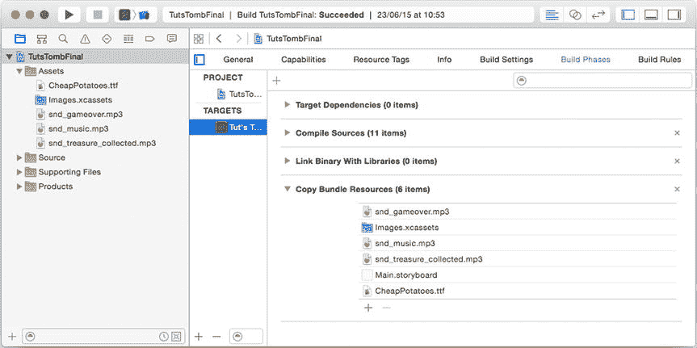
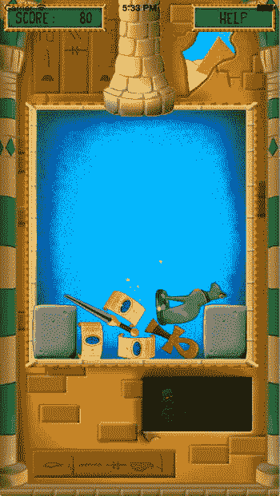

# 16. 完成《图坦卡蒙之墓》游戏

电子补充材料 本章的在线版本 (doi:[10.1007/978-1-4842-0650-8_16](http://dx.doi.org/10.1007/978-1-4842-0650-8_16)) 包含补充材料，仅供授权用户使用。

在本章中，你将完成《图坦卡蒙之墓》游戏。第一步，你将使用自定义游戏字体向游戏添加一个分数指示器。第二步，你将通过在游戏中的宝藏上显示闪光效果来添加一个漂亮的视觉效果。最后，你将添加声音和音乐。请查看 `TutsTombFinal` 游戏示例。它包含了本章中解释的所有代码。


## 添加分数

在图坦之墓中，每当两个相同类型的宝藏碰撞时，它们会从屏幕上消失，玩家获得分数。你需要在屏幕的某个位置显示这些分数。在本游戏中，分数显示在屏幕的左上角。在 `GameWorld` 类中，你添加一个 `scoreObj` 属性，该属性表示用于维护和显示当前分数的节点。此属性的类型是 `Score`，这是一个将在本章讨论的类。当游戏世界设置完毕后，`Score` 实例被定位在屏幕左上角（带有顶部和侧边距），并像这样添加到 `GameWorld` 节点中：

```
var scorepos = GameScene.world.topLeft()
scorepos.x += scoreObj.sprite.size.width/2 + 10
scorepos.y -= scoreObj.sprite.size.height/2 + 10
scoreObj.position = scorepos
self.addChild(scoreObj)
```

`Score` 类是 `GameObjectNode` 的子类。它包含一个精灵、一个用于显示分数的标签，以及一个用于跟踪当前分数的整数属性。在类的初始化器中，`sprite` 和 `label` 属性被定位并添加到节点中：

```
sprite.zPosition = Layer.Overlay
self.addChild(sprite)
label.position = CGPoint(x: 100, y: 0)
label.zPosition = Layer.Overlay1
label.fontColor = UIColor.blackColor()
label.fontSize = 20
label.verticalAlignmentMode = .Center
label.horizontalAlignmentMode = .Right
label.text = "0"
self.addChild(label)
```

标签初始化时会设置字体颜色、大小以及对齐方式。对齐方式指示文本相对于标签位置（即 (100, 0)）的显示方式。垂直对齐模式为“居中”。这意味着文本的显示方式使得文本的垂直中线位于 y 位置 0 处，相对于文本所属的分数节点对象局部坐标而言。水平对齐模式为“右”，导致文本右对齐。在定位方面，这意味着局部 x 位置（即 100）指示标签文本的右边缘。还有其他几种文本对齐选项。例如，你可以将文本在顶部、居中、底部或基线上垂直对齐（后者意味着文本所在的虚拟线，这与底部对齐不同，因为根据所使用的字体，某些字符可能会突出到基线下方，例如 `g` 或 `p` 字符）。尝试使用各种对齐选项和标签定位，看看效果如何。如果你想了解 Xcode 中某个属性或方法的更多信息，请按住 Control 键并单击它，然后选择“跳转到定义”。Xcode 将显示其定义。你也可以按住 Command 键并单击某个属性或方法来实现相同效果。

`Score` 类使用一个名为 `scoreValue` 的存储整数属性来跟踪当前分数。访问分数应该通过一个计算属性 `score` 进行：

```
var score: Int {
    get {
        return scoreValue
    }
    set {
        scoreValue = newValue
        label.text = String(self.scoreValue)
    }
}
```

使用计算属性的原因是，它允许你在分数更改时也更改标签文本。在 `GameWorld` 的 `didBeginContact` 方法中，如果两个相同类型的宝藏之间发生接触（或者涉及魔法水晶），分数就会增加：

```
if firstBody?.type == secondBody?.type || firstBody?.type == TreasureType.Magic
    || secondBody?.type == TreasureType.Magic {
    self.scoreObj.score += 10
    ...
}
```

当分数增加时，会调用 `score` 属性的 `set` 部分，分数标签文本也会随之更新。

## 控制访问

假设 `Score` 类中的 `scoreValue` 属性声明如下：

```
var scoreValue: Int = 0
```

尽管该属性本应仅在 `Score` 类内部访问，但没有什么能阻止开发者编写以下代码：

```
self.scoreObj.scoreValue += 10
```

如果意外以这种方式更新分数，将导致游戏出现问题，因为即使分数发生了变化，标签文本也不会更改。有没有办法强制属性只能在类内部访问，而不能在类外部访问？有的！Swift 提供了三个用于控制类中属性和方法访问权限的关键字：`private`、`internal` 和 `public`，也称为访问修饰符。

如果使用 `private` 访问修饰符，则只能在其定义所在的源文件中访问该属性或方法。因此，在其他源文件中编写的代码将无法直接访问此类属性。例如，在 TutsTombFinal 示例中，`scoreValue` 属性的声明方式如下：

```
private var scoreValue: Int = 0
```

如果现在尝试在 `GameWorld` 类（定义在另一个源文件中）中访问 `scoreValue` 属性，编译器将报错。有时，将方法设置为 `private` 也很有用。例如，你可能向类中添加一个低级方法，用于内部计算某些内容，但不希望它被其他位置调用。本章后面你将看到此类方法的一个示例。

`internal` 访问意味着属性和方法可以从其定义所在的目标中的任何文件访问。目标是指当你点击“播放”按钮时 Xcode 构建的内容。因此，在本书的上下文中，目标通常是一个应用程序，但它也可以是一个属于同一组的类库或一个 OS X 应用程序。默认情况下，属性和方法具有 `internal` 访问权限。因此，声明

```
var lives: Int = 0
```

等同于

```
internal var lives: Int = 0
```

最后，`public` 属性或方法可以从任何源文件访问，甚至可以在目标之外访问。后者在你开发希望用于多个游戏的类库时特别有用。


## 使用自定义字体

如果你想让你自己的游戏脱颖而出，就必须仔细思考游戏中使用的字体。一般来说，应避免使用 Times New Roman 或 Arial 这类字体，因为每个人都已经熟知并使用了这些字体。现在有很多免费字体可供你在游戏中使用。如果你决定使用自定义字体，请确保你有权使用它。并非所有字体都可用于商业目的。

与精灵和声音一样，字体也是一种游戏资源。如果你在游戏中使用了特定字体，就应该随应用一起打包该字体，以确保游戏在所有玩家设备上显示一致。将字体与游戏一起打包非常简单，但需要执行几个步骤。

首先，你需要将字体文件添加到游戏项目中。在 TutsTombFinal 示例中，你可以看到一个名为 Fonts 的文件夹，其中包含一个 TrueType 字体文件。

下一步是确保 Xcode 复制该字体，使其成为目标的一部分。在 Xcode 中，点击窗口左侧的项目名称，然后选择 TutsTombFinal 目标。接着进入 Build Phases 标签页。如果你展开 Copy Bundle Resources 列表，它应显示该字体。如果没有，请将其从项目文件列表拖拽到 Copy Bundle Resources 列表中（见图 16-1）。



图 16-1.

构建目标时复制的资源概览

现在字体已添加到项目并在构建目标时被复制，你需要在项目设置中指明你的目标将使用该特定字体。点击 Supporting Files 文件夹中的 `Info.plist` 文件，你会看到一个项目列表。其中有一个名为“应用提供的字体”的键，你会看到它包含一个项目：在 Tut's Tomb 游戏中使用的自定义字体。如果你为自己的游戏启动新项目并想添加自定义字体，你需要通过悬停在信息属性列表字典上时出现的加号，自行将“应用提供的字体”键添加到该列表中。然后你可以添加一个新键，并将自定义字体添加至该键。

最后一步是使用你的字体创建一个标签节点。请注意，在 Swift 程序中使用的字体名称不一定与字体文件的名称相同。并没有特别便捷的方法找到属于某个字体文件的字体名称。如果你将以下代码片段插入到程序的某个位置，程序将列出其已知的所有字体：

```
let fontFamilies = UIFont.familyNames()

for familyName in fontFamilies {
    let fontNames = UIFont.fontNamesForFamilyName(familyName)
    print("\(familyName): \(fontNames)")
}
```

然后你可以在打印到控制台的列表中找到你想要使用的字体名称。图 16-2 显示了 TutsTombFinal 中，使用自定义字体显示分数的标签。



图 16-2.

带有闪光效果的 TutsTombFinal 游戏

## 添加闪光效果

目前，宝藏只是屏幕上显示的简单精灵。让我们为它们添加一个漂亮的视觉特效：闪光。TutsTombFinal 示例中包含一个名为 `Glitter` 的类，你可以用它来表示闪光游戏对象（是的，连闪光也是一个游戏对象！）。

为了使闪光能够平滑地出现和消失，你将在 `Glitter` 类中使用动作来改变其缩放比例。当闪光被创建时，它应该从 0（不可见）缩放到 1（正常大小），然后再缩放回去。每当两个相同类型的宝藏接触时，你就在游戏世界中添加一定数量的 `Glitter` 实例，并将它们随机放置在接触点周围。

在 `Glitter` 的初始化器中，你首先将 x 和 y 方向的缩放比例都设置为 0：

```
self.xScale = 0
self.yScale = 0
```

然后你定义了闪光的动作。为了避免大量闪光同时出现，你从一个等待动作开始：

```
let waitAction = SKAction.waitForDuration(0.1, withRange: 0.2)
```

这个等待动作会在 0.2 秒的范围内，选择一个大约 0.1 秒的随机等待时间。这样，每个添加的闪光都将在略微不同的时间点出现。接下来，你定义了一个放大动作和一个缩小动作：

```
let scaleUpAction = SKAction.scaleTo(1, duration: 0.3)
let scaleDownAction = SKAction.scaleTo(0, duration: 0.3)
```

最后，你创建了一个由这些动作组成的序列，并运行它们：

```
let totalAction = SKAction.sequence([waitAction, scaleUpAction, scaleDownAction])
self.runAction(totalAction, completion: {
    self.removeFromParent()
})
```

一旦动作完成，就会执行一个指令块。在这个例子中，该指令块包含一条指令，用于将闪光从游戏世界中移除。

剩下唯一要做的事情就是将闪光添加到场景中。为此，让我们在 `GameWorld` 类中添加一个方法，它在给定位置周围添加一定数量的闪光。由于此方法应仅在 `GameWorld` 类内部使用，因此它是一个很好的具有私有访问权限的方法示例。以下是该方法的声明：

```
private func addGlittersAroundPosition(pos: CGPoint, number: Int)
```

正如你所见，该方法需要一个位置和一个数量参数。在方法体内，你使用一个 `for` 循环来创建并添加指定次数的 `Glitter` 对象。为了随机放置对象，你可以使用极坐标。换句话说，不是通过 x 和 y 坐标来表示位置，而是通过半径和角度来表示。如果你在一个范围内随机选择一个半径，以及一个介于 0 到 2π 之间的随机角度，闪光就会出现在给定位置周围的圆形区域内。你可以通过使用正弦和余弦数学函数，从极坐标转换回常规（笛卡尔）坐标。以下是 `addGlittersAroundPosition` 方法的完整实现：

```
for _ in 1...number {
    var glitter = Glitter()
    glitter.position = pos
    var radius = randomDouble() * 100
    var angle = randomDouble() * 2 * M_PI
    glitter.position.x += CGFloat(cos(angle) * radius)
    glitter.position.y += CGFloat(sin(angle) * radius)
    self.addChild(glitter)
}
```

注意在 `for` 循环中使用了下划线，因为这里不需要实际的计数器变量。接着，在 `didBeginContact` 方法中，你可以调用此方法来在接触点周围添加闪光。请查看 TutsTombFinal 示例中的代码以了解如何实现。图 16-2 显示了带有闪光效果的的的游戏！

## 添加更多闪光效果

由于闪光效果不关心被放置在何处，你可以在游戏的任何地方、任何时间添加闪光。例如，为了让魔法水晶更具魔力，你可以定义一个动作，持续在水晶周围添加闪光。`Treasure` 类包含一个 `addGlitter` 方法，该方法在宝藏精灵的位置周围随机添加闪光。然后你可以简单地定义一个动作，反复向魔法水晶对象添加闪光。这个动作包括调用 `addGlitter` 方法，并稍作等待。以下是定义该动作的代码：

```
let addGlitterAction = SKAction.runBlock({
    self.addGlitter()
})
let waitAction = SKAction.waitForDuration(0.1)
let totalAction = SKAction.repeatActionForever(
    SKAction.sequence([addGlitterAction, waitAction]))
self.runAction(totalAction)
```

图 16-3 显示了一个带有闪光效果的魔法水晶。


图 16-3.

闪闪发光！


## 添加音乐与音效

如同在“画家”游戏中一样，你需要为游戏添加音乐和音效，使其更具吸引力。正如你所见，在 Swift 中播放音乐和音效非常容易。你可以使用之前为“画家”游戏创建的 `Sound` 类。这是代码复用的又一个好例子：你只创建了一次 `Sound` 类，现在却可以在本书的所有游戏中使用它！

为“图坦卡蒙之墓”设计的不少类，对本书中的其他游戏也很有用。当你开始构建自己的游戏时，最终可能会积累一系列经常使用的类似类。在构建游戏时，提前思考是个好主意。哪些类可以在其他项目中复用？如何设计一个类，才能使其在将来也能被再次使用？随着你开发越来越多的类，维护一个列表可能会很有用；这样你在开发新内容时，就能快速扫描列表，并实现一些此前可能未曾想到的功能。

游戏开始时，你会开始播放背景音乐，如下所示（参见 `GameWorld` 类）：

```
backgroundMusic.looping = true
backgroundMusic.volume = 0.5
backgroundMusic.play()
```

当两个相同类型的宝藏碰撞时，你也会播放一个音效（同样在 `GameWorld` 类中）：

```
if firstBody?.type == secondBody?.type || firstBody?.type == TreasureType.Magic
    || secondBody?.type == TreasureType.Magic {
    self.scoreObj.score += 10
    ...
    treasureCollectSound.play()
}
```

最后，当游戏结束时，你会播放一个音效（同样在 `GameWorld` 类中）：

```
if firstBody?.position.y > 400 || secondBody?.position.y > 400 {
    gameover.hidden = false
    self.removeAllActions()
    gameoverSound.play()
}
```

至此，“图坦卡蒙之墓”游戏完成。你可以通过运行本章附带的 TutsTombFinal 示例来游玩此游戏。作为练习，看看你是否能自己为游戏扩展新功能。例如，你可以在宝藏碰撞时添加额外的动画效果。或者，加上一个排行榜/高分列表怎么样？无论如何，祝你寻宝愉快！

### 排行榜

为什么游戏要有排行榜和高分列表？早期的游戏没有这些功能，因为当时的游戏机没有半持久化存储空间。因此，在不同游戏会话之间无法记住任何东西。也没有“保存游戏”选项，这对游戏机制产生了重要影响：玩家总是必须从头开始，即使他们是老手。

当存储空间可用后，设计师们开始引入排行榜。比别人强总能带来一种满足感，并且为玩家增加了一个重要的目标。但只有当多人在同一台设备上玩游戏时，这才有意义。如果你是唯一的玩家，唯一能做的就是试图超越自己。幸运的是，如今的电脑和游戏机都连接到了互联网。因此，你可以将排行榜存储在线上，并与全世界竞争。

但这又增加了一个问题：一个目标只有可实现时才有吸引力。在数百万人中成为最优秀的玩家，对大多数人来说都是遥不可及的。因此，全球排行榜实际上可能会降低玩家的满意度。为了解决这个问题，游戏通常会引入子排行榜。例如，你可以设立一个仅限于本国或本周内得分的排行榜。你也可以查看自己在朋友中的排名。精心设计游戏的计分系统以及在排行榜上展示这些分数的方式，对于提升玩家的满意度至关重要。

## 你学到了什么

在本章中，你学习了以下内容：

-   如何在游戏中使用自定义字体
-   如何限制属性和方法的访问权限
-   如何创建闪烁效果并将其附着到游戏对象上

