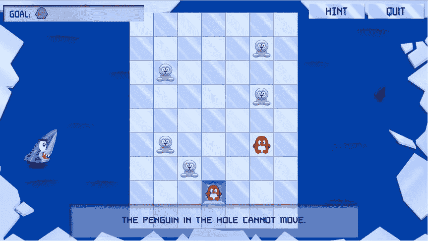

# 第四部分  
企鹅对对碰

在本书的这一部分，你将开发游戏“企鹅对对碰”（参见图 IV-1）。我将介绍一些新的游戏编程技巧，例如网格布局中的游戏对象、文件 I/O、更好的游戏状态管理、在游戏会话之间存储游戏数据等等。

**图 IV-1.** “企鹅对对碰”游戏

“企鹅对对碰”是一款益智游戏，其目标是让相同颜色的企鹅配对。玩家可以通过单击或轻触企鹅，然后选择企鹅应该移动的方向来移动它们。一只企鹅会一直移动，直到被游戏中的另一个角色（可以是企鹅、海豹、鲨鱼或冰山）挡住，或者从游戏区域掉落（掉入水中并被饥饿的鲨鱼吃掉）。游戏的不同关卡会引入新的游戏元素以保持游戏趣味性。例如，有一种特殊的企鹅可以匹配任何其他企鹅；企鹅可能会卡在洞里（这意味着它们无法移动）；以及可以在棋盘上放置食企鹅的鲨鱼。你可以尝试运行第 21 章附带的示例程序来体验此游戏的最终版本。

