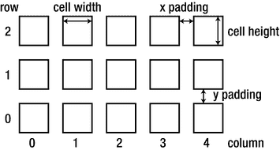
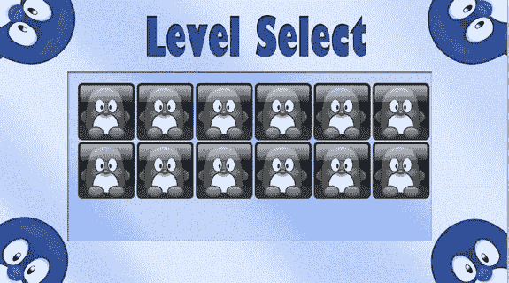
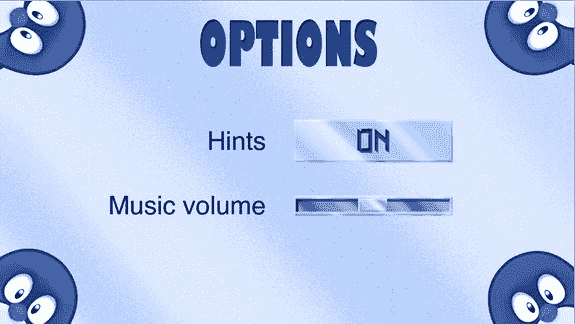

# 17. 菜单与网格

*电子补充材料* 本章的在线版本 (doi:[10.1007/978-1-4842-0650-8_17](http://dx.doi.org/10.1007/978-1-4842-0650-8_17)) 包含补充材料，仅供授权用户使用。

“企鹅对对碰”是一款益智游戏，而棋盘游戏和益智游戏通常都基于将物体放置在某种网格中。这类游戏的例子比比皆是：国际象棋、俄罗斯方块、井字棋、数独、糖果传奇等等。这些游戏的目标通常是某种方式修改网格的配置以获得分数。在俄罗斯方块中，必须构建完全填满的行；在数独中，行、列和子网格必须满足特定的数值属性。

像网格这样的结构通常会对游戏棋子施加一组规则，将其限制在游戏板上的特定位置或配置上。例如，在国际象棋中，棋子只能（有意义地）放置在游戏板上的白格和黑格上。你不能把你的皇后放在两个格子中间。在电脑游戏中，这类限制更容易实施：你只需确保放置游戏对象的位置是有效位置即可。

网格在游戏的其他部分也非常有用。例如，你可能想显示一个按钮网格，让玩家选择关卡。这就是为什么网格也常用于组织屏幕上的 GUI 元素。除了网格布局，本章还介绍了“企鹅对对碰”游戏所需的一些新 GUI 元素，例如滑块和开关按钮。你会注意到，由于需要处理网格位置、滑块位置等，本章的数学内容会稍多一些。不过，透彻理解这些概念是值得的。一旦你完成了创建这些类和方法这类艰巨的工作，你就可以在你未来开发的任何游戏中反复使用它们。


## 网格布局中的游戏对象

在编写代码之前，让我们先思考一下什么是网格，以及哪些参数有助于定义网格。图 17-1 展示了网格所有重要参数的概览。一个网格通常由若干单元格组成。本书中使用的网格具有固定宽度和高度的单元格。此外，网格会有若干行和列。由于在 SpriteKit 框架中 y 轴正方向向上，我们也按此方式定义网格。因此，网格中最底部的行是第 0 行，其上方是第 1 行，以此类推。最左侧的列是第 0 列，列索引沿 x 轴正方向递增（另见图 17-1）。最后，网格单元格之间可以存在间距（例如，当你想展示一个按钮网格时）。这个间距（也称为内边距）需要在 x 和 y 两个方向上进行定义。



图 17-1.

一个三行五列网格结构的概览

我在网格中布局对象的方法是创建一个 `GridLayout` 类，其一个实例被附加到场景中的一个节点上。`GridLayout` 实例将负责布局它所附加节点的子节点。属于 `SKNode` 的 `children` 数组中子节点的顺序决定了每个子节点在网格上的位置。在图 17-1 的网格中，底部的五个单元格（第 0 行）由数组中的前五个元素填充，接下来的五个子节点填充第 1 行，以此类推。你不需要直接将每个子节点添加到 `SKNode` 实例，而是调用 `GridLayout` 类中的 `add` 方法来添加子节点并计算其在网格上的位置。

在 `PenguinPairs1` 示例中，你可以找到 `GridLayout` 类的完整代码。该类有若干属性用于维护网格尺寸信息（遵循图 17-1）：

```
var cellWidth: Int = 0, cellHeight: Int = 0, rows: Int = 0, columns: Int = 0

var xPadding: Int = 0, yPadding: Int = 0

var target: SKNode? = nil
```

`target` 属性是一个 `SKNode` 对象，其子节点将被布局在网格中。在 `GameWorld` 类中，你创建一个节点来包含一系列按钮：

```
var levelButtons = GameObjectNode()
```

在 `GameWorld setup` 方法中，你创建一个布局对象，并将 `levelButtons` 节点设为其目标：

```
var layout = GridLayout(rows: nrRows, columns: nrCols, cellWidth: 150, cellHeight: 150)

layout.xPadding = 5

layout.yPadding = 5

layout.target = levelButtons
```

现在让我们在 `GridLayout` 类中创建一些有用的方法和属性。首先，能够根据单元格宽度、高度和内边距计算网格的总宽度和总高度是很有用的。如图 17-1 所示，网格的总宽度等于单元格数量乘以单元格宽度，再加上（单元格数量减 1）乘以 x 方向内边距。高度也以类似方式计算。以下是 `GridLayout` 中计算网格总宽度和高度的两个属性：

```
var width : CGFloat {

    get { return CGFloat(columns * cellWidth + (columns - 1) * xPadding) }

}

var height : CGFloat {

    get { return CGFloat(rows * cellHeight + (rows - 1) * yPadding) }

}
```

让我们再添加一个方法，该方法可以将网格上的行和列索引转换为节点中的局部位置。假设网格的原点在其中心（与精灵类似）。那么网格的左下角点就是 `(-width/2, -height/2)`。对于 x 坐标，你加上列索引乘以单元格宽度与 x 内边距之和。对于 y 坐标，你对行索引执行相同的操作，加上单元格高度与 y 内边距之和。这样就能得到目标单元格的左下角点。最后，你再加上半个单元格宽度和高度，以便将子节点完美地定位在网格单元格的中心。以下是执行此计算的方法：

```
func toPosition(col: Int, row: Int) -> CGPoint {

    let xpos = -width/2 + CGFloat(col * (cellWidth + xPadding) + cellWidth / 2)

    let ypos = -height/2 + CGFloat(row * (cellHeight + yPadding) + cellHeight / 2)

    return CGPoint(x: xpos, y: ypos)

}
```

同样，你定义了一个名为 `toGridLocation` 的方法，用于将位置转换为列和行索引。你可以在 `PenguinPairs1` 示例中自行查看代码。现在你可以定义一个名为 `add` 的方法，用于向目标添加节点并自动正确定位它。以下是该方法的完整代码：

```
func add(obj: SKNode) {

    if let target_unwrapped = target {

        let r = target_unwrapped.children.count / columns

        let c = target_unwrapped.children.count % columns

        target_unwrapped.addChild(obj)

        obj.position = toPosition(c, row: r)

    }

}
```

因为 `target` 是一个可选变量，你需要先解包它，然后使用解包后的目标。首先，使用 `children` 数组中的子节点数量，计算将要添加的节点所属的行和列索引。然后，将对象添加到目标，并调用 `toPosition` 方法计算其实际位置。

最后，你定义了一个名为 `at` 的方法，允许你检索网格中特定位置的对象。该方法返回一个可选的 `SKNode` 对象。它是可选的，因为在某些情况下可能不存在 `SKNode` 对象，例如，如果提供的列或行索引超出了网格尺寸范围。以下是该方法的完整代码：

```
func at(col: Int, row: Int) -> SKNode? {

    if col < 0 || col >= columns || row < 0 || row >= rows {

        return nil

    }

    if let target_unwrapped = target {

        var index = row * columns + col

        return target_unwrapped.children[index] as? SKNode

    }

    return nil

}
```

现在你可以使用 `GridLayout` 类将子对象组织成网格结构。在本书的剩余章节中，只要需要以网格布局排列游戏对象，你就会使用这个类。

`PenguinPairs1` 示例使用了 `GridLayout` 类在屏幕上显示一个关卡按钮网格。在 `GameWorld` 类中，创建了关卡按钮并将其添加到网格中。第一步是确定网格所需的行数和列数。关卡将从文本文件中读取，就像 Penguin Pairs 一样。因此，代码的结构是基于关卡数量来决定网格需要多少列，然后计算所需的行数：

```
let nrCols = 6, nrLevels = 12

var nrRows = nrLevels / nrCols

if nrLevels % nrCols != 0 {

    nrRows++

}
```

现在你可以定义关卡按钮应遵循的布局，并设置 x 和 y 方向的内边距值，以便在按钮之间留出一些空间。你还需要将一个节点设为此布局的目标：

```
var layout = GridLayout(rows: nrRows, columns: nrCols, cellWidth: 150, cellHeight: 150)

layout.xPadding = 5

layout.yPadding = 5

layout.target = levelButtons
```

你使用一个嵌套的 `for` 循环来用关卡按钮填充网格，这里暂时将按钮定义为简单的 `SKSpriteNode` 实例：

```
for var i = nrRows - 1; i >= 0; i-- {

    for var j = 0; j < nrCols; j++ {

        if i*nrCols + j < nrLevels {

            var level = SKSpriteNode(imageNamed: "spr_level_unsolved")

            level.zPosition = Layer.Scene

            layout.add(level)

        } else {

            layout.add(SKNode())

        }

    }

}
```


嵌套`for`循环内部的`if`指令是必需的，因为底行可能只填充了部分按钮。在网格的其他位置，会添加一个空的`SKNode`实例。你可以通过运行本章附带的`PenguinPairs1`示例来查看结果。图 17-2 展示了截图。



图 17-2. `PenguinPairs1`示例程序中的关卡按钮网格

### 类扩展

在继续为 Penguin Pairs 添加菜单之前，让我们回顾一下前两个游戏中使用的类设计，并重新思考如何改进它。对于 Tut's Tomb 游戏，我定义了一个名为`GameObjectNode`的类，它是`SKNode`的子类，并添加了用于基本游戏循环交互的方法。这带来了一些不便：为了使其正确运行，场景中的每个节点都必须是`GameObjectNode`实例，或者是`GameObjectNode`子类的实例。如果能直接扩展`SKNode`类本身的功能，岂不是更简单？好消息是：你可以做到！Swift 有一种称为类扩展的机制。它允许你向现有类添加功能，并在项目中使用该扩展后的类定义。如果你打开`PenguinPairs2`示例中的`SKNode_Extension.swift`文件，会看到类似以下内容：

```
import SpriteKit

extension SKNode {

    ...

    func handleInput(inputHelper: InputHelper) {

        ...

    }

    func updateDelta(delta: NSTimeInterval) {

        ...

    }

    func reset() {

        ...

    }

}
```

这告诉编译器，在`PenguinPairs2`项目中，`SKNode`类通过（其中包括）三个方法进行了扩展。因此，从现在开始你创建的任何`SKNode`实例都将拥有扩展中定义的方法和属性。这意味着你不再需要单独的`GameObjectNode`类。此外，`SKNode`的子类（例如`SKSpriteNode`）现在也会自动拥有扩展中定义的方法和属性。这非常有用。例如，你可以将`Button`类重写为`SKSpriteNode`的子类：

```
class Button: SKSpriteNode {

    var tapped = false

    init(imageNamed: String) {

        let texture = SKTexture(imageNamed: imageNamed)

        super.init(texture: texture, color: UIColor.whiteColor(), size: texture.size())

    }

    required init?(coder aDecoder: NSCoder) {

        fatalError("init(coder:) has not been implemented")

    }

    override func handleInput(inputHelper: InputHelper) {

        super.handleInput(inputHelper)

        tapped = inputHelper.containsTap(self.box) && !self.hidden

    }

}
```

如果你想扩展框架中现有类的功能，类扩展非常有用。`SKNode`扩展就是一个很好的例子。因为你直接扩展了`SKNode`类，该扩展会平滑地传递给 SpriteKit 框架中所有继承自`SKNode`的类。因此，这减少了代码重复。在本书的剩余章节中，我将使用类扩展来为现有类添加功能。

类扩展是开发者工具箱中另一个用于以良好、通用的方式设计软件架构的工具。然而，与任何工具一样，你必须注意如何使用它。如果你过度依赖类扩展，可能就不清楚类的哪些部分是原生的，哪些部分是你添加的。当你开始一个新项目时，你可能需要翻阅之前的项目，收集添加到现有类中的代码片段，并将其复制到新项目中。而且，如果发布了新版本的 SpriteKit 框架，你对 SpriteKit 类的扩展可能不再有意义（尽管后一种论点适用于任何使用 SpriteKit 类的代码）。

## 设置菜单

既然`SKNode`类已经通过游戏循环功能进行了扩展，让我们用它来为 Penguin Pairs 游戏创建一个菜单。提到菜单，你可能会想到下拉菜单（如“文件”或“编辑”）或应用程序顶部的按钮。不过，菜单可以很灵活，尤其是在游戏中，菜单通常以游戏风格设计，并且可能覆盖屏幕的一部分甚至整个屏幕。例如，让我们看看如何定义一个包含两个控件的基本选项菜单界面：一个用于切换提示的开关，另一个用于控制音乐音量。首先，你需要绘制这些控件周围的元素。为菜单添加背景，然后添加一个文本标签来描述提示控件。为此，你使用`SKLabelNode`类。定义要绘制的文本，并将其放置在适当的位置（以下代码取自本章附带的`PenguinPairs2`示例中的`GameWorld`类）：

```
let background = SKSpriteNode(imageNamed: "spr_background_options")
background.zPosition = Layer.Background
self.addChild(background)

let onOffLabel = SKLabelNode(fontNamed: "Helvetica")
onOffLabel.horizontalAlignmentMode = .Right
onOffLabel.verticalAlignmentMode = .Center
onOffLabel.position = CGPoint(x: -50, y: 50)
onOffLabel.fontColor = UIColor(red: 0, green: 0, blue: 0.4, alpha: 1)
onOffLabel.fontSize = 60
onOffLabel.text = "Hints"
self.addChild(onOffLabel)
```

类似地，你为音乐音量控制添加一个文本标签。完整代码请参见本章附带的`PenguinPairs2`示例。


## 添加开关按钮

下一步是添加一个开关按钮，用于在游戏过程中显示（或不显示）提示信息。在本章后面，你将看到这个按钮的值是如何被使用的。就像你为`Button`类所做的那样，你为开关按钮创建一个专门的类，命名为（毫不意外）`OnOffButton`。在 PenguinPairs2 示例中，这个类是 `SKSpriteNode` 的子类，就像新创建的 `Button` 类一样。它拥有两个（存储）属性，类型为 `SKTexture`，每个属性代表一个纹理（图像）：

```
var onTexture  = SKTexture(imageNamed: "spr_button_on")
var offTexture = SKTexture(imageNamed: "spr_button_off")
```

根据按钮的状态，将为精灵节点选择不同的纹理。该按钮有两种状态：关闭和开启（另见图 17-3）。当 `SKSpriteNode` 实例被初始化时，会默认选择开启状态：


*图 17-3.* 开关按钮使用的两种纹理

```
init() {
    super.init(texture: onTexture, color: UIColor.whiteColor(), size: onTexture.size())
}
```

按钮的一个重要方面是，你需要能够读取和设置其开启或关闭状态。由于按钮有两种纹理，你可以定义：如果当前纹理指向 `offTexture` 属性，则按钮处于关闭状态；如果当前纹理指向 `onTexture` 属性，则按钮处于开启状态。然后，你可以添加一个布尔类型的计算属性来获取和设置这个值。以下是该属性的定义：

```
var on: Bool {
    get {
        return self.texture == onTexture
    }
    set {
        if newValue {
            self.texture = onTexture
        } else {
            self.texture = offTexture
        }
    }
}
```

最后，你需要处理按钮上的点击操作，以切换其开启和关闭状态。类似于你在 `Button` 类中所做的，你在 `handleInput` 方法中检查玩家是否点击了按钮的边界框内。以下是完整的 `handleInput` 方法：

```
override func handleInput(inputHelper: InputHelper) {
    super.handleInput(inputHelper)
    if inputHelper.containsTap(self.box) && !self.hidden {
        self.on = !self.on
    }
}
```

请注意，只有当按钮可见时，你才切换其状态。在 `GameWorld` 类中，你会在游戏世界中添加一个 `OnOffButton` 实例，并放置到所需位置：

```
var onOffButton = OnOffButton()
...
onOffButton.position = CGPoint(x: 200, y: 50)
self.addChild(onOffButton)
```

## 定义滑块按钮

接下来，你添加第二种 GUI 控件：滑块。这个滑块将用于控制游戏中背景音乐的音量。它由两个精灵组成：一个代表滑道（条形）的背景精灵，和一个代表实际滑块的前景精灵。因此，`Slider` 类继承自 `SKNode`，并（除其他属性外）包含两个 `SKSpriteNode` 属性来表示每个精灵。由于背景精灵有边框，你在移动或绘制滑块时需要考虑到这一点。因此，你还定义了左右边距，用于指定背景精灵左右两侧的边框宽度。完整的存储属性列表如下：

```
var back = SKSpriteNode(imageNamed: "spr_slider_bar")
var front = SKSpriteNode(imageNamed: "spr_slider_button")
let leftMargin = CGFloat(4), rightMargin = CGFloat(7)
var dragging = false
var draggingIndex: Int?
```

如你所见，你还将一个布尔属性 `dragging` 设置为 `false`，并添加了一个可选类型 `Int` 的属性 `draggingIndex`。你需要这些属性来跟踪玩家何时正在拖动滑块，以及对应的触摸 ID，以便在必要时更新滑块位置，即使触摸位置不在背景精灵的边界内。

## 计算游戏对象的世界坐标位置

因为你需要跟踪玩家是否正在触摸滑块，所以你需要计算节点的边界框。如果你查看 `SKNode` 的扩展，可以看到它定义了 `box` 属性，这也是原始 `GameObjectNode` 类的一部分。在 `GameObjectNode` 中，`box` 属性的 `get` 部分包含一行代码：

```
return self.calculateAccumulatedFrame()
```

这对于 Tut's Tomb 游戏来说运行良好，因为该游戏使用了一个非常简单的节点层级结构。如果层级结构变得更复杂，节点的局部位置可能与其在世界中的实际位置不同。滑块正是这种情况。在 `Slider` 的初始化器中，滑块的前景部分被局部定位在背景精灵的左侧：

```
front.position = CGPoint(x: leftMargin - back.size.width/2 + front.size.width/2, y: 0)
```

然而，`Slider` 节点本身也被放置在场景中的某个特定位置：

```
musicSlider.position = CGPoint(x: 200, y: -100)
```

因此，滑道（bar）的局部位置与其在世界中的实际位置不同。如果你想检查玩家是否在触摸滑道，这就会成为一个问题。触摸位置是在世界空间中计算的。`calculateAccumulatedFrame` 方法返回节点局部位置处的边界框。这意味着需要额外一步来将局部位置转换为世界位置。新的 `box` 属性使用 `convertPoint` 方法来实现这一点：

```
if parent != nil {
    boundingBox.origin = scene!.convertPoint(boundingBox.origin, fromNode: parent!)
}
```

请注意，它只在节点有父节点时才执行计算，因为如果没有父节点，其局部位置与世界位置相同。由于边界框是相对于其父节点局部定位的，你需要将节点位置从父节点转换到场景节点（即游戏世界的根节点）。为了直接访问游戏世界的根节点，你使用了 `scene` 属性，它是 `SKNode` 的一部分。

为了方便起见，我们再添加一个 `worldPosition` 属性，用于计算节点在世界坐标中的位置。以下是该属性的完整定义（同样使用了 `convertPoint` 方法）：

```
var worldPosition: CGPoint {
    get {
        if parent != nil {
            return parent!.convertPoint(position, toNode: scene!)
        } else {
            return position
        }
    }
}
```


### 完成滑块类

下一步是为 `Slider` 类添加一个 `value` 属性，以便能够获取和设置滑块的值。我们希望值为 0 时表示滑块完全滑动到左侧，值为 1 时表示滑块完全滑动到右侧。你可以通过观察前端精灵的位置以及它向右移动的距离来计算当前值。因此，以下代码行根据滑块位置计算滑块值：

`return (front.position.x - front.size.width/2 - (back.position.x - back.size.width/2) - leftMargin) / (back.size.width - front.size.width - leftMargin - rightMargin)`

在分数的上半部分，你计算了前端精灵向右移动的距离。这个计算是相对于背景左侧位置加上左边距进行的。然后，你将其除以滑块可移动的总长度。这条 `return` 指令构成了 `value` 属性的 `get` 部分。对于属性的 `set` 部分，你需要将介于 0 和 1 之间的值转换为前端滑块的 x 位置。这相当于重写前面的公式，使得前端 x 位置成为未知数，然后按如下方式计算：

`front.position.x = newValue * (back.size.width - front.size.width - leftMargin - rightMargin) + leftMargin - back.size.width/2 + front.size.width/2`

现在你已经有了设置和获取滑块值的方法，需要编写代码来处理玩家输入。第一步是检查玩家当前是否正在触摸屏幕。如果不是，你只需将拖拽状态变量重置为初始值，然后完成操作：

```
if !inputHelper.isTouching {
    dragging = false
    draggingIndex = nil
    return
}
```

如果执行了这条 `if` 指令之后编写的指令，你就知道玩家正在触摸屏幕。

你需要检查玩家是否确实触摸到了按钮。如果是这种情况，你为 `draggingIndex` 变量分配一个新值，并将 `dragging` 设置为 `true`：

```
if inputHelper.containsTouch(back.box) {
    draggingIndex = inputHelper.getIDInRect(back.box)
    dragging = true
}
```

然后，检查玩家当前是否正在拖拽。如果不是，你就完成操作并从方法中返回：

```
if !dragging {
    return
}
```

最后一步是更新滑块位置，因为玩家正在拖拽。首先解包拖拽索引。然后，获取玩家触摸屏幕的位置：

```
if let draggingUnwrap = draggingIndex {
    let touchPos = inputHelper.getTouch(draggingUnwrap)
    ...
}
```

接下来，计算滑块应有的 x 位置。由于触摸位置是世界坐标，你需要从中减去背景精灵的世界位置，以获得滑块的局部位置。这样就得到了以下表达式：

`touchPos.x - back.worldPosition.x`

不过你还需要做一点额外工作，因为必须确保滑块不能移出其范围。因此，你需要将滑块位置限制在特定范围内。为此，我们添加一个可以执行此限制操作的函数：

```
func clamp(number:CGFloat, min:CGFloat, max:CGFloat) -> CGFloat
{
    if number < min {
        return min
    }
    else if number > max {
        return max
    }
    return number
}
```

现在，你使用该函数计算滑块的限制值，并将其存储为滑块新的 x 位置：

```
front.position.x = clamp(touchPos.x - back.worldPosition.x,
    leftMargin - back.size.width/2 + front.size.width/2, back.size.width/2 - front.size.width/2 - rightMargin)
```

这就完成了处理玩家输入的代码。然后，你可以使用该类中的 `value` 属性，根据滑块的值改变音乐的音量（参见 `GameWorld` 类的 `updateDelta` 方法）：

`backgroundMusic.volume = Float(musicSlider.value)`

至此，`PenguinPairs2` 示例就完成了。图 17-4 展示了它的效果。



图 17-4.

`PenguinPairs2` 示例

大多数游戏都包含一些菜单界面。通过这些界面，玩家可以设置选项、选择关卡、查看成就以及暂停游戏。创建所有这些额外的界面可能会花费大量精力，而这些努力并不会对实际游戏玩法产生贡献，因此开发者往往不太重视它们。但这是一个非常错误的决定。

一位艺术家曾说过：“你的游戏好不好，取决于它最差的界面。”如果某个菜单界面质量低劣，玩家会感觉游戏尚未完成，并且开发者没有投入足够的精力。所以，要确保你所有的菜单界面都外观漂亮，并且易于使用和导航。

仔细考虑在这些界面中放置什么内容。你可能会想为所有内容都创建选项：游戏难度、播放的音乐、背景颜色等等。但请记住，你才是应该创建游戏的人，而不是玩家。应该由你或你的艺术家来决定什么能带来最有趣的玩法和最引人注目的视觉风格，而不是用户。

尽可能避免使用选项。例如，玩家真的需要设置难度吗？你不能通过监控玩家的进度来自动调整难度吗？你真的需要一个关卡选择界面吗？不能简单地记住玩家上次的位置，并立即在那里继续吗？尽量让你的界面保持简洁！

## 本章所学内容

在本章中，你学到了以下内容：

-   如何创建包含各种按钮和滑块的菜单
-   如何获取按钮和滑块的值，并将这些信息转换为更改游戏设置（例如背景音乐音量）
-   如何使用类扩展为现有的第三方类添加功能

