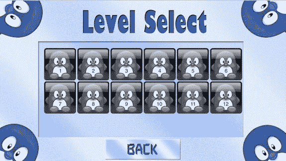

# 18. 游戏状态管理

电子补充材料 本章的在线版本 (doi:[10.1007/978-1-4842-0650-8_18](http://dx.doi.org/10.1007/978-1-4842-0650-8_18)) 包含补充材料，可供授权用户使用。

通常，游戏应用启动时你不会立即开始玩。例如，在《图坦之墓》游戏中，你在开始游戏之前会看到一个标题界面。更复杂的游戏可能包含标题界面、选项菜单、选择不同关卡的菜单、完成关卡后显示高分的界面、选择不同角色和属性的菜单等等。在《图坦之墓》中，添加标题界面并不那么困难，因为标题界面本身的交互性非常少。然而，当你查看上一章的示例时，你会发现构建一个包含几个选项和控件的界面可能会产生相当多的代码。你可以想象，当你向游戏添加更多菜单和界面时，管理哪些对象属于哪个界面以及它们何时应该被绘制或更新将会变得非常麻烦。

通常，这些不同的菜单和界面被称为游戏状态。在某些程序中，它们被称为场景，而负责管理场景的对象是导演。有时会区分游戏模式和游戏状态。在这种情况下，菜单、主游戏画面等属于游戏模式，而“关卡完成”和“游戏结束”则是游戏状态。

本书遵循一种简化的范式，将所有内容统称为游戏状态。为了处理这些不同的游戏状态，你需要一个管理器。在本章中，你将开发此类结构所需的主要类，并学习如何使用它来显示不同的菜单并在它们之间切换，同时保持代码的清晰分离。


## 游戏状态管理基础

要妥善处理游戏状态，你需要确保以下几点：

- 游戏状态应完全独立运行。换言之，你不希望在游戏进行中处理选项菜单界面或游戏结束界面。
- 应提供简便的方法来定义、查找和切换游戏状态。这样一来，当玩家在标题画面按下“选项”按钮时，你就能轻松切换到选项菜单状态。

在之前的示例代码中，总存在某个游戏世界类。从游戏状态的角度看，每个这类世界对象都代表一个独立的（进行中）游戏状态。你需要为每个不同状态定义这样的类。好在你已拥有大量现成代码可供使用。其中，`SKNode` 类尤其有用，因为它能表示一个可能包含整个游戏对象子树的节点，这足以作为表示游戏状态的基础。在之前的游戏中，代表游戏世界的类都继承自 `SKNode` 类。在本书后续示例中，代表游戏状态的类同样将继承自 `SKNode`。因此，若拥有选项菜单、标题画面、关卡选择画面和帮助菜单，你只需为每个游戏状态分别创建独立类。唯一需要补充的是管理游戏中各游戏状态的方法，这可以通过创建游戏状态管理器来实现。

### 游戏状态管理器

本节将创建一个名为 `GameStateManager` 的类，用于管理《企鹅配对》游戏中的各种游戏状态。该游戏状态管理器的重要设计准则是：必须易于访问，且全游戏仅存在一个可随处访问的实例。在《画家》和《图特之墓》游戏中，游戏世界作为 `GameScene` 类的类属性实现了便捷访问。对于游戏状态管理器，我将采取略有不同的做法。

随着软件开发经验的积累，你会发现面对问题时常会采用相似的设计方案。在软件工程中，这些通用解决方案被称为设计模式。其中一些设计模式广为人知，在包括游戏在内的众多应用中普遍使用。针对“需要类具有唯一且可全局访问实例”这一需求，对应的设计模式称为单例模式。以下是一个采用单例设计模式的简单类示例：

```
class MyClass {
    static let instance = MyClass()
    var aProperty = 12
}
```

如您所见，`MyClass` 类包含一个名为 `instance` 的类属性，它自身就是 `MyClass` 的实例。访问该唯一实例非常简单，并通过该实例访问 `aProperty` 属性：

```
print(MyClass.instance.aProperty) // 控制台输出 '12'
```

这种做法的优势在于避免了全局变量，且类设计本身就表明该类应仅有唯一实例。接下来，我们将以完全相同的方式定义游戏状态管理器，创建名为 `GameStateManager` 的单例类。在本章对应的 `PenguinPairs3` 示例中，你可以找到作为单例实现的游戏状态管理器。

该类的设计支持存储不同的游戏状态（即不同的 `SKNode` 实例），以便你选择当前游戏状态，随后管理器会将该节点添加为自身子节点，使所选节点变为活动可见状态。

各游戏状态以节点形式存储在数组中，该数组是 `GameStateManager` 类的属性：

```
var states : [SKNode] = []
```

你还需要定义另一个属性来追踪当前活动的游戏状态（即 `SKNode` 实例）：

```
var currentGameState: SKNode? = nil
```

当 `GameStateManager` 实例被创建时，尚不存在任何游戏状态，因此也没有当前活动状态。因此，`currentGameState` 属性为可选值。


## 为节点分配名称

当处理不同的游戏状态和游戏对象时，如果能通过某种方式识别这些状态/对象会非常有用。在 SpriteKit 框架中，可以为节点分配一个名称。稍后你可以使用这个名称在场景中查找该节点。例如，以下是如何定义一个带有名称的节点：

```
var someNode = SKNode()
someNode.name = "playingField"
```

`SKNode` 类有一个名为 `childNodeWithName` 的方法，可用于搜索节点。默认情况下，此方法会搜索调用它的节点的子节点，直到找到匹配的子节点，然后停止并返回该节点。在搜索节点时，你可以使用正则表达式语法。以下是几个搜索示例：

```
var node = self.childNodeWithName("playingField") /* 搜索该节点的子节点，
    查找第一个名为"playingField"的节点 */
node = self.childNodeWithName("playing*") /* 搜索该节点的子节点，
    查找第一个名称以"playing"开头的节点 */
node = self.childNodeWithName("/playingField") /* 搜索根节点的子节点，
    查找第一个名为"playingField"的节点 */
node = self.childNodeWithName("//playingField") /* 搜索整个节点树，
    并返回找到的第一个名为"playingField"的节点 */
```

利用节点命名方案，你可以编写一个简单的 `get` 方法，作为 `GameStateManager` 类的一部分，根据给定的名称检索游戏状态（`SKNode` 实例）：

```
func get(name: String) -> SKNode? {
    for state in states {
        if state.name == name {
            return state
        }
    }
    return nil
}
```

选择当前活动的游戏状态是通过调用名为 `switchTo` 的方法完成的。在切换游戏状态时需要格外小心。一旦切换到另一个游戏状态，当前游戏状态中的任何对象都将无法再找到（因为该游戏状态不再活动）。因此，仅在每个更新周期结束时切换到另一个游戏状态会更安全。为了实现这一点，`GameStateManager` 类有一个名为 `plannedSwitch` 的属性，它可选地包含一个应切换到的游戏状态标题。在 `switchTo` 方法中，该属性被赋值为作为参数传递的标题：

```
func switchTo(name: String) {
    plannedSwitch = name
}
```

现在，你需要重写 `GameStateManager` 类中的 `updateDelta` 方法来实际执行切换。此方法的第一步是简单地调用父类的 `updateDelta` 方法，以确保所有游戏对象都得到正确更新：

```
super.updateDelta(delta)
```

然后，你检查是否需要切换到另一个游戏状态。当 `plannedSwitch` 属性包含值，并且该值是一个有效的游戏状态标题时，才需要进行切换。如果这两个条件中的任何一个不成立，你就从该方法返回：

```
if plannedSwitch == nil || !has(plannedSwitch!) {
    return
}
```

切换到另一个游戏状态相当直接。首先，移除当前活动的所有子节点（状态）：

```
self.removeAllChildren()
```

然后，定位新的游戏状态，并将其添加为游戏状态管理器所代表的节点的子节点：

```
currentGameState = get(plannedSwitch!)
self.addChild(currentGameState!)
```

作为 `updateDelta` 方法中的最后一条指令，你将 `plannedSwitch` 属性的值再次设置为 `nil`，因为游戏状态切换已经完成。

剩下的唯一一件事就是将游戏状态管理器整合到游戏的核心部分中，因此在 `GameScene` 类的 `update` 方法中调用其游戏循环方法：

```
override func update(currentTime: NSTimeInterval) {
    GameStateManager.instance.handleInput(inputHelper)
    GameStateManager.instance.updateDelta(delta)
    inputHelper.reset()
}
```

## 添加状态并在状态间切换

现在你已经有了游戏状态管理器，可以开始向其中添加不同的状态了。一个非常基本的游戏状态是标题菜单状态。在 `PenguinPairs3` 示例中，你添加了一个名为 `TitleMenuState` 的类来表示此状态。标题菜单状态由四个游戏对象组成：一个背景和三个按钮。你可以重用之前在 Tut's Tomb 游戏中开发的 `Button` 类。以下是 `TitleMenuState` 类的初始化器：

```
override init() {
    super.init()
    self.name = "title"
    let layout = GridLayout(rows: 3, columns: 1, cellWidth: Int(playButton.size.width),
        cellHeight: Int(playButton.size.height))
    layout.yPadding = 5
    let buttons = SKNode()
    buttons.position.y = -200
    self.addChild(buttons)
    layout.target = buttons
    playButton.zPosition = Layer.Scene
    optionsButton.zPosition = Layer.Scene
    helpButton.zPosition = Layer.Scene
    layout.add(helpButton)
    layout.add(optionsButton)
    layout.add(playButton)
    let background = SKSpriteNode(imageNamed: "spr_background_title")
    background.zPosition = Layer.Background
    self.addChild(background)
}
```

如你所见，这里使用了 `GridLayout` 类来非常方便地定位按钮。因为需要在按下按钮时执行某些操作，所以你必须重写 `handleInput` 方法。在该方法中，你检查每个按钮是否被按下，如果是，则切换到另一个状态。例如，如果玩家点击了“玩游戏”按钮，你需要切换到关卡菜单：

```
if playButton.tapped {
    GameStateManager.instance.switchTo("level")
}
```

你为其他两个按钮添加类似的替代方案。现在标题菜单状态基本完成了。在 `GameScene` 类中，唯一需要做的就是创建一个 `TitleMenuState` 的实例并将其添加到游戏状态管理器中。对于游戏中所有其他状态，你也执行同样的操作。之后，你将当前活动状态设置为标题菜单，这样玩家在游戏启动时就会看到标题菜单：

```
GameStateManager.instance.addChild(TitleMenuState())
GameStateManager.instance.addChild(HelpState())
GameStateManager.instance.addChild(OptionsMenuState())
GameStateManager.instance.addChild(LevelMenuState(nrLevels: 12))
// 当前游戏状态是标题画面
GameStateManager.instance.switchTo("title")
```

帮助和选项菜单状态以类似于 `TitleMenuState` 的方式设置。在类的初始化器中，你将游戏对象添加到游戏世界，并重写 `handleInput` 方法以在状态间切换。例如，帮助和选项菜单状态都包含一个返回标题画面的“返回”按钮：

```
if backButton.tapped {
    GameStateManager.instance.switchTo("title")
}
```

请查看 `PenguinPairs3` 示例中的 `HelpState` 和 `OptionsMenuState` 类，了解不同状态是如何设置的以及如何在状态间切换。


### 关卡菜单状态

一个稍微复杂一点的游戏状态是关卡菜单。你希望玩家能够从一组关卡按钮中选择一个关卡。这些关卡按钮需要显示三种不同的状态，因为一个关卡可能处于锁定、解锁但尚未通关、或已通关这三种状态。为了实现这一点，你需要某种在游戏运行之间持久存储的机制，这将在下一章讨论。

在你创建 `LevelMenuState` 类之前，你需要添加一个名为 `LevelButton` 的类，它继承自 `Button`。在 `LevelButton` 类中，你需要追踪该按钮对应的关卡索引，以及该关卡是已通关、未通关还是对玩家锁定。根据关卡状态，按钮应具有不同的外观。因为按钮有三种不同的状态，你需要加载三种纹理，每种状态对应一种纹理。简而言之，以下是 `LevelButton` 中定义的存储属性：

```
var levelIndex = 0
var locked = SKTexture(imageNamed: "spr_level_locked")
var unsolved = SKTexture(imageNamed: "spr_level_unsolved")
var solved = SKTexture(imageNamed: "spr_level_solved")
```

稍后，你将修改 `LevelButton` 类，使其根据关卡状态显示其中一种纹理。目前，你只需在按钮创建时显示未通关纹理。此外，在初始化器中添加一个文本标签，绘制在企鹅的肚子上，这样玩家就能看到每个按钮对应的关卡，如下所示：

```
let textLabel = SKLabelNode(fontNamed: "Helvetica")
textLabel.position = CGPoint(x: 0, y: -25)
textLabel.fontColor = UIColor(red: 0, green: 0, blue: 0.4, alpha: 1)
textLabel.fontSize = 24
textLabel.text = String(levelIndex)
textLabel.horizontalAlignmentMode = .Center
textLabel.zPosition = Layer.Overlay
self.addChild(textLabel)
```

最后，在 `handleInput` 方法中，你检查按钮是否被点击。如果玩家点击了关卡按钮，且该关卡未被锁定，游戏应切换到对应的关卡。假设索引为 x 的关卡名称为 `"levelx"`。同时，当玩家切换到某个关卡时，你可能需要重置该关卡，以便玩家能够立即从头开始游戏。简而言之，以下是完整的 `handleInput` 方法：

```
override func handleInput(inputHelper: InputHelper) {
    super.handleInput(inputHelper)
    if self.texture == locked {
        return
    }
    if tapped {
        GameStateManager.instance.switchTo("level\(levelIndex)")
        GameStateManager.instance.reset()
    }
}
```

请注意，在 PenguinPairs3 示例中，这个方法实际上被注释掉了，因为还没有关卡状态。

正如你所见，只要事先考虑好软件的设计，为游戏添加不同的状态并在它们之间切换并不困难。通过提前思考需要哪些类以及游戏功能如何在它们之间分配，你可以在之后节省大量时间。在下一章中，你将通过创建实际的关卡来进一步扩展这个示例。图 18-1 展示了关卡菜单状态的截图。



**图 18-1.** 企鹅配对游戏中的关卡菜单界面

## 本章所学内容

在本章中，你学习了以下内容：

- 什么是设计模式以及单例模式提供了什么
- 如何使用游戏状态管理器定义不同的游戏状态
- 如何根据玩家的操作在游戏状态之间切换

