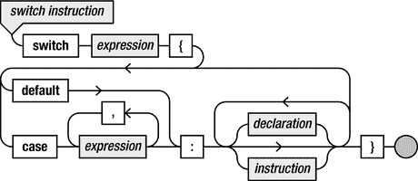
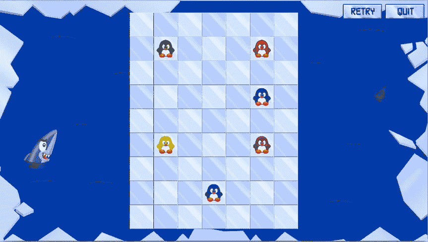
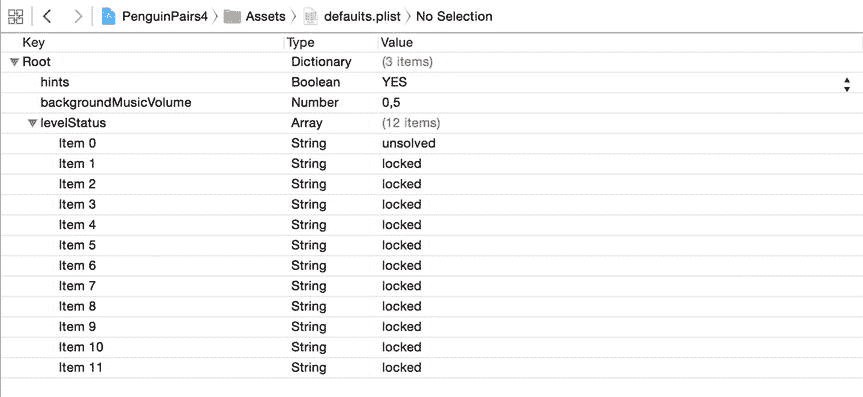

# 19. 存储和读取游戏数据

电子补充材料 本章在线版本 (doi:[10.​1007/​978-1-4842-0650-8_​19](http://dx.doi.org/10.1007/978-1-4842-0650-8_19)) 包含补充材料，仅供授权用户使用。

许多游戏由不同的关卡组成。像解谜游戏和迷宫游戏这样的休闲游戏可能有数百个关卡。到目前为止，你的游戏都依赖随机性来保持游戏的可玩性。虽然随机性是实现可重复游玩的强大工具，但在许多情况下，游戏设计师希望更精确地控制游戏进程。这种控制通常通过设计关卡来实现。每个关卡都是一个独立的游戏世界，玩家需要在其中达成某种目标。

使用你目前掌握的工具，你需要为游戏中的每个关卡编写一个特定的类，在其中填充该关卡的游戏对象，并添加所需的行为。这种方法有几个缺点。最重要的缺点是，你将游戏逻辑（玩法、胜利条件等）与游戏内容混合在一起。这意味着每次你想为游戏增加一个关卡时，都必须编写一个新的类，这会大大增加开发时间。此外，如果一位游戏设计师想要在你构建的游戏中添加一个关卡，设计师需要深入了解你的代码是如何工作的。而设计师在编写代码时犯的任何错误都会导致游戏出现错误或崩溃。

一个更好的方法是将关卡信息与实际游戏代码分开存储。在游戏加载时，再获取这些关卡信息。理想情况下，这些信息需要以非程序员也能理解和处理的简单格式存储。这样，关卡就可以由非开发人员来设计，而无需知道游戏如何将这些数据转换为可玩的游戏关卡。存储关卡信息最便捷的方式是使用文本格式。你可以非常轻松地使用文本来描述一个关卡。请看以下示例：

```
RHBQKBHR
PPPPPPPP
........
........
........
........
pppppppp
rhbqkbhr
```

这段文本数据描述了国际象棋游戏的起始局面，其中每个字符代表一个棋子（小写字母代表白棋，大写字母代表黑棋）。如果你创建了一个能够从文件中读取此类描述的国际象棋游戏，你就可以非常轻松地修改文件，以允许不同的起始局面。例如，你可以让设计师创建一系列取自国际象棋大师实际对局的经典棋局。你无需对游戏代码做任何修改。你甚至可以决定创建一个超级国际象棋游戏，通过增加列和行来扩大棋盘（前提是加载游戏数据的代码支持这一点）。所有这些都可以在不了解国际象棋游戏实际工作原理的情况下完成。因为是简单的文本，这种格式相对容易理解，即使是对编程经验很少或没有经验的人也是如此。你可以采用这种技术为游戏创建各种关卡，而无需修改任何代码。这对于大型游戏尤其有用，因为这类游戏通常涉及更大的团队。通过将关卡设计与代码编写分离，你就能让那些擅长游戏设计和图形设计等任务的非程序员更高效地帮助你创建出色的游戏。

你将类似地处理企鹅配对游戏中的不同关卡。在本章中，你将看到如何将这样的关卡加载方案构建到你的游戏中。你还需要考虑的另一件事是跨游戏会话存储和读取不同游戏的状态。像《画图》和《图坦之墓》这样的游戏不会保留玩家之前游玩时的任何信息，这对于那些游戏来说无关紧要。但对于企鹅配对游戏来说，这很重要，因为你不想让玩家每次启动游戏时都要从头开始。如果玩家完成了一个关卡，应用程序应该在下次启动时记住这一点，这样玩家就可以从上次中断的地方继续游戏。


## 关卡的结构

我们先来看看《企鹅配对》游戏中一个关卡里可能包含哪些元素。首先，会有一张某种类型的背景图片。我们假设这张背景在加载关卡时就固定了，因此无需在文本文件中存储与之相关的任何信息。

关卡中有许多不同的动物，比如企鹅、海豹和鲨鱼。此外，还有冰山、企鹅可以行走的背景方块，以及一些其他东西。你需要将所有这些信息存储在关卡文件中。一种可能性是存储每个对象的位置和类型，但这会让变量变得复杂。另一种可能性是将关卡划分为小方块，也称为瓦片。每个瓦片都有特定的类型（可以是企鹅、游戏场地瓦片、透明瓦片、海豹等）。一个瓦片可以用单个字符来表示，你可以像国际象棋示例那样，将关卡的结构存储在文本文件中：

```
#.......#
#...r...#
#.......#
#.     .#
#.     .#
#.     .#
#.......#
#...r...#
#.......#
```

在这个关卡定义中，定义了许多不同的方块。冰山（墙壁）瓦片由 `#` 符号定义，企鹅由 `r` 字符定义，背景瓦片由 `.` 字符定义，空瓦片由空格字符定义。在本章后面，你将编写一个方法，利用这些信息来创建各种瓦片并将它们存储在某处（可能是一个 `SKNode` 实例中）。

除了瓦片，你还需要为每个关卡存储一些其他信息：

*   关卡标题
*   关卡提示
*   需要配对的组数
*   关卡的宽度和高度（用于文件读取）
*   提示箭头的位置和方向

因此，你可以像下面这样在文本文件中定义一个完整的关卡：

```
Splash!
Don’t let the penguins fall in the water!
1
9 9
3 7 l
#.......#
#...r...#
#.......#
#.     .#
#.     .#
#.     .#
#.......#
#...r...#
#.......#
```

对于每个关卡，你都要在文本文件中添加类似的文本行。如果你打开 PenguinPairs4 示例中的 `levels.txt` 文件，你会看到它包含了许多不同的关卡。文本文件的第一行指明了文件中定义了多少个关卡（在本例中为 12 个）。

## 从文件读取数据

既然《企鹅配对》的关卡已经在文本文件中定义好了，接下来你需要编写实际读取这个文本文件的代码。在 Swift 中读取文本文件相当直接。它基本上包含两个步骤：首先，你需要指定要读取哪个文件；然后，你可以使用 `String` 类型，它有一个可以读取文件内容的初始化器。例如，以下两行代码读取了 `levels.txt` 文件：

```
let filePath = NSBundle.mainBundle().pathForResource("levels", ofType:"txt")
let data = try! String(contentsOfFile: filePath!, encoding: NSUTF8StringEncoding)
```

通过这种方式读取文件后，你会得到一个包含整个文本文件内容的字符串。将这个字符串拆分成多个字符串非常有用，其中每个字符串对应文本文件中的一行。你可以使用 `componentsSeparatedByString` 方法来实现这一点，该方法将一个字符串分割成多个子字符串，并存储在一个数组中（注意使用换行符作为分隔符）：

```
let multipleStrings = data.componentsSeparatedByString("\n")
```

在继续使用文件数据来读取《企鹅配对》关卡之前，我们先设计一个简单的类，让文件读取变得更轻松。在 PenguinPairs4 示例中，你会找到 `FileReader` 类，它负责读取文件并提供简单的访问方式。在初始化器中，会读取作为参数传入的文件，并将其数据存储在一个字符串数组中。现在，你只需创建一个 `FileReader` 实例就可以读取文件了。例如，在 `GameScene` 类中，就是这样读取关卡数据的：

```
let levels = FileReader(filename: "levels")
```

下一步是访问文件数据。你可以直接访问 `FileReader` 实例中的字符串数组来做到这一点。另一种方法是使用迭代器设计模式。基本上，这意味着 `FileReader` 实例在遍历文件数据时，会跟踪你已经检索到数据的哪个部分。注意，我们在 `FileReader` 类中添加了一个名为 `it` 的属性，用于记录当前在字符串数组中的读取位置：

```
var it = -1
```

接着，定义一个名为 `nextLine` 的方法，它会递增 `it` 属性并返回下一行。以下是完整的方法：

```
func nextLine() -> String {
    if (it >= fileData.count - 1) {
        return ""
    } else {
        it++
        return fileData[it]
    }
}
```

所以，每当你想要读取文件中的下一行时，只需调用 `nextLine` 方法即可。请注意，该方法中核心的代码在于这两行：

```
it++
return fileData[it]
```

首先，你递增迭代器，然后返回迭代器对应的数组元素。有一个巧妙的小技巧可以将这两行代码合并成一行。这依赖于 `++` 后置运算符会返回一个结果这一事实。换句话说，你可以这样做：

```
var result = it++
```

现在，`result` 变量将包含 `it` 的旧值。也就是说，如果 `it` 的值是 3，那么执行这条指令后，`result` 将包含值 3（`it` 的旧值），而 `it` 将包含值 4。你也可以这样做：

```
var anotherResult = ++it
```

在这种情况下，因为你使用了 `++` 前缀运算符，`anotherResult` 将包含 `it` 的新值（递增之后的值）。所以，如果 `it` 是 3，那么执行这条指令后，`it` 和 `anotherResult` 都将包含值 4。回到文件读取的例子，这意味着你可以将 `nextLine` 方法中的两行代码替换为下面这一行：

```
return fileData[++it]
```

每当你需要从文件中读取一行时，都可以使用 `nextLine` 方法。例如，在 `GameScene` 类中加载文件后，你就可以检索文件的第一行以获取关卡数量：

```
let nrLevels = levels.nextLine().toInt()!
```

然后，你使用一个 `for` 循环为每个关卡创建一个状态：

```
for i in 1...nrLevels {
    GameStateManager.instance.addChild(LevelState(fileReader: levels, levelNr: i))
}
```

如你所见，你将 `FileReader` 实例传递给了 `LevelState` 的初始化器，这样每个关卡状态都可以检索自己的关卡数据（稍后会详细介绍）。

## Tile 类

在开始创建实际的关卡之前，让我们先做一些准备工作，编写一个基础的 `Tile` 类。这个类是 `SKSpriteNode` 类的子类。目前，我们不考虑关卡中更复杂的元素，比如企鹅、海豹和鲨鱼。我们只关注背景（透明）瓦片、普通瓦片和墙壁（冰山）瓦片。让我们引入一个枚举类型来表示这些不同的瓦片种类：

```swift
enum TileType {
    case Wall
    case Background
    case Normal
}
```

`Tile` 类是 `SKSpriteNode` 的一个基本子类。它只是添加了一个表示瓦片类型的属性：

```swift
private var tileTipe: TileType = .Background
```

为了适应透明瓦片，我们提供了一个 `convenience` 初始化器，它会加载一个墙壁精灵图片，并将节点设置为隐藏：

```swift
convenience init() {
    self.init(imageNamed: "spr_wall", type: .Background)
    self.hidden = true
}
```

当你加载关卡时，你会为每个字符创建一个瓦片，并使用 `GridLayout` 类将其存储在网格结构中。


## 关卡状态

在上一章中，你已经了解了如何创建多个游戏状态，例如标题画面、关卡选择菜单和选项菜单。在本节中，你将添加多个关卡状态。每个关卡状态都是 `SKNode` 的子类，并向世界添加自己的游戏对象。`LevelState` 的初始化器需要一个 `FileReader` 实例（以便读取关卡数据），以及该关卡对应的编号。以下是 `LevelState` 初始化器的一部分：

```
init(fileReader: FileReader, levelNr : Int) {
    super.init()
    self.levelNr = levelNr
    self.name = "level\(levelNr)"
    // 待办：根据关卡数据向此关卡填充游戏对象
}
```

如你所见，每个关卡都被分配了一个唯一的名称。关卡 1 被称为“level1”，关卡 2 被称为“level2”，依此类推。你还需要跟踪动物，例如企鹅、海豹和鲨鱼。你可以将它们存放在一个独立的节点中，并作为 `LevelState` 的一个属性，以便之后能快速查找动物。

```
var animals = SKNode()
```

现在，你可以开始创建游戏对象来填充游戏世界了。首先，向游戏世界添加一个背景图片：

```
let background = SKSpriteNode(imageNamed: "spr_background_level")
background.zPosition = Layer.Background
self.addChild(background)
```

除此之外，还需要添加属于该关卡的各种按钮（退出、重试和提示）。请查看 PenguinPairs4 示例中的 `LevelState.swift` 文件以获取相应代码。

添加背景和按钮之后，你可以开始读取存储在文本文件中的数据了。第一步是读取关卡标题、帮助信息、所需配对数量、关卡尺寸以及提示信息，然后将这些信息存储到局部变量中，以便之后用于构建游戏世界：

```
let title = fileReader.nextLine()
let help = fileReader.nextLine()
let nrPairs = fileReader.nextLine().toInt()!
let sizeArr = fileReader.nextLine().componentsSeparatedByString(" ")
let width = sizeArr[0].toInt()!, height = sizeArr[1].toInt()!
let hintArr = fileReader.nextLine().componentsSeparatedByString(" ")
```

下一步是实际创建瓦片区域。为此，需要定义一个名为 `TileField` 的类，它是 `SKNode` 的子类，但增加了网格布局。此外，它还有一个名为 `getTileType` 的方法，用于返回网格中某个位置上的瓦片类型。稍后，这个方法将用于检查例如企鹅是否已掉落出游戏区域等情况。以下是完整的类定义：

```
class TileField : SKNode {
    var layout: GridLayout
    init(rows: Int, columns: Int, cellWidth: Int, cellHeight: Int) {
        layout = GridLayout(rows: rows, columns: columns,
            cellWidth: cellWidth, cellHeight: cellHeight)
        super.init()
        layout.target = self
    }
    required init?(coder aDecoder: NSCoder) {
        fatalError("init(coder:) has not been implemented")
    }
    func getTileType(col: Int, row: Int) -> TileType {
        if let obj = layout.at(col, row: row) as? Tile {
            return obj.type
        }
        return .Background
    }
}
```

在 `LevelState` 的初始化器中，你需要创建 `TileField` 实例，并指定合适的高度、宽度和单元格尺寸：

```
let tileDimension = 75
var tileField = TileField(rows: height, columns: width,
    cellWidth: tileDimension, cellHeight: tileDimension)
tileField.name = "level\(levelNr)_tileField"
self.addChild(tileField)
```

现在，你可以开始从文本文件中检索实际的关卡数据了。下一步是读取该关卡剩余的所有行，并将其存储到一个数组中，以便后续遍历该数组：

```
var lines: [String] = []
for i in 0..<height {
    var newLine = fileReader.nextLine()
    while count(newLine) < width {
        newLine += " "
    }
    lines.append(newLine)
}
```

如你所见，这里有一个额外的 `while` 循环，用于向刚读取的行中添加空格字符。这样做是为了避免因关卡行的宽度不一致而产生问题。考虑以下关卡定义：

```
.
r.r
.
```

这是一个非常简单的关卡，包含两只企鹅。该关卡的宽度为三个单元格。然而，由于关卡的布局，在关卡定义的第一行和最后一行，该关卡只定义了两个单元格（先是空格，然后是点）。你可以要求你的关卡设计师在文本文件中添加足够的空格，以确保所有行的宽度一致，但这存在风险。关卡设计师可能会忘记这样做，而通过代码中的 `while` 循环可以轻松解决这个问题。这是一个很好的例子，说明为什么有时需要编写额外的代码来使系统更健壮。通过添加 `while` 循环，可以省去关卡设计师的很多麻烦；这使得设计关卡的过程更加稳定。

既然你已经将所有关卡数据存储在一个字符串数组中，接下来使用另一个 `for` 循环来遍历每一行，并创建所有瓦片：

```
for i in 0..<height {
    var currLine = lines[height-1-i]
    var j = 0
    for c in currLine {
        j++
        // 在第 i 行、第 j 列创建瓦片
    }
}
```

注意，你从数组的最后一行开始处理。这是因为网格是从底部向上填充的（沿着 y 轴方向）。根据当前处理的字符，你需要创建不同类型的游戏对象，并将它们添加到瓦片区域。你可以使用 `if` 指令来实现：

```
if c == "." {
    // 创建一个空瓦片
} else if c == " " {
    // 创建一个背景瓦片
} else if c == "r" {
    // 创建一个企鹅瓦片
} else {
    // 执行其他操作
}
```

原则上，这段代码是可行的。但你需要反复编写条件判断。还有一种更简洁的写法。Swift 提供了一种专门用于处理各种情况的关键字：`switch`。

**注意**

当以基于文本的格式定义关卡时，你需要决定每个字符代表哪种对象。这些决策将影响关卡设计师（他们需要在关卡数据文件中输入字符）和开发人员（他们需要编写代码来解释这些关卡数据）的工作。这表明了文档的重要性，即使在积极开发阶段也是如此。拥有一份“速查表”是很好的，这样在编写代码时，你就不必记住所有关于关卡设计的想法。如果你与设计师合作，速查表也很有用，可以确保你们双方的理解保持一致。


### 使用 `switch` 处理多种选择

`switch` 指令允许你指定多种备选方案，以及每个方案应执行的指令。例如，之前包含多个备选方案的 `if` 指令可以改写为如下的 `switch` 指令：

```
switch c {
    case ".": // 创建一个空瓦片
    case " ": // 创建一个背景瓦片
    case "r": // 创建一个企鹅瓦片
    default: // 执行其他操作
}
```

`switch` 指令有几个便捷特性，使其在处理不同备选方案时非常有用。请看下面的代码示例：

```
if x == 1 {
    one()
} else if x == 2 {
    two()
    alsoTwo()
} else if x == 3 || x == 4 {
    threeOrFour()
} else {
    more()
}
```

你可以用 `switch` 指令将其重写如下：

```
switch x {
    case 1:
        one()
    case 2:
        two()
        alsoTwo()
    case 3, 4:
        threeOrFour()
    default:
        more()
}
```

当执行 `switch` 指令时，会计算 `switch` 关键字后的表达式。然后执行 `case` 关键字后与该特定值对应的指令。如果没有与值匹配的分支，则执行 `default` 关键字后的指令。不同 `case` 后的值必须是常量值（数字、双引号之间的字符串，或声明为常量的变量）。如你所见，一个 `case` 可以代表多个值；在示例中，3 和 4 属于同一个 `case`。对于每个 `case`，可以执行多条指令（例如 `case 2`）。

一个重要细节是，`switch` 指令必须是穷尽的，换句话说：所有情况都必须被处理。最简单的解决方法是使用 `default` 分支，如上面的示例所示。当 `switch` 指令中所有显式分支都不匹配时，就会执行 `default` 分支的代码。图 19-1 展示了 `switch` 指令的示意图。



图 19-1. `switch` 指令的语法图

### 加载不同类型的瓦片

你可以使用 `switch` 指令来加载所有不同的瓦片和游戏对象。对于关卡数据中的每个字符，你需要执行不同的任务。例如，当读取字符“.”时，你需要创建一个普通的游戏场地瓦片。以下指令实现了这一点：

```
let tileSprite = "spr_field_\((i + j) % 2)"
var tile = Tile(imageNamed: tileSprite, type: .Normal)
tile.zPosition = Layer.Scene
tileField.layout.add(tile)
```

瓦片使用的精灵交替为 `spr_field_0.png` 或 `spr_field_1.png`。通过使用公式 `(i + j) % 2` 切换精灵，你可以获得交替的棋盘格图案，如运行本章附带的 PenguinPairs4 程序所示。另一个例子是添加一个透明背景瓦片：

```
var tile = Tile()
tile.zPosition = Layer.Scene
tileField.layout.add(tile)
```

当你需要放置一个动物时，需要完成两件事：

- 放置一个普通瓦片。
- 放置动物。

由于动物有时需要在棋盘上移动，并且你需要与它们交互，所以你创建了一个名为 `Animal` 的类来表示动物，例如企鹅、海豹或鲨鱼。在本节稍后部分，你将看到这个类的具体样子。在 `switch` 指令中，你按如下方式创建一个普通瓦片和一只企鹅：

```
let tileSprite = "spr_field_\((i + j) % 2)"
var tile = Tile(imageNamed: tileSprite, type: .Normal)
tile.zPosition = Layer.Scene
tileField.layout.add(tile)

var p = Animal(type: String(c))
p.position = tile.position
p.initialPosition = tile.position
p.zPosition = Layer.Scene1
animals.addChild(p)
```

第一步是创建一个普通瓦片并将其添加到瓦片字段中。然后创建 `Animal` 实例。`Animal` 的初始化器将当前字符作为参数，以便你可以在 `Animal` 初始化器中加载正确的精灵。创建 `Animal` 对象后，你将其位置设置为你创建的瓦片位置，以便正确放置。你还将一个名为 `initialPosition` 的属性设置为相同的值。这样做是为了如果玩家卡住并按下重试按钮，你可以知道关卡中每个动物的原始位置。

在 `Animal` 初始化器中，你将字符作为参数传递。有几种不同类型的动物。根据动物类型，你需要在初始化器中执行不同的操作。其中一种特殊类型的动物是盒装动物。这代表一只被困在冰洞中的动物。玩家无法移动盒装动物。在关卡描述中，盒装动物由大写字符表示。你检查字符是否为大写，并将该信息作为布尔值存储在 `Animal` 类的 `boxed` 属性中：

```
boxed = type.uppercaseString == type
```

然后你编写几条指令将动物类型转换为精灵名称：

```
var spriteName = "spr_animal_\(type)"
if boxed && type != "@" {
    spriteName = "spr_animal_boxed_\(type.lowercaseString)"
}
```

如果动物在盒子中，或者它是一个空盒子（由 `"@"` 字符表示），你将使用另一个精灵名称。为了完成 `Animal` 类，你添加了几个便捷方法来检查是否在处理特殊情况，例如彩色企鹅、空盒子、海豹或鲨鱼。彩色企鹅可以与任何其他颜色的企鹅配对，关卡中的空盒子可用于将企鹅移入，海豹可以四处移动但永远不会成对，鲨鱼则会吞噬任何挡路的东西。完整的 `Animal` 类，请参阅本章附带的 PenguinPairs4 示例程序。

现在，你已在 `switch` 指令中处理了所有这些不同情况，你可以加载每个关卡了。请查看示例中的 `LevelState` 类以了解完整的关卡创建过程。图 19-2 显示了其中一个关卡加载后的屏幕截图。



图 19-2. 企鹅配对游戏中的其中一个关卡


## 维护玩家游戏进度

为了完成本章内容，本节将向您展示一种跟踪玩家在不同游戏会话中进展的优秀方法。您希望游戏能够记住玩家上次游玩时的位置。实现这一目标有多种方式。一种是让玩家自行处理，直接默认解锁所有关卡。这虽然是一种解决方案，但无法真正激励玩家按顺序逐个通关。另一种方式是使用文本文件存储玩家状态。第三种方案是采用所谓的用户默认设置。这项功能能让您毫不费力地追踪游戏玩家的设置和偏好。只需编写一行代码，即可获取当前的用户默认设置：

```
var defaults = NSUserDefaults.standardUserDefaults()
```

`defaults` 变量的作用类似于字典，您可以在其中存储键值对，这些键值对能在不同游戏会话中保持其值不变。例如，您可以通过在 `defaults` 变量中存储一个布尔值，来记录玩家是否希望在《企鹅配对》游戏中查看提示：

```
defaults.setBool(true, forKey: "hints")
```

同样地，从用户默认设置中读取数据也非常直接：

```
let showHints = defaults.boolForKey("hints")
```

当玩家首次启动《企鹅配对》游戏时，自然还没有与该游戏相关的默认信息。在这种情况下，您需要用“默认的默认值”来填充 `defaults` 变量。对于《企鹅配对》而言，这意味着提示功能开启，背景音乐音量设为 0.5，并且除第一关状态为“未解决”外，所有关卡均处于锁定状态。这些数据可以再次存储在文本文件中，并在玩家首次启动《企鹅配对》应用时读取。

为了采用略有不同的方法，您将不会从普通文本文件中读取这些数据，而是从属性列表文件（`plist`）中读取。这是一种非常方便的基于文本的文件格式。它在底层使用 XML 来组织文本结构，但 Xcode 环境提供了一个非常有用的工具，让您能非常轻松地编辑这些文件。如果您点击 PenguinPairs4 项目中的 `defaults.plist` 文件，将会看到一个编辑器界面（见图 19-3）。在此编辑界面中，您可以更改默认文件的内容。您可以向列表中添加或移除项目。



图 19-3. Xcode 中属性列表编辑界面的截图

从属性列表文件中读取数据非常直接。只需几行代码，您就可以读取该文件并将其内容存储到字典中：

```
var filePath = NSBundle.mainBundle().pathForResource("defaults", ofType:"plist")
let defaultPreferences = NSDictionary(contentsOfFile: filePath!)!
```

现在，您可以使用如下 `for` 循环遍历字典中的所有项目，并将它们添加到用户默认设置中：

```
for (key, value) in defaultPreferences {
    defaults.setObject(value, forKey: key as! String)
}
```

为了整洁地处理用户默认设置，PenguinPairs4 示例中包含了一个 `DefaultsManager` 类。该类与游戏状态管理器一样，实现了单例设计模式。它允许您轻松地读写用户偏好设置。例如，在选项菜单状态下，会检索用户对背景音乐音量的偏好，并将滑块设置为相应的值：

```
musicSlider.value = CGFloat(DefaultsManager.instance.musicVolume)
```

请自行查看 PenguinPairs4 示例，了解它如何处理默认值和偏好设置。

### 存档游戏的诅咒

大多数游戏都包含一种让玩家保存进度的机制。这通常有三种用途：稍后继续游戏、在游戏后期失败时返回到之前的存档点，或者尝试不同的策略或故事线。这些可能性听起来都合情合理，但也引入了问题；在设计游戏时，您必须仔细考虑何时（以及如何）允许玩家保存和加载游戏状态。

例如，在早期的第一人称射击游戏中，所有敌人都位于游戏世界中固定的位置。玩家们形成了一种常见策略：先保存游戏，冲进一个房间查看敌人的位置（这通常会导致立即死亡），然后加载已保存的游戏，并利用获取的敌人位置信息，小心翼翼地清理房间。这大大降低了游戏难度，但这绝非创作者的本意。通过提高保存或加载游戏的难度，可以部分地弥补这个问题。其他游戏只允许在特定的存档点进行保存。有些甚至将到达存档点本身作为挑战的一部分。但这可能会导致挫败感，因为如果有一个非常困难的地点，玩家可能不得不反复重玩游戏的某些部分。最有趣的游戏是那些你永远不必返回存档点的游戏，因为你永远不会真正失败，但这在设计上极为困难。

因此，请仔细考虑您的存档机制。您会在何时允许保存？您会允许多少个不同的存档？游戏中保存是如何工作的？玩家如何加载已保存的游戏？保存或加载游戏是否需要玩家付出代价？所有这些决策都会影响游戏玩法和玩家满意度。

## 本章所学

在本章中，您学习了以下内容：

- 如何通过从文本文件读取数据来创建基于瓦片的游戏世界
- 如何使用 `switch` 指令处理不同的情况
- 如何使用用户默认设置检索和存储关卡状态数据

