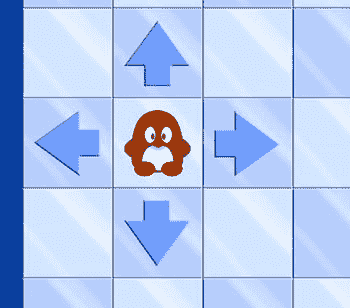
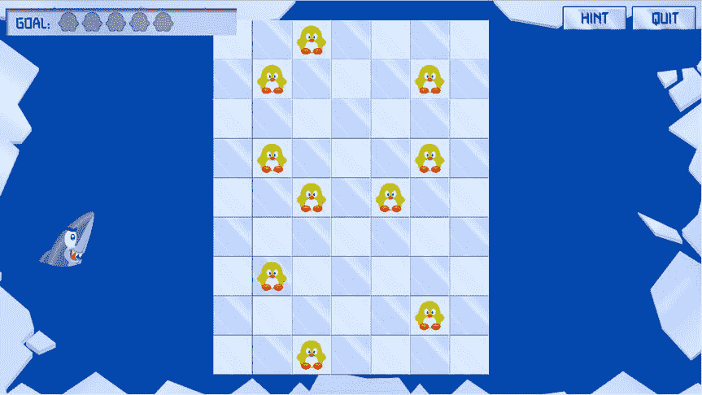

# 20. 游戏对象之间的交互

电子补充材料 本章的在线版本 (doi:[10.1007/978-1-4842-0650-8_20](http://dx.doi.org/10.1007/978-1-4842-0650-8_20)) 包含补充材料，仅供授权用户使用。

在本章中，您将为《企鹅配对》游戏编写主要的游戏逻辑。您将学习如何在棋盘上移动企鹅，以及当企鹅与另一个游戏对象（如鲨鱼或其他企鹅）发生碰撞时该如何处理。

## 定义运算符

由于您将处理移动和碰撞的企鹅，因此会进行大量涉及二维点和向量（由 `CGPoint` 实例表示）的计算。目前，使用这些点进行计算有点麻烦。例如，在 `LevelState` 类中，您必须这样定位退出按钮：

```
quitButton.position = GameScreen.instance.topRight
quitButton.position.x -= quitButton.center.x + 10
quitButton.position.y -= quitButton.center.y + 10
```

如果能像这样操作就简单多了：

```
quitButton.position = GameScreen.instance.topRight – quitButton.center –
    CGPoint(x: 10, y: 10)
```

遗憾的是，Swift 并没有定义减法运算符对两个 `CGPoint` 实例的作用。幸运的是，定义减法运算符应该做什么非常容易，因为 Swift 允许您通过编写一个函数来定义该行为：

```
func - (left: CGPoint, right: CGPoint) -> CGPoint {
    return CGPoint(x: left.x - right.x, y: left.y - right.y)
}
```

如您所见，减法运算符创建了一个新的 `CGPoint` 实例并返回它。一旦定义了此函数，您就可以对 `CGPoint` 实例进行减法运算了。很简单，不是吗？您还可以定义其他运算符，例如 `==` 运算符，它比较两个 `CGPoint` 实例，如果它们是同一个点则返回 `true`：

```
func == (left: CGPoint, right: CGPoint) -> Bool {
    return (left.x == right.x) && (left.y == right.y)
}
```

请查看 `Math.swift` 文件，了解其中定义的一系列此类运算符，这些定义使得使用 `CGPoint` 实例进行计算变得更加容易。


### 选择企鹅

在移动企鹅之前，你需要能够选中一只企鹅。当你点击企鹅或海豹等动物时，会出现四个箭头，让你控制该动物的移动方向。为了显示这些箭头并处理输入，你可以添加一个名为 `AnimalSelector` 的类。动物选择器包含四个箭头，并继承自 `SKNode` 类。当你点击一只企鹅时，动物选择器会出现，它由四个箭头组成，每个箭头指向不同的方向（参见图 20-1）。



*图 20-1.* 点击企鹅后出现在其周围的动物选择器箭头

这四个箭头每个都是 `Button` 类的实例。`AnimalSelector` 类的初始化器需要一个 `spacing` 参数，该参数控制每个箭头距离所选动物位置的距离。如果你为间距选择值 75，那么每个箭头都会被整齐地放置在网格上，因为网格单元格的宽度和高度都是 75 点。

由于选择器控制着特定的动物，你还必须跟踪它控制的是哪一只。因此，你还需要向 `AnimalSelector` 类添加一个名为 `selectedAnimal` 的属性，该属性包含对目标动物的引用。在初始化器中，你根据间距的值定位四个箭头。最初，你假设尚未选中任何动物，因此动物选择器是隐藏的。以下是完整的 `AnimalSelector` 初始化器：

```
init(spacing: Int) {
    super.init()
    arrowRight.position = CGPoint(x: spacing, y: 0)
    arrowUp.position = CGPoint(x: 0, y: spacing)
    arrowLeft.position = CGPoint(x: -spacing, y: 0)
    arrowDown.position = CGPoint(x: 0, y: -spacing)
    self.addChild(arrowRight)
    self.addChild(arrowUp)
    self.addChild(arrowLeft)
    self.addChild(arrowDown)
    self.hidden = true
}
```

在 `handleInput` 方法中，你首先检查选择器是否可见。如果不可见，则无需处理输入：

```
if hidden {
    return
}
```

然后，你检查是否有箭头被点击。如果有，则计算所需的动物速度：

```
super.handleInput(inputHelper)
var animalVelocity = CGPoint.zeroPoint
if arrowRight.tapped {
    animalVelocity.x = 1
} else if arrowLeft.tapped {
    animalVelocity.x = -1
} else if arrowUp.tapped {
    animalVelocity.y = 1
} else if arrowDown.tapped {
    animalVelocity.y = -1
}
animalVelocity *= 500
```

请注意自定义运算符的使用，以及它如何定义为将一个点乘以一个常数。一旦你计算了所需的动物速度，就将其分配给所选动物的 `velocity` 属性：

```
selectedAnimal?.velocity = animalVelocity
```

最后，如果玩家点击了任何地方但未点击所选动物（例如，点击了另一只企鹅或屏幕的其他部分），则再次隐藏动物选择器，并将 `selectedAnimal` 属性设置为 nil：

```
if inputHelper.hasTapped && !inputHelper.containsTap(selectedAnimal!.box) {
    self.hidden = true
    selectedAnimal = nil
}
```

在 `Animal` 类的 `handleInput` 方法中，你需要处理点击动物。然而，在某些情况下你无需处理，例如：

- 动物不可见。
- 动物在冰洞中。
- 动物是鲨鱼。
- 动物已经在移动。

在所有此类情况下，你都不执行任何操作，并直接返回该方法：

```
if hidden || boxed || isShark || velocity != CGPoint.zeroPoint {
    return
}
```

如果玩家没有点击该动物，你也可以从该方法返回。因此，你添加以下 `if` 指令来验证这一点：

```
if !inputHelper.containsTap(box) {
    return
}
```

现在，既然你知道玩家点击了这只动物，你应该将动物选择器分配给它。第一步是找到动物选择器游戏对象：

```
if let animalSelector = childNodeWithName("//animalSelector") as? AnimalSelector {
    // 执行某些操作
}
```

传递给 `childNodeWithName` 方法的表达式由正则表达式部分（`//`）组成，该部分告诉方法在整个节点树中搜索，以及动物选择器对象的名称。一旦你找到了动物选择器，就可以使选择器可见、设置其位置，并将该动物指定为选择器的目标动物。但是，仅当玩家尚未点击动物选择器或者选择器处于隐藏状态时，才执行此操作。如果玩家点击了选择器，那么你首先要处理那次点击，以避免将选择器移动到另一只动物。这导致了以下指令：

```
if !inputHelper.containsTap(animalSelector.box) || animalSelector.hidden {
    animalSelector.position = self.position
    animalSelector.hidden = false
    animalSelector.selectedAnimal = self
}
```

如你所见，正确处理用户输入有时可能很复杂。你需要考虑玩家可能采取的所有操作，并恰当地处理输入。如果你做得不对，就有可能引入导致游戏崩溃（这很糟糕）或让玩家有机可乘（这更糟糕，尤其是在在线多人游戏中）的错误。

你刚刚编写的指令允许玩家随意选择动物，并指示它们向特定方向移动。现在，你需要处理动物、游戏场地和其他游戏对象之间的交互。


#### 更新动物

动物与其他游戏对象的交互是在 `Animal` 类的 `updateDelta` 方法中完成的。之所以主要在 `Animal` 类中处理，是为了让每个动物自行处理其交互。如果你向游戏中添加多个动物（就像现在这样），则无需修改处理交互的代码。默认情况下，你会调用父类的 `updateDelta` 方法。虽然技术上并非必须，但这样做仍然是个好主意。如果将来你决定向 `Animal` 节点添加其他子节点，就能避免潜在的更新 bug。接着，通过将速度乘以经过的时间（使用新增的 `CGPoint` 运算符扩展！）来计算动物的新位置。如果动物不可见或速度为零，则无需进行其他操作。因此，`updateDelta` 方法中的起始代码如下：

```
super.updateDelta(delta)

position += velocity * CGFloat(delta)

if hidden || velocity == CGPoint.zeroPoint {

return

}
```

现在，你需要检查动物是否与其他游戏对象发生碰撞。由于在 `updateDelta` 方法起始位置进行了检查，因此仅对可见且正在移动的动物执行此操作。

如果动物正在移动，你需要知道它当前正移入哪个瓦片。然后，你就可以检查该瓦片的类型，以及该瓦片上是否有其他游戏对象。为此，你需要向 `Animal` 类添加一个名为 `currentBlock` 的属性。为了计算动物正移入的瓦片，你需要计算动物周围包围盒的边缘。如果动物向左移动，就取左边缘；向下移动，则取底边缘。以下代码包含了 `currentBlock` 属性的完整声明与实现：

```
var currentBlock: (Int, Int) {
    get {
        var p = CGPoint()
        if let tileField = childNodeWithName("//tileField") as? TileField {
            var edgepos = position
            if velocity.x > 0 {
                edgepos.x += CGFloat(tileField.layout.cellWidth) / 2
            } else if velocity.x < 0 {
                edgepos.x -= CGFloat(tileField.layout.cellWidth) / 2
            } else if velocity.y > 0 {
                edgepos.y += CGFloat(tileField.layout.cellHeight) / 2
            } else if velocity.y < 0 {
                edgepos.y -= CGFloat(tileField.layout.cellHeight) / 2
            }
            return tileField.layout.gridLocation(edgepos)
        }
        return (-1, -1)
    }
}
```

下一步是找出动物正移入的瓦片类型。为此，你可以使用 `TileField` 类中的 `getTileType` 方法。该方法能根据给定的瓦片位置获取瓦片的类型。以下是完整的方法：

```
func getTileType(col: Int, row: Int) -> TileType {
    if let obj = layout.at(col, row: row) as? Tile {
        return obj.type
    }
    return .Background
}
```

现在，你可以返回到 `Animal` 类的 `updateDelta` 方法中，检查动物是否从瓦片场中掉落。如果是，则隐藏该动物，并将其速度设为零，以确保动物在隐藏时不会无限期地继续移动：

```
let tileField = childNodeWithName("//tileField") as! TileField
let (targetcol, targetrow) = currentBlock

if tileField.getTileType(targetcol, row: targetrow) == .Background {
    self.hidden = true
    self.velocity = CGPoint.zeroPoint
}
```

另一种情况是动物撞上了一堵墙瓦片。如果是这种情况，它必须停止移动：

```
else if tileField.getTileType(targetcol, row: targetrow) == .Wall {
    self.stopMoving()
}
```

停止移动并不像听起来那么容易。你可以简单地将动物的速度设为零，但这样动物会有一部分停留在另一个瓦片中。你需要将动物放置在其刚刚离开的那个瓦片上。`stopMoving` 方法正是用来实现这个功能的。在该方法中，首先需要计算出前一个瓦片的位置。你可以从动物当前正移入的瓦片的 x 和 y 索引入手。这些索引作为参数传入。例如，如果动物的速度向量是 (500, 0)（向右移动），则需要将 x 索引减去 1，以得到动物移出瓦片的 x 索引。如果动物的速度向量是 (0, -500)（向上移动），则需要将 y 索引加上 1，以得到动物移出瓦片的 y 索引。你可以通过归一化速度向量，然后将其从 x 和 y 索引中减去来实现这一点。这是可行的，因为归一化向量会得到一个长度为 1 的向量（单位向量）。由于动物只能沿 x 或 y 方向移动，不能斜向移动，因此第一个例子得到的向量是 (1, 0)，第二个例子是 (0, -1)。所以，你可以将动物的位置设置为其刚刚离开的瓦片位置，如下所示：

```
let tileField = childNodeWithName("//tileField") as! TileField
velocity = CGPoint.normalize(velocity)
let (currcol, currrow) = currentBlock
position = tileField.layout.toPosition(currcol - Int(velocity.x),
row: currrow - Int(velocity.y))
```

最后，将动物的速度设为零，使其保持在新位置：

```
velocity = CGPoint.zeroPoint
```


好的，作为一名高级文档工程师和翻译员，我将严格遵循您提供的格式和注意事项，将给定的英文文本翻译成中文。


## 与其他游戏对象相遇

你还需要检查动物是否与另一个游戏对象（例如另一只企鹅或鲨鱼）发生碰撞。这里有一些特殊类型的动物：

-   彩色企鹅
-   空箱子
-   海豹
-   鲨鱼

你可以在 `Animal` 类中添加一些方法来判断是否正在处理这些特殊情况。例如，如果类型是 “s”，则表示你正在处理一只海豹：

```
var isSeal: Bool {
    get {
        return type == "s" && !boxed
    }
}
```

如果类型是 “@” 并且它被装箱（boxed），则表示你正在处理一个空箱子：

```
var isEmptyBox: Bool {
    get {
        return type == "@" && boxed
    }
}
```

`Animal` 类还包含其他一些有助于确定动物类型的属性。请查看 `PenguinPairs5` 示例程序。

首先，你需要检查动物正在移动到的格子上是否有另一只动物。为此，你需要获取关卡，并使用 `LevelState` 类中的 `findAnimalAtPosition` 方法来检查是否存在另一只动物：

```
let lvl = GameStateManager.instance.currentGameState as? LevelState

if let a = lvl?.findAnimalAtPosition(targetcol, row: targetrow) {
    // 处理动物交互
}
```

`findAnimalAtPosition` 方法很直接；请查看本章示例代码中的这个方法。首先，如果另一只动物不可见，则无需执行任何操作，可以直接从该方法返回：

```
if a.hidden {
    return
}
```

你要处理的第一个情况是企鹅与海豹发生碰撞。在这种情况下，企鹅无需执行任何操作——它只需停止移动：

```
if a.isSeal {
    stopMoving()
}
```

下一个情况是动物与空箱子发生碰撞。如果是这种情况，你将移动中的动物设为不可见，然后通过将空箱子的类型更改为移动动物的装箱版本（由该动物类型字符的大写形式表示）来将动物移动到箱子内部：

```
else if a.isEmptyBox {
    self.hidden = true
    a.changeTypeTo(self.type.uppercaseString)
}
```

`changeTypeTo` 是一个辅助方法，它改变动物的类型并相应地更新纹理。以下是完整的方法；它看起来与类初始化器中使用的代码非常相似：

```
func changeTypeTo(type: String) {
    boxed = type.uppercaseString == type
    var spriteName = "spr_animal_\(type)"
    if boxed && type != "@" {
        spriteName = "spr_animal_boxed_\(type.lowercaseString)"
    }
    texture = SKTexture(imageNamed: spriteName)
    self.type = type
}
```

如果动物 `a` 的类型与这只动物的类型相同，或者其中一只是彩色企鹅，那么你找到了一对有效的企鹅，并将这两只企鹅都设为不可见：

```
else if type.lowercaseString == a.type.lowercaseString || self.isMulticolor || a.isMulticolor {
    a.hidden = true
    self.hidden = true
}
```

你还需要在屏幕左上角显示额外的一对，但我们将在下一节中处理这个问题。

如果一只企鹅遇到鲨鱼，企鹅会被吃掉，而鲨鱼则挺着饱饱的肚子离开游戏场地。在游戏中，这意味着企鹅停止移动（永久地），并且鲨鱼和企鹅都变为不可见。以下代码实现了这一点：

```
else if a.isShark {
    a.hidden = true
    self.hidden = true
    stopMoving()
}
```

最后，在其他所有情况下，企鹅都只是停止移动：

```
else {
    self.stopMoving()
}
```

## 维护配对数

为了维护配对数并在屏幕上美观地绘制它们，你在游戏中添加了另一个名为 `PairList` 的类。`PairList` 类继承自 `SKNode` 类。配对列表绘制在一个框架之上，该框架在 `LevelState` 构造函数中被添加到关卡中：

```
let goalFrame = SKSpriteNode(imageNamed: "spr_frame_goal")
goalFrame.zPosition = Layer.Overlay
goalFrame.position = GameScreen.instance.topLeft + CGPoint(x: 10 + goalFrame.center.x, y: -40)
self.addChild(goalFrame)
```

配对列表显示一行精灵，指示已完成和所需配对的数量。因为你想要指示每个配对的颜色，所以你将此信息作为字符串值存储在一个数组中，每个字符串代表一个配对类型。这个数组是 `PairList` 类的一个属性：

```
var colors: [String] = []
```

你向 `PairList` 类的初始化器传递一个参数 `nrPairs`，以便知道数组应该有多大。然后你填充数组，使每个元素都设置为空槽位（由精灵 “spr_pairs_e” 表示）：

```
for var i = 0; i < nrPairs; i++ {
    let pairSprite = SKSpriteNode(imageNamed: "spr_pairs_e")
    pairSprite.position = CGPoint(x: CGFloat(i) * (pairSprite.size.width + 5), y: 0)
    self.addChild(pairSprite)
    colors.append("e")
}
```

你还向该类添加了一个名为 `addPair` 的方法，该方法在数组中查找第一个出现的空配对（类型 “e”），并将其替换为作为参数传入的配对类型：

```
func addPair(color: String) {
    for var i = 0; i < colors.count; i++ {
        if colors[i] == "e" {
            let sprite = children[i] as! SKSpriteNode
            sprite.texture = SKTexture(imageNamed: "spr_pairs_\(color)")
            colors[i] = color
            return
        }
    }
}
```

此示例使用 `for` 指令来递增 `i` 变量，直到找到一个空位（即 `colors` 数组中的元素等于 “e”）。

现在你添加一个有用的属性来检查玩家是否已经完成了关卡。如果配对颜色列表不再包含任何 “e” 值（意味着所有空位都已被配对替换），则关卡完成：

```
var completed: Bool {
    get {
        for color in colors {
            if color == "e" {
                return false
            }
        }
        return true
    }
}
```

现在你有了 `PairList` 类，你可以在 `LevelState` 类中创建它的一个实例，将其添加到游戏世界中，并将其定位在屏幕的左上角附近：

```
let pairList = PairList(nrPairs: nrPairs)
pairList.name = "pairList"
pairList.zPosition = Layer.Overlay1
pairList.position = GameScreen.instance.topLeft + CGPoint(x: 130, y: -40)
self.addChild(pairList)
```

在 `Animal` 类中，如果一只动物遇到另一只相同颜色的企鹅，或者两只动物中的一只是彩色企鹅，你就向列表中添加一个配对：

```
else if type.lowercaseString == a.type.lowercaseString || self.isMulticolor
    || a.isMulticolor {
    a.hidden = true
    self.hidden = true
    let pairList = childNodeWithName("//pairList") as! PairList
    pairList.addPair(type)
}
```

完整的示例请参见本章附带的 `PenguinPairs5` 程序。图 20-2 显示了一个需要完成五对企鹅的关卡截图。在下一章中，你将向企鹅配对游戏添加最后的润色，例如在关卡完成时显示一个覆盖层，以及显示一个提示箭头。



**图 20-2.** 企鹅配对游戏的一个关卡。目标是组成五对黄色企鹅

## 你学到了什么

在本章中，你学到了以下内容：

-   如何为 `CGPoint` 等类型定义运算符行为
-   如何编程实现游戏对象选择器
-   如何对不同类型游戏对象之间的交互进行建模
-   如何维护玩家已完成的配对数


