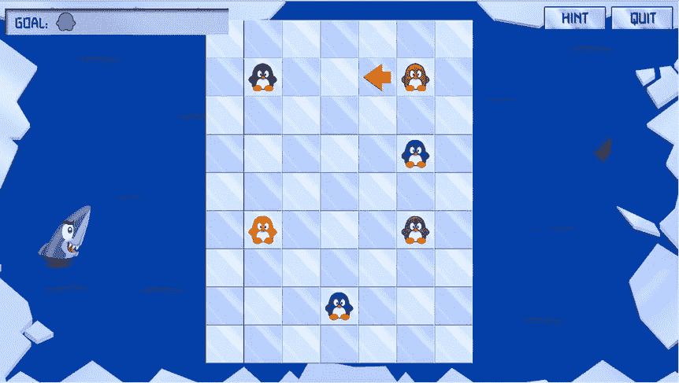
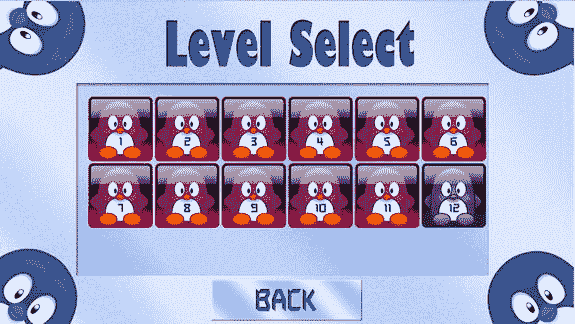
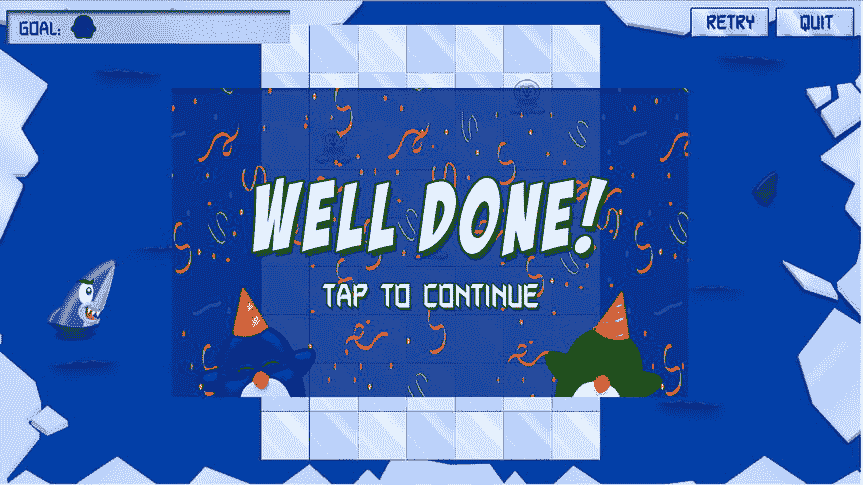

# 21. 完成企鹅配对游戏

电子补充材料 本章的在线版本 (doi:[10.​1007/​978-1-4842-0650-8_​21](http://dx.doi.org/10.1007/978-1-4842-0650-8_21)) 包含补充材料，仅供授权用户使用。

在本章中，你将完成企鹅配对游戏。首先，你将通过添加一个提示箭头和一个帮助覆盖层来完成用户界面，该覆盖层会在玩家开始每个关卡时显示几秒钟。然后，你将学习如何重置并进入下一关。最后，你将通过添加音效来完善游戏。

## 显示提示

为了完成企鹅配对游戏，还需要添加几个功能。第一步，你需要能够在用户点击按钮时显示提示。提示由一个橙色箭头组成，该箭头会显示一秒钟。当你在 `LevelState` 初始化器中加载关卡时，你会从文本文件中读取提示位置和方向。然后，你创建一个 `SKSpriteNode` 实例，为其分配正确的精灵，并根据文本文件中的信息将其定位，如下所示：

```
let hintx = hintArr[0].toInt()!, hinty = hintArr[1].toInt()!
hint = SKSpriteNode(imageNamed: "spr_arrow_hint_\(hintArr[2])")
hint.zPosition = Layer.Scene2
hint.position = tileField.layout.toPosition(hintx, row: hinty)
hint.hidden = true
self.addChild(hint)
```

最初，提示箭头是隐藏的。为了在玩家点击提示按钮时临时显示箭头，你创建了一个存储为属性的动作：

```
let hintVisibleAction = SKAction.sequence([SKAction.unhide(),
    SKAction.waitForDuration(1), SKAction.hide()])
```

最后，你扩展 `LevelState` 的 `handleInput` 方法以处理提示按钮被按下的事件：

```
if hintButton.tapped {
    hint.runAction(hintVisibleAction)
}
```

提示按钮只有在可见时才能被按下，但在某些情况下它不应该可见，例如：

*   在玩家做出第一步移动后，提示按钮应该消失，重试按钮应该出现。
*   如果玩家在选项菜单中选择了关闭提示，那么提示按钮应始终不可见。

对于第一种情况，你需要跟踪玩家何时做出了第一步移动。你在 `LevelState` 类中添加一个额外的属性 `firstMoveMade`。当你赋予动物速度时，这是在 `AnimalSelector` 类中完成的。一旦玩家点击了箭头并且动物开始移动，你就调用属于 `LevelState` 的 `applyFirstMoveMade` 方法：

```
let lvl = GameStateManager.instance.currentGameState as? LevelState
if animalVelocity != CGPoint.zeroPoint {
    lvl?.applyFirstMoveMade()
}
```

`applyFirstMoveMade` 方法会隐藏提示按钮，取消隐藏重试按钮，并将 `firstMoveMade` 属性设置为 `true`：

```
func applyFirstMoveMade() {
    self.hintButton.hidden = true
    self.retryButton.hidden = false
    firstMoveMade = true
}
```

在 `LevelState` 的 `updateDelta` 方法中，你确保只在玩家尚未做出第一步移动时才改变提示按钮和重试按钮的可见性：

```
if !firstMoveMade {
    self.hintButton.hidden = !DefaultsManager.instance.hints
    self.retryButton.hidden = DefaultsManager.instance.hints
}
```

从 `if` 指令中的两行代码可以看出，提示按钮仅在 `DefaultsManager.instance.hints` 为 `false` 时才隐藏。重试按钮的隐藏状态始终与提示按钮的隐藏状态相反。因此，如果提示按钮可见，则重试按钮不可见，反之亦然。图 21-1 展示了提示箭头实际运行时的截图。



图 21-1.

提示箭头向玩家展示第一步合理的移动。嗯……这确实很有帮助！

## 显示帮助框

当玩家开始玩某个关卡时，向他/她展示一些有用的信息也很有用。让我们使用自定义字体来显示帮助文本。你可以使用与图坦卡蒙之墓游戏中相同的过程，在项目中加载自定义字体（更多信息请参见第 16 章）。第一步是在 `LevelState` 初始化器中添加一个帮助框：

```
helpFrame.position = CGPoint(x: 0, y: GameScreen.instance.bottom + helpFrame.center.y + 10)
helpFrame.zPosition = Layer.Overlay
self.addChild(helpFrame)
```

帮助框位于屏幕底部中央。在其上方，你显示一个文本标签：

```
let textLabel = SKLabelNode(fontNamed: "Autodestruct BB")
textLabel.fontColor = UIColor(red: 0, green: 0, blue: 0.4, alpha: 1)
textLabel.fontSize = 24
textLabel.text = help
textLabel.horizontalAlignmentMode = .Center
textLabel.verticalAlignmentMode = .Center
textLabel.zPosition = 1
helpFrame.addChild(textLabel)
```

文本标签是帮助框的子节点。为了确保它显示在帮助框之上，你将其相对 z 位置设置为 1。现在，每当关卡被重置时，你添加一个动作，使帮助框显示 5 秒钟：

```
helpFrame.runAction(SKAction.sequence([SKAction.unhide(),
    SKAction.waitForDuration(5), SKAction.hide()]))
```

如果你查看本章附带的 `PenguinPairsFinal` 示例，你会发现现在整个游戏都使用了相同的自定义字体，例如在关卡按钮上显示关卡索引（见图 21-2）。你可以清楚地看到，使用自定义字体使游戏看起来更专业。



图 21-2.

使用自定义字体的关卡菜单

## 重置关卡

在玩家移动了几只动物之后，关卡可能会变得无法解决。与其让玩家退出并重新开始游戏，不如让玩家有一种方法可以将关卡重置为初始状态。

得益于在游戏对象类中各处对 `reset` 方法的正确实现，将关卡重置为初始状态非常容易。你需要在所有游戏对象上调用 `reset` 方法，然后在 `LevelState` 类本身中处理重置事宜。你唯一需要做的就是将 `firstMoveMade` 属性设置为 `false`，以便玩家可以再次查看提示，并运行帮助框动作：

```
override func reset() {
    super.reset()
    firstMoveMade = false
    helpFrame.runAction(SKAction.sequence([SKAction.unhide(),
        SKAction.waitForDuration(5), SKAction.hide()]))
}
```

注意

有多种方法可以扩展企鹅配对游戏。例如，你能编写代码来判断一个关卡是否仍然可以解决吗？如果发生这种情况，你可以通过向用户显示一条消息来扩展游戏。你可能自己对如何改进游戏有想法。欢迎通过修改和添加示例来尝试实现它们。


### 进入下一关

当玩家完成一个关卡时（太棒了！），你需要显示一个鼓励性的覆盖层（见图 21-3）。当玩家点击或轻触屏幕时，下一关便会呈现。该覆盖层作为属性添加到 `LevelState` 类中，并在其初始化器中默认设置为隐藏：



图 21-3. 玩家完成关卡后显示的覆盖层

`var levelFinishedOverlay = SKSpriteNode(imageNamed: "spr_level_finished")`

在 `LevelState` 的 `updateDelta` 方法中，你需要检查配对列表是否已完成，如果已完成，则显示关卡完成覆盖层并播放音效：

```
if levelFinishedOverlay.hidden && pairList.completed {
    levelFinishedOverlay.hidden = false
    wonSound.play()
}
```

在 `LevelState` 的 `handleInput` 方法中，你需要检查玩家是否仍在游玩，或者是否已通关。如果是后者，你需要检查玩家是否点击了屏幕。如果是，则进入下一关。进入下一关并不复杂，但涉及使用 `DefaultManager` 类更新每个关卡的状态、查找下一关是什么，然后切换到该状态。以下是完整代码：

```
if !levelFinishedOverlay.hidden {
    if !inputHelper.containsTap(levelFinishedOverlay.box) {
        return
    }
    self.reset()
    DefaultsManager.instance.setLevelStatus(self.levelNr, status: "solved")
    if GameStateManager.instance.has("level\(levelNr+1)") {
        if DefaultsManager.instance.getLevelStatus(self.levelNr+1) == "locked" {
            DefaultsManager.instance.setLevelStatus(self.levelNr+1, status: "unsolved")
        }
        GameStateManager.instance.switchTo("level\(levelNr+1)")
        GameStateManager.instance.reset()
    } else {
        GameStateManager.instance.switchTo("level")
    }
}
```

请参阅 `PenguinPairsFinal` 示例，了解完整的 `LevelState` 类。

## 新手教程

你可能已经注意到，企鹅配对游戏的前几关也起到了新手教程的作用，向玩家解释游戏规则。在制作游戏时，玩家必须学会如何游玩。如果你不告诉玩家挑战目标以及控制方式，他们可能会感到沮丧而放弃游戏。

有些游戏提供了详尽的帮助文件，用长篇大论说明故事背景和操作方式。但玩家已不再愿意阅读这类文档或长文本界面。他们希望直接投入游戏。你需要在玩家游玩的过程中指导他们。

你可以创建几个特定的教程关卡，让玩家在不严重影响游戏进程的情况下练习操作。这种方式对休闲玩家来说是一种很好的游戏入门引导。而资深玩家则更倾向于直接进入核心玩法。注意不要在教程关卡中解释所有内容——只说明基本操作即可。更高级的操作可以在游戏中需要时再通过简单弹出消息或 HUD 上的显眼位置来解释。

教程若能与游戏故事自然融合，效果最佳。例如，游戏角色可以在其安全的家乡小镇中奔跑，学习基本移动操作；接着与几个朋友练习战斗；然后玩家进入森林尝试用弓箭射击小鸟。这将为后续游戏中的战斗提供必要的练习。

请确保教程关卡有效，并且玩家即使几天不玩游戏也能记住操作方式。否则，他们可能永远不会再回到这个游戏。

## 添加音效

为完成游戏，你需要在适当的位置添加音效和音乐。你可能还记得，选项菜单中的选择之一就是更改背景音量。你可以使用以下代码行来实现：

`backgroundMusic.volume = Float(musicSlider.value)`

在 `OptionMenuState` 类中，你可以找到 `backgroundMusic` 属性以及开始播放音乐的代码：

```
backgroundMusic.looping = true
backgroundMusic.play()
```

同样地，你可以在合适的时机播放音效，就像在《图坦卡蒙之墓》和《画家》游戏中做的那样。例如，每当一对企鹅配对成功时，就会播放音效（参见 `Animal` 类的 `updateDelta` 方法）：

`pairSound.play()`

如果你查看本章配套的 `PenguinPairsFinal` 示例，就能了解完整游戏的工作方式以及音效在何处播放。当然，你也可以亲自试玩这个游戏。

## 团队协作

第一代游戏是由程序员创造的。他们包揽了所有工作：设计游戏机制、创作美术（当时仅由几个像素组成），并用汇编语言编写游戏代码。所有工作都聚焦于编程本身，游戏机制也常常被调整为适合高效编程的形式。

但随着内存容量的提升，这种情况逐渐改变。用有限的像素和颜色创作出精美外观的对象成为一门艺术，像素艺术家开始在游戏开发中发挥重要作用。早期没有绘图程序（当时的计算机都不够强大），像素角色是在方格纸上设计，再转换成十六进制数字嵌入游戏代码中。

随着计算机性能提升以及 CD-ROM 等存储介质的出现，美术变得日益重要，艺术家也随之发展。3D 图形和动画变得普遍，催生了能够运用新工具和技术的专门人才。如今，艺术家在游戏制作团队中占据了大多数。

在某个阶段，游戏设计成为了一项独立工作。游戏机制会根据用户群体的兴趣进行调整，并越来越多地基于心理学和教育科学的原理。这需要专门的专长。故事剧情占据了关键地位，由此引入了编剧。团队还扩展至包括制作人、音响工程师、作曲家等众多角色。如今，顶级游戏的团队可能由数百人组成。但如果没有程序员，一切将无法运作。

## 最后几点提示

在本书的这一部分，你创建了一个比之前《图坦卡蒙之墓》复杂得多的游戏。你可能已经注意到，类的数量变得相当庞大，并且你越来越依赖某种游戏软件设计模式。例如，你将游戏对象放置在网格布局中，并使用类来处理游戏状态。在更基础的层面上，你假设游戏对象负责处理自身输入和更新。你可能不同意这些设计选择中的某些（或全部）。也许读到此处，你已经形成了自己关于游戏软件应该如何设计的想法。这是件好事。我在本书中提出的设计并非唯一的实现方式。设计总是可以被评估和改进，甚至被完全抛弃，用全新的方案取而代之。因此，请毫不犹豫地批判性地审视我提出的设计，并尝试其他方案。通过尝试不同的方法来解决问题，你能更好地理解问题本身，并因此成为一名更优秀的软件开发者。

## 本章要点

在本章中，你学习了以下内容：

*   如何在屏幕上显示提示箭头和帮助框架
*   如何将关卡重置到初始状态，并处理进入下一关


