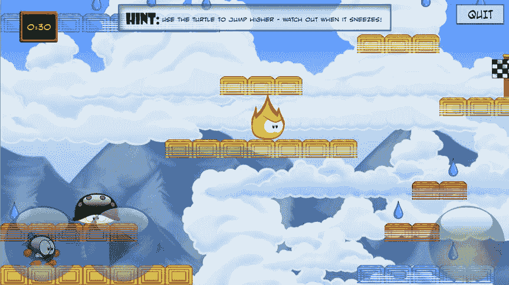

# 第五部分  
滴答炸弹  

前几章展示了如何构建几种不同类型的游戏。在这一部分，你将构建一个包含动画角色、物理效果以及不同关卡的平台游戏。游戏名为《滴答炸弹》（见图 V-1），故事围绕一颗略显焦虑、将在数秒后爆炸的炸弹展开。玩家必须在炸弹爆炸前完成每一关。如果玩家收集了所有清凉的水滴并及时到达终点面板，则该关卡通关。  

  

**图 V-1.** 《滴答炸弹》游戏  

这款平台游戏包含了许多其他游戏中也常见的基本元素：  

- 应能游玩不同的关卡。  
- 这些关卡应从单独的文件中加载，以便在无需了解游戏代码工作原理的情况下进行修改。  
- 游戏应支持玩家和敌人的动画角色。  
- 玩家应能控制一个可奔跑或跳跃的角色进行行动。  
- 游戏中应具备一些基本的物理效果，以处理下落、物体碰撞、在平台上跳跃等情况。  

这个列表可不短！幸运的是，你可以复用许多已经开发好的类。接下来的章节将逐一审视列表中的各项内容。如果你想游玩《滴答炸弹》的完整版，请运行属于第 27 章的示例程序。  

