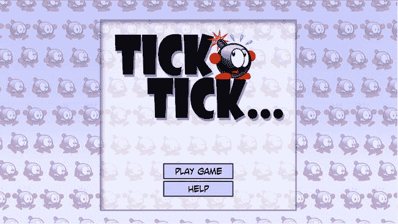
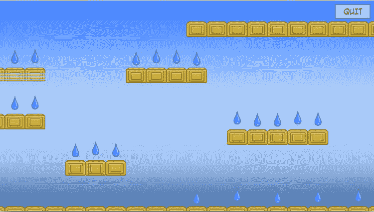

# 22. 主要游戏结构  

电子补充材料 本章的在线版本（doi:[10.1007/978-1-4842-0650-8_22](http://dx.doi.org/10.1007/978-1-4842-0650-8_22)）包含补充材料，可供授权用户使用。  

在本章中，你将搭建《滴答炸弹》游戏的框架。由于之前游戏开发所做的大量工作，你可以依赖很多已有的类。这意味着你已经拥有了处理游戏状态和设置的基本设计、游戏对象的层次结构等等。需要注意的是，《滴答炸弹》游戏并非为在非常小的设备（如旧款 iPhone 或 iPhone 6 Plus）上运行而设计（对于后者，你至少需要 3 倍分辨率的图像）。如果在旧款 iPhone 上运行该游戏，游戏世界的很大一部分将被裁剪。在 iPhone 6 Plus 上，游戏可玩，但边缘会出现一些黑边。  

## 游戏结构概览  

本游戏的结构与《企鹅配对》游戏非常相似。游戏有一个标题画面，玩家可以由此进入关卡选择菜单或帮助页面（见图 22-1）。为了保持简单，你不会实现选项页面，尽管添加它会很简单，因为你可以使用与《企鹅配对》相同的方法。由于菜单结构非常相似，此处不再赘述。你可以在属于本章的`TickTick1`示例中看到代码。  

  

**图 22-1.** 《滴答炸弹》游戏的标题画面  

`LevelState`类用于表示关卡，并负责维护关卡状态（锁定/未解决/已解决），与《企鹅配对》游戏中的方式相同。每个关卡都是一个基于瓦片的游戏世界，再次与《企鹅配对》的结构非常相似。  

## 关卡的结构  

首先，让我们看看《滴答炸弹》的一个关卡中可以包含哪些内容。首先，有一个背景图像。目前，你只需显示一个简单的背景精灵；无需在关卡数据变量中存储任何相关信息。此外，还有不同类型的可供玩家跳跃的方块，以及水滴、敌人、玩家起始位置和玩家必须到达的终点位置。与《企鹅配对》游戏一样，你将关卡信息存储在一个文本文件中，该文件在游戏启动时被读取。  

你使用瓦片来定义关卡，每个瓦片都有特定的类型（墙壁、背景等）。然后，你在文本文件中用一个字符表示每个瓦片类型。就像在《企鹅配对》游戏中一样，你在一个对应于游戏区域的二维空间中，以文本形式布局关卡。除了实际的瓦片，你还将提示信息与关卡定义存储在一起。下面你可以看到文本文件中第一个关卡的定义：  

```
捡起所有水滴，及时到达出口。

20 15

60

....................
.................X..
..........##########
....................
WWW....WWWW.........
---....####.........
....................
WWW.................
###.........WWWWW...
............#####...
....WWW.............
....###.............
....................
.1........W.W.W.W.W.
####################
```

这个关卡定义定义了许多不同的瓦片和对象。例如，墙壁瓦片由`#`符号定义，水滴由`W`字符定义，玩家起始位置由`1`字符定义。如果某个特定位置没有瓦片，则使用`.`字符。对于这个平台游戏，你需要不同类型的瓦片：一个供玩家站立或碰撞的墙壁瓦片，以及一个表示该位置没有方块的背景/透明瓦片。你还需要定义一个平台瓦片。这种瓦片具有这样的特性：玩家可以像站在墙壁瓦片上一样站在它上面，但如果玩家站在它下面，他们可以从下方跳跃穿过它。这种瓦片在许多经典平台游戏中都有使用，不在这里包含它未免太可惜了！在文本文件中，平台瓦片由`-`字符表示。表 22-1 给出了《滴答炸弹》游戏中不同瓦片的完整列表。  

**表 22-1.** 《滴答炸弹》游戏中不同类型瓦片概览  

| 字符 | 瓦片描述 |  
| --- | --- |  
| `.` | 背景瓦片 |  
| `#` | 墙壁瓦片 |  
| `^` | 墙壁瓦片（炽热） |  
| `*` | 墙壁瓦片（冰面） |  
| `-` | 平台瓦片 |  
| `+` | 平台瓦片（炽热） |  
| `@` | 平台瓦片（冰面） |  
| `X` | 终点瓦片 |  
| `W` | 水滴 |  
| `1` | 起始瓦片（玩家初始位置） |  
| `R` | 火箭敌人（向左移动） |  
| `R` | 火箭敌人（向右移动） |  
| `S` | 火花敌人 |  
| `T` | 乌龟敌人 |  
| `A` | 火焰敌人（随机速度和方向变化） |  
| `B` | 火焰敌人（追踪玩家） |  
| `C` | 火焰敌人（巡逻） |


好的，作为高级文档工程师和翻译员，我将严格按照您的要求，将给定的英文文本翻译成中文。


### 水滴

每个关卡的目标是收集所有的水滴。每个水滴都由一个 `WaterDrop` 类的实例表示。这个类是 `SKSpriteNode` 的子类，但你需要为它添加一点行为：水滴应该上下弹跳。你可以在 `updateDelta` 方法中实现这一点。首先，你计算一个可以添加到水滴当前位置的弹跳偏移量。这个弹跳偏移量存储在属性 `bounce` 中，初始值为 0。你还维护了已经过去的总游戏时间，如下所示：

```
var bounce: CGFloat = 0
var totalTime: CGFloat = 0
```

为了在每个游戏循环迭代中计算弹跳偏移量，你使用了一个正弦函数。并且根据水滴的 x 坐标，你改变正弦函数的相位，这样所有的水滴就不会同时向上或向下移动：

```
totalTime += CGFloat(delta)
var t = totalTime + position.x
self.bounce = sin(t*5) * 5
```

你从水滴的 y 坐标中减去弹跳值：

```
position.y -= self.bounce
```

`-=` 运算符从 y 坐标中减去弹跳值（关于这类运算符的更多信息，请参见第 5 章）。然而，简单地从 y 坐标中减去弹跳值并不正确，因为这是一个弹跳偏移量——换句话说，是相对于原始 y 坐标的偏移量。为了得到原始的 y 坐标，你在 `updateDelta` 方法的第一条指令中，将弹跳偏移量加回到 y 坐标上：

```
position.y += self.bounce
```

这样做是可行的，因为此时 `bounce` 变量仍然包含上一个游戏循环迭代中的弹跳偏移量。所以，将它加到 y 坐标上就得到了原始的 y 坐标。

在接下来的几章中，你会添加更多的游戏对象，例如玩家和各种各样的敌人。但让我们先来看看如何在像 Tick Tick 这样的平台游戏中定义瓦片。

### 瓦片类

`Tile` 类与 Penguin Pairs 中使用的类非常相似，但有一些不同之处。首先，你使用枚举类型定义了不同种类的瓦片：

```
enum TileType {
    case Wall
    case Background
    case Platform
}
```

然后，在 `Tile` 类中，你定义了一个属性 `tileType` 来存储实例所代表的瓦片类型。除了这些基本的瓦片类型之外，你还有冰瓦片和热瓦片，它们是普通瓦片或平台瓦片的特殊版本。在文本文件中，冰瓦片用 `*` 字符表示（如果是平台瓦片则为 `@` 字符），热瓦片用 `^` 字符表示（如果是平台版本则为 `+` 字符）。你向 `Tile` 类添加了两个布尔属性来表示这些不同种类的瓦片。以下是 `Tile` 的初始化方法：

```
convenience init() {
    self.init(imageNamed: "spr_wall", type: .Background)
}

init(imageNamed: String, type: TileType) {
    let texture = SKTexture(imageNamed: imageNamed)
    super.init(texture: texture, color: UIColor.whiteColor(), size: texture.size())
    self.type = type
}

required init?(coder aDecoder: NSCoder) {
    fatalError("init(coder:) has not been implemented")
}
```

如你所见，有一个便捷初始化方法允许你创建一个 `Background` 类型的 `Tile` 实例。这使得创建 `Tile` 实例更容易，因为你无需提供任何参数值。例如，以下指令创建了一个简单的背景（透明）瓦片：

```
var myTile = Tile()
```

在 `Tile` 的初始化方法中，你使用了 `type` 属性来设置和获取瓦片的类型。在 `type` 属性的设置部分，你将一个新值赋给 `tp` 属性，并使用布尔逻辑，如果是背景瓦片则将其隐藏。以下是实现这一点的两行代码（完整的 `Tile` 类，请参见 TickTick1 示例）：

```
tileType = newValue
self.hidden = tileType == .Background
```

现在，让我们看看 `LevelState` 类以及 `Tile` 实例是如何创建的。

### LevelState 类

本节展示了在 Tick Tick 中如何设计 `LevelState` 类。它的实现方式与 Penguin Pairs 非常相似。在 `LevelState` 类的初始化方法中，你做了几件事：

-   创建背景精灵游戏对象。
-   添加一个“退出”按钮。
-   根据关卡数据创建基于瓦片的游戏世界。

前两件事很直接。请查看示例代码中的 `LevelState` 类，了解它们是如何工作的。创建基于瓦片的游戏世界是通过一个名为 `loadTile` 的独立方法来完成的。根据从文本文件中读取的瓦片字符，将创建不同的 `Tile` 对象。第一步是创建一个 `TileField` 实例，其高度和宽度取自文本文件：

```
tileField = TileField(rows: height, columns: width, cellWidth: 72, cellHeight: 55)
tileField.name = "tileField"
world.addChild(tileField)
```

如你所见，瓦片字段被添加到一个名为 `world` 的独立节点中，而“退出”按钮则直接添加到关卡节点：

```
quitButton.zPosition = Layer.Overlay
quitButton.position = GameScreen.instance.topRight - quitButton.center - CGPoint(x: 10, y: 10)
self.addChild(quitButton)
```

这样做是有原因的。你想将诸如“退出”按钮或帮助框架之类的覆盖层与实际基于瓦片的游戏世界分开，因为稍后你将为这个平台游戏添加侧向滚动。这意味着游戏世界需要在屏幕上移动，而按钮则应保持在原位。只有当实际游戏世界存储在一个独立的节点中时，才能实现这一点。然后，你可以更改该节点的位置（因此也就是游戏世界的位置），而不会影响任何按钮或其他覆盖层。第 26 章 展示了如何为你的游戏添加垂直和水平滚动。

在读取了定义关卡的文本文件行之后，你创建了 `Tile` 对象并将它们添加到 `TileField` 对象中。你使用了一个嵌套的 `for` 循环来实现这一点：

```
for i in 0..<height {
    var currLine = lines[height-1-i]
    var j = 0
    for c in currLine {
        tileField.layout.add(loadTile(c, x: j, y: i))
        j++
    }
}
```

嵌套的 `for` 循环检查了你从文本文件中读取的所有字符。`loadTile` 方法根据给定的字符以及瓦片在网格中的 x 和 y 位置，为你创建一个 `Tile` 对象。

在 `loadTile` 方法中，你需要根据作为参数传递的字符加载不同的瓦片。对于每种类型的瓦片，你向 `LevelState` 类添加一个方法来创建那种特定类型的瓦片。例如，`loadWaterTile` 加载一个背景瓦片，并在其上方放置一个水滴：

```
func loadWaterTile(x: Int, y: Int) -> SKNode {
    var w = WaterDrop()
    w.position = tileField.layout.toPosition(x, row: y)
    w.position.y += 10
    w.zPosition = Layer.Scene1
    world.addChild(w)
    self.waterDrops.append(w)
    return Tile()
}
```

这个特定的示例创建了一个 `WaterDrop` 实例，并将其放置在瓦片的中心。你将每个水滴放置得比瓦片中心高 10 个点，这样它就不会弹跳到下面瓦片的上方。请查看 `Level` 类，了解如何创建每个关卡中的各种瓦片和对象。图 22-2 显示了第一个关卡中对象的屏幕截图（玩家角色除外，你将在后续章节中处理它）。



*图 22-2.* Tick Tick 第一个关卡的遊戲世界

## 本章所学

在本章中，你学习了以下内容：

-   如何搭建 Tick Tick 游戏的整体结构
-   如何创建一个弹跳的水滴


