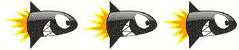
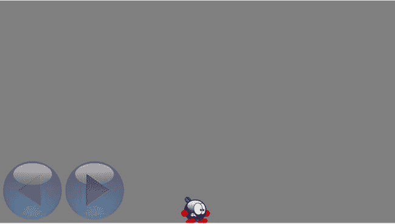

# 23. 动画

电子辅助材料 本章在线版本（doi:[10.1007/978-1-4842-0650-8_23](http://dx.doi.org/10.1007/978-1-4842-0650-8_23)）包含仅供授权用户使用的补充材料。

在本章中，你将学习如何为游戏添加动画。在你目前开发的游戏中，游戏对象可以在屏幕上移动，但要添加一个像跑动角色这样的内容则更具挑战性。本章中，你将编写一个程序，让一个角色在屏幕上从左向右行走。该角色由玩家通过按下屏幕上的左右按钮来控制。

## 什么是动画？

在了解如何编写一个在屏幕上行走的角色程序之前，你首先需要思考什么是动画。要理解这一点，你得回到 20 世纪 30 年代，当时几家动画工作室（包括沃尔特·迪士尼）制作了首批黑白卡通片。

卡通片实际上是一系列快速播放的静态图像，这些图像也被称为帧。电视机以非常高的速率（大约每秒 25-30 次）绘制这些帧。当图像每次都有变化时，你的大脑会将其解读为运动。人脑的这一特殊功能（也被称为**似动现象**）非常有用，尤其是在编程包含移动或动画对象的游戏时。

在你之前阅读本书开发的游戏中，你已经运用了这一功能。在游戏循环的每一次迭代中，你都会在屏幕上绘制一帧新的“画面”。通过每次在不同位置绘制精灵，你便营造出精灵在移动的假象。然而，这并非真正发生的情况：你只是每秒多次在不同位置绘制精灵，这让玩家认为精灵在移动。

类似地，你可以绘制一个行走或奔跑的角色。除了移动精灵之外，你每次还会绘制一个略有不同的精灵。通过绘制一系列精灵（每个精灵代表行走动作的一部分），你可以创造出角色在屏幕上行走的错觉。图 23-1 展示了这样一个精灵序列的示例。


图 23-1.

一组代表行走动作的图像序列

### 游戏中的动画

在游戏中加入动画有不同的原因。当你制作 3D 游戏时，动画通常是增强真实感所必需的，但对于 2D 游戏来说，情况并非总是如此。尽管如此，动画仍能极大地丰富游戏内容。

动画能让对象活起来。但这不一定要很复杂。一个角色简单眨眼或睁眼的动画，就能给人强烈的“角色是活的”的感觉。动画角色也更容易让人产生共鸣。如果你看像《割绳子》这样的游戏，主角（名叫奥姆诺姆）只是静静地坐在角落里。但时不时地，这个角色会做出一些有趣的动作，向你表明它在那里，并希望你给它带食物。这为玩家继续玩下去创造了非常有效的动机。

动画还有助于将玩家的注意力吸引到某个对象、任务或事件上。例如，在按钮上添加一个小动画，能让玩家更清楚地知道他们需要按下这个按钮。一个弹跳的水滴或旋转的星星则表示应该收集或避开这个物体。动画也可以用来提供反馈。当用手指点击按钮时，按钮向下移动，这立即表明按钮点击成功了。

然而，制作动画工作量很大。因此，需要事先仔细思考哪些地方需要动画，哪些地方可以避免，以节省时间和金钱。

## 纹理图集

对于动画角色，你通常为每种运动类型设计一组精灵序列。有些动画只包含少数几个精灵。例如，Tick Tick 游戏中包含一枚飞过屏幕的火箭。这枚火箭的动画仅使用了三帧（见图 23-2）。



图 23-2.

火箭动画的帧

其他动画可能包含更多帧。例如，Tick Tick 游戏中的炸弹爆炸动画有 49 帧。随着你在游戏中加入更多动画，所需精灵的数量（包括 1 倍、2 倍，某些游戏甚至需要 3 倍分辨率）会急剧增加。这会增加设备在存储所有图像数据所需内存方面的压力，同时也会增加处理能力方面的压力，以便从文件加载图像并足够快地在屏幕上显示。减少图像加载时间的一个非常常见的技巧是将多个精灵放在同一张图像上。例如，你可以将开始画面所需的所有按钮放在同一个文件中，当需要显示某个按钮时，就展示图像中代表该按钮的那部分。SpriteKit 框架为此提供了一个简洁的解决方案，称为纹理图集。纹理图集本质上是一组精灵/纹理，它以尽可能少的图像文件进行最优存储。如果你的游戏中有大量图像，纹理图集有助于游戏加载速度显著提升。好处在于，作为开发者，你无需担心精灵在图像文件中是如何存储的。你只需告诉 Xcode 环境，某个文件夹中的所有精灵都属于一个图集。

要在 Xcode 中使用纹理图集，你只需将精灵放在一个名称以`.atlas`结尾的文件夹中，然后将该文件夹拖入项目即可。例如，在本章附带的 AnimationSample 项目中，你可以看到两个图集：`spr_player_run.atlas` 和 `spr_player_idle.atlas`（分别代表奔跑和待机动画）。如果你查看 `spr_player_run.atlas` 的内部，会发现它包含了不少不同的精灵。对于纹理图集，你需要记住一个重要的命名约定：如果你使用不同分辨率的精灵，应在文件名末尾添加“@1x”、“@2x”或“@3x”来表示精灵的分辨率。除此之外，你可以选择任何你喜欢的精灵名称。在本例中，将每个精灵命名为与其图集名称相同，加上一个数字，然后注明精灵的分辨率。

在代码中创建纹理图集非常简单。以下是通过 `spr_player_run.atlas` 文件创建纹理图集的方法：

```
let atlas = SKTextureAtlas(named: "spr_player_run")
```

现在，你可以按如下方式访问图集中的特定纹理：

```
let texture = atlas.textureNamed("spr_player_run0")
```

图集中的纹理名称对应于你给文件起的名称（不包括分辨率标识）。然后，你可以使用此纹理创建一个节点并将其添加到游戏世界中：

```
let spriteNode = SKSpriteNode(texture: texture)
addChild(spriteNode)
```


### 动画类

对于动画角色，你通常会为每种运动类型设计一组独立的精灵序列。图 23-1 中的示例展示了一个奔跑角色的动画序列。这正是纹理图集大显身手的地方。你可以将每一帧定义为纹理图集中的独立精灵。在 AnimationSample 项目中，我正是这样做的。下一步，让我们设计一些用于加载和播放动画的实用类和方法。用于表示动画的基础类名为 `Animation`，它是 AnimationSample 项目的一部分。除了存储在纹理图集中的精灵之外，动画还需要额外的信息。例如，你需要指定每一帧在屏幕上显示多长时间。你还需要能够循环播放动画，这意味着一旦到达最后一帧，就立即回到第一帧，从而形成连续、无限的动画。循环播放动画非常实用：以行走角色为例，你只需绘制一个行走周期，然后循环播放该动画，就能得到连续行走的动作。不过，并非所有动画都需要循环。例如，角色死亡的动画就不应该循环（那对角色来说太残忍了）。为了处理所有这些情况，`Animation` 类包含了许多属性。以下是该类的一部分：

```
class Animation: SKSpriteNode {

    var action = SKAction()

    init(atlasNamed: String, looping: Bool, frameTime: NSTimeInterval) {
        // 待实现
    }

    required init?(coder aDecoder: NSCoder) {
        fatalError("init(coder:) has not been implemented")
    }

    ...
}
```

如你所见，`Animation` 类是 `SKSpriteNode` 的子类。因此，如果你创建了一个 `Animation` 实例，你可以直接将其添加到游戏世界中。`Animation` 类有一个单一属性 `action`，它指向实际播放动画的动作。该动作在初始化器中创建。如你所见，初始化器需要几个参数：包含动画帧的图集名称、一个指示动画是否应循环播放的布尔值，以及连续帧之间的时间间隔。根据这些参数的值，你将创建不同的动画动作。

第一步是加载纹理图集。为了方便起见，我们还将图集包含的纹理数量存储在一个变量中：

```
let atlas = SKTextureAtlas(named: atlasNamed)
let numImages = atlas.textureNames.count
```

现在，让我们从该图集中提取所有纹理，并将它们存储在一个数组中。稍后，你可以定义一个动作，使用这个纹理数组来生成动画。首先，声明并初始化一个 `SKTexture` 对象数组：

```
var frames: [SKTexture] = []
```

下一步是从图集中检索所有纹理。这正是动画帧命名发挥作用的地方。让我们使用一个 `for` 循环来检索所有帧，并将它们添加到纹理数组中：

```
for i in 0..<numImages/2 {
    let textureName = "\(atlasNamed)_\(i)"
    frames.append(atlas.textureNamed(textureName))
}
```

这段代码中发生了几个操作。首先，有一个变量 `i`，其范围是从 0 到 `numImages/2`。需要将图集中的图像数量除以二，是因为图集同时包含了 1x 和 2x 分辨率的图像。在 `for` 循环内部，你首先通过在图集名称后添加一个数字来构造纹理名称。然后，你使用 `textureNamed` 方法检索实际的纹理，并将其追加到纹理数组中。

现在你可以调用父类的初始化器了。节点使用数组中的第一个纹理进行初始化：

```
super.init(texture: frames[0], color: UIColor.whiteColor(),
           size: frames[0].size())
```

然后，你需要创建实际驱动节点动画的动作，操作如下：

```
let animateAction = SKAction.animateWithTextures(frames,
                      timePerFrame: frameTime)
```

根据动画是否应该循环，你需要无限重复该动作。这通过以下 `if` 指令处理：

```
if looping {
    action = SKAction.repeatActionForever(animateAction)
} else {
    action = animateAction
}
```

### 支持多个动画

`Animation` 类为表示动画提供了基础。一个动画游戏对象可能包含多个不同的动画，因此你可以拥有一个能够执行不同（动画）动作的角色，例如行走、奔跑、跳跃等等。每个动作都由一个动画表示。根据玩家的输入，你切换当前激活的动画。让我们定义一个便于处理多个动画的类。在 AnimationSample 项目中，这个类叫做 `AnimatedNode`。

为了存储不同的动画，你使用一个数组。对于你需要的每个动画，你向数组中添加一个 `Animation` 类的实例。因此，`AnimatedNode` 拥有以下属性：

```
var animations : [Animation] = []
```

为了使加载和播放动画更加方便，你向该类添加了两个方法：`loadAnimation` 和 `playAnimation`。第一个方法创建一个 `Animation` 对象并将其添加到 `animations` 属性中：

```
func loadAnimation(atlasNamed: String, looping: Bool = false,
    frameTime: NSTimeInterval = 0.05, name: String,
    anchorPoint: CGPoint = CGPoint(x: 0.5, y: 0)) {
    let anim = Animation(atlasNamed: atlasNamed, looping: looping, frameTime: frameTime)
    anim.name = name
    anim.anchorPoint = anchorPoint
    animations.append(anim)
}
```

`loadAnimation` 方法需要几个参数，其中一些为方便起见设置了默认值。首先，你需要提供用于动画的图集名称。然后，你可以指示动画是否应该循环，以及帧间的时间间隔。此外，每个动画都需要有一个唯一的名称，以便你稍后能检索并激活它。最后，你可以为创建的节点提供一个锚点。这里，锚点默认设置为精灵的底部中间位置。在 Tick Tick 这个案例中，这是一个有用的默认值，因为玩家等动画角色会在瓦片上行进。将精灵原点设置在底部中心会使计算稍微简单一些，稍后你会看到。

在方法体中，你创建 `Animation` 实例，为其分配名称并设置其锚点，最后将其添加到动画数组中。

在 `playAnimation` 方法中，你需要选择需要播放的动画，将其添加到节点，并启动动画动作。首先，你检查想要播放的动画是否已经是该节点的子节点。如果是这种情况，说明动画已经在播放，你无需再做其他操作，因此可以从该方法返回：

```
func playAnimation(name: String) {
    if childNodeWithName(name) != nil {
        return
    }
    ...
}
```

接下来，你使用一个 `for` 循环来查找具有选定名称的动画。一旦找到，你移除该节点的所有子节点，将动画添加到节点，并启动该动作：

```
for anim in animations {
    if anim.name == name {
        self.removeAllChildren()
        self.addChild(anim)
        anim.runAction(anim.action)
        return
    }
}
```


### 玩家类

要使用上一节中介绍的 `AnimatedNode` 类，你需要继承它。由于玩家将控制动画角色，我们定义一个 `Player` 类，作为 `AnimatedNode` 的子类。在这个类中，你将加载属于玩家的动画，并处理玩家的输入。在 `Player` 的初始化方法中，你加载该角色所需的动画。在本示例中，你希望角色能够行走或站立不动。因此，你通过调用 `loadAnimation` 方法两次来加载两个动画。你通过将 `looping` 参数设置为 `true` 来让这两个动画循环播放：

```
class Player: AnimatedNode {

    var velocity = CGPoint.zeroPoint

    override init() {
        super.init()
        loadAnimation("spr_player_idle", looping: true, name: "idle")
        loadAnimation("spr_player_run", looping: true, name: "run")
    }

    required init?(coder aDecoder: NSCoder) {
        fatalError("init(coder:) has not been implemented")
    }

    ...
}
```

请注意，玩家的实际空闲动画只有一个帧，因此在这种情况下，空闲动画是否循环并没有区别。`AnimationSample` 应用程序只有一个游戏状态，即 `MainState` 的实例。在这个游戏状态中，你向屏幕添加了几个按钮来控制玩家角色，以及玩家角色本身。完整代码请参见 `MainState.swift` 文件。

你需要在此类中处理玩家的输入。当玩家按下屏幕上的向左或向右按钮时，角色的速度应该会改变。你在 `handleInput` 方法中使用 `if` 指令来实现这一点：

```
let walkLeftButton = childNodeWithName("//button_walkleft") as! Button
let walkRightButton = childNodeWithName("//button_walkright") as! Button
var walkingSpeed = CGFloat(300)

if walkLeftButton.down {
    self.velocity.x = -walkingSpeed
} else if walkRightButton.down {
    self.velocity.x = walkingSpeed
} else {
    self.velocity.x = 0
}
```

**注意**

我为 `walkingSpeed` 参数选择了 300 这个值。你可以尝试调整这个值，看看它如何改变角色的行为。为此类参数选择正确的值会对游戏玩法产生很大影响。选择“恰到好处”的值非常重要。通过让不同的玩家测试游戏玩法，可以帮助你确定这些值应该是什么，以便游戏体验感觉自然。

使用图 23-1 所示的精灵图，你可以制作一个向右行走的角色动画。要制作向左行走的角色动画，你可以使用另一组精灵图。然而，有一种更简单的方法可以实现这一点：在代码中镜像精灵图。在 SpriteKit 中镜像非常容易。你可以使用缩放来实现这一点。如果你想镜像节点，使角色向左行走，你可以给它分配一个负的 x 缩放值，如下所示：

```
self.xScale = -1
```

你只希望在玩家速度为负时设置负的 x 缩放值。因此，你在 `Player` 类的 `handleInput` 方法中添加以下 `if` 指令：

```
if self.velocity.x < 0 {
    self.xScale = -1
} else if self.velocity.x > 0 {
    self.xScale = 1
}
```

我在这里用了一个小技巧。只有当速度大于或小于 0 时，我才更改 x 缩放值。如果速度恰好为 0，则什么也不会发生。这样做的效果是，当角色停止移动时，它会保持面向它之前移动的方向，这正是我想要的行为。

在 `updateDelta` 方法中，你根据速度选择要播放的动画。如果速度为零，则播放空闲动画；否则播放奔跑动画：

```
override func updateDelta(delta: NSTimeInterval) {
    super.updateDelta(delta)
    position += velocity * CGFloat(delta)
    if self.velocity.x == 0 {
        self.playAnimation("idle")
    } else {
        self.playAnimation("run")
    }
}
```

如你所见，你还调用了超类的 `updateDelta` 方法，并将速度乘以经过的时间加到玩家的当前位置上，这样玩家就可以移动了。

如果你运行这个程序，你将看到一个动画角色，你可以通过触摸左右按钮来控制它（见图 23-3）。请注意，如果角色走出可见屏幕，它并不会在屏幕外“停止”——它会继续移动。因此，如果你按住右键 5 秒钟，你也需要按住左键 5 秒钟才能让角色回来。



图 23-3. 一个动画角色在屏幕底部从左向右移动

解决这种可能走出屏幕边缘行为的一种方法是实现“环绕”：如果角色从屏幕右侧走出，它会从左侧重新出现，反之亦然。你可以通过向代码中添加一个 `if` 指令来轻松实现环绕，该指令检查角色的当前位置，并根据该位置选择将角色移动到屏幕的另一端。你能自己修改示例来添加环绕功能吗？

## 你学到了什么

在本章中，你学到了以下内容：

-   如何使用纹理图集来更高效地处理大量图片
-   如何创建和控制动画
-   如何构建一个包含多个动画的动画游戏对象

