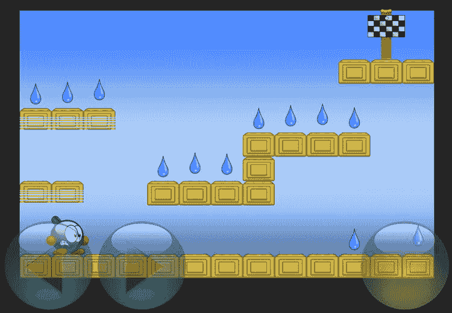

# 平台游戏物理机制

电子补充材料 本章的在线版本 (doi:[10.1007/978-1-4842-0650-8_24](http://dx.doi.org/10.1007/978-1-4842-0650-8_24)) 包含补充材料，仅供授权用户使用。

在上一章中，你学习了如何创建动画角色。你还学习了如何通过从文本文件中读取关卡数据来构建一个基于瓦片的游戏世界。然而，最重要的一个方面仍然缺失：定义角色如何与游戏世界交互。你可以让角色从左向右移动，但如果简单地将角色放置在关卡中，它只能沿着屏幕底部行走。这还不够。你希望角色能够跳到瓦片顶部，如果从瓦片上离开则会掉落，而且你不希望角色掉出屏幕边缘。为了实现这些功能，你需要一个物理系统。

你可以使用 SpriteKit 框架提供的现有物理引擎，但有几个理由说明为什么为平台游戏构建你自己的引擎是明智的。由于物理引擎在很大程度上决定了游戏的玩法，你需要能够调整引擎的参数以适应游戏。如果你编写自己的物理引擎，你将对其行为方式有更多的控制权。此外，你自己的引擎可能比 SpriteKit 的物理引擎使用更少的资源；平台游戏通常不需要超逼真的物理效果，因此你可以使用更简单的规则和算法。编写自己物理引擎的另一个重要原因是，平台游戏行为的某些部分很难与现有的物理引擎集成。例如，Tick Tick 游戏中有一些特殊的瓦片，当你站在它们下方时可以跳穿过去。这种行为很难用传统的物理引擎来编码。最后，虽然编写自己的物理引擎可能是一个相当大的挑战，但这是一个很好的练习，可以帮助你理解物理原理并将其转化为真正可用的代码！

在 Tick Tick 游戏中，主要的物理行为将在 `Player` 类中实现，因为玩家是与游戏世界交互的主要角色。处理物理机制有两个主要方面：赋予角色跳跃或掉落的能力，以及处理角色与其他游戏对象之间的碰撞并对这些碰撞做出响应。


## 将角色锁定在游戏世界中

你要做的第一件事就是**将角色锁定在游戏世界中**。上一章的例子中，角色可以毫无阻碍地走出屏幕。为了解决这个问题，你可以在屏幕左右两侧放置一堵由虚拟墙砖构成的屏障。然后假定你的碰撞处理机制（虽然你还没编写）会确保角色无法穿过这些墙壁。你只需防止角色从屏幕左侧或右侧走出去。角色应该能够从屏幕顶部跳出视野，也应该能通过地面上的坑洞掉出游戏世界（当然，随后便会死亡）。

为了在屏幕左右两侧构建这堵虚拟墙砖屏障，你需要为网格添加一些行为逻辑。这可以在表示基于瓦片的游戏世界的 `TileField` 类中完成。该类有一个名为 `getTileType` 的方法，该方法根据给定的行列索引返回对应瓦片的类型。这个方法的一个巧妙之处是：它允许索引超出网格的有效范围。例如，即使查询位置为 `(-2,500)` 的瓦片类型也是允许的。首先，它会检查网格中指定位置是否存在瓦片，如果存在，则返回其瓦片类型：

```
if let obj = layout.at(col, row: row) as? Tile {
    return obj.type
}
```

然后，它会检查列索引是否超出范围。如果是，则返回一个墙砖类型：

```
if col < 0 || col >= layout.columns {
    return .Wall
}
```

在其他所有情况下，则返回一个背景砖类型：

```
return .Background
```

完整的 `TileField` 类可以在本章附带的示例程序 `TickTick2` 中找到。

## 将角色设置在正确位置

当你从文本文件加载关卡砖块时，使用字符 `1` 来表示玩家角色的起始砖块。你需要根据该砖块的位置来创建 `Player` 对象，并将其设置在正确的位置。为此，你在 `LevelState` 类中添加一个名为 `loadStartTile` 的方法。在该方法中，你根据角色在网格中的位置计算其起始坐标。由于角色的原点位于精灵的底部中心点，你按如下方式计算这个位置：

```
var startPosition = tileField.layout.toPosition(x, row: y)
startPosition.y -= CGFloat(tileField.layout.cellHeight / 2)
```

请注意，你首先使用网格布局的 `toPosition` 方法计算位置。由于这得到的是砖块的中心点，你需要从 y 坐标中减去单元格高度的一半，才能到达砖块的底部。然后，你创建 `Player` 对象并将其添加到游戏世界中：

```
var player = Player(startPos: startPosition)
player.name = "player"
player.zPosition = Layer.Scene1
world.addChild(player)
```

最后，你仍然需要在此处创建一个可以存储在网格中的实际砖块，因为每个字符都应该对应一个砖块。在这种情况下，你可以创建一个放在角色站立位置的背景砖：

```
return Tile()
```

## 跳跃……

你已经了解了角色如何向左或向右行走。那么如何处理跳跃和下落呢？在 `TickTick2` 示例中，你在屏幕右下角添加了一个跳跃按钮。当玩家按下该按钮时，角色就会跳跃。这基本上意味着角色获得一个正的 y 方向速度。这可以很容易地在 `Player` 类的 `handleInput` 方法中实现：

```
if jumpButton.tapped {
    self.jump()
}
```

`jump` 方法如下：

```
func jump(speed: CGFloat = 680) {
    self.velocity.y = speed
}
```

所以，在不提供任何参数值的情况下调用 `jump` 方法的效果是：将 y 方向速度设置为 680。我选择这个数值是有点随机的。使用更大的数值意味着角色可以跳得更高。我选择这个值是为了让角色能跳得足够高以触及砖块，但又不会高到让游戏变得过于简单（那样角色可能直接跳到关卡尽头）。

这种方法存在一个小问题：你总是允许玩家角色跳跃，无论角色当前处于什么状态。也就是说，如果角色正在跳跃或掉下悬崖，你仍然允许玩家让角色跳回安全地带。这并不是你想要的。你希望角色只在站立于地面时才能跳跃。这可以通过检测角色与墙壁或平台砖块（这是角色唯一能站立其上的砖块类型）之间的碰撞来实现。让我们暂时假设你尚未编写的碰撞检测算法会处理这个问题，并使用一个属性来跟踪角色是否在地面上：

```
var onTheGround = false
```

有时，有必要先用英语（而不是 Swift）勾勒出一个类的框架，以便你能编写游戏的其他部分。碰撞检测的情况也是如此。你无法在构建碰撞检测算法之前对其进行测试，但你也不想在算法创建并测试之前就将其嵌入。必须有一方先行，所以你需要先在脑海中明确另一方的运作方式，并做好规划或记录。

如果 `onTheGround` 属性为 `true`，你就知道角色正站在地面上。现在你可以修改初始的 `if` 指令，使其只允许角色从地面起跳，而不能在空中起跳：

```
if jumpButton.tapped && self.onTheGround {
    self.jump()
}
```

## ……和下坠

目前，唯一改变 y 方向速度的地方是在 `handleInput` 方法中，当玩家想要跳跃时。如果 y 方向速度无限期地保持在 680 这个值，角色就会在空中向上移动，飞出屏幕，脱离地球大气层，进入外太空。因为你做的不是一款关于太空炸弹的游戏，所以你必须对此采取措施。你忘记添加到游戏世界中的是**重力**。

你可以采用一种简单的方法来模拟重力对角色的影响。在每个更新步骤中，从 y 方向速度中减去一个较小的值，类似于你在 Painter 游戏中处理球体时所做的那样：

```
self.velocity.y -= CGFloat(1300 * delta)
```

如果角色具有正速度，这个速度会逐渐减小，直到达到零，然后开始反向增加（变为负值）。其效果是角色跳到一定高度后开始下落，就像现实世界中一样。然而，这样一来，碰撞检测机制就变得更加重要了。如果没有碰撞检测，角色在游戏开始时就会开始下坠！


## 碰撞检测

检测游戏对象之间的碰撞是模拟交互式游戏世界的一个非常重要的部分。碰撞检测在游戏中有多种用途：检测角色是否踩到了增强道具、检测角色是否与抛射物相撞、检测角色与墙壁或地板之间的碰撞等等。你已经在本书前面讨论过的游戏中使用了碰撞检测。在图坦卡蒙之墓游戏中，物理引擎负责处理对象间的碰撞检测。在画家游戏中，你使用边界框自己实现了一个简单的碰撞检测。以下是`PaintCan`类中的一段代码：

```
var ball = GameScene.world.ball

if self.box.intersects(ball.box) {
    color = ball.color
    ball.reset()
}
```

这里所做的是通过检查球和油漆罐的边界框是否相交来检测它们之间的碰撞。这不是一种非常精确的碰撞检测方法。球和油漆罐的形状都不像盒子。因此，在某些情况下，没有发生碰撞时却检测到了碰撞，而有时精灵实际上正在碰撞，却又检测不到。尽管如此，许多游戏在进行碰撞检测时仍会使用简化形状，例如圆形和矩形，来表示对象。因为这些形状将对象包裹在里面，所以它们也被称为边界圆和边界框。Tick Tick 游戏使用了轴对齐边界框，这意味着你只考虑边与 x 轴和 y 轴平行的盒子。

使用边界框进行碰撞检测并不总是足够精确。当游戏对象彼此靠近时，它们的边界形状可能会相交（从而触发碰撞），但实际对象并未碰撞。而且，当游戏对象有动画时，其形状可能会随时间改变。你可以将边界形状做得更大，以便对象在任何情况下都能放入其中，但这会导致更多错误的碰撞触发。对此有一些解决方案。例如，除了使用盒子和圆形，你还可以通过围绕精灵绘制线条来创建其轮廓。如果你创建一个凸轮廓（意味着轮廓没有包含任何空洞或向内凹陷的部分），你可以使用分离轴定理来确定两个这样的轮廓之间是否存在碰撞。处理这个问题超出了本书的范围，但可以说，这比处理盒子和圆形会稍微消耗更多的资源。

另一种解决方案，资源消耗甚至更高，即是逐像素检查碰撞。基本上，你可以编写一个算法，遍历精灵中的非透明像素（使用嵌套的`for`指令），并检查这些像素中的一个或多个是否与另一个精灵中的像素发生碰撞（同样，通过嵌套的`for`指令遍历它们）。由于这种高度精细的碰撞检测成本高昂，特别是如果你希望游戏在较旧的 iDevice 上流畅运行，那么你将在 Tick Tick 游戏中使用基于边界框的简单碰撞检测，尽管你也会学习一些技巧，使碰撞处理更加自然。

### 获取边界框

为了在游戏中高效地处理碰撞，你使用`SKNode`类中的`box`属性，该属性返回精灵的边界框：

```
var box: CGRect {
    get {
        var boundingBox = self.calculateAccumulatedFrame()
        if parent != nil {
            boundingBox.origin = scene!.convertPoint(boundingBox.origin,
                fromNode: parent!)
        }
        return boundingBox
    }
}
```

注意，你将边界框的原点转换到了场景坐标系。这确保了边界框的位置是以世界坐标表示的。在进行碰撞检测时，你想知道对象在世界中的位置——你并不关心它们在游戏对象层级中的局部位置。

### 处理角色-瓦片碰撞

在 Tick Tick 游戏中，你主要需要检测角色与瓦片之间的碰撞。你可以在一个名为`handleCollisions`的方法中完成此操作，该方法在`Player`类的`updateDelta`方法中被调用。其思路是，你首先进行所有关于跳跃、下落和奔跑的计算（你在本章开头部分已经做了这些）。如果角色与瓦片之间发生碰撞，你就修正角色的位置，使其不再碰撞。在`handleCollisions`方法中，你遍历瓦片网格，并检查当前正在检查的瓦片是否与角色发生碰撞。

你不需要检查网格中的所有瓦片，只需检查那些靠近角色当前位置的瓦片。你可以按如下方式计算离角色位置最近的瓦片：

```
let tiles = childNodeWithName("//tileField") as! TileField
let (x_floor, y_floor) = tiles.layout.gridLocation(self.position)
```

现在，你可以使用一个嵌套的`for`指令来查看角色周围的瓦片。为了应对快速的跳跃和下落，你在 y 方向上考虑了更多的瓦片。在嵌套的`for`指令中，你接着检查角色是否与瓦片发生碰撞。然而，只有当瓦片不是背景瓦片时，你才需要这样做。完成所有这些操作的代码如下：

```
for (var y = y_floor - 1; y <= y_floor + 2; ++y) {
    for (var x = x_floor - 1; x <= x_floor + 1; ++x) {
        let tileType = tiles.getTileType(x, row: y)
        if tileType == .Background {
            continue
        }
        let tileBounds = tiles.getTileBox(x, row: y)
        if !tileBounds.intersects(box) {
            continue
        }
        ...
    }
}
```

如你所见，你没有直接访问`Tile`对象。原因在于，有时因为角色靠近屏幕边缘，`x`或`y`索引可能是负数。这里你可以看到使用添加到`TileField`类中的`getTileType`方法的好处。你不需要关心你是否真的在处理一个瓦片：只要知道它的类型和边界框，你就可以完成你的工作。

在嵌套的`for`指令中，你还看到了一个新关键字：`continue`。这个关键字可以在`for`或`while`指令中使用，以停止执行当前循环的迭代并继续下一次迭代。在这个例子中，如果瓦片的类型是`Background`，则其余指令不再执行，你继续递增`x`并开始新的迭代来检查下一个瓦片。结果就是，只有非`Background`类型的瓦片才会被考虑。`continue`关键字与`break`相关，`break`会完全停止整个循环。与`break`不同，`continue`仅停止当前的迭代。

然而，这段代码并不总是能正确工作。特别是当角色站在瓦片上时，计算边界框时的舍入误差可能导致算法认为角色没有站在地面上。角色的速度因此增加，结果角色可能会穿过瓦片掉落下去。为了弥补任何舍入误差，你将边界框的 y 原点减少 1：

```
let tileBounds = tiles.getTileBox(x, row: y)
var bbox = box
bbox.origin.y -= 1
if !tileBounds.intersects(bbox) {
    continue
}
// 处理碰撞
```


### 处理碰撞

现在你已经能够检测游戏世界中角色与图块之间的碰撞，接下来需要确定碰撞发生时该如何处理。有几种可能性：可以让游戏崩溃（如果你想将游戏卖给更多人，这可不太妙），可以警告用户不应与游戏中的物体碰撞（会弹出大量消息），也可以自动修正角色与物体碰撞后的位置。

为了修正角色位置，你需要知道碰撞的严重程度。例如，如果角色向右撞到墙壁，就必须知道要将角色向左移动多少距离才能解除碰撞。这被称为"交叠深度"。让我们为`CGRect`类型扩展一个名为`calculateIntersectionDepth`的方法，用于计算两个`CGRect`对象在 x 轴和 y 轴方向上的交叠深度。在本例中，这些矩形分别是角色的包围盒和与角色发生碰撞的图块的包围盒。

计算交叠深度时，首先需要确定两个矩形中心之间的最小允许距离，以保证两者不发生碰撞：

```
let minDistance = CGPoint(x: (self.size.width + rect.size.width)/2,
y: (self.size.height + rect.size.height)/2)
```

然后计算两个矩形中心之间的实际距离：

```
let distance = CGPoint(x: self.midX - rect.midX, y: self.midY - rect.midY)
```

现在，你可以通过计算最小允许距离与实际距离之间的差值来得到交叠深度。观察两个中心之间的实际距离时，x 轴和 y 轴维度各有两种可能：距离为负或为正。例如，如果 x 轴距离为负，说明矩形`rect`位于矩形`this`的右侧（因为`rect.midX > self.midX`）。如果矩形`self`代表角色，这意味着你需要将角色向左移动来修正这个交叠。因此，需要将 x 轴交叠深度返回为负值，可通过`- minDistance.x - distance.x`来计算。为什么？因为发生碰撞时，两个矩形之间的距离小于`minDistance`。而由于`distance`为负，表达式`-minDistance.x - distance.x`会给出两者之间的负差值。如果`distance`为正，则表达式`minDistance.x - distance.x`会给出两者之间的正差值。y 轴距离的推理逻辑相同。你可以按如下方式计算深度：

```
if distance.x > 0 {
depth.x = minDistance.x - distance.x
} else {
depth.x = -minDistance.x - distance.x
}
if distance.y > 0 {
depth.y = minDistance.y - distance.y
} else {
depth.y = -minDistance.y - distance.y
}
```

最后，将深度向量作为方法的返回值返回：

```
return depth
```

完整方法请参见本章所属 TickTick2 示例中的`Math.swift`文件。当你知道角色与图块发生碰撞时，可以使用刚添加到`CGRect`类型的方法来计算交叠深度：

```
let depth = box.calculateIntersectionDepth(tileBounds)
```

现在你已经计算出了交叠深度，有两种方法可以解决这个碰撞：在 x 轴方向移动角色，或在 y 轴方向移动角色。通常情况下，你应该选择移动距离最小的方向，以避免产生不自然的运动或位移。因此，如果 x 轴深度小于 y 轴深度，就在 x 轴方向移动角色；否则就在 y 轴方向移动。你可以用`if`指令来检查这一点。比较两个深度维度时，需要考虑它们可能为负值。通过使用`fabs`函数比较绝对值来解决这个问题：

```
if fabs(depth.x) < fabs(depth.y) {
// 在 x 轴方向移动角色
}
```

是否每次与图块发生碰撞时都需要移动角色？这取决于图块类型。请记住，`TileType`用于表示三种可能的图块类型：`TileType.Background`、`TileType.Wall`和`TileType.Platform`。如果角色碰撞的图块是背景图块，你肯定不希望移动角色。此外，在 x 轴方向移动时，你需要让角色能够穿过平台图块。因此，唯一需要移动角色来修正碰撞的情况是当角色与墙壁图块（`TileType.Wall`）碰撞时。在这种情况下，只需将 x 轴深度值加到角色位置上即可移动角色：

```
if tileType == .Wall {
self.position.x += depth.x
}
```

如果想要修正角色在 y 轴方向的位置，情况会稍微复杂一些。由于这里处理的是 y 轴方向的移动，因此这也是判断角色是否站在地面上的好时机。在`handleCollisions`方法开始时，你将`isOnTheGround`属性设置为`false`。所以，初始假设是角色不在地面上。在某些情况下，角色站在地面上，此时需要将该属性设置为`true`。如何检查角色是否站在地面上？如果它不在地面上，那一定在下落。如果在下落，那么上一帧的 y 坐标位置小于当前位置。为了能够访问上一帧的 y 坐标，你可以在每次调用`handleCollisions`方法结束时将其存储在一个属性中：

```
self.previousYPosition = self.position.y
```

现在你可以使用上一帧的 y 坐标来判断角色是否站在地面上。首先，计算上一帧与当前 y 坐标的差值：

```
let ydifference = self.position.y - self.previousYPosition
```

如果当前全局 y 坐标减去这个差值大于或等于角色碰撞图块的顶部，并且该图块不是背景图块，那么说明角色正在下落并到达了一个图块。如果是这种情况，就将`isOnTheGround`属性设置为`true`，并将 y 轴速度设为 0，让角色停止下落。还需要修正当前 y 坐标，使角色不再与图块交叠：

```
if box.minY - ydifference >= tileBounds.maxY && tileType != .Background {
self.onTheGround = true
self.velocity.y = 0
self.position.y += depth.y
}
```

你还需要处理的另一种情况是：角色并非在下落，而是在跳跃过程中碰到了墙壁图块。在这种情况下，你只需修正角色位置，使其不再与墙壁图块交叠即可，这由以下`if`指令实现：

```
else if tileType == .Wall {
self.position.y += depth.y
}
```

图 24-1 展示了 TickTick2 示例的屏幕截图。我在这里创建了一个简单的关卡，你可以用来测试物理引擎。该关卡比大多数 iDevice 的屏幕要小，因此关卡周围会有些黑色区域。在第 26 章中，我将演示如何为游戏添加横向卷轴功能，这样你就能创建更大的关卡，并让它们在不同屏幕尺寸的设备上运行。



图 24-1. TickTick2 示例

## 本章所学内容

在本章中，你学到了以下内容：

- 如何将角色约束在环境范围内
- 如何模拟跳跃和下落
- 如何处理游戏中的碰撞


