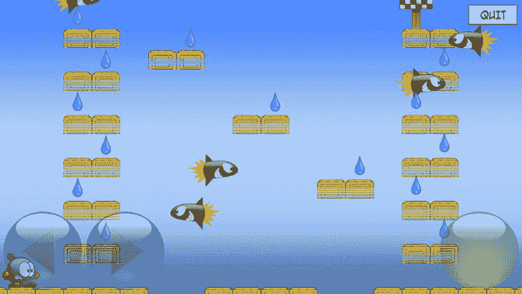
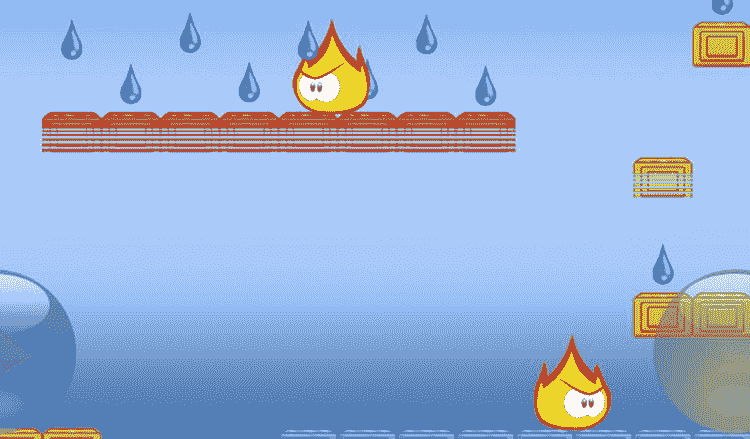
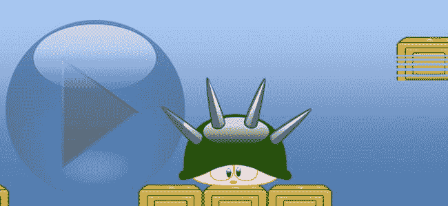
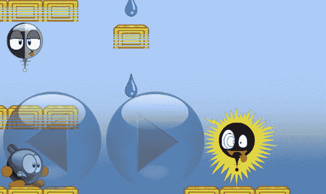

# 25. 智能敌人

电子补充材料 本章在线版本（doi:[10.​1007/​978-1-4842-0650-8_​25](http://dx.doi.org/10.1007/978-1-4842-0650-8_25)）包含补充材料，仅供授权用户使用。

作为开发《Tick Tick》游戏的下一步，让我们通过添加危险的敌人来为玩家引入一些危险。如果玩家碰到敌人，玩家就会死亡。敌人通常不受玩家控制（那样游戏就太简单了）。因此，你需要定义某种智能（或愚蠢）的行为。你不想让这些敌人太聪明：玩家应该能够完成关卡。毕竟，玩游戏的目标就是：获胜。好处在于，你可以构建不同类型的敌人，展示不同的行为类型。这样一来，玩家将拥有不同的游戏玩法选择，并且必须制定不同的策略来完成关卡。

定义敌人的行为可能会导致非常复杂的代码，包含许多不同的状态、推理、路径规划等等。在本章中，你将看到几种不同类型的敌人：一枚火箭、一只打喷嚏的乌龟（没错）、闪电狗，以及几个不同的巡逻敌人。本章不涉及玩家应该如何与敌人互动——你只会定义它们的基本行为。

## 火箭

最基本的敌人之一就是火箭。火箭从屏幕的一侧飞到另一侧，然后在一段时间后重新出现。如果玩家接触到火箭，玩家就会死亡。在关卡描述中，你用字符 `r` 和 `R` 来表示应该在关卡中放置一个火箭敌人。例如，考虑以下关卡描述：

`Many, many, many, many, many rockets...`

`20 15`

`30`

`....................`

`r..W...........X....`

`...--..W.......--...`

`....W.--........W..R`

`...--..........--...`

`r..W......W....W....`

`...--....--....--...`

`....W...........W...`

`...--........W.--...`

`r..W........--.W....`

`...--..........--...`

`....W...........W..R`

`...--..........--...`

`.1..................`

`######..####..######`

小写 `r` 表示火箭应从左向右飞行，大写 `R` 表示它应从右向左飞行（参见第 22 章中的表 22-1）。

### 创建与重置火箭

让我们创建一个代表此类特定敌人的 `Rocket` 类。你继承自 `AnimatedNode` 类，因为火箭是动画的。`Rocket` 类有几个属性：一个速度、其在关卡中的起始位置，以及一个名为 `spawnTime` 的属性，该属性用于记录火箭应该出现的时间。在初始化器中，你需要加载火箭动画并播放它，然后检查动画是否应该镜像。由于动画中火箭是向右移动的，因此如果火箭向左移动，你需要将其镜像。你还存储了火箭的起始位置，以便在它移出屏幕时将其放回该位置。以下是 `Rocket` 类定义的一部分：

```
class Rocket: AnimatedNode {
    var startPosition: CGPoint = CGPoint.zeroPoint
    var spawnTime: CGFloat = 0
    var velocity = CGPoint.zeroPoint
    init(moveToLeft: Bool, startPos: CGPoint) {
        startPosition = startPos
        super.init()
        loadAnimation("spr_rocket", looping: true, frameTime: 0.5, name: "default")
        playAnimation("default")
        if moveToLeft {
            self.xScale = -1
        }
        reset()
    }
    ...
}
```

初始化器中的最后一个指令是对 `reset` 方法的调用。在这个方法中，你将火箭的当前位置设置为起始位置，隐藏火箭（它最初应该是不可见的），并将其速度设为零。你还使用随机数生成器计算一个随机时间（以秒为单位），之后火箭应出现并开始移动。你将这个时间存储在属性 `spawnTime` 中。你将这些指令放在一个单独的 `reset` 方法中，因为稍后你还会在火箭飞出屏幕后调用此方法。

### 火箭行为编程

火箭的行为（一如既往）被编码在 `updateDelta` 方法中。基本上，火箭表现出两种主要类型的行为：要么它可见并从屏幕一端移动到另一端，要么它不可见并等待出现。你可以通过查看 `spawnTime` 属性的值来确定火箭处于这两种状态中的哪一种。如果此属性包含一个大于零的值，则火箭正在等待生成。如果该值小于或等于零，则火箭可见并从屏幕一端移动到另一端。

让我们看第一种情况。如果火箭正在等待生成，你只需从生成时间中减去自上次调用 `updateDelta` 以来经过的时间：

```
if spawnTime > 0 {
    spawnTime -= CGFloat(delta)
    return
}
```

第二种情况稍微复杂一些。火箭正在从屏幕一端移动到另一端。因此，你将隐藏状态设置为 `false`，并根据其移动方向计算火箭速度：

```
hidden = false
self.velocity.x = 600
if self.xScale < 0 {
    self.velocity.x *= -1
}
```

最后，你必须检查火箭是否飞出了关卡。如果是这种情况，则应重置火箭。你使用瓦片场的边界框来检查火箭是否在关卡之外。如果此边界框与火箭的边界框不相交，你就知道火箭在关卡外部，然后重置它：

```
let tileField = childNodeWithName("//tileField") as! TileField
if !tileField.box.intersects(self.box) {
    self.reset()
}
```

这样就完成了 `Rocket` 类，除了与玩家的交互部分——你将在第 26 章中更详细地研究这一点。完整的类，请参见属于本章的 TickTick3 示例代码。图 25-1 展示了本章第一节中定义的关卡的屏幕截图。请注意，该关卡仅部分可见，因为它比设备屏幕要大。



**图 25-1.** 一个有多枚火箭飞行的关卡

## 巡逻敌人

火箭是一种基本上没有智能行为的敌人。它从左飞到右，或从右飞到左，直到飞出关卡，然后重置自己。你也可以添加稍微更智能一点的敌人，例如巡逻敌人。让我们设置几种不同类型的巡逻敌人，你可以将它们添加到游戏中。


### 基本的 `PatrollingEnemy` 类

`PatrollingEnemy` 类与 `Rocket` 类类似。你希望巡逻敌人具有动画效果，因此它继承自 `AnimatedNode` 类。你还需要在重写的 `updateDelta` 方法中定义敌人的行为。巡逻敌人的基本行为是：从左走到右，然后折返。如果敌人角色到达一个缺口或墙壁瓷砖处，它会停止行走，等待一段时间，然后转身。你可以在关卡中的任意位置放置敌人。对于玩家，你可以定义一些基本的物理特性，如下落和跳跃。但对于 `PatrollingEnemy` 类，你不需要这样做，因为你为本游戏定义的敌人只会从左走到右然后折返。

在 `PatrollingEnemy` 类的初始化器中，你需要加载巡逻敌人角色的主动画（一个看起来愤怒的火焰，如图 25-2 所示）。初始时，你设置一个正的速度，使敌人开始向右行走。你还初始化了另一个名为 `waitTime` 的属性，用于记录敌人在其行走的平台边缘等待了多长时间：



图 25-2.
几个巡逻敌人

```
class PatrollingEnemy: AnimatedNode {
    var waitTime: CGFloat = 0
    var velocity = CGPoint(x: 120, y: 0)

    override init() {
        super.init()
        loadAnimation("spr_flame", looping: true, frameTime: 0.1, name: "default")
        playAnimation("default")
    }
    ...
}
```

在 `updateDelta` 方法中，你需要区分两种情况：敌人正在行走或正在等待。你可以通过查看 `waitTime` 属性来区分这些状态。如果该属性包含正值，则敌人在等待；如果该属性值为零或负数，则敌人在行走。当敌人等待时，你不需要做太多工作。就像在 `Rocket` 类中一样，你从 `waitTime` 属性中减去经过的游戏时间。如果等待时间已归零，你需要让角色转身。以下是实现该功能的代码：

```
if waitTime > 0 {
    waitTime -= CGFloat(delta)
    if waitTime <= 0 {
        self.turnAround()
    }
}
```

`turnAround` 方法简单地镜像动画并反转速度：

```
func turnAround() {
    xScale = -xScale
    velocity.x = 120 * xScale
}
```

如果敌人当前正在行走（而非等待），你需要判断它是否已到达所行走平台的边缘。有两种情况会触达边缘：要么前方有缺口，敌人无法继续前进；要么有墙壁瓷砖挡住了去路。你使用敌人的包围盒来获取这些信息。如果敌人向左行走，你检查敌人左侧的瓷砖；如果敌人向右行走，你检查它右侧的瓷砖。你可以按如下方式计算目标瓷砖的列索引：

```
let tileField = childNodeWithName("//tileField") as! TileField
var (col, row) = tileField.layout.gridLocation(self.position)
if xScale < 0 {
    col -= 1
} else {
    col += 1
}
```

接下来，你需要检查敌人是否碰到了墙壁瓷砖或平台边界。如果计算出的索引位置下方的瓷砖是背景瓷砖，则说明敌人到达了平台边界，必须停止行走。如果索引 `(col, row)` 处的瓷砖（即紧邻敌人的瓷砖）是墙壁瓷砖，敌人也必须停止行走。为了停止行走，你给等待时间赋予一个正值，并将 x 方向的速度设为零：

```
if tileField.getTileType(col, row: row - 1) == .Background ||
    tileField.getTileType(col, row: row) == .Wall {
    waitTime = 0.5
    velocity = CGPoint.zeroPoint
}
```

### 不同类型的敌人

你可以通过引入一些变体，让巡逻敌人变得稍微更有趣一些。这里你可以利用继承的强大功能，编写 `PatrollingEnemy` 类的几个子类来定义不同的敌人行为。

例如，你可以创建一个稍微更不可预测的敌人，让它偶尔改变方向。这时，你还可以将敌人的行走速度改为一个随机值。具体做法是定义一个继承自 `PatrollingEnemy` 类的类，名为 `UnpredictableEnemy`。因此，默认情况下，它表现出与普通敌人相同的行为。你重写 `updateDelta` 方法，并添加几行代码，随机改变敌人行走的方向及其速度。因为你复用了 `PatrollingEnemy` 类的大部分代码，`UnpredictableEnemy` 类相当简洁。以下是完整的类定义：

```
class UnpredictableEnemy: PatrollingEnemy {
    override func updateDelta(delta: NSTimeInterval) {
        super.updateDelta(delta)
        if waitTime <= 0 && randomCGFloat() < 0.01 {
            self.turnAround()
            self.velocity.x = randomCGFloat() * 300 * xScale
        }
    }
}
```

如你所见，你使用一条 `if` 指令来检查随机生成的数字是否低于某个值。因此，在某些情况下，该条件会返回 `true`。在 `if` 指令的代码体中，你首先让敌人转身，然后计算新的 x 方向速度。请注意，你将随机生成的速度乘以了 x 轴缩放比例。这是为了确保新速度的方向正确。同时，你首先调用了基类的 `updateDelta` 方法，以便选择正确的动画、处理与玩家的碰撞等等。

我能想到的另一种变体是，敌人不再只是简单地从左走到右再折返，而是跟随玩家。同样，它也继承自 `PatrollingEnemy` 类。这是一个名为 `PlayerFollowingEnemy` 的类：

```
class PlayerFollowingEnemy: PatrollingEnemy {
    override func updateDelta(delta: NSTimeInterval) {
        super.updateDelta(delta)
        let player = childNodeWithName("//player") as! Player
        let direction = player.position.x - self.position.x
        if direction * velocity.x < 0 && player.velocity != CGPoint.zeroPoint {
            self.turnAround()
        }
    }
}
```

这个类定义了一个敌人，如果玩家正在移动，它会跟随玩家。这是通过检查敌人当前是否正朝着玩家所在的方向行走（仅考虑 x 方向）来实现的。如果不是，敌人就会转身。你通过设置一个限制条件来降低敌人的“智能”：仅在玩家在 x 方向上没有移动时（即玩家的 x 方向速度为零）才执行上述操作。

你永远不应该让敌人过于聪明。另外，也不要让它们移动得太快——如果敌人在跟随玩家时速度明显快于玩家，游戏会很快结束。敌人的存在是为了让玩家击败，这样玩家才能赢得游戏。在一个敌人过于聪明或无法战胜的游戏中游玩，乐趣会大打折扣，除非你热衷于一次又一次地“阵亡”！


## 其他类型的敌人

你可以在游戏中添加的另一种敌人是一只打喷嚏的海龟（见图 25-3）。你可能会问：为什么是海龟？又为什么是打喷嚏的海龟？嗯，我其实也回答不了这个问题。不过，这种敌人设计的思路在于它兼具消极和积极两种属性。消极方面，海龟打喷嚏时会竖起尖刺，所以你不能触碰它。但如果海龟没有打喷嚏，你就可以利用它跳得更高。由于你目前尚未处理交互逻辑，所以暂时只需添加这只带有动画效果的海龟。海龟可供跳跃 5 秒，然后它打喷嚏并竖起尖刺持续 5 秒，之后又恢复之前的状态维持 5 秒，如此循环往复。



图 25-3.

别跳到尖刺海龟身上！

该敌人由 `Turtle` 类表示，其设置方式与之前的敌人类似。海龟有两种状态：闲置状态，以及打喷嚏后状态——此时它带有危险的尖刺。在这种情况下，你需要维护两个成员变量来跟踪海龟当前处于哪种状态以及在该状态下经过了多少时间：`waitTime` 属性用于追踪当前状态还剩多少时间，而 `sneezing` 属性则用于记录海龟是否正在打喷嚏。同样，在 `updateDelta` 方法中，你需要处理两个阶段之间的切换，就像你对火箭和巡逻敌人所做的那样。这里不再赘述，因为代码与其他敌人类非常相似。你可以查看本章附带的 `TickTick3` 程序中的完整代码。

Sparky 是你添加到游戏中的最后一种敌人类型。和其他敌人一样，Sparky 也有两种状态（见图 25-4）。Sparky 是一种非常危险、热爱电力的敌人。它静静地悬浮在空中，直到接收到一股能量冲击后才会坠落。当 Sparky 悬浮在空中时，它并不危险；但一旦它坠落下来，千万别碰它！请参考 `Sparky` 类的代码。



图 25-4.

当 Sparky 带电时十分危险

### 敌人软件架构

所有这些不同类型的敌人外观不同，行为也各异，但它们通常拥有共同的类设计。你或许可以通过使用几个通用类来设计更好的敌人定义方式，这些类允许你定义状态以及状态之间的转换。每个转换都可以附带条件，例如必须经过一定时间，或者某个动画应该播放完毕。这种结构被称为**有限状态机**。这是人工智能系统中非常常用的一种技术。如果你愿意接受挑战，不妨尝试编写一个有限状态机库，并用它来重新定义现有的敌人！

## 加载不同类型的敌人

既然你已经定义了多种敌人，剩下要做的就是在从文本文件读取关卡数据时将它们加载进来。不同敌人的精灵图使用字符进行标识。

根据加载关卡时读取到的字符，你需要在 `LevelState` 类的 `switch` 指令中添加一些分支，通过调用不同的方法来加载敌人：

```
case "R":
    return loadRocketTile(x, y: y, moveToLeft: true)
case "r":
    return loadRocketTile(x, y: y, moveToLeft: false)
case "A", "B", "C":
    return loadFlameTile(c, x: x, y: y)
case "S":
    return loadSparkyTile(x, y: y)
case "T":
    return loadTurtleTile(x, y: y)
```

加载敌人非常简单。你只需创建一个想要添加的敌人实例，设置其位置，然后将其添加到 `world` 节点即可。例如，下面是加载海龟敌人的方法：

```
func loadTurtleTile(x: Int, y: Int) -> SKNode {
    var turtle = Turtle()
    turtle.position = tileField.layout.toPosition(x, row: y)
    turtle.position.y += 20
    turtle.zPosition = Layer.Scene1
    world.addChild(turtle)
    return Tile()
}
```

现在，你已经定义了数种具有不同智能水平和能力的敌人。你可以根据自己的游戏需求，定义更聪明、更狡猾，甚至更愚蠢的敌人。你目前没有为敌人应用任何物理效果；不过，一旦你开始构建更智能的敌人——例如能够跳跃或坠落——你就需要像为玩家角色实现物理效果那样来实现物理系统。作为练习，请思考如何在不依赖物理系统的情况下让这些敌人拥有更强的能力。你能让它们在玩家靠近时移动得更快吗？你能创建一个向玩家发射粒子的敌人吗？可能性是无限的，不妨亲自尝试一番！

## 本章小结

在本章中，你学会了以下内容：

*   如何定义不同类型的敌人
*   如何利用继承来创造多样化的敌人行为

