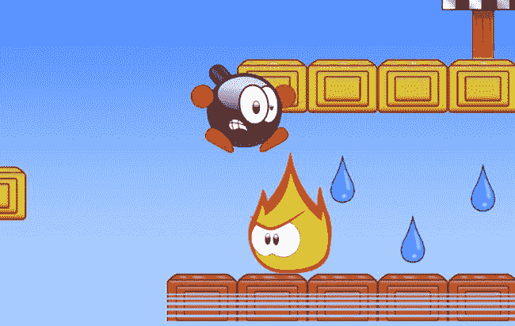
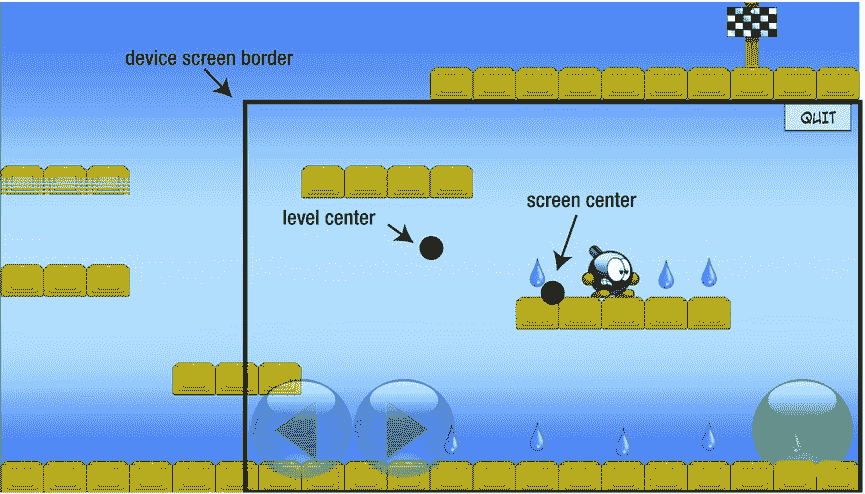

# 26. 添加玩家交互

电子补充材料 本章的在线版本 (doi:[10.1007/978-1-4842-0650-8_26](http://dx.doi.org/10.1007/978-1-4842-0650-8_26)) 包含补充材料，仅供授权用户使用。

在本章中，你将增加玩家与关卡内物体之间更多的交互。目前，玩家可以四处走动，一个基本的物理系统允许玩家跳跃、与墙壁瓦片碰撞或掉出屏幕。首先，你将了解一种非常简单的交互方式：收集水滴。然后，你将看到如何创建让玩家在冰面上滑行的行为。你还会重点处理程序中涉及游戏中各种玩家与敌人交互的部分。最后，你将添加游戏的垂直和水平滚动功能。

## 收集水滴

首先要添加的是玩家收集水滴的功能。当炸弹角色与水滴发生碰撞时，玩家就收集到了该水滴。在这种情况下，你需要让水滴变得不可见。

让水滴在被收集后变得不可见，并非解决只绘制未被收集水滴这一问题的唯一方法，但它是实现起来最简单的方法之一。另一种方法是维护一个已被收集的水滴列表，然后只将玩家仍需寻找的水滴添加到游戏场景中，但这种技术需要编写更多的代码。

检测玩家是否与水滴发生碰撞的代码位于 `WaterDrop` 类中。原因很明确：和之前一样，每个游戏对象负责自己的行为。如果在 `WaterDrop` 类中处理这些碰撞，那么每个水滴都会检查自身是否与玩家发生碰撞。你需要在 `updateDelta` 方法中编写这段代码。第一步是获取玩家对象：

```
let player = childNodeWithName("//player") as! Player
```

如果水滴当前是可见的，则使用 `CGRect` 的 `intersects` 方法检查它是否与玩家发生碰撞。如果碰撞发生，则将水滴的隐藏状态设置为 `true`。同时播放一个音效，告知玩家水滴已被收集：

```
if player.box.intersects(self.box) && !self.hidden {
    self.hidden = true
    waterCollectedSound.play()
}
```

之后，你可以通过检查每个水滴的可见性来判断关卡是否完成。如果所有水滴都变得不可见，就说明玩家已经收集了全部水滴。


### 冰块

你可以在游戏中添加的另一种交互类型是当玩家行走在冰面上时的特殊行为。当玩家在冰面上移动时，你希望角色以恒定速度继续滑动，并且在玩家松开按钮时不会停止移动。尽管持续滑动并不完全符合现实（在现实生活中你会滑动并减速），但它确实带来了玩家容易理解的可预测行为，这在很多情况下比追求真实感更重要。要实现这一点，你需要做两件事：

*   扩展 `handleInput` 方法以处理在冰面上的移动。
*   计算玩家是否站在冰面上。

你需要在 `Player` 类中通过名为 `walkingOnIce` 的属性来跟踪玩家是否站在冰面上。我们先假设这个属性在其他地方被更新，然后来看如何扩展 `handleInput` 方法。你首先要做的是，当角色在冰面上行走时，提高玩家的行走速度。可以按如下方式操作：

```
var walkingSpeed = CGFloat(300)

if self.walkingOnIce {
    walkingSpeed *= 1.5
}
```

速度的乘数是一个影响游戏体验的变量。选择合适的值很重要——太快了关卡就无法玩；太慢了，冰面与普通行走表面就没有任何实质性区别。

如果玩家不是在冰面上行走，而是站在地面上，你需要将 x 方向的速度设为零，这样当玩家不再按下触摸按钮时，角色就会停止移动。为了实现这一点，你需要在 `Player` 类的 `handleInput` 方法开头添加以下 `if` 指令：

```
if self.onTheGround && !self.walkingOnIce {
    self.velocity.x = 0
}
```

然后处理玩家的输入。如果玩家按下了向左或向右的触摸按钮，你设置相应的 x 方向速度：

```
if walkLeftButton.down {
    self.velocity.x = -walkingSpeed
} else if walkRightButton.down {
    self.velocity.x = walkingSpeed
}
```

你唯一需要做的另一件事是判断玩家是否在冰面上行走，并据此更新 `walkingOnIce` 属性。你已经在使用 `handleCollisions` 方法来检查玩家周围的瓦片，因此要扩展该方法以同时检查玩家是否在冰面上，你只需要添加几行代码。在该方法的开头，你假设玩家不在冰面上，就像你假设玩家不在地面上一样：

```
self.walkingOnIce = false
```

玩家只有在位于地面上时才能走在冰面上。你通过以下 `if` 指令来检查他们是否在地面上：

```
if box.minY - ydifference >= tileBounds.maxY && tileType != .Background {
    self.onTheGround = true
    self.velocity.y = 0
    self.position.y += depth.y
}
```

要检查玩家所站立的瓦片是否为冰瓦片，你需要从瓦片字段中获取该瓦片并检查其 `ice` 属性。你可以通过结合 `let` 关键字的 `if` 指令来实现，如下所示：

```
if let currentTile = tiles.layout.at(x, row: y) as? Tile {
    // 对瓦片进行操作
}
```

在 `if` 指令内部，你更新 `walkingOnIce` 属性。你使用逻辑或运算符，这样即使玩家只有部分身体在冰瓦片上，该属性也会被设为 `true`：

```
self.walkingOnIce = self.walkingOnIce || currentTile.ice
```

因为你使用逻辑或来计算玩家是否在冰面上行走，所以你会考虑到所有周围的瓦片。其效果是角色会持续移动，直到它不再站立在任何冰瓦片上（即使部分站立也不行）。运行 TickTick4 示例，来观察玩家角色现在如何与冰面进行交互。

## 敌人与玩家碰撞

最后一种要添加的交互类型是与敌人的碰撞。在很多情况下，当玩家与敌人碰撞时，会导致玩家死亡。在某些情况下，你需要做一些特殊处理（例如，在踩到乌龟时要跳得特别高）。在玩家这边，你需要加载一个额外的动画来显示玩家死亡。因为你不想在玩家死亡后处理玩家输入，所以你需要更新玩家当前的存活状态。你可以使用一个名为 `alive` 的属性来实现，该属性在 `Player` 实例创建时被设为 `true`。在 `handleInput` 方法中，你检查玩家是否还活着。如果不是，你就从该方法返回，这样就不会处理任何输入：

```
if !self.alive {
    return
}
```

你还添加一个名为 `die` 的方法让玩家死亡。玩家有两种死亡方式：掉出游戏画面的洞中，以及与敌人碰撞。因此，你向 `die` 方法传递一个布尔参数，以指示玩家是掉落死亡还是与敌人碰撞死亡。

在 `die` 方法中，你要做几件事。首先，你检查玩家是否已经死亡。如果是，你就直接返回该方法，不做任何操作（毕竟，一个玩家只能死一次）。你将 `alive` 变量设为 `false`。然后，你将 x 方向的速度设为零，以阻止玩家向左或向右移动。你不需要重置 y 方向的速度，所以玩家会继续下落：死亡并不会导致重力消失。接下来，你确定玩家死亡时要播放哪个声音。如果玩家摔死，产生的音效与死于敌人之手截然不同（千万别在现实中尝试，信我就好）。如果玩家因与敌人碰撞而死，你还会给玩家一个向上的速度。这个向上的速度不太符合现实，但它能带来不错的视觉效果（见图 26-1）。最后，你播放 `die` 动画。完整的方法如下：



图 26-1. 玩家与敌人碰撞后死亡

```
func die(falling: Bool = false) {
    if !alive {
        return
    }
    alive = false
    velocity.x = 0
    if falling {
        playerFallSound.play()
    } else {
        velocity.y = 600
        playerDieSound.play()
    }
    self.playAnimation("die")
}
```

你可以在 `updateDelta` 方法中通过计算玩家的 y 位置是否超出关卡范围来检查玩家是否正在坠落死亡。如果是这种情况，你就调用 `die` 方法：

```
let tiles = childNodeWithName("//tileField") as! TileField

if self.box.maxY < tiles.box.minY {
    self.die(falling: true)
}
```

在 `updateDelta` 方法的开头，你调用父类的 `update` 方法以确保动画被更新：

```
super.updateDelta(delta)
```

接下来，你处理物理和碰撞（即使玩家已经死亡，这些仍然需要处理）。然后你检查玩家是否还活着。如果不是，你就处理完毕，并从该方法返回。

现在玩家可以通过各种可怕的方式死亡了，你需要扩展敌人类来处理碰撞。在 `Rocket` 类中，你添加一个名为 `checkPlayerCollision` 的方法，并在火箭的 `updateDelta` 方法中调用它。在 `checkPlayerCollision` 方法中，你只需检查玩家是否与火箭碰撞。如果是这种情况，你就调用 `Player` 对象上的 `die` 方法。完整的方法如下：

```
func checkPlayerCollision() {
    let player = childNodeWithName("//player") as! Player
    if player.box.intersects(self.box) {
        player.die()
    }
}
```


```markdown
在巡逻敌人的情况下，你做了完全相同的事情。你向该类中添加了相同的方法，并从`updateDelta`方法中调用它。`Sparky`类中的版本略有不同：只有在 Sparky 当前带电时，玩家才应该死亡。因此，你将方法修改如下：

```
func checkPlayerCollision() {
    let player = childNodeWithName("//player") as! Player
    if player.box.intersects(self.box) && self.waitTime <= 0 {
        player.die()
    }
}
```

最后，`Turtle`敌人增加了更多的行为。你首先检查乌龟是否与玩家碰撞。如果不是这种情况，你只需从`checkPlayerCollision`方法中返回，因为处理完毕：

```
let player = childNodeWithName("//player") as! Player
if !player.box.intersects(self.box) {
    return
}
```

如果发生碰撞，有两种可能性。第一种是乌龟正在打喷嚏。在这种情况下，玩家死亡：

```
if sneezing {
    player.die()
}
```

第二种情况是乌龟处于等待模式，并且玩家正在跳到乌龟身上。在这种情况下，玩家应该进行一个额外的超高高跳。检查玩家是否正在跳到乌龟身上的一种简单方法是查看`y`轴速度。假设如果该速度为负，则玩家正在跳到乌龟身上。因此，你调用`jump`方法让玩家跳得更高：

```
else if player.velocity.y < 0 && player.alive {
    player.jump(900)
}
```

当然，你只想在玩家仍然活着时才执行此操作。

你现在已经完成了游戏中角色和对象之间主要交互的编程。还有一个“交互”需要添加到游戏中：玩家角色与设备屏幕之间的交互。

## 添加水平和垂直滚动

你可能已经注意到，关卡通常比任何苹果设备的屏幕都要大。尤其是在 iPad 上，每个关卡的左半部分和右半部分有很大一部分在屏幕上是不可见的。为了确保游戏在所有设备上都能正常工作，你应该添加一种机制，在游戏过程中向玩家显示关卡的相关部分。在平台游戏中实现这一点的最常见方法是添加滚动行为。这意味着当玩家在游戏世界中移动时，游戏世界会在屏幕上随着玩家一起滚动。从某种意义上说，设备屏幕变成了一个移动的虚拟摄像头，可以看到游戏世界的一部分。有些游戏只允许水平（横向）滚动，其他游戏也允许垂直滚动。在 Tick Tick 中，你将同时添加水平和垂直滚动。

幸运的是，为 Tick Tick 游戏添加滚动非常容易，因为你已经做好了大部分准备工作。在`LevelState`类内部，`world`节点当前包含所有属于该关卡的物品。覆盖层（例如退出按钮或行走和跳跃按钮）不是此节点的一部分。这是一件好事，因为你不希望当关卡开始滚动时，这些按钮移出屏幕！

为了简单起见，我们制作一个非常基础的滚动机制，尝试跟随玩家。你将在`LevelState`的`updateDelta`方法中执行此操作。第一步是调用`super`类方法（以便更新关卡中的所有对象），并获取玩家：

```
super.updateDelta(delta)
let player = childNodeWithName("//player") as! Player
```

现在你需要让虚拟摄像头跟随玩家。一种非常简单的方法是将世界位置简单地设置为与玩家位置相同：

```
world.position = -player.position
```

注意这里的减号。如果玩家向右移动，世界需要向左移动，这样你仍然可以看到玩家。这个特定指令的结果是，玩家将始终显示在设备屏幕的正中央，因为世界位置现在补偿了玩家位置，并且游戏场景的锚点设置在屏幕中心。虽然这种方法效果很好，但你需要解决一个问题。现在摄像头跟随玩家，当玩家接近关卡边缘时，可能会看到空白区域。这是不可取的。你希望将世界位置限制在其允许的最大值和最小值之间，这样摄像头永远不会部分位于世界之外。

如何计算这些值？我们先看一个例子。假设玩家正在向右移动，并且摄像头正在跟随玩家。这意味着世界节点将向左移动。你能将世界节点向左移动多少，直到开始看到空白空间？如果你将世界向左移动关卡宽度的一半，那么设备屏幕的一半将显示空白空间。为了解决这个问题，需要将设备屏幕宽度的一半加回来，以便关卡的左边缘与设备的左边缘精确对齐。这样就得到了屏幕最左侧的允许位置：

```
let minx = CGFloat(-tileField.layout.width/2) + GameScreen.instance.size.width/2
```

请参阅图 26-2 的说明。在该图中，玩家已经向右移动得太远，以至于世界位置必须被限制以避免显示空白空间。类似地，你也可以找到世界位置允许的最右侧值：



图 26-2. 屏幕摄像头在关卡边界内跟随玩家

```
let maxx = CGFloat(tileField.layout.width/2) - GameScreen.instance.size.width/2
```

并且你可以对`y`轴执行相同操作：

```
let miny = CGFloat(-tileField.layout.height/2) + GameScreen.instance.size.height/2
let maxy = CGFloat(tileField.layout.height/2) - GameScreen.instance.size.height/2
```

剩下的唯一一件事就是将世界位置限制在这些最小值和最大值之间：

```
world.position.x = clamp(-player.position.x, minx, maxx)
world.position.y = clamp(-player.position.y, miny, maxy)
```

现在滚动在水平和垂直方向上都有效，并且你确保设备屏幕上永远不会显示任何空白空间（除非你的关卡尺寸小于设备尺寸）。查看 TickTick4 示例以查看滚动效果。在第 27 章中，你将通过添加背景中的山和移动的云来完成这个游戏。你还将添加管理关卡之间过渡的代码。

## 死亡与否？

我在本节中做了一个选择，即玩家在触碰敌人时立即死亡。其他选择是给玩家多条命，或者为玩家添加一个健康指示器，每次玩家触碰敌人时都会减少。

为游戏添加多条命或健康指示器可以使游戏更有趣，但你也必须确保关卡仍然有足够的难度。作为挑战，尝试为 Tick Tick 游戏扩展一个玩家的生命值条。

## 你学到了什么

在本章中，你学到了以下内容：

*   如何编程玩家与水滴和敌人的各种交互方式
*   如何编程冰瓦片的行为
*   如何在某些情况下导致玩家死亡
*   如何为游戏添加水平和垂直滚动
```


