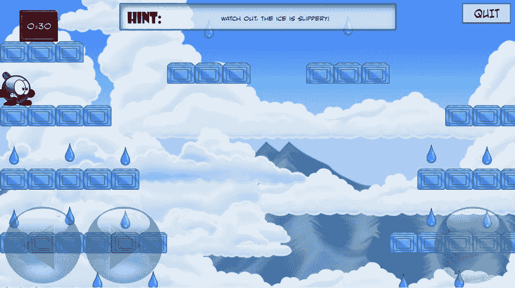

# 27. 完成嘀嗒嘀嗒游戏

电子补充材料 本章的在线版本（doi:[10.​1007/​978-1-4842-0650-8_​27](http://dx.doi.org/10.1007/978-1-4842-0650-8_27)）包含补充材料，可供授权用户使用。

在本章中，你将完成嘀嗒嘀嗒游戏。首先，你将添加一个计时器，让玩家在有限的时间内完成每个关卡。然后，你将在背景中添加一些山脉和云朵，使游戏在视觉上更有趣。最后，你将编写允许玩家推进关卡的代码。

## 添加计时器

我们先来看看如何为游戏添加计时器。你不希望计时器占用太多屏幕空间，因此使用文本形式的计时器。`Timer` 类继承自 `SKNode` 类，它包含一个背景框以及一个显示剩余时间的标签节点。你需要能够暂停计时器（例如，在关卡完成时），因此添加一个名为 `running` 的布尔属性，用于指示计时器是否正在运行。你将剩余时间存储在一个名为 `timeLeft` 的属性中。玩家在每个关卡的可用秒数从文本文件中读取，并存储在一个名为 `totalTime` 的属性中。当调用 `reset` 方法时，计时器将被设置为总时间，并开始倒计时。以下是完整的 `reset` 方法：

```
override func reset() {
    super.reset()
    self.timeLeft = totalTime
    self.running = true
}
```

现在，你唯一需要做的就是实现 `updateDelta` 方法来编写计时器行为。第一步，仅在计时器正在运行且仍有剩余时间时更新它。如果不是这种情况，则从该方法返回：

```
if self.timeLeft < 0 || !self.running {
    return
}
```

然后，从当前剩余时间中减去已流逝的游戏时间：

```
self.timeLeft -= delta
```

接下来，创建你想要在屏幕上显示的文本。你可以简单地在屏幕上显示秒数，但让我们将计时器做得更通用一些，以便也可以定义一个能够处理分钟和秒的计时器。例如，如果你想定义一个从两分钟开始倒数的计时器，可以像这样初始化它：

```
self.timeLeft = 120
```

你希望在屏幕上显示“2:00”而不是“120”。为此，你需要在 `updateDelta` 方法中计算还剩多少分钟。首先，将当前秒数向上取整。这是必要的，因为你想在第 119 秒到第 120 秒之间在屏幕上显示“2:00”。为此，你使用 `ceil` 方法：

```
let roundedTimeLeft = Int(ceil(timeLeft))
```

除了 `ceil` 方法，你还看到了 `floor` 方法，它是向下取整。所以 `ceil(0.1)` 得到 1，`floor(0.1)` 得到 0。分钟和秒数的计算如下：

```
let minutes = roundedTimeLeft / 60
let seconds = roundedTimeLeft % 60
```

现在你已经计算出了剩余的分钟数和秒数，可以创建一个字符串绘制在屏幕上：

```
textLabel.text = "\(minutes):\(seconds)"
if seconds < 10 {
    textLabel.text = "\(minutes):0\(seconds)"
}
```

将文本颜色设置为黄色，以更好地匹配游戏的设计：

```
textLabel.fontColor = UIColor.yellowColor()
```

最后，如果玩家剩余完成关卡的时间不多了，你希望提醒他们。你可以通过在屏幕上打印文本时在红色和黄色之间交替来实现。这可以通过一个 `if` 指令和对取余运算符的巧妙运用来完成：

```
if timeLeft <= 10 && seconds % 2 == 0 {
    textLabel.fontColor = UIColor.redColor()
}
```

虽然用这种方式计算时间对于嘀嗒嘀嗒游戏来说已经足够了，但你可能希望进行更复杂的日期或时间表示。Swift 有 `NSDate` 类来表示时间，你可以将其与 `NSDateFormatter` 类结合使用，该类允许你精确指定如何将日期和/或时间表示为字符串。

### 让计时器变快或变慢

根据玩家行走的地砖类型，时间应该变快或变慢。走在热地砖上会使时间流逝速度加快，而在冰地砖上行走则会减慢。为了实现不同速度的计时器，你在 `Timer` 类中引入了一个乘数值。这个值存储为一个属性，初始设置为 1：

```
var multiplier = 1.0
```

在计时器运行时考虑这个乘数相当简单。你只需在 `updateDelta` 方法中将经过的时间乘以乘数即可完成：

```
self.timeLeft -= delta * multiplier
```

现在你可以改变时间流逝的速度，具体取决于玩家行走的地砖类型。在 `Player` 类中，你已经有 `walkingOnIce` 属性，用于指示玩家是否在冰地砖上行走。为了也能处理热地砖，你定义了另一个名为 `walkingOnHot` 的属性，用于跟踪玩家是否在热地砖上行走。为了确定这个属性的值，你采用与处理 `walkingOnIce` 属性相同的方法。在 `handleCollisions` 方法中，你首先将此属性设置为 `false`：

```
self.walkingOnHot = false
```

然后添加一行代码，根据玩家当前所在的地砖更新该属性的值：

```
self.walkingOnHot = self.walkingOnHot || currentTile.hot
```

完整代码请参见属于 TickTickFinal 示例的 `Player` 类。

利用 `walkingOnIce` 和 `walkingOnHot` 属性，你现在可以更新计时器乘数。你在玩家的 `updateDelta` 方法中执行此操作：

```
let timer = childNodeWithName("//timer") as! Timer
if self.walkingOnHot {
    timer.multiplier = 2.0
} else if self.walkingOnIce {
    timer.multiplier = 0.5
} else {
    timer.multiplier = 1
}
```

从游戏设计角度来看，明确让玩家知道走在热地砖上会缩短完成关卡的剩余时间可能是个好主意。你可以通过短暂显示警告叠加层、在玩家角色周围显示烟雾动画、或者改变计时器的显示颜色来实现。你也可以播放警告声音。另一种可能性是将背景音乐改为更急促的旋律，让玩家意识到情况发生了变化。

### 适应玩家的技能水平

改变计时器的速度可以使关卡变得容易得多或困难得多。你可以扩展游戏，使得在某些情况下，如果玩家捡到特殊道具，计时器会停止或回退几秒。你甚至可以让关卡进度具有自适应性，这样如果玩家死亡次数过多，每个关卡的最大秒数就会增加。但是，这样做要小心。如果你以过于明显的方式帮助玩家，玩家会意识到并据此调整策略（换句话说，玩家会玩得更差以使关卡更容易）。此外，玩家可能会觉得没有被认真对待。处理每个关卡最大时间自适应的更好方法是允许玩家将之前关卡的剩余时间（部分）转移到当前关卡。这样，困难的关卡可以变得更容易，但玩家必须做点什么才能实现这一点。你也可以考虑增加难度级别，其中较难的关卡有更快的计时器，但也有更好的奖励，例如更多分数、额外的可拾取物品或玩家获得额外能力。休闲游戏玩家可以选择“‘老爸，我能玩吗？’”的难度级别，而熟练玩家可以选择极具挑战性的“‘我是死神化身’”级别。


好的，作为高级文档工程师和翻译员，我将严格遵循您的格式和注意事项，将给定的英文文本翻译成中文。


### 当计时器归零

当玩家未能按时完成关卡时，炸弹会爆炸，游戏结束。`Player` 类中的一个布尔属性指示玩家是否已爆炸。接着，你在该类中添加一个名为 `explode` 的方法，用于启动爆炸过程。这是完整的方法：

```
func explode() {
    if !alive || finished {
        return
    }
    alive = false
    exploded = true
    velocity = CGPoint.zeroPoint
    position.y -= 100
    playAnimation("explode")
    playerExplodeSound.play()
}
```

首先，如果游戏角色一开始就未存活，或者玩家已经完成了关卡，那么角色就不会爆炸。在这两种情况下，你只需从该方法返回即可。接着，你将存活状态设为 `false`，并爆炸状态设为 `true`。你将速度设为零（爆炸后不会移动）。然后，播放“explode”动画。此动画存储在纹理图集中，包含 49 帧爆炸画面。最后，播放一个合适的音效。

由于重力也不再影响爆炸后的角色，因此只有在玩家未爆炸时才进行重力物理计算：

```
if !self.exploded {
    self.velocity.y -= CGFloat(1300 * delta)
}
```

在 `LevelState` 类的 `updateDelta` 方法中，你需要检查计时器是否已归零，如果是，则调用 `explode` 方法：

```
let timer = childNodeWithName("//timer") as! Timer
if timer.timeLeft < 0 {
    player.explode()
}
```

### 制作游戏资源

想要游戏画面精美，就需要优质的游戏资源。具有一致性的优质游戏资源会使你的游戏对玩家更具吸引力。这不仅包括视觉效果，还包括音效和背景音乐。通常，音效和音乐的价值被低估，但它们是营造氛围的重要因素。观看一部无声电影，远不如观看一部配有情感烘托音乐和衬托角色动作音效的电影有趣。游戏和电影一样，也需要音乐和音效。

作为入门，你可以购买现成的精灵素材包。以下是一些网站，你可以从中免费获取精灵素材、购买精灵素材，或聘请能为你创建精灵素材的艺术家：

*   [`www.supergameasset.com`](http://www.supergameasset.com/)
*   [`www.graphic-buffet.com`](http://www.graphic-buffet.com/)
*   [`www.hireanillustrator.com`](http://www.hireanillustrator.com/)
*   `opengameart.org`
*   [`www.3dfoin.com`](http://www.3dfoin.com/)
*   [`www.content-pack.com`](http://www.content-pack.com/)

和精灵素材一样，你也可以为你的游戏购买音乐和音效。看看这些网站：

*   [`www.soundrangers.com`](http://www.soundrangers.com/)
*   [`www.indiegamemusic.com`](http://www.indiegamemusic.com/)
*   [`www.stereobot.com`](http://www.stereobot.com/)
*   `audiojungle.net`
*   [`www.arteriamusic.com`](http://www.arteriamusic.com/)
*   `soundcloud.com`

如果你已经使用这些现成素材创建了几款游戏，那么与其他独立开发者建立联系就会容易得多。你开发的游戏将构成一个作品集，展示你作为游戏开发者的能力。

### 添加山脉和云朵

为了使关卡背景更有趣，让我们添加一些山脉和移动的云朵。TickTickFinal 示例中的 `LevelState` 类有一个单独的方法 `addBackgrounds`，用于添加天空背景、山脉和移动的云朵。首先，我们来看看如何添加几座山脉。根据关卡的宽度，计算要添加到背景中的山脉和云朵数量：

```
let nrItems: Int = Int(tileField.layout.width) / 150
```

要添加山脉到背景中，需使用 `for` 指令。在该指令的主体中，你需要创建一个精灵节点，为其指定一个位置，然后将其添加到包含所有背景对象的 `backgrounds` 节点中。

这是完整的 `for` 指令：

```
for _ in 1...nrItems {
    let mountainSpriteName = "spr_mountain_\(arc4random_uniform(2))"
    let mountain = SKSpriteNode(imageNamed: mountainSpriteName)
    mountain.zPosition = Layer.Background1
    mountain.position = CGPoint(x: randomCGFloat() * (tileField.layout.width +
        mountain.size.width) - tileField.layout.width / 2,
        y: -CGFloat(tileField.layout.height)/2 + mountain.size.height/2)
    backgrounds.addChild(mountain)
}
```

第一步是创建精灵节点。你需要从已有的不同山脉精灵中随机选择。由于有两个山脉精灵，你需要创建一个随机数（0 或 1）来在它们之间进行选择。使用这个数字来创建与该精灵对应的文件名。你将精灵置于 `Background1` 层，该层位于天空节点之上，但位于实际场景之后。

然后计算山脉的位置。x 坐标是随机选择的，并使用固定的 y 坐标，以便山脉位于合适的高度（你当然不希望山脉悬挂在空中）。最后，将山脉对象添加到 `backgrounds` 节点。

对于云朵，处理方式会稍微复杂一些。你希望云朵从左向右或从右向左移动，并且如果一朵云从屏幕消失，则希望出现一朵新的云。为此，你向游戏中添加一个 `Cloud` 类，它是 `SKSpriteNode` 的子类。对于要添加到背景中的每朵云，你都创建该类的一个实例。你为其分配的图层值要高于背景本身和山脉的图层值。这确保了云朵绘制在山脉的前面。同样，使用 `for` 循环创建多个云朵实例：

```
for _ in 1...nrItems {
    var cloud = Cloud()
    cloud.zPosition = Layer.Background2
    backgrounds.addChild(cloud)
}
```

`Cloud` 类有一个 `velocity` 属性，因为它需要在屏幕上移动。在初始化器中，你加载一个随机的云朵精灵（示例中提供了五个不同的云朵精灵）。这是完整的初始化器：

```
init() {
    let cloudSpriteName = "spr_cloud_\(arc4random_uniform(5))"
    let texture = SKTexture(imageNamed: cloudSpriteName)
    super.init(texture: texture, color: UIColor.whiteColor(), size: texture.size())
}
```

当关卡重置时，每个 `Cloud` 实例会获得一个随机的位置和速度。负责此功能的是 `Cloud` 类中的 `setRandomPositionAndVelocity` 方法。该方法首先设置一个随机的 y 坐标和一个随机的 x 方向速度（正值或负值）：

```
self.position.y = randomCGFloat() * tileField.layout.height –
    tileField.layout.height / 2
self.velocity.x = (randomCGFloat() * 2 - 1) * 20
```

请注意第二条指令，你计算了一个介于 -1 和 1 之间的随机数，然后将该数乘以 20。这允许你随机创建具有正 x 速度或负 x 速度的云朵。


`setRandomPositionAndVelocity`方法要么将云朵放置在关卡内（即玩家首次开始关卡时所需的效果），要么将其放置在屏幕外，使其能够移入屏幕（即云朵移出关卡时所需的效果）。一个名为`placeAtEdgeOfSceen`的布尔参数允许你选择云朵的放置位置。完整方法见本章所属`TickTickFinal`示例的`Cloud`类。

`Cloud`类还包含一个`updateDelta`方法，你可以在其中检查云朵是否已移出屏幕。如果云朵已移出屏幕，则需通过调用`setRandomPositionAndVelocity`并设置参数`placeAtEdgeOfScreen`为`true`来重置它。云朵既可从左侧也可从右侧移出屏幕。你可以计算云朵完全移出屏幕的最小和最大 x 值：

```
let minx = -tileField.layout.width / 2 - self.size.width / 2
let maxx = tileField.layout.width / 2 + self.size.width / 2
```

现在，你可以使用`if`指令判断云朵是否已移出屏幕，若是，则调用`setRandomPositionAndVelocity`：

```
if position.x < minx || position.x > maxx {
    setRandomPositionAndVelocity(true)
}
```

图 27-1 展示了一个关卡的屏幕截图，其背景包含山脉和移动的云朵。



图 27-1. 一个包含山脉和移动云朵背景的 Tick Tick 关卡

## 显示帮助框架

为了完善每个关卡，你还需要短暂显示一个包含提示信息的框架，并使用漂亮的定制字体使文本更具吸引力。在`LevelState`初始化器中，你需要添加框架和提示文本：

```
helpFrame.position = CGPoint(x: 0, y: GameScreen.instance.top - helpFrame.center.y - 10)
helpFrame.zPosition = Layer.Overlay
self.addChild(helpFrame)

let textLabel = SKLabelNode(fontNamed: "SmackAttackBB")
textLabel.fontColor = UIColor(red: 0, green: 0, blue: 0.4, alpha: 1)
textLabel.fontSize = 16
textLabel.text = help
textLabel.horizontalAlignmentMode = .Center
textLabel.verticalAlignmentMode = .Center
textLabel.zPosition = 1
textLabel.position = CGPoint(x: 45, y: -5)
helpFrame.addChild(textLabel)
```

为了临时显示帮助框架，你定义一个动作，并在调用`LevelState`的`reset`方法时运行它。以下是完整的`reset`方法：

```
override func reset() {
    super.reset()
    levelFinishedOverlay.hidden = true
    helpFrame.runAction(SKAction.sequence([SKAction.unhide(),
        SKAction.waitForDuration(5), SKAction.hide()]))
}
```

## 完成关卡进度

要完成游戏，你还需要处理玩家输掉或赢得关卡的情况。你采用的方式与在 Penguin Pairs 游戏中处理类似：为胜利和失败添加覆盖层，并仅当玩家输掉或赢得游戏时才显示它们。为了判断玩家是否已完成一个关卡，你在`LevelState`类中添加一个`completed`属性，该属性检查两件事：

*   玩家是否已收集所有水滴？
*   玩家是否已到达出口标志？

这两项检查都相当容易。要检查玩家是否已到达终点标志，你可以看他们的包围盒是否相交。检查玩家是否已收集所有水滴，可通过验证所有水滴均不可见来实现。以下是完整属性：

```
var completed: Bool {
    get {
        for w in waterDrops {
            if !w.hidden {
                return false
            }
        }
        let player = childNodeWithName("//player")!
        let exit = childNodeWithName("//exit")!
        return exit.box.intersects(player.box)
    }
}
```

在`LevelState`类的`updateDelta`方法中，你检查关卡是否已完成。如果是，则调用`Player`类中的`levelFinished`方法，播放“庆祝”动画：

```
if self.completed && levelFinishedOverlay.hidden {
    levelFinishedOverlay.hidden = false
    player.levelFinished()
    timer.running = false
}
```

由于玩家已完成，你也停止计时器。同理，你还有一个`gameOver`属性用于判断玩家是否已输掉游戏：

```
var gameOver: Bool {
    get {
        let player = childNodeWithName("//player") as! Player
        let timer = childNodeWithName("//timer") as! Timer
        return !player.alive || timer.timeLeft < 0
    }
}
```

在`updateDelta`方法中，你根据此属性设置 Game Over 覆盖层的可见性：

```
gameoverOverlay.hidden = !self.gameOver
```

处理关卡间转换的代码相当简单，几乎是 Penguin Pairs 游戏中代码的副本。请查看`TickTickFinal`示例中的代码以了解具体实现。

现在你已经了解了如何构建一款包含常见元素的平台游戏，例如收集物品、躲避敌人、游戏物理、关卡切换等。或许你也注意到，Tick Tick 游戏在 iOS 模拟器上运行速度不快（尽管在较新的 iDevices 上应该运行流畅）。这里你可以看到，使用高质量美术资源、众多动画、（物理）对象间交互等，会在计算量上累积成本。另一方面，要使 Tick Tick 成为一款商业上可行的游戏，仍有许多工作要做。你可能希望定义更多内容：更多关卡、更多敌人、更多不同的可拾取物品、更多挑战、更多音效。你可能还想引入一些我未提及的功能：通过网络与其他玩家对战、维护高分榜、在关卡间播放游戏内过场动画，以及其他你认为有趣的可添加内容。将 Tick Tick 游戏作为你自己游戏的起点，但请始终牢记，理想情况下，你的游戏应能在尽可能多的设备上运行，这会对游戏复杂度产生限制。

## 销售你的游戏

既然你正在编写自己的游戏，你可能已经开始思考如何将其推向现实世界。也许你不仅是为了成就感而创作游戏，还想借此赚取一些收入。幸运的是，借助 App Store，发布游戏变得很容易。要发布应用，你需要成为 Apple 开发者，这需要支付年费。之后，挑战在于让你的游戏获得关注。在 iOS 上，每天有超过 300 款新游戏上线。其中大多数只有少数人游玩。那么，如何让你的游戏脱颖而出呢？

首先，你需要制作一款高质量的游戏。如果游戏不好，没人会玩。寻找拥有其他技能的人来帮助你。不要好高骛远：你不可能创造下一款《光环》！设定合理的目标。从制作小型但优秀的游戏开始。不要仅凭自己的判断：与他人讨论你的游戏，让他们试玩原型以确保玩家确实喜欢它。当你的游戏接近完成时，制定营销计划。尽可能多地发布游戏相关信息：制作新闻资料包、创建视频、向博客及其他网站发送信息等。人们只有在听说过你的游戏后才会去玩。不要以为在 App Store 发布后，这一切会自动发生；你需要制定计划。在游戏发布前，建立一个潜在玩家网络——那些对你所做的事情感兴趣的人。为你的公司和/或正在创作的游戏建立一个 Facebook 群组。务必在 Twitter 等社交网络上与关注者沟通。鼓励他人玩你的游戏并撰写相关文章。


## 本章所学内容

在本章中，您学习了以下内容：

*   如何为关卡添加计时器
*   如何创建由山脉和云朵组成的动画背景

**索引**

`A`  
`Actions`  
`addGlitter` 方法  
`addPair` 方法  
`Animal` 类  
`Animations`  
`AnimatedNode`  
`AnimationSample` 项目  
`arc4random( )`  
`Arithmetic operators`  
`Arrays`  
`Assembler language`  
`as?` 运算符  
`Atan2` 函数  

`B`  
`Ball` 类  
`BasicGame` 命令行工具  
`Button` 类  
`Boolean value`  
`Boolean type`  
`Bounding box`  

`C`  
`Call` 方法  
`Cannon` 类  
`Cannon` 初始化器  
`Cannon`, `color`  
`CGRect`  
`CGPoint`  
`changeTypeTo` 方法  
`Character animation`  
`ChildNodeWithName`  
`Classes`  
`Cannon` 扩展  
`collision detection mechanism`  
`Collision`, 平台游戏  
`calculateIntersectionDepth`  
`colors` 数组  
`color` 更新  
`Commercial game`  
`ComponentsSeparatedByString`  
`Computed property`  
`Console application`  
`Contact handling`  
`Contains` 方法  
`convenience`  
`currentBlock` 属性  
`Custom font`  

`D`  
`Declaration and assignment`  
`DefaultManager` 类  
`Default parameter values`  
`Design pattern`  
`Device orientations`  
`Dictionaries`  
`didMoveToView` 方法  
`director`  
`DiscoWorld` 游戏  
`Double`  

`E`  
`Expression`  

`F`  
`Fabs` 函数  
`FileReader` 实例  
`findAnimalAtPosition` 方法  
`firstMoveMade` 属性  
`Fixed timestep` 对比 `variable timestep`  
`Float`  
`For` 指令  
`frame` 属性  
`frame rate`  
`Fun`  
`Functions`  

`G`  
`Game(s)`  
`arcade games`  
`game engine`  
`game objects`  
`input and output devices`  
`large scale`  
`small scale`  
`Game assets`  
`pixel/sprite art`  
`Game engine`  
`Game loop`  
`categories`  
`game state`  
`help` 帧  
`heads-up display (HUD)`  
`layer`  
`update` 方法  
`updateDelta` 方法  
`updates and draws`  
`Game objects`  
`basic class`  
`behavior`  
`hierarchy`  
`PaintCan` 类  
`physics body` 属性  
`properties`, 大炮对象  
`GameScene` 类  
`Game state` 管理  
`GameStateManager`  
`GridLayout` 类  
`handleInput` 方法  
`LevelButton` 类  
`LevelMenuState` 类  
`Penguin pairs`  
`plannedSwitch`  
`TitleMenuState` 类  
`updateDelta` 方法  
`Game states`  
`game design`  
`LevelState` 类  
`overlays`  
`title screen`  
`Game world`  
`Generic type`  
`Getters`  
`GridLayout` 类  
`Grid layout`  

`H`  
`handleCollisions` 方法  
`handleInput` 方法  
`Heads-up display (HUD)`  
`Hierarchies of classes`  
`HUD` (参见 `Heads-up display (HUD)`)  

`I`  
`Icons`  
`If` 指令  
`block execution`  
`Boolean value`  
`comparison operators`  
`logic operators`  
`Images.xcassets`  
`Infinite Repeat`  
`Inheritance`  
`hierarchy of classes`  
`subclass/derived class`  
`ThreeColorGameObject`  
`updateDelta` 方法  
`Initializers`  
`convenience`  
`designated`  
`Input handling`  
`InputHelper` 类  
`instance`  
`Instructions and expressions`  
`Int`  
`Intelligent enemies`  
`behavior`, 敌人  
`LevelState` 类  
`PatrollingEnemy` 类  
`rockets`  
`Sparky` 类  
`Tick` Tick 游戏  
`Turtle` 类  
`waitTime` 属性  
`Interaction`, 游戏对象  
`intersection depth`  
`Iteration`  

`J, K`  
`Jumping character`  

`L`  
`Leaderboards`  
`Level state`  
`LevelState` 类  
`LevelState` 初始化器  
`Level state`, 游戏数据  
`getTileType`  
`SKNode`  
`string array`  
`switch` 方法  
`TileField`  
`Lives`, Painter 游戏  
`Game Over` 叠加层  
`loadAnimation` 方法  
`Local and world coordinates`  
`Looping syntax`  
`arrays`  
`runtime error`  

`M`  
`Menu setup`  
`Methods`  
`initBall`  
`update`  
`Mirroring`  
`Music and sound effects`  

`N`  
`Nested Repeats`  
`NextLine` 方法  
`Nil`  
`Node` 属性  
`Numeric types`  

`O`  
`Object-oriented programming paradigm`  
`One/multiple fingers`  
`On/off button`  
`OnTheGround` 属性  
`Optionals`  
`Optional types`  
`Options`  
`Override`  

`P, Q`  
`PaintCan` 类  
`Painter` 游戏  
`characters and strings`  
`final version`  
`motion effects`  
`scores`  
`special characters`  
`Parameter names and labels`  
`PatrollingEnemy` 类  
`AnimatedNode` 类  
`intelligence`  
`PlayerFollowingEnemy`  
`rocket` 类  
`turnAround` 方法  
`UnpredictableEnemy` 类  
`updateDelta` 方法  
`waitTime` 属性  
`Penguin Pairs` 游戏  
`applyFirstMoveMade` 方法  
`backgroundMusic` 属性  
`control` 方法  
`firstMoveMade` 属性  
`game mechanics`  
`handleInput` 方法  
`LevelState` 类  
`LevelState` 初始化器  
`OptionMenuState` 类  
`reset` 方法  
`SKSpriteNode`  
`updateDelta` 方法  
`user interface`  
`Penguins`, 游戏对象  
`AnimalSelector`  
`Button` 类  
`childNodeWithName` 方法  
`handleInput` 方法  
`SKNode` 类  
`playAnimation` 方法  
`Player` 类  
`Platform games`  
`character’s velocity`  
`game world`  
`handleCollisions`  
`handleInput` 方法  
`LevelState` 类  
`Player` 类  
`Position` 方法  
`TileField` 类  
`Platform tile`  
`Player class`, 动画  
`AnimatedNode` 类  
`handleInput` 方法  
`loadAnimation` 方法  
`updateDelta` 方法  
`Player interaction`  
`collisions with enemies`  
`horizontal and vertical scrolling`  
`ice blocks`  
`water drops`  
`Player’s progress`  
`Polymorphism`  
`Position`, 更新  
`Postfix operator`  
`Prefix operator`  
`Priority of operators`  
`Print( )` 函数  
`Private`  
`Program layout`  
`comments`  
`instructions vs. lines`  
`whitespace and indentation`  
`processors and memory`  
`programming languages`  
`Properties`  
`Protection`, 数据 113  
`Public`  

`R`  
`Randomness`  
`arc4random( )`  
`pseudo-random number generator`  
`speed`  
`uniform distribution`  
`Ratios`  
`readyToShoot` 变量  
`Resolutions`  
`reset` 方法  
`Return` 指令  
`Rocket` 行为  
`AnimatedNode` 类  
`bounding box`  
`level description`  
`reset` 方法  
`spawnTime`  
`updateDelta` 方法  

`S`  
`Scene graph`  
`Scope of variables`  
`Self` 关键字  
`Setters`  
`Shooting`  
`Singleton`  
`SKNode` 类  
`instance`  
`SKPhysicsContactDelegate` 协议  
`SKSpriteNode`  
`Slider button`  
`Slider` 类  
`Sounds and music`  
`SpriteKit` 框架  
`Sprites`  
`loading and drawing`  
`moving`  
`SpriteDrawing` 程序  
`Static property`  
`Static variables`  
`stopMoving` 方法  
`Storage`  
`Stored property`  
`String`  
`Structs`  
`Subclasses`  
`Swift programming language`  
`didMoveToView` 方法  
`printData` 函数  
`Xcode environment`  
`Switch`  
`Switch instructions`  
`Syntax diagrams`  

`T`  
`Text label`  
`Texture atlas`  
`ThreeColorGameObject` 类  
`Tick` Tick 游戏  
`game assets`  
`help frame`  
`level progression`  
`mountains and clouds`  
`timer`  
`addition`  
`faster/slower`  
`reaches zero`  
`Tile` 类  
`TileField` 类  
`Touch`  
`Touch events`, InputHelper 类  
`Touch object`  
`TouchesBegan` 方法  
`TouchesEnded` 方法  
`TouchesMoved` 方法  
`TouchLocation` 属性  
`Touch object`  
`Tut’s Tomb` 游戏  
`access control`  
`addGlitter` 方法  
`glitter` 分数  
`Types`  

`U, V`  
`UIColor` 类型  
`UIColor.redColor( )` 值  
`UITouch`  
`Unwrapping`  
`Update` 方法  
`updateBall` 方法  
`updateDelta` 方法  
`User defaults`  

`W, X, Y`  
`WaterDrop` 类  
`Web-based application`  
`While` 指令  
`Windows application`  
`World positions`  

`Z`  
`zPosition`
