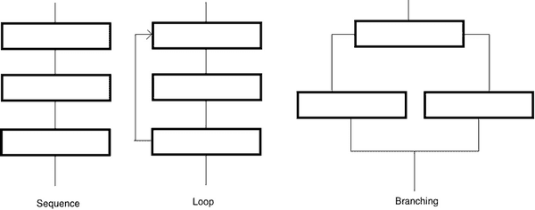
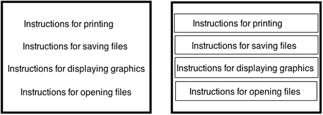
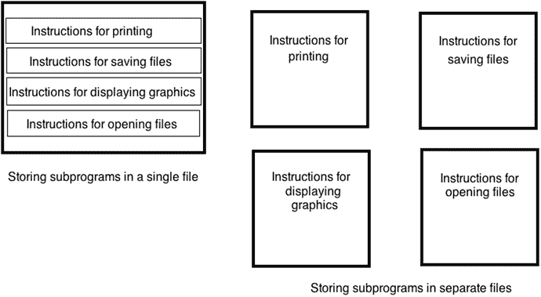
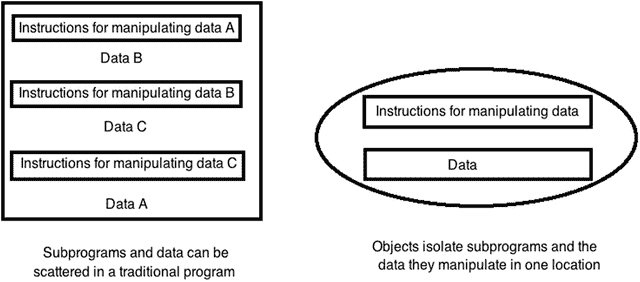
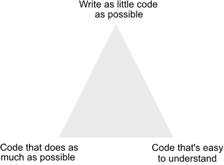
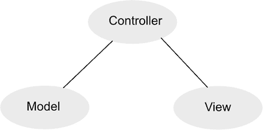

# 1. 理解编程

编程无非就是为计算机编写其需遵循的逐步指令。如果你曾写下烹饪食谱的步骤，或草拟了度假期间照顾宠物的指南，那么你已经完成了编写程序的基本流程。关键在于，明确自己想要实现的目标，然后确保写出正确的指令，告诉他人如何实现该目标。

尽管编程在理论上很简单，但细节之处可能让人犯错。首先，你需要明确自己想要什么。如果你想要一道炒鸡丁的食谱，却照着烤三文鱼的指南操作，显然无济于事。

其次，你需要写出从起点到期望结果的每一步必要指令。如果跳过某个步骤或顺序写错，结果就会不同。试试看，开车去一家餐厅，但你的驾车指南里漏掉了在某个路口转弯的指示。即便 99%的指令都正确，只要有一个错误，就无法到达目的地。

目标越简单，实现起来就越容易。编写一个在屏幕上显示计算器的程序，远比编写一个监控核电站安全系统的程序简单。程序越复杂，需要编写的指令就越多；指令越多，就越容易遗漏、写错指令或搞错顺序。

编程不过是一种控制计算机解决问题的方式，无论这台计算机是笔记本电脑、智能手机、平板电脑还是智能手表。在开始编写自己的程序之前，你首先需要理解编程的基本原理。

**注意**：不要混淆学习编程和学习特定编程语言。实际上，你完全可以在不接触电脑的情况下学习编程原理。一旦理解了编程原理，你就能轻松学习任何特定编程语言，例如 `Swift`。

## 编程原理

要编写程序，你必须写出计算机能遵循的指令。无论程序做什么或有多大，世界上每一个程序都不过是计算机需要依次逐步遵循的指令集。最简单的程序可以只有一行，例如：

`print ("Hello, world!")`

显然，只有一行的程序做不了太多事，因此大多数程序都包含多行指令（或称代码），例如：

`print ("Hello, world!")`
`print ("Now the program is done.")`

这个两行程序从第一行开始，执行第二行的指令后停止。当然，你可以不断向程序添加更多指令，直到拥有百万条计算机能依次执行的指令。

顺序列出指令是编程的基础。不幸的是，这也带来了局限性。例如，如果你想将同一消息打印五次，可以使用以下代码：

`print ("Hello, world!")`
`print ("Hello, world!")`
`print ("Hello, world!")`
`print ("Hello, world!")`
`print ("Hello, world!")`

编写相同的五条指令既繁琐又多余，但确实有效。如果你想将同一消息打印一千次呢？那你必须将同一指令写上一千次。

多次编写相同的指令显得笨拙。为了让编程更简单，目标是以最少的指令完成最多的工作。避免重复编写指令的一种方法，是利用编程的第二个基本原则——**循环**。

循环的思想是重复执行一条或多条指令多次，但只需书写一次。一个典型的循环可能如下所示：

```
for i in 1...5 {
    print ("Hello, world!")
}
```

第一行告诉计算机重复该循环五次。第二行让计算机在屏幕上打印消息“Hello, world”。第三行定义循环的结束。

现在，如果你想让计算机打印消息一千次，无需写一千次相同指令，只需修改循环的重复次数即可，例如：

```
for i in 1...1000 {
    print ("Hello, world!")
}
```

尽管循环在阅读和理解上比顺序指令略复杂，但它能让你无需重复编写相同指令即可轻松实现重复任务。

大多数程序并非仅使用顺序指令或循环，而是两者结合，例如：

```
print ("Hello, world!")
print ("Now the program is starting.")
for i in 1...1000 {
    print ("Hello, world!")
}
```

在此示例中，计算机先顺序执行前两行指令，然后通过循环重复执行最后三行指令。通常，当只需计算机执行一次指令时，顺序列出即可；当需要计算机重复执行指令时，就需要使用循环。

计算机的强大之处不仅在于能顺序执行或循环执行指令，更在于能够做出决策。决策意味着计算机需要评估某些条件，然后根据该条件决定下一步操作。

例如，你可能编写一个程序，在用户输入正确密码前锁定计算机。如果用户输入了正确密码，程序需授予访问权限；但如果用户输入了错误密码，程序则应阻止其访问。这种决策的示例如下：

```
if password == "secret" {
    print ("Access granted!")
} else {
    print ("Login denied!")
}
```


在这个例子中，计算机要求输入一个密码，当用户输入密码后，计算机会检查是否与单词“secret”匹配。如果匹配，则允许该用户访问计算机；如果用户没有输入“secret”，则拒绝访问。

决策正是编程灵活性的体现。如果你编写一系列顺序指令，计算机每次都会以完全相同的方式执行这些指令。然而，如果你加入决策指令（也称为分支指令），计算机就可以根据用户的操作做出响应。

以电子游戏为例。完全由顺序组织的指令编写的游戏是不可能的，因为那样游戏每次运行方式都完全相同。相反，电子游戏需要随时适应玩家的行为。如果玩家将物体向左移动，游戏需要做出与向右移动或角色被击败时不同的反应。使用分支指令赋予了计算机灵活应变的能力，使得程序永远不会以完全相同的方式运行两次。

要编写计算机程序，你需要以下三种方式之一来组织指令，如图 1-1 所示：



图 1-1. 编程的三种基本构建块

- **顺序执行** – 计算机一条接一条地执行指令
- **循环** – 计算机重复执行一条或多条指令
- **分支** – 计算机根据外部数据选择执行一组或多组指令

虽然简单的程序可能只采用顺序结构，但每个大型程序都会结合顺序、循环和分支来组织指令。编程更像是一门艺术而非科学的原因在于，编写程序没有唯一的最佳方法。事实上，完全有可能编写出两个行为完全相同的不同程序。

由于没有唯一的“正确”方法来编写程序，所以只有一些指导原则能帮助你更轻松地编写程序。最终唯一重要的是你编写出一个能正常工作的程序。

在编写任何程序时，通常存在两个常常相互排斥的目标。首先，程序员力求编写易于阅读、理解和修改的程序。这通常意味着编写多条指令来清晰地定义解决特定问题所需的步骤。

其次，程序员试图编写能够高效执行任务、让程序运行尽可能快的程序。这通常意味着尽可能压缩多条指令，使用一些技巧或利用鲜为人知的特性，这些特性往往难以理解，甚至会让大多数其他程序员感到困惑。

刚开始时，应努力让你的程序尽可能清晰、符合逻辑且易于理解，即使为此需要编写更多指令或更长的指令。随着你编程经验的不断丰富，你可以致力于创建最小、最快、最高效的程序，但请记住，你的最终目标是编写出能正常工作的程序。

## 结构化编程

小程序指令较少，因此更容易阅读、理解和修改。不幸的是，小程序只能解决小问题。要解决复杂问题，你需要编写包含更多指令的大型程序。编写的指令越多，犯错（称为“bug”）的几率就越大。更糟糕的是，程序越大，就越难理解其工作原理，也就越难对其进行后续修改。

为了避免编写单个庞大的程序，程序员通常将大型程序分解成较小的部分，称为子程序或函数。其核心理念是每个子程序只解决一个单一任务。这使得编写和确保其正确工作变得容易。

一旦所有独立的函数都能正常工作，你就可以将它们连接在一起，构成一个大型程序，如图 1-2 所示。这就像用砖块盖房子，而不是试图从一块巨石中凿出整个房子。



图 1-2. 将大型程序划分为多个子程序或函数有助于提高编程的可靠性

将大型程序划分为多个小程序有许多好处。首先，编写较小的子程序快速且容易，并且小的子程序使得指令易于阅读、理解和修改。

其次，子程序就像可以协同工作的构建块，因此多个程序员可以并行开发不同的子程序，然后将各自独立的子程序组合起来创建大型程序。

第三，如果你想修改一个大型程序，只需要抽出、重写并替换一个或多个子程序即可。没有子程序的话，修改大型程序意味着要在庞大程序的所有指令中费力搜索，并试图找到需要修改的指令。

子程序的第四个好处是，如果你编写了一个有用的子程序，你可以将其复用到其他程序中。通过创建一个经过测试的有用子程序库，你可以通过重用现有代码快速轻松地创建其他程序，从而减少从头编写一切的需要。

当你将大型程序划分为多个子程序时，你有一个选择：你可以将所有子程序存储在一个文件中，也可以将每个子程序存储在单独的文件中，如图 1-3 所示。通过将子程序存储在单独的文件中，多个程序员可以同时处理不同的文件而互不影响。



图 1-3. 你可以将子程序存储在一个文件或多个文件中

将所有子程序存储在一个文件中，使得查找和修改程序的任何部分都很方便。然而，程序越大，你需要编写的指令就越多，这会使得在单个大文件中搜索变得像翻阅字典一样笨拙。

将所有子程序存储在单独文件中意味着你需要跟踪哪个文件包含哪个子程序。但好处是，修改一个子程序要容易得多，因为一旦你打开了正确的文件，你看到的只是单个子程序的指令，而不是十几个或更多其他子程序的指令。

鉴于当今的程序规模庞大，将其各个子程序分散存储在单独的文件中是常见的做法。


## 事件驱动编程

在计算机早期，大多数程序的运行方式是从第一条指令开始，逐行执行指令直到结束。这类程序严格地控制着计算机在任何给定时刻的行为。

当计算机开始显示带有窗口和下拉菜单的图形用户界面，使用户能够随时选择要执行的操作时，这一切都发生了改变。突然间，每个程序都必须等待用户执行某些操作，例如选择菜单命令或点击按钮。现在，程序必须先等待用户操作，然后再做出响应。

用户每次执行操作，都被视为一个事件。用户单击鼠标左键与用户单击鼠标右键是两个完全不同的事件。程序不再规定用户在任何给定时刻能做什么，而是需要响应用户执行的不同事件。让程序能够响应用户的不同事件，就称为事件驱动编程。

事件驱动编程将一个大型程序划分为多个子程序，每个子程序负责响应一个不同的事件。如果用户点击了一个菜单命令，一个子程序就会运行其指令。如果用户点击了一个按钮，另一个不同的子程序就会运行另一组指令。

事件驱动编程始终在等待响应用户的操作。

### 面向对象编程

将一个大型程序划分为多个子程序使得创建和修改程序变得容易。然而，尝试理解这样一个大型程序是如何工作的，往往令人困惑，因为没有一个简单的方法来确定哪些子程序协同工作，或者它们可能需要从其他子程序获取哪些数据。

更糟糕的是，子程序经常修改其他子程序所使用的数据。这意味着，有时一个子程序会在另一个子程序使用数据之前修改它。使用错误的数据会导致另一个子程序失败，进而导致整个程序崩溃。这种情况不仅会降低软件的可靠性，还会使得确定问题所在以及如何修复问题变得更加困难。

为了解决这个问题，计算机科学家创建了面向对象编程。其目标是将大型程序划分为更小的子程序，但将相关的子程序组织成称为对象的组。为了使面向对象的程序更易于理解，对象还会模拟现实世界中的物理事物。

假设你编写了一个控制机器人的程序。按任务划分这个问题，你可能会创建一个子程序来移动机器人，第二个子程序告诉机器人如何感知附近的障碍物，第三个子程序计算最佳行进路径。如果机器人的移动出现问题，你无法判断问题出在控制移动的子程序、控制机器人感知障碍物的子程序，还是计算最佳路径的子程序。

将同一个机器人程序划分为多个对象，可能会创建一个负责移动机器人的 `Legs` 对象、一个负责感知附近障碍物的 `Eye` 对象，以及一个负责计算避开障碍物最佳路径的 `Brain` 对象。现在，如果机器人移动出现问题，你可以将问题定位到存储在 `Legs` 对象中的代码。

除了在对象内部隔离数据之外，面向对象编程的第二个理念是使大型程序易于重用和修改。假设我们用履带替换机器人的腿。那么，我们就必须修改移动机器人的子程序，因为履带的行为与腿不同。接下来，我们还得修改计算避开障碍物最佳路径的子程序，因为履带迫使机器人绕过障碍物，而腿则允许机器人跨过小障碍物并绕开较大的障碍物。

如果你想用履带替换机器人的腿，面向对象编程可以让你简单地取出 `Legs` 对象，并用一个新的 `Treads` 对象替换它，而不会影响或需要修改构成程序其余部分的任何其他对象。

由于大多数程序都会不断被修改以修复错误或添加新功能，面向对象编程允许你使用独立的构建块（即对象）来构建大型程序，并且通过仅修改单个对象来修改程序。

面向对象编程的关键在于隔离程序的各个部分，并通过封装、继承和多态这三个特性来提升可重用性。

### 封装

封装的主要目的是将一个程序的一部分与另一部分保护并隔离开来。为此，封装会隐藏数据，使其永远不会被程序的另一部分更改。此外，封装还包含了操作存储在对象中数据的所有子程序。如果出现任何问题，封装使得将问题隔离在特定对象内变得容易。

每个对象都应完全独立于程序的任何其他部分。对象将数据存储在属性中。操作这些属性的唯一方法是使用称为方法的子程序，这些方法也封装在同一个对象中。属性和方法的组合隔离在对象内部，使得通过将对象用作构建块（如图 1-4 所示）来快速、可靠地创建大型程序变得容易。



图 1-4. 对象将相关的子程序和数据封装在一起，对程序的其他部分隐藏

### 继承

创建大型、复杂的程序很困难，但更困难的是从零开始编写整个程序。这就是为什么大多数程序员会重用现有程序的代码，原因有二。首先，他们不必从头重写所需的功能。这意味着他们可以更快地创建大型程序。其次，他们可以使用已经过测试并证明能正常运行的代码。这意味着，通过重用可靠的代码，他们可以更快地创建更可靠的软件。

重用代码的一个巨大问题是，你绝不想制作重复的副本。假设你复制了一个子程序并将其粘贴到第二个子程序中。那么，你在同一个程序的两个不同位置存储了两个完全相同的代码副本。这浪费了空间，但更重要的是，它可能会在未来引发问题。

假设你在一个子程序中发现了问题。要修复此问题，你需要在你复制并粘贴了这段代码的每一个地方进行修复。如果你在程序的其他两个地方复制并粘贴了这段代码，你就需要在这两个地方找到并修复它。如果你在程序的一千个地方复制并粘贴了这段代码，你就需要在一千个不同的地方找到并修复这段代码。

这不仅不方便且耗时，还增加了忽略代码并在该代码中遗留问题的风险。这会降低程序的可靠性。

为了避免修复同一代码的多个副本的问题，面向对象编程使用了称为继承的机制。其思想是，一个对象可以使用存储在另一个对象中的所有代码，而无需实际制作该代码的物理副本。相反，一个对象从另一个对象继承代码，但该代码始终只存在一个副本。

现在，你可以根据需要多次重用同一个代码副本。如果你需要修复一个问题，你只需修复该代码一次，这些更改就会自动出现在通过继承重用该代码的任何对象中。

基本上，继承允许你重用代码，而无需物理制作该代码的重复副本。这使得代码易于重用，并且将来也易于修改。


#### 多态性

每个对象都由数据（存储在属性中）和用于操作这些数据的子程序（称为方法）组成。通过继承，一个对象可以使用另一个对象中定义的属性和方法。然而，当某个子程序（方法）需要执行不同的代码时，继承可能会带来问题。

假设你正在开发一款视频游戏。你可能会将汽车定义为一个对象，将怪物定义为另一个对象。如果怪物向汽车投掷石块，那么石块就是第三个对象。为了让汽车、怪物和石块在屏幕上移动，你可以创建一个名为 `Move` 的方法。

但问题是，汽车在屏幕上的移动方式与怪物或投掷的石块不同。你可以创建三个子程序，并分别命名为 `MoveCar`、`MoveMonster` 和 `MoveRock`。然而，一个更简单的解决方案是让这三个子程序共用同一个名称，比如 `Move`。

在传统编程中，你绝不能给两个或更多子程序起相同的名称，因为计算机永远无法知道你实际要运行的是哪一个子程序。但在面向对象编程中，由于多态性的存在，你可以使用重复的子程序名称。

多态性允许你使用相同的方法名称，但用不同的代码来替换它。多态性之所以有效，是因为每个 `Move` 子程序（方法）都存储在不同的对象中，例如一个对象代表汽车，第二个对象代表怪物，第三个对象代表投掷的石块。要运行每个 `Move` 子程序，你需要指定包含你想要使用的 `Move` 子程序的对象，例如：

- `Car.Move`
- `Monster.Move`
- `Rock.Move`

通过同时指定你想要操作的对象和想要使用的子程序，面向对象编程能够正确识别需要运行哪一组指令，即使一个子程序与另一个子程序具有完全相同的名称。

本质上，多态性允许你创建描述性的子程序名称，并且在你同时使用继承时，可以任意多次地重复使用该描述性名称。

封装、继承和多态性的结合构成了面向对象编程的基础。封装将一个程序的某部分与另一部分隔离开来。继承允许你重用代码。多态性则允许你重用方法名称，但使用不同的代码。

## 理解编程语言

一种编程语言不过是一种特定的表达思想的方式，就像西班牙语、阿拉伯语、汉语或英语等人类语言一样。计算机科学家创造编程语言是为了解决特定类型的问题。这意味着，一种编程语言可能非常适合解决某类问题，但在解决另一类不同的问题时却表现糟糕。

最流行的编程语言是 C 语言，它被设计用于对计算机硬件进行低级访问。因此，C 语言非常适合创建操作系统、反病毒程序和硬盘加密程序。任何需要完全控制硬件的任务，都是 C 语言的用武之地。

然而，C 语言可能显得晦涩且精简，因为它旨在为计算机提供最高效率，而不考虑人类阅读、编写或修改 C 程序的效率。为了改进 C 语言，计算机科学家创建了 C 语言的面向对象版本 C++，以及一个略有不同的面向对象版本 Objective-C，这后来成为了苹果公司为 OS X 和 iOS 编程所采用的语言。

由于 C 语言最初的设计是为了计算机的效率而牺牲了人类的效率，因此包括 C++ 和 Objective-C 在内的所有 C 语言变体也可能难以学习、使用和理解。这就是苹果公司创建 Swift 的原因。Swift 的目的在于提供 Objective-C 的强大功能，同时更易于学习、使用和理解。Swift 本质上是 Objective-C 的改进版本，而 Objective-C 又是 C 语言的改进版本。

计算机编程的每一次演进都建立在前一代编程标准的基础之上。当你用 Swift 编写程序时，你可以使用 Swift 的独特特性以及面向对象的特性。此外，在编写 Swift 程序时，你还可以使用事件驱动编程、结构化编程以及编程的三大基本构建块（顺序、循环和分支）。

与所有计算机编程语言一样，Swift 包含一个固定的命令列表，称为关键字。要告诉计算机做什么，你必须使用关键字来创建语句，使计算机执行单个任务。

关键字是任何编程语言的基本构建块。通过组合关键字，你可以创建子程序或函数，从而赋予编程语言更强大的能力。例如，Swift 中的一个关键字是 `var`，它用于定义变量。Swift 中定义的一个函数是 `print`，用于在屏幕上打印数据。

你已经见过用于打印文本的 `print` 函数，例如：

`print("Hello, world!")`

这个 Swift 的 `print` 函数（代表打印行）适用于其括号内的任何数据。就像学习一门人类语言需要首先学习用于书写字母的基本符号（如字母表或其他符号）一样，学习一门编程语言也需要首先学习该特定编程语言的关键字和函数。

尽管 Swift 包含数十个关键字和函数，但你无需一次性全部掌握它们才能用 Swift 编写程序。你最初只需要学习少量关键字和函数。随着经验的增长，你会逐渐需要学习更多 Swift 的关键字和函数。

为了尽可能简化编程，Swift（与许多编程语言一样）使用看起来像普通英语单词的关键字和函数，例如 `print` 或 `var`（variable 的缩写）。然而，许多编程语言（如 Swift）也会使用代表不同特性的符号。

常见的符号是用于加法（`+`）、减法（`-`）、乘法（`*`）和除法（`/`）的数学符号。

Swift 还使用花括号来分组需要一起运行的关联代码，例如：

```
{
    print("这是一条消息")
    print("消息现在结束了")
}
```


与人类语言不同——即使拼错单词或忘记句末加点号，人们仍能理解你的意思——编程语言可没那么宽容。在编程语言中，每个关键字和函数都必须拼写正确，每个符号都必须用在需要的位置。只要拼错一个关键字或函数，用错符号，或者把正确的符号放错位置，整个程序就无法运行。

编程语言是精确的。编程的关键在于编写：

-   尽可能少的代码
-   功能尽可能强大的代码
-   尽可能易于理解的代码

你需要编写尽可能少的代码，因为代码越少，就越容易确保其正确运行。

你需要功能尽可能强大的代码，因为这能让你的程序更有能力解决更大的问题。

你需要易于理解的代码，因为这样便于修复问题和添加功能。

不幸的是，这三个标准往往相互矛盾，如图 1-5 所示。



图 1-5. 编程中三个常常相互矛盾的目标

如果只写尽可能少的代码，通常意味着代码功能有限。这就是为什么程序员常常采用捷径和编程技巧来压缩代码体积，但这同时也增加了代码的复杂度，使其更难理解。

如果编写功能尽可能强大的代码，通常意味着需要编写大量命令，这会使代码更难理解。

如果编写易于理解的代码，通常它的功能不会很强。而为了增加功能编写更多代码，又会让代码更难理解。

归根结底，计算机编程与其说是科学，不如说是一门艺术。通常，最好专注于让代码尽可能容易理解，因为这样更容易修复问题和添加新功能。此外，易于理解的代码也意味着其他程序员可以在你无法处理时修复和修改你的程序。

正因如此，苹果公司创建了 Swift，旨在让代码比 Objective-C 更易理解，同时又不牺牲 Objective-C 的强大功能。尽管比 Objective-C 更强大，但 Swift 代码往往比等效的 Objective-C 代码更短。因此，苹果公司未来的编程语言将是 Swift。

## Cocoa 框架

关键字、函数和符号让你能够向计算机下达指令，但没有任何编程语言能提供创建所有类型程序所需的全部命令。为了提供额外命令，程序员会使用关键字创建执行特定任务的子程序。

当他们创建了有用的子程序时，通常会将其保存在包含其他有用子程序的库中。现在，当你编写程序时，就可以使用编程语言的关键字以及库中存储的任何子程序。通过复用库中的子程序，你可以创建更强大、更可靠的代码。

例如，一个库可能包含用于显示图形的子程序；另一个库可能包含用于将数据保存到磁盘并重新读取的子程序；还有的库可能包含用于计算数学公式的子程序。为了简化 OS X 和 iOS 程序的编写，苹果公司创建了一个有用子程序的库框架，称为 Cocoa 框架。

复用现有框架有两个原因。首先，复用框架可以避免你为完成别人已解决的问题而编写自己的指令。框架不仅提供了现成的解决方案，而且已经经过他人测试，因此你可以放心使用，确信它能正常工作。

使用现有框架的第二个原因是为了保持一致性。苹果公司提供了用于定义程序在屏幕上外观的框架，即用户界面。这定义了程序的行为方式，从在屏幕上显示窗口，到通过鼠标点击来调整窗口大小或关闭窗口。

你完全可以自己编写在屏幕上显示窗口的指令，但这样很可能会花费大量时间进行创建和测试，最终得到的用户界面可能与其他 OS X 或 iOS 程序在外观或行为上不一致。

然而，通过复用现有框架，你可以快速创建自己的程序，并确保程序的行为与其他程序一致。尽管编程听起来很复杂，但苹果提供了数百个预先编写且经过测试的子程序，帮助你快速轻松地创建程序。你只需编写那些让你的程序解决特定、独特问题的自定义指令即可。

要理解苹果的 Cocoa 框架如何工作，你需要理解面向对象编程，这有两个原因。第一，Swift 是一种面向对象编程语言，因此要充分利用 Swift，你需要理解面向对象编程的优势。

第二，苹果的 Cocoa 框架基于面向对象编程。要理解如何使用 Cocoa 框架，你需要使用对象。

注意

Cocoa 框架专为创建 OS X 程序而设计。一个名为 Cocoa Touch 的类似框架则专为创建 iOS 应用而设计。由于 Cocoa Touch 框架（iOS）基于 Cocoa 框架（OS X），它们的工作原理相似，但提供不同的功能。

通过依赖 Cocoa 框架，每当苹果更新和改进 Cocoa 框架时，你的程序就能获得新功能。例如，拼写检查是 Cocoa 框架的内置功能。如果你使用 Cocoa 框架编写程序，你的程序会自动获得拼写检查功能，而无需你编写任何额外代码。当苹果改进 Cocoa 框架中的拼写检查功能时，你的程序会自动获得这些改进，无需你付出额外努力。

Cocoa 框架是一个通用术语，涵盖了苹果所有预先编写并测试的代码库。Cocoa 框架的不同部分可以为你的程序提供音频播放、图形处理、联系人信息（如姓名和地址）存储以及网络连接等功能。

Cocoa 框架为典型的 OS X 程序奠定了基础。你只需编写让你的程序独具特色的 Swift 代码即可。


### 视图-模型-控制器设计

编写大型程序时，将所有代码存放在单个文件中是可行的。但这会大大增加在程序中查找特定内容的难度。更好的解决方案是将大型程序划分为多个部分，并将相关部分存储在不同的文件中。这样你就能快速找到需要修改的程序部分，同时也便于多位程序员协作，因为一位程序员可以处理一个文件，另一位程序员可以处理另一个文件。

将程序划分为多个文件时，最好保持条理清晰。就像你可能把袜子放在一个抽屉里，裤子放在另一个抽屉里，以便轻松找到所需衣物一样，你也应该将程序组织成多个文件，每个文件只包含相关的数据。这样你就能快速轻松地找到需要修改的文件。

文件中存储的数据类型通常可分为如图 1-6 所示的三大类别：



图 1-6.  
将程序划分为模型-视图-控制器设计

* 视图（用户界面）
* 模型
* 控制器

视图或用户界面是用户所看到的内容。每个用户界面的目的都是显示信息、接收数据，并接收来自用户的命令。在过去，程序员通常通过编写代码来创建用户界面。虽然在 Swift 中你仍可以这样做，但这既耗时又容易出错，而且缺乏一致性，因为一位程序员的用户界面在外观和行为上可能与另一位程序员的用户界面不完全相同。

更好的选择是可视化地设计用户界面，这正是 Xcode 让你能够做到的事情。只需在用户界面上绘制按钮、文本字段和菜单等对象，Xcode 便会自动创建一个无错误、外观一致的界面，且只需花费几秒钟即可完成。当你使用 Xcode 创建用户界面时，实际上是在使用苹果的 Cocoa 框架来实现。

用户界面本身看起来不错，但什么也做不了。要让程序实现有用的功能，你需要编写解决特定问题的代码。例如，一个彩票选号程序可能会分析最近选中的号码，并确定下周最有可能被选中的号码。代码中用于计算有用结果的部分称为模型。

模型实际上完全独立于视图（用户界面）。这使得修改用户界面变得容易，而不会影响模型（反之亦然）。通过尽可能将程序的不同部分彼此隔离，你可以减少修改程序时发生错误的几率。

由于模型始终完全独立于视图，因此你需要一个控制器。当用户在界面中选择命令或输入数据时，控制器从视图获取该信息并将其传递给模型。

模型响应这些数据或命令，并计算出新的结果。然后它将计算结果发送给控制器，控制器再将其返回给视图，以便用户查看。在任何时候，视图和模型都是完全分离的。

借助 Xcode，这意味着你将把大部分 Swift 代码编写并存储到定义程序模型的文件中。如果你正在计算中奖彩票号码，用于执行这些计算的 Swift 代码将存储在模型中。

你还需要在控制器文件中编写并存储 Swift 代码。在一个简单的程序中，你可能只有一个视图。在更复杂的程序中，你可能会有多个视图。对于每个视图，你通常需要一个控制器文件来控制该视图。因此，你编写和存储 Swift 代码的第二个位置就是控制器文件。

在简单程序中，通常会将模型与控制器合并到一个文件中。然而，对于更大型、更复杂的程序，更好的做法是为模型创建一个（或多个）文件，并为每个控制器创建一个文件。控制器文件的数量通常等于构成用户界面的视图数量。

一旦你将程序清晰地划分为模型、视图和控制器，你就可以通过用新文件替换旧文件的方式，快速轻松地修改程序。例如，如果你想修改用户界面，只需设计一个不同的视图，将其连接到控制器，就完成了，无需触碰模型文件。

如果你想修改模型以添加新功能，只需更新模型文件并将其连接到控制器，无需触碰视图。

事实上，这正是程序员为 OS X 和 iOS 创建程序的方式。他们的模型保持不变。他们只需为 OS X 编写一个控制器和视图，为 iOS 编写一个控制器和视图。然后，他们就能使用完全相同的模型创建出 OS X 和 iOS 应用程序。


## 程序员如何工作

在过去，单个程序员就能想出创意并编写代码让程序运行起来。如今，程序要复杂得多，用户的期望也高得多，因此你需要在编写任何代码之前先设计好程序。事实上，大多数程序员实际花在编写或修改代码上的时间并不多。相反，程序员的大部分时间都用于思考、规划、组织和设计程序。

当程序员有了一个程序创意时，第一步是判断这个创意是否真的有价值。程序必须解决特定类型的问题。例如，文字处理软件让编写、编辑和格式化文本变得容易；电子表格软件让输入数字并根据这些数字计算新结果变得简单；演示文稿软件让输入文字并插入图形以创建幻灯片变得便捷。即使是电子游戏，也是通过提供具有挑战性的谜题或目标来帮助玩家消遣，从而解决无聊的问题。

**注意**

软件开发最大的失败就是没有定义要解决的具体问题。软件开发第二大失败则是虽然明确了要解决的具体问题，却低估了解该问题所需的步骤的复杂性。你必须知道要解决什么问题，以及如何解决这个问题。如果这两点中的任何一点不清楚，你就无法编写出有用的程序。

一旦你有了一个待解决问题的想法，下一步就是定义如何解决该问题。有些问题实在太难解决。例如，你怎么能编写一个程序来写出一本畅销小说呢？你或许能写一个辅助你写小说的程序，但除非你确切知道如何可预测地创作出一本畅销小说，否则你根本写不出这样的程序。

了解要解决的问题就是你的目标。一旦你清楚理解了问题，接下来就需要确定解决该问题所需的所有步骤。如果你不知道如何解决某个特定问题，你也就无法告诉计算机如何去解决它。

在定义了解决一个问题的步骤之后，现在你终于可以编写程序了。通常你会分部分编写程序，并在继续之前测试每个部分。这样，你就能逐步扩展程序的功能，同时确保每个部分都能正确运行。

在使用 `Xcode` 时，你将经历的主要步骤是：

-   编写代码并设计用户界面
-   编辑代码和用户界面
-   运行并测试程序

当你的程序最终完成时，猜猜怎么着？它永远没有真正完成的时候。总会有需要修复的错误，以及你想要添加的新功能。实际上，程序员花在编辑和修改现有程序上的时间，远比花在创建新程序上的时间要多。

在编写和编辑代码时，你会使用编辑器，它类似于一个文字处理软件，让你能够输入和编辑文本。在设计和修改用户界面时，你会用到 `Xcode` 中一个名为 `Interface Builder` 的功能，它类似于一个绘图程序，让你可以在屏幕上拖拽、放置和调整对象的大小。在运行和测试程序时，你会使用编译器，它负责将你的 Swift 代码转换（或称编译）成一个实际可运行的 OS X 程序。

要创建一个 OS X 程序，你只需要一份 `Xcode`，这是 Apple 的免费编程工具，你可以从 Mac App Store 下载。只要在 Macintosh 上安装了 `Xcode`，通过学习 `Xcode` 和 Swift，你完全可以免费创建自己的程序。

## 总结

要学习如何为 Macintosh 编写程序，你需要掌握几项不同的技能。首先，你需要理解编程的基本原理，这包括将指令组织成顺序、循环或分支结构；理解结构化编程技术、事件驱动编程和面向对象编程。

其次，你需要学习一门特定的编程语言。对于 Macintosh 而言，你将学习 Swift。这意味着你要学习 Swift 中使用的关键字和函数，同时还要学习如何在不同的文件中编写和组织你的 Swift 代码。

第三，你需要知道如何使用 `Xcode`，这是 Apple 用于创建 OS X 和 iOS 应用的编程工具。`Xcode` 让你能编写和编辑 Swift 代码，同时也能让你以可视化的方式设计和修改用户界面。

第四，你需要学习如何使用 Apple 的 Cocoa 框架，这样你就可以专注于编写那些能让你的程序实现独特功能的指令。

无论你是想编写自己的软件来销售，还是想出售自己的编程技能为他人创建定制软件，你都会发现编程是一项任何人都能学会的技能。

记住，编程无非就是解决问题。通过了解如何使用 Swift 和 `Xcode` 解决问题，你可以比你想象的更容易、更快速地为自己创建 Macintosh 程序。


