# 2. 认识 Xcode

要在 Macintosh 上使用 Swift 编写程序，你需要用到 Xcode。Apple 开发了 Xcode 这一专业编程工具，并免费提供，以鼓励大家为 OS X 和 iOS 编写软件。尽管是免费程序，Xcode 却是包括微软、Adobe、谷歌，甚至 Apple 在内的各大公司都在使用的强大工具。在你的 Macintosh 上装上 Xcode，你就拥有了为创建 OS X 程序和 iOS 应用而准备的最强大的编程工具之一。

虽然 Xcode 包含数十个专为专业程序员设计的功能，但任何人都可以学会使用它。Xcode 繁多的功能乍看之下可能令人困惑且望而生畏，但请放轻松。要使用 Xcode，你不需要学习所有可能的功能。相反，你只需学习你需要的那一小部分功能，其他的都可以忽略。随着经验的增长，你可以逐步学习 Xcode 的其他功能。很多时候，某些 Xcode 功能你可能根本永远不会用到。

Xcode 让你可以从头到尾创建一个 OS X 程序或 iOS 应用，而无需其他任何程序。在 Xcode 内部，你可以执行以下操作：

- 创建新项目
- 编写和编辑 Swift 代码
- 设计和修改用户界面
- 管理组成单个项目的文件
- 运行和测试你的项目
- 调试你的 Swift 代码

你可以通过 Mac App Store 免费下载和安装 Xcode。在你的 Macintosh 上，只需点击 Apple 菜单并选择“App Store”。当 App Store 窗口出现后，点击右上角的搜索文本字段，输入 `Xcode`，然后按回车键。现在你可以点击 Xcode 图标下方的按钮进行下载，如图 2-1 所示。由于 Xcode 是一个相当大的文件，你需要快速的互联网连接和足够的空间来将其安装到你的 Macintosh 上。

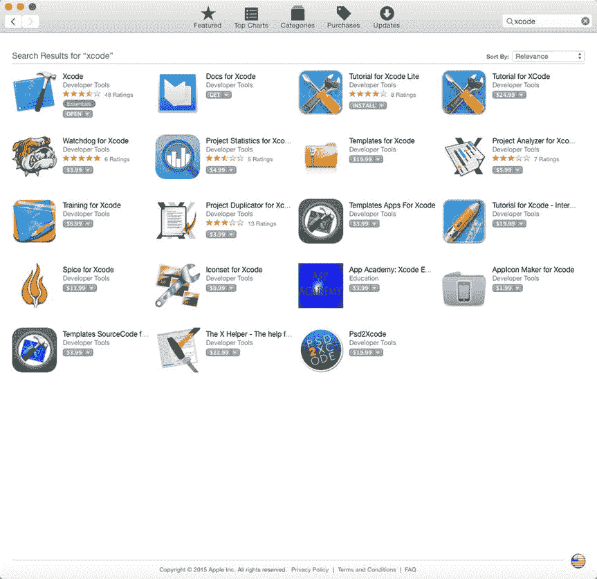

**图 2-1.** 当你搜索 Xcode 时，它通常出现在 App Store 窗口的左上角

你将经常使用的 Xcode 四个最常见部分为：

- 项目管理器
- 编辑器
- Interface Builder
- 编译器

一个项目代表一个单一的 OS X 或 iOS 程序。在过去程序简单的年代，你可以将代码存储在一个文件中。如今程序变得更大更复杂，将代码存储在不同的文件中更为常见。协同工作的文件集合构成一个项目，因此 Xcode 的项目管理器允许你创建、重新排列和删除项目内的文件。

每个项目都会包含的最常见文件类型之一是代码文件，通过 `.swift` 文件扩展名标识。代码文件是你可以存储、编辑和输入 Swift 代码的地方。通过使用 Xcode 的编辑器，你可以打开代码文件，复制粘贴代码，删除代码，并编写新代码保存到该文件中。编辑器基本上就像一个为帮助你用 Swift 编程语言编写代码而设计的简单文字处理器。

除了包含 Swift 代码的代码文件外，每个项目还会包含一个存储在不同文件中的用户界面，这些文件通过 `.xib` 或 `.storyboard` 文件扩展名标识。简单的程序可能只有一个包含其用户界面的文件，但更复杂的程序可能有多个文件包含用户界面的不同部分。Xcode 中让你设计、创建和修改用户界面的功能称为 Interface Builder。

在编写好 Swift 代码并设计好用户界面后，你需要将项目中的所有文件转换成一个实际可工作的程序。将 Swift 代码翻译成计算机能理解的语言（称为机器代码）的过程被称为编译，因此 Xcode 中执行此操作的部分被称为编译器。

你通常会以不同的顺序使用 Xcode 的这四个主要部分。例如，你可以先创建一个项目，并使用项目管理器功能修改其文件。然后你可能使用编辑器编写 Swift 代码，并使用 Interface Builder 设计用户界面。最后，你将使用编译器测试你的程序。如果出现问题，你很可能需要无数次地回到编辑器或 Interface Builder，直到你的程序正常工作。你甚至可能在项目管理器中创建新文件并重新排列它们。

最终，使用 Xcode 并没有唯一的“最佳”或“正确”方式。Xcode 在你需要时提供相应功能供你使用。

## 向 Xcode 下达命令

与许多程序一样，Xcode 提供多种方式来完成完全相同的任务。例如，要打开一个项目，你可以选择“文件”➤“打开”，或按下 `Command+O`。通常，Xcode 提供三种方式来执行常见的命令类型：

- 使用屏幕顶部菜单栏中的下拉菜单
- 按下独特的按键组合，如 `Command+O`
- 点击代表某个命令的图标

下拉菜单可以方便地帮助你找到特定命令，但使用起来可能较慢且笨拙，因为你必须点击菜单标题以下拉菜单，然后必须点击该菜单上出现的命令。

按键组合更快更简便，但它们迫使你记住常用命令的晦涩按键组合。为了帮助你了解哪些命令有按键组合，可以查看每个下拉菜单，你会看到按键组合显示在不同命令的右侧，如图 2-2 所示。（注意：并非所有命令都有按键组合。）

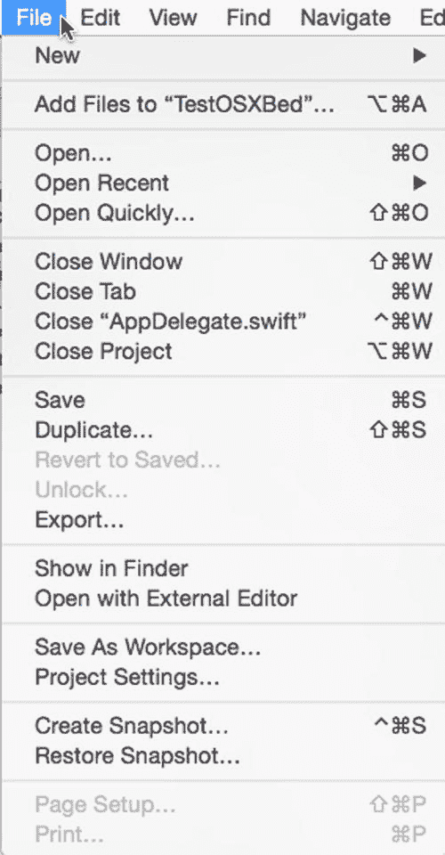

**图 2-2.** 按键组合显示在下拉菜单中命令的右侧

按键组合通常包括一个修饰键加上一个字母或功能键。四个修饰键包括 Command、Control、Option 和 Shift，如图 2-3 所示。

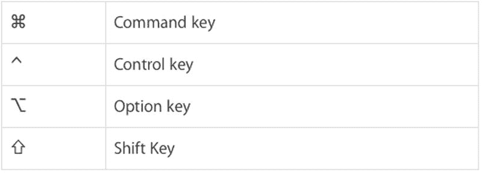

**图 2-3.** 用于表示常见修饰键的符号

点击图标选择命令可能是最快的方法，但你必须知道每个图标代表什么命令。为了帮助你理解图标的用途，只需将鼠标指针移到图标上并等待几秒钟。一个小窗口就会出现，简要描述该图标的用途，如图 2-4 所示。

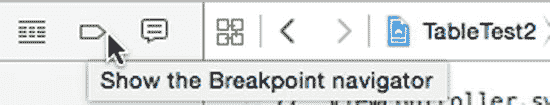

**图 2-4.** 将鼠标指针悬停在图标上会显示该图标功能的简要描述

有些人只使用下拉菜单，另一些人更依赖图标和按键快捷方式，还有一些人混合使用这三种方法。通常人们从下拉菜单开始，但当你开始频繁使用相同命令时，会逐渐转向图标和按键快捷方式。

选择你喜欢的任何方法，但要注意你几乎总是有其他替代方案。重点是让你使用自己偏好的方法来舒适地使用 Xcode，这样你就能花更多时间进行创作，而花更少时间寻找你需要的命令。

## 修改 Xcode 窗口

由于 Xcode 提供了众多功能，Xcode 窗口有时会显得杂乱。为了简化 Xcode 的外观，你有以下几种选择：

-   调整 Xcode 窗口的大小，使其更大（或更小）
-   关闭面板以隐藏 Xcode 的某些部分
-   打开面板以查看 Xcode 的某些部分

与所有 Macintosh 窗口一样，调整 Xcode 窗口大小最直接的方式是将鼠标指针移到 Xcode 窗口的边缘或角落，直到鼠标指针变成双向箭头。然后拖动鼠标即可调整窗口大小。

调整 Xcode 窗口大小的第二种方法是点击 Xcode 窗口左上角的绿色圆点。这会展开 Xcode 窗口以占据全屏，同时隐藏 Xcode 的菜单栏。要退出全屏模式，只需按下键盘上的 `Esc` 键。

调整 Xcode 窗口大小的第三种方法是选择 `Window ➤ Zoom`。这会在以下两种状态间切换：将 Xcode 窗口展开至填充屏幕但仍显示 Xcode 菜单栏，或者将 Xcode 窗口缩小回之前的大小。

为了减少在任意时刻显示的信息量，Xcode 提供了三个可以隐藏（或打开）的面板，如图 2-5 所示：

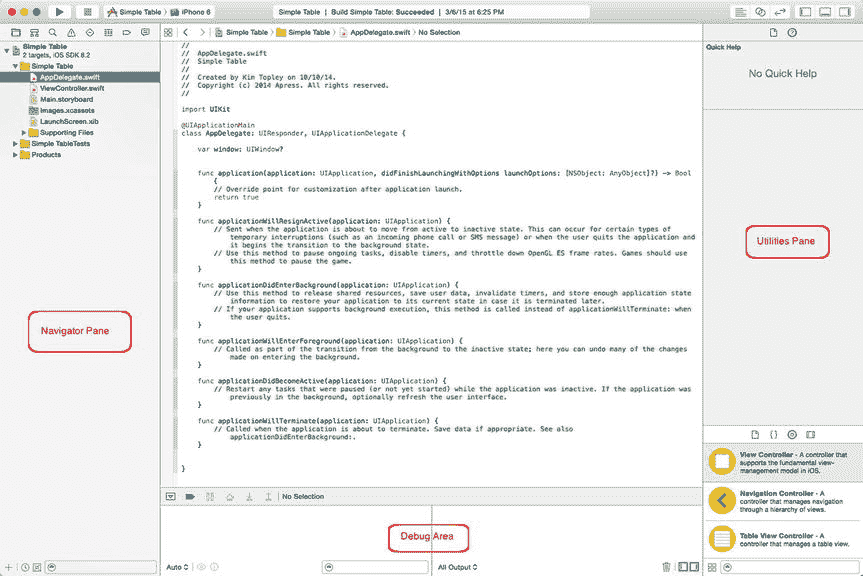

图 2-5. Xcode 的导航面板、调试区域和实用工具面板

-   **导航面板**：显示有关项目的信息
-   **调试区域**：允许你搜索程序中的错误或缺陷
-   **实用工具面板**：允许你在用户界面上自定义不同的项目

导航面板会显示多个图标，让你可以在查看不同类型的信息之间切换。导航面板最常见的用途是通过显示项目导航器来选择要打开的文件。要在隐藏和显示导航面板之间切换，你有三种选择：

-   选择 `View ➤ Navigators ➤ Show/Hide Navigator`
-   按下 `Command+0`（数字零）
-   点击 Xcode 窗口右上角的“显示/隐藏导航面板”图标，如图 2-6 所示

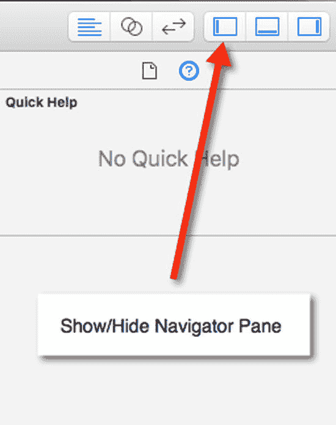

图 2-6. “显示/隐藏导航面板”图标

当你想要检查程序是否运行正常时，会用到调试区域。在你设计用户界面或编写 Swift 代码时，可能需要隐藏这个调试区域。要在隐藏和显示调试区域之间切换，你有三种选择：

-   选择 `View ➤ Debug Area ➤ Show/Hide Debug Area`
-   按下 `Shift+Command+Y`
-   点击 Xcode 窗口右上角的“显示/隐藏调试区域”图标，如图 2-7 所示

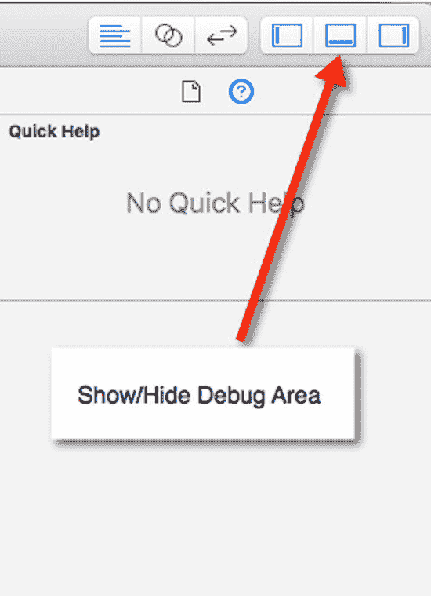

图 2-7. “显示/隐藏调试区域”图标

实用工具面板会显示多个图标，让你可以在显示不同类型的信息之间切换。实用工具面板最常见的用途是帮助你设计和修改用户界面。要在隐藏和显示实用工具面板之间切换，你有三种选择：

-   选择 `View ➤ Utilities ➤ Show/Hide Utilities`
-   按下 `Option+Command+0`（数字零）
-   点击 Xcode 窗口右上角的“显示/隐藏实用工具”图标，如图 2-8 所示

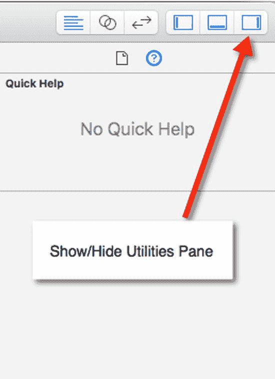

图 2-8. “显示/隐藏实用工具”图标

通过有选择地显示或隐藏导航面板、调试区域或实用工具面板，你可以让 Xcode 窗口看起来不那么杂乱，并为你想看到的 Xcode 部分腾出更多空间。要快速打开或隐藏这三个面板，通常最快的方法是点击 Xcode 窗口右上角的“显示/隐藏导航”、“调试区域”或“实用工具”图标。

## 创建与管理文件

每当需要创建项目（代表全新的程序）或文件（添加到现有项目）时，你有三种选择：

*   按下 `Command+N`
*   选择“文件”➜“新建”以显示如图 2-9 所示的子菜单

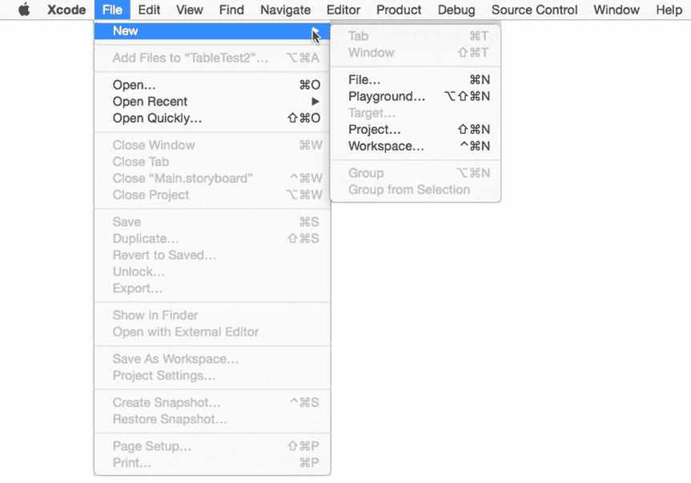

图 2-9. “文件”➜“新建”命令会显示一个子菜单，允许你选择创建文件或项目

*   右键点击导航器面板中的任意文件，显示如图 2-10 所示的弹出菜单

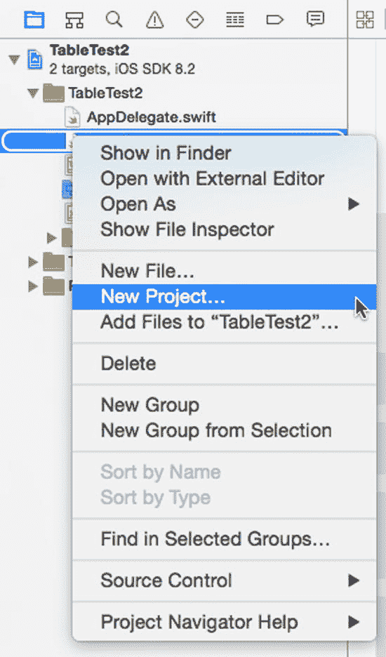

图 2-10. 在导航器面板中右键点击文件会显示一个弹出菜单，允许你选择创建文件或项目

> **注意**  
> 在某些 Macintosh 电脑上右键点击可能被禁用。你可以按住 `Control` 键的同时点击来模拟右键点击。若要启用右键点击，点击苹果菜单，选择“系统偏好设置”，然后点击“鼠标”或“触控板”图标。接着选中“辅助点击”复选框以开启右键点击功能。

创建新文件时，你可以选择为 OS X 项目还是 iOS 项目创建文件。就本书而言，你始终为 OS X 创建文件。

除了选择为 OS X 创建文件，你还需要选择要创建的文件类型。最常见的两种文件类型是：存放 Swift 代码的文件（归类在“源”类别下，如图 2-11 所示），或存放用户界面的文件（归类在“用户界面”类别下，如图 2-12 所示）。

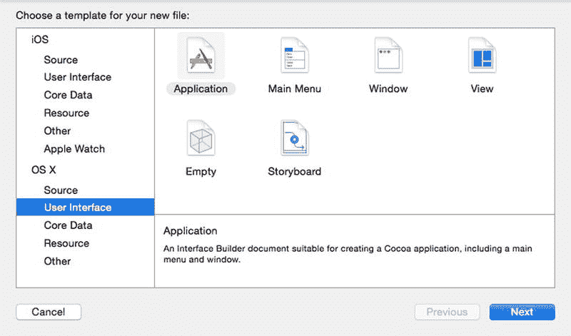

图 2-12. 你可以创建的第二种文件类型用于存放程序用户界面的部分

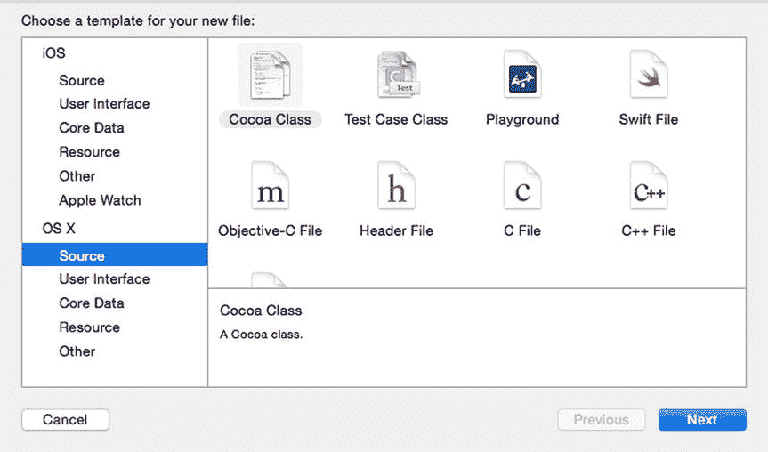

图 2-11. 你可以创建的一种文件类型用于存放 Swift 代码

创建文件后，该文件会出现在项目导航器中。导航器面板实际上可以显示多种不同类型的信息，但最常见的是项目导航器，它列出了构成项目的所有文件。要在导航器面板中打开项目导航器，你有三种选择：

*   选择“视图”➜“导航器”➜“显示项目导航器”
*   按下 `Command+1`
*   点击“显示项目导航器”图标，如图 2-13 所示

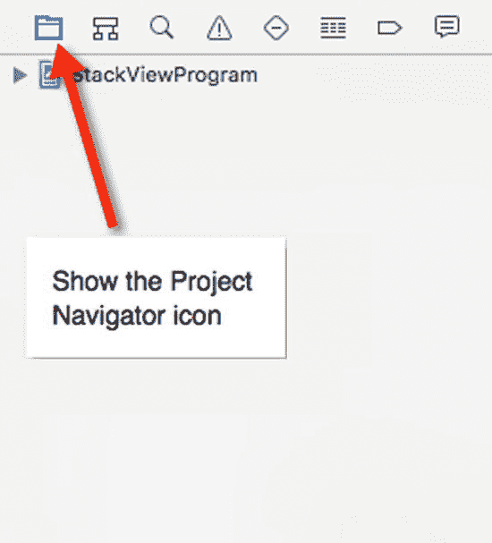

图 2-13. 项目导航器面板列出了构成项目的所有文件

项目导航器与 Finder 非常相似，可以显示文件和文件夹。要重命名文件或文件夹，只需选中它并按下 `Return` 键即可编辑其名称。

要移动文件或文件夹，只需用鼠标将其拖拽到新位置即可。

要选择多个项目，请按住 `Command` 键并点击文件或文件夹。

与 Finder 一样，项目导航器允许你将文件整理到文件夹中。这样你可以将相关文件分组存放，并将其收起来，避免项目导航器显得杂乱。要创建文件夹，请点击项目导航器中的一个文件或文件夹，然后选择以下任一方式：

*   选择“文件”➜“新建”➜“组”（或“从选中项新建组”以将选中的一个或多个文件存入文件夹）
*   按下 `Option+Command+N`
*   右键点击项目导航器中的任意文件或文件夹，在弹出的菜单中选择“新建组”（或“从选中项新建组”以将选中的一个或多个文件存入文件夹）

要删除文件或文件夹，请选中它，然后选择以下任一方式：

*   选择“编辑”➜“删除”
*   按下 `Delete` 键或 `Command+Backspace`
*   右键点击项目导航器中的任意文件或文件夹，在弹出的菜单中选择“删除”

> **注意**  
> 删除文件或文件夹时，你可以选择“移除引用”（将文件/文件夹从项目中移除，但不会从 Macintosh 上物理删除）或“移到废纸篓”（将文件/文件夹从项目中移除，并从 Macintosh 上物理删除）。

项目导航器最重要的用途或许就是让你能够编辑项目中的文件。当你点击项目导航器中的某个文件时，Xcode 窗口的中间面板会显示所选文件的内容，这些内容要么是 Swift 代码，要么是用户界面，如图 2-14 所示。

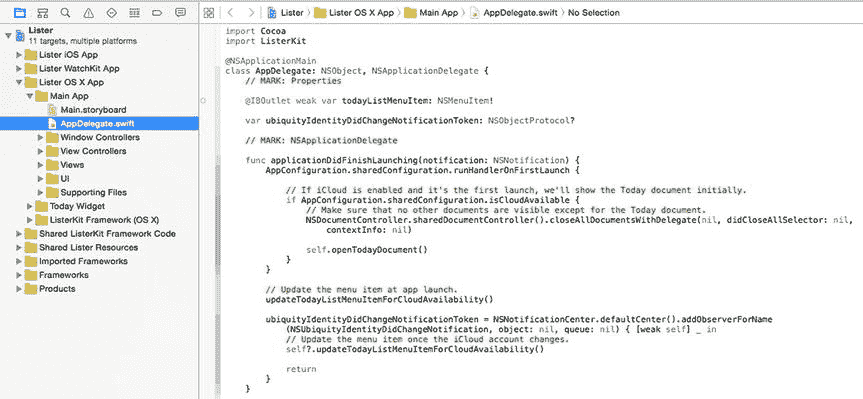

图 2-14. 在导航器面板中选择一个文件会显示该文件的内容

## 创建和自定义用户界面

`Utilities`面板最常用于创建和自定义项目的用户界面。在 OS X 程序中，用户界面文件可以是以下两种类型之一：

- `.xib`文件
- `.storyboard`文件

创建项目时，你可以选择要使用的类型。通常，`.xib`文件用于单窗口用户界面，而`.storyboard`文件则用于需要按特定顺序链接显示的多个窗口。你也可以混合使用`.xib`和`.storyboard`文件来创建用户界面，或者仅使用`.xib`或`.storyboard`文件。

无论你使用`.xib`文件还是`.storyboard`文件，都需要借助`Utilities`面板实现两个目的。首先，你需要将按钮、文本字段和图片等元素拖放到用户界面上。其次，你需要通过更改这些用户界面元素的名称、颜色或大小来自定义它们。

要设计用户界面，你需从`对象库`开始，该库位于`Utilities`面板底部，如图 2-15 所示。要打开`对象库`，可以执行以下操作：

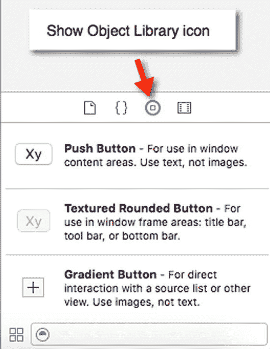

图 2-15. 对象库包含不同的用户界面元素

- 选择 视图 ➤ 实用工具 ➤ 显示对象库
- 按 Control+Option+Command+3
- 点击显示对象库图标

要在`对象库`中查找某个用户界面元素，只需上下滚动列表即可。但如果你知道所需元素的名称，更快捷的方式是点击`对象库`窗口底部的`搜索`字段，输入全部或部分元素名称，然后按`Return`键。`对象库`将仅显示与你输入内容匹配的元素。例如，如果你输入"Button"，则`对象库`只会显示可以添加到用户界面的各种按钮。

在用户界面上放置一个或多个元素后，第二步是使用`检查器`面板自定义这些元素。`检查器`面板可以显示多种类型的窗格，但自定义用户界面元素最常用的是以下两种：

- 属性检查器
- 大小检查器

`属性检查器`允许你修改元素的外观。`大小检查器`允许你修改元素在用户界面上的大小和位置。

要打开`属性检查器`，可以执行以下任一操作：

- 选择 视图 ➤ 实用工具 ➤ 显示属性检查器
- 按 Option+Command+4
- 点击显示属性检查器，如图 2-16 所示

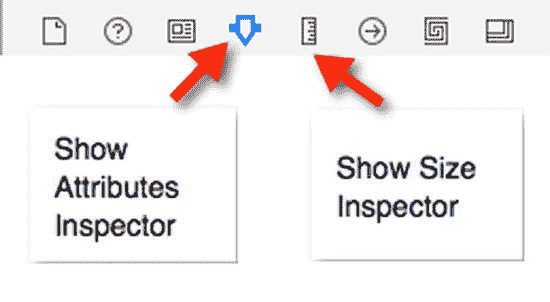

图 2-16. 显示属性检查器和显示大小检查器图标。

要打开`大小检查器`，可以执行以下任一操作：

- 选择 视图 ➤ 实用工具 ➤ 显示大小检查器
- 按 Option+Command+5
- 点击显示大小检查器，如图 2-16 所示

打开`属性检查器`或`大小检查器`后，你可以点击一个用户界面元素（如按钮或文本字段）进行修改，然后输入或选择不同的选项来更改该元素的外观。

## 标准编辑器和辅助编辑器

你大部分时间将使用编辑器或 Interface Builder。编辑器类似于文字处理器，允许你输入和编辑 Swift 代码。Interface Builder 类似于绘图程序，允许你拖放、调整大小和移动用户界面上的元素，如按钮、文本字段和图形。

要编辑 Swift 代码，只需在`项目导航器`面板中点击任何扩展名为`.swift`的文件。当你点击一个`.swift`文件时，该文件的内容会显示在 Xcode 的中间窗格中，如图 2-17 所示。

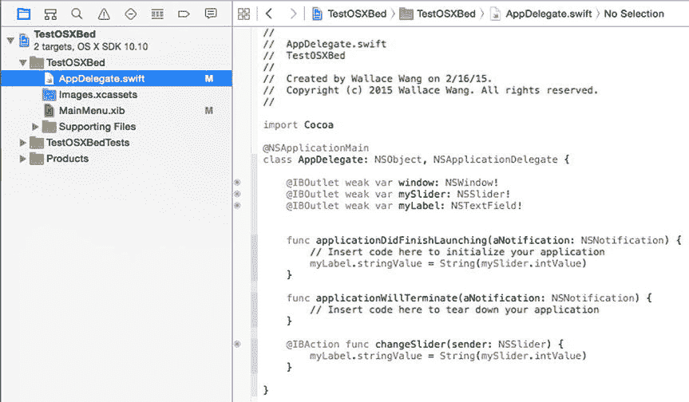

图 2-17. 点击`.swift`文件会显示该文件中存储的 Swift 代码

要编辑你的用户界面，只需在`项目导航器`面板中点击任何扩展名为`.xib`或`.storyboard`的文件。这会将该用户界面的内容显示在 Xcode 的中间窗格中，如图 2-18 所示。

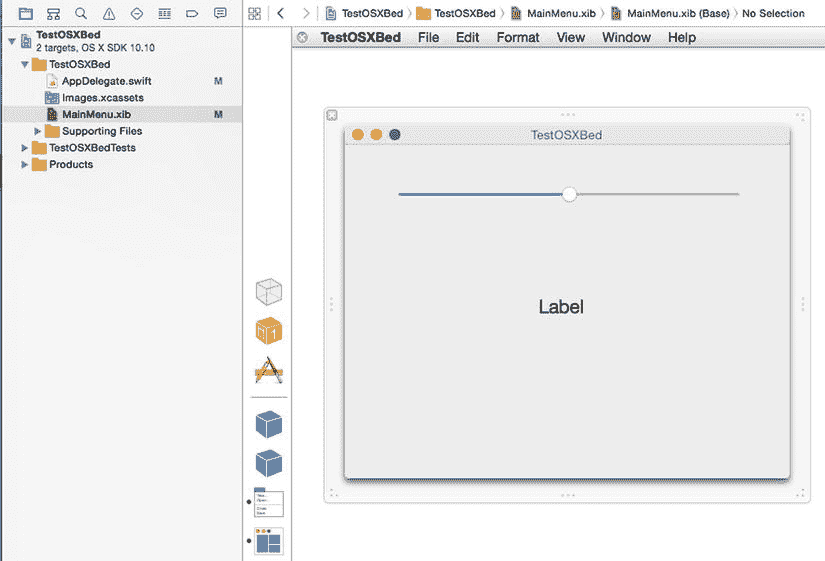

图 2-18. 点击`.xib`或`.storyboard`文件会显示该文件中存储的用户界面

每次你在`项目导航器`面板中点击不同的文件，Xcode 都会在窗口的中间窗格中显示该新文件的内容。

当 Xcode 在中间窗格中显示单个文件的内容时，这被称为`标准编辑器`。然而，并排查看两个文件的内容通常也很有用。当 Xcode 并排显示两个文件内容时，第二个文件窗格被称为`辅助编辑器`。

打开`辅助编辑器`最常见的原因是，如图 2-19 所示，左侧窗格显示用户界面，右侧窗格显示 Swift 文件。这样做的目的是让你能够将用户界面与 Swift 代码连接起来。

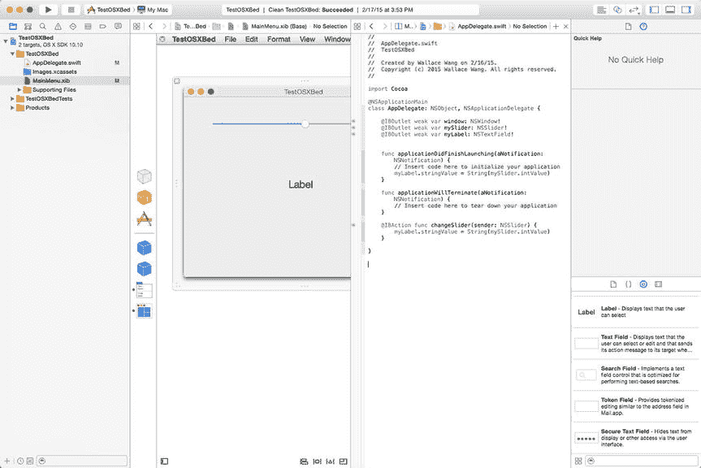

图 2-19. 辅助编辑器并排显示两个文件的内容

当你创建用户界面时，它完全独立于你的 Swift 代码（反之亦然）。这让你可以自由地用新用户界面替换旧用户界面，而不会影响 Swift 代码的行为。同样，这也允许你修改 Swift 代码而无需担心影响到用户界面。

在过去，程序员必须使用代码创建用户界面，这意味着修改代码往往会影响到用户界面，增加了程序出错或出现 bug 的风险。通过将用户界面与代码分离，Xcode 消除了这个问题，并帮助你创建更可靠的软件。

最初创建用户界面时，它什么也做不了。这就是为什么你需要将一些用户界面元素连接到使用户界面真正工作的 Swift 代码上。例如，如果用户界面显示一个按钮，点击该按钮不会发生任何事情。你必须编写 Swift 代码来告诉该按钮该做什么。然后你必须将按钮连接到你的 Swift 代码。

这就是`辅助编辑器`的用途。通过将用户界面显示在 Swift 代码文件旁边，`辅助编辑器`让你可以轻松地从用户界面拖拽鼠标到 Swift 代码文件中，并在用户界面和 Swift 代码之间建立连接。

要打开`辅助编辑器`，可以选择以下任一方式：

- 选择 视图 ➤ 辅助编辑器 ➤ 显示辅助编辑器
- 按 Option+Command+Return
- 点击辅助编辑器图标，如图 2-20 所示

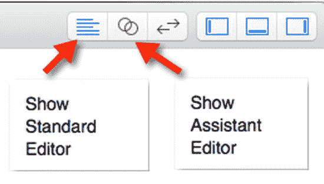

图 2-20. 标准编辑器和辅助编辑器图标

要关闭`辅助编辑器`，需要通过以下方式之一打开`标准编辑器`：

*   选择 View ➤ Standard Editor ➤ Show Standard Editor
*   按下 `Command+Return`
*   点击 **Standard Editor** 图标，如图 2-20 所示

使用 **Assistant Editor** 的一个问题是 Xcode 会在窄面板中显示两个文件的内容。如果你更希望在更宽的视图中查看两个或多个文件，可以将它们显示在单独的标签页中。这样你可以在 Xcode 的中间面板中看到每个文件的内容，并简单地点击标签页来查看不同文件的内容。

标签页的缺点是你一次只能看到一个文件的内容。第二个缺点是你无法在 Swift 代码旁边看到用户界面，因此无法将用户界面元素连接到你的 Swift 代码。

要创建标签页，请选择以下任一方式：

*   选择 File ➤ New ➤ Tab
*   按下 `Command+T`

现在你可以点击每个标签页来查看该文件的内容。要关闭标签页，将鼠标移到标签页上，然后选择以下任一方式：

*   点击标签页左侧的关闭图标（看起来像一个大的 X）
*   右键点击标签页，在弹出的菜单中点击 `Close Tab`，如图 2-21 所示

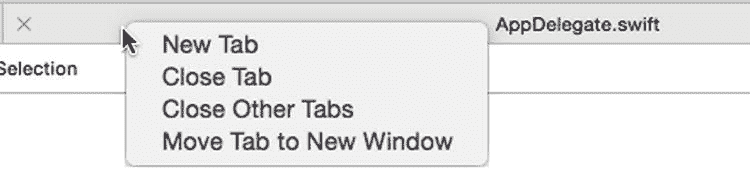
图 2-21.
右键点击标签页会显示一个弹出菜单

## 运行程序

通常你会多次运行程序来测试并确保其工作正常。当你运行程序时，Xcode 会将其编译成一个文件，如果你愿意，可以将其分发给其他人。运行程序可以让你直接在 Mac 上测试程序。

运行程序的三种方式是：

*   选择 Product ➤ Run
*   按下 `Command+R`
*   点击 **Run** 图标，如图 2-22 所示

    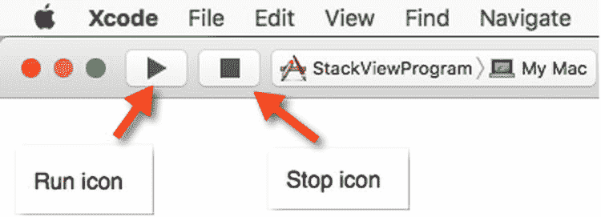
    图 2-22.
    **Run** 和 **Stop** 图标让你测试 OS X 项目

程序运行后，你可以通过几种方式停止它：

*   选择 `YourProgramName` ➤ Quit，其中 `YourProgramName` 是你的项目名称
*   点击 Dock 上代表你的程序的图标，然后按下 `Command+Q`
*   点击 Xcode 中的 **Stop** 图标，如图 2-22 所示

如果你的程序有严重错误，导致无法响应任何命令，你也可以使用 `Force Quit` 命令来关闭程序。要使用 `Force Quit`，点击 Apple 菜单并选择 `Force Quit`。

当 `Force Quit` 窗口出现时，点击你的程序名称，然后点击 `Force Quit` 按钮将其关闭。

### 小结

本章介绍了 Xcode 的主要功能，并展示了选择常用命令的各种方式。目前不必担心要记住或完全理解本章的所有内容。将本章视为 Xcode 的入门介绍，无论何时遇到问题都可以回头参考。

在下一章中，我们将实际经历使用 Xcode 创建 OS X 程序的典型过程。这样你就能理解本章中学到的 Xcode 各种功能的目的。

请记住，对于 Xcode，通常有两种或更多方式可以选择完全相同的命令，但你无需学习所有这些不同的方法。你只需选择最喜欢的方法，忽略其他方法即可。

如你所见，Xcode 提供了将你的想法转变为功能完备的 OS X 程序所需的一切，你可以将该程序出售或分发给他人。通过学习 Xcode，你将学会使用专业程序员用来创建 OS X 和 iOS 软件的编程工具。你使用 Xcode 越多，就会越得心应手，Xcode 的用户界面也不会再让你感到畏惧。很快，你就能像专业人士一样使用 Xcode。

记住，编程的真正关键不在于拥有最好的编程工具，而在于知道如何使用它们。你使用 Xcode 越多，就越能理解如何将你的绝妙想法变成实际可运行的程序。学习 Xcode 是为 Macintosh 以及 Apple 的许多其他设备（如 iPhone、iPad 和 Apple Watch）编写软件的必经之路。今天学习 Xcode，你就能利用现在和未来众多有丰厚回报的编程机会。欢迎来到 Xcode 的世界！

