# 3. 创建 Mac 程序的基础

电子补充材料：本章的在线版本（doi:[10.​1007/​978-1-4842-1233-2_​3](http://dx.doi.org/10.1007/978-1-4842-1233-2_3)）包含补充材料，可供授权用户使用。

无论你想创建什么类型的 OS X 程序，比如视频游戏、为律师或股票经纪人定制的程序，你都将遵循相同的基本步骤。首先，你需要创建一个 OS X 项目。这会创建一个基本的 OS X 程序，包含一个通用的用户界面。

其次，你需要以两种方式定制这个通用的 OS X 程序：向用户界面添加元素，以及编写 Swift 代码使程序实际执行某些操作。

第三，你需要运行并测试你的程序。在运行和测试程序之后，你很可能需要不断返回修改用户界面或 Swift 代码，以修复问题并添加新功能。最终，你的程序会达到一个（暂时）完成的状态，你可以发布它。然后你需要再次重复这些基本步骤来添加更多新功能。

通常，你花在修改程序上的时间会比创建新程序的时间多。然而，创建小程序来测试不同功能是很有用的。一旦这些较小的实验性程序可以工作了，你就可以将它们添加到另一个程序中。通过这样做，你不会有破坏一个正在运行的程序的风险。


## 创建项目

创建程序的第一步就是新建一个项目。创建项目时，`Xcode` 会提供多种模板供你选择，这些模板提供了基础功能。你只需要自定义模板即可。OS X 模板的四大类别如图 3-1 所示：

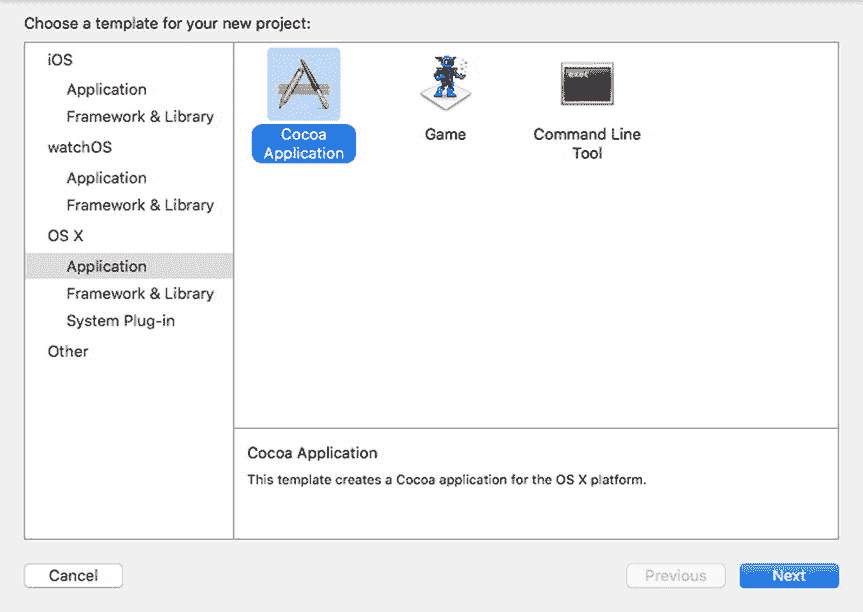

图 3-1.
用于创建项目的 OS X 模板四大类别

- 应用程序（Application）
- 框架与库（Framework & Library）
- 系统插件（System Plug-in）
- 其他（Other）

大多数情况下，你会选择“应用程序”类别中的模板，其中最常用的是 `Cocoa Application`，它能创建一个带有下拉菜单和窗口的标准 OS X 程序。

另外两个应用程序模板是 `Game`（用于创建视频游戏）和 `Command Line Tool`（用于创建不需要传统图形用户界面的程序）。

“框架与库”类别用于创建可复用的软件库。“系统插件”类别用于为其他类型的程序创建插件。“其他”类别则用于创建不属于其他类别的程序。

在本书中，我们将始终使用 OS X 应用程序类别下的 `Cocoa Application`。其他 OS X 类别是为高级程序员设计的，本书将不予涉及。

当你创建 `Cocoa Application` 项目时，需要定义几个项目，如图 3-2 所示：

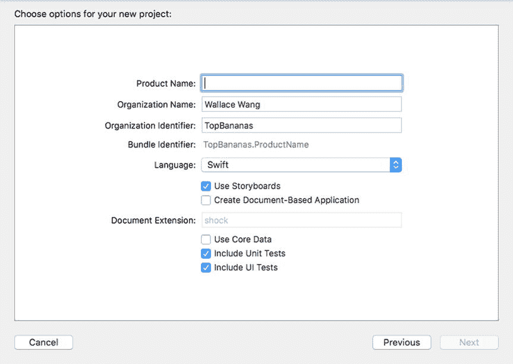

图 3-2.
定义 `Cocoa Application` 项目

- 产品名称
- 要使用的编程语言（`Objective-C` 或 `Swift`）
- 是否在用户界面中使用 storyboard
- 是否创建基于文档的应用程序
- 是否使用 `Core Data`

产品名称完全由你决定，但最好具有描述性，因为 `Xcode` 会使用你选择的名称创建一个文件夹来存储所有文件。

组织名称和组织标识符也是任意的，通常来自你的 Apple Developer 账户。如果你愿意，这两项也可以设为任意字符串，但如果你计划通过 Mac App Store 分发程序，则应将它们与你的 Apple Developer 账户关联起来。

“语言”弹出菜单让你选择 `Objective-C` 或 `Swift`。在本书中，你应始终选择 `Swift`。`Objective-C` 是 Apple 仍在支持的更复杂的编程语言，但已不再被视为 Apple 的官方编程语言。

“使用 Storyboard”复选框可以让你创建用户界面，该界面可以包含单个窗口（一个 `.xib` 文件），也可以是一系列链接在一起的窗口（一个 `.storyboard` 文件）。我们将介绍创建用户界面的两种方法，但除非另有说明，否则请取消勾选“使用 Storyboard”复选框。这是因为 storyboard 使用起来更复杂。

“创建基于文档的应用程序”意味着 `Xcode` 会创建一个 `Cocoa Application`，它可以打开和管理多个窗口，例如文字处理器中的多个窗口。管理多个窗口较为复杂，所以暂时请取消勾选“创建基于文档的应用程序”复选框。

“使用 Core Data”复选框用于存储数据，通常用于数据库应用程序，如保存姓名和地址列表。请将此复选框留空，因为它适用于更高级的 OS X 程序。

准备好创建你的第一个 OS X 程序了吗？请按照以下步骤操作：

启动 `Xcode`。如果出现如图 3-3 所示的 `Welcome to Xcode` 屏幕，请点击 `Create a new Xcode project`。如果未出现此欢迎屏幕，请选择 `File > New > Project` 或选择 `Window > Welcome to Xcode` 来显示此屏幕，以便你能选择 `Create a new Xcode project`。`Xcode` 会显示项目模板列表（参见图 3-1）。

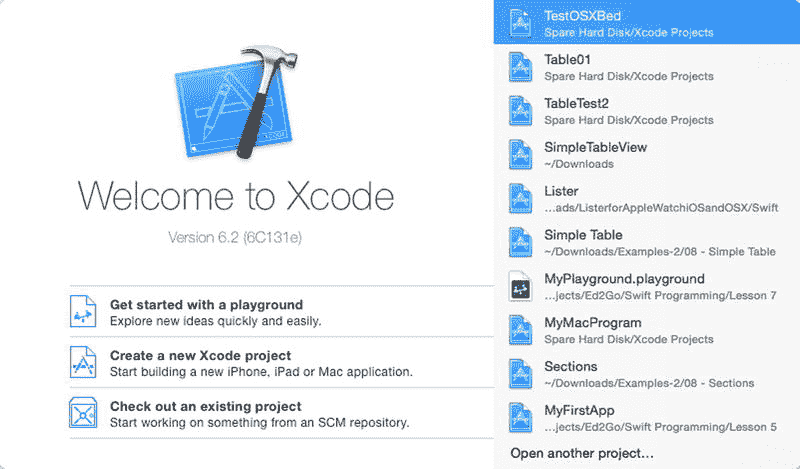

图 3-3.
`Welcome to Xcode` 启动屏幕

点击 `OS X` 类别下的 `Application`。会显示一系列不同的 OS X 应用程序模板。  
点击 `Cocoa Application`，然后点击 `Next` 按钮。`Xcode` 现在会询问你的项目名称（见图 3-2）。  
点击 `Product Name` 文本字段，输入 `MyFirstProgram`。  
点击 `Language` 弹出菜单，确保显示的是 `Swift`。  
确保所有复选框都未勾选，然后点击 `Next` 按钮。`Xcode` 现在会询问你想将项目存储在哪里。  
点击一个你想存储 `Xcode` 项目的文件夹，然后点击 `Create` 按钮。恭喜你！你已经成功创建了第一个 OS X 程序。至此，`Xcode` 刚刚创建了一个通用的 Macintosh 程序，而你甚至不需要编写一行 `Swift` 代码或设计用户界面来创建一个可实际运行的程序。  
选择 `Product > Run`，按下 `Command+R`，或点击 `Run` 图标。`Xcode` 会运行你名为 `MyFirstProgram` 的程序，如图 3-4 所示。请注意，`MyFirstProgram` 显示了一个带有下拉菜单的菜单栏和一个可在屏幕上移动或调整大小的窗口。因为你使用了 `Cocoa Application` 模板，`Xcode` 自动创建了创建通用 Macintosh 程序所需的所有代码。

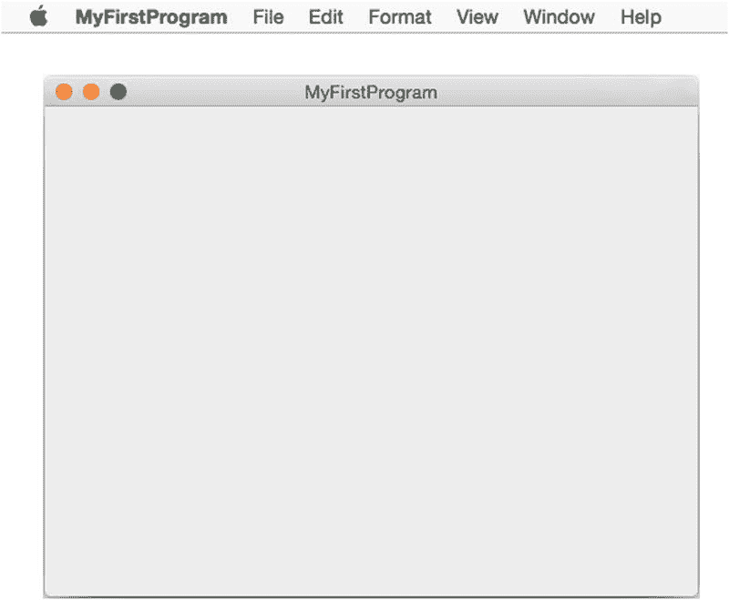

图 3-4.
`MyFirstProgram` 正在运行

选择 `MyFirstProgram > Quit MyFirstProgram`。`Xcode` 会重新出现。请保持 `MyFirstProgram` 在 `Xcode` 中打开，以供下一节使用。

你无需任何操作就成功创建了一个外观和行为都像典型 Macintosh 程序的程序。当然，这个极简的 Macintosh 程序在你自定义用户界面并编写 `Swift` 代码使其执行有用操作之前，不会做任何有趣的事情。


## 设计用户界面

在设计用户界面时，请牢记任何用户界面的三个目的：

- 向用户显示信息
- 从用户处获取数据
- 让用户向程序发出命令

在设计用户界面时，每个元素都必须满足这些标准之一。颜色和线条可能看起来只是装饰性的，但它们对于组织用户界面非常有用，使用户知道在哪里查找信息、如何输入数据，或者如何向程序发出命令。

要在`Xcode`中创建用户界面，你需要遵循一个两步流程：

- 使用对象库将项目拖放到你的用户界面上
- 使用检查器面板自定义每个用户界面项目

要了解如何使用对象库，我们向`MyFirstProgram`用户界面添加一个标签、一个文本字段和一个按钮。标签将向用户显示文本；文本字段将让用户输入数据；按钮将使程序从文本字段获取文本，通过将每个字符大写来修改它，并将修改后的大写文本放入标签中。

为此，请按照以下步骤操作：

确保你的`MyFirstProgram`项目已加载到`Xcode`中。选择**视图** > **导航器** > **显示项目导航器**，或按`Command+1`查看组成`MyFirstProgram`项目的所有文件列表。点击`MainMenu.xib`文件。`Xcode`会显示用户界面。请注意，只有当你点击`MyFirstProgram`图标时，`MyFirstProgram`的实际窗口才会可见。点击出现在项目导航器和用户界面之间窗格中的`MyFirstProgram`图标。这将显示`MyFirstProgram`用户界面的窗口，如图 3-5 所示。

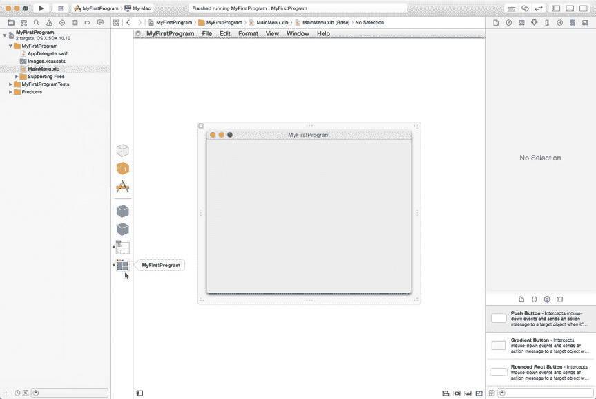

图 3-5. `MyFirstProgram`图标显示`MyFirstProgram`用户界面

选择**视图** > **实用工具** > **显示对象库**。对象库出现在`Xcode`窗口的右下角。从对象库中拖拽一个下压按钮，并将其放置在`MyFirstProgram`窗口的底部附近。请注意，当你将按钮放置在窗口中部靠近底部的位置时，会出现蓝色辅助线，帮助你对齐用户界面项目，如图 3-6 所示。

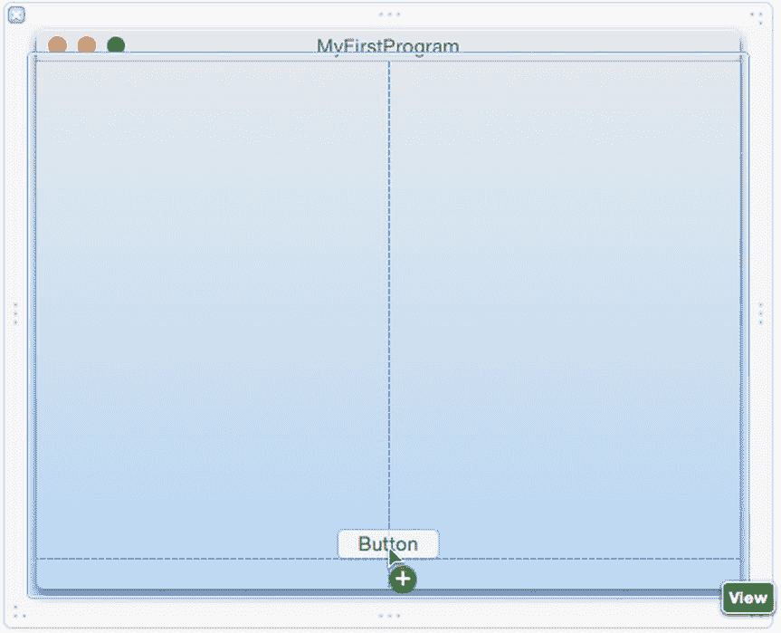

图 3-6. 使用蓝色辅助线将下压按钮放置在`MyFirstProgram`窗口底部附近

点击对象库中的搜索字段，然后输入`label`。请注意，对象库现在只显示标签用户界面项目，如图 3-7 所示。

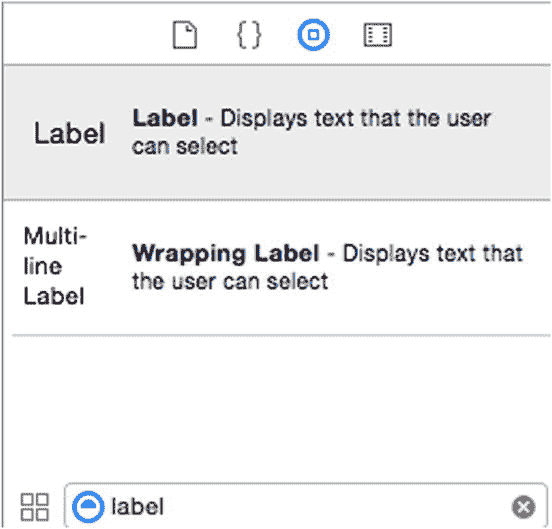

图 3-7. 在搜索字段中键入内容有助于你轻松找到对象库中的项目

将标签从对象库拖放到`MyFirstProgram`窗口的中央。点击对象库底部搜索字段右侧出现的清除图标（灰色圆圈中的 X）。对象库现在显示所有可能的用户界面项目。滚动对象库，直到找到文本字段项目。将文本字段拖放到标签上方，这样你的整个用户界面就如图 3-8 所示。（不用担心每个用户界面项目的精确位置。）

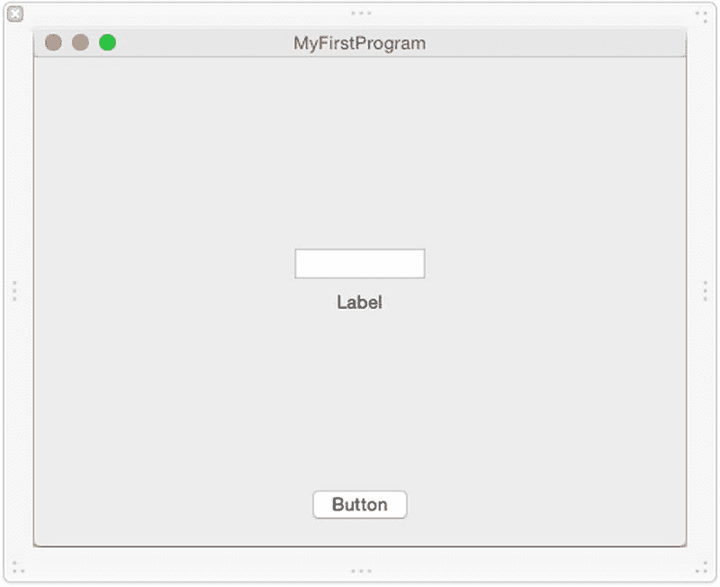

图 3-8. `MyFirstProgram`用户界面上的一个标签、文本字段和按钮

至此，你已经自定义了通用的用户界面。现在你需要使用检查器面板自定义每个用户界面项目。通过检查器面板，你可以为用户界面项目选择不同的选项，例如输入按钮的精确宽度或为文本字段选择背景颜色。

在调整用户界面项目的大小或移动它时，你可以将精确值输入到大小检查器面板中，也可以直接拖拽鼠标来调整大小或移动项目。两种方法都可以接受，但大小检查器面板能让你对项目进行精确控制。让我们看看如何使用检查器面板来自定义我们的通用用户界面。

点击`MyFirstProgram`窗口底部附近的下压按钮以将其选中。选择**视图** > **实用工具** > **显示属性检查器**。属性检查器面板出现在`Xcode`窗口的右上角，如图 3-9 所示。

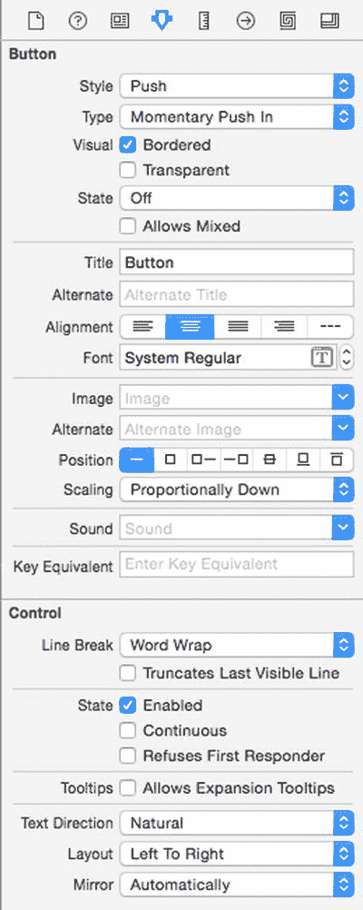

图 3-9. 属性检查器面板让你能够自定义项目的外观

点击当前显示“Button”的标题文本字段。删除标题文本字段中的所有现有文本，输入`Change Case`，然后按`Return`键。下压按钮上的文本现在显示“Change Case”。但是，按钮宽度太窄了。选择**视图** > **实用工具** > **显示大小检查器**。大小检查器面板出现在`Xcode`窗口的右上角。点击宽度文本字段，将值更改为`120`，如图 3-10 所示，然后按`Return`键。`Xcode`会更改下压按钮的宽度。

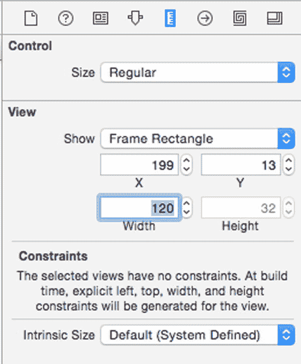

图 3-10. 宽度文本字段出现在大小检查器面板中

点击标签以将其选中。要修改标签的大小，我们需要打开大小检查器面板，可以通过选择**视图** > **实用工具** > **显示大小检查器**来实现，但有一种更快的方法，即使用键盘快捷键或图标。按`Option+Command+5`或直接点击大小检查器图标（看起来像一把垂直的尺子）。大小检查器面板出现在`Xcode`窗口的右上角。点击宽度文本字段，输入`250`，然后按`Return`键。`Xcode`会加宽标签的宽度。

点击文本字段以将其选中。按`Option+Command+5`或直接点击大小检查器图标（看起来像一把垂直的尺子）。大小检查器面板出现在`Xcode`窗口的右上角。点击宽度文本字段，输入`250`，然后按`Return`键。`Xcode`会加宽文本字段的宽度。此时，所有用户界面项目看起来都偏离了中心。拖拽每个项目，直到看到蓝色辅助线显示你已将其居中在`MyFirstProgram`窗口中，如图 3-11 所示。

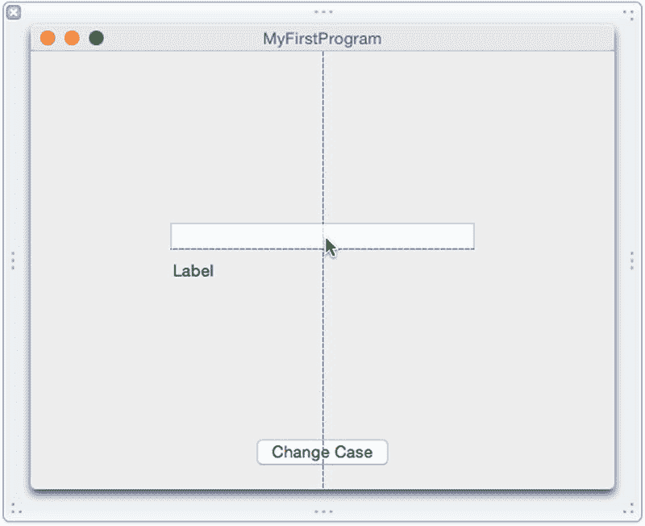

图 3-11. 使用蓝色辅助线将项目居中于用户界面

至此，你已经自定义了用户界面的外观。如果你运行这个程序，用户界面看起来会不错，但它实际上不会执行任何操作。要使一个用户界面工作，你还需要完成两个步骤：

- 编写 Swift 代码
- 将你的用户界面连接到你的 Swift 代码

你需要编写 Swift 代码让你的程序计算出一些有用的结果。你还需要将你的用户界面连接到你的 Swift 代码，这样你可以从用户界面检索数据并将信息显示回用户界面上。

在这个例子中，我们将编写 Swift 代码，当用户点击`Change Case`下压按钮时，代码从文本字段检索文本，将其更改为大写，然后将大写文本显示回标签上。

因此，我们需要编写将文本转换为大写的 Swift 代码。然后我们需要连接文本字段和标签，以便 Swift 代码可以从文本字段检索数据并将新数据放入标签。

为了向用户界面项目发送或检索数据以便 Swift 代码可以访问它，我们需要使用一种叫做`IBOutlet`的东西。一个`IBOutlet`本质上是将一个用户界面项目（例如标签或文本字段）表示为一个 Swift 代码可以使用的变量。


## 创建 IBOutlet 并使用 Assistant Editor

要创建 `IBOutlet`，请使用 Assistant Editor。Assistant Editor 可以在一个窗格中显示用户界面，在相邻的窗格中显示您的 Swift 代码。然后，您可以使用鼠标将用户界面项拖拽到 Swift 代码中，从而创建将标签或文本字段连接到 `IBOutlet` 的 `IBOutlet`。让我们看看具体如何操作：

确保已选中 `MainMenu.xib` 文件，以便在屏幕上显示 MyFirstProgram 用户界面窗口。（如果没有，请在 Project Navigator 中点击 `MainMenu.xib` 文件，然后点击 MyFirstProgram 图标以显示用户界面窗口。）选择 **View ➤ Assistant Editor ➤ Show Assistant Editor**。Assistant Editor 会在 `AppDelegate.swift` 文件中显示 Swift 代码，与 `MainMenu.xib` 文件中的用户界面并排显示，如图 3-12 所示。

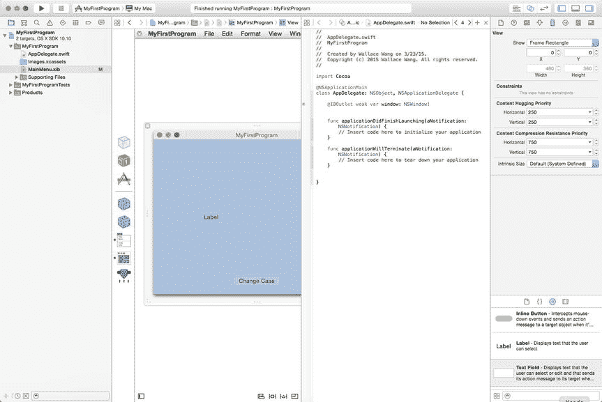

**Figure 3-12.** Assistant Editor 让您并排查看用户界面和 Swift 代码文件

点击 MyFirstProgram 窗口上的标签。按住 Control 键，将鼠标从标签拖拽到 `AppDelegate.swift` 文件中 `@IBOutlet` 行的下方，直到 Swift 代码文件中出现一条水平线，如图 3-13 所示。

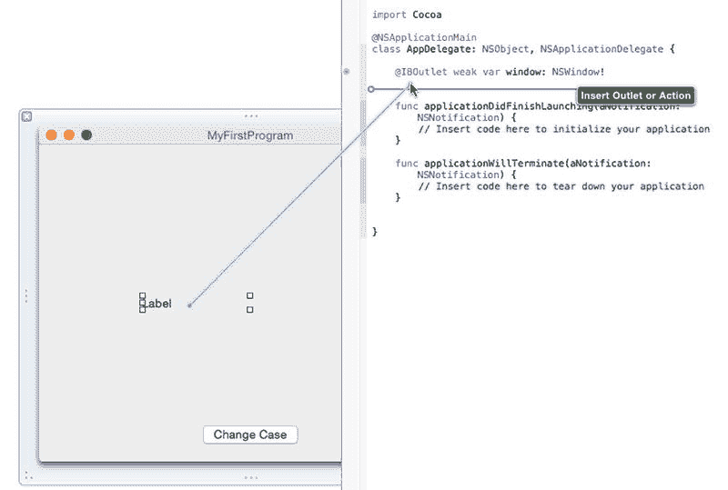

**Figure 3-13.** Control-拖拽可在用户界面项与 Swift 代码之间创建连接

松开 Control 键和鼠标。会出现一个弹出窗口，如图 3-14 所示。

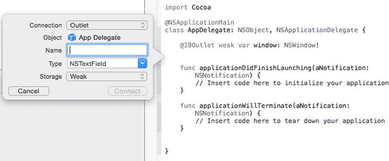

**Figure 3-14.** 弹出窗口让您为 `IBOutlet` 定义名称

在 Name 文本字段中点击，输入 `labelText`，然后点击 Connect 按钮。（您选择的名称应具有描述性，但可以是任何您想要的名称。）Xcode 会在您的 Swift 文件中创建一个如下所示的 `IBOutlet`：

`@IBOutlet weak var labelText: NSTextField!`

点击文本字段以将其选中。按住 Control 键，将鼠标从文本字段拖拽到您刚创建的 `IBOutlet` 下方，直到 `AppDelegate.swift` 文件中出现一条水平线。松开 Control 键和鼠标。会出现一个弹出窗口。在 Name 文本字段中点击，输入 `messageText`，然后点击 Connect 按钮。Xcode 会在您的 Swift 文件中创建第二个如下所示的 `IBOutlet`：

`@IBOutlet weak var messageText: NSTextField!`

让我们回顾一下您刚才的操作。首先，您创建了一个代表标签和文本字段的 `IBOutlet`。现在，标签由名称 `labelText` 表示，文本字段由名称 `messageText` 表示。当您的 Swift 代码想要在标签或文本字段中存储或检索数据时，它可以直接通过名称 `labelText` 或 `messageText` 来引用它们。

其次，您在 Swift 代码和用户界面项之间创建了一个链接。现在，您的 Swift 代码可以向程序用户界面上的标签和文本字段发送数据，并从中检索数据。

将用户界面连接到 Swift 代码是使用户界面真正工作的重要一步。但是，我们需要让 Change Case 按钮在用户点击时执行某些操作。为此，我们需要创建一种叫做 `IBAction` 方法的东西。

`IBOutlet` 让 Swift 代码可以向用户界面项发送数据或从中检索数据，而 `IBAction` 方法则让用户界面项可以运行执行某些操作的 Swift 代码。在本例中，我们希望用户在文本字段中输入文本。然后，程序会获取该文本，将其转换为大写，并将转换后的文本显示回标签中。

为此，我们需要了解如何执行以下操作：

- 创建 `IBAction` 方法
- 从文本字段中检索文本
- 将从文本字段检索到的所有文本转换为大写
- 将转换后的文本存储在标签中

从文本字段和标签中存储和检索文本是类似的，因为两者都由 `IBOutlet` 变量定义。让我们看看这些 `IBOutlet` 的含义：

```
@IBOutlet weak var labelText: NSTextField!
@IBOutlet weak var messageText: NSTextField!
```

Object Library 中的所有用户界面项都基于构成 Cocoa 框架的类文件。在本例中，我们创建了两个 `IBOutlet` 变量，名为 `labelText` 和 `messageText`，它们都基于 `NSTextField` 类文件。

如果您在 Xcode 的文档中查找 `NSTextField` 类文件，您会看到一长串所有基于 `NSTextField` 的对象可以拥有的属性。但是，您找不到任何描述保存文本的属性的内容。

然而，如果您还记得第 1 章的内容，面向对象编程意味着类文件可以从其他类文件继承。在本例中，`NSTextField` 类继承自另一个名为 `NSControl` 的类。在 Xcode 文档中查找 `NSControl`（您将在下一章学习如何操作），您会看到 `NSControl` 有一个保存文本的属性，名为 `stringValue`，如图 3-15 所示。

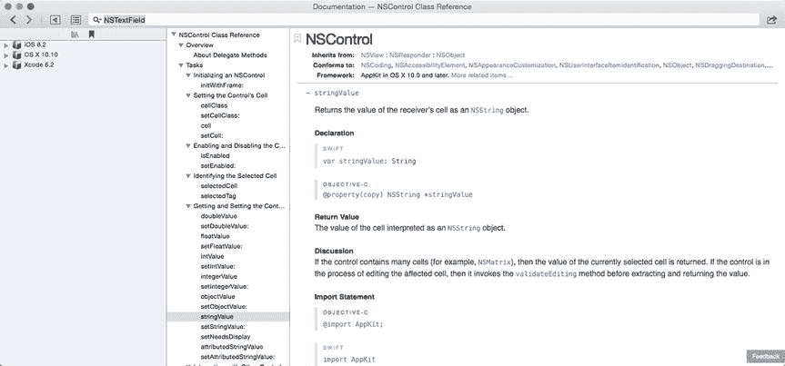

**Figure 3-15.** Xcode 文档显示 `NSControl` 用于保存文本的属性

要访问文本字段中存储的文本，我们需要通过名称 (`messageText`) 和保存文本的属性 (`stringValue`) 来标识文本字段，例如：

`messageText.stringValue`

要在标签中显示文本，我们需要通过名称 (`labelText`) 和保存文本的属性 (`stringValue`) 来标识标签，例如：

`labelText.stringValue`

那么下一个问题是：我们如何将文本转换为大写？Swift 将文本存储在一个名为 `String` 的数据类型中，该类型基于名为 `NSString` 的类。（您怎么知道这一点？您需要理解 Cocoa 框架，您将在第 4 章中了解更多。）`NSString` 类有一个名为 `uppercaseString` 的方法，如图 3-16 所示。

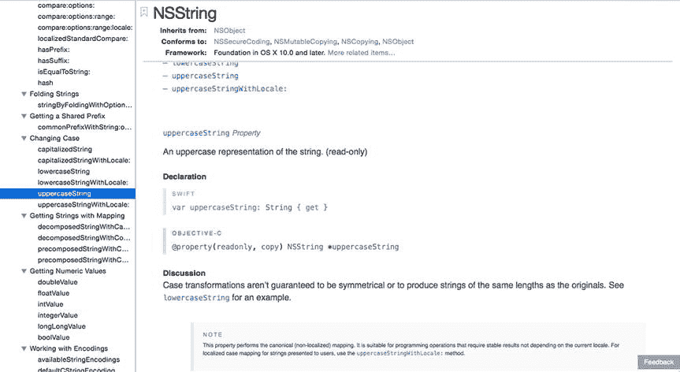

**Figure 3-16.** Xcode 文档显示 `NSString` 类有一个用于将文本转换为大写的方法，名为 `uppercaseString`

要将文本字段中存储的文本（由 `IBOutlet` 名称 `messageText` 表示）转换为大写，我们只需对 `IBOutlet` 的文本属性应用 `uppercaseString` 方法，如下所示：

`messageText.stringValue.uppercaseString`

这段 Swift 代码的意思是：获取 `messageText` 对象（即用户界面上的文本字段），检索它包含的文本（位于 `stringValue` 属性中），然后对该文本应用 `uppercaseString` 方法。

现在我们已经知道如何从文本字段中检索文本、将其转换为大写，并将新文本存储回标签中，最后一步是编写代码，将所有操作放在一个 `IBAction` 方法中。这个 `IBAction` 方法需要在用户每次点击 Change Case 按钮时运行。这意味着我们需要创建一个 `IBAction` 方法并将其链接到 Change Case 按钮。

确保 Assistant Editor 仍然打开，并并排显示用户界面和 `AppDelegate.swift` 文件。点击 MyFirstProgram 用户界面上的 Change Case 按钮以将其选中。按住 Control 键，将鼠标拖拽到最后一个 `IBOutlet` 下方，直到出现一条水平线，如图 3-17 所示。

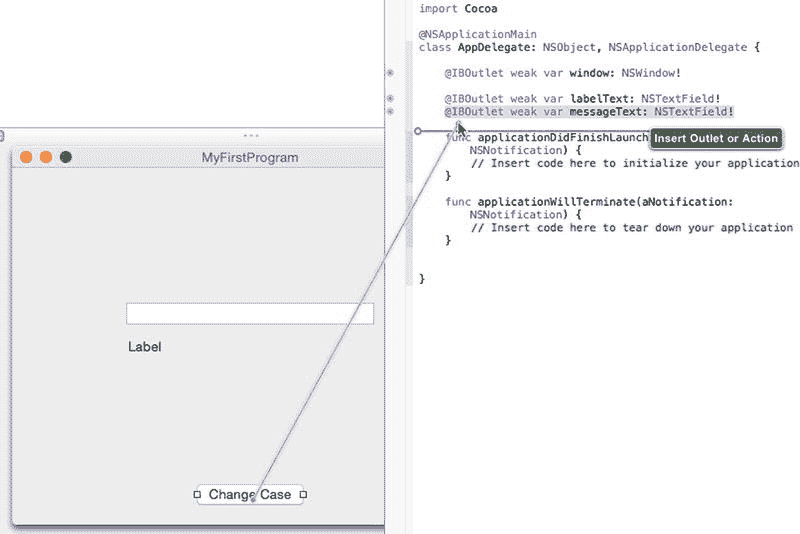

**Figure 3-17.** 从按钮 Control-拖拽到 `AppDelegate.swift` 文件

松开 Control 键和鼠标。会出现一个弹出窗口。点击 Connection 弹出菜单，选择 Action，如图 3-18 所示。

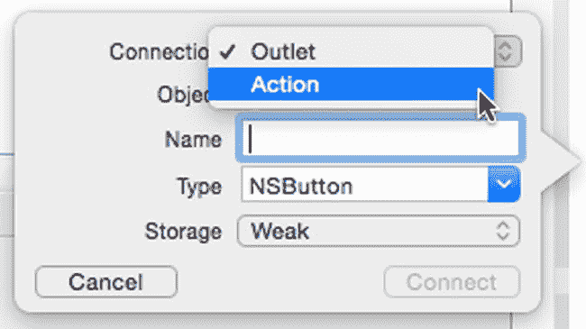

**Figure 3-18.**


## 创建动作连接

在 `Name` 文本字段中点击并输入 `changeCase`。（你选择的名称应具有描述性，但可以是任何你想要的名称。）在 `Type` 弹出菜单中点击，并选择 `NSButton`，如图 3-19 所示。然后点击 `Connect` 按钮。Xcode 会创建一个如下所示的 `IBAction` 方法：

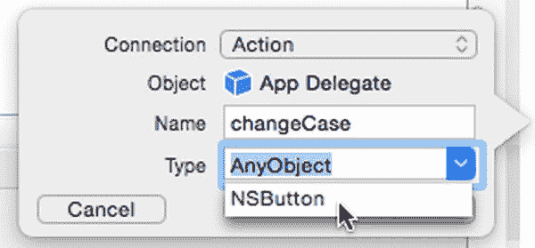

**图 3-19.** 为 `IBAction` 方法选择类型

```
@IBAction func changeCase(sender: NSButton) {
}
```

至此，你已经创建了一个 `IBAction` 方法，该方法会在用户每次点击 **Change Case** 按钮时运行。当然，该 `IBAction` 内部还没有任何 Swift 代码，所以现在我们需要在那些定义 `IBAction` 方法起始位置的花括号内输入 Swift 代码。

确保 Xcode 仍然并排显示你的用户界面和 `AppDelegate.swift` 文件。选择 **View ➤ Standard Editor ➤ Show Standard Editor**。Xcode 现在只显示你的 `MyFirstProgram` 用户界面。在 **Project Navigator** 中点击 `AppDelegate.swift` 文件。Xcode 会显示存储在 `AppDelegate.swift` 文件中的所有 Swift 代码。按如下方式编辑 `IBAction` `changeCase` 方法：

```
@IBAction func changeCase(sender: NSButton) {
    labelText.stringValue = messageText.stringValue.uppercaseString
}
```

选择 **Product ➤ Run**。你的 `MyFirstProgram` 会运行起来。在你的 `MyFirstProgram` 用户界面的文本字段中点击，并输入 `hello, world`。点击 **Change Case** 按钮。标签会显示 `HELLO, WORLD`，如图 3-20 所示。

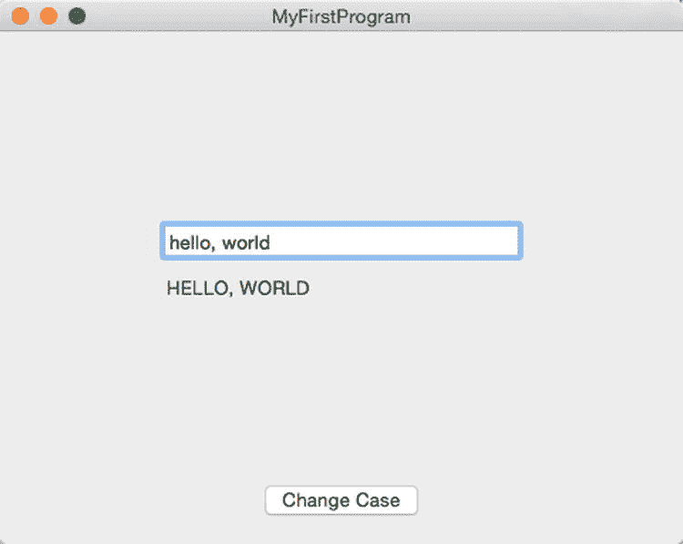

**图 3-20.** 运行 `MyFirstProgram`

选择 **MyFirstProgram ➤ Quit MyFirstProgram**。Xcode 会再次出现。

如你所见，你只写了很少的 Swift 代码就创建了一个简单的 Macintosh 程序。你实际编写的 Swift 代码只有一行，它获取文本字段中存储的文本，将其转换为大写，然后将这个大写的文本存储在标签中。

Swift 的许多强大之处源于尽可能依赖 Apple 的 Cocoa 框架。这意味着你必须理解面向对象编程，以及类如何定义属性（用于存储数据）和方法（用于操作数据）——并且使用继承——你将在下一章中了解更多。

重点是了解 Xcode 如何创建通用的 OS X 程序，这样你只需要设计和定制用户界面，然后编写 Swift 代码让它全部工作起来。

## 使用文档大纲和连接检查器

在我们结束这个创建第一个 Macintosh 程序的简短介绍之前，让我们看看另外两个在未来使用 Xcode 时非常有用的工具：**文档大纲** 和 **连接检查器**。

**文档大纲** 列出了构成你用户界面的所有项目。要打开或隐藏 **文档大纲**，你可以按照图 3-21 所示进行操作：

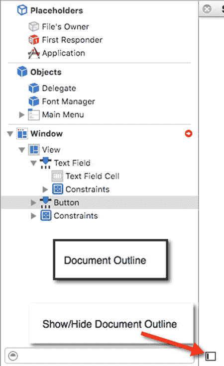

**图 3-21.** 文档大纲

*   选择 **Editor ➤ Show/Hide Document Outline**
*   点击 **Document Outline** 图标

文档大纲使得选择用户界面上的不同项目变得容易。在我们的 `MyFirstProgram` 中，只有三个项目（一个标签、一个文本字段和一个按钮），但在更复杂的用户界面中，你可能会有更多项目，这些项目可能隐藏在其它项目后面，或者太小而难以看清。

如果你在文档大纲中点击一个项目，Xcode 会在用户界面中选择该项目（反之亦然），如图 3-22 所示。

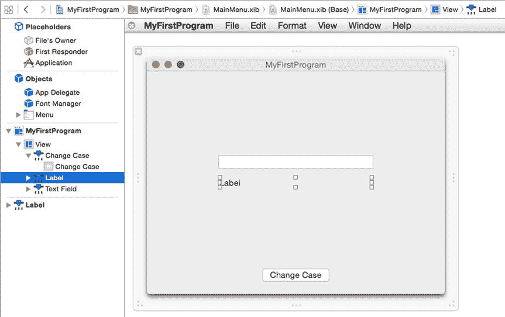

**图 3-22.** 在文档大纲窗口中点击一个项目，会在用户界面中选择该项目

将文档大纲视为一种快速查看用户界面的所有部分并只选择你想要的项目的途径。

一旦你开始通过 `IBOutlet` 和 `IBAction` 方法将用户界面项目连接到你的 Swift 代码，你可能想知道哪些项目连接到了哪些 `IBOutlet` 和 `IBAction` 方法。要查看 `IBOutlet`/`IBAction` 方法与用户界面项目之间的连接，你有两个选项。

首先，你可以使用 **连接检查器**。其次，你可以使用 **助理编辑器**。

要打开 **连接检查器**，首先在用户界面上点击任何你想检查的项目，然后执行以下操作之一，以显示出现在 Xcode 窗口右上角的连接检查器，如图 3-23 所示：

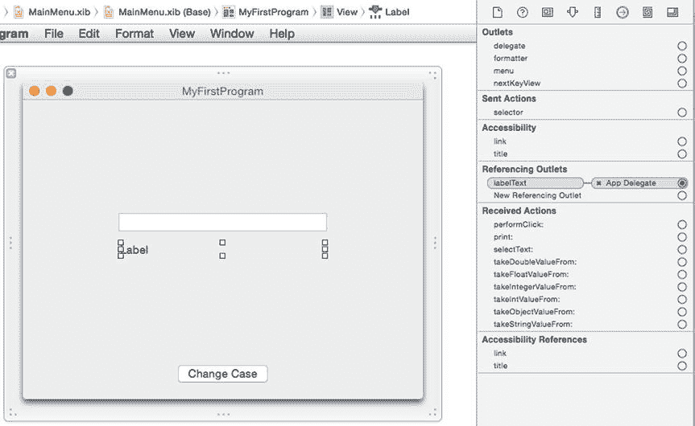

**图 3-23.** 连接检查器显示当前选中的用户界面项目的所有连接

*   选择 **View ➤ Utilities ➤ Show Connections Inspector**
*   按下 **Option+Command+6**
*   点击 **Show Connections Inspector** 图标

连接检查器会显示持有与所选用户界面项目相连的 `IBOutlet` 或 `IBAction` 方法的 Swift 文件。

> **注意：** 如果你仔细观察，连接检查器会在与当前选中的用户界面项目链接的 Swift 文件左侧显示一个 X。如果你点击这个 X，你可以断开用户界面项目与其 `IBOutlet` 或 `IBAction` 方法之间的链接。

另一种查看哪些 `IBOutlet` 和 `IBAction` 方法连接到用户界面项目的方法是打开用户界面（例如点击 `MainMenu.xib` 文件），然后打开 **助理编辑器**。

在你的 Swift 文件中的每个 `IBOutlet` 和 `IBAction` 方法左侧，你会看到一个灰色圆圈。当你将鼠标指针移到灰色圆圈上时，Xcode 会高亮显示连接到该 `IBOutlet` 或 `IBAction` 方法的用户界面项目，如图 3-24 所示。

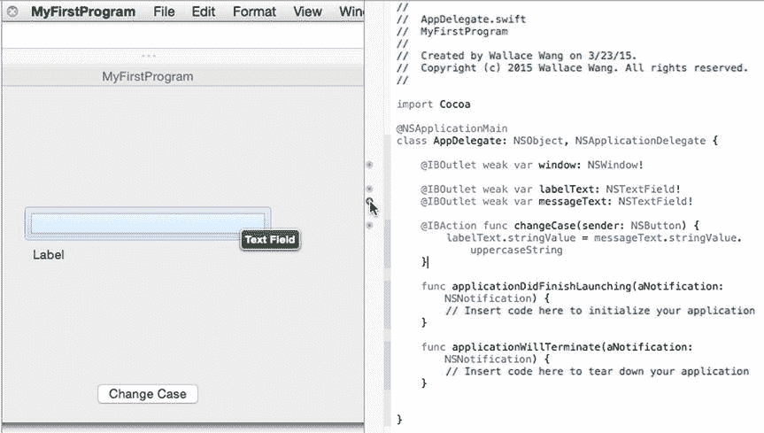

**图 3-24.** 助理编辑器让你看到哪些 `IBOutlet` 和 `IBAction` 方法连接到了用户界面项目

## 总结

Xcode 是你设计、编写和修改自己的 OS X 程序所需的唯一程序。当你想要创建一个 OS X 程序时，你将遵循相同的基本步骤：

*   选择一个要使用的项目模板（通常是 **Cocoa Application**）
*   设计和定制用户界面
*   将用户界面项目连接到 `IBOutlet` 和 `IBAction` 方法
*   编写 Swift 代码以使 `IBAction` 方法执行操作
*   运行并测试你的程序

要设计你的用户界面，你需要从 **对象库** 中拖放项目。然后你需要使用 **属性** 和 **大小检查器** 来定制每个用户界面项目。为了帮助你选择用户界面项目，你可以使用 **文档大纲**。

设计好用户界面后，你需要使用 **助理编辑器**，通过 `IBOutlet`（用于检索或显示数据）和 `IBAction` 方法（使你的用户界面执行操作）将你的用户界面连接到你的 Swift 代码。

要查看用户界面项目与 Swift 代码之间的连接，你可以使用 **连接检查器** 或 **助理编辑器**。

你已经可以看到 Xcode 的不同部分如何协同工作来帮助你创建程序，而我们还没有探索许多其它的 Xcode 功能。创建 Macintosh 程序最令人困惑的部分可能在于编写 Swift 代码和使用构成 Cocoa 框架的类文件中存储的方法，因此下一章将更详细地解释这一点。

如你所见，一旦你只专注于那些你实际需要的功能而忽略其余部分，使用 Xcode 实际上相当简单。在我们逐章学习的过程中，你会不断学到更多关于 Xcode 和 Swift 编程的知识。

你已经学到了很多关于 Xcode 的知识，然而这一切才刚刚开始。


