# 4. 获取帮助

学习任何新技能的最佳方式是由他人指点迷津。然而，并非总能如此，因此你会很高兴地发现，Xcode 内置了丰富的帮助功能，能让你的 Xcode 使用体验更轻松、更愉快。

要使用 Xcode 的帮助功能，首先需要理解 Swift 程序如何运作，以及它们如何与 Cocoa 框架协同工作。一旦你理解了典型的 OS X 程序是如何工作的，以及它是如何依赖 Cocoa 框架的，你就能更好地理解如何获取所需的帮助，以及如何理解通过 Xcode 找到的帮助信息。

## 理解 Cocoa 框架

使用 Xcode 时，你必须明白，你创建的每一个程序都基于 Cocoa 框架，该框架使用了包含各种属性和方法的类。通过使用这些现有的类，你无需编写和测试自己的代码，从而节省时间。相反，你可以直接使用 Cocoa 框架中已经可用的现有代码。这让你能腾出更多时间，专注于编写特定于你个人程序的代码。

要使用 Cocoa 框架，你必须理解面向对象编程的原理以及对象的工作方式。要创建一个对象，你必须先定义一个类。一个类包含了定义属性（用于保存数据）和方法（用于操作其属性中存储的数据）的实际代码。一旦定义了类，你就可以基于该类定义一个或多个对象。

就像饼干模具定义了饼干的形状，但本身并非饼干一样，类定义了对象，但本身并非对象。

Cocoa 框架由多个类文件组成，其中许多类文件会从其他类文件继承属性和方法。当你创建一个 OS X 程序时，通常会基于 Cocoa 框架的类文件创建对象。实际上，你在对象库中创建的每个用户界面项都基于一个 Cocoa 框架类。

要查看每个用户界面项基于哪个类文件，让我们检查一下你创建的三个用户界面项：一个标签、一个文本字段和一个按钮：

- 在 Xcode 中打开 `MyFirstProgram` 项目。
- 点击 `MainMenu.xib` 文件。Xcode 将显示你的用户界面。
- 选择 **视图** ➤ **工具** ➤ **显示对象库**。对象库会出现在 Xcode 窗口的右下角。
- 点击对象库中的**按钮**项。将出现一个弹出窗口，如图 4-1 所示。请注意，此弹出窗口会告诉你按钮的类文件（`NSButton`）。

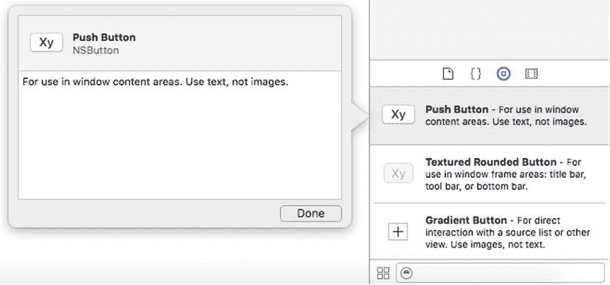

图 4-1. 查找按钮的类文件

- 点击**完成**按钮关闭弹出窗口。
- 滚动浏览对象库，然后点击**标签**项。将出现一个弹出窗口，如图 4-2 所示。请注意，此弹出窗口会告诉你标签的类文件（`NSTextField`）。

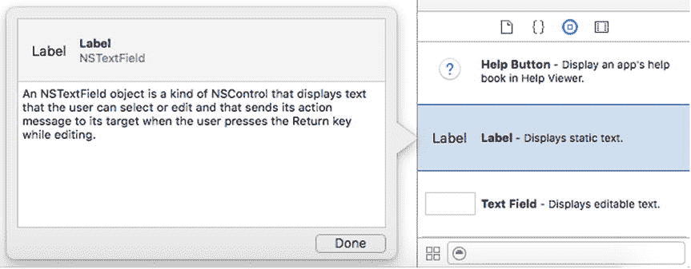

图 4-2. 查找标签的类文件

- 滚动浏览对象库，然后点击**文本字段**项。将出现一个弹出窗口，如图 4-3 所示。

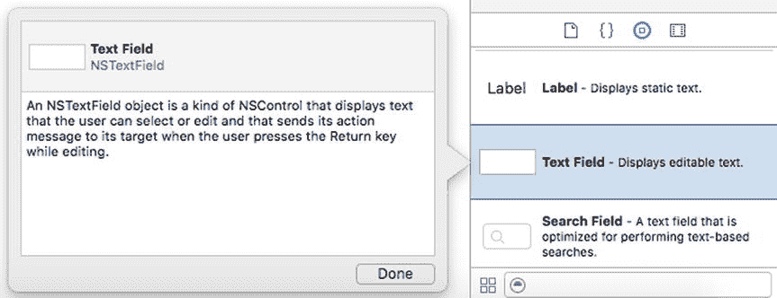

图 4-3. 查找文本字段的类文件

通过使用 Xcode 为对象库中每个项提供的简单帮助弹出窗口，我们了解了有关用户界面的以下信息：

- 按钮基于 `NSButton` 类文件
- 标签基于 `NSTextField` 类文件
- 文本字段也基于 `NSTextField` 类文件
- `NSTextField` 类继承自 `NSControl` 类（是 `NSControl` 类的子类）

任何时候你需要查找某个用户界面项的类文件，只需在对象库窗口中点击该项即可。要了解每个用户界面项可用的属性和方法，我们需要查找该特定类的所有属性和方法。例如，如果我们想知道文本字段有哪些可用的属性和方法，就必须查找 `NSTextField` 类定义的属性和方法。

此外，由于 `NSTextField` 类继承自 `NSControl` 类，我们也可以使用 `NSControl` 类定义的任何属性和方法。（如果 `NSControl` 类还继承了另一个类，那么我们也可以使用那个类中存储的属性和方法。）

## 在类文件中查找属性和方法

一旦我们知道某个特定的用户界面项基于哪个类，就可以在 Xcode 的文档中查找其属性和方法列表。有两种方法可以做到这一点：

- 选择 **帮助** ➤ **文档和 API 参考**
- Option+点击你的 Swift 代码中的类名

还记得我们需要在标签和文本字段中查找存储文本的属性吗？以下是查找此信息的步骤：

- 确定每个用户界面项基于哪个类文件（`NSTextField`，我们通过在对象库中点击该项得知）
- 查找 Xcode 关于 `NSTextField` 类文件的文档
- 如果在 `NSTextField` 类文件中找不到所需信息，则查找 `NSControl` 类文件，因为 `NSTextField` 类从 `NSControl` 类继承了所有属性和方法


### 通过帮助菜单查找类文件

Xcode 的菜单栏和下拉菜单通常是查找任何命令最直接的方式。因此，第一步是打开 Xcode 的文档窗口，如图 4-4 所示，可以通过以下两种方式之一打开：

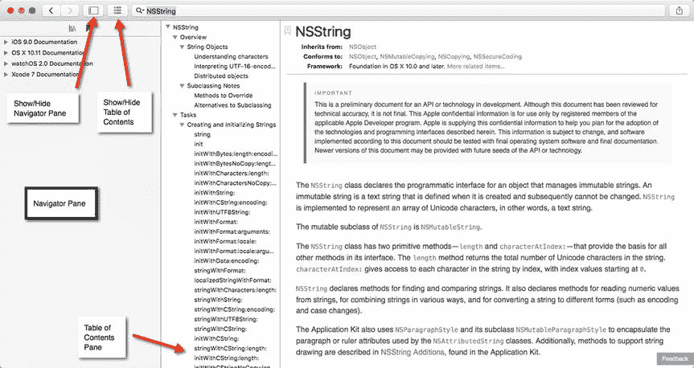

图 4-4. Xcode 文档窗口

- 选择“帮助” ➤ “文档和 API 参考”
- 按下 `Shift+Command+0`（数字零）

**注意：** 为使文档窗口更简洁，请点击“显示/隐藏导航器”图标。

点击文档窗口顶部的“搜索文档”文本字段，输入 `NSTextField`，然后按下 Return 键。文档窗口会显示关于 `NSTextField` 类的信息。滚动“目录”窗格以查看关于 `NSTextField` 类的信息。如果你在“目录”窗格中点击某个主题，文档窗口会显示更多信息，如图 4-5 所示。但是，`NSTextField` 文档中并没有解释它如何存储文本。为了找到答案，我们需要进一步查看 `NSTextField` 的父类，即 `NSControl`。

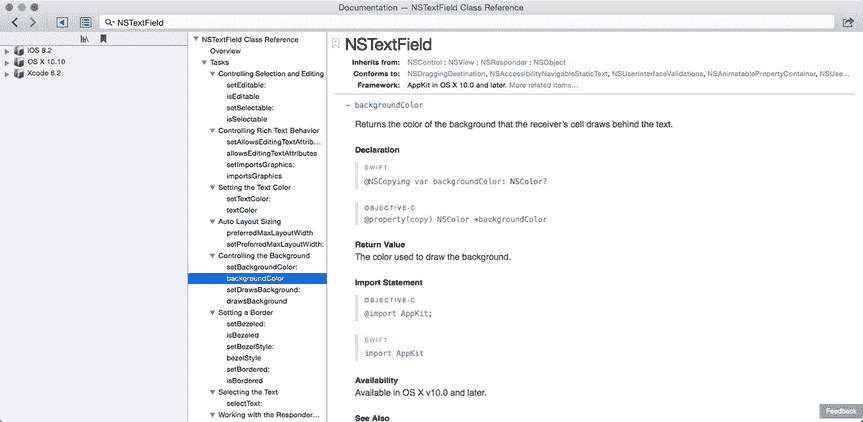

图 4-5. 在“目录”窗格中选择一项，会在右侧窗格中显示信息

点击“继承自：”标签右侧显示的 `NSControl`。请注意，`NSTextField` 继承自 `NSControl`，`NSControl` 继承自 `NSView`，`NSView` 继承自 `NSResponder`，`NSResponder` 继承自 `NSObject`。要找到标签或文本字段（两者都基于 `NSTextField` 类）可用的所有属性和方法，我们也需要详尽地搜索这些类文件中的每一个。

点击 `NSControl` 的“目录”窗格中的“获取和设置控件值”，如图 4-6 所示。请注意，`NSControl` 类中用于存储文本数据的属性名为 `stringValue`。

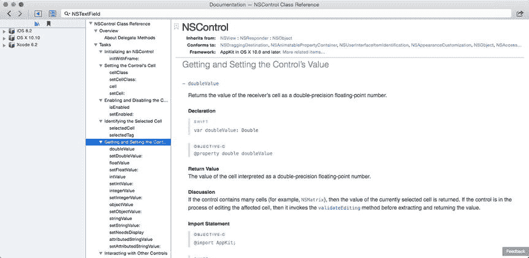

图 4-6. 文档窗口列出了 `NSControl` 中存储数据的所有属性

一旦我们知道可以使用 `stringValue` 属性在 `NSControl` 类中保存文本数据，我们也就知道可以在 `NSTextField` 类中使用 `stringValue` 属性来保存文本数据。由于我们的标签和文本字段都基于 `NSTextField` 类（这是通过在对象库中点击它们发现的），因此我们知道可以使用 `stringValue` 属性来访问标签和文本字段的文本数据。

### 通过快速帮助查找类文件

使用文档窗口查找类文件很方便，但 Xcode 还提供了另一种称为“快速帮助”的方法。要使用“快速帮助”，你需要将光标或鼠标指针移到包含 Swift 代码文件中的类文件名上，然后选择以下方法之一：

- 选择“帮助” ➤ “选中项的快速帮助”
- 按下 `Control+Command+Shift+?`
- 按住 Option 键并点击类文件名

“快速帮助”会显示一个弹出窗口，其中包含所选类文件的简要描述，如果你愿意，还可以选择在文档窗口中查看完整描述。要了解如何使用 Option 键和鼠标查看“快速帮助”的工作原理，请按照以下步骤操作：

1. 确保 `MyFirstProgram` 已加载到 Xcode 中。
2. 在项目导航器中点击 `AppDelegate.swift` 文件。Xcode 会在中间窗格中显示 `AppDelegate.swift` 文件的内容。
3. 按住 Option 键，将鼠标移到 `IBOutlet` 中的 `NSTextField` 单词上。鼠标指针会变成一个问号，如图 4-7 所示。

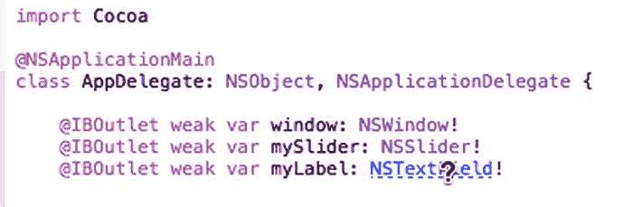

图 4-7. 按住 Option 键时，鼠标指针悬停在类文件名上会变成问号

4. 在鼠标指针悬停在 `NSTextField` 上时按住 Option 键，然后点击鼠标。Xcode 会显示一个弹出窗口，简要描述 `NSTextField` 类的特性，如图 4-8 所示。

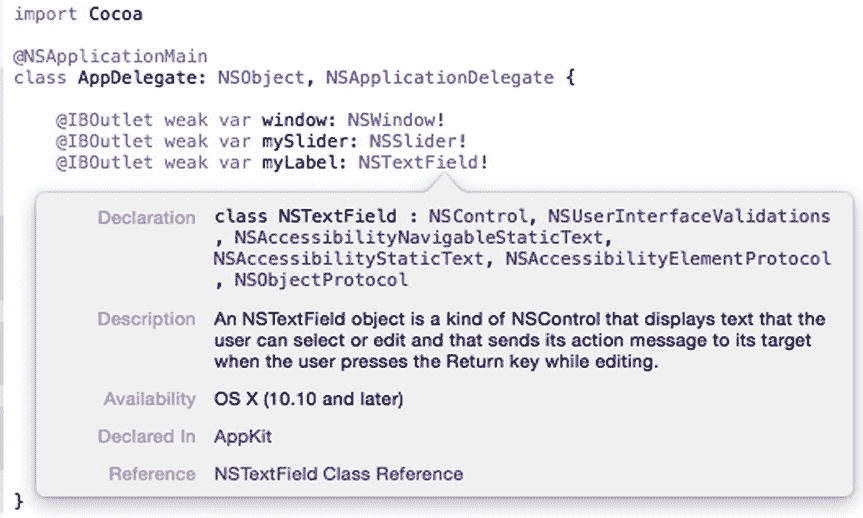

图 4-8. Option+点击类文件名会显示一个描述该类文件的弹出窗口

5. 点击弹出窗口底部“参考”标签旁边的 `NSTextField Class Reference`。Xcode 会显示文档窗口，列出 `NSTextField` 类文件（参见图 4-5）。

Option+点击只是打开文档窗口的一种方式，无需通过“帮助” ➤ “文档和参考 API”命令并输入类文件名。


## 浏览文档

快速帮助可以显示特定类文件的相关信息，但如果你知道自己需要信息，却不知从何找起，该怎么办？这时，你可以花些时间浏览“文档”窗口，快速翻阅不同的帮助主题，直到找到想要的内容。

即使没有找到所需信息，你也很可能会偶然发现一些关于`Xcode`或`OS X`的有趣知识，这些知识将来可能会派上用场。在浏览`Xcode`的文档时，你可以查找与`iOS`、`OS X`或`Xcode`相关的特定信息。

如果发现有趣的内容，可以将其添加为书签。这样，日后就能快速再次找到它。你还可以通过电子邮件或短信发送信息，与他人分享有用的内容。

要浏览文档，请按以下步骤操作：

1. 选择`帮助` ➤ `文档和 API 参考`。文档窗口随即出现。
2. 点击`显示/隐藏导航器`图标，确保导航器窗格出现，并列出主题类别，如`iOS`、`OS X`和`Xcode`，如图 4-9 所示。

   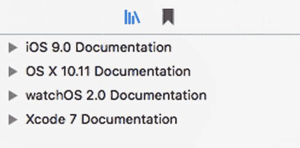

   图 4-9. 文档窗口的导航器窗格显示了不同信息的类别

3. 点击类别（如`OS X`或`Xcode`类别）左侧显示的灰色展开三角形。会出现一个包含更多主题的列表（这些主题也有自己的灰色展开三角形）。继续点击主题的展开三角形，最终你将找到可点击查看信息的主题列表，如图 4-10 所示。

   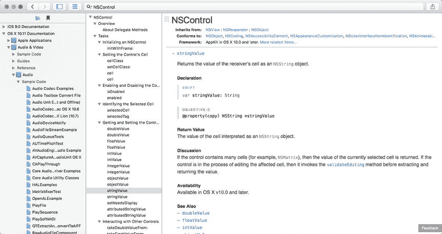

   图 4-10. 每个类别都列出了多个其他主题类别

4. 点击文档窗口右上角出现的`共享`图标，如图 4-11 所示。如果点击`发送电子邮件链接`，邮件程序将加载一封空白电子邮件，其中包含指向该文档页面的链接。如果点击`添加书签`，`Xcode`会将该文档页面保存为书签。

   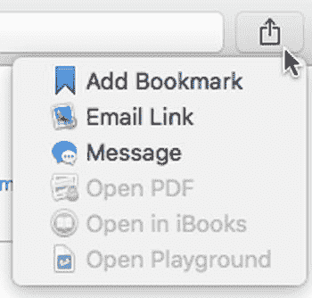

   图 4-11. “共享”图标允许你为页面添加书签或与他人分享

5. 为一个或多个页面添加书签后，你可以点击`显示文档书签`图标来查看书签，如图 4-12 所示。现在，你可以点击某个书签，立即查看该文档页面，无需再费力搜索。

   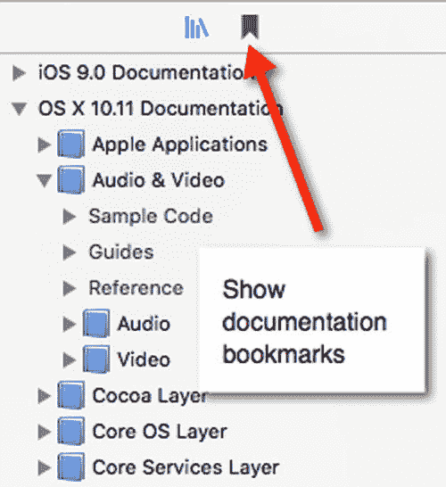

   图 4-12. 查看已添加书签的页面

   要删除书签，只需右键点击该书签，在弹出的菜单中选择`删除`。

6. 当你想再次查看文档库类别（`iOS`、`OS X`和`Xcode`）时，只需点击`浏览文档库`图标，如图 4-13 所示。

   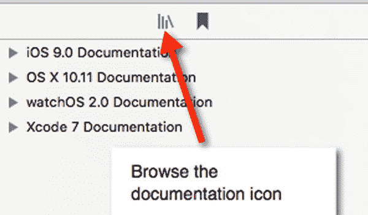

   图 4-13. “浏览文档库”图标

## 搜索文档

快速帮助可以显示特定类文件的信息，而浏览文档则可以帮助你探索关于`iOS`、`OS X`和`Xcode`的海量信息。问题是，快速帮助仅对查找类文件信息有用，而浏览文档又可能很耗时。如果你知道自己想找什么，直接搜索即可。

搜索信息时，请尽可能多地输入关键词，以缩小搜索结果范围。如果只输入单个字母或单词，`Xcode`的文档会用大量不相关的结果轰炸你。

要了解搜索文档窗口的工作原理，请尝试以下操作：

1. 选择`帮助` ➤ `文档和 API 参考`。文档窗口随即出现。
2. 点击`搜索文档`文本字段，输入`text`。会弹出一个包含不同文本结果列表的菜单，点击即可获取更多信息，如图 4-14 所示。

   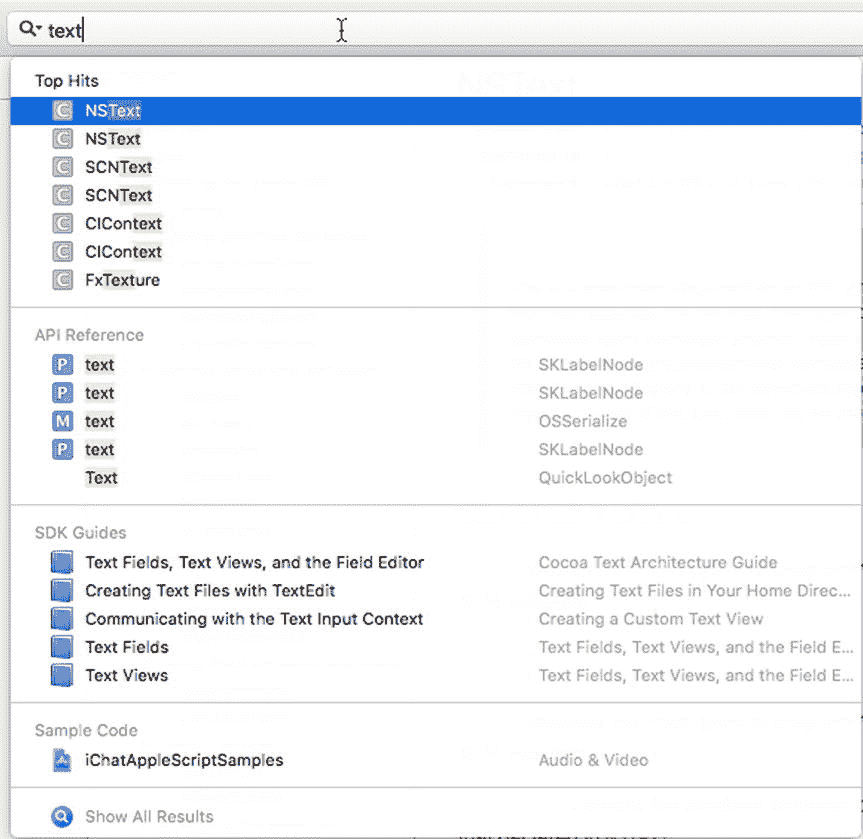

   图 4-14. 针对“text”的结果菜单

3. 按空格键，在`text`后面创建一个空格。注意，此时菜单显示的文本结果完全不同，如图 4-15 所示。

   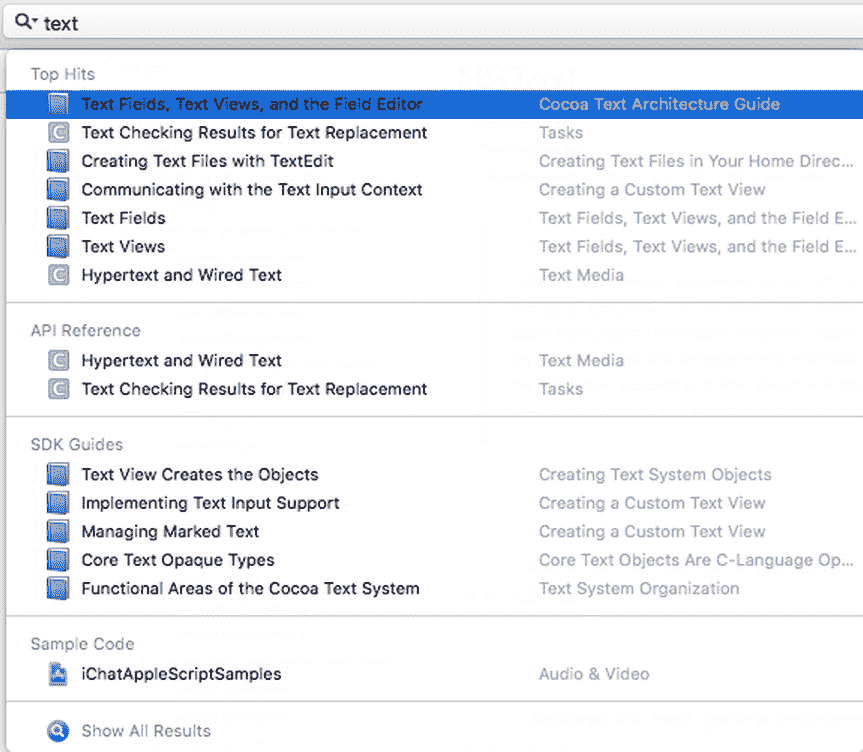

   图 4-15. 仅在搜索词后添加一个空格，就能显示不同的结果菜单

通过搜索文档，你可以快速、轻松地找到所需内容。

## 使用代码补全

回顾第 3 章，当你开始输入 Swift 代码时，可能已经注意到一些奇怪的现象。每次你输入部分 Swift 命令时，Xcode 编辑器可能会显示灰色文本和一个包含可能匹配你部分输入的命令的菜单，如图 4-16 所示。

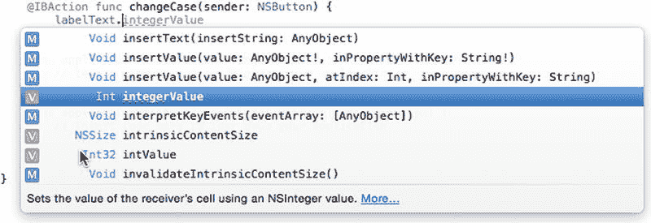

图 4-16. 代码补全建议你可能正在尝试输入的命令

此功能称为“代码补全”，是 Xcode 帮助你输入长命令的一种方式，无需你亲自输入每个字符。当你看到灰色文本和菜单时，你有三个选择：

* 按`Tab`键让 Xcode 自动输入部分灰色文本。（你可能需要多次按`Tab`键才能完全选中所有灰色文本。）
* 双击弹出菜单中的某个命令，自动输入该命令。
* 继续手动输入。

如果你继续手动输入，Xcode 会持续显示新的灰色文本（它认为你可能在尝试输入的文本），以及一个包含与你已输入内容匹配的不同命令的菜单。让我们看看代码补全的工作原理：

要了解搜索文档窗口的工作原理，请尝试以下操作：

1. 确保你的`MyFirstProgram`项目已在 Xcode 中加载。
2. 在项目导航器窗格中点击`AppDelegate.swift`。`AppDelegate.swift`文件的内容会显示在中间的 Xcode 窗格中。
3. 修改`@IBAction changeCase(sender: NSButton)`代码，删除花括号之间的那一行代码，使其现在看起来如下：

   ```
   @IBAction func changeCase(sender: NSButton) {
   }
   ```

4. 将光标移动到此`@IBAction`方法的花括号之间，输入`labelText.s`，注意会出现灰色文本和一个包含可能命令的菜单，如图 4-17 所示。

   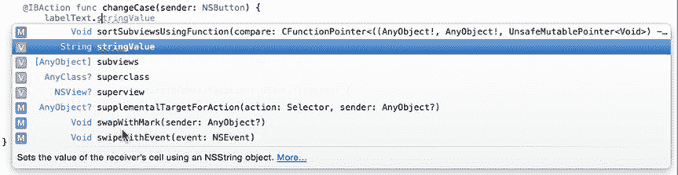

   图 4-17. 代码补全建议`stringValue`作为可能的命令

5. 按`Tab`键。第一次按下`Tab`键时，Xcode 会输入“string”。
6. 第二次按下`Tab`键，现在 Xcode 会输入完整的“stringValue”。
7. 输入`= messageText.stringValue.uppercaseString`。注意，在你输入时，代码补全会持续在弹出菜单中显示不同的灰色文本和命令。

通过使用代码补全，你可以更快、更准确地输入命令。如果你开始输入一个命令，却没有看到代码补全的灰色文本或菜单出现，这可能表明你输入的命令有误。代码补全是 Xcode 让代码输入变得更简单的又一方式。


## 理解 OS X 程序的工作原理

为了帮助您更好地理解 Xcode 帮助文档中的全部含义，您需要了解 OS X 程序的工作原理。在过去，当程序还很小时，程序员会将所有程序命令存储在一个文件中。然后计算机从文件顶部的第一条命令开始，逐行向下执行，直到到达文件末尾才停止。

如今程序规模要大得多，因此它们通常被分割成多个文件。无论您将程序分割成多少个文件，Xcode 都会将所有内容视为存储在一个文件中。将程序分割成多个文件是为了方便您管理。

让我们逐行分析您的 `MyFirstProgram`，以便您理解其运行机制。当您在 Xcode 中查看 Swift 代码时，会注意到 Xcode 编辑器对不同文本进行了颜色编码。这些颜色有助于您识别不同文本的用途，如下所示：

-   **绿色** – 注释，Xcode 会完全忽略它们。注释旨在解释附近代码的相关信息。
-   **紫色** – Swift 语言的关键字。
-   **红色** – 文本字符串。
-   **蓝色** – 类文件名。
-   **黑色** – 命令。

第一行代码告诉 Xcode 导入或包含 Cocoa 框架中的所有代码，作为您程序的一部分。这行代码如下所示：

```
import Cocoa
```

下一行运行一个 Swift 函数，该函数加载您的用户界面（`MainMenu.xib`）并从您的 `AppDelegate` 类创建一个对象。这基本上让您的整个程序作为一个通用的 Macintosh 程序运行。这行代码如下所示：

```
@NSApplicationMain
```

下一行定义了一个名为 `AppDelegate` 的类，该类基于 `NSObject` 类，并使用 `NSApplicationDelegate` 协议（您很快会了解到）。这行代码如下所示：

```
class AppDelegate: NSObject, NSApplicationDelegate {
```

接下来的三行定义了 `IBOutlet`s，用于将此 Swift 代码连接到用户界面元素：用户界面的窗口以及标签和文本字段。窗口基于 `NSWindow` 类（在 Cocoa 框架中定义），而标签和文本字段基于 `NSTextField` 类。这些行代码如下所示：

```
@IBOutlet weak var window: NSWindow!
```

```
@IBOutlet weak var labelText: NSTextField!
```

```
@IBOutlet weak var messageText: NSTextField!
```

接下来的三行定义了一个连接到用户界面按钮的 `IBAction` 方法。该代码获取存储在 `messageText`（文本字段）中的文本并将其转换为大写。然后，它将大写文本存储到 `labelText`（标签）中。标签和文本字段都基于 `NSTextField` 类（在 Cocoa 框架中定义）。这些行代码如下所示：

```
@IBAction func changeCase(sender: NSButton) {
```

```
labelText.stringValue = messageText.stringValue.uppercaseString
```

```
}
```

剩下的代码定义了两个空函数，因此它们不执行任何操作。如果您在这些函数内部键入代码，该代码将在您的程序启动后立即运行（`applicationDidFinishLaunching`），或者在您的程序结束时立即运行（`applicationWillTerminate`）。

当 `MyFirstProgram` 运行时，它会导入 Cocoa 框架并运行，在屏幕上显示一个包含您用户界面的通用 Macintosh 程序。`applicationDidFinishLaunching` 函数会执行，但由于它不包含任何代码，因此什么也不会发生。此时程序停止并等待某些事情发生。

如果用户退出程序，`applicationWillTerminate` 函数将会执行，但由于它不包含任何代码，因此什么也不会发生。

当用户单击“Change Case”按钮时，它会运行 `IBAction` 方法 `changeCase`。此 `IBAction` 方法中唯一的 Swift 命令获取文本字段中的文本（存储在 `messageText` 的 `stringValue` 属性中），将其转换为大写，并将大写文本存储在标签中（由 `labelText` 的 `stringValue` 属性显示）。

现在您已经了解了 `MyFirstProgram` 的工作原理，让我们从更理论的角度来看看 OS X 编程。首先，创建一个程序涉及使用 Cocoa 框架定义的类文件。当您在用户界面上放置元素时，您使用的是 Cocoa 框架类文件（例如 `NSTextField` 和 `NSButton`）。

当您在 `AppDelegate.swift` 文件中定义一个类时，您同样在使用 Cocoa 框架文件（`NSObject`）中的一个类。

一个典型的 OS X 程序会从 Cocoa 框架中的类文件以及您可能在 Swift 文件中定义的任何类文件创建对象。对象现在通过以下两种方式之一相互通信：

-   在其他对象的属性中存储或检索数据
-   调用其他对象中存储的方法

要将数据存储到对象的属性中，您需要在等号左侧指定对象名称及其属性，在右侧指定一个值，如下所示：

```
labelText.stringValue = "Hello, world!"
```

要从对象的属性中检索数据，您需要在等号左侧指定一个变量来保存数据，在右侧指定对象名称及其属性，如下所示：

```
let warning = labelText.stringValue
```

要调用另一个对象中存储的方法，您需要指定对象的名称和要使用的方法，如下所示：

```
messageText.stringValue.uppercaseString
```

此命令告诉 Xcode 对存储在 `messageText` 对象中的 `stringValue` 属性运行 `uppercaseString` 方法。

设置属性值、检索属性值以及调用方法运行，是对象相互通信的三种方式。

当您创建一个类时，必须指定要使用的类文件，例如：

```
class AppDelegate: NSObject
```

这行代码告诉 Xcode 定义一个名为 `AppDelegate` 的类，并将其基于名为 `NSObject` 的类文件（在 Cocoa 框架中定义）。

当您基于现有类创建一个新类时，该类会自动包含该现有类定义的所有属性和方法。因此，在上述定义 `AppDelegate` 类的代码行中，任何从 `AppDelegate` 类创建的对象都会自动拥有 `NSObject` 类定义的所有属性和方法。

有时，一个类文件可能不具备您需要的所有方法。为了解决这个问题，您可以从现有类继承，然后在您的类中定义一个新方法。然而，如果您创建了一个希望其他类也能使用的方法名，另一种替代方案是定义一个称为“协议”的东西。

协议只不过是一组相关方法名的列表，但不包含任何使这些方法实际执行操作的 Swift 代码。在下面的代码中，`AppDelegate` 类不仅基于 `NSObject` 类文件，还使用了 `NSApplicationDelegate` 协议定义的方法。

如果您打开“文档”窗口并搜索 `NSApplicationDelegate` 协议，您会看到由 `NSApplicationDelegate` 协议定义的一系列方法名，例如 `applicationDidFinishLaunching` 或 `applicationWillTerminate`，如图 4-18 所示。

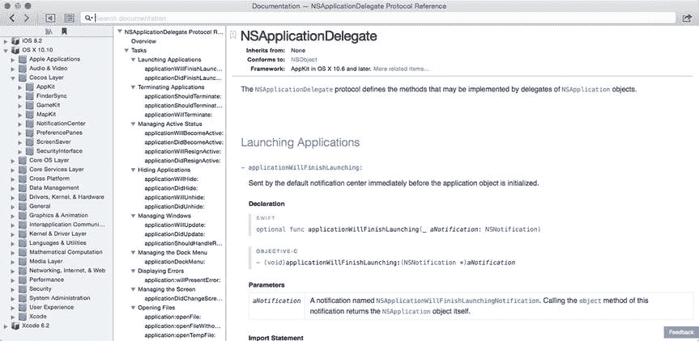

**图 4-18.** “文档”窗口中的 `NSApplicationDelegate` 协议

`AppDelegate` 类从 `NSObject` 类继承属性和方法，并使用 `NSApplicationDelegate` 协议定义的方法名。任何基于某个协议的类都必须编写 Swift 代码，以使这些协议方法实际执行某些操作。用技术术语来说，这被称为“实现或遵循一个协议”。

因此，Cocoa 框架实际上由类和协议组成。类定义对象，而协议定义不同类可能需要的常用方法名。

当您编写 OS X 程序时，您经常会同时使用 Cocoa 框架类和协议。当您使用 Cocoa 框架类时，您可以使用已经知道如何工作的现成方法，例如知道如何将文本转换为大写的 `uppercaseString` 方法。


当您使用 Cocoa 框架的协议时，需要编写 Swift 代码来使该方法实际生效。在浏览 Xcode 文档时，请留意类与协议之间的这种差异。

我们来看一个在 Xcode 文档窗口中同时展示类与协议的示例：

确保您的 `MyFirstProgram` 已在 Xcode 中加载。单击项目导航器中的 `AppDelegate.swift` 文件。Xcode 的中间窗格会显示该 `.swift` 文件的内容。将光标移动到 `NSApplicationDelegate` 上。选择“帮助”>“为选中项快速查看”，或按住 Option 键并单击 `NSApplicationDelegate`。此时会弹出一个快速帮助窗口，如图 [4-19] 所示，解释 `NSApplicationDelegate` 是一个协议。

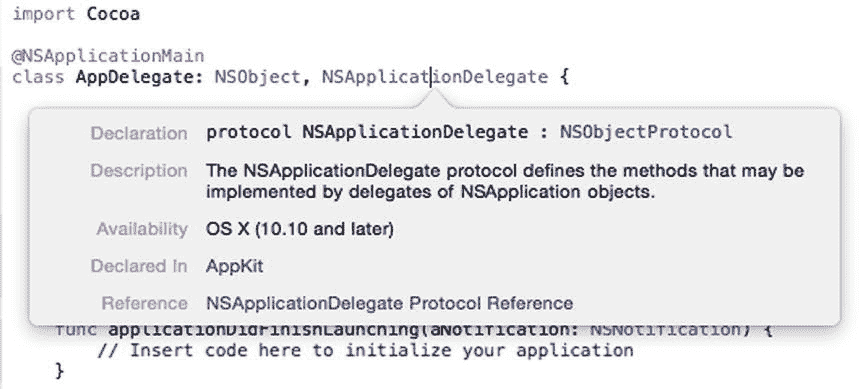

图 4-19. `NSApplicationDelegate` 快速帮助弹出窗口

单击 `NSApplicationDelegate Protocol Reference`。该协议参考文档会出现在文档窗口中（见图 [4-18]）。在文档窗口的“搜索文档”字段中输入 `NSTextField` 并按下 Return 键。注意，文档窗口会说明 `NSTextField` 继承自哪些类（标签为 `Inherits from:`），以及处理用户界面项时哪些协议可能有用（标签为 `Conforms to:`），如图 [4-20] 所示。

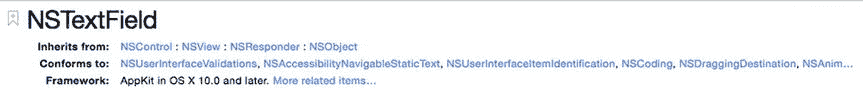

图 4-20. 查看相关类与协议

协议可以向类添加方法，而无需创建新类，但您并不一定要使用协议。当您在 Xcode 中编写程序时，会用到 Cocoa 框架的类与协议。随后，根据您程序的特定需求，您很可能也会创建自己的类与协议。

在浏览 Xcode 文档时，请在编写自己的代码之前，先查看类中的属性和方法。如果您在一个类中没有找到所需的属性和方法，可以查看 `Inherits from:` 标签旁边列出的其他类。

如果您需要一些有用的方法，可以查看 `Conforms to:` 标签旁边列出的不同协议。只有当您确定相关类或协议中不存在某个属性或方法时，才应该编写您自己的 Swift 代码来实现功能。

例如，在 `MyFirstProgram` 项目中，我们本可以编写 Swift 代码来将文本字段中输入的文字转换为大写。然而，直接使用现有的 `uppercaseString` 方法要简单得多。这样节省了我们编写和调试代码的时间，因为我们直接使用了 Cocoa 框架中经过验证的代码。

您对 Cocoa 框架了解得越多，编写自己的程序时要做的工作就越少。请利用 Xcode 的文档来帮助您更好地理解构成整个 Cocoa 框架的所有类与协议。

由于 Cocoa 框架非常庞大，不要试图一次性学习所有内容。只需学习您需要的部分，忽略其余部分。随着您越来越多地使用 Xcode 并编写程序，您很可能逐渐需要并学习 Cocoa 框架的其他部分。

总体思路是尽可能依赖 Cocoa 框架，只有在必要时才编写 Swift 代码。这样，您就能以更少的精力快速编写出可靠的软件。

## 总结

学习 Xcode 可能令人望而生畏，因此请慢慢来，依靠 Xcode 的文档学习。如果您急需帮助，请使用“快速查看”来查找有关 Cocoa 框架类的信息。如果您需要某个特定主题的帮助，请搜索文档。

当您只是出于好奇时，可以浏览 Xcode 针对 iOS、OS X 和 Xcode 本身提供的文档，从而了解其海量可用功能。通过随机浏览，您常常能了解到关于 Xcode 或为 iOS 与 OS X 编写程序的有趣信息。

如您所见，学习编写程序需要学习 Xcode、学习 Cocoa 框架以及学习 Swift 编程语言。放轻松，只学习您需要了解的内容，并逐步扩展您的知识。通过稳步前进，您将学到越来越多，直到有一天您会发现自己实际上已经掌握了如此多的知识。

学习使用 Xcode 为 iOS 和 OS X 编写程序不是一蹴而就的事，但您会惊讶于通过日积月累的稳步进步能学到多少东西。只需坚持练习编写程序，并依赖“帮助”菜单中的 Xcode 文档。在您意识到这一点之前，您将能够自信地编写小型程序，并最终编写更大、更复杂的程序。


