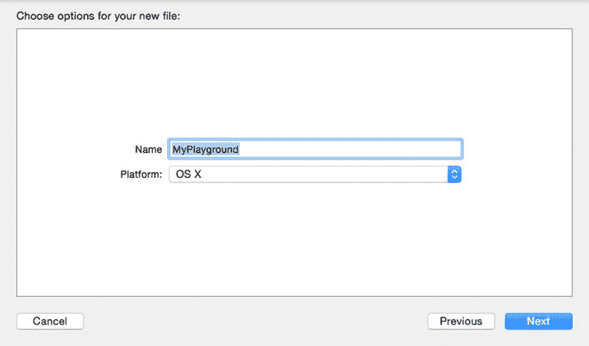
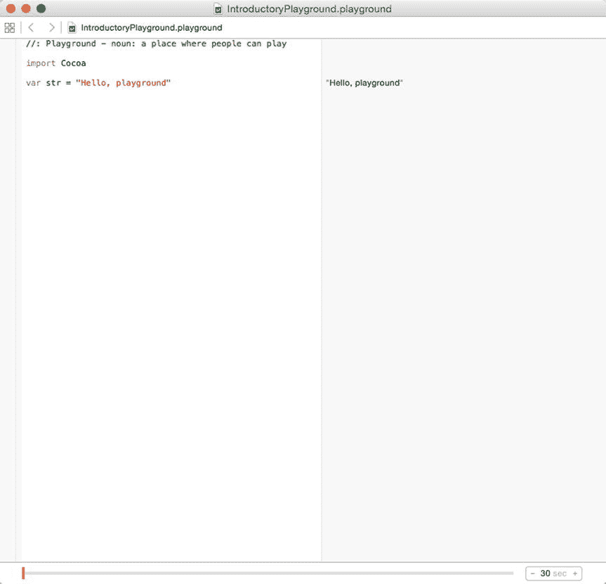
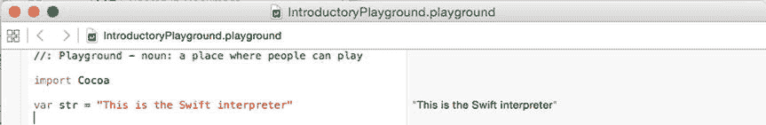

# 5. 学习 Swift

电子补充材料 本章的在线版本（doi:[10.​1007/​978-1-4842-1233-2_​5](http://dx.doi.org/10.1007/978-1-4842-1233-2_5)）包含补充材料，仅供授权用户使用。

要编写任何程序，都需要选择一门编程语言。编程语言允许你定义计算机要执行的命令。没有所谓的“最佳”编程语言，因为每种编程语言都是为了解决特定问题而设计的。这意味着，一种编程语言可能擅长解决某类问题，但在解决其他类型问题时可能表现糟糕。

对于大多数编程语言来说，易用性和效率之间需要权衡。例如，`BASIC` 编程语言旨在易于学习和使用，而 `C` 编程语言则旨在让你完全控制计算机。通过最大化计算机效率，`C` 语言非常适合创建诸如操作系统或硬盘实用程序之类的复杂程序。

由于 `BASIC` 从设计之初就不是为了最大限度控制计算机，因此它永远不会被用来创建操作系统或硬盘实用程序。而 `C` 语言虽为最大化计算机效率而设计，但对于新手来说很难学习，即使对有经验的程序员来说也很难使用。许多程序中的大多数错误或缺陷完全归咎于 `C` 编程语言的复杂性，这种复杂性甚至会让拥有数十年经验的专业程序员感到困惑。

在 Xcode 的世界里，苹果公司的官方编程语言曾经是 `Objective-C`，它是 `C` 编程语言的一个超集，也是面向对象 `C++` 语言的一个替代方案。不幸的是，`Objective-C` 仍然很难学习，更难精通。`Objective-C` 让编程变得不必要的复杂，使得为新手和经验丰富的程序员创建 OS X 和 iOS 软件都变得困难。

这就是为什么在 2014 年，苹果公司推出了一门名为 `Swift` 的新编程语言。`Swift` 旨在拥有与 `Objective-C` 同等的强大功能，同时更易于学习。由于苹果公司将把 `Swift` 同时用于 OS X 和 iOS 编程，`Swift` 现在已成为 Macintosh、iPhone、iPad、Apple Watch、Apple TV、CarPlay 以及苹果公司未来任何其他产品的未来编程语言。

由于很多人一直在使用 `Objective-C` 编写程序，将来仍然需要程序员来修改现有的 `Objective-C` 程序。但是，你始终可以在一个程序里混合使用 `Objective-C` 和 `Swift`。这意味着随着时间的推移，对 `Objective-C` 程序员的需求将会减少，而对 `Swift` 程序员的需求将会增加。如果你想学习用于编写 OS X 和 iOS 程序的最强大编程语言，那么你需要学习 `Swift`。

**注意**  
如果你已经熟悉 `Objective-C`，你会注意到 `Swift` 在多个方面让编码变得更容易。首先，`Swift` 不需要用分号来结束每一行。其次，`Swift` 不需要用星号表示指针，也不需要对方括号来表示对象的方法调用。第三，`Swift` 将所有内容存储在一个单独的 `.swift` 文件中，而 `Objective-C` 则需要创建一个 `.h` 头文件和一个 `.m` 实现文件。如果你对 `Objective-C` 一无所知，只需看一下任何用 `Objective-C` 编写的程序，就能体会到代码有多令人困惑。看一眼 `Objective-C` 代码，你就会意识到学习和使用 `Swift` 要容易得多。

## 使用 Playgrounds

在过去，程序员有两种工具可以帮助他们学习编程。第一种叫做解释器。解释器允许你输入一条命令，然后立即显示结果。这样你就能确切地看到自己做对了什么或做错了什么。

解释器的缺点是速度慢，并且你不能用它来创建可以销售的程序。要在解释器中运行程序，你需要解释器和包含所有用特定编程语言编写的命令的文件（称为源代码）。因为你需要提供源代码才能在解释器中运行程序，所以其他人可以轻易地复制你的程序并窃取它。因此，解释器仅对学习语言有用，但不适合用于销售软件。

程序员用来学习编程的第二种工具叫做编译器。编译器获取存储在文件中的命令列表，并将其转换为机器语言，以便计算机能够理解。编译器的优点是可以防止他人看到你程序的源代码。

使用编译器的问题在于，你必须编写一个完整的程序并编译它，才能知道你的命令是否有效。如果命令无效，你就得回去修复问题。与解释器的交互式特性不同，编译器使得学习编程语言的过程更慢、更笨拙。

使用解释器，你可以编写一条命令并立即看到它是否有效。而使用编译器，你必须先编写命令，然后编译程序，最后运行程序才能知道它是否有效。

解释器更适合学习，而编译器更适合创建那些可以分发给他人且无需提供源代码的软件。幸运的是，Xcode 为你提供了两全其美的方案。

当你运行程序时，你使用的是 Xcode 的编译器。然而，如果你只是想试验一些命令，你可以使用 Xcode 的解释器，它被称为 `Playground`（游乐场）。

Playgrounds 让你可以试验 `Swift` 代码，看看它是否有效。当你让代码正常工作后，就可以将其复制粘贴到你的项目文件中，然后编译它们以创建一个可运行的程序。Xcode 赋予你同时使用解释器和编译器的能力，这使得学习 `Swift` 变得容易，并且对于创建你可以出售或赠送给他人的程序来说也很实用。

要创建一个 playground，请遵循以下步骤：

1. 启动 Xcode。
2. 选择 **文件 ➤ 新建 ➤ Playground**。（如果你看到 Xcode 欢迎屏幕，也可以点击 **开始使用 playground**。）Xcode 会要求你输入 playground 的名称和平台，如图 5-1 所示。

**图 5-1.** 创建一个 playground 文件

3. 点击 **名称** 文本字段，输入 `IntroductoryPlayground`。
4. 点击 **平台** 弹出菜单，选择 `OS X`。Xcode 会询问你想将 playground 文件保存在哪里。
5. 点击你想保存 playground 文件的文件夹，然后点击 **创建** 按钮。Xcode 会显示 playground 文件，如图 5-2 所示。

**图 5-2.** Playground 窗口

6. 将第二行编辑为如下内容：`var str = "This is the Swift interpreter"`

请注意，playground 窗口会立即在右侧空白处显示代码更改的结果，如图 5-3 所示。

**图 5-3.** Playground 窗口会立即显示代码更改

Playgrounds 让你可以自由地试验 `Swift` 并访问 Cocoa 框架中的每个类，而无需担心让你的 `Swift` 代码与用户界面协同工作。

