# 排版后的 Markdown 内容

## 在 Swift 中创建注释

在任何编程语言中，最简单的命令就是注释。注释是仅为人阅读而存在的任何文本。在 Playground 文件的顶部，你可以看到一条以绿色显示的注释：

`// Playground – noun: a place where people can play`

注释允许你留下关于代码的笔记，例如编写者的姓名、最后修改的日期、代码功能的描述以及它所依赖的其他文件，或者任何你认为对你（或其他程序员）未来阅读有用的信息。

如果你只需要在单行上编写注释，可以使用 `//` 符号。任何出现在 `//` 符号右侧的内容都是注释，计算机会完全忽略它们。Xcode 通过将文本显示为绿色来帮助你识别注释。

如果你需要编写跨越多行的注释，可以在每一行前面输入多个 `//` 符号，但另一种解决方案是使用 `/*` 符号来定义注释的开始，并使用 `*/` 符号来定义注释的结束，例如：

`/* This is a comment that`

`spans multiple lines */`

注释是为你的便利而存在的，因此当你需要编写和存储关于代码的关键信息时，可以随时使用它们。

**注意**

注释的一个流行用途是临时禁用 Swift 代码，而无需将其删除。通过将一行或多行 Swift 代码变成注释来禁用它们，你可以观察程序的运行效果，就像这些被注释掉的代码行被删除了一样。测试完成后，你可以移除注释符号，将代码重新放回程序中，而无需重新输入。

## 在 Swift 中存储数据

每个程序都需要接收数据，以某种方式处理这些数据，并将结果展示给用户。为了接收数据，程序需要将数据临时存储在内存中。从技术上讲，计算机将数据存储在内存地址中，而这些地址可能难以记忆。为了更容易知道数据存储的位置，编程语言允许你为这些内存地址赋予描述性的名称。在 Swift 中，这两种选择被称为：

*   变量
*   常量

变量和常量背后的理念是，你定义一个描述性的名称，并将其赋值为存储数据，例如：

`str = "This is the Swift interpreter"`

在上面的例子中，`str` 是描述性名称，而 `"This is the Swift interpreter"` 是被存储的数据。数据可以是文本字符串，也可以是数字，例如整数（3, 12, -9 等）或小数，也称为浮点数（12.84, -0.83, 8.02 等）。在任何给定时间，你只能在描述性名称中存储一块数据，该名称可以被定义为变量或常量。

变量和常量的主要区别在于，你可以根据需要多次重用变量来存储新数据（因此得名“变量”）。而常量只允许你向其中存储一次数据。

要定义一个变量，你必须像这样使用 `var` 关键字：

`var str = "This is the Swift interpreter"`

要定义一个常量，你必须像这样使用 `let` 关键字：

`let str = "This is the Swift interpreter"`

当你第一次向变量或常量中存储数据时，Swift 会推断数据类型，例如：

*   文本字符串（定义为 `String`）
*   整数（定义为 `Int`）
*   小数（由 `Float` 和 `Double` 定义）

了解变量或常量可以容纳的数据类型至关重要，因为它只能容纳一种数据类型，而不能是其他类型。因此，如果你创建了一个变量并存储了一个字符串，那么该变量从现在起就只能存储字符串。

**注意**

Swift 被称为一种类型安全的编程语言，因为它明确定义了每个变量或常量可以存储的数据类型。

为了明确变量或常量可以容纳何种数据类型，你可以显式地定义数据类型，例如：

`var cat: String`

`var dog: Int`

`var fish: Float`

`var snake: Double`

基于这些数据类型声明，`cat` 变量只能存储字符串，`dog` 变量只能存储整数，`fish` 变量只能存储浮点数，而 `snake` 变量只能存储双精度浮点数。

如果你试图向变量或常量中存储错误类型的数据，Swift 不会允许。这是为了防止程序在尝试使用错误数据类型时出现问题。例如，如果程序询问用户要订购多少件商品，而用户输入的是 "five" 而不是数字 5，程序将不知道如何对 "five" 进行数学计算，这会导致程序崩溃或运行异常。

**注意**

`Float` 和 `Double` 数据类型都可以存储小数。区别在于 `Double` 数据类型可以存储更精确的小数，包含更多的小数位以及更小和更大的值。如果你只是需要使用小数，请使用 `Float`，因为它比 `Double` 占用更少的内存。如果你需要对小数进行精确计算，请使用 `Double`。当 Swift 推断一个小数时，它会推断为 `Double` 数据类型。

Swift 提供了三种定义变量或常量的方式：

*   `let cat = "Oscar" // 推断为 String 数据类型`
*   `let cat: String = "Oscar"`
*   `let cat: String` `cat = "Oscar"`

第一种方法允许你直接将数据存储到变量或常量中。根据你首次存储的数据类型，Swift 会推断数据类型为 `String`、`Int` 或 `Double`（而不是 `Float`，因为 `Float` 存储的小数精度低于 `Double`，而 Swift 假设你想要精确的精度）。


## Swift 变量与常量声明

第二种方法允许你显式声明数据类型，并将数据存储到该变量或常量中。虽然这可能会更冗长，但它清楚地表明了你要存储的数据类型。

第三种方法需要两行代码。第一行定义数据类型，第二行实际存储属性类型的数据。这对于可能在程序不同部分被赋予不同数据的变量来说非常方便。你可以在文件顶部附近声明变量以便于查找，然后在需要时再为其赋值。

要了解如何在 Swift 中声明变量和常量，请遵循以下步骤：

1.  确保你的`IntroductoryPlayground`文件已加载到 Xcode 中。
2.  将 playground 文件中的 Swift 代码修改如下：

    ```
    import Cocoa
    let cat: String
    cat = "Oscar"
    cat = "Bo"
    ```

    请注意，当你尝试向已包含数据的常量分配新数据时，会收到一条错误消息。点击左边距中的警告图标会显示一条错误消息，如图 5-4 所示。

    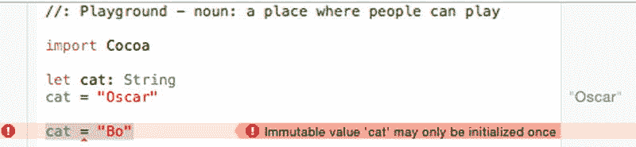

    图 5-4。一条错误消息警告你不能多次将数据存储到常量中。

    **注意**

    常量也被称为“不可变的”，因为一旦你向其中存储了数据，就不能更改。变量被称为“可变的”，因为你可以不断更改它们存储的数据。请记住，变量一次只能保存一块数据。当你向变量中存储新数据时，该变量中任何现有的数据都会被清除。

3.  将 playground 文件中的 Swift 代码修改为将常量更改为变量（将`let`替换为`var`），如下所示：

    ```
    import Cocoa
    var cat: String
    cat = "Oscar"
    cat = 42.7
    ```

    请注意，当你尝试向一个只能保存字符串的变量分配数字时，会收到一条警告。点击左边距中的警告图标会显示一条错误消息，如图 5-5 所示。

    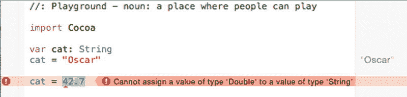

    图 5-5。一条错误消息警告你不能存储错误类型的数据。

4.  将 playground 文件中的 Swift 代码修改如下：

    ```
    import Cocoa
    var cat: String
    cat = "Oscar"
    var greeting = "Hello, "
    var period : String = "."
    print (greeting + cat + period)
    ```

    请注意，playground 会在右边距显示 Swift 代码的结果，如图 5-6 所示。

    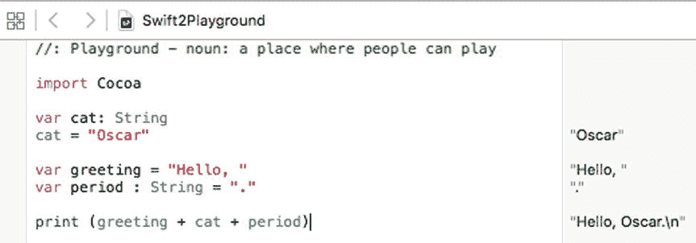

    图 5-6。playground 窗口的右边距会持续显示代码的结果。

### 类型别名

将变量声明为`Int`、`Double`或`String`等数据类型，只告诉你可以保存哪种类型的数据，但并不说明该数据的含义。例如，如果你将两个变量声明为`Int`数据类型，每个变量都可以保存整数，但一个变量可能代表年龄，另一个变量可能代表员工 ID 号。

为了使数据类型的目的更清晰，Swift 允许你使用一种叫做类型别名的东西。类型别名允许你为泛型数据类型名称提供一个描述性名称，例如：

```
typealias EmployeeID = Int
```

现在，你不是将变量声明为整数（`Int`）数据类型，而是可以将其声明为`EmployeeID`数据类型，例如：

```
typealias EmployeeID = Int
var employee : EmployeeID
employee = 192
```

这等价于：

```
var employee : Int
employee = 192
```

## 使用 Unicode 字符作为名称

在大多数编程语言中，变量和常量被限制在固定的字符范围内，通常排除外语字符。为了帮助其他语言的程序员更方便地使用 Swift，Swift 允许你使用 Unicode 字符作为变量和常量名称。

Unicode 是一种新的通用标准，代表不同的字符。如果你选择“编辑”->“表情与符号”，你可以从中选择有限数量的字符，用于替代或补充普通的字母和数字，如图 5-7 所示。

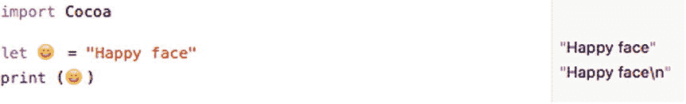

图 5-7。Xcode 允许你使用特殊字符作为变量或常量名称。

要了解如何在变量名称中使用特殊字符，请遵循以下步骤：

1.  确保你的`IntroductoryPlayground`文件已加载到 Xcode 中。
2.  删除 playground 中除`import Cocoa`行之外的所有代码。
3.  在`import Cocoa`行下方，输入`let`并按下空格键。
4.  选择“编辑”->“表情与符号”。会弹出一个窗口，如图 5-8 所示。

    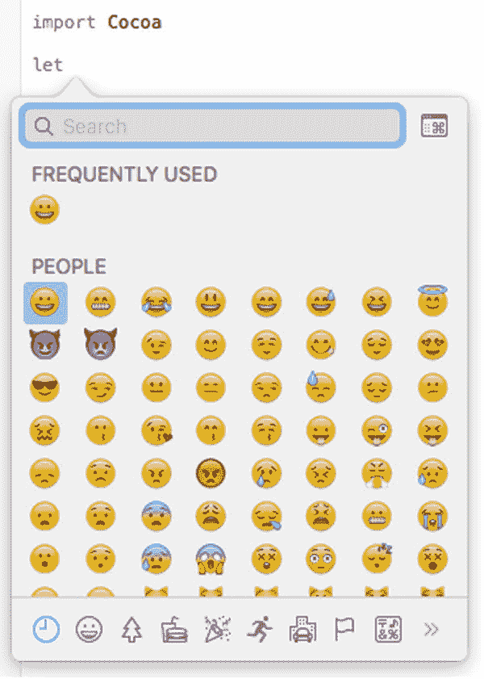

    图 5-8。一个包含不同类别特殊字符的弹出窗口。
5.  点击任何看起来有趣的字符。Xcode 会将该字符作为常量名称输入。
6.  输入`= "Funny symbol here"`并按下回车键。
7.  复制该字符并将其粘贴到`print`命令的括号之间。请注意，playground 窗口的右边距会显示常量变量的内容，如图 5-9 所示。

    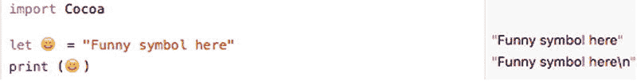

    图 5-9。在 Swift 代码中使用特殊字符作为常量名称。

特殊字符对于显示实际的数学符号（而不是拼写出来）或以外语输入变量/常量名称非常有用。通过使变量和常量名称更加通用，Swift 使编程对更多人来说更易理解。

## 转换数据类型

如果你有一个存储为整数的数字，需要将其转换为小数，或者你有一个小数，需要将其转换为整数，该怎么办？答案是，你可以通过指定你想要的数据类型来将一种数字数据类型转换为另一种，例如：

```
Int(decimal)
```

前面的`Int`数据类型告诉 Swift 将括号内的数字转换为整数。如果这个数字是小数，将其转换为整数基本上意味着丢弃小数点后的所有数字，因此像`4.9`这样的数字将被转换为整数`4`。

当 Swift 将整数转换为小数时，它只是简单地添加一个小数点和零。因此，如果你将整数`75`转换为浮点数，Swift 现在会将其存储为`75.0`。要了解如何将整数转换为小数（反之亦然），请遵循以下步骤：

1.  确保你的`IntroductoryPlayground`文件已加载到 Xcode 中。
2.  将 playground 文件中的代码修改如下：

    ```
    import Cocoa
    var whole : Int = 4
    var decimal : Double = 4.902
    print (Int(decimal))
    print (Double(whole))
    ```

3.  请注意 Swift 如何将整数转换为小数（将`4`更改为`4.0`），以及如何通过丢弃小数点右侧的所有值来将小数转换为整数（将`4.902`更改为`4`），如图 5-10 所示。

    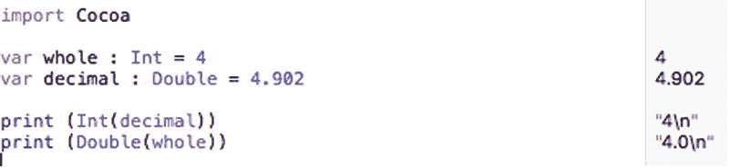

    图 5-10。将整数更改为小数，反之亦然。


## 计算属性

到目前为止，声明变量和常量，然后将数据赋值给这些变量或常量的方式，与其他编程语言差别不大。如果你有一个变量与另一个变量相关，可以这样操作：

```
var cats = 4
var dogs: Int
dogs = cats + 2
print(dogs)
```

遗憾的是，这种方式将 `dogs` 变量的声明与 `dogs` 变量实际值的赋值分离开来。为了让变量声明与其定义代码保持关联，Swift 提供了名为计算属性（computed properties）的功能。

使用计算属性时，你不会直接将数据存入变量。相反，你定义变量可以持有的数据类型，然后利用其他变量或常量计算新值，再存储到该变量中。这种计算被称为 getter（取值器），其代码示例如下：

```
var dogs : Int {
    get {
        return cats + 2 // 用于计算值的代码
    }
}
```

上述代码声明了一个名为 `dogs` 的变量，该变量只能持有整数（`Int`）数据类型。然后，它在大括号内包含了称为 getter 的代码（由关键字 `get` 定义）。

实际上，你可以在 getter 的大括号内放置任意数量的 Swift 代码，但此示例只包含了最关键的一行，即使用 `return` 关键字返回一个值，该值会被存储到 `dogs` 变量中。

在此例中，它会获取 `cats` 变量（该变量必须在程序的其他地方被赋值）中存储的值，将其加 2，然后将这个新值存入 `dogs` 变量。修改 getter 中的代码，就会改变计算后存入 `dogs` 变量的值。

让我们按照以下步骤来看看这是如何工作的：

确保你的 `IntroductoryPlayground` 文件已在 Xcode 中加载。按照如下方式修改 playground 文件中的代码：

```
import Cocoa
var cats = 4
var dogs : Int {
    get {
        return cats + 2 // 用于计算值的代码
    }
}
print(dogs)
```

注意，playground 窗口的右侧栏显示了 `dogs` 的值，如图 5-11 所示。

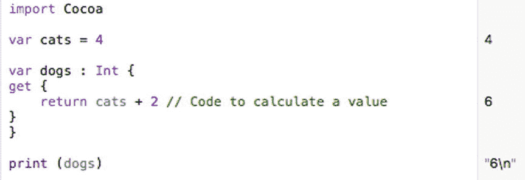

图 5-11.

playground 窗口右侧栏展示了 getter 部分的运行方式

Getter 通过代码来计算一个变量的值。第二种计算属性被称为 setter（设置器），它会运行代码来计算另一个变量的值。

每次给变量赋值时，setter 都会运行。要了解 getter 和 setter 如何工作，请按以下步骤操作：

确保你的 `IntroductoryPlayground` 文件已在 Xcode 中加载。按照如下方式修改 playground 文件中的代码：

```
import Cocoa
var cats = 4
var dogs : Int {
    get {
        return cats + 2 // 用于计算值的代码
    }
    set(newValue) {
        cats = 3 * newValue
    }
}
print(dogs)
print(cats)
dogs = 5
print(dogs)
print(cats)
```

注意

在上述 setter 代码中，`newValue` 实际上是一个可以省略的默认变量，例如：

```
set {
    cats = 3 * newValue
}
```

如果你想定义自己的变量名（而不是使用默认的 `newValue` 变量），那么必须将该新名称放在括号内，如下所示：

```
set (myOwnVariable){
    cats = 3 * myOwnVariable
}
```

注意，当你给 `dogs` 变量赋予不同值时，`cats` 和 `dogs` 变量的值会如何变化，如图 5-12 所示。

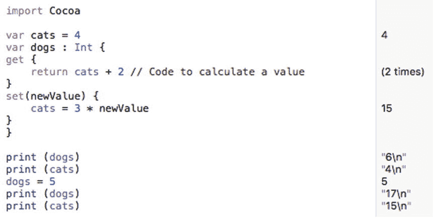

图 5-12.

playground 窗口右侧栏展示了 getter 和 setter 代码的运行方式

让我们逐行解析这段代码。首先，数字 4 被存入 `cats` 变量。在 getter 中使用 `cats` 变量（值为 4）会返回 `cats + 2` 即 `4 + 2`（结果为 6）。因此第一个 `print(dogs)` 命令打印出 6。

第二个 `print(cats)` 打印出 `cats` 变量的值，该值仍为 4。

当 `dogs` 变量被赋值为数字 5 时，setter 会运行。临时变量 `newValue` 被赋值为 5，并据此计算 `cats` 的新值为 `3 * newValue`，即 `3 * 5` 等于 15。此时 `cats` 变量的值被设为 15。

接下来运行 `print(dogs)` 命令，使用由 getter 计算出的 `dogs` 的值。由于 `cats` 的值是 15，getter 计算出 `cats + 2` 即 `15 + 2`，结果为 17。因此下一个 `print(dogs)` 命令打印出 17，而最后一个 `print(cats)` 命令打印出 15。

注意

计算属性可以在给变量赋值时运行代码。但是，请谨慎使用计算属性，因为它们可能使代码更难以理解。计算属性最常用于面向对象编程中的类属性。例如，如果一个对象代表屏幕上绘制的一个正方形，改变正方形的宽度必须同时改变其高度（反之亦然）。


## 使用可选变量

声明变量时最大的缺陷在于，在存储数据之前你无法使用该变量。如果在存储任何数据之前就尝试使用变量，程序将会运行失败并崩溃。为避免此问题，许多程序员会先在变量中存储“虚拟”数据。遗憾的是，程序仍可能使用这种“虚拟”数据并引发错误。

为了解决这个问题，Swift 提供了一种称为可选变量的机制。可选变量可以存储数据，也可以不存储任何内容。如果可选变量不包含任何内容，则视为它持有名为 `nil` 的值。通过使用可选变量，当变量不包含任何数据时，可以避免程序崩溃。

要创建可选变量，只需声明变量及其数据类型，并在末尾加上问号，如下所示：

```
var fish : String?
```

问号将变量标识为可选类型。你可以像使用普通变量一样，使用可选变量来存储数据，例如：

```
fish = "goldfish"
```

虽然在可选变量中存储数据与在普通变量中存储数据并无区别，但从可选变量中检索数据则需要额外的步骤。首先，你必须检查该可选变量是否包含数据。一旦确认可选变量包含数据，你就需要使用感叹号来解包该可选变量，以获取实际数据，例如：

```
print (fish!)
```

要了解可选变量如何工作，请尝试以下步骤：

确保你的 `IntroductoryPlayground` 文件已在 Xcode 中加载。按如下方式修改代码：

```
import Cocoa
var fish : String?
fish = "goldfish"
print (fish)
print (fish!)
```

请注意，`fish` 本身实际上是一个可选变量，但当你使用感叹号解包它时，你就能访问可选变量内部的真实数据，如图 5-13 所示。

在下方再输入两行代码：

```
var str : String
str = fish
```

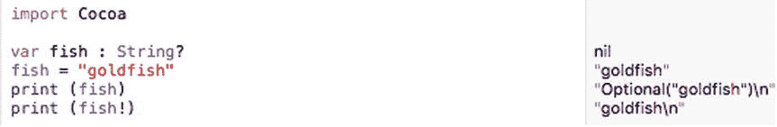

**图 5-13.** 查看可选变量与解包后数据的区别

请注意，你不能将可选变量 `fish` 赋值给 `str`，因为 `str` 只能存储 `String` 类型的数据。相反，你必须使用感叹号解包可选变量 `fish` 并检索其实际的字符串内容，如下所示：

```
var str : String
str = fish!
```

在解包可选变量以获取其数据之前，务必检查该可选变量包含的是 `nil` 值还是变量。如果尝试在可选变量包含 `nil` 值时使用它，程序将会崩溃。

要检查可选变量是否持有 `nil` 值，有两种选择。首先，你可以像这样显式检查 `nil` 值：

```
if fish != nil {
    print ("The optional variable is not nil")
}
```

这段代码检查 `fish` 可选变量是否不等于（`!=`）`nil`。如果可选变量不是 `nil`，那么它一定持有某个值，因此安全地检索它是安全的。

检查可选变量是否有值的第二种方法是将其赋值给一个常量，如下所示：

```
if let food = fish {
    print ("The optional variable has a value")
    print (food)
}
```

如果可选变量有值，它会将该值存储在一个常量（或另一个变量）中。现在你可以通过该常量或变量来访问该值。要了解其工作原理，请按照以下步骤操作：

确保你的 `IntroductoryPlayground` 文件已在 Xcode 中加载。按如下方式修改代码：

```
import Cocoa
var fish : String?
fish = "goldfish"
if fish != nil {
    print ("The optional variable is not nil")
    var str : String
    str = fish!
    print (str)
}
if let food = fish {
    print ("The optional variable has a value")
    print (food)
}
```

请注意，你可以通过使用感叹号解包可选变量，或将其存储在常量中然后使用该常量，来检索可选变量中的值，如图 5-14 所示。

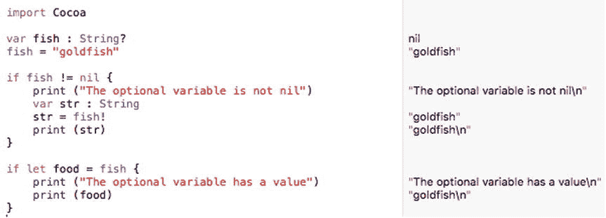

**图 5-14.** 访问可选变量中存储值的两种方法


## 将 Swift 代码与用户界面关联

每个程序都需要存储数据，而从用户界面获取数据并将其存入变量，是最常见的方法之一。要将用户界面元素关联到 Swift 代码，你需要创建一个 `IBOutlet` 变量。

如果你有一个文本字段连接到了某个 `IBOutlet` 变量，那么用户在文本字段中输入的任何内容都会自动存储到该 `IBOutlet` 变量中。同样地，你存储在该 `IBOutlet` 变量中的任何内容也会立刻出现在文本字段中。`IBOutlet` 变量就像一座桥梁，连接了你的 Swift 代码和用户界面，如图 5-15 所示。

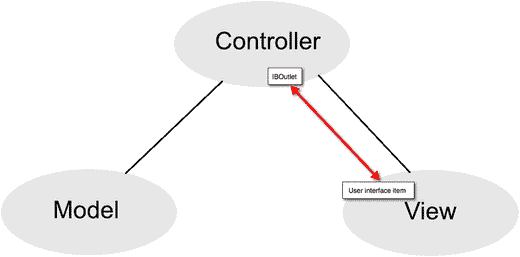

图 5-15. `IBOutlet` 变量将你的用户界面元素与 Swift 代码关联起来

由于文本字段等用户界面元素初始时可能为空，`IBOutlet` 变量通常被定义为隐式解包可选变量，并通过感叹号来声明，如下所示：

```
@IBOutlet weak var labelText: NSTextField!
```

如果将 `IBOutlet` 声明为普通变量，并连接到一个空的文本字段，那么当 `IBOutlet` 变量中没有数据时，程序可能会面临崩溃的风险。

如果将 `IBOutlet` 声明为可选变量，你可以用问号来定义它，如下所示：

```
@IBOutlet weak var labelText: NSTextField?
```

遗憾的是，每次你想访问这个可选变量中存储的数据时，都必须输入一个感叹号。如果多次访问该 `IBOutlet` 变量，每次都需输入感叹号，这既麻烦又会让代码看起来难以阅读。

为了让你在不总是输入感叹号的情况下就能访问 `IBOutlet` 变量，更简单的方法是将 `IBOutlet` 变量创建为隐式解包可选变量。这意味着，如果它有值，你就可以在不输入解包感叹号的情况下访问它。

要了解 Xcode 如何将 `IBOutlet` 创建为隐式解包可选变量，请打开你之前创建的 `MyFirstProgram` 项目：

确保你的 `MyFirstProgram` 已在 Xcode 中加载。点击项目导航器中的 `AppDelegate.swift` 文件。Xcode 的中间窗格将显示该 `.swift` 文件的内容。请注意，所有 `IBOutlet` 变量都使用感叹号声明，这意味着它们是隐式解包可选变量：`@IBOutlet weak var labelText: NSTextField!` 和 `@IBOutlet weak var messageText: NSTextField!`

同样注意，`IBAction changeCase` 方法让你无需使用感叹号即可访问这些隐式解包可选变量的内容。

```
@IBOutlet weak var labelText: NSTextField!
@IBOutlet weak var messageText: NSTextField!
@IBAction func changeCase(sender: NSButton) {
    labelText.stringValue = messageText.stringValue.uppercaseString
    let warning = labelText.stringValue
}
```

将每个 `IBOutlet` 变量末尾的感叹号替换为问号，如下所示：`@IBOutlet weak var labelText: NSTextField?` 和 `@IBOutlet weak var messageText: NSTextField?`

注意，每当使用 `IBOutlet` 变量时，Xcode 现在都会显示错误信息。这是因为你需要像这样用感叹号解包每个可选变量：

```
@IBAction func changeCase(sender: NSButton) {
    labelText!.stringValue = messageText!.stringValue.uppercaseString
    let warning = labelText!.stringValue
}
```

如果你将 `IBOutlet` 定义为普通的可选变量（用问号定义），那么你必须用感叹号解包每个可选变量才能访问其值。

如果你简单地将 `IBOutlet` 定义为隐式解包可选变量（Xcode 会自动为你这样做），那么你就不需要输入感叹号来解包这些可选变量了。

基本上，让 Xcode 将你的 `IBOutlet` 创建为隐式解包变量（带感叹号）可以使编写 Swift 代码更简便。

现在你可能会问，什么时候应该使用可选变量（用问号 `?` 定义），什么时候又该使用由感叹号 `!` 定义的隐式解包可选变量呢？

通常，对于 `IBOutlet`，使用隐式解包可选变量可以简化 Swift 代码的编写，免去到处输入感叹号的麻烦。如果在其他场合使用隐式解包可选变量，你的变量可能会包含 `nil` 值，而当你尝试使用它时，Xcode 不会捕捉到潜在的错误。

要了解使用隐式解包可选变量的风险，请遵循以下步骤：

确保你的 `IntroductoryPlayground` 文件已在 Xcode 中加载。按如下方式修改代码：
```
import Cocoa
var safe : Int?  // 可选变量
var danger : Int!// 隐式解包可选变量
print (danger * 2)
print (safe * 2)
```

注意，这两个整型变量都没有任何值，但 Xcode 却允许你对隐式解包可选变量中的 `nil` 值进行计算，而对于普通的可选变量，它会标记出可能的错误，如图 5-16 所示。

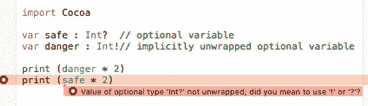

图 5-16. Xcode 能够识别未定义可选变量的潜在问题，但无法识别未定义隐式解包可选变量的问题

通过强制你用感叹号（`!`）解包可选变量，Xcode 迫使你承认正在使用可选变量，这样你就能记得检查它是否包含 `nil` 值。

由于隐式解包可选变量允许你直接输入变量名而无需额外的符号，因此你更容易忘记自己正在处理可选变量，并在使用前忘记检查可能的 `nil` 值。可选变量无法防止问题，但它们能强制你记住正在处理可能为 `nil` 的值。

## 总结

如果你来自其他编程环境，你会看到 Swift 与许多其他语言的不同之处。Swift 的 Playground 解释器让你在将代码复制粘贴到实际程序之前，可以安全地测试代码。Playground 为你提供了自由尝试 Swift 命令的环境。

你可以使用 `//` 符号创建单行注释。通过使用 `/*` 标记注释的开始，使用 `*/` 标记注释的结束，可以创建多行注释。

三种最常见的数据类型是整数（`Int`）、小数（`Float` 或 `Double`）和文本字符串（`String`）。如果需要对小数实现绝对精度，请使用 `Double` 数据类型。否则直接使用 `Float` 即可。

为了更容易理解数据类型，你可以使用 `typealias`，它允许你用一个描述性名称来代替常见的数据类型。为了让变量名更灵活，你可以使用 Unicode 字符，这些字符可以表示符号或外语字符。

将数据存储在变量中，可以简单到直接将值赋给它。Swift 还提供了计算属性，允许你在赋值新值时修改一个变量或另一个变量。计算属性在处理类和面向对象编程时尤其有用。

更重要的是可选变量，它允许你处理 `nil` 值而不会导致程序崩溃。在使用 `IBOutlet` 将 Swift 代码与标签和文本字段等用户界面元素连接时，可选变量尤其重要。

当你创建一个可选变量（使用问号）时，你需要对其进行解包（使用感叹号）才能访问其实际数据。

变量对于临时存储数据至关重要，因此你会经常使用它们。当你开始学习类和面向对象编程时，你会使用变量来定义属性。本质上，任何时候你需要存储一块数据时，都需要声明一个变量来保存它。


