# 6. 处理数字与字符串

电子补充材料 本章的在线版本（doi:[10.​1007/​978-1-4842-1233-2_​6](http://dx.doi.org/10.1007/978-1-4842-1233-2_6)）包含补充材料，仅供授权用户使用。

每个程序都需要在变量中临时存储数据。然而，为了让程序变得有用，它还必须以某种方式处理这些数据，从而计算出有用的结果。电子表格能让你对数字进行加、减、乘、除运算。文字处理器会处理文本，以纠正拼写错误并格式化文本。就连电子游戏也会响应摇杆的移动，为玩家的对象（如卡通人物、飞机或汽车）计算新的位置。利用数据计算出新的结果，这正是每个程序的全部目的。

为了处理数字，Swift 提供了四种基本的数学运算符：加法（`+`）、减法（`-`）、乘法（`*`）、除法（`/`），以及一个取余运算符（`%`）。你甚至可以使用加法运算符（`+`）来处理字符串，从而将两个字符串合并为一个。

尽管 Swift 包含多种用于处理数字和文本的运算符，但 Cocoa 框架提供了大量功能更强大的函数来处理数字和字符串。如果这些函数都不适用，你随时可以创建自己的函数来处理文本和数字数据。通过创建名为函数的迷你程序，你可以以任何你喜欢的方式处理数据，并根据需要重复使用函数。

## 使用数学运算符

处理数字最简单的方法就是执行加法、减法、除法或乘法运算。处理数字时，首先要确保所有数字都是相同的数据类型，比如全部是整数，或者全部是 `Float` 或 `Double` 小数。由于将整数与小数混合使用可能会导致计算错误，Swift 会强制你在一次计算中使用完全相同的数据类型。如果你的所有数据并非同一数据类型，则需要转换其中一种或多种数据类型，例如：

```
var cats = 4
var dogs = 5.4
dogs = Double(cats) * dogs
```

在这个例子中，Swift 推断 `cats` 是 `Int` 数据类型，`dogs` 是 `Double` 数据类型。要将 `cats` 和 `dogs` 相乘，它们必须是相同的数据类型（`Double`），因此我们必须先将 `cats` 的值转换为 `Double` 数据类型，然后计算才能安全地进行。

当使用多个数学运算符时，请使用括号来定义计算的先后顺序。Swift 通常从左到右计算数学运算符，但乘法和除法的优先级高于加法和减法。如果你输入以下 Swift 代码，仅因数学计算顺序不同，就会得到两个不同的结果：

```
var cats, dogs : Double
dogs = 5 * 9 - 3 / 2 + 4      // 47.5
cats = 5 * (9 - 3) / (2 + 4)  // 5.0
```

为了清晰起见，始终用括号将数学运算符分组。最常见的数学运算符被称为二元运算符，因为它们需要两个数字来计算一个结果，如表 6-1 所示。

**表 6-1.** Swift 中的常见数学运算符

| 数学运算符 | 用途 | 示例 |
| --- | --- | --- |
| `+` | 加法 | `5 + 9 = 14` |
| `-` | 减法 | `5 - 9 = -4` |
| `*` | 乘法 | `5 * 9 = 45` |
| `/` | 除法 | `5 / 9 = 0.555` |
| `%` | 取余 | `5 % 9 = 5` |

在这些数学运算符中，取余运算符可能需要额外解释一下。实质上，取余运算符是用一个数除以另一个数，然后只返回该除法的余数。因此，5 除以 9 等于 0 余 5，而 26 除以 5 的余数则为 1。

### 前缀与后缀运算符

当使用加法或减法运算符进行加 1 或减 1 操作时，Swift 为你提供了两种选择。首先，你可以像这样编写简单的数学语句：

```
var temp : Int = 1
temp = temp + 1
temp = temp - 1
```

作为一种快捷方式，Swift 还提供了称为前缀和后缀的自增和自减运算符。因此，如果你想给任何变量加 1，只需要执行以下任一操作：

```
var temp : Int = 1
++temp
--temp
```

`++` 或 `--` 运算符告诉 Swift 对该变量进行加 1 或减 1 操作。当 `++` 或 `--` 运算符出现在变量之前时，这称为前缀，意味着在使用该变量之前先对其进行加 1 或减 1 操作。

如果 `++` 或 `--` 运算符出现在变量之后，这称为后缀，意味着在使用该变量之后再对其进行加 1 或减 1 操作。

为了了解这些不同的自增和自减运算符是如何工作的，请按照以下步骤创建一个新的 playground：

1. 启动 Xcode。
2. 选择“文件” ➤ “新建” ➤ “Playground”。（如果你看到 Xcode 欢迎界面，也可以点击“开始使用 playground”。）Xcode 会要求输入 playground 名称和平台。
3. 点击“名称”文本字段并输入 `MathPlayground`。
4. 点击“平台”弹出菜单并选择“OS X”。Xcode 会询问你想将 playground 文件保存在哪里。
5. 点击一个你想要保存 playground 文件的文件夹，然后点击“创建”按钮。Xcode 会显示该 playground 文件。
6. 按如下方式编辑代码：

```
import Cocoa
var temp, temp2 : Int
temp = 1
temp2 = temp
print (++temp)
print (temp2++)
print (temp2)
```

请注意，前缀运算符（`++temp`）在使用该变量之前先对其加 1，而后缀运算符（`temp++`）则先使用该变量值，然后再对其加 1，如图 6-1 所示。

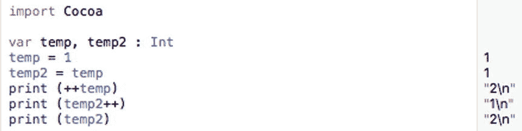

**图 6-1.** 了解前缀和后缀运算符的工作原理

### 复合赋值运算符

自增（`++`）和自减（`--`）运算符允许你对变量进行加 1 或减 1 操作。如果你想对变量进行加或减 1 以外的数值，你可以使用看起来像这样的复合赋值运算符（`+=`）或（`-=`）。

要使用复合赋值运算符，你需要指定一个变量、你想要使用的复合赋值运算符，以及你想要加或减的数值，例如：

```
temp += 5
```

这等同于：

```
temp = temp + 5
```

为了了解复合赋值运算符是如何工作的，请按照以下步骤操作：

1. 确保你的 `MathPlayground` 文件已在 Xcode 中加载。
2. 按如下方式编辑代码：

```
import Cocoa
var temp : Int
temp = 2
temp += 57              // 等同于 temp = temp + 57
print (temp)
temp -= 7               // 等同于 temp = temp - 7
print (temp)
```

如图 6-2 所示，`+=` 复合赋值运算符将 57 加到 `temp` 的当前值上。然后 `-=` 复合赋值运算符从 `temp` 的当前值中减去 7。

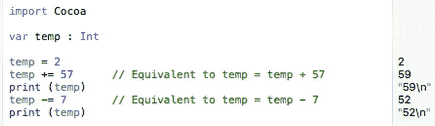

**图 6-2.** 了解复合赋值运算符的工作原理

通过组合数学运算符，你可以创建任何类型的计算。然而，如果你需要执行常见的数学运算，例如求一个数的平方根或对数，使用 Cocoa 框架中内置的数学函数会更加简单可靠。

## 使用数学函数

Cocoa 框架提供了数十个数学函数，你可以通过选择“帮助” ➤ “文档和 API 参考”来查看它们。当“文档”窗口出现时，键入 `math`，然后在“API 参考”类别下选择 `math`，如图 6-3 所示。

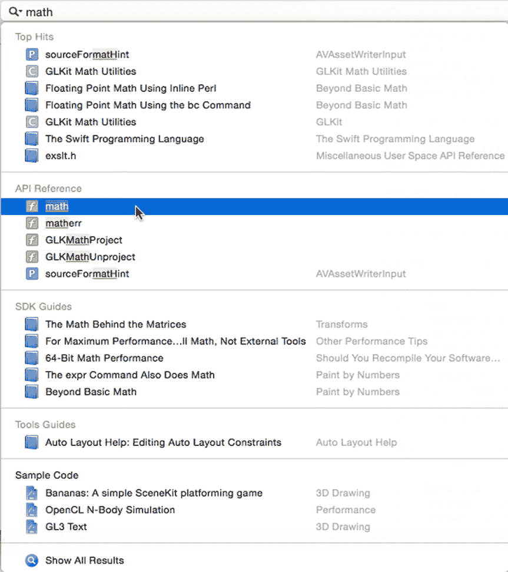

**图 6-3.** 在“文档”窗口中查看所有数学函数的列表

你可能不会用到或需要所有可用的数学函数。一些比较常见的数学函数包括：

*   取整函数
*   计算函数（`sqrt`、`cbrt`、`min`/`max` 等）
*   三角函数（`sin`、`cosine`、`tangent` 等）
*   指数函数
*   对数函数


### 舍入函数

在处理十进制数时，你可能需要将它们舍入到最接近的位值。不过，在 Swift 中有多种舍入数字的方式，例如：

- `round` – 将 0.5 及以上舍入，将 0.49 及以下舍去
- `floor` – 向下舍入到最接近的整数
- `ceil` – 向上舍入到最接近的整数
- `trunc` – 截断小数部分

要了解这些不同的舍入函数是如何工作的，请按照以下步骤创建一个新的 playground：

确保 MathPlayground 文件已在 Xcode 中加载。按如下方式编辑代码：

```
import Cocoa
var testNumber : Double
testNumber = round(36.98)
testNumber = round(-36.98)
testNumber = round(36.08)
testNumber = floor(36.98)
testNumber = floor(-36.98)
testNumber = floor(36.08)
testNumber = ceil(36.98)
testNumber = ceil(-36.98)
testNumber = ceil(36.08)
testNumber = trunc(36.98)
testNumber = trunc(-36.98)
testNumber = trunc(36.08)
```

请注意每种舍入函数在正负数上的不同工作方式，以及每个函数是如何向上或向下舍入的，如图 6-4 所示。

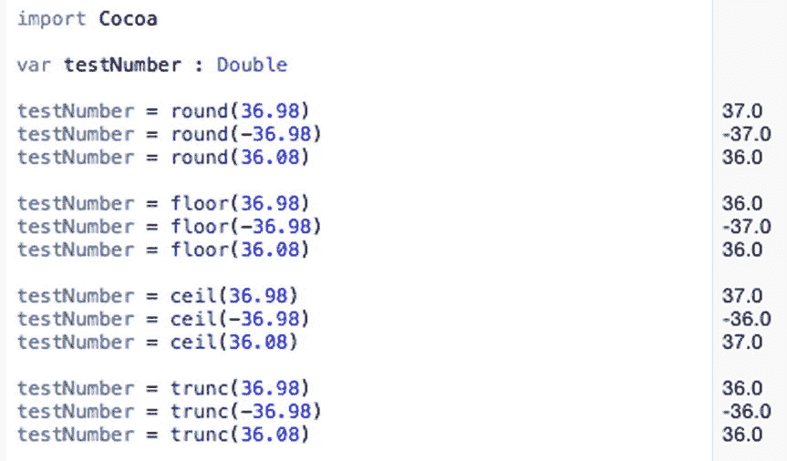

图 6-4. 观察不同舍入函数的工作方式

### 计算函数

你可以结合 Swift 的四种基本数学运算（加、减、除、乘）来创建任意复杂的计算。不过，Cocoa 框架包含了一些常用的数学函数，这样你就不必从头自己创建了。一些常见的计算函数包括：

- `fabs` – 计算一个数的绝对值
- `sqrt` – 计算一个正数的平方根
- `cbrt` – 计算一个正数的立方根
- `hypot` – 计算 (x*x + y*y) 的平方根
- `fmax` – 找出两个数中的最大值
- `fmin` – 找出两个数中的最小值

要了解这些不同的计算函数是如何工作的，请按照以下步骤操作：

确保你的 MathPlayground 已在 Xcode 中加载。按如下方式编辑代码：

```
import Cocoa
var testNumber : Double
testNumber = fabs(52.64)
testNumber = fabs(-52.64)
testNumber = sqrt(5)
testNumber = cbrt(5)
testNumber = hypot(2, 3)
testNumber = fmax(34.2, 89.2)
testNumber = fmin(34.2, 89.2)
```

请注意每种计算函数的不同工作方式，如图 6-5 所示。

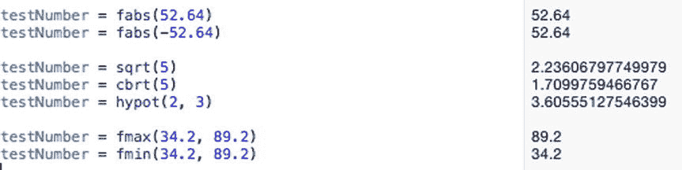

图 6-5. 观察不同计算函数的工作方式

### 三角函数

如果你还记得学校学的（即使不记得也没关系），三角学是数学中研究相交线之间角度的领域。由于三角学在实际生活中确实很有用，Cocoa 框架提供了大量的函数来计算余弦、双曲正弦、反正切和反双曲余弦。一些常见的三角函数包括：

- `sin` – 计算以弧度为单位的角度正弦值
- `cos` – 计算以弧度为单位的角度余弦值
- `tan` – 计算以弧度为单位的角度正切值
- `sinh` – 计算以弧度为单位的角度双曲正弦值
- `cosh` – 计算以弧度为单位的角度双曲余弦值
- `tanh` – 计算以弧度为单位的角度双曲正切值
- `asin` – 计算以弧度为单位的角度反正弦值
- `acos` – 计算以弧度为单位的角度反余弦值
- `atan` – 计算以弧度为单位的角度反正切值
- `asinh` – 计算以弧度为单位的角度反双曲正弦值
- `acosh` – 计算以弧度为单位的角度反双曲余弦值
- `atanh` – 计算以弧度为单位的角度反双曲正切值

要了解这些不同的三角函数是如何工作的，请按照以下步骤操作：

确保你的 MathPlayground 已在 Xcode 中加载。按如下方式编辑代码：

```
import Cocoa
var testNumber : Double
testNumber = sin(1)
testNumber = cos(1)
testNumber = tan(1)
testNumber = sinh(1)
testNumber = cosh(1)
testNumber = tanh(1)
testNumber = asin(1)
testNumber = acos(1)
testNumber = atan(1)
testNumber = asinh(1)
testNumber = acosh(1)
testNumber = atanh(1)
```

请注意每种三角函数的不同工作方式，如图 6-6 所示。

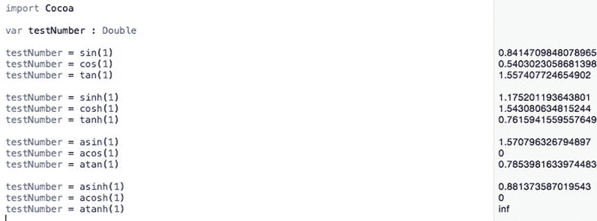

图 6-6. 观察不同三角函数的工作方式

### 指数函数

指数函数涉及乘法，例如将数字 2 自乘固定次数。一些常见的指数函数包括：

- `exp` – 计算 e**x，其中 x 是整数
- `exp2` – 计算 2**x，其中 x 是整数
- `__exp10` – 计算 10**x，其中 x 是整数
- `expm1` – 计算 e**x-1，其中 x 是整数
- `pow` – 计算 x 的 y 次幂

要了解这些不同的指数函数是如何工作的，请按照以下步骤操作：

确保你的 MathPlayground 已在 Xcode 中加载。按如下方式编辑代码：

```
import Cocoa
var testNumber : Double
testNumber = exp(3)
testNumber = exp2(3)
testNumber = __exp10(3)
testNumber = expm1(3)
testNumber = pow(2,4)
```

请注意每种指数函数的不同工作方式，如图 6-7 所示。

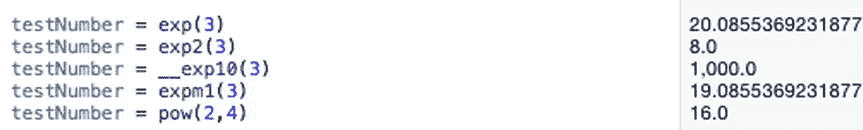

图 6-7. 观察不同指数函数的工作方式

### 对数函数

对数函数允许在处理大数时进行乘法、除法和加法运算，类似于指数函数。一些常见的对数函数包括：

- `log` – 计算一个数的自然对数
- `log2` – 计算一个数以 2 为底的对数
- `log10` – 计算一个数以 10 为底的对数
- `log1p` – 计算 1+x 的自然对数

要了解这些不同的对数函数是如何工作的，请按照以下步骤操作：

确保你的 MathPlayground 已在 Xcode 中加载。按如下方式编辑代码：

```
import Cocoa
var testNumber : Double
testNumber = log(3)
testNumber = log2(3)
testNumber = log10(3)
testNumber = log1p(3)
```

请注意每种对数函数的不同工作方式，如图 6-8 所示。

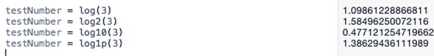

图 6-8. 观察不同对数函数的工作方式


## 使用字符串函数

正如 Cocoa 框架提供了数十种数学函数一样，它也包含了一些字符串操作函数。一些常见的字符串函数包括：

*   `+` —— 将两个字符串连接或组合在一起，例如 "Hello" + "world"，会生成字符串 "Hello world"
*   `capitalizedString` —— 将每个单词的首字母大写
*   `lowercaseString` —— 将整个字符串转换为小写字母
*   `uppercaseString` —— 将整个字符串转换为大写字母
*   `doubleValue` —— 将包含数值的字符串转换为 `Double` 数据类型
*   `isEmpty` —— 检查字符串是否为空或至少有一个字符
*   `hasPrefix` —— 检查特定文本是否出现在字符串的开头
*   `hasSuffix` —— 检查特定文本是否出现在字符串的结尾

使用 `+` 运算符追加或组合字符串时，要注意空格。如果省略空格，可能会得到不想要的结果。例如，"Hello" + "world" 会生成没有任何空格的字符串 "Helloworld"。这就是为什么你需要确保在单词之间加上空格，例如 "Hello" + "world" 才能生成 "Hello world"。

要了解这些不同的字符串函数如何工作，请遵循以下步骤：

确保你的 `MathPlayground` 已在 Xcode 中加载。按如下方式编辑代码：

```
import Cocoa
var text : String = "Hello everyone!"
print (text.capitalizedString)
print (text.lowercaseString)
print (text.uppercaseString)
print (text.isEmpty)
print (text.hasPrefix ("Hello"))
print (text.hasSuffix ("world"))
var dog : Double
dog = "23.79".doubleValue
```

注意每种字符串类型函数的工作方式不同，如图 6-9 所示。

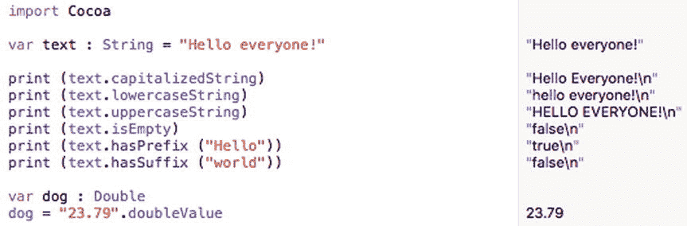

图 6-9.

观察不同字符串函数的工作方式

## 创建函数

到目前为止，你用来操作数字或字符串的所有函数，都是 Cocoa 框架为你创建好的。函数的基本思想是，你无需了解其工作原理即可使用它。你只需要知道函数名（用来调用并执行它）以及可能需要传递给函数的任何数据，以便它能够利用这些数据执行操作（例如，将字符串中的所有文本转换为大写）。

你应该始终尽可能多地使用 Cocoa 框架的内置函数，因为这能让你使用经过预测试、可靠的代码来创建程序。当然，Cocoa 框架无法提供你可能需要的所有函数，所以你最终需要创建自己的函数。

函数的目的是简化代码。与其编写多行代码来计算一个数的平方根，不如将该代码隐藏在一个函数中，并通过名称调用或执行该函数，这样要简单得多。函数基本上是用单行代码（即函数调用）来替代多行代码。

你可以创建的三种函数类型是：

*   不接受任何数据且执行相同操作的函数
*   接受数据的函数
*   返回值的函数

请记住，接受数据的函数也可以返回值。

### 不带参数或返回值的简单函数

最简单的函数只包含一个函数名，如下所示：

```
func functionName () {

}
```

通过在花括号之间插入一行或多行代码，你可以让函数执行某些操作，例如：

```
func simpleFunction () {
    print ("Hello")
    print ("there")
}
```

要运行函数内的代码，你只需按名称调用该函数，例如：

```
simpleFunction()
```

要了解此函数的工作方式，请遵循以下步骤：

启动 Xcode。选择 文件 ➤ 新建 ➤ Playground。（如果你看到 Xcode 欢迎屏幕，也可以点击“开始使用 playground”）。Xcode 会要求输入 playground 的名称和平台。点击“名称”文本框，输入 `FunctionPlayground`。点击“平台”弹出菜单，选择 OS X。Xcode 会询问你想将 playground 文件保存在哪里。点击一个文件夹来保存你的 playground 文件，然后点击“创建”按钮。Xcode 会显示该 playground 文件。按如下方式编辑代码：

```
import Cocoa
func simpleFunction () {
    print ("Hello")
    print ("there")
}
var i = 1
while i <= 5 {
    simpleFunction()
    i = i + 1
}
```

这段代码定义了一个简单的函数，该函数只打印 "Hello" 和 "there"。然后它使用一个循环（稍后你会学到）运行五次，并运行或调用 `simpleFunction` 五次，如图 6-10 所示。

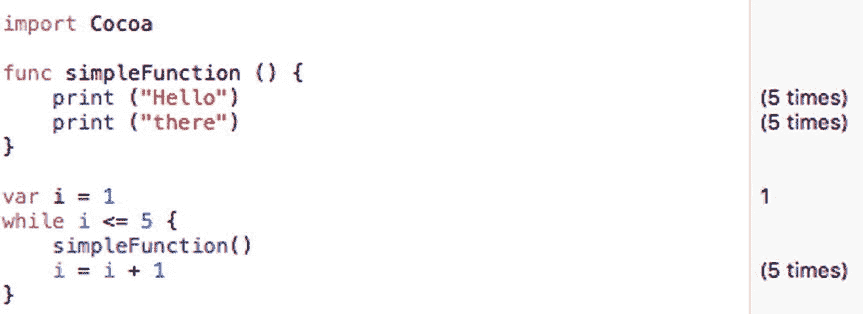

图 6-10.

定义并调用一个简单的函数

如果不使用函数，同样的 Swift 代码可能如下所示：

```
import Cocoa
var i = 1
while i <= 5 {
    print ("Hello")
    print ("there")
    i = i + 1
}
```

虽然这看起来更简单，但问题在于，如果你需要在程序的多个部分重用这段代码。这意味着你需要在多个位置复制粘贴相同的代码。现在，如果你需要修改这段代码，你必须确保在整个程序中修改它。如果遗漏了某一个代码副本，你的程序可能就无法正常运行了。

通过将常用代码存储在函数中，你将其存储在一个地方，但可以在程序的多个部分使用它。现在，如果你需要修改代码，只需在一个地方更改，这些更改会自动影响程序中调用该函数的多个部分。


### 带参数的简单函数

不带参数的简单函数只能重复执行相同的操作。而参数允许函数接收数据，并利用这些数据计算出不同的结果。要定义一个参数，你只需定义一个描述性的名称及其数据类型，这很像声明一个变量，但不需要使用 `var` 关键字，例如：

```
func functionName (parameter: dataType) {

}
```

要调用一个定义了参数的函数，你只需输入函数名，后跟正确数量的参数，例如：

```
functionName (parameter)
```

调用带参数的函数时，需要确保传递了正确数量的参数，并且每个参数的数据类型都是正确的。因此，如果你有一个接受一个字符串参数的函数，像这样：

```
func parameterFunction (name : String) {

}
```

你可以通过函数名并传入一个（且仅一个）字符串来调用它，像这样：

```
parameterFunction("Oscar")
```

函数调用失败的方式有三种：

- 如果你把函数名写错了
- 如果你没有列出或传递正确数量的参数
- 如果你没有列出或传递正确数据类型的参数

在这个例子中，`parameterFunction` 期望接收一个参数，且该参数必须是 `String` 数据类型。如果你给 `parameterFunction` 传递零个或两个参数，它都将无法工作。同样，如果你给 `parameterFunction` 传递一个参数，但其数据类型不是 `String`，它也无法工作。

要了解带参数的函数如何工作，请按照以下步骤操作：

确保你的 `FunctionPlayground` 文件已在 Xcode 中加载。按如下方式编辑代码：

```
import Cocoa
func parameterFunction (name : String) {
    print ("Hello, " + name)
}
parameterFunction("Oscar")
```

这个 Swift 程序调用了 `parameterFunction`，并向其传递了一个字符串参数 (`"Oscar"`)。当 `parameterFunction` 接收到这个参数 (`"Oscar"`) 时，会将其存储在其 `name` 变量中。然后它会打印出 "Hello, Oscar"，如图 6-11 所示。

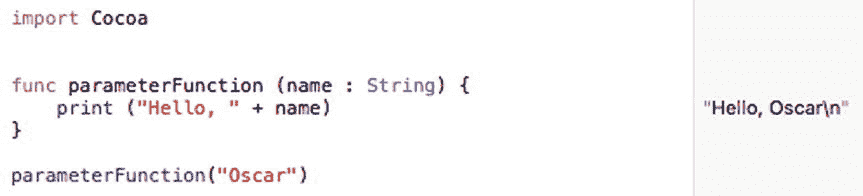

图 6-11. 向函数传递一个字符串参数

尽管这个示例只使用了一个参数，但一个函数可以接受的参数数量没有限制。要接受更多参数，你只需定义额外的变量名称和数据类型，像这样：

```
func functionName (parameter: dataType, parameter2 : dataType) {

}
```

每个参数可以接受不同的数据类型，因此你可以向函数传递一个字符串和一个整数，例如：

```
func functionName (parameter: String, parameter2 : Int) {

}
```

要调用这个函数，你需要指定函数名以及它的两个具有正确数据类型的参数：

```
functionName ("Hello", 48)
```

如果你以错误的顺序传递参数，函数调用将无法工作，例如：

```
functionName (48, "Hello")
```

传递参数时，始终要确保传递正确数量的参数、正确的数据类型以及正确的顺序。

### 带参数并返回值的函数

最通用的函数是那些使用参数接收数据，然后根据这些数据返回一个值的函数。一个返回值函数的基本结构如下：

```
func functionName (parameter: ParameterDataType) -> DataType {
        return someValue
}
```

函数名可以是您想用的任意名称。理想情况下，函数名应能描述其用途。

参数很像声明一个变量，通过指定参数名称及其可以接受的数据类型。参数是可选的，但不带参数的函数通常用处不大，因为它们会重复执行相同的任务。

`->` 符号定义了函数名所代表的数据类型。

`return` 关键字后面必须跟着一个值或可以计算出值的命令。这个值的数据类型必须与 `->` 符号后面的数据类型相同。

假设你定义了一个如下的函数：

```
func salesTax (amount: Double) -> Double {
    let currentTax = 0.075 // 7.5% 销售税
    return amount * currentTax
}
```

这个函数名为 `salesTax`，它接受一个名为 `amount` 的参数，该参数可以存储 `Double` 数据类型。当它计算结果时，该结果也是一个 `Double` 数据类型，由 `->` 符号后的 `Double` 标识。`return` 关键字标识了函数如何计算要返回的值。

要了解这个函数如何工作，请按照以下步骤操作：

确保你的 `FunctionPlayground` 文件已在 Xcode 中加载。按如下方式编辑代码：

```
import Cocoa
func salesTax (amount: Double) -> Double {
    let currentTax = 0.075
    return amount * currentTax
}
let purchasePrice = 59.95
var total : Double
total = purchasePrice + salesTax(purchasePrice)
print ("包含销售税，您的总金额是 =  \(total)")
```

请注意，这段代码通过向 `salesTax` 函数传递存储在 `purchasePrice` 中的值来调用它。当你在 playground 中输入此代码时，你会在右侧边栏看到显示的结果，如图 6-12 所示。尝试更改 `purchasePrice` 和 `currentTax` 中存储的值，看看它们如何影响此 Swift 代码计算出的结果。

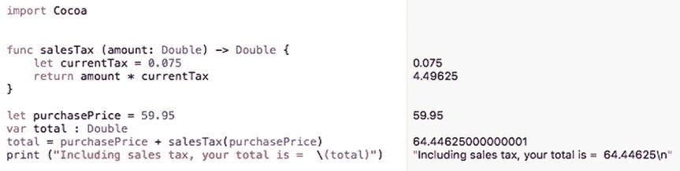

图 6-12. 定义和调用函数

当一个函数返回一个值时，请确保指定：

- 函数所代表的数据类型 (`-> dataType`)
- 函数名所代表的值 (`return`)

调用一个返回值的函数时，请确保数据类型匹配。在上面的例子中，`salesTax` 函数返回一个 `Double` 数据类型，因此在 Swift 代码中，这个 `salesTax` 函数值被存储在 `total` 变量中，该变量也是一个 `Double` 数据类型。

### 定义外部参数名

当一个函数使用一个或多个参数来接收数据时，你只需定义参数名及其数据类型，例如：

```
func storeContact (name: String, age : Int) {

}
```

要调用此函数，你只需使用函数名，并为其提供一个字符串和一个整数，例如：

```
storeContact ("Fred", 58)
```

传递参数时的问题是，你只能看到你传递的数据，但可能不完全理解它所代表的内容。为了解决这个问题，Swift 允许你创建外部参数名，强制你在向函数传递数据时进行标识。

一种方法是创建一个外部参数名，例如：

```
func functionName (externalName internalName: dataType) {

}
```

当你为一个参数同时定义了外部名称和内部名称时，在向函数传递参数时使用外部参数名，而在函数内部则使用内部参数名。要了解如何使用外部和内部参数名，请按照以下步骤操作：

确保你的 `FunctionPlayground` 文件已在 Xcode 中加载。按如下方式编辑代码：

```
import Cocoa
func greeting (person name : String) -> String {
    return "Hello " + name
}
var message : String
message = greeting (person: "Bob")
print (message)
```

此函数有一个外部参数名 `"person"` 和一个内部参数名 `"name"`。要调用此函数，你必须包含外部参数名 `"person"`：

```
greeting (person: "Bob")
```

外部参数名只是让调用函数和传递参数变得更加易于理解。


### 使用变量参数

当函数接受参数时，它会将该参数视为常量。这意味着在函数内部，Swift 代码无法修改该参数。如果希望在函数内部修改参数，则需要使用 `var` 关键字将该参数标识为变量参数，如下所示：

```
func functionName (var parameter: dataType) {

}
```

要了解变量参数如何工作，请按照以下步骤操作：

确保你的 `FunctionPlayground` 文件已在 Xcode 中加载。按如下方式编辑代码：

```swift
import Cocoa
func internalChange (var name : String) {
    name = name.uppercaseString
    print ("Hello " + name)
}
internalChange ("Tasha")
```

在 `internalChange` 函数内部，`name` 参数发生了变化。函数中的第一行将 `name` 参数转换为大写。但是，`internalChange` 函数对 `name` 参数所做的任何更改都不会影响程序的其他部分。所有更改都仅限于 `internalChange` 函数内部。

如果你希望更改参数并使这些更改在函数外部生效，则需要改用 `inout` 参数。

### 使用输入输出参数

向函数传递数据有两种方式。一种是传递固定值，例如：

```swift
sqrt(5)
```

第二种方式是传递一个表示值的变量，例如：

```swift
var z : Double = 45.0
var answer : Double
answer = sqrt(z)
```

在这段 Swift 代码中，`z` 的值为 `45.0`，并被传递给 `sqrt` 函数。无论 `sqrt` 函数做什么，`z` 的值仍然保持为 `45.0`。

如果你希望函数能够更改其参数的值，可以创建所谓的输入输出参数。这意味着当你将一个变量传递给函数时，该函数会修改那个变量。

要定义一个函数可以更改的参数，只需使用 `inout` 关键字来标识该参数，例如：

```
func functionName (inout parameter: dataType) {

}
```

如果一个函数有两个或更多参数，你可以将一个或多个参数指定为 `inout` 参数。当你将一个参数标识为 `inout` 参数时，函数必须修改该 `inout` 参数。当你调用一个函数并向其传递 `inout` 参数时，必须使用 `&` 符号来标识该 `inout` 参数，例如：

```
functionName (&variable)
```

要了解 `inout` 参数如何工作，请按照以下步骤操作：

确保你的 `FunctionPlayground` 文件已在 Xcode 中加载。按如下方式编辑代码：

```swift
import Cocoa
func changeMe (inout name: String, age: Int) {
    print (name + " is \(age) years old")
    name = name.uppercaseString
}
var animal : String = "Oscar the cat"
changeMe (&animal, age: 2)
print (animal)
```

`changeMe` 函数定义了两个参数：

*   一个名为 `name` 的字符串参数，被标识为 `inout` 参数
*   一个名为 `age` 的整型参数

`changeMe` 函数必须以某种方式修改这个 `inout` 参数，它通过将 `name` 参数改为大写来实现，如图 6-13 所示。

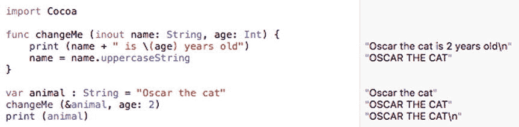

图 6-13. 使用 `inout` 参数

调用 `changeMe` 函数时，会向其传递一个名为 `animal` 的 `String` 变量，该变量保存字符串 `"Oscar the cat"`。`changeMe` 函数期望两个参数，其中第一个是 `inout` 参数。这意味着调用 `changeMe` 函数必须满足以下条件：

*   `changeMe` 函数期望两个参数，顺序依次是一个字符串和一个整数
*   由于字符串参数是 `inout` 参数，第一个参数必须是一个用 `&` 符号标识的变量

在调用 `changeMe` 函数之前，`animal` 变量包含字符串 `"Oscar the cat"`。调用 `changeMe` 函数之后，`animal` 变量现在包含字符串 `"OSCAR THE CAT"`。这是因为 `changeMe` 函数中的 `inout` 参数修改了它。

### 理解 IBAction 方法

如果你记得在第 5 章中，你将用户界面中的一个按钮连接到了 Swift 代码，从而创建了一个 `IBAction` 方法，它实际上只是一个函数，看起来像这样：

```swift
@IBAction func changeCase(sender: NSButton) {
    labelText.stringValue = messageText.stringValue.uppercaseString
    let warning = labelText.stringValue
}
```

既然你已经理解了函数的工作原理，让我们逐行分析这段代码。首先，`@IBAction` 标识了一个仅在用户对用户界面元素进行操作时才会运行的函数。如果你查看参数列表，会看到 `(sender: NSButton)`，这告诉你当用户点击按钮时，`changeCase` 函数将执行花括号内的 Swift 代码。

任何 `IBAction` 方法中存储的 Swift 代码通常都会以某种方式处理数据。在这个例子中，它将来自文本字段（由 `IBOutlet` 变量 `messageText` 表示）的文本转换为大写，然后将该大写文本显示在一个标签（由 `IBOutlet` 变量 `labelText` 表示）中。

由于可能存在两个或多个用户界面元素连接到同一个 `IBAction` 方法，`sender` 参数用于标识用户点击的是哪个按钮。由于这个 `IBAction` 方法只连接到一个按钮，因此 `sender` 参数被忽略。

`IBAction` 方法本质上只不过是连接到用户界面元素上的特殊函数。在任何程序中，你很可能会有多个 `IBAction` 方法（函数）以及你可能定义的其他函数。

此外，即使你从未见过实现这些函数功能的实际代码，你很可能会使用 Cocoa 框架中定义的函数。在创建任何程序时，你都会以某种形式使用函数。


## 摘要

任何程序的核心在于其接收数据、处理数据并返回有用结果的能力。处理数值数据最简单的方法是通过常见的数学运算符，例如 `+`（加法）、`-`（减法）、`/`（除法）、`*`（乘法）和 `%`（取余）。处理字符串的常见方法是使用 `+` 运算符进行拼接，该运算符用于将两个字符串组合在一起。

作为快捷方式，你可以使用递增和递减运算符来对变量加 1 或减 1。如果你需要加或减 1 以外的值，可以使用复合赋值运算符来代替。

除了这些基本运算符，你还可以通过 Cocoa 框架定义的函数来处理数据。你不必了解这些函数的工作原理；你只需知道它们存在，以便可以在自己的程序中通过调用这些函数名称来使用它们。要查找可用的函数名称，你可能需要在 Xcode 的文档窗口中搜索。

虽然 Cocoa 框架中有大量函数可供使用，但你可能也需要创建自己的函数。函数通常接受一个或多个参数，以便计算出不同的结果。

一个函数可以表示一个单一的值，这意味着你需要定义该函数所表示的数据类型。

在最简单的层面上，你需要定义具有唯一名称和数据类型的参数。为了使参数更易于理解，你可以创建外部参数名称，这意味着在向函数传递数据时需要指明参数名称。

通常情况下，当函数接受一个参数时，它会将该参数视为一个值不变常量。但是，函数可以通过使用 `var` 关键字创建变量参数来修改参数。函数对变量参数所做的任何更改都仅限于该函数内部。

为了获得更大的灵活性，函数还可以创建 `inout` 参数来修改参数的值。当函数修改一个 `inout` 参数时，这些更改会体现在函数外部。

通过定义自己的函数，你可以创建可重用的实用代码库，这些代码库可以在程序的其他部分甚至其他项目中重复使用。函数让你能够为特定程序创建处理数据的特定方式。

