# 使用分支进行决策

电子补充材料 本章的在线版本 (doi:[10.1007/978-1-4842-1233-2_7](http://dx.doi.org/10.1007/978-1-4842-1233-2_7)) 包含补充材料，仅供授权用户使用。

程序接收到数据后，需要以某种方式处理这些数据，以返回有用的结果。简单的程序以相同方式处理数据，但更复杂的程序需要就如何处理数据做出决策。

例如，一个程序可能会要求用户输入密码。如果用户输入了有效密码，则程序允许用户访问。如果用户未输入有效密码，则程序必须显示错误消息并阻止访问。

当程序分析数据并根据该数据做出决策时，会使用到所谓的布尔值和分支语句。

布尔值表示 `true` 或 `false` 的值。分支语句为你的程序提供了在两组或多组不同的待执行命令之间进行选择的选项。布尔值与分支语句相结合，使程序能够对不同数据做出响应。

## 理解比较运算符

你可以通过声明 `Bool` 数据类型来创建布尔变量，例如：

```
var flag : Bool
```

`Bool` 表示布尔数据类型。任何定义为 `Bool` 数据类型的变量只能保存两个值之一：`true` 或 `false`，例如：

```
flag = true
flag = false
```

虽然你可以直接将 `true` 和 `false` 赋值给表示布尔数据类型的变量，但更常见的是使用比较运算符来计算布尔值。一些常见的比较运算符如表 7-1 所示。

**表 7-1.** Swift 中的常见比较运算符

| 比较运算符 | 用途 | 示例 | 布尔值 |
| --- | --- | --- | --- |
| `==` | 等于 | `5 == 14` | `false` |
| `<` | 小于 | `5 < 14` | `true` |
| `>` | 大于 | `5 > 14` | `false` |
| `<=` | 小于或等于 | `5 <= 14` | `true` |
| `>=` | 大于或等于 | `5 >= 14` | `false` |
| `!=` | 不等于 | `5 != 14` | `true` |

**注意**

等于（`==`）比较运算符是唯一也可以比较字符串的比较运算符，例如 `"Joe" == "Fred"`（计算结果为 `false`）或 `"Joe" == "Joe"`（计算结果为 `true`）。

比较运算符可以比较诸如 `38 == 8` 或 `29.04 > 12` 之类的值。然而，使用实际值与比较运算符总是返回相同的 `true` 或 `false` 值。比较运算符的通用性在于，当它们将一个固定值与一个变量进行比较，或者比较两个变量时，例如：

```
let myValue = 45
myValue > 38            // 计算结果为 true

let yourValue = 39
myValue < yourValue     // 计算结果为 false
```

当你比较一个或多个变量时，结果会因这些变量的当前值而改变。然而，在使用等于（`==`）比较运算符时，处理小数值时要小心。这是因为 `45.0` 与 `45.0000001` 不是同一个数字。处理小数值时，最好使用大于或小于比较运算符，而不是等于比较运算符。


## 理解逻辑运算符

任何比较运算符，例如 `78 > 9`，都会得出一个 `true` 或 `false` 值。然而，Swift 提供了专门的逻辑运算符，仅用于处理布尔值，如表 7-2 所示。

表 7-2. Swift 中的常见逻辑运算符

| 比较运算符 | 用途 |
| --- | --- |
| `&&` | 与 |
| `\|\|` | 或 |
| `!` | 非 |

逻辑运算符“与”（`&&`）和“或”（`\|\|`）都接受两个布尔值，并将其转换为单个布尔值。逻辑运算符“非”（`!`）接受一个布尔值，并将其转换为相反的值。表 7-3 展示了逻辑运算符“非”（`!`）的工作方式：

表 7-3. 逻辑运算符“非”（`!`）

| 示例 | 值 |
| --- | --- |
| `!true` | `false` |
| `!false` | `true` |

“与”（`&&`）运算符接受两个布尔值，并根据表 7-4 计算出一个单一的布尔值。

表 7-4. Swift 中的逻辑“与”（`&&`）运算符

| 第一个布尔值 | 第二个布尔值 | 结果 |
| --- | --- | --- |
| `true` && | `true` | `true` |
| `true` && | `false` | `false` |
| `false` && | `true` | `false` |
| `false` && | `false` | `false` |

“或”（`\|\|`）运算符接受两个布尔值，并根据表 7-5 计算出一个单一的布尔值。

表 7-5. Swift 中的逻辑“或”（`\|\|`）运算符

| 第一个布尔值 | 第二个布尔值 | 结果 |
| --- | --- | --- |
| `true` \|\| | `true` | `true` |
| `true` \|\| | `false` | `true` |
| `false` \|\| | `true` | `true` |
| `false` \|\| | `false` | `false` |

要查看布尔值如何与比较运算符和逻辑运算符协同工作，请按照以下步骤创建一个新的 playground：

1. 启动 Xcode。
2. 选择 File ➤ New ➤ Playground。（如果你看到了 Xcode 欢迎界面，也可以点击“Get started with a playground”。）Xcode 会要求输入 playground 名称和平台。
3. 在 Name 文本框中点击，然后输入 `BooleanPlayground`。
4. 点击 Platform 弹出菜单，选择 OS X。Xcode 会询问你想将 playground 文件保存在哪里。
5. 点击一个你想保存 playground 文件的文件夹，然后点击 Create 按钮。Xcode 会显示该 playground 文件。
6. 按如下方式编辑代码：

```
import Cocoa
var x, y, z : Int
x = 35
y = 120
z = -48
x == y
x < y
x > z
y != z
z > -48
// 与 && 运算符
(y != z) && (x > z)
(y != z) && (x == y)
(x == y) && (x < y)
(z > -48) && (x == y)
// 或 || 运算符
(y != z) || (x > z)
(y != z) || (x == y)
(x == y) || (x < y)
(z > -48) || (x == y)
```

注意比较运算符是如何计算出 `true` 或 `false` 的，以及逻辑运算符（“与”和“或”）是如何接受两个布尔值并返回一个单一的 `true` 或 `false` 值的，如图 7-1 所示。

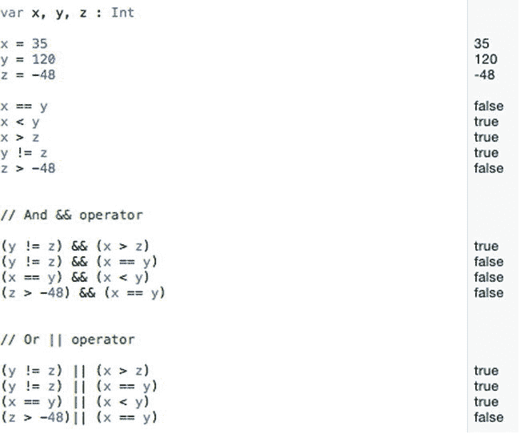

图 7-1. 使用比较运算符和逻辑运算符评估布尔值

最终，每个布尔值必须是：

*   一个 `true` 或 `false` 值
*   一个结果为 `true` 或 `false` 的两个值的比较
*   使用逻辑运算符组合而成并评估为 `true` 或 `false` 的布尔值

## `if` 语句

布尔值对于让程序做出选择至关重要。如果有人输入密码，程序会检查该密码是否有效。如果为 `true`（密码有效），则程序允许访问。如果为 `false`（密码无效），则程序阻止访问。

为了决定下一步做什么，每个程序都需要评估一个布尔值。只有这样，程序才能根据该布尔值的值来决定下一步做什么。

Swift 中最简单的分支语句是 `if` 语句，其形式如下：

```
if BooleanValue == true {

}
```

为了简化这个 `if` 语句，你可以省略 `== true` 部分，使 `if` 语句变成这样：

```
if BooleanValue {

}
```

这个简写版本的意思是：“如果 `BooleanValue` 是 `true`，则运行花括号内的代码。如果 `BooleanValue` 是 `false`，则跳过花括号内的所有代码，不运行它们。”

要查看布尔值如何与 `if` 语句协同工作，请按照以下步骤操作：

1. 确保 `BooleanPlayground` 文件已在 Xcode 中加载。
2. 按如下方式编辑代码：

```
import Cocoa
var BooleanValue : Bool = true
if BooleanValue {
    print ("The BooleanValue is true")
}
```

图 7-2 显示了 `if` 语句运行的结果。将 `BooleanValue` 的值更改为 `false`，你会看到 `if` 语句不再打印字符串 `"The BooleanValue is true."`。

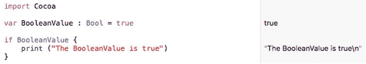

图 7-2. 运行一个 `if` 语句

## `if-else` 语句

`if` 语句要么运行代码，要么什么都不运行。如果希望在布尔值为 `false` 时运行代码，你可以编写两个独立的 `if` 语句，如下所示：

```
if BooleanValue {

}

if !BooleanValue {

}
```

如果 `BooleanValue` 为 `true`，则运行第一个 `if` 语句。如果不是，则它什么都不做。

如果 `BooleanValue` 为 `false`，则运行第二个 `if` 语句。如果不是，则它什么都不做。

编写两个独立 `if` 语句的问题在于程序的逻辑不够清晰。为了解决这个问题，Swift 提供了一种 `if-else` 语句，其形式如下：

```
if BooleanValue {
    // 第一组代码，如果为 true 则运行
} else {
    // 第二组代码，如果为 false 则运行
}
```

`if-else` 语句只提供两个不同的分支。如果布尔值为 `true`，则运行第一组代码。如果布尔值为 `false`，则运行第二组代码。在 `if-else` 语句中，两组代码不可能同时运行。

要查看布尔值如何与 `if-else` 语句协同工作，请按照以下步骤操作：

1. 确保 `BooleanPlayground` 文件已在 Xcode 中加载。
2. 按如下方式编辑代码：

```
import Cocoa
var BooleanValue : Bool = true
if BooleanValue {
    print ("The BooleanValue is true")
} else {
    print ("The BooleanValue is false")
}
```

图 7-3 展示了当 `BooleanValue` 为 `true` 时 `if-else` 语句是如何工作的。将 `BooleanValue` 改为 `false`，看看 `if-else` 语句现在是如何运行第二组代码的。

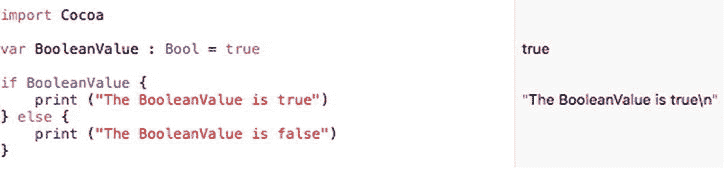

图 7-3. 运行一个 `if-else` 语句


## if-else if 语句

`if` 语句要么执行一组代码，要么什么都不执行。`if-else` 语句总是执行第一组代码或第二组代码。但是，如果你希望从两组或更多可能的代码中选择执行一组，该怎么办？这种情况下，你需要使用 `if-else if` 语句。

与 `if` 语句一样，`if-else if` 语句可能根本不执行任何代码。最简单的 `if-else if` 语句如下所示：

```
if BooleanValue {
    // 如果为真，则执行第一组代码
} else if BooleanValue2 {
    // 如果为真，则执行第二组代码
}
```

使用 `if-else if` 语句，必须有一个布尔值为真才能执行代码。如果没有布尔值为真，则可能完全不执行任何代码。`if-else if` 语句等同于多个 `if` 语句，如下所示：

```
if BooleanValue {
    // 如果为真，则执行第一组代码
}

if BooleanValue2 {
    // 如果为真，则执行第二组代码
}
```

使用 `if-else if` 语句，你可以根据需要检查任意数量的布尔值，例如：

```
if BooleanValue {
    // 如果为真，则执行第一组代码
} else if BooleanValue2 {
    // 如果为真，则执行第二组代码
} else if BooleanValue3 {
    // 如果为真，则执行第三组代码
} else if BooleanValue4 {
    // 如果为真，则执行第四组代码
} else if BooleanValue5 {
    // 如果为真，则执行第五组代码
}
```

一旦 `if-else if` 语句发现某个布尔值为真，它就会执行花括号内的相应代码。但是，也可能所有布尔值都为假，在这种情况下，`if-else if` 语句内的代码都不会执行。

如果你希望确保至少有一组代码会执行，那么你需要在 `if-else if` 语句的末尾添加一个最终的 `else` 子句，例如：

```
if BooleanValue {
    // 如果为真，则执行第一组代码
} else if BooleanValue2 {
    // 如果为真，则执行第二组代码
} else if BooleanValue3 {
    // 如果为真，则执行第三组代码
} else if BooleanValue4 {
    // 如果为真，则执行第四组代码
} else if BooleanValue5 {
    // 如果为真，则执行第五组代码
} else {
    // 如果其他所有布尔值都为假，则执行此代码
}
```

要了解布尔值如何与 `if-else` 语句配合工作，请按照以下步骤操作：

确保 `BooleanPlayground` 文件已在 Xcode 中加载。按如下方式编辑代码：

```
import Cocoa
var BooleanValue : Bool = false
var BooleanValue2 : Bool = false
var BooleanValue3 : Bool = false
if BooleanValue {
    print ("BooleanValue 为真")
} else if BooleanValue2 {
    print ("BooleanValue2 为真")
} else if BooleanValue3 {
    print ("BooleanValue3 为真")
} else {
    print ("如果所有其他值都为假，则打印此信息")
}
```

请注意，因为每个布尔值都为假，所以唯一执行的代码位于 `if-else if` 语句最终 `else` 部分，如图 7-4 所示。

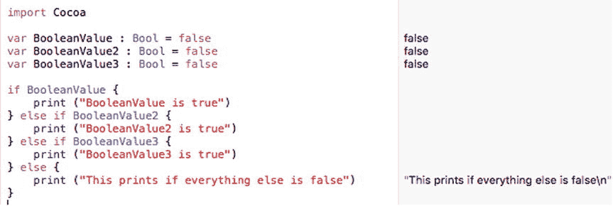

图 7-4. 运行带有多个布尔值的 `if-else if` 语句

如果你将不同的布尔值改为真，可以看到 `if-else if` 语句通过执行不同的代码组而产生不同的行为。

关于 `if-else if` 语句：

- 除非最后一部分是普通的 `else` 语句，否则可能不会执行任何代码
- 程序可以在两组或更多组代码之间进行选择
- 可能选项的数量不限于像 `if-else` 语句那样只有两个选项

由于 `if-else if` 语句检查多个布尔值，如果两个或更多布尔值为真会发生什么？在这种情况下，`if-else if` 语句只执行与第一个为真的布尔值相关联的代码组，并忽略所有其余代码，如图 7-5 所示。

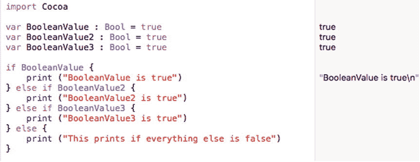

图 7-5. 运行带有多个真布尔值的 `if-else if` 语句

## switch 语句

`if-else if` 语句允许你创建可能执行的两组或更多组代码。不幸的是，当需要检查的布尔值过多时，`if-else if` 语句可能难以理解。为了解决这个问题，Swift 提供了 `switch` 语句。

`switch` 语句的工作原理与 `if-else if` 语句非常相似，只是它更易于读写。主要区别在于，`switch` 语句不是检查多个布尔值，而是检查单个变量的值。基于这个单个变量的值，`switch` 语句可以选择执行不同的代码组。

一个典型的 `switch` 语句如下所示：

```
switch 值/变量/表达式 {
case 值 1: // 如果变量 = 值 1，则执行第一组代码
case 值 2: // 如果变量 = 值 2，则执行第二组代码
case 值 3: // 如果变量 = 值 3，则执行第三组代码
default: // 如果没有其他匹配，则执行第四组代码
}
```

`switch` 语句首先检查一个固定值（例如 38 或 “Bob”）、一个代表数据的变量，或一个表达式（例如 `3 * age`，其中 `age` 是一个变量）。最终，`switch` 语句需要确定一个单一的值，并将该值与其找到的第一个匹配的 `case` 语句相匹配。一旦找到精确匹配，它就会执行与该 `case` 语句关联的一行或多行代码。

要了解布尔值如何与 `case` 语句配合工作，请按照以下步骤操作：

确保 `BooleanPlayground` 文件已在 Xcode 中加载。按如下方式编辑代码：

```
import Cocoa
var whatNumber : Int = 3
switch whatNumber {
    case 1: print ("数字是 1")
    case 2: print ("数字是 2")
    case 3: print ("数字是 3")
        print ("这难道不神奇吗？")
    case 4: print ("数字是 4")
    case 5: print ("数字是 5")
    default: print ("数字未定义")
}
```

因为 `whatNumber` 变量的值是 3，所以 `switch` 语句将其与 `case 3:` 匹配，然后执行冒号后面出现的 Swift 代码，如图 7-6 所示。请注意，你可以在冒号后面存储多行代码，并且不需要将代码括在花括号内。更改 `whatNumber` 变量的值，看看它如何影响 `switch` 语句的行为。

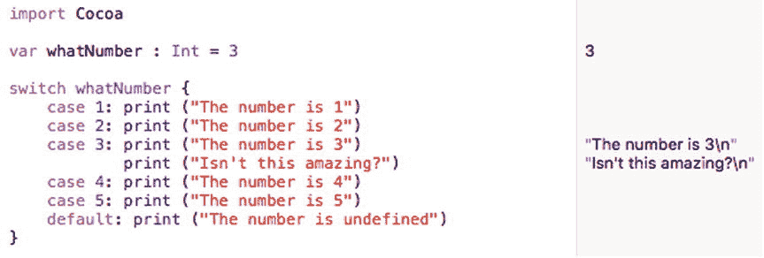

图 7-6. 运行 `switch` 语句

**注意：** 与其他编程语言（如 Objective-C）不同，你不需要使用 `break` 命令来分隔 `switch` 语句中不同 `case` 语句中存储的代码。

上面的 `switch` 语句等同于：

```
if whatNumber == 1 {
    print ("数字是 1")
} else if whatNumber == 2 {
    print ("数字是 2")
} else if whatNumber == 3 {
    print ("数字是 3")
    print ("这难道不神奇吗？")
} else if whatNumber == 4 {
    print ("数字是 4")
} else if whatNumber == 5 {
    print ("数字是 5")
} else {
    print ("数字未定义")
}
```

如你所见，`switch` 语句更简洁，更易于阅读和理解。

在创建 `switch` 语句时，你必须处理所有可能性。在上面的 `switch` 语句中，`whatNumber` 变量可以是任何整数，因此 `switch` 语句可以显式处理从 1 到 5 的任何值。如果该值不在 1 到 5 的范围内，则 `switch` 语句的 `default` 部分会处理任何其他值。如果你未能包含 `default`，那么 Xcode 会标记你的 `switch` 语句为可能的错误。（此规则的一个例外是，如果你将 `switch` 语句与 `enum` 结构一起使用，你将稍后在本章中了解到这一点。）这样做是为了保护你的代码，防止 `switch` 语句接收到它不知道如何处理的数据时可能崩溃。


好的，作为高级文档工程师和翻译员，我将严格遵循您提供的注意事项和示例格式，将给定的英文文本翻译成中文。


这个 `switch` 语句的示例尝试将一个值/变量/表达式与一个确切的值进行匹配。然而，`switch` 语句也可以尝试匹配多个值。`switch` 语句有三种方式可以检查一个值的范围：

*   显式地列出所有可能的值，用逗号分隔
*   用三个点号（`...`）定义数字范围的起点和终点
*   用两个点号和一个小于号（`..<`）定义起始数字和结束范围

当一个 `case` 语句列出所有用逗号分隔的值时，只有当 `switch` 的值/变量/表达式与这些值中的一个完全匹配时，其代码才会执行。例如，考虑下面的 `case` 语句：

    switch whatNumber {
        case 1, 2, 3: print("The number is 1, 2, or 3")
        default: print("The number is undefined")
    }

只有当 `whatNumber` 的值是 1、2 或 3 时，它的代码才会打印 “The number is 1, 2, or 3。”

对于少量数字，显式列出所有可能的值还可以接受，但对于多个数字，写出每一个可能的数字就会变得繁琐。作为一种快捷方式，Swift 允许你指定一个范围。如果你想匹配 4 到 20 之间的数字，`switch` 语句的 `case` 部分可能如下所示：

    switch whatNumber {
        case 4...20: print("The number is between 4 and 20")
        default: print("The number is undefined")
    }

在这种情况下，`whatNumber` 可以是 4、20 或介于它们之间的任何数字。三个点号表示一个范围，该范围包含起始和结束数字（4 和 20）。

Swift 还可以检查一个半开范围，它由两个点号和一个小于号组成，例如：

    switch whatNumber {
        case 20..<49: print("The number is between 20 and 48")
        default: print("The number is undefined")
    }

这个 `20..<49` 的半开范围仅在 `whatNumber` 是 20、48 或介于它们之间的任何数字时才匹配。注意，如果 `whatNumber` 是 49，它将不匹配这个半开范围，但如果 `whatNumber` 是 20，则会匹配。

要了解多值匹配的这三种变体是如何工作的，请按照以下步骤操作：

确保在 Xcode 中加载了 `BooleanPlayground` 文件。按如下方式编辑代码：

```
import Cocoa
var whatNumber: Int = 49
switch whatNumber {
    case 1, 2, 3: print("The number is 1")
        print("Isn’t this amazing?")
    case 4...20: print("The number is between 4 and 20")
    case 20..<49: print("The number is between 20 and 48")
    default: print("The number is undefined")
}
```

当值为 49 时，`switch` 语句未匹配任何内容，因此它使用了 `switch` 语句的 `default` 部分，如图 7-7 所示。

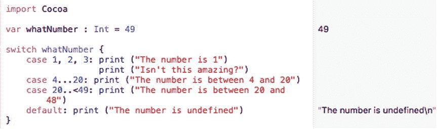

**图 7-7.** 运行检查多个值的 switch 语句

将 `whatNumber` 变量的值更改为 2、12 和 48，以查看 `switch` 语句如何匹配不同的值。

## 在枚举数据结构中使用 switch 语句

`switch` 语句通常用于检查特定的值，例如字符串或数字。然而，`switch` 语句的一个常见用途是与一种称为 `enum`（“enumeration”的缩写）的数据结构一起使用。`enum` 数据结构允许你创建一个由不同数据组成的列表，并为其赋予描述性名称，例如：

    enum dog {
        case poodle
        case collie
        case terrier
        case mutt
    }

上面的 `enum` 数据结构创建了一个名为 “dog” 的数据类型，它只能保存四个值之一：`poodle`、`collie`、`terrier` 或 `mutt`。要使用 `enum` 数据结构，你需要创建一个变量或常量，例如：

    var myPet = dog.collie

上面的代码定义了一个名为 “myPet” 的变量，并为其赋值为 `dog.collie`。如果你想检查 `myPet` 变量的值，你可以使用像这样的 `switch` 语句：

    switch myPet {
        case .poodle:
            print("Poodle")
        case .collie:
            print("Collie")
        case .terrier:
            print("Terrier")
        case .mutt:
            print("Mutt")
    }

要了解 `switch` 语句如何与 `enum` 数据结构一起工作，请按照以下步骤操作：

确保在 Xcode 中加载了 `BooleanPlayground` 文件。按如下方式编辑代码：

```
import Cocoa
enum dog {
    case poodle
    case collie
    case terrier
    case mutt
}
var myPet = dog.collie
switch myPet {
    case .poodle:
        print("Poodle")
    case .collie:
        print("Collie")
    case .terrier:
        print("Terrier")
    case .mutt:
        print("Mutt")
}
```

`switch` 语句仅查看 `myPet` 变量持有的是由 `enum` 数据结构指定的哪一个可能的值。由于该值是 `.collie`，因此 `switch` 语句打印出 “Collie”，如图 7-8 所示。

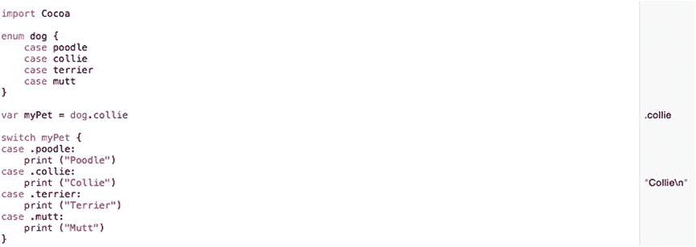

**图 7-8.** 运行检查多个值的 switch 语句


## 在 OS X 程序中做决策

使用 playground 文件测试 Swift 代码既有趣又简单，因为它让你能专注于学习 Swift 的工作方式，而不受编写程序其他部分的干扰。但最终，你需要了解 Swift 代码在 playground 文件之外是如何运行的。

在这个示例程序中，用户需要输入员工 ID 编号和密码。员工 ID 编号必须在 100 到 150 之间才有效，密码则必须与字符串 `"password"`（这并不是一个安全的密码）完全匹配。

这意味着我们将使用两个比较运算符来检查 ID 和密码是否有效，然后使用一个逻辑运算符来确保两者都有效。

按照以下步骤创建一个新的 OS X 项目：

在 Xcode 中选择 **File ➤ New ➤ Project**。在 OS X 类别下点击 **Application**。点击 **Cocoa Application**，然后点击 **Next** 按钮。Xcode 现在会询问产品名称。点击 **Product Name** 文本字段，输入 `BranchingProgram`。确保 **Language** 弹出菜单显示为 Swift，并且没有选中任何复选框。点击 **Next** 按钮。Xcode 会询问你希望将项目存储在哪里。选择一个文件夹来存储项目，然后点击 **Create** 按钮。在项目导航器中点击 `MainMenu.xib` 文件。点击 `BranchingProgram` 图标，使用户界面窗口如图 7-9 所示。

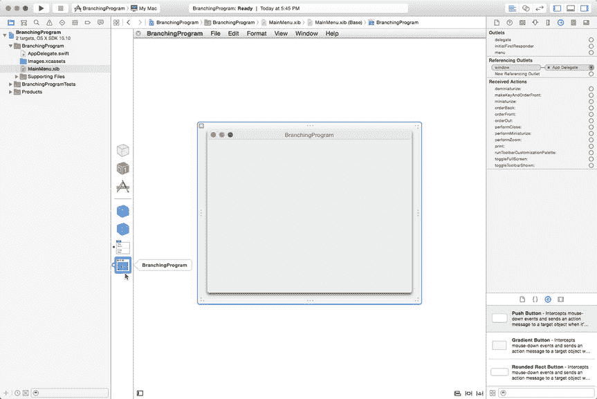

**图 7-9.** 让用户界面窗口可见

选择 **View ➤ Utilities ➤ Show Object Library**，使对象库显示在 Xcode 窗口的右下角。将两个标签、两个文本字段和一个按钮拖放到用户界面上，使其看起来类似于图 7-10。

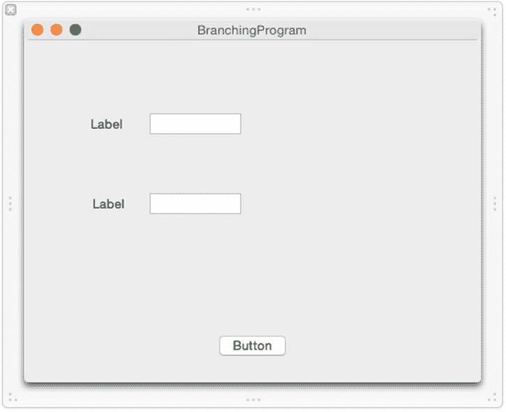

**图 7-10.** 使用标签、文本字段和按钮创建基本用户界面

点击顶部标签将其选中。然后选择 **View ➤ Utilities ➤ Show Attributes Inspector**。属性检查器面板将出现在 Xcode 窗口的右上角，如图 7-11 所示。

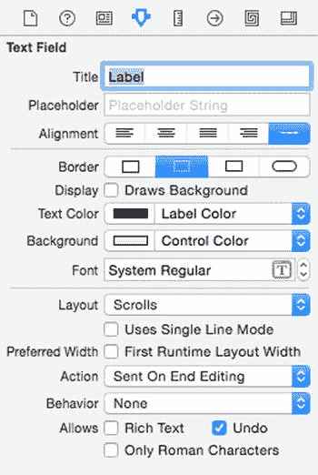

**图 7-11.** 标签的属性检查器面板

点击 **Title** 文本字段，将 "Label" 替换为 "ID"。按回车键。注意顶部标签现在显示文本 "ID"。当你更改标签的 Title 属性时，也就更改了该标签上显示的文本。接下来看看更改标签文本的第二种更快捷的方法。双击第二个标签。Xcode 会高亮显示你选中的标签，如图 7-12 所示。

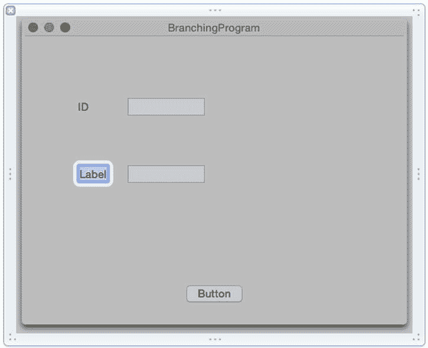

**图 7-12.** 双击标签可以直接更改文本，无需使用属性检查器面板

输入 `Password` 并按回车键。注意第二个标签现在显示 Password。通过双击标签，无需打开属性检查器面板即可更改标签上的文本。点击顶部的文本字段，选择 **View ➤ Utilities ➤ Show Size Inspector**。尺寸检查器面板将出现在 Xcode 窗口的右上角，如图 7-13 所示。

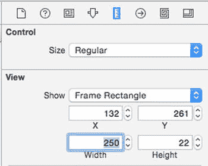

**图 7-13.** 尺寸检查器面板

点击 **Width** 文本字段，输入 `250`，然后按回车键。Xcode 会扩展文本字段的宽度。点击第二个文本字段，使其周围出现调整手柄。然后将最右侧的手柄向右拖动，直到与顶部文本字段对齐，如图 7-14 所示。

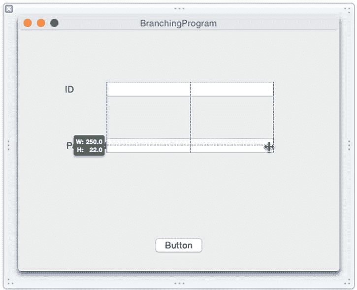

**图 7-14.** 使用鼠标对齐文本字段

松开鼠标按钮。就像你可以通过属性检查器面板或直接双击标签来修改标签文本一样，你也可以通过尺寸检查器面板或直接用鼠标调整项目大小来修改项目尺寸。双击按钮将其选中，输入 `Check Password`，然后按回车键。你完成的界面应该类似于图 7-15。

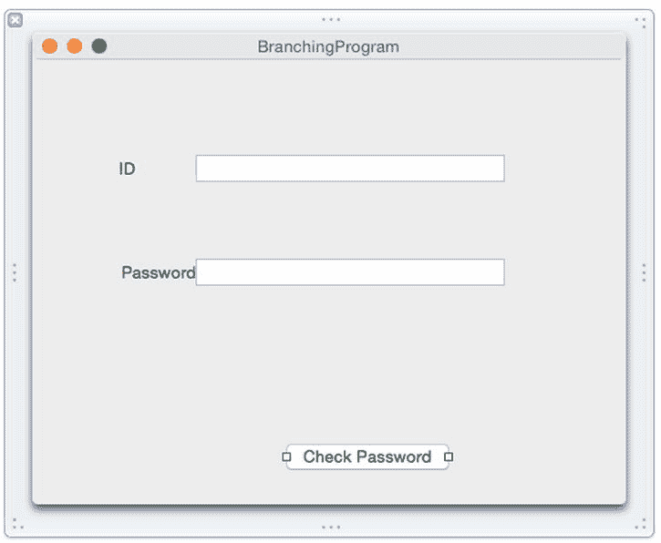

**图 7-15.** 完成后的用户界面

使用这个用户界面，用户可以在 ID 文本字段中输入 ID（整数），在 Password 文本字段中输入密码（字符串），然后点击 Check Password 按钮来检查 ID 和密码是否有效。一旦我们有了用户界面，下一步就是使用 `IBOutlet` 和 `IBAction` 方法将用户界面连接到 Swift 代码。

请记住，`IBOutlet` 让你能够从用户界面检索信息或向用户界面显示信息，而 `IBAction` 方法则让用户界面能够指示你的程序执行某些操作。

在这个例子中，我们需要两个 `IBOutlet` 变量来连接到每个文本字段，以便检索用户输入的数据。然后我们需要一个 `IBAction` 方法来连接到 Check Password 按钮。这样，当用户点击 Check Password 按钮时，`IBAction` 方法就能验证 ID 和密码。

要连接 Swift 代码到你的用户界面，请遵循以下步骤：

在用户界面仍显示在 Xcode 窗口中时，选择 **View ➤ Assistant Editor ➤ Show Assistant Editor**。`AppDelegate.swift` 文件会出现在用户界面旁边，如图 7-16 所示。

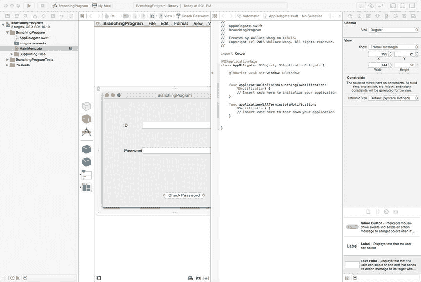

**图 7-16.** 助理编辑器在 `AppDelegate.swift` 文件旁边显示用户界面

将鼠标移到顶部文本字段上，按住 Control 键，然后从顶部文本字段拖动到 `AppDelegate.swift` 文件中现有的 `@IBOutlet` 行下方，如图 7-17 所示。

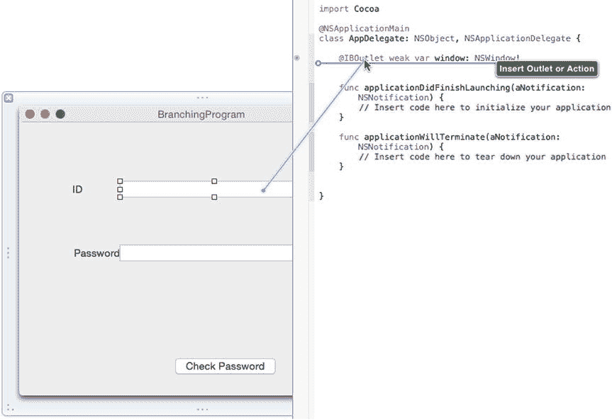

**图 7-17.** 按住 Control 键从顶部文本字段拖动到 `AppDelegate.swift` 文件

松开鼠标和 Control 键。会弹出一个窗口，如图 7-18 所示。

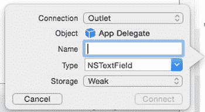

**图 7-18.** 定义 `IBOutlet` 的弹出窗口

点击 **Name** 文本字段，输入 `IDfield`，然后点击 **Connect** 按钮。Xcode 会创建一个 `IBOutlet`。将鼠标移到底部文本字段上，按住 Control 键，然后将鼠标拖动到 `AppDelegate.swift` 文件中 `@IBOutlet` 行的下方。松开鼠标和 Control 键。会弹出一个窗口。点击 **Name** 文本字段，输入 `Passwordfield`，然后点击 **Connect** 按钮。Xcode 会创建另一个 `IBOutlet`。现在你应该有两个代表用户界面上两个文本字段的 `IBOutlet`：

```swift
@IBOutlet weak var IDfield: NSTextField!
@IBOutlet weak var Passwordfield: NSTextField!
```

将鼠标移到 Check Password 按钮上，按住 Control 键，然后将鼠标拖动到 `AppDelegate.swift` 文件中最后一个花括号的上方，如图 7-19 所示。

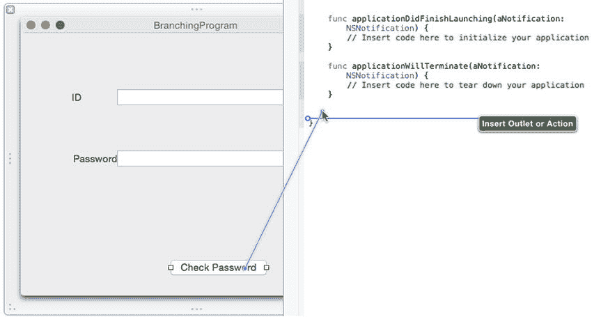

**图 7-19.** 按住 Control 键从按钮拖动到 `AppDelegate.swift` 文件

松开鼠标和 Control 键。会弹出一个窗口。点击 **Connection** 弹出菜单，选择 Action 以创建一个 `IBAction` 方法。点击 **Name** 文本字段，输入 `checkPassword`。点击 **Type** 弹出菜单，选择 `NSButton`，如图 7-20 所示。

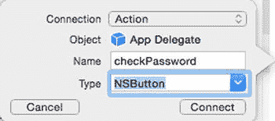


图 7-20.

定义`IBAction`方法。点击 Connect 按钮。Xcode 会创建一个空白`IBAction`方法。按如下方式修改`checkPassword` `IBAction`方法：

```swift
@IBAction func checkPassword(sender: NSButton) {
    let validPassword = "password"
    var ID : Int
    ID = IDfield.integerValue
    var myAlert = NSAlert()
    switch ID {
    case 100...150: if (Passwordfield.stringValue == validPassword) {
        myAlert.messageText = "Access granted"
    } else {
        myAlert.messageText = "No access"
        }
    default:
        myAlert.messageText = "No access"
    }
    myAlert.runModal()
}
```

这个`IBAction`方法使用`switch`语句来检查用户输入的 ID 是否在`100...150`范围内。如果是，则检查用户在密码文本字段中是否输入了 "password"。如果条件也成立，则`switch`语句会在 Alert 对话框中显示 "Access granted"。如果 ID 不在`100...150`范围内，或者密码文本字段不包含 "password"，则 Alert 对话框会显示 "No access"。

**注意**

你可能想知道上述代码中的`stringValue`和`integerValue`是从哪里来的。查看你的`IBOutlet`，会发现每个文本字段`IBOutlet`都基于`NSTextField`类。在 Xcode 的文档中查找`NSTextField`，会看到`NSTextField`基于`NSControl`类。`NSControl`类包含`stringValue`和`integerValue`等属性，这意味着任何基于`NSTextField`的类（例如代表用户界面上文本字段的`IBOutlet`）也可以使用这些`stringValue`和`integerValue`属性。

选择 Product ➤ Run。Xcode 会运行你的`BranchingProgram`项目。点击`BranchingProgram`用户界面的 ID 文本字段，输入 120。点击`BranchingProgram`用户界面的密码文本字段，输入`password`。点击 Check Password 按钮。会出现一个 Alert 对话框，如图 7-21 所示。

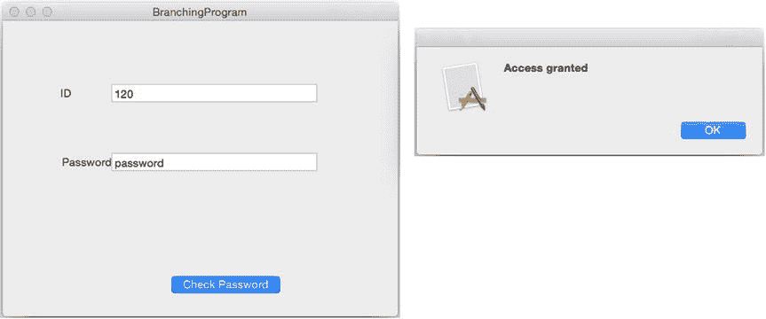

图 7-21.

显示 Alert 对话框。点击 Alert 对话框中的 OK 按钮使其消失。点击`BranchingProgram`用户界面的 ID 文本字段，输入 1。点击 Check Password 按钮。注意，现在 Alert 对话框显示 "No access"。点击 Alert 对话框中的 OK 按钮使其消失。选择 BranchingProgram ➤ Quit BranchingProgram。

### 小结

为了智能地响应用户，每个程序都需要一种决策方式。做出决策的第一步是定义一个**布尔**值，其值为`true`或`false`。可以通过比较运算符或逻辑运算符来计算布尔值。

一旦能确定一个布尔值，就可以使用该布尔值来决定在分支语句中执行哪段代码。最简单的分支是`if`语句，它可以执行一组代码，或者什么都不做。

另一种分支是`if-else`语句，它提供恰好两组可执行的代码。如果布尔值为`true`，则执行第一组代码，否则执行第二组代码。

如果需要在三组或更多代码中选择执行，可以使用`if-else if`语句。不过，通常使用`switch`语句会更简单。在使用`switch`语句时，必须考虑到所有可能的值。

`switch`语句可以匹配精确值、一个数值范围（包含起始和结束数字），或者一个半开范围（仅包含起始数字，不包含结束数字）。

分支语句与布尔值相结合，使你的程序能够根据接收到的数据做出决策并执行不同的代码。分支语句本质上让你的程序能够智能地响应外部数据。

