# 8. 用循环重复执行代码

电子补充材料 本章在线版本（doi:[10.1007/978-1-4842-1233-2_8](http://dx.doi.org/10.1007/978-1-4842-1233-2_8)）包含补充材料，可供授权用户使用。

编程的基本目标是编写尽可能少的代码，却完成尽可能多的功能。编写的代码越少，程序将来就越容易理解和修改。代码完成的功能越多，程序就越强大。

减少代码编写量的一种方法是重用存储在函数中的代码。第二种重用代码的方式是通过循环。循环可以多次运行一行或多行代码，从而无需编写多行冗余代码。

例如，如果你想打印五遍消息，可以编写如下代码：

```swift
print ("Hello")
print ("Hello")
print ("Hello")
print ("Hello")
print ("Hello")
```

这种做法很繁琐，但能生效。然而，如果你突然决定需要打印一千遍消息，那就得把这条命令写一千次。反复输入相同命令不仅枯燥，还增加了在某条命令中出错的可能性。

更简单的方法是使用循环。循环允许你只编写一次一条或多条命令，然后按需运行多次，例如：

```swift
var counter : Int = 1
while counter <= 5 {
    print ("Hello")
    counter++
}
```

上述循环运行了五次，并打印出五遍 "Hello"。如果我们想打印一千遍 "Hello"，只需将数字 5 替换为 1000。循环让代码更易于编写和修改，同时能完成更多工作。


## `while` 循环

Swift 中最简单的循环称为 `while` 循环，其结构如下：

```
while 布尔值 {

}
```

在 `while` 循环执行任何操作之前，它首先检查一个布尔值是 `true` 还是 `false`。如果为 `true`，则运行其花括号内的代码一次。然后它会再次检查该布尔值，判断其是否已变为 `false`，或者仍为 `true`。当该布尔值变为 `false` 的那一刻，`while` 循环就会停止。

由于 `while` 循环在执行任何操作前会检查一个布尔值，因此 `while` 循环有可能永远不会运行其任何代码。更重要的是，`while` 循环仅在其布尔值为 `true` 时才会运行。这意味着 `while` 循环的花括号内，必须存在一段能够最终将该布尔值变为 `false` 的代码。

如果 `while` 循环未能将其布尔值从 `true` 变为 `false`，那么循环将永远运行下去，这被称为**无限循环**。无限循环可能导致程序崩溃或冻结，使其不再响应用户或正常工作。

在最简单的层面上，`while` 循环的布尔值可以直接是 `true` 或 `false`，例如：

```
while true {

}
```

更常见的是，`while` 循环使用比较运算符来确定一个布尔值，例如：

```
while counter <= 5 {

}
```

只要 `counter <= 5` 保持为 `true`，`while` 循环就会运行。当 `counter <= 5` 不再为 `true` 时，`while` 循环就会停止。

在使用 `while` 循环时，你需要在循环开始前定义好布尔值（以确保它是 `true` 或 `false`），然后必须在 `while` 循环内部的某个地方改变这个布尔值（以确保 `while` 循环最终会停止）。

要了解布尔值如何与 `while` 循环配合使用，请按照以下步骤创建一个新的 playground：

- 启动 Xcode。
- 选择文件 ➤ 新建 ➤ Playground。（如果你看到了 Xcode 欢迎屏幕，也可以点击“开始使用 playground”。）Xcode 会要求输入 playground 名称和平台。
- 点击“名称”文本框，输入 `LoopingPlayground`。
- 点击“平台”弹出菜单，选择 OS X。Xcode 会询问你想将 playground 文件保存在哪里。
- 点击一个你想保存 playground 文件的文件夹，然后点击“创建”按钮。Xcode 会显示该 playground 文件。
- 按如下方式编辑代码：

```
import Cocoa
var counter = 1
while counter <= 10 {
    print ("Hello")
    counter++
}
```

请注意，`var counter : Int = 1` 这一行定义了变量，`while` 循环使用该变量来确定一个布尔值（`true` 或 `false`）。同时注意 `while` 循环内部的 `counter++` 这一行。它不断地改变 `while` 循环用来确定何时停止的变量。通过更改布尔比较条件（`counter <= 10`），可以改变 `while` 循环运行的次数，如图 8-1 所示。

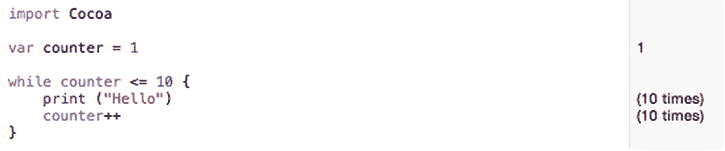

图 8-1. 在 playground 中运行 `while` 循环

使用 `while` 循环时，请记住以下几点：

- 在 `while` 循环之前，确保定义好 `while` 循环的布尔值所使用的所有变量。
- `while` 循环可能运行零次或多次。
- 在 `while` 循环内部，确保所使用的布尔值最终能够变为 `false`，以避免造成无限循环。

## `repeat-while` 循环

作为 `while` 循环的替代方案，Swift 还提供了一种 `repeat-while` 循环，其工作方式几乎相同。唯一的区别在于，`repeat-while` 循环不是在运行前检查布尔值，而是在运行后检查布尔值。

这意味着 `repeat-while` 循环**至少会运行一次**。`repeat-while` 循环的结构如下：

```
repeat {

} while 布尔值
```

与 `while` 循环类似，`repeat-while` 循环也需要在其循环内部有能够将其布尔值从 `true` 变为 `false` 的代码，并且还需要在 `repeat-while` 循环之前有代码来初始化用于计算其布尔值的所有变量。

要了解布尔值如何与 `repeat-while` 循环配合使用，请按照以下步骤操作：

- 确保 `LoopingPlayground` 文件已在 Xcode 中加载。
- 按如下方式编辑代码：

```
import Cocoa
var counter = 1
repeat {
    print ("Goodbye")
    counter++
} while counter <= 10
```

请注意，布尔值（`counter <= 10`）决定了 `repeat-while` 循环的运行次数，如图 8-2 所示。同时注意 `counter++` 等同于 `counter = counter + 1`。

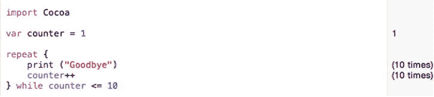

图 8-2. 在 playground 中运行 `repeat-while` 循环

请记住，`while` 循环和 `repeat-while` 循环的主要区别在于：`repeat-while` 循环至少会运行一次，而 `while` 循环可以运行零次。


## 用于计数的 `for` 循环

根据布尔值的不同，`while` 和 `repeat-while` 循环可以运行多次。如果你的代码像之前的 `while` 和 `repeat-while` 循环示例那样进行计数，那么你可以指定循环重复的次数。然而，`while` 或 `repeat-while` 循环的运行次数可能会根据其布尔值而有所不同。

例如，一个 `while` 或 `repeat-while` 循环可能会要求用户输入密码。如果密码无效，循环会再次要求输入有效密码。由于你永远无法预知用户需要尝试多少次才能输入正确的密码，因此你事先无法知道一个 `while` 或 `repeat-while` 循环会运行多少次。

这就是 `for` 循环的用途：按固定的次数运行。使用 `for` 循环，你需要定义以下内容：

*   一个计数变量
*   计数变量的初始值
*   计数变量的结束值，通常由比较运算符定义
*   用于递增或递减的增量/减量值

`for` 循环的结构如下所示：

```
for var 起始值; 布尔值; 增量值 {

}
```

`起始值` 需要定义一个用于计数的变量名和一个初始值，例如 `i = 1`。

`布尔值` 需要计算出一个 `true` 或 `false` 值，该值使用用于计数的变量，通常使用比较运算符。

`增量值` 定义如何计数。计数通常是通过加 1 实现的，但你可以使用更大的增量来计数，例如 5 或 10，甚至可以使用负数来逆向计数。计数通常使用递增/递减运算符（例如 `i++`）或复合赋值运算符（例如 `i += 15`）。

一个典型的 `for` 循环可能如下所示：

```
for var i = 1; i <= 10; i++ {

}
```

在这个 `for` 循环示例中，起始值定义了一个名为 `i` 的变量，并将其初始值设置为 1。

然后，布尔值由 `i <= 10` 定义，该值使用了计数变量 `i`。

增量值是 `i++`，它简单地将 `i` 变量的值加 1。

现在，这个 `for` 循环从 1 开始计数，不断重复循环并将 `i` 变量加 1，只有当布尔值 `i <= 10` 不再为真时才会停止，当 `i` 变量等于 11 时就会发生这种情况。

要了解布尔值如何与 `for` 循环配合使用，请按照以下步骤操作：

确保 `LoopingPlayground` 文件已加载到 Xcode 中。按如下方式编辑代码：

```
import Cocoa
for var i = 1; i <= 10; i++ {
    print ("问候语")
}
for var i = 21; i <= 120; i += 10 {
    print ("问候语")
}
```

注意，在第二个 `for` 循环中，初始起始值不是 1，并且增量计数器不是每次加 1。然而，它仍然产生与第一个 `for` 循环完全相同的结果。在选择起始值、停止循环的布尔值以及增量计数器时，你可以根据自己的意愿随意发挥创意。不过，最好让 `for` 循环尽可能保持简单，这样它们才易于理解和修改。图 8-3 显示了这两个 `for` 循环运行的结果。

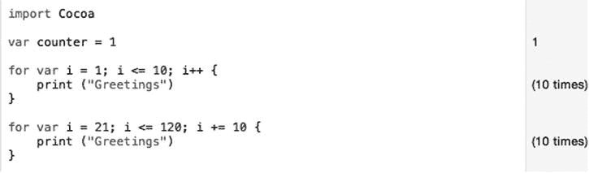

**图 8-3.** 运行两个相同的 `for` 循环

## `for-in` 语句

`for` 循环根据其起始值、布尔值和增量计数器，总是按固定的次数运行。然而，你必须指定布尔值才能使 `for` 循环最终停止。

由于你可能并不总是知道 `for` 循环应根据不同的数据在何时停止，Swift 还提供了 `for-in` 循环。其主要优势在于 `for-in` 循环自动知道如何计数，因此你无需指定何时停止。

`for-in` 循环的结构如下所示：

```
for 计数变量 in 列表项 {

}
```

`计数变量` 对某种列表中的每一项进行计数。该列表可以是字符串或数组（你将在后面了解到）。主要思想是 `for-in` 循环自动知道如何计算列表中有多少项。

例如，如果你想根据字符串的长度按固定次数运行一个 `for` 循环，可以这样做：

```
let name = "Oscar"
var nameLength = count(name)
for var i = 0; i < nameLength; i++ {
    print ("你好")
}
```

在这个例子中，`name` 保存了包含五个字符的字符串 `"Oscar"`。`nameLength` 变量统计了 `name` 变量中的字符数（即 5）。现在 `for` 循环使用 `"Oscar"` 字符串的长度（5）来确定运行 `for` 循环的次数。

以下是等效的 `for-in` 循环的样子：

```
for name in "Oscar" {
    print ("你好")
}
```

注意 `for-in` 循环看起来要简洁得多。这个 `for-in` 循环根据存储在 `"Oscar"` 字符串中的字符数（即 5）持续运行。由于 `for-in` 循环可以自动自行计数，它减少了你需要编写的代码量，同时提高了准确性。

`for-in` 循环在处理数组（你将在后面了解到）时特别方便。要了解 `for-in` 循环如何工作，请按照以下步骤操作：

确保 `LoopingPlayground` 文件已加载到 Xcode 中。按如下方式编辑代码：

```
import Cocoa
let names = ["Oscar", "Sally", "Marty", "Louis"]
for person in names {
    print (person)
}
```

图 8-4 显示了 `for-in` 循环如何运行四次，因为 `names` 数组包含四个项。如果从该数组中添加或删除一个名字，`for-in` 循环会自动计算数组中新项的数量。

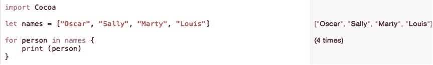

**图 8-4.** 使用 `for-in` 循环进行计数

## 提前退出循环

通常情况下，循环会一直运行直到布尔值发生变化。然而，你可以使用 `break` 命令提前退出循环。通常这个循环会运行四次：

```
let names = ["Oscar", "Sally", "Marty", "Louis"]
for person in names {
    print (person)
}
```

如果你插入一个 `break` 命令，可以让这个循环只运行一次后退出，如下所示：

```
let names = ["Oscar", "Sally", "Marty", "Louis"]
for person in names {
    print (person)
    break
}
```

这个 `for-in` 循环将运行一次，打印名字 `"Oscar"`，遇到 `break` 命令，然后退出 `for-in` 循环。当然，在 `for-in` 循环中总是放置一个 `break` 命令来提前停止它是毫无意义的，因此更常见的是将 `break` 命令与分支语句结合使用。这样，如果某个布尔值为真，循环就会提前退出。否则，循环会继续运行。

要了解如何提前退出循环，请按照以下步骤操作：

确保 `LoopingPlayground` 文件已加载到 Xcode 中。按如下方式编辑代码：

```
import Cocoa
let employees = ["Fred", "Jane", "Sam", "Kelly"]
for person in employees {
    if person == "Sam" {
        print (person)
        break
    }
    print (person)
}
```

这个 `for-in` 循环通常会运行四次，因为 `employees` 数组包含四个名字。然而，一旦 `for-in` 循环找到名字 `"Sam"`，它就会打印该名字，遇到 `break` 命令，并提前退出 `for-in` 循环，因此它只运行了两次，如图 8-5 所示。

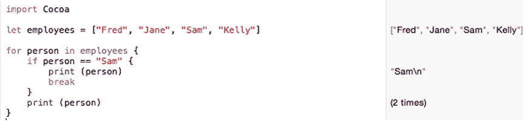

**图 8-5.** 使用 `break` 命令提前退出循环


## 在 OS X 程序中使用循环

在这个示例程序中，计算机会在 1 到 10 之间随机选择一个数字。现在用户必须猜出这个数字。为了防止用户猜出 1 到 10 范围之外的数字，用户界面将允许用户通过滑块选择数值。

每次用户猜错时，标签会显示提示信息，告知猜测值过高或过低。当用户猜对数字时，一个循环会打印出每次猜测的列表，并在警告对话框中显示。

按照以下步骤创建一个新的 OS X 项目：

在 Xcode 中选择 **文件** ➤ **新建** ➤ **项目**。点击 OS X 类别下的 **应用程序**。点击 **Cocoa 应用程序**，然后点击 **下一步** 按钮。Xcode 现在会要求输入产品名称。在 **产品名称** 文本字段中点击并输入 `LoopingProgram`。确保 **语言** 弹出菜单显示的是 **Swift**，且未选中任何复选框。点击 **下一步** 按钮。Xcode 会询问您希望将项目存储在何处。选择一个文件夹来存储您的项目，然后点击 **创建** 按钮。在 **项目导航器** 中点击 `MainMenu.xib` 文件。点击 `LoopingProgram` 图标，使用户界面窗口显示出来，如图 8-6 所示。

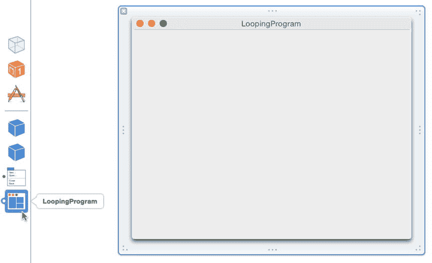

图 8-6.

使用户界面窗口可见。选择 **视图** ➤ **实用工具** ➤ **显示对象库**，使 **对象库** 显示在 Xcode 窗口的右下角。将一个 **水平滑块**、两个 **标签** 和一个 **按钮** 拖到用户界面上，并调整它们的大小，使用户界面看起来类似于图 8-7。

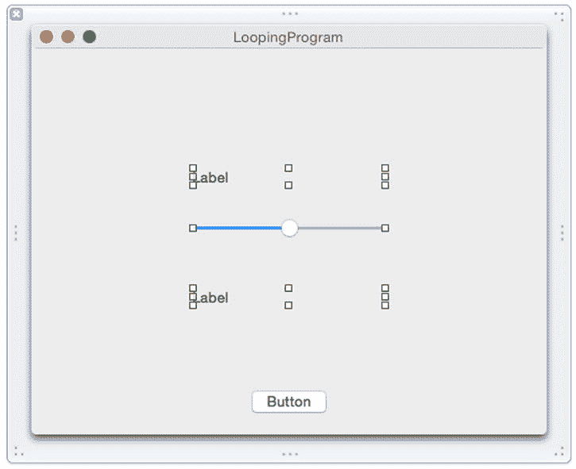

图 8-7.

创建一个包含两个标签、一个水平滑块和一个按钮的基本用户界面。点击顶部的标签将其选中。然后选择 **视图** ➤ **实用工具** ➤ **显示属性检查器**。 **属性检查器** 面板会出现在 Xcode 窗口的右上角。在 **标题** 文本字段中点击并输入 `猜一个数字`。点击 **居中对齐** 图标，如图 8-8 所示。

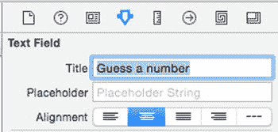

图 8-8.

标签的 **属性检查器** 面板。双击底部的标签，输入 `你的猜测 =`，然后按 **回车** 键。双击 **按钮**，输入 `猜测`，然后按 **回车** 键。您的用户界面应该看起来像图 8-9。

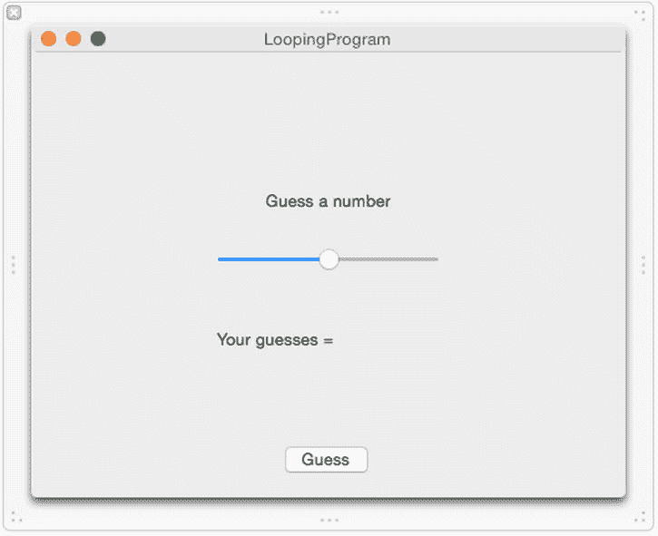

图 8-9.

完成后的用户界面。点击 **水平滑块** 将其选中，然后选择 **视图** ➤ **实用工具** ➤ **显示属性检查器**。 **属性检查器** 面板会出现在 Xcode 窗口的右上角。选中 **“仅在刻度标记处停止”** 复选框。在 **“仅在刻度标记处停止”** 复选框正上方的文本字段中点击并输入 `10`。在 **最小值** 文本字段中点击并输入 `1`。在 **最大值** 文本字段中点击并输入 `10`。在 **当前值** 文本字段中点击并输入 `5`，如图 8-10 所示。

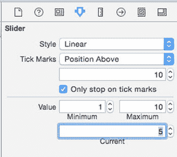

图 8-10.

更改水平滑块属性

通过这个用户界面，用户可以使用水平滑块在 1 到 10 之间选择一个数字。如果用户猜的数值过高，标签会显示“过高”。如果用户猜的数值过低，标签会显示“过低”。

每次用户猜错时，底部的标签会显示错误的猜测值。当用户猜对数字时，顶部的标签会显示“你猜对了！”。

在此示例中，我们需要两个 `IBOutlet` 变量来连接到每个标签，以便我们可以在每个标签上显示信息。然后我们需要一个 `IBAction` 方法来连接到 **猜测** 按钮。这样，当用户点击 **猜测** 按钮时，`IBAction` 方法可以检查用户是否使用水平滑块选择了正确的数字。

我们需要编写 Swift 代码，在 1 到 10 之间选择一个随机数。然后我们将使用一个循环列出用户所做的所有猜测，并在警告对话框中显示这些结果。

要将 Swift 代码连接到您的用户界面，请执行以下步骤：

在 Xcode 窗口中保持您的用户界面可见，选择 **视图** ➤ **助理编辑器** ➤ **显示助理编辑器**。`AppDelegate.swift` 文件会出现在用户界面的旁边。将鼠标移到顶部的标签上，按住 **Control** 键，从顶部的文本字段拖拽到 `AppDelegate.swift` 文件中现有 `@IBOutlet` 行的下方，如图 8-11 所示。

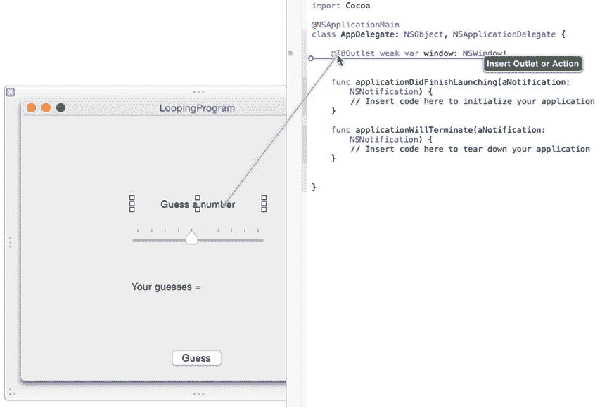

图 8-11.

从顶部标签按住 Control 键拖拽到 `AppDelegate.swift` 文件。松开鼠标和 **Control** 键。会弹出一个弹出窗口，如图 8-12 所示。

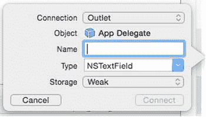

图 8-12.

用于定义 `IBOutlet` 的弹出窗口。在 **名称** 文本字段中点击并输入 `messageLabel`，然后点击 **连接** 按钮。Xcode 会创建一个 `IBOutlet`。将鼠标移到底部的标签上，按住 **Control** 键，将鼠标拖拽到 `AppDelegate.swift` 文件中 `@IBOutlet` 行的下方。松开鼠标和 **Control** 键。会弹出一个弹出窗口。在 **名称** 文本字段中点击并输入 `guessLabel`，然后点击 **连接** 按钮。Xcode 会创建另一个 `IBOutlet`。将鼠标移到水平滑块上，按住 **Control** 键，将鼠标拖拽到 `AppDelegate.swift` 文件中 `@IBOutlet` 行的下方。松开鼠标和 **Control** 键。会弹出一个弹出窗口。在 **名称** 文本字段中点击并输入 `guessSlider`，然后点击 **连接** 按钮。Xcode 会创建另一个 `IBOutlet`。您现在应该有三个 `IBOutlet`，代表您用户界面上的两个文本字段：

```
@IBOutlet weak var messageLabel: NSTextField!
@IBOutlet weak var guessLabel: NSTextField!
@IBOutlet weak var guessSlider: NSSlider!
```

编辑 `IBOutlet` 下方的内容，使其看起来像这样：

```
import Cocoa

@NSApplicationMain
class AppDelegate: NSObject, NSApplicationDelegate {

    @IBOutlet weak var window: NSWindow!
    @IBOutlet weak var messageLabel: NSTextField!
    @IBOutlet weak var guessLabel: NSTextField!
    @IBOutlet weak var guessSlider: NSSlider!

    var randomNumber : Int
    var guessHistory : String
    var guessNumber : Int
    var guessArray = [Int]()
    var arrayTotal : Int

    override init () {
        self.guessHistory = ""
        self.guessNumber = 0
        self.guessArray = []
        self.arrayTotal = 0
        self.randomNumber = 1 + Int(arc4random_uniform(10))
        // Int(arc4random_uniform(10)) 在 0 到 9 之间选择一个随机数，因此我们需要加 1，使其在 1 到 10 之间选择随机数
    }

    func applicationDidFinishLaunching(aNotification: NSNotification) {
        // 在此处插入代码以初始化您的应用程序
    }

    func applicationWillTerminate(aNotification: NSNotification) {
        // 在此处插入代码以关闭您的应用程序
    }
```

`IBOutlet` 变量连接到用户界面上的项目。

```
@IBOutlet weak var window: NSWindow!

@IBOutlet weak var messageLabel: NSTextField!

@IBOutlet weak var guessLabel: NSTextField!

@IBOutlet weak var guessSlider: NSSlider!
```

接下来的五行声明了整个类 `AppDelegate` 可以使用的变量。

```
var guessHistory : String

var guessNumber : Int

var guessArray = [Int]()

var arrayTotal : Int

var randomNumber : Int
```


当你在类内部定义变量（称为属性）时，需要为它们指定初始值。这就是重写`init`方法的目的：

```
override init () {
    self.guessHistory = ""
    self.guessNumber = 0
    self.guessArray = []
    self.arrayTotal = 0
    self.randomNumber = 1 + Int(arc4random_uniform(10))
    // Int(arc4random_uniform(10)) 会在 0 到 9 之间选择一个随机数，因此我们需要加 1，使其在 1 到 10 之间选择随机数
}
```

`self`关键字告诉 Xcode 所有这些变量都是在同一个类（`AppDelegate`类）内部定义的。最后一行创建了一个 1 到 10 之间的随机数。

整个程序的工作方式是：首先创建所有变量，然后运行重写的`init`方法来为这些变量存储初始值。

将鼠标移到 Guess 按钮上，按住 Control 键，然后将鼠标拖拽到`AppDelegate.swift`文件中最后一个右花括号的上方。松开鼠标和 Control 键。此时会弹出一个窗口。在 Connection 弹出菜单中点击并选择 Action 来创建一个`IBAction`方法。在 Name 文本框中点击并输入`checkGuess`。在 Type 弹出菜单中点击并选择`NSButton`，如图 8-13 所示。

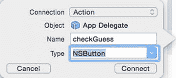

**图 8-13. 定义一个`IBAction`方法**  
点击 Connect 按钮。Xcode 会创建一个空的`IBAction`方法。按下述方式修改`IBAction checkGuess`方法：

```
@IBAction func checkGuess(sender: NSButton) {
    var userGuess : Int = 0
    // 从水平滑块获取猜测值
    userGuess = guessSlider.integerValue
    // 将猜测值存储在 guessArray 中
    guessArray.append(userGuess)
    if userGuess < randomNumber {
        messageLabel.stringValue = "Too Low"
    } else if userGuess > randomNumber {
        messageLabel.stringValue = "Too High"
    } else {
        messageLabel.stringValue = "You got it!"
        arrayTotal = guessArray.count
        for var i = 0; i < arrayTotal; i++ {
            guessHistory += "Guess \(i+1) = \(guessArray[i])" + "\r\n"
        }
        var myAlert = NSAlert()
        myAlert.messageText = guessHistory
        myAlert.runModal()
    }
    guessLabel.stringValue = guessLabel.stringValue + " \(userGuess)"
}
```

让我们逐一讲解这个`IBAction`方法，以便你准确理解其执行过程。首先，用户需要使用水平滑块选择一个数字进行猜测。选择数字后，用户需要点击 Guess 按钮，这将触发名为`checkGuess`的`IBAction`方法。

下面这行声明了一个名为`userGuess`的整型变量，并将其值设置为 0。这行代码并非绝对必要，但它确保了`userGuess`变量有一个初始值。

```
var userGuess : Int = 0
```

下一行从水平滑块中获取值，该滑块由名为`guessSlider`的`IBOutlet`变量表示。要获取水平滑块所代表的整数值，必须使用`integerValue`属性。这将把水平滑块的值存储到我们刚刚声明为整型变量的`userGuess`变量中。

```
userGuess = guessSlider.integerValue
```

下一行将存储在`userGuess`变量中的值添加到名为`guessArray`的数组中。这个数组必须在程序的前面部分定义。

```
guessArray.append(userGuess)
```

`if-else if`语句创建了三个分支。第一个分支在`userGuess`变量小于`randomNumber`变量时执行，`randomNumber`必须在程序前面定义。这会在由`messageLabel`这个`IBOutlet`表示的标签中显示文本“Too Low”。

```
if userGuess < randomNumber {
    messageLabel.stringValue = "Too Low"
```

第二个分支在`userGuess`变量大于`randomNumber`变量时执行。这会在`messageLabel`标签中显示文本“Too High”。

```
} else if userGuess > randomNumber {
    messageLabel.stringValue = "Too High"
```

第三个分支在`userGuess`变量既不小于也不大于`randomNumber`变量时执行，这意味着它必须恰好等于`randomNumber`变量。这会在`messageLabel`标签中显示文本“You got it!”。

```
} else {
    messageLabel.stringValue = "You got it!"
```

然后，它统计存储在`guessArray`中的项目总数，并将这个值放入`arrayTotal`变量中，该变量必须在程序前面定义。

```
arrayTotal = guessArray.count
```

现在，它使用一个`for`循环从 0 计数到`arrayTotal - 1`（`i < arrayTotal`），每次递增 1（`i++`）。它创建一个字符串，存储猜测序号（例如 Guess 1）和用户选择的猜测值，放到名为`guessHistory`的字符串变量中，该变量必须在程序前面定义。请注意，你可以通过在字符串中使用`\(...)`字符来打印数字，其中非字符串值出现在圆括号内。这使你可以将非字符串值存储在字符串中，而无需先将它们转换为字符串数据类型。

另请注意，如果你直接输入`"Guess \(i)"`，那么第一个字符串将存储值“Guess 0”作为第一次猜测。为避免这种情况，我们需要在当前`i`值上加 1。

注意，字符串末尾还包含字符`"\r\n"`。这些符号分别代表回车符和换行符。这些是不可见字符，用于告诉 Xcode，如果我们添加更多文本，它将显示在下一行。

```
for var i = 0; i < arrayTotal; i++ {
    guessHistory += "Guess \(i+1) = \(guessArray[i])" + "\r\n"
}
```

`for`循环内部的代码使用复合赋值运算符（`+=`）将此字符串添加到`guessHistory`变量中已有的任何字符串中。由于`"\r\n"`字符会创建回车和换行，任何新添加的字符串都将出现在下一行。

接下来的三行创建一个警报对话框（`NSAlert`），将`guessHistory`变量中的字符串存储到警报对话框的`messageText`属性中，然后显示该对话框，以显示你猜了多少次以及每次猜测时选择的数字，如图 8-14 所示。

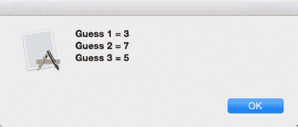

**图 8-14. 警报对话框中显示的典型结果**

```
var myAlert = NSAlert()
myAlert.messageText = guessHistory
myAlert.runModal()
```

`IBAction`方法的最后一行仅将用户的猜测存储在`guessLabel`这个`IBOutlet`中，这使得文本显示在底部的标签中。

```
guessLabel.stringValue = guessLabel.stringValue + " \(userGuess)"
```

此时，程序等待用户通过水平滑块选择一个值并点击 Guess 按钮。

选择 Product ➤ Run。Xcode 会运行你的`LoopingProgram`工程。在水平滑块上点击一个值来猜测一个数字。点击 Guess 按钮。如果你猜得太低或太高，会分别显示“Too Low”或“Too High”消息。最终当你猜中正确的数字时，会弹出一个 Alert 对话框，如图 8-15 所示。

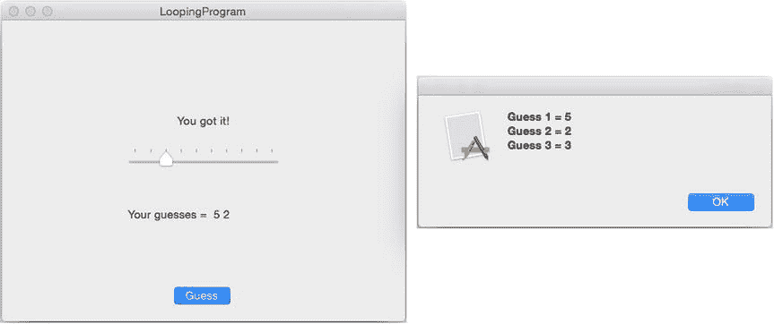

**图 8-15. 显示 Alert 对话框**  
点击 Alert 对话框中的 OK 按钮使其消失。选择 LoopingProgram ➤ Quit LoopingProgram。


## 摘要

循环允许你重复执行一行或多行代码，其运行机制是不断执行代码直到布尔值变为 `false`。`while` 循环会先检查一个布尔值，这意味着它可能执行零次或多次。`repeat-while` 循环则在最后检查布尔值，这意味着它至少会执行一次。

`for` 循环允许你根据起始值、一个布尔值以及一个递增计数运算符来指定循环的执行次数。`for-in` 循环可以自动统计列表中的项目数量。

在创建循环时，务必确保循环有结束的方式。如果循环永不结束，就会变成无限循环，这会导致你的程序看起来像死机且无响应。

每种类型的循环各有优缺点，但你总能通过一种循环来模拟其他循环的功能。如果需要提前退出循环，可以使用 `break` 命令配合 `if` 语句。

循环让你的程序有能力完成重复性任务，而无需你编写重复的命令。只需确保你的循环最终总会结束，并且在停止前能够运行正确的次数。

