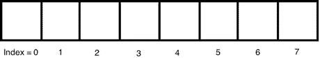
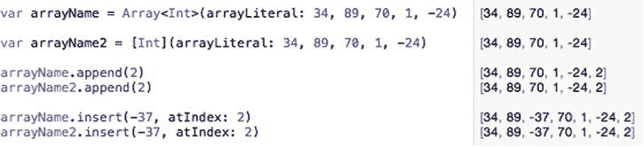
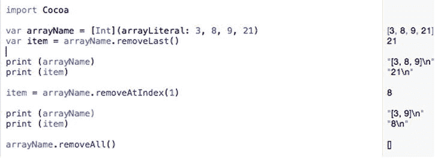
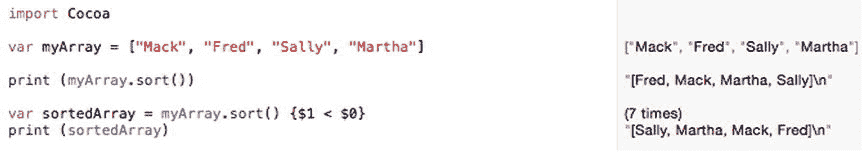
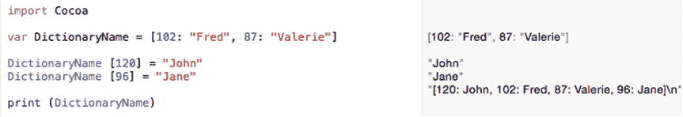
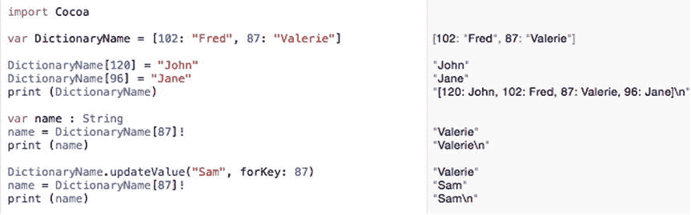
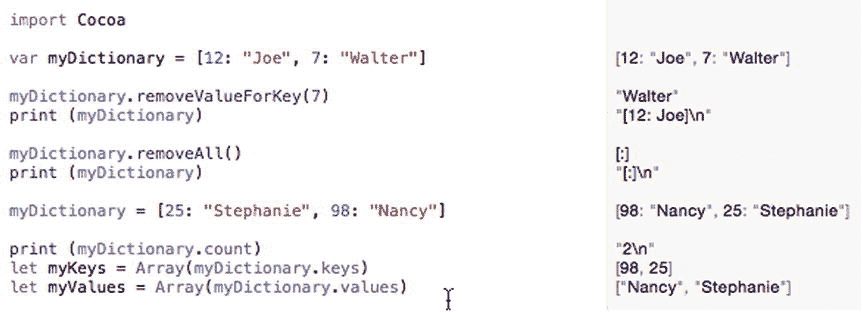
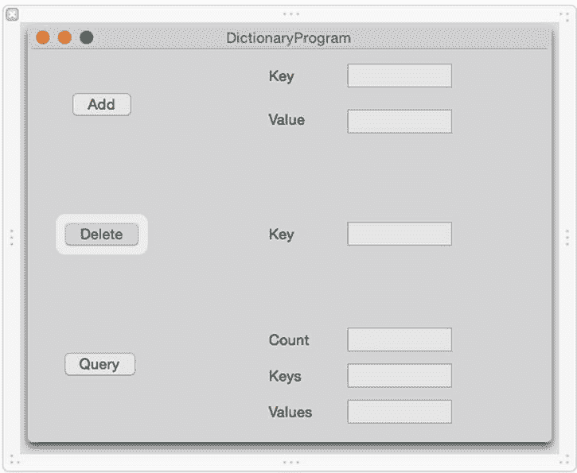
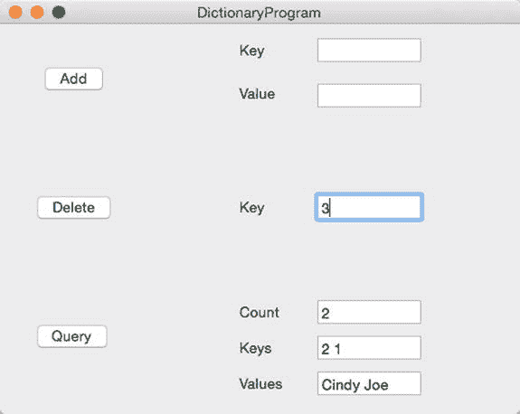

# 9. 数组与字典

电子补充材料 本章在线版本 (doi:[10.​1007/​978-1-4842-1233-2_​9](http://dx.doi.org/10.1007/978-1-4842-1233-2_9)) 包含补充材料，仅供授权用户使用。

几乎每个程序都需要接收数据，以便处理数据并计算出有用的结果。临时存储数据的最简单方式是通过可以存储数字或文本字符串的变量。但是，如果你需要存储多个数据块，例如一个姓名列表或一个产品编号列表，该怎么办？你可以像这样创建多个变量：

`var employee001, employee002, employee003 : String`

不幸的是，创建独立的变量来存储相关数据可能很笨拙。如果你不知道需要存储多少项数据怎么办？那么你可能会创建太多或不够用的变量。更糟糕的是，将相关数据存储在独立的变量中，很容易忽略数据之间的关联性。

例如，如果你将三个员工的名字存储在三个不同的变量中，你如何知道是否还有第四个、第五个或第六个变量包含额外的员工姓名？除非你在代码中将变量保持在一起，否则很容易遗漏存储在独立变量中的相关数据。

这就是为什么 Swift 提供了另外两种存储数据的方式：数组和字典。这两种数据结构背后的核心理念是，创建一个可以容纳多个项目的单个变量。现在，你可以将相关数据存储在一个地方，并轻松地再次查找和检索它。

数组和字典都旨在存储同一数据类型的多个副本，例如一个姓名列表（`String`）或一个数字列表（`Int`）。如果你想存储一个由不同类型数据（如整数、小数和字符串）组成的列表，你可以将数组或字典声明为持有 `AnyObject` 数据类型，它可以存储任何类型的数据。

## 使用数组

你可以将数组想象成一个由无数个桶组成的序列，每个桶正好可以容纳一块数据。为了帮助你找到存储在数组中的数据，每个数组元素（桶）都由一个称为索引的数字来标识。数组中的第一项定义在索引 0 处，第二项定义在索引 1 处，第三项定义在索引 2 处，依此类推，如图 9-1 所示。



图 9-1. 数组的结构

要创建一个数组，你必须定义数组的名称以及该数组可以容纳的数据类型。创建数组的一种方法如下：

`var arrayName = Array<DataType>()`

数组名称可以是任何你想要的名字，不过最好选择一个描述性的名称来标识数组所保存的数据类型，例如 `employeeArray`。数据类型可以是 `Int`（整数）、`String`（字符串）、`Float` 或 `Double`（小数），甚至是另一个数据结构的名称。（数组中可以包含其他数组。）

创建数组的第二种方法如下：

`var arrayName = [DataType]()`

这两种方法都会创建一个空数组。此时，你需要开始向该数组中添加项目。如果你想在创建数组的同时用它存储项目，你需要使用 `arrayLiteral` 关键字，例如：

`var arrayName = Array<Int>(arrayLiteral: 34, 89, 70, 1, -24)`

或

`var arrayName = Int`

这两个命令都创建了一个名为 `arrayName` 且只能保存整数的数组。然后，`arrayLiteral` 关键字后面跟着整数列表，用数据填充数组。因为你必须定义数据类型，所以这两种方法都可以与 `AnyObject` 一起使用，以便在数组中存储不同类型的数据。

创建数组的一种更短、更简单的方法是定义一个数组名称，并将其设置为一个包含相同数据类型的项目列表，如下所示：

`var myArrray = [34, 89, 70, 1, -24]`

然后 Swift 会根据数据推断数组的数据类型。此方法仅在数组中的所有项目都是同一数据类型（例如全是整数或全是小数）时才有效。

**注意**

当你使用 `var` 关键字声明一个数组时，你可以向该数组添加和删除项目。如果你不希望数组被修改，请使用 `let` 关键字声明它，如下所示：`let arrayName = [34, 89, 70, 1, -24]`。使用 `let` 关键字声明的数组永远无法修改。

在之前保存整数的数组示例中，第一个数字 (34) 在索引 0 处，第二个数字 (89) 在索引 1 处，第三个数字 (70) 在索引 2 处，第四个数字 (1) 在索引 3 处，第五个数字 (-24) 在索引 4 处。因为数组从 0 开始计算索引号，所以 Swift 数组被称为基于零的数组。（某些编程语言从 1 开始计算数组的索引，因此它们被称为基于一的数组。）


好的，作为一名高级文档工程师和翻译员，我将严格按照您提供的注意事项和示例格式，将以下英文文本翻译成中文。


### 向数组添加元素

无论数组是空的还是已经填充了数据，你都可以使用 `append` 命令向数组中添加更多元素，如下所示：

`arrayName.append(data)`

你必须指定要添加数据的数组名称，并将实际数据放在括号中。确保添加的数据具有正确的数据类型。因此，如果要将数据添加到一个只能保存整数的数组中，则只能向该数组添加另一个整数。

除了使用 `append` 命令，你还可以使用加法复合赋值运算符向数组末尾添加元素，如下所示：

`arrayName3 += [data1, data2, data3, ... dataN]`

`+=` 复合赋值运算符可以向数组末尾添加多个元素，而 `append` 命令一次只能向数组末尾添加一个元素。

`append` 命令总是将新元素添加到数组的末尾。如果要将新元素添加到数组中的特定位置，可以使用 `insert` 和 `atIndex` 命令，如下所示：

`arrayName.insert(data, atIndex: index)`

使用 `insert` 命令，你必须添加与该数组数据类型一致的数据。然后，你还必须指定索引编号。如果你选择的索引编号大于数组大小，`insert` 命令将无法生效。

要了解如何创建数组并向其中添加数据，请按照以下步骤创建一个新的 playground：

-   启动 Xcode。
-   选择 **文件** ➤ **新建** ➤ **Playground**。（如果你看到 Xcode 欢迎屏幕，也可以点击 **开始使用 playground**。）Xcode 会要求你输入 playground 名称和平台。
-   点击 **名称** 文本字段并输入 `ArrayPlayground`。
-   点击 **平台** 弹出菜单并选择 **OS X**。Xcode 会询问你希望将 playground 文件保存在哪里。
-   点击一个你想要保存 playground 文件的文件夹，然后点击 **创建** 按钮。Xcode 会显示该 playground 文件。
-   按如下方式编辑代码：

```
import Cocoa
var arrayName = Array<Int>(arrayLiteral: 34, 89, 70, 1, -24)
var arrayName2 = Int
arrayName.append(2)
arrayName2.append(2)
arrayName.insert(-37, atIndex: 2)
arrayName2.insert(-37, atIndex: 2)
```

注意 `append` 和 `insert` 命令的工作方式有何不同，如图 9-2 所示。



图 9-2. 在 Playground 中创建数组

### 从数组删除元素

就像你可以向数组添加元素一样，你也可以从数组中删除元素。要删除数组中的最后一个元素，你可以使用 `removeLast` 命令，如下所示：

`arrayName.removeLast()`

这不仅会删除数组中的最后一个元素，还会返回该值。如果你想将数组的最后一个元素保存到一个变量中，可以这样做：

`var item = arrayName.removeLast()`

如果你想从数组中删除一个特定元素，你可以使用 `removeAtIndex` 命令来标识该元素的索引编号，如下所示：

`arrayName.removeAtIndex(number)`

因此，如果你想删除数组中的第二个元素，你应指定索引为 1。与 `removeLast` 命令一样，`removeAtIndex` 命令也会返回一个值，你可以将其存储在变量中，如下所示：

`var item = arrayName.removeAtIndex(1)`

如果你想删除数组中的所有元素，可以使用 `removeAll` 命令，如下所示：

`arrayName.removeAll()`

要了解如何从数组中删除元素，请按照以下步骤操作：

-   确保在 Xcode 中加载了 `ArrayPlayground` 文件。
-   按如下方式编辑代码：

```
import Cocoa
var arrayName = Int
var item = arrayName.removeLast()
print (arrayName)
print (item)
item = arrayName.removeAtIndex(1)
print (arrayName)
print (item)
arrayName.removeAll()
```

注意在从数组中删除元素时，不同命令的工作方式，如图 9-3 所示。指定索引值时，必须确保索引编号存在。这意味着如果一个数组包含三个元素，则第一个元素的索引为 0，第二个元素的索引为 1，第三个元素的索引为 2。因此，你可以从该数组中删除索引值为 0、1 或 2 的元素，但任何其他索引编号都将无效。



图 9-3. 从数组中删除元素

从数组中删除元素会物理地从该数组中移除该元素。除了从数组中删除元素，你也可以用新值替换现有元素。你只需指定要替换的数组元素的索引值，并为其分配新数据，如下所示：

`arrayName[index] = newData`

因此，如果你想用新数据替换数组中的第二个元素（索引值为 1），你可以执行以下操作：

`arrayName[1] = 91`

数组中索引值为 1 处存储的任何现有值都将被数字 91 替换。替换数据时，新数据必须与数组中的其他元素具有相同的数据类型，例如整数或字符串。

### 查询数组

当你拥有一个数组时，你可能想知道该数组是否为空（其中存储了零个元素），或者如果数组中有元素，则想知道它包含多少个元素。要确定数组是否为空，你可以使用 `isEmpty` 命令，该命令返回一个布尔值，如下所示：

`arrayName.isEmpty`

如果你想将此布尔值存储到变量中，可以这样做：

`var flag = arrayName.isEmpty`

如果你想知道数组中存储了多少个元素，可以使用 `count` 命令，如下所示：

`arrayName.count`

如果你想将此整数值存储到变量中，可以这样做：

`var total = arrayName.count`

如果你只想访问单个数组元素，你可以从数组中复制它并将其值存储到变量中，如下所示：

`var item = arrayName[index]`

这允许你从数组中的特定索引位置检索一个元素，并将该值存储到变量中。从数组中检索数据时，请确保指定了有效的索引值。因此，如果数组包含三个元素，则索引值分别为 0、1 和 2。这意味着如果你想检索数组中的第二个元素（索引为 1），你可以使用以下代码：

`var item = arrayName[1]`

### 操作数组

操作数组的两种常见方法是反转所有元素的顺序，或者按升序或降序重新排列元素。这只是反转数组中所有元素的顺序，而不考虑它们的实际值，例如：

`arrayName.reverse()`

当你按升序对数组进行排序时，最低值存储在数组的第一个元素中，最高值存储在数组的最后一个元素中。当你对字符串进行排序时，Swift 会按字母顺序对它们进行排序。要按升序对数组进行排序，你有两个选择：

`myArray.sort { $0 < $1 }`

或

`myArray.sort ()`

当你按降序对数组进行排序时，最高值存储在数组的第一个元素中，最低值存储在数组的最后一个元素中。当你对字符串进行排序时，Swift 会按反向字母顺序对它们进行排序。要按降序对数组进行排序，请使用以下代码：

`myArray.sort { $1 < $0 }`

要了解数组排序是如何工作的，请按照以下步骤操作：

-   确保在 Xcode 中加载了 `ArrayPlayground` 文件。
-   按如下方式编辑代码：

```
import Cocoa
var myArray = ["Bob", "Fred", "Jane", "Mary"]
print (myArray.sort())
var sortedArray = myArray.sort() { $1 < $0 }
print (sortedArray)
```

注意，对数组进行排序会根据元素的内容改变它们的位置，如图 9-4 所示。



图 9-4. 对数组进行排序


## 使用字典

数组对于存储相关数据的列表很有用。数组最大的缺点在于当你想要检索特定数据时。除非你知道数组中某个项的确切索引号，否则检索数据可能会很麻烦。

这正是字典的优势所在。与只存储数据的数组不同，字典存储两个数据块，称为键值对。值代表你想要保存的数据，而键代表一种快速检索数据的方式。

例如，考虑一个电话号码列表。如果你把电话号码存储在数组中，就必须知道确切的索引值才能检索到特定的电话号码。但是，如果你把电话号码存储在字典中，就可以将每个电话号码（值）与一个姓名（键）一起存储。现在，如果你想检索某个特定的电话号码，只需搜索这个键（人名）即可。

无论该数据存储在字典中的哪个位置，你都可以使用键快速检索到值。这使得从字典中检索数据比从数组中检索类似数据要容易得多。

可以将字典视为一种数组，但它不是存储一个数据块，而是存储一对数据（一个键和一个值）。键和值可以是不同的数据类型，但一个字典中所有键必须是相同的数据类型，所有值也必须是相同的数据类型。然而，键和值可以是不同的数据类型。例如，一个字典的键可以是 `String` 类型，而值可以是 `Int` 类型。

要创建字典，你必须定义字典以及键和其关联值的数据类型。定义字典的一种方法是：

`var DictionaryName = [keyDataType: valueDatatype]()`

定义字典的第二种方法是创建一个 `key:value` 对的列表，如下所示：

`var DictionaryName = [102: "Fred", 87: "Valerie"]`

当你直接赋值 `key:value` 对时，Swift 会推断键和值的数据类型。在这种情况下，键的数据类型是整型（`Int`），值的数据类型是字符串（`String`）。

### 向字典添加条目

无论字典是空的还是已经填充了数据，你都可以通过指定字典名称及其键值，然后赋值来向字典添加更多条目，例如：

`DictionaryName [key] = value`

要了解如何创建字典并向其中添加数据，请按照以下步骤创建一个新的 playground：

启动 Xcode。选择 文件 ➤ 新建 ➤ Playground。 （如果你看到 Xcode 欢迎屏幕，也可以点击“开始使用 playground”。）Xcode 会要求你输入 playground 名称和平台。在“名称”文本框中点击并输入 `DictionaryPlayground`。在“平台”弹出菜单中点击并选择 OS X。Xcode 会询问你想要将 playground 文件保存在何处。点击你想要保存 playground 文件的文件夹，然后点击“创建”按钮。Xcode 会显示 playground 文件。按如下方式编辑代码：

```
import Cocoa
var DictionaryName = [102: "Fred", 87: "Valerie"]
DictionaryName [120] = "John"
DictionaryName [96] = "Jane"
print (DictionaryName)
```

这段 Swift 代码定义了一个字典，其中 `key:value` 的数据类型是 `Int:String`，Swift 根据字典初始存储的数据类型推断得出。

接下来的两行定义了一个键（`120`）和一个值（`"John"`），它们被存储在字典中。然后另一行定义了一个键（`96`）和一个值（`"Jane"`），也被存储在字典中。最后一个 `print` 命令可以让你看到字典的变化，如图 9-5 所示。



图 9-5. 创建一个字典并向其添加新的 `key:value` 数据

### 检索和更新字典中的数据

一旦字典包含了 `key:value` 对，你就可以使用键来检索值。为此，你需要指定字典名称和一个键。然后，将这个值赋值给一个变量，例如：

`variable = DictionaryName [key]!`

该变量的数据类型必须与字典中存储的值的数据类型相同。还要注意感叹号，它定义了一个隐式解包的变量。这个感叹号确保如果键在字典中不存在，不存在的值不会导致程序崩溃。

下面的例子在一个字典中定义了两个 `key:value` 对。然后它使用 `87` 这个键从字典中检索值，即字符串 `"Valeria"`，如图 9-6 所示：



图 9-6. 使用键检索值并使用新数据更新现有键

```
var DictionaryName = [102: "Fred", 87: "Valerie"]
var name : String
name = DictionaryName [87]!
print (name)
```

一旦你在字典中存储了一个 `key:value` 对，你就可以使用 `updateValue` 命令为现有键赋值新值，如下所示：

`DictionaryName.updateValue(value, forKey: key)`

所以，如果你想更新存储在 `87` 这个键下的值，你可以这样做：

`DictionaryName.updateValue("Sam", forKey: 87)`

要了解如何使用键从字典中检索值，然后更新现有键的值，请按照以下步骤操作：

确保在 Xcode 中加载了 `LoopingPlayground` 文件。按如下方式编辑代码：

```
import Cocoa
var DictionaryName = [102: "Fred", 87: "Valerie"]
DictionaryName [120] = "John"
DictionaryName [96] = "Jane"
print (DictionaryName)
var name : String
name = DictionaryName [87]!
print (name)
DictionaryName.updateValue("Sam", forKey: 87)
name = DictionaryName [87]!
print (name)
```

注意，第一次字典检索与 `87` 键关联的值时，返回的是字符串 `"Valerie"`。然后 `updateValue` 命令用 `"Sam"` 替换了 `"Valerie"`，因此下次字典检索与 `87` 键关联的值时，返回的是字符串 `"Sam"`（参见图 9-6）。

### 删除字典中的数据

一旦字典包含了 `key:value` 对，你就可以使用 `removeValueForKey` 命令删除与特定键关联的值，如下所示：

`DictionaryName.removeValueForKey(key)`

`removeValueForKey` 命令会同时移除该键及其关联的值。注意，如果你指定的键在字典中不存在，`removeValueForKey` 命令将不会执行任何操作。

如果你想删除字典中所有的 `key:value` 对，只需使用 `removeAll` 命令，如下所示：

`DictionaryName.removeAll()`


### 查询字典

在字典中存储了`key:value`对之后，你可以使用以下命令来获取字典的信息：

- `count` – 统计字典中存储的`key:value`对的数量
- `keys` – 检索字典中存储的所有键的列表
- `values` – 检索字典中存储的所有值的列表

`count`命令只需输入字典名称，并返回一个整数值，你可以将其赋值给一个变量，例如：

```
var name = DictionaryName.count
```

`keys`和`values`命令需要输入字典名称，并返回一个项目列表，你可以将其存储在一个数组中，例如：

```
let myKeys = Array(DictionaryName.keys)
```

要了解如何从字典中统计和检索键与值，请按照以下步骤操作：

确保`DictionaryPlayground`文件已在 Xcode 中加载。按如下方式编辑代码：

```
import Cocoa
var myDictionary = [12: "Joe", 7: "Walter"]
myDictionary.removeValueForKey(7)
print (myDictionary)
myDictionary.removeAll()
print (myDictionary)
myDictionary = [25: "Stephanie", 98: "Nancy"]
print (myDictionary.count)
let myKeys = Array(myDictionary.keys)
let myValues = Array(myDictionary.values)
```

注意`removeValueForKey`命令如何移除现有的`key:value`对，而`removeAll`命令如何清空整个字典。还要注意`count`命令如何统计所有`key:value`对，而`keys`和`values`命令分别返回键和值的列表，如图 9-7 所示。



**图 9-7.** 删除字典数据、统计以及检索键和值

### 在 OS X 程序中使用字典

在这个示例程序中，计算机会创建一个存储在字典中的数据列表。然后通过用户界面，用户可以添加新数据到字典中、删除现有数据或获取字典的信息。

按照以下步骤创建一个新的 OS X 项目：

在 Xcode 中选择 **File** ➤ **New** ➤ **Project**。在 OS X 类别下点击 **Application**。点击 **Cocoa Application**，然后点击 **Next** 按钮。Xcode 现在会要求输入产品名称。点击 **Product Name** 文本字段，输入 `DictionaryProgram`。确保 **Language** 弹出菜单显示 **Swift**，且没有选中任何复选框。点击 **Next** 按钮。Xcode 会询问你希望将项目存储在何处。选择一个文件夹来存储你的项目，然后点击 **Create** 按钮。

在 **Project Navigator** 中点击 `MainMenu.xib` 文件。点击 `DictionaryProgram` 图标，让用户界面的窗口显示出来。选择 **View** ➤ **Utilities** ➤ **Show Object Library**，让 **Object Library** 出现在 Xcode 窗口的右下角。

在用户界面上拖入三个 **Push Buttons**、六个 **Labels** 和六个 **Text Fields**，然后双击这些按钮和标签，更改它们上面显示的文本，使其与图 9-8 类似。



**图 9-8.** `DictionaryProgram`的用户界面

**Add** 按钮让你可以在右侧的文本字段中输入一个键和值。**Delete** 按钮让你可以指定一个键，以便从字典中删除其关联的值。**Query** 按钮会显示当前存储在字典中的项目总数以及键和值的列表。

每个文本字段都需要一个单独的`IBOutlet`，每个按钮都需要一个单独的`IBAction`方法，你需要通过按住 Control 键将每个项目从用户界面拖拽到你的`AppDelegate.swift`文件中来创建：

在 Xcode 窗口中仍可见用户界面的情况下，选择 **View** ➤ **Assistant Editor** ➤ **Show Assistant Editor**。`AppDelegate.swift`文件会出现在用户界面旁边。

- 将鼠标移到 **Add** 按钮上，按住 **Control** 键，拖拽到 `AppDelegate.swift` 文件底部最后一个花括号的上方。松开鼠标和 **Control** 键。会弹出一个窗口。点击 **Connection** 弹出菜单，选择 **Action**。点击 **Name** 文本字段，输入 `addButton`。点击 **Type** 弹出菜单，选择 `NSButton`。然后点击 **Connect** 按钮。

- 将鼠标移到 **Delete** 按钮上，按住 **Control** 键，拖拽到 `AppDelegate.swift` 文件底部最后一个花括号的上方。松开鼠标和 **Control** 键。会弹出一个窗口。点击 **Connection** 弹出菜单，选择 **Action**。点击 **Name** 文本字段，输入 `deleteButton`。点击 **Type** 弹出菜单，选择 `NSButton`。然后点击 **Connect** 按钮。

- 将鼠标移到 **Query** 按钮上，按住 **Control** 键，拖拽到 `AppDelegate.swift` 文件底部最后一个花括号的上方。松开鼠标和 **Control** 键。会弹出一个窗口。点击 **Connection** 弹出菜单，选择 **Action**。点击 **Name** 文本字段，输入 `queryButton`。点击 **Type** 弹出菜单，选择 `NSButton`。然后点击 **Connect** 按钮。

`AppDelegate.swift` 文件的底部应该看起来像这样：

```
@IBAction func addButton(sender: NSButton) {
}
@IBAction func deleteButton(sender: NSButton) {
}
@IBAction func queryButton(sender: NSButton) {
}
```

- 将鼠标移到 **Key** 文本字段上（该字段出现在 **Add** 按钮右侧），按住 **Control** 键，拖拽到 `AppDelegate.swift` 文件中 `@IBOutlet` 行下方。松开鼠标和 **Control** 键。会弹出一个窗口。点击 **Name** 文本字段，输入 `addKeyField`，然后点击 **Connect** 按钮。

- 将鼠标移到 **Value** 文本字段上（该字段出现在 **Add** 按钮右侧），按住 **Control** 键，拖拽到 `AppDelegate.swift` 文件中 `@IBOutlet` 行下方。松开鼠标和 **Control** 键。会弹出一个窗口。点击 **Name** 文本字段，输入 `addValueField`，然后点击 **Connect** 按钮。

- 将鼠标移到 **Key** 文本字段上（该字段出现在 **Delete** 按钮右侧），按住 **Control** 键，拖拽到 `AppDelegate.swift` 文件中 `@IBOutlet` 行下方。松开鼠标和 **Control** 键。会弹出一个窗口。点击 **Name** 文本字段，输入 `deleteKeyField`，然后点击 **Connect** 按钮。

- 将鼠标移到 **Count** 文本字段上（该字段出现在 **Query** 按钮右侧），按住 **Control** 键，拖拽到 `AppDelegate.swift` 文件中 `@IBOutlet` 行下方。松开鼠标和 **Control** 键。会弹出一个窗口。点击 **Name** 文本字段，输入 `queryCountField`，然后点击 **Connect** 按钮。

- 将鼠标移到 **Keys** 文本字段上（该字段出现在 **Query** 按钮右侧），按住 **Control** 键，拖拽到 `AppDelegate.swift` 文件中 `@IBOutlet` 行下方。松开鼠标和 **Control** 键。会弹出一个窗口。点击 **Name** 文本字段，输入 `queryKeysField`，然后点击 **Connect** 按钮。

- 将鼠标移到 **Values** 文本字段上（该字段出现在 **Query** 按钮右侧），按住 **Control** 键，拖拽到 `AppDelegate.swift` 文件中 `@IBOutlet` 行下方。松开鼠标和 **Control** 键。会弹出一个窗口。点击 **Name** 文本字段，输入 `queryValuesField`，然后点击 **Connect** 按钮。

你现在应该拥有以下代表用户界面上所有文本字段的 `IBOutlets`：

```
@IBOutlet weak var window: NSWindow!
@IBOutlet weak var addKeyField: NSTextField!
@IBOutlet weak var addValueField: NSTextField!
@IBOutlet weak var deleteKeyField: NSTextField!
@IBOutlet weak var queryCountField: NSTextField!
@IBOutlet weak var queryKeysField: NSTextField!
@IBOutlet weak var queryValuesField: NSTextField!
```


至此，我们已经将用户界面连接到 Swift 代码，这样就可以使用`IBOutlet`来检索数据并在用户界面上显示。我们还创建了`IBAction`方法，以便用户界面上的按钮能够真正让程序运行起来。现在，我们只需要编写 Swift 代码来创建一个初始字典，然后在每个`IBAction`方法中编写更多的 Swift 代码，用于添加、删除或查询字典。

在`AppDelegate.swift`文件中的`IBOutlet`列表下方，输入以下代码来创建一个字典，其中键是整数，值是字符串：

`var myDictionary = [1:"Joe", 2:"Cindy", 3:"Frank"]`

修改`addButton`的 IBAction 方法，使其从键（Key）和值（Value）文本字段中获取值，并将其添加到字典中，代码如下：

```
@IBAction func addButton(sender: NSButton) {
    myDictionary.updateValue(addValueField.stringValue, forKey: addKeyField.integerValue)
}
```

修改`deleteButton`的 IBAction 方法，使其从键（Key）文本字段中获取值，并从字典中删除关联的值，代码如下：

```
@IBAction func deleteButton(sender: NSButton) {
    myDictionary.removeValueForKey(deleteKeyField.integerValue)
}
```

修改`queryButton`的 IBAction 方法，代码如下：

```
@IBAction func queryButton(sender: NSButton) {
    queryCountField.integerValue = myDictionary.count
    var keyList = ""
    for key in myDictionary.keys {
        keyList = keyList + "\(key)" + " "
    }
    queryKeysField.stringValue = keyList
    var valueList = ""
    for value in myDictionary.values {
        valueList = valueList + "\(value)" + " "
    }
    queryValuesField.stringValue = valueList
}
```

`myDictionary.count`命令的作用是统计字典中键值对的数量，并将该数字显示在`queryCountField`这个`IBOutlet`中。

第一个 for-in 循环遍历字典中的每一个键，并将其存储在一个名为`keyList`的字符串中。然后，将这个文本字符串显示在`queryKeysField`这个`IBOutlet`中。

最后一个 for 循环遍历字典中的每一个值，并将其存储在一个名为`valueList`的字符串中。然后，将这个文本字符串显示在`queryValuesField`这个`IBOutlet`中。

`AppDelegate.swift`文件的完整内容应如下所示：

```
import Cocoa

@NSApplicationMain
class AppDelegate: NSObject, NSApplicationDelegate {

    @IBOutlet weak var window: NSWindow!
    @IBOutlet weak var addKeyField: NSTextField!
    @IBOutlet weak var addValueField: NSTextField!
    @IBOutlet weak var deleteKeyField: NSTextField!
    @IBOutlet weak var queryCountField: NSTextField!
    @IBOutlet weak var queryKeysField: NSTextField!
    @IBOutlet weak var queryValuesField: NSTextField!

    var myDictionary = [1:"Joe", 2:"Cindy", 3:"Frank"]

    func applicationDidFinishLaunching(aNotification: NSNotification) {
        // 在此处插入初始化应用程序的代码
    }

    func applicationWillTerminate(aNotification: NSNotification) {
        // 在此处插入清理应用程序的代码
    }

    @IBAction func addButton(sender: NSButton) {
        myDictionary.updateValue(addValueField.stringValue, forKey: addKeyField.integerValue)
    }

    @IBAction func deleteButton(sender: NSButton) {
        myDictionary.removeValueForKey(deleteKeyField.integerValue)
    }

    @IBAction func queryButton(sender: NSButton) {
        queryCountField.integerValue = myDictionary.count
        var keyList = ""
        for key in myDictionary.keys {
            keyList = keyList + "\(key)" + " "
        }
        queryKeysField.stringValue = keyList
        var valueList = ""
        for value in myDictionary.values {
            valueList = valueList + "\(value)" + " "
        }
        queryValuesField.stringValue = valueList
    }
}
```

查询（Query）按钮的工作方式是：只需点击它，即可显示当前字典内容的相关信息。

添加（Add）按钮的工作方式是：用户在键（Key）和值（Value）文本字段中输入一个键（整数）和一个名称（字符串），然后点击添加（Add）按钮。

删除（Delete）按钮的工作方式是：用户在键（Key）文本字段中输入一个键（整数），然后点击删除（Delete）按钮。

点击添加或删除按钮后，再次点击查询（Query）按钮即可查看更改。要了解此程序的工作方式，请执行以下步骤：

- 选择**产品** ➤ **运行**。Xcode 会运行你的 `DictionaryProgram` 项目。
- 点击**查询**按钮。程序会显示字典中的条目数（3）、键的列表（数字 1、2 和 3）以及值的列表（“Joe”、“Cindy” 和 “Frank”）。不必担心键和值的顺序。重点是确保每个键的顺序与其正确的值相对应，例如 1 对应 “Joe”，2 对应 “Cindy”，3 对应 “Frank”。
- 在**删除**按钮右侧的**键**字段中键入 3，然后点击**删除**按钮。
- 点击**查询**按钮。请注意，现在字典只包含两个条目：键 1 和 2，以及值 “Joe” 和 “Cindy”，如图 9-9 所示。



**图 9-9.** 删除一个键值对后显示的结果

- 点击**添加**按钮右侧的**键**文本字段，并键入 5。
- 点击**添加**按钮右侧的**值**文本字段，并键入 Felicia。
- 点击**添加**按钮。
- 点击**查询**按钮。请注意，计数现在又回到了 3；键是 1、2 和 5；值是 “Joe”、“Cindy” 和 “Felicia”。
- 选择 **DictionaryProgram** ➤ **退出 DictionaryProgram**。

## 总结

数组和字典是将相关数据列表存储在一个变量中的两种方式。数组可以轻松存储数据，但检索数据可能比较麻烦，因为必须知道要检索数据的精确索引值。

字典强制你使用键来存储数据，但这个键使得以后无需知道数据在字典中存储的具体位置也能轻松检索到它。

在你创建的示例 OS X 程序中，你还学习了 for-in 循环如何自动遍历字典。到现在，你应该已经更加熟悉如何创建用户界面，并了解哪些项需要 `IBOutlet`，哪些项需要 `IBAction` 方法。

程序设计可以分为三个不同的步骤。首先，创建用户界面并进行自定义。其次，将用户界面连接到你的 Swift 文件。第三，编写 Swift 代码使你的 `IBAction` 方法生效。

可以将数组和字典视为超级变量，它们可以在一个变量名下存储多个数据。如果只需要保存单个值，那么请使用变量。如果需要存储相关数据的列表，请使用数组或字典。


