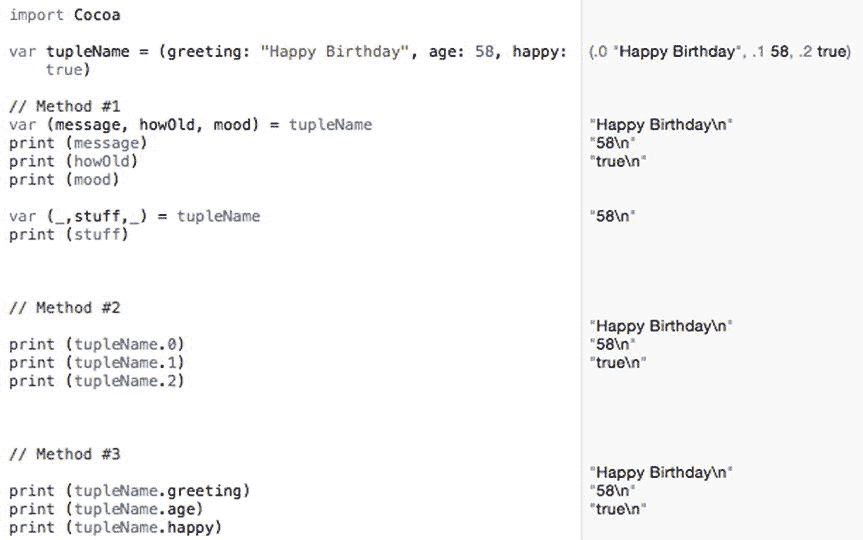
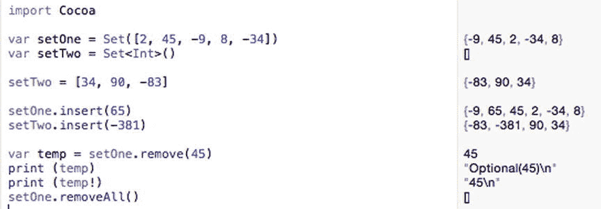
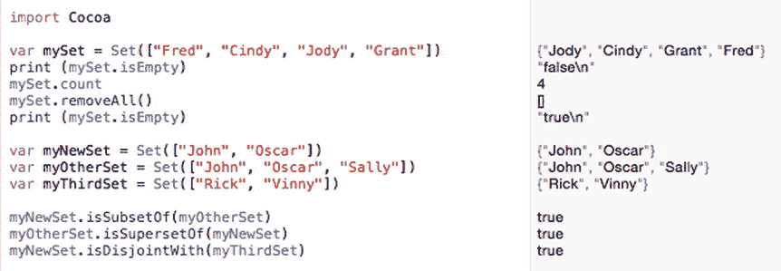
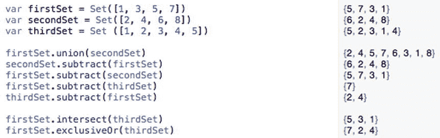
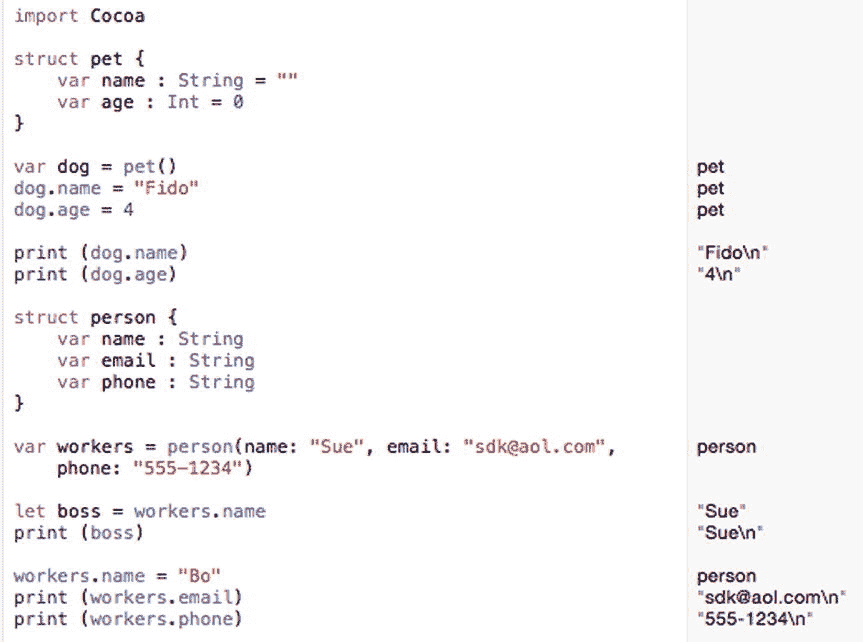
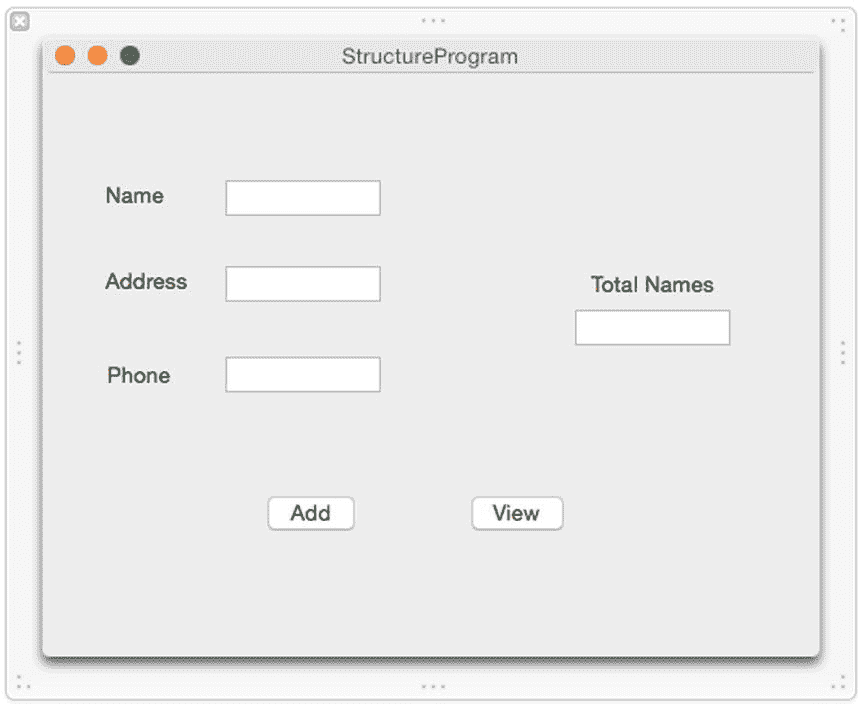
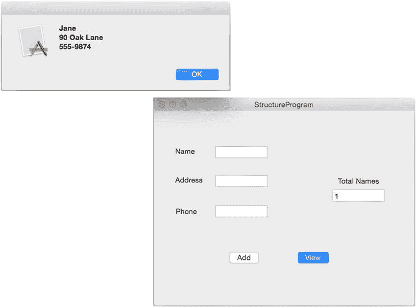

# 10. 元组、集合与结构体

电子补充材料 本章的在线版本 (doi:[10.​1007/​978-1-4842-1233-2_​10](http://dx.doi.org/10.1007/978-1-4842-1233-2_10)) 包含补充材料，仅供授权用户使用。

变量适合存储单个数据块，而数组和字典则适合存储同一数据类型的列表。为了提供更大的灵活性，Swift 还提供了另外两种数据结构，称为**元组**和**集合**。

元组允许你将相关数据（可能包含不同的数据类型，例如表示人名的字符串和表示员工 ID 的整数）存储在一个地方。集合与数组或字典类似，允许你存储两个或更多由相同数据类型（例如字符串或整数）组成的数据块。

为了将相关数据组合在一起，Swift 还提供了结构体。通过结构体，你可以自由定义要组合在一起的数据类型，例如两个字符串和一个浮点值。结构体是将不同数据类型组合在一起的一种方式。

元组和结构体最大的优势或许在于将它们与其他数据结构结合使用时。与其创建一个整数数组，不如创建一个元组数组或结构体数组。这为你提供了灵活性，既可以将不同的数据类型存储在一起，也可以存储相似数据的多个副本。

## 使用元组

假设你想要存储某人的姓名和年龄。你可以创建两个独立的变量，如下所示：

```
var name : String
var age : Int
name = "Janice Parker"
age = 47
```

创建两个或多个独立的变量来存储相关数据可能会很麻烦，因为这两个变量之间没有任何联系来表明它们的关系。为了解决这个问题，Swift 提供了一种独特的数据结构，称为**元组**。

元组可以将两个或多个数据块存储在一个变量中，这些单独的数据块甚至可以完全不同，例如字符串和整数。声明元组就像声明变量一样。主要区别在于，你无需定义单一数据类型，而是可以在括号内定义多种数据类型，如下所示：

`var tupleName : (DataType1, DataType2)`

就像声明变量一样，你必须为元组声明一个唯一的名称。然后，你需要定义要容纳多少个不同的数据块以及它们的数据类型。元组可以容纳两个或更多数据块，但元组容纳的数据越多，理解和检索数据就可能越笨拙。

创建元组的一种方法是声明元组名称及其可以容纳的数据类型。所列出的数据类型数量也定义了该元组可以存储的数据块数量。因此，如果你想在元组中存储一个字符串和一个整数，可以使用以下 Swift 代码：

`var person : (String, Int)`

然后，你可以像这样将数据存储到该元组中：

`person = ("Janice Parker", 47)`

向元组赋值时，请确保数据块既具有正确的数据类型，又有正确的数量。因此，下面的代码会失败，因为 `person` 元组期望先是一个字符串，然后是一个整数，而不是先整数后字符串：

`person = (47, "Janice Parker") // 这将会失败`

定义元组的第二种方法是简单地为其提供数据，并让 Swift 推断数据类型，例如：

`var person = ("Janice Parker", 47)`

如果你通过列出其数据类型来定义元组，或者让 Swift 根据你存储的数据类型来推断数据类型，那么每个数据块代表什么并不总是很清楚。为了更容易识别不同的数据块，Swift 还允许你命名你的数据类型，例如：

`var person : (name: String, age: Int)`

或者，如果你想通过直接将数据赋给元组来让 Swift 推断数据类型：

`var person = (name: "Janice Parker", age: 47)`

命名元组有助于阐明每个数据块代表什么。在这种情况下，字符串代表姓名，整数代表年龄。


### 访问元组中的数据

创建元组并将数据存入其中后，你最终需要检索这些数据。由于元组包含两个或更多数据块，Swift 提供了三种方法来检索你需要的数据。

首先，你可以像下面这样创建多个变量来访问元组数据：

```
var petInfo = ("Rover", 38, true)
var (dog, number, yesValue) = petInfo
print (dog)
print (number)
print (yesValue)
```

在第一行代码中，`petInfo` 是一个包含三个数据块的元组：一个字符串 (`"Rover"`)、一个整数 (`38`) 和一个布尔值 (`true`)。

第二行代码创建了三个变量 (`dog`、`number`、`yesValue`)，并将它们的值赋给 `petInfo` 元组中存储的对应数据。这意味着 `dog` 存储 `"Rover"`，`number` 存储 `38`，`yesValue` 存储 `true`。`print` 命令只是将这些数据打印出来，以验证它已从元组中检索到信息。

要从元组中访问数据，你必须知道元组存储数据的顺序。所以如果你想从 `petInfo` 元组中检索一个字符串，你必须知道 `petInfo` 元组将名称存储为第一个数据块，将数字存储为第二个数据块，将布尔值存储为第三个数据块。

如果你不想检索元组中存储的所有值，你可以只创建一个变量来存储你想要的数据，并使用下划线字符 (`_`) 作为空占位符，来表示元组中你希望忽略的每个额外值。

这意味着你仍然需要知道元组包含的数据块数量，这样才能识别出你想要检索的那个数据块。例如，如果一个元组包含三个元素，你可以像这样检索第一个元素：

```
var petInfo = ("Rover", 38, true)
var (pet,_,_) = petInfo
print (pet)
```

这会将 `"Rover"` 存储在 `pet` 变量中，因此 `print` 命令会打印 `"Rover"`。

如果你只想检索中间的值，可以输入以下代码：

```
var petInfo = ("Rover", 38, true)
var (_,aValue,_) = petInfo
print (aValue)
```

这会将数字 `38` 存储到 `aValue` 变量中，然后 `print` 命令会打印 `38`。

下划线字符充当占位符，用于标识元组中你希望忽略的数据。如果省略下划线字符，Swift 将不知道你想从元组中提取哪一个特定数据。要从元组中检索数据，你必须知道元组存储的项的数量和顺序。

从元组中检索值的第二种方法是使用索引编号，其中第一个元素被分配索引编号 `0`，第二个元素被分配索引编号 `1`，依此类推。例如，你可以像这样将数据存储在一个元组中：

```
var petInfo = ("Rover", 38, true)
print (petInfo.0)
print (petInfo.1)
print (petInfo.2)
```

元组中的第一个项被分配索引编号 `0`，因此元组名称（例如 `petInfo`）后跟索引编号的组合让你可以直接检索特定的元组值。所以 `petInfo.0` 检索 `"Rover"`，`petInfo.1` 检索 `38`，`petInfo.2` 检索 `true`。

访问元组中数据的第三种方法涉及使用名称。要使用这种方法，你必须首先为每个元组数据分配名称。例如，以下 Swift 代码定义了两个名为 `"name"` 和 `"age"` 的名称：

```
var tupleName = (name: "Bridget", age: 31)
```

现在，你可以通过引用元组名称后跟每个数据的标识名称来访问元组数据，如下所示：

```
print (tupleName.name)  // 打印 "Bridget"
print (tupleName.age)   // 打印 31
```

这三种方法为你提供了访问存储在元组中数据的不同方式，因此只需使用你最喜欢的方法即可。为了清晰起见，命名元组的特定元素会使你的代码更易于理解，但代价是强制你命名元组数据。索引编号方法和多变量方法可能更简单，但可能不够清晰，并且需要你知道要检索的数据的确切顺序。

要了解如何使用元组，请按照以下步骤创建一个新的 playground：

启动 Xcode。选择“文件”➤“新建”➤“Playground”。（如果你看到 Xcode 欢迎屏幕，你也可以点击“开始使用 Playground”。）Xcode 会要求输入 playground 名称和平台。在“名称”文本字段中单击并输入 `TuplePlayground`。单击“平台”弹出菜单并选择 OS X。Xcode 会询问你想要将 playground 文件保存在哪里。单击你想要保存 playground 文件的文件夹，然后点击“创建”按钮。Xcode 会显示 playground 文件。按如下方式编辑代码：

```
import Cocoa
var tupleName = (greeting: "Happy Birthday", age: 58, happy: true)
// 方法 #1
var (message, howOld, mood) = tupleName
print (message)
print (howOld)
print (mood)
var (_,stuff,_) = tupleName
print (stuff)
// 方法 #2
print (tupleName.0)
print (tupleName.1)
print (tupleName.2)
// 方法 #3
print (tupleName.greeting)
print (tupleName.age)
print (tupleName.happy)
```

当你尝试从元组中访问值的所有三种方法时，你会看到它们的工作原理是相似的。元组使得将相关数据组合到单个变量中变得容易，这样你就可以轻松地组织相关信息。然后，你可以选择使用三种不同方法之一从元组中检索数据，如图 10-1 所示。



图 10-1. 从元组检索数据的三种不同方式

## 使用集合

数组和字典旨在存储相同数据类型的列表，例如字符串列表或整数列表。数组和字典之间的区别在于你如何检索数据。数组强制你使用索引值按位置检索数据。字典允许你使用键来检索数据，但你必须为你存储的每个数据块定义一个唯一的键。

集合代表了另一种存储相同数据类型列表的方式，例如字符串或浮点数。集合的一个速度优势是判断某物是否被存储。如果你将数据存储在数组中，你必须彻底搜索整个数组来确定数组是否存储了特定项。如果你将数据存储在字典中，你必须知道与该值一起存储的键，或者你必须彻底搜索字典的值列表。

集合让你能够比数组或字典快得多地快速确定以下内容：

- 一个项是否存储在集合中
- 一个集合是否包含与另一个集合完全相同的项
- 一个集合是否是另一个集合的子集（包含与更大集合相同的项）
- 一个集合是否是另一个集合的超集（包含与更小集合相同的项以及更多项）
- 两个集合是否包含相同的项

集合使得比较两组不同的数据变得容易，而数组和字典无法如此轻松地做到这一点。

### 创建集合

要创建一个集合，你可以像这样定义集合的名称以及集合可以保存的数据类型：

```
var setName = Set<DataType>()
```

集合名称最好能描述其内容，例如 `memberSet`。数据类型可以是 `Int`（整数）、`String`（字符串）、`Float` 或 `Double`（小数），甚至是另一个数据结构的名称。

创建集合的第二种方法是在方括号内定义其内容，并让 Swift 推断数据类型。所有数据必须是相同的数据类型，例如：

```
var setName = Set([Data1, Data2, Data2 ... DataN])
```

注意，如果你省略了 `Set` 关键字和周围的括号，你将定义一个数组，而不是集合，如下所示：

```
var thisIsAnArray = [Data1, Data2, Data2 ... DataN]
```


### 向集合中添加和移除元素

使用集合，你可以随时添加新元素，只要新元素与现有元素的数据类型相同。要向集合中添加一个元素，只需指定集合名称、`insert` 命令以及要添加的数据，并用括号括起来，如下所示：

`setName.insert(data)`

你必须指定要添加数据的数组名称，并将实际数据放在括号内。确保添加的数据具有正确的数据类型。因此，如果你想向当前仅包含整数的集合中添加数据，你只能向该集合中添加另一个整数。

如果你尝试添加集合中已存在的数据，则不会发生任何变化。这意味着如果一个集合包含数字 53，你就无法向该集合中添加另一个 53 的副本。

要从集合中移除数据，只需指定集合名称、`remove` 命令以及要移除的数据，并用括号括起来，如下所示：

`setName.remove(data)`

如果你尝试移除集合中不存在的数据，那么 `remove` 命令会返回一个 `nil` 值。但是，如果 `remove` 命令成功地从集合中移除了数据，它会返回一个可选变量。因此，如果你从集合中移除数据并将其存储在一个变量中，如下所示：

`var variableName = setName.remove(data)`

可以通过使用感叹号来访问存储在该变量中的值，如下所示：

`print (variableName!)`

如果你想移除集合中的所有元素，指定集合名称和 `removeAll` 命令，如下所示：

`setName.removeAll()`

要了解如何创建集合以及如何向其中添加和移除数据，请按照以下步骤创建一个新的 Playground：

1. 启动 Xcode。
2. 选择 **文件 ➤ 新建 ➤ Playground**。（如果你看到了 Xcode 的欢迎界面，也可以点击 **开始使用 Playground**。）Xcode 会要求你输入 Playground 名称和平台。
3. 点击 **名称** 文本字段并输入 `SetPlayground`。
4. 点击 **平台** 弹出菜单并选择 **OS X**。Xcode 会询问你希望将 Playground 文件保存在哪里。
5. 点击你想保存 Playground 文件的文件夹，然后点击 **创建** 按钮。Xcode 会显示 Playground 文件。
6. 按如下方式编辑代码：

```swift
import Cocoa
var setOne = Set([2, 45, -9, 8, -34])
var setTwo = Set<Int>()
setTwo = [34, 90, -83]
setOne.insert(65)
setTwo.insert(-381)
var temp = setOne.remove(45)
print (temp)
print (temp!)
setOne.removeAll()
```

这段 Swift 代码通过直接存储数据并让 Swift 推断数据类型（即整数）来创建一个名为 `setOne` 的集合。然后，它创建了第二个名为 `setTwo` 的集合，定义为仅存储整数（`Int`）。

创建 `setTwo` 之后，下一行代码在该集合中存储了三个整数。两个 `insert` 命令分别向 `setOne` 和 `setTwo` 中存储了不同的整数。当代码从 `setOne` 中移除数字 45 时，它将 45 作为一个可选变量存储在 `temp` 变量中。要访问实际值，你必须使用感叹号（`!`）来解包可选变量。

最后，`removeAll` 命令清空了 `setOne`，使其不包含任何内容，如图 10-2 所示。



**图 10-2.** 创建集合、向集合中插入数据以及从集合中移除数据

### 查询集合

一旦你有了一个集合，就可以使用以下命令来获取关于该集合的信息：

*   `count` – 计算集合中元素的数量
*   `isEmpty` – 检查集合是否为空（包含 0 个元素）
*   `isSubsetOf` – 检查一个集合是否完全包含在另一个集合中
*   `isSupersetOf` – 检查一个集合是否包含另一个集合的所有元素
*   `isDisjointWith` – 检查两个集合是否没有任何共同元素

无论这些命令的结果如何，它们都不会影响集合中存储的数据。

`count` 命令返回一个整数值，只需使用集合名称和 `count` 命令，如下所示：

`setName.count`

你也可以将此值赋给一个变量，例如：

`var total = setName.count`

如果集合中包含零个元素，`isEmpty` 命令返回布尔值 `true`。否则返回 `false`。只需在集合名称后加上 `isEmpty` 命令，如下所示：

`setOne.isEmpty`

`isSubsetOf` 命令检查一个集合是否包含也存在于第二个集合中的元素。仅当第二个集合包含第一个集合中的每一个元素时，它才被认为是子集。

`isSupersetOf` 命令检查一个集合是否更大并且包含另一个较小集合的所有相同元素。仅当第一个集合更大并且其所有元素都存储在第二个集合中时，它才被认为是超集。

`isDisjointWith` 命令比较两个集合。如果它们没有共同元素，则此命令返回 `true`。否则返回 `false`。

要了解如何查询集合，请按照以下步骤操作：

1. 确保 `SetPlayground` 文件已在 Xcode 中加载。
2. 按如下方式编辑代码：

```swift
import Cocoa
var mySet = Set(["Fred", "Cindy", "Jody", "Grant"])
print (mySet.isEmpty)
mySet.count
mySet.removeAll()
print (mySet.isEmpty)
var myNewSet = Set(["John", "Oscar"])
var myOtherSet = Set(["John", "Oscar", "Sally"])
var myThirdSet = Set(["Rick", "Vinny"])
myNewSet.isSubsetOf(myOtherSet)
myOtherSet.isSupersetOf(myNewSet)
myNewSet.isDisjointWith(myThirdSet)
```

这段代码创建了一个包含四个字符串的集合。它使用 `isEmpty` 命令检查该集合是否为空（`false`）。然后，它统计了该集合中的元素数量（共 4 个）。最后，它移除了该集合中的所有元素，并再次使用 `isEmpty` 命令检查该集合是否为空（`true`）。

接下来的一组代码创建了三个不同的集合，分别命名为 `myNewSet`、`myOtherSet` 和 `myThirdSet`，其中填充了不同的名字。然后，`isSubsetOf` 命令检查 `myNewSet` [“John”, “Oscar”] 中的所有元素是否也存在于 `myOtherSet` [“John”, “Oscar”, “Sally”] 中，结果为 `true`。

`isSupersetOf` 命令检查 `myOtherSet` [“John”, “Oscar”, “Sally”] 是否包含更多元素，并且是否也包含 `myNewSet` [“John”, “Oscar”] 中存储的所有元素，结果同样为 `true`。

最后，`isDisjointWith` 命令检查 `myNewSet` [“John”, “Oscar”] 与 `myThirdSet` [“Rick”, “Vinny”] 是否没有共同元素，结果也为 `true`，如图 10-3 所示。



**图 10-3.** 查询集合


### 操作集合

当你拥有两个或多个集合时，可以对它们执行操作以创建第三个集合。一些常见的集合操作包括：

- `union` – 将两个集合中的所有项目合并到一个新集合中
- `subtract` – 从第一个集合中移除第二个集合的项目，以形成新集合
- `intersect` – 找出两个集合中共同的项目，并将它们存储在新集合中
- `exclusiveOr` – 找出仅存在于其中一个集合（而非两者）中的项目

可以把 `union` 命令想象成将两个集合相加，而 `subtract` 命令则像从一个集合中减去另一个集合。`union` 命令指定两个集合名称的方式如下：

`firstSet.union(secondSet)`

可以将其视为等价于 `firstSet + secondSet`，即两个集合中的所有项目都会合并到第三个集合中。

`subtract` 命令也会指定两个集合名称，但顺序会产生影响，例如：

`thirdSet.subtract(firstSet)`

`firstSet.subtract(thirdSet)`

根据每个集合的内容，这两个命令可能会产生不同的结果。假设 `thirdSet` 包含 `{1, 2, 3, 4, 5}`，而 `firstSet` 包含 `[1, 3, 5, 7]`。`thirdSet.subtract(firstSet)` 命令的工作方式如下：

`{1, 2, 3, 4, 5} thirdSet`

`[1, 3, 5, 7} firstSet`

两个集合都包含 1、3 和 5，因此这些数字会被消除。从 `thirdSet` 中移除 1、3 和 5，剩下 `{2, 4}`。

`firstSet.subtract(thirdSet)` 命令的工作方式如下：

`[1, 3, 5, 7] firstSet`

`{1, 2, 3, 4, 5} thirdSet`

两个集合都包含 1、3 和 5，因此这些数字会被消除。从 `firstSet` 中移除 1、3 和 5，剩下 `{7}`。

`intersect` 命令找出两个集合中的共同项目。`exclusiveOr` 命令找出不存于两个集合中的项目。可以将 `exclusiveOr` 命令视为 `intersect` 命令的反向操作。

要了解这四种不同的集合操作方式如何工作，请遵循以下步骤：

确保 `SetPlayground` 文件已在 Xcode 中加载。按如下方式编辑代码：

```
import Cocoa
var firstSet = Set([1, 3, 5, 7])
var secondSet = Set([2, 4, 6, 8])
var thirdSet = Set ([1, 2, 3, 4, 5])
firstSet.union(secondSet)
secondSet.subtract(firstSet)
firstSet.subtract(secondSet)
firstSet.subtract(thirdSet)
thirdSet.subtract(firstSet)
firstSet.intersect(thirdSet)
firstSet.exclusiveOr(thirdSet)
```

注意 `subtract` 命令如何因两个集合的列出顺序不同而产生不同结果，如图 10-4 所示。



图 10-4. 操作集合

## 使用结构体

元组和集合都是 Swift 的内置特性。而结构体是一种独特的方式，允许你将不同类型的数据组合在一个地方。使用传统的变量，你一次只能存储一块数据。而使用结构体，你可以定义两块或更多数据，并存储在单个变量中。在结构体内声明的变量被称为属性。

一个存储两块数据的结构体看起来像这样：

```
struct structureName {
    var variableName1 : dataType
    var variableName2 : dataType
}
```

请记住，每个变量的数据类型可以是简单数据类型，如 `Int`、`String` 或 `Double`；也可以是更复杂的数据类型，如数组、元组、集合或字典。

你可以在结构体内定义两个或更多变量，每个变量可以包含不同的数据类型，例如字符串或整数。无论结构体持有多少个属性，都必须先初始化这些属性，然后才能向其中存储数据。

Swift 提供了三种初始化属性的方式。首先，你可以像这样为每个属性定义一个初始值：

```
struct structureName {
    var variableName1 : dataType = initialValue
    var variableName2 : dataType = initialValue
}
```

为了简化属性声明，第二种方式是省略数据类型，让 Swift 推断数据类型，如下所示：

```
struct structureName {
    var variableName1 = initialValue
    var variableName2 = initialValue
}
```

当你为属性分配初始值后，可以像这样创建一个变量来表示该结构体：

`var variableName = structureName()`

初始化结构体属性的第三种方式是创建一个 `init` 函数。这意味着你必须创建一个属性名称及其数据类型的列表。然后在创建表示该结构体的变量时，为这些属性赋值。

例如，假设你想存储关于一个人的信息，比如他或她的姓名、电子邮件地址和电话号码。你可以创建一个单独的结构体，而不是创建三个独立的变量，如下所示：

```
struct person {
    var name : String
    var email : String
    var phone : String
}
```

当你基于这个结构体创建变量时，需要包含初始值，例如：

`var workers = person(name: "Sue", email: "sdk@aol.com", phone: "555-1234")`

创建结构体包含两个部分：

-   创建一个包含两个或更多变量（属性）的结构体
-   创建一个表示该结构体的变量，并为这些属性分配初始值

### 从结构体中存储和检索项目

结构体让你定义要存储的相关数据类型。然后你需要创建一个变量名来表示该结构体。最后，要向结构体中存储数据，你需要用点号分隔指定结构体变量名和属性名，如下所示：

`structureVariable.variableName = value`

要从结构体中检索数据，你可以将变量赋值给结构体的某个变量，如下所示：

`var variableName = structureVariable.variableName`

要了解如何创建结构体、初始化其属性以及添加和检索数据，请按照以下步骤创建一个新的 playground：

启动 Xcode。选择 **File** ➤ **New** ➤ **Playground**。（如果你看到 Xcode 欢迎屏幕，也可以点击 **Get started with a playground**。）Xcode 会询问 playground 名称和平台。在 **Name** 文本字段中点击并输入 `StructurePlayground`。点击 **Platform** 弹出菜单并选择 **OS X**。Xcode 会询问你想将 playground 文件保存到哪里。点击一个文件夹以保存 playground 文件，然后点击 **Create** 按钮。Xcode 会显示 playground 文件。按如下方式编辑代码：

```
import Cocoa
struct pet {
    var name : String = ""
    var age : Int = 0
}
var dog = pet()
dog.name = "Fido"
dog.age = 4
print (dog.name)
print (dog.age)
struct person {
    var name : String
    var email : String
    var phone : String
}
var workers = person(name: "Sue", email: "sdk@aol.com", phone: "555-1234")
let boss = workers.name
print (boss)
workers.name = "Bo"
print (workers.email)
print (workers.phone)
```

第一个结构体为其属性定义了初始值，因此不需要 `init` 函数。这就是为什么你可以用空括号创建一个变量的原因：

`var dog = pet()`

第二个结构体没有为其属性定义初始值，因此当你创建一个变量来表示该结构体时，必须定义初始值。

`var workers = person(name: "Sue", email: "sdk@aol.com", phone: "555-1234")`

要向结构体中存储数据，你需要指定表示该结构体的变量名，后跟属性名，如图 10-5 所示。



图 10-5. 创建结构体并检索数据


## 在 OS X 程序中使用结构体

单独使用结构体只能保存有限的数据。为了更灵活，结构体通常会与数组等其他数据结构结合使用。这样你就可以创建一个结构体数组，本示例程序中将用到这一功能。该程序允许你输入多个姓名、地址和电话号码，并且也可以删除数据。

在 Xcode 中，选择 **文件** ➤ **新建** ➤ **项目**。在 **OS X** 类别下点击 **应用**。点击 **Cocoa 应用**，然后点击 **下一步** 按钮。Xcode 会要求你输入产品名称。在 **产品名称** 文本框中点击并输入 `StructureProgram`。确保 **语言** 弹出菜单显示为 `Swift`，并且没有勾选任何复选框。点击 **下一步** 按钮。Xcode 会询问你希望将项目存储在哪里。选择一个文件夹来存放你的项目，然后点击 **创建** 按钮。在 **项目导航器** 中点击 `MainMenu.xib` 文件。点击 `StructureProgram` 图标，使用户界面窗口显示出来。选择 **视图** ➤ **工具** ➤ **显示对象库**，让 **对象库** 显示在 Xcode 窗口的右下角。将两个 **按钮**、四个 **标签** 和四个 **文本字段** 拖拽到用户界面上，并双击按钮和标签，修改它们上面显示的文本，使其看起来与图 10-6 类似。



**图 10-6.** `StructureProgram` 的用户界面

在相应的文本字段中输入姓名、地址和电话号码后，**添加** 按钮会将这些信息存储到一个结构体中，然后再将该结构体存储到一个数组中。每次添加新的姓名、地址和电话号码时，你都会向数组中添加一个新的结构体，同时 **总姓名数** 文本字段会持续显示数组中存储的结构体总数。

**查看** 按钮会移除数组中的最后一个项目，并在一个警告对话框中显示其内容，以便你可以验证内容。然后它会显示数组中结构体的新总数。

每个文本字段都需要一个单独的 `IBOutlet`，每个按钮都需要一个单独的 `IBAction` 方法，你需要通过按住 Control 键将每个项目从用户界面拖拽到你的 `AppDelegate.swift` 文件中来创建它们：

在 Xcode 窗口中用户界面仍然可见的情况下，选择 **视图** ➤ **辅助编辑器** ➤ **显示辅助编辑器**。`AppDelegate.swift` 文件会出现在用户界面的旁边。将鼠标移动到 **添加** 按钮上，按住 **Control** 键，拖拽到 `AppDelegate.swift` 文件底部最后一个大括号的上方。松开鼠标和 **Control** 键。会弹出一个窗口。在 **连接** 弹出菜单中点击，选择 **动作**。在 **名称** 文本框中点击并输入 `addData`。在 **类型** 弹出菜单中点击，选择 `NSButton`。然后点击 **连接** 按钮。将鼠标移动到 **查看** 按钮上，按住 **Control** 键，拖拽到 `AppDelegate.swift` 文件底部最后一个大括号的上方。松开鼠标和 **Control** 键。会弹出一个窗口。在 **连接** 弹出菜单中点击，选择 **动作**。在 **名称** 文本框中点击并输入 `viewButton`。在 **类型** 弹出菜单中点击，选择 `NSButton`。然后点击 **连接** 按钮。`AppDelegate.swift` 文件的底部应该类似这样：
```
@IBAction func viewData(sender: NSButton) {
}
@IBAction func addData(sender: NSButton) {
}
```
将鼠标移动到出现在 **添加** 按钮右侧的 **姓名** 文本字段上，按住 **Control** 键，拖拽到 `AppDelegate.swift` 文件中 `@IBOutlet` 行的下方。松开鼠标和 **Control** 键。会弹出一个窗口。在 **名称** 文本框中点击并输入 `nameField`，然后点击 **连接** 按钮。将鼠标移动到出现在 **添加** 按钮右侧的 **地址** 文本字段上，按住 **Control** 键，拖拽到 `AppDelegate.swift` 文件中 `@IBOutlet` 行的下方。松开鼠标和 **Control** 键。会弹出一个窗口。在 **名称** 文本框中点击并输入 `addressField`，然后点击 **连接** 按钮。将鼠标移动到出现在 **删除** 按钮右侧的 **电话** 文本字段上，按住 **Control** 键，拖拽到 `AppDelegate.swift` 文件中 `@IBOutlet` 行的下方。松开鼠标和 **Control** 键。会弹出一个窗口。在 **名称** 文本框中点击并输入 `phoneField`，然后点击 **连接** 按钮。将鼠标移动到出现在 **查询** 按钮右侧的 **总姓名数** 文本字段上，按住 **Control** 键，拖拽到 `AppDelegate.swift` 文件中 `@IBOutlet` 行的下方。松开鼠标和 **Control** 键。会弹出一个窗口。在 **名称** 文本框中点击并输入 `totalField`，然后点击 **连接** 按钮。现在你应该有了以下代表用户界面上所有文本字段的 `IBOutlet`：
```
@IBOutlet weak var window: NSWindow!
@IBOutlet weak var nameField: NSTextField!
@IBOutlet weak var addressField: NSTextField!
@IBOutlet weak var phoneField: NSTextField!
@IBOutlet weak var totalField: NSTextField!
```
至此，我们已经将用户界面连接到了我们的 Swift 代码，这样我们就可以使用 `IBOutlet` 来检索和显示用户界面上的数据。我们还创建了 `IBAction` 方法，以便用户界面上的按钮能让程序真正运行起来。现在我们只需要编写 Swift 代码来创建一个初始字典，然后在每个 `IBAction` 方法中编写更多的 Swift 代码来添加、删除或查询该字典。


### Swift 中的结构体、数组与字典操作

在 `AppDelegate.swift` 文件的 `IBOutlet` 列表下方，输入以下代码来创建一个可以存储三个字符串（姓名、地址和电话号码）的结构体、一个表示该结构体的变量以及一个结构体数组：

```swift
struct person {
    var name = ""
    var address = ""
    var phone = ""
}
var employee = person()
var arrayOfStructures = [person]()
```

修改 `addData` IBAction 方法，使其从姓名、地址和电话文本字段中获取值，并将它们存储到 `employee` 结构体中。然后将该结构体存储到数组中，在“总人数”文本字段中显示数组中的项目总数，并清空姓名、地址和电话文本字段：

```swift
@IBAction func addData(sender: NSButton) {
    employee.name = nameField.stringValue
    employee.address = addressField.stringValue
    employee.phone = phoneField.stringValue
    arrayOfStructures.append(employee)
    totalField.integerValue = arrayOfStructures.count
    nameField.stringValue = ""
    addressField.stringValue = ""
    phoneField.stringValue = ""
}
```

修改 `viewData` IBAction 方法，使其从键文本字段中获取值，并从字典中删除关联的值，如下所示：

```swift
@IBAction func viewData(sender: NSButton) {
    var myAlert = NSAlert()
    if arrayOfStructures.isEmpty {
        myAlert.messageText = "Array is empty"
        myAlert.runModal()
    } else {
        var personData = person()
        personData = (arrayOfStructures.removeLast())
        totalField.integerValue = arrayOfStructures.count
        myAlert.messageText = personData.name + "\r\n" + personData.address + "\r\n" + personData.phone
        myAlert.runModal()
    }
}
```

`viewData` IBAction 方法中的代码创建了一个警报对话框。然后检查数组是否为空。如果为空，则在警报对话框中显示“Array is empty”。

如果数组不为空，则移除数组中最后一个结构体，在“总人数”文本字段中显示新的数组项目总数，并在警报对话框中显示被移除的结构体数据。

`AppDelegate.swift` 文件的完整内容应如下所示：

```swift
import Cocoa

@NSApplicationMain
class AppDelegate: NSObject, NSApplicationDelegate {

    @IBOutlet weak var window: NSWindow!
    @IBOutlet weak var nameField: NSTextField!
    @IBOutlet weak var addressField: NSTextField!
    @IBOutlet weak var phoneField: NSTextField!
    @IBOutlet weak var totalField: NSTextField!

    struct person {
        var name = ""
        var address = ""
        var phone = ""
    }

    var employee = person()
    var arrayOfStructures = [person]()

    func applicationDidFinishLaunching(aNotification: NSNotification) {
        // Insert code here to initialize your application
    }

    func applicationWillTerminate(aNotification: NSNotification) {
        // Insert code here to tear down your application
    }

    @IBAction func viewData(sender: NSButton) {
        var myAlert = NSAlert()
        if arrayOfStructures.isEmpty {
            myAlert.messageText = "Array is empty"
            myAlert.runModal()
        } else {
            var personData = person()
            personData = (arrayOfStructures.removeLast())
            totalField.integerValue = arrayOfStructures.count
            myAlert.messageText = personData.name + "\r\n" + personData.address + "\r\n" + personData.phone
            myAlert.runModal()
        }
    }

    @IBAction func addData(sender: NSButton) {
        employee.name = nameField.stringValue
        employee.address = addressField.stringValue
        employee.phone = phoneField.stringValue
        arrayOfStructures.append(employee)
        totalField.integerValue = arrayOfStructures.count
        nameField.stringValue = ""
        addressField.stringValue = ""
        phoneField.stringValue = ""
    }
}
```

要了解此程序的工作原理，请按照以下步骤操作：

1. 选择 **Product** ➤ **Run**。Xcode 运行您的 `DictionaryProgram` 项目。
2. 点击“姓名”文本字段并输入 `Bob`。
3. 点击“地址”文本字段并输入 `123 Main`。
4. 点击“电话”文本字段并输入 `555-1234`。
5. 点击“添加”按钮。程序在“总人数”文本字段中显示数组中的项目数 (1)。
6. 重复步骤 2-5，但输入姓名 `Jane`、地址 `90 Oak Lane` 和电话号码 `555-9874`。 “总人数”文本字段中显示数字 2。
7. 点击“查看”按钮。出现一个警报对话框，显示 `Jane`、`90 Oak Lane` 和 `555-9874`，如图 10-7 所示。



**图 10-7.** 显示添加到数组中的最后一个结构体的警报对话框

8. 点击“确定”关闭警报对话框。
9. 选择 **StructureProgram** ➤ **Quit StructureProgram**。

## 总结

元组是一种在单个变量中存储不同数据类型的方式。与数组和字典类似，集合可以存储相同数据类型的列表。数组最适合存储有序信息，字典最适合快速检索数据，而集合最适合检查项目是否属于集合，以及便于操作两个或多个集合。

如果需要存储大量相关数据，可以使用元组，但元组在处理大量数据时会变得笨拙。另一种选择是创建结构体，它允许您定义要存储的不同数据类型。除了基本数据类型（`Int`、`String`、`Float` 和 `Double`）之外，结构体还可以包含其他数据结构，例如数组、字典或集合。为了获得更大的灵活性，您甚至可以将结构体放入数组、字典或集合中。

在您创建的示例 OS X 程序中，您学习了如何创建结构体并将其数据存储在数组中。到现在为止，您应该已经熟悉了如何使用 `IBOutlet` 从用户界面显示或检索数据，以及如何创建 `IBAction` 方法使程序实际运行。

通过元组、集合、结构体以及数组和字典，您可以以多种方式组合数据结构，从而以最灵活的方式存储数据，满足特定需求。


