# 11. 创建类与对象

电子补充材料：本章在线版本 (doi:[10.1007/978-1-4842-1233-2_11](http://dx.doi.org/10.1007/978-1-4842-1233-2_11)) 包含补充材料，仅供授权用户使用。

使用 Xcode 进行 Swift 编程的核心是面向对象编程。其主要思想是将一个大型程序划分为独立的对象，每个对象理想情况下代表一个物理实体。例如，如果你正在创建一个控制汽车的程序，一个对象可以代表汽车的发动机，第二个对象可以代表汽车的娱乐系统，第三个对象则可以代表汽车的加热与冷却系统。

现在，如果你想要更新程序中控制汽车发动机的部分，你只需修改或替换控制该发动机的对象即可。对象不仅帮助你更好地理解程序不同部分如何协同工作，还能隔离代码，从而让你能够构建模块，组合成更大、更复杂的程序。

对象帮助你以相互独立的独立构建块的方式来看待程序。在面向对象编程出现之前，程序员将程序划分为子程序，这些子程序也类似于微型构建块。子程序和对象的主要区别在于，子程序可以访问由其他子程序使用的数据。这意味着，如果你修改了一个子程序，常常会无意中影响到程序的其他部分。这使得修复错误（Bug）变得困难，同样也使修改程序变得困难。

而对于对象，其主要思想是创建独立、互不影响的构建块，它们协同工作，同时不干扰彼此的数据。为了保持数据的隔离，对象使用了**封装**。这意味着对象拥有自己的变量（称为**属性**）和函数（称为**方法**）。

对象之间可以通过两种方式通信：

*   在另一个对象的属性中存储新值
*   调用另一个对象的方法

理想情况下，一个程序应由多个完全独立执行任务的对象组成。这使得通过用改进版的对象替换旧对象来修改程序变得简单。

## 创建类

创建对象分为两步。首先，你必须创建一个类。其次，你基于该类创建一个对象。

类的外观和工作方式与结构体非常相似（参见第 10 章），你需要为其定义一个名称。一旦你定义了一个类，就可以基于该类创建一个或多个对象。可以将类想象成一个决定饼干形状的模具，而对象则是你可以基于该类定义的不同类型的面团。

你可以定义的最简单的类如下所示：

```
class className {

}
```

要从这个类创建一个对象，你只需声明一个变量，但不要定义像 `Int` 或 `String` 这样的数据类型，而是定义类名，例如：

```
var myObject = className()
```

当然，一个不包含任何代码的类是无用的，因此你可以在类中包含的两种代码是：变量（称为属性）和用于操作数据的函数（称为方法）。在类中创建属性涉及创建一个或多个变量，并定义数据类型和初始值，例如：

```
class className {
    var name : String = ""
    var ID : Int = 0
    var salary : Double = 0
}
```

初始值非常重要，因为当你基于一个类创建对象时，你不希望存在未初始化的值，这些值在你试图使用时可能会导致问题。

要定义一个属性，你需要声明一个变量名、一个数据类型和一个初始值。由于 Swift 可以推断数据类型，你可以省略数据类型声明，仅像这样赋予初始值：

```
class className {
    var name = ""
    var ID  = 0
    var salary = 0.0
}
```

无论你是否使用数据类型定义类属性，你都可以通过创建一个变量名，将其设置为类名，并在其后加上一对空圆括号来从此类创建对象，如下所示：

```
var myObject = className()
```

以上两种方法都会为类的属性创建相同的初始值。为了获得更大的灵活性，你可以创建一个名为 `init` 的初始化方法。这允许你每次从类创建对象时定义初始值。类中的初始化器可能如下所示：

```
class secondClass {
    var name : String
    var ID : Int
    var salary : Double
    init (name: String, ID: Int, salary: Double) {
        self.name = name
        self.ID = ID
        self.salary = salary
    }
}
```

这个初始化方法 (`init`) 定义了一个参数列表，接受三个项目：一个字符串、一个整数和一个双精度浮点数值。然后它将这些信息分别存储在 `name`、`ID` 和 `salary` 属性中。当一个类具有初始化器时，你必须通过包含与初始化器参数列表匹配的正确数量和数据类型来创建该类的对象。

这意味着创建一个对象时需要在圆括号中包含一个字符串、一个整数和一个双精度浮点数值，如下所示：

```
var secondObject = secondClass (name: "Joe", ID: 102, salary: 120000)
```

请注意，当你在参数列表中包含数据时，必须使用初始化器参数列表中定义的变量名来标记每个数据块。在本例中，三个参数名是 `name`、`ID` 和 `salary`，因此创建对象意味着使用这些相同的参数名来标识数据。


### 访问对象中的属性

要访问对象的属性，您必须指定对象名称，后跟句点和属性名称，例如：

`objectName.propertyName = data`

您也可以将对象的属性值赋值给变量，如下所示：

`var person = myObject.name`

要访问属性，您需要指定对象名称、句点以及要访问的属性名称，例如：

`print (person.name)`

**注意**  
访问存储在属性中的值时，请确保指定的是对象名称，而不是类名称。如果您是从“className”类创建了一个“person”对象，那么您应该通过指定对象名称（`person`）和属性名称（`name`、`ID`、`salary`）来访问属性，例如 `person.name` 或 `person.ID`。您不应使用类名称来访问属性值，例如 `className.name` 或 `className.ID`。如果尝试这样做，您的代码将无法运行。

就像普通变量一样，对象的属性一次只能保存一块数据。当你将新数据存入属性时，它会覆盖之前的数据。

要了解如何创建类以及操作对象的属性，请按照以下步骤创建一个新的 playground：

1. 启动 Xcode。
2. 选择 **文件 ➤ 新建 ➤ Playground**。（如果您看到 Xcode 欢迎屏幕，也可以点击“开始使用 playground”。）Xcode 会要求您输入 playground 名称并选择平台。
3. 在“名称”文本框中点击并输入 `ClassPlayground`。
4. 在“平台”弹出菜单中点击并选择 **OS X**。Xcode 会询问您希望将 playground 文件保存在哪里。
5. 点击您要保存 playground 文件的文件夹，然后点击 **创建** 按钮。Xcode 会显示该 playground 文件。
6. 按如下方式编辑代码：

```
import Cocoa

class className {
    var name = ""
    var ID  = 0
    var salary = 0
}

var worker = className()
worker.name = "Bob"
worker.ID = 102
worker.salary = 10

var executive = className()
executive.name = "Robert"
executive.ID = 1
executive.salary = worker.salary * 100

class secondClass {
    var name : String
    var ID : Int
    var salary : Double
    init (name: String, ID: Int, salary: Double) {
        self.name = name
        self.ID = ID
        self.salary = salary
    }
}

var consultant = secondClass (name: "Joe", ID: 17, salary: 50000)
```

第一个类在声明属性时对其进行了初始化。然后，它基于该类（`className`）创建了一个对象（`worker`）。为了将数据存入 `worker` 对象，代码指定了对象名称（`worker`）和属性名称，并为其赋值。

第二个类示例使用初始化器来定义属性值。`init` 方法按顺序接受三块数据：一个字符串、一个整数和一个十进制（`Double`）值。

要从这第二个类（`secondClass`）创建一个对象（`consultant`），括号内需要包含正确顺序、正确数量的数据，以及正确的数据类型，此外还需要显示一个标签来标识数据的含义，如图 11-1 所示。

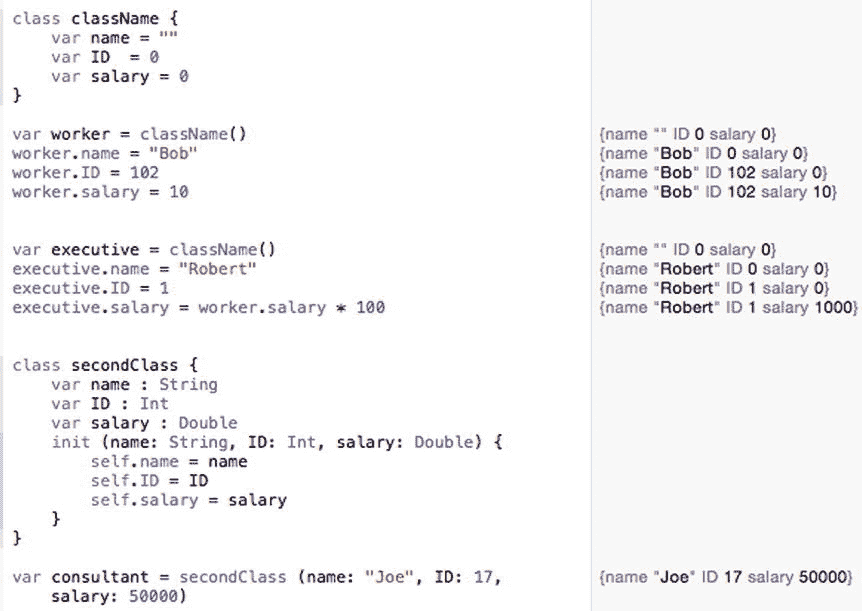

*图 11-1. 创建类文件并访问属性*

### 对象中的计算属性

除了为属性定义固定值之外，您还可以使用计算属性，其中一个属性的初始值取决于另一个属性的值。创建计算属性的最简单方法是定义一个属性名称、数据类型，然后在花括号中编写计算值的代码。最后，使用 `return` 关键字定义要存储在属性中的值，如下所示：

```
class shape {
    var height : Int = 5
    var width : Int {
      return height * 2
    }
}

var rectangle = shape()
print (rectangle.height)
print (rectangle.width)
```

这个计算属性只是获取存储在 `height` 属性中的值，将其乘以 2，然后将结果存储在 `width` 属性中。当您基于 `shape` 类创建对象时，初始值 5 会被存储在 `height` 属性中，然后计算属性将 `height` 值（5）乘以 2 得到 10，并将其存储在 `width` 属性中，如图 11-2 所示。

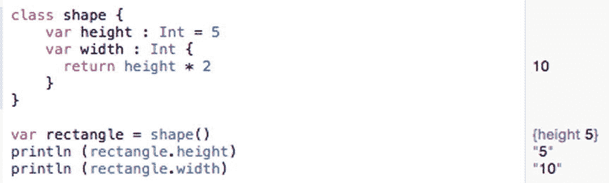

*图 11-2. 使用计算属性来确定属性的初始值*

在这个计算属性的例子中，一个属性（`width`）的值依赖于另一个属性（`height`）的值来确定其自身的值。用技术术语来说，这被称为 getter（获取方法）。


### 设置其他属性

另一种方法是使用所谓的 setter（设置器）。使用 setter 时，定义一个属性会设置另一个属性的值。由于 getter（获取器）和 setter 非常相似，它们通常会在同一个属性中使用。这样，一个属性使用 getter 从另一个属性计算其值，然后如果你用某个值设置该属性，它就可以改变另一个属性。定义 getter 和 setter 的方式如下：

```
class blob {
    var property1 : dataType = value
    var property2 : dataType {
        get {
            return valueHere
        }
        set {
            property1 = valueHere
        }
    }
}
```

在 getter 中，你始终需要一个 `return` 关键字来向拥有该 getter 的属性返回一个值。在 setter 中，你必须将一个属性赋值给一个值。这个值可以是一个固定值，也可以是一个返回值计算表达式。

**注意：** 你不需要同时拥有 getter 和 setter。你可以只拥有一个 getter，通过省略 `get` 关键字，只将代码用花括号括起来即可缩短，就像本节开头的 shape 类示例那样。你也可以只拥有一个 setter，但你需要使用 `set` 关键字。

在上面的例子中，每当 `property2` 被赋一个新值时，它都会使用其 setter 为 `property1` 定义一个新值。

setter 还可以接收一个值，并使用该值为另一个属性计算出新的结果。要接收一个值给 setter，你只需要创建一个放在圆括号中的变量，然后使用该值为另一个属性计算结果。如果你没有创建放在圆括号中的变量，那么可以直接使用默认参数名 `newValue`。下面的例子展示了如何使用 setter：

```
class blob {
    var property1 : dataType = value
    var property2 : dataType {
        get {
            return valueHere
        }
        set (newValue) {
            property1 = valueHere based on newValue
        }
    }
}
```

要了解 getter 和 setter 是如何工作的，请按照以下步骤操作：

确保你的 `ClassPlayground` 文件已加载到 Xcode 中。按如下方式编辑代码：

```
import Cocoa

class shape {
    var height : Int = 5
    var width : Int {
        return height * 2
    }
}

var rectangle = shape()
print (rectangle.height)
print (rectangle.width)

rectangle.height = 20
print (rectangle.width)

class blob {
    var height : Int = 5
    var width : Int = 10
    var area : Int {
        get {
            return height * width
        }
        set {
            height = 24
            width = 45
        }
    }
}

var cat = blob()
cat.area
cat.area = 129

class anotherBlob {
    var height : Int = 5
    var width : Int = 10
    var area : Int {
        get {
            return height * width
        }
        set (newValue) {
            height = newValue + 10
            width = newValue - 5
        }
    }
}

var CEO = anotherBlob()
print (CEO.area)
CEO.area = 247
print (CEO.height)
print (CEO.width)
```

你可以把 getter 和 setter 看作是会改变其他属性的函数。不过，在使用 getter 和 setter 时要小心，因为如果你不了解它们的存在或工作原理，它们可能会导致意外的行为。图 11-3 显示了上述代码的结果，以便你了解 getter 和 setter 如何影响属性。

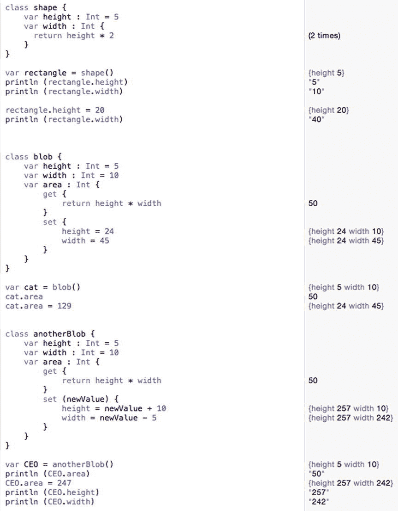

**图 11-3.** 使用 getter 和 setter 修改属性

### 使用属性观察器

Swift 提供了两个属性观察器，分别称为 `willSet` 和 `didSet`。`willSet` 属性观察器在属性接收值之前运行代码。`didSet` 属性观察器在属性接收值之后运行代码。

与 getter 和 setter 类似，属性观察器本质上也是在属性获得新值时运行的函数。`willSet` 和 `didSet` 属性观察器的基本结构与 getter 和 setter 的结构相同，如下所示：

```
var property : dataType = initialValue {
    willSet {
    }
    didSet {
    }
}
```

`willSet` 属性观察器在属性获得新值之前运行代码。`didSet` 属性观察器在属性获得新值之后运行代码。要了解属性观察器是如何工作的，请按照以下步骤操作：

确保你的 `ClassPlayground` 文件已加载到 Xcode 中。按如下方式编辑代码：

```
import Cocoa

class animal {
    var IQ : Int = 0
    var legs : Int = 0 {
        willSet {
            IQ += 10
        }
        didSet {
            IQ -= 5
        }
    }
}

var pet = animal()
print (pet.IQ)
pet.legs = 4
print (pet.IQ)
```

在这个例子中，`IQ` 属性的初始值为 0。请注意，当你将 `legs` 属性设置为 4 时，它会立即运行 `willSet` 属性观察器的代码，这将使 `IQ` 属性增加 10。然后，它会立即运行 `didSet` 属性观察器中的代码，该代码会减去 3，如图 11-4 所示。

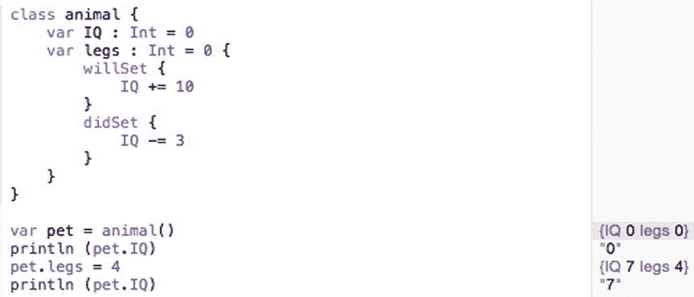

**图 11-4.** 使用属性观察器


好的，作为一名高级文档工程师和翻译员，我将根据您提供的注意事项和示例，对给定的英文文本进行精确翻译。


## 创建方法

一个仅存储一个或多个属性的类，对于将相关数据分组在一起来说很方便。然而，面向对象编程更有用的地方在于，对象也可以操作它们自己的数据。要创建供对象运行的迷你程序，您需要在类内部定义函数（称为方法）。

当您将用户界面中的按钮链接起来，从而在 Swift 代码文件中创建一个 `IBAction` 方法时，您就已经见识过方法了。类内部最简单的方法执行的功能完全一样，如下所示：

```
class countDown {

    var counter = 10

    func decrement() {
        counter--
    }

}
```

这个 `decrement()` 方法简单地从 `counter` 属性（初始值为 10）中减去 1。要让这个方法运行，您必须指定对象名、句点和方法名，如下所示：

```
var counter = countDown()
counter.decrement()
```

这个 `decrement()` 方法每次都执行完全相同的操作，即从 `counter` 属性中减去 1。一个更有趣、更灵活的方法可以接受数据（一个或多个参数）来修改方法内部的代码执行逻辑，例如：

```
class countDown {

    var counter = 10

    func decrement() {
        counter--
    }

    func decrementByValue(step: Int) {
        counter -= step
    }

}
```

第二个方法，`decrementByValue(step:)`，接受一个整数，该整数被存储在一个名为 `step` 的变量中。然后它从 `counter` 属性中减去 `step` 的值，如图 11-5 所示。

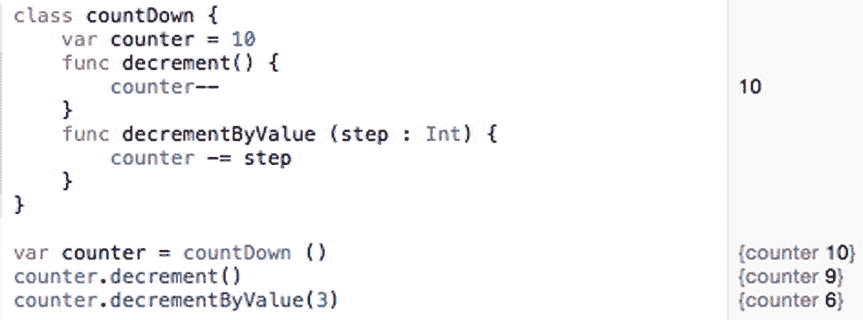

图 11-5. 运行一个接受值的方法

当一个方法接受数据时，它也可以返回一个特定的值。要创建这样的方法，您需要标识方法返回的数据类型（使用 `->` 符号）以及定义要返回的具体值的 `return` 关键字。

所以，如果您想创建一个返回 `Float` 数据类型的方法，您可以定义如下方法：

```
class mathBrain {

    var tempValue: Float = 0

    func average(first: Float, second: Float) -> Float {
        return (first + second) / 2
    }

}
```

这个方法接受两个 `Float` 数字（存储在名为 `first` 和 `second` 的变量中）并返回一个 `Float` 值。要调用这个方法，您需要指定一个对象名、句点、方法名以及两个 `Float` 数据类型的数字。

请注意，这个方法有两个参数，名为 `first` 和 `second`。当传递第一个参数时，您无需指定参数名（`first`），因为它前面没有 `#` 符号。但是，在传递任何其他参数时，您必须指定参数名，例如：

```
var math = mathBrain()
var temp: Float = math.average(4.0, second: 9.0)
print(temp)
```

要了解如何创建一个集合以及如何向其中添加和移除数据，请按照以下步骤创建一个新的 playground：

1.  启动 Xcode。
2.  选择 文件 ➤ 新建 ➤ Playground。（如果您看到 Xcode 欢迎屏幕，也可以点击“开始使用 playground”。）Xcode 会要求您输入 playground 名称和平台。
3.  点击名称文本字段，然后输入 `MethodPlayground`。
4.  点击平台弹出菜单，选择 OS X。Xcode 会询问您想要保存 playground 文件的位置。
5.  点击一个您想要保存 playground 文件的文件夹，然后点击“创建”按钮。Xcode 会显示 playground 文件。
6.  按如下方式编辑代码：

```
import Cocoa

class mathBrain {

    var tempValue: Float = 0

    func average(first: Float, second: Float) -> Float {
        return (first + second) / 2
    }

}

var math = mathBrain()
var temp: Float = math.average(4.0, second: 9.0)
print(temp)
```

`average()` 方法接受两个参数，将它们相加，然后除以 2。接着，它使用 `return` 关键字返回这个值。

当 `average()` 方法处理数字 4.0 和 9.0 时，它返回一个值为 6.5，该值被存储在一个名为 `temp` 的变量中，如图 11-6 所示。

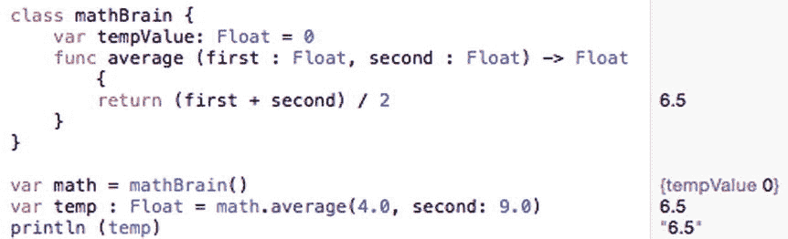

图 11-6. 创建集合、向集合中插入数据以及从集合中移除数据

## 在 OS X 程序中使用对象

对象可以包含任意数量的属性，这些属性可以保存简单的数据类型（如整数或字符串），也可以保存更复杂的数据类型（如元组、集合或数组）。一个对象还可以包含一个或多个方法，这些方法通常用于操作对象的属性。

在这个示例程序中，您将定义一个类，并基于该类创建两个对象。您还将了解如何将一个类存储在一个单独的文件中。与其把所有东西都塞进一个文件，不如将代码存储在单独的文件中，这样更容易管理。

这两个对象将运行存储在另一个对象中的方法。用户界面还将从两个对象的属性中检索值，并显示在用户界面的文本字段中。

为了更多地了解用户界面，您还将看到如何将两个按钮连接到一个 `IBAction` 方法，并确定用户点击了哪个按钮。像往常一样，您将看到如何通过 `IBOutlet` 在用户界面元素中显示数据。要创建这个示例程序，请遵循以下步骤：

1.  在 Xcode 中选择 文件 ➤ 新建 ➤ 项目。
2.  在 OS X 类别下，点击“应用程序”。
3.  点击“Cocoa 应用程序”，然后点击“下一步”按钮。Xcode 现在会要求您输入产品名称。
4.  点击产品名称文本字段，然后输入 `ObjectProgram`。
5.  确保语言弹出菜单显示为 Swift，并且没有勾选任何复选框。
6.  点击“下一步”按钮。Xcode 会询问您想要存储项目的位置。
7.  选择一个文件夹来存储您的项目，然后点击“创建”按钮。
8.  在项目导航器中点击 `MainMenu.xib` 文件。
9.  点击 `ObjectProgram` 图标以显示用户界面窗口。
10.  选择 视图 ➤ 工具 ➤ 显示对象库，使对象库出现在 Xcode 窗口的右下角。
11.  将两个“下压按钮”、两个“标签”和两个“文本字段”拖放到用户界面上，然后双击下压按钮和标签，以更改其上显示的文本，使其看起来类似于图 11-7。

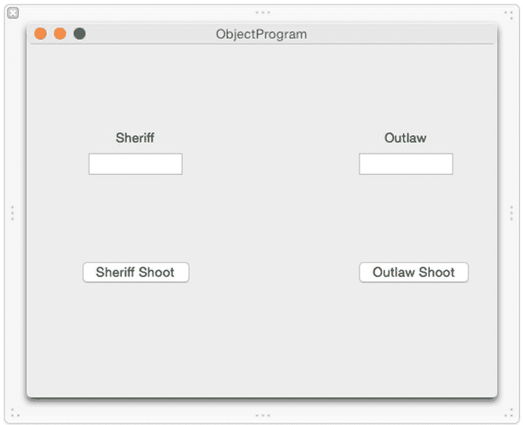

图 11-7. ObjectProgram 的用户界面

这个用户界面将显示两个角色的生命值点数：一个警长和一个亡命徒。每次您点击“警长射击”或“亡命徒射击”按钮时，一个 `IBAction` 方法将随机判定另一个角色是否被击中。如果是，它还会判定该枪造成的伤害，范围为 1 到 3。任何变化都会显示在“警长”或“亡命徒”标签下方的文本字段中。

“警长射击”和“亡命徒射击”按钮会运行一个 `IBAction` 方法，该方法首先确定用户点击的是哪个按钮：“警长射击”按钮还是“亡命徒射击”按钮。要识别用户点击了哪个按钮，您需要修改每个按钮上的“标记”属性，这样“警长射击”按钮的标记值将为 0，而“亡命徒射击”按钮的标记值将为 1。

在确定是警长还是亡命徒在射击之后，`IBAction` 方法会运行 `shoot()` 方法，该方法随机判定是否击中以及造成的伤害，这些伤害会从每个对象的 `hitPoints` 属性中减去。

总的生命值点数会显示在“警长”和“亡命徒”标签下方的文本字段中。一旦警长或亡命徒的总生命值点数降至 0 或更低，一个警告对话框就会出现，告知您警长或亡命徒是否死亡。要将您的用户界面连接到 Swift 代码，请遵循以下步骤。


释放鼠标和 Control 键，将“Outlaw Shoot”按钮连接到现有的 `IBAction shootButton` 方法。将鼠标移动到“Sheriff”文本字段上，按住 Control 键，然后拖动到 `AppDelegate.swift` 文件中 `@IBOutlet` 行的下方。释放鼠标和 Control 键，弹出窗口出现。在“Name”文本字段中单击并输入 `sheriffHitPoints`，然后单击“Connect”按钮。

将鼠标移动到“Add”按钮右侧出现的“Outlaw”文本字段上，按住 Control 键，然后拖动到 `AppDelegate.swift` 文件中 `@IBOutlet` 行的下方。释放鼠标和 Control 键，弹出窗口出现。在“Name”文本字段中单击并输入 `outlawHitPoints`，然后单击“Connect”按钮。现在您应该拥有代表用户界面上所有文本字段的以下 `IBOutlet`：

保持用户界面在 Xcode 窗口中可见，选择 `View ➤ Assistant Editor ➤ Show Assistant Editor`。`AppDelegate.swift` 文件出现在用户界面旁边。

将鼠标移动到“Sheriff Shoot”按钮上，按住 Control 键，然后拖动到 `AppDelegate.swift` 文件底部最后一个花括号的上方。释放鼠标和 Control 键，弹出窗口出现。在“Connection”弹出菜单中单击并选择 `Action`。在“Name”文本字段中单击并输入 `shootButton`。在“Type”弹出菜单中单击并选择 `NSButton`。然后单击“Connect”按钮。

将鼠标移动到“Outlaw Shoot”按钮上，按住 Control 键，然后拖动到您刚刚创建的现有 `IBAction shootButton` 方法上，直到整个方法高亮显示，如图 11-8 所示。

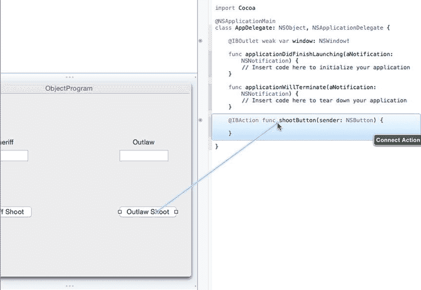

图 11-8. 将 Outlaw Shoot 按钮连接到现有的 IBAction 方法

```
@IBOutlet weak var window: NSWindow!

@IBOutlet weak var sheriffHitPoints: NSTextField!

@IBOutlet weak var outlawHitPoints: NSTextField!
```

至此，我们已经将用户界面连接到 Swift 代码，因此可以使用 `IBOutlet` 在用户界面上显示数据。我们还创建了一个单一的 `IBAction` 方法，当用户单击两个按钮中的任意一个时运行。现在我们需要更改“Outlaw Shoot”按钮的“Tag”属性。

单击“Outlaw Shoot”按钮以选中它。选择 `View ➤ Utilities ➤ Show Attributes Inspector`。“Attributes Inspector”面板出现在 Xcode 窗口的右上角。向下滚动到“View”类别，并将“Tag”属性更改为 1，如图 11-9 所示。

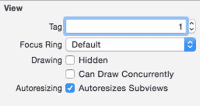

图 11-9. Attributes Inspector 面板底部的 Tag 属性

既然我们已经定义了用户界面，下一步是创建一个单独的 Swift 文件来存放我们的类，您可以按照以下步骤操作：

选择 `File ➤ New ➤ File`。出现一个对话框，要求选择模板。在“OS X”类别下单击“Source”，然后单击“Swift File”，如图 11-10 所示。

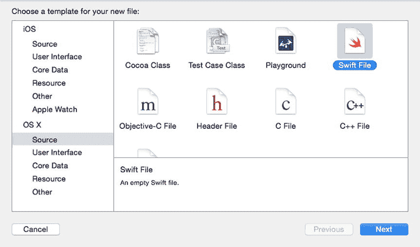

图 11-10. 选择用于存放类定义代码的文件

单击“Next”按钮。Xcode 询问您想要将文件存储在哪里以及给它起什么名字。在“Save As”文本字段中单击并输入 `personClass`。然后单击“Create”按钮。Xcode 在“Project Navigator”面板中显示 `personClass.swift` 文件。在“Project Navigator”面板中单击 `personClass.swift` 文件。Xcode 显示文件内容。如下编辑 `personClass.swift` 文件：

```
import Foundation

class person {

    var hitPoints = 10

    func shoot () -> Int {
        var odds = 1 + Int(arc4random_uniform(3))
        if odds == 3 {
            // Hit, randomly determine damage from 1..3
            return 1 + Int(arc4random_uniform(3))
        } else {
            return 0 // Missed
        }
    }

}
```


这个类定义了一个名为 `hitPoints` 的属性，并将其初始值设为 10。同时，它还定义了一个名为 `shoot` 的方法，该方法不接受任何参数，但会返回一个整数值。在 `shoot` 方法内部，它会计算一个从 1 到 3 的随机数，并将该值存储在 `odds` 变量中。

接着，它检查 `odds` 中的值是否恰好等于 3。如果是，则再次计算一个从 1 到 3 的随机数并返回此值。如果 `odds` 中的值不是 3，则该方法返回 0。

现在，你已经在单独的 Swift 文件中定义了一个类，接下来要实际使用该类创建对象。你可以按照以下步骤操作：

在项目导航窗格中点击 `AppDelegate.swift` 文件。Xcode 会显示 `AppDelegate.swift` 文件的内容。在 `AppDelegate.swift` 文件的 `IBOutlet` 列表下方，输入以下代码，基于 `personClass.swift` 文件中定义的 `person` 类创建两个对象：

```
@IBOutlet weak var window: NSWindow!
@IBOutlet weak var sheriffHitPoints: NSTextField!
@IBOutlet weak var outlawHitPoints: NSTextField!
var sheriff = person ()
var outlaw = person ()
```

修改 `applicationDidFinishLaunching` 方法，使其在用户界面的文本字段中显示 `sheriff` 和 `outlaw` 对象的 `hitPoints` 属性的初始值。这两个 `IBOutlet` 分别名为 `sheriffHitPoints` 和 `outlawHitPoints`：

```
func applicationDidFinishLaunching(aNotification: NSNotification) {
    // Insert code here to initialize your application
    sheriffHitPoints.integerValue = sheriff.hitPoints
    outlawHitPoints.integerValue = outlaw.hitPoints
}
```

修改 `shootButton` IBAction 方法，如下所示：

```
@IBAction func shootButton(sender: NSButton) {
    if sender.tag == 0 {    // 警长射击
        outlaw.hitPoints -= sheriff.shoot()
    } else {    // 歹徒射击
        sheriff.hitPoints -= outlaw.shoot()
    }
    sheriffHitPoints.integerValue = sheriff.hitPoints
    outlawHitPoints.integerValue = outlaw.hitPoints
    if sheriffHitPoints.integerValue <= 0 {
        var myAlert = NSAlert()
        myAlert.messageText = "警长阵亡。"
        myAlert.runModal()
    } else if outlawHitPoints.integerValue <= 0 {
        var myAlert = NSAlert()
        myAlert.messageText = "歹徒阵亡。"
        myAlert.runModal()
    }
}
```

此代码检查 `sender` 变量的 `Tag` 属性，该属性用于标识用户点击了哪个按钮。如果 `Tag` 属性为 0，则表示用户点击了“警长射击”按钮，因此它会运行 `sheriff` 对象中的 `shoot` 方法，并从 `outlaw.hitPoints` 属性中减去其结果（一个 0 到 3 之间的值）。

如果用户点击了“歹徒射击”按钮，则会运行 `outlaw` 对象中的 `shoot` 方法，并从 `sheriff.hitPoints` 属性中减去其结果（一个 0 到 3 之间的值）。

无论结果如何，它随后都会在用户界面上由 `sheriffHitPoints` 和 `outlawHitPoints` 这两个 `IBOutlets` 标识的两个文本字段中，显示 `sheriff` 和 `outlaw` 双方的 `hitPoints` 属性的最新值。

最后，如果 `sheriff` 或 `outlaw` 任意一方的 `hitPoints` 属性降至 0 或以下，则会弹出一个警告对话框，显示 `sheriff` 或 `outlaw` 阵亡的消息。`AppDelegate.swift` 文件的完整内容应如下所示：

```
import Cocoa

class AppDelegate: NSObject, NSApplicationDelegate {

    @IBOutlet weak var window: NSWindow!
    @IBOutlet weak var sheriffHitPoints: NSTextField!
    @IBOutlet weak var outlawHitPoints: NSTextField!

    var sheriff = person ()
    var outlaw = person ()

    func applicationDidFinishLaunching(aNotification: NSNotification) {
        // 在此处插入代码以初始化你的应用程序
        sheriffHitPoints.integerValue = sheriff.hitPoints
        outlawHitPoints.integerValue = outlaw.hitPoints
    }

    func applicationWillTerminate(aNotification: NSNotification) {
        // 在此处插入代码以关闭你的应用程序
    }

    @IBAction func shootButton(sender: NSButton) {
        if sender.tag == 0 {    // 警长射击
            outlaw.hitPoints -= sheriff.shoot()
        } else {    // 歹徒射击
            sheriff.hitPoints -= outlaw.shoot()
        }

        sheriffHitPoints.integerValue = sheriff.hitPoints
        outlawHitPoints.integerValue = outlaw.hitPoints

        if sheriffHitPoints.integerValue <= 0 {
            var myAlert = NSAlert()
            myAlert.messageText = "警长阵亡。"
            myAlert.runModal()
        } else if outlawHitPoints.integerValue <= 0 {
            var myAlert = NSAlert()
            myAlert.messageText = "歹徒阵亡。"
            myAlert.runModal()
        }
    }
}
```

要查看此程序如何工作，请遵循以下步骤：

1.  选择 Product ➤ Run。Xcode 会运行你的 ObjectProgram 项目。注意，警长和歹徒下方的文本字段都显示 10，代表他们的总生命值。每次被击中，他们的生命值都会下降。生命值降到 0 或更低的一方将失败。
2.  点击警长射击按钮。如果警长击中了歹徒，你会看到歹徒标签下方的数值从 10 下降到某个较低的值，例如 8。如果警长未命中，歹徒下方的数字将完全不变。
3.  点击歹徒射击按钮。
4.  重复步骤 2 和 3，交替点击警长射击和歹徒射击按钮，直到任一角色的生命值降到 0 或更低。此时将出现一个警告对话框，如图 11-11 所示。

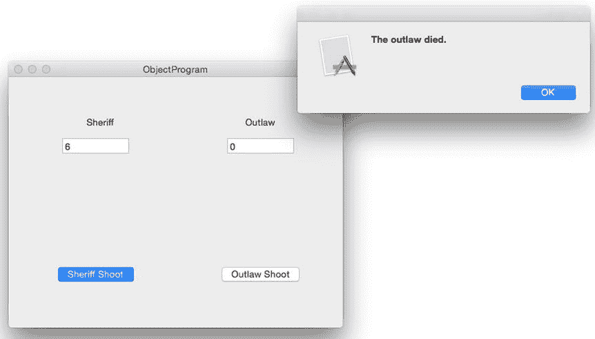

**图 11-11.** 当任一角色的生命值降到 0 或更低时，会出现一个警告对话框

5.  点击确定以关闭警告对话框。
6.  选择 ObjectProgram ➤ Quit ObjectProgram。

## 总结

Swift 编程完全依赖于对象和面向对象编程的原则。要创建一个对象，你首先必须定义一个类。一个类通常由一个或多个变量（称为属性）以及一个或多个函数（称为方法）组成。一旦定义了类，你就可以创建代表该类的对象。

类中的属性始终需要初始化。你可以在定义属性的同时为每个属性定义初始值，也可以创建一个特殊的初始化方法，让你能够接收数据来为对象定义初始值。

属性可以用固定值初始化，也可以根据另一个属性的值计算得出。一个属性的值可以改变另一个不同属性的值。

你可以从一个类中创建任意多个对象。通常，最好将类定义存储在单独的文件中，以保持代码的组织性。面向对象的程序通过对象向其他对象的属性发送数据，或调用存储在其他对象中的方法来工作。通过协同工作且保持独立，对象使得比以前更快地创建可靠且复杂的程序变得更容易。


