# 12\. 继承、多态与类的扩展

电子补充材料 本章的在线版本（doi:[10.​1007/​978-1-4842-1233-2_​12](http://dx.doi.org/10.1007/978-1-4842-1233-2_12)）包含补充材料，仅供授权用户使用。

在第 11 章中，你学习了如何通过类创建对象，以及类如何定义属性和方法。为了保护自身的数据和方法不受程序其他部分的影响，对象会隔离或封装其代码。封装是面向对象编程的一大优势，因为它能创建自包含的代码，你可以轻松修改或替换这些代码，而不会影响程序的任何其他部分。

通过让代码尽可能独立于程序的其他部分，对象提高了可靠性。想象一座用纸牌搭成的房子：抽掉一张牌，整个房子就会倒塌——在面向对象编程出现之前，大多数软件的工作方式正是如此。

对象就像纸牌一样，你可以抽走或替换它，而不会影响其他任何牌。除了封装之外，面向对象编程还包含另外两个特性，称为继承和多态。

继承背后的思想是重用现有代码，而无需实际复制另一份代码。多态背后的思想是，你可以在不修改原始代码的情况下替换继承而来的代码。通过继承和多态，即使不了解原始代码的工作原理，你也能重用现有代码。

事实上，每次在 Xcode 中创建项目时，查看你的 Swift 文件顶部，你应该会看到一行类似这样的代码：

`import Cocoa`

这行代码告诉 Xcode 使用苹果为你创建并存储在 Cocoa 框架中的所有类。在我们之前的示例程序中，你使用了 Cocoa 框架来操作数组、集合和字典。如果没有 Cocoa 框架，你就得自己编写 Swift 代码来实现这些常用功能。这不仅耗时，而且容易出错，因为你需要编写代码并测试以确保其正常工作。

只需依赖 Cocoa 框架中的类，你就能在几乎不写代码的情况下为程序增加功能。随着你在编写自己的类方面经验越来越丰富，你可以创建自己的实用库，并轻松地将其插入其他项目中，从而重用你所有的辛勤成果。

## 理解继承

继承的主要目的是让代码重用变得简单。在过去，人们通过简单地复制代码来重用代码。但如果代码中发现错误（bug）该怎么办？这意味着你需要修复每一份代码副本中的那个 bug。只要漏掉一份有问题的代码副本，你的程序就无法运行。

创建同一代码的多个副本会引发两个问题。首先，它浪费空间。其次，由于代码的多个副本散布在整个程序中，修改代码变得更加困难。继承解决了这两个问题。

首先，继承从不复制代码，因此从不浪费空间。其次，由于继承只保留一份代码，你只需修改这一份代码，就能让修改自动影响程序中所有依赖该代码的部分。

继承并非实际复制代码，而是创建指向一份代码的指针或引用。当你创建一个类时，你可以这样简单地声明它的名称：

```
class className {

}
```

要从另一个类继承代码，则像这样命名那个类：

```
class className : superClass {

}
```

这段代码定义了一个名为`className`的类，它从另一个名为`superClass`的类中继承代码。这意味着在`superClass`中定义的任何属性和方法也会自动在`className`中生效，即使`className`类完全是空的。

如果你查看之前在章节中创建的任何 OS X 示例程序，你可能会看到类似这样的代码：

```
class AppDelegate: NSObject, NSApplicationDelegate {

}
```

这定义了一个名为`AppDelegate`的类，它从另一个名为`NSObject`的类中继承代码。（这段代码还通过另一个名为`NSApplicationDelegate`的文件向`AppDelegate`类添加了额外代码，你将在本章后面了解更多关于这个文件的内容。）

要了解如何在类中使用继承，请按照以下步骤创建一个新的 playground：

启动 Xcode。选择“文件”>“新建”>“Playground”。（如果你看到 Xcode 欢迎屏幕，也可以点击“开始使用 playground”。）Xcode 会要求你输入 playground 名称和平台。在“名称”文本字段中点击，输入`InheritPlayground`。在“平台”弹出菜单中选择“OS X”。Xcode 会询问你希望将 playground 文件保存到哪里。点击一个文件夹以保存 playground 文件，然后点击“创建”按钮。Xcode 会显示该 playground 文件。按如下方式编辑代码：

```
import Cocoa

class firstClass {

    var speed : Int = 0
    var locationX : Int = 3
    var locationY : Int = 5

    func move (X: Int, Y: Int) {
        locationX += X
        locationY += Y
    }
}

class copyCat : firstClass {

}

var kitten = copyCat ()
kitten.speed = 4
kitten.move(4, Y: 8)
print (kitten.locationX)
print (kitten.locationY)
```

这段 Swift 代码定义了两个类。首先，它定义了一个类（名为`firstClass`），该类拥有三个属性（`speed`、`locationX`和`locationY`）和一个方法（`move`）。然后，它定义了第二个类（名为`copyCat`），这个类完全是空的，但它继承了`firstClass`中的所有代码。

为了证明`copyCat`类确实继承了`firstClass`的代码，这段 Swift 代码接下来创建了一个名为`kitten`的对象，该对象基于`copyCat`类。`kitten`对象可以在`speed`属性中存储数据，并使用`move`方法来修改其`locationX`和`locationY`属性，然而`copyCat`类本身完全是空的。图 12-1 显示了在 playground 中运行这段 Swift 代码的结果。

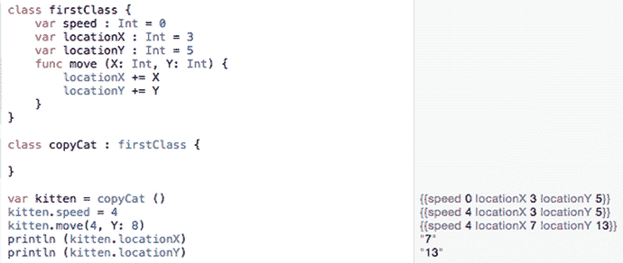

图 12-1. 展示继承的工作原理

注意

某些编程语言（如 C++）允许一个类从两个或多个类继承，这称为多重继承。然而在 Swift 中，一个类只能从另一个类继承，这称为单继承。


在上面的例子中，`copyCat` 类从 `firstClass` 继承了三个属性（`speed`、`locationX` 和 `locationY`）以及一个方法（`move`）。由于 `copyCat` 类没有定义自己的任何属性或方法，因此 `copyCat` 类与 `firstClass` 基本相同。

在实际使用中，一个类没有理由完全照搬另一个类的内容来继承。更常见的做法是一个类（称为子类）从另一个类（称为超类）继承，然后添加自己的额外属性和方法。

这样一来，子类只需包含这些新属性和方法的代码，同时仍能访问超类的所有属性和方法。例如，考虑下面的类：

```
class copyDog : copyCat {
    var name : String = ""
}
```

这个类继承了 `copyCat` 类的所有代码，并添加了它自己的一个新属性，名为“name”，该属性可以存储一个字符串。上述定义了 `name` 属性并继承 `copyCat` 类代码的类定义，等价于下面这样：

```
class copyDog {
    var speed : Int = 0
    var locationX : Int = 3
    var locationY : Int = 5
    func move (X: Int, Y: Int) {
        locationX += X
        locationY += Y
    }
    var name : String = ""
}
```

请记住，`copyCat` 类继承了 `firstClass` 的所有内容，而 `firstClass` 定义了 `speed`、`locationX` 和 `locationY` 属性以及 `move` 方法。相比之下，从 `copyCat` 类继承代码的 `copyDog` 类要简短得多。

继承像一条链条一样运作。如果类 A 继承自类 B，但类 B 继承自类 C 的所有内容，那么类 A 就继承了类 B 和类 C 的所有内容。例如，`copyDog` 类继承了 `copyCat` 类的所有内容。而 `copyCat` 类又继承了 `firstClass` 的所有内容。这意味着 `copyDog` 类最终继承了 `copyCat` 类和 `firstClass` 的所有内容，如图 12-2 所示。

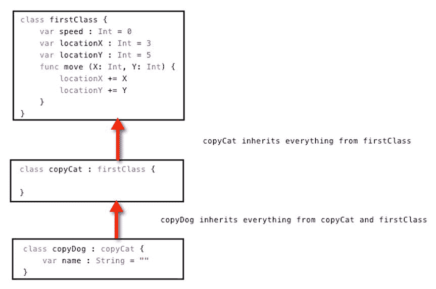

图 12-2. 类继承前一个类的所有内容

这种继承的链条效应正是 Cocoa 框架的设计方式。在最简单的层面上，有一个名为 `NSObject` 的基本类。像 `NSResponder` 这样的类继承了 `NSObject` 的所有内容，并添加了自己的新属性和方法。另一个类如 `NSView` 则继承了 `NSResponder` 和 `NSObject` 的所有内容。当你在 Xcode 的文档窗口中查阅 Cocoa 框架中的类时，可以看到由“继承自：”标签标识的这个类的链条链接，如图 12-3 所示。

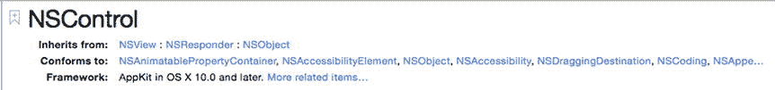

图 12-3. 文档窗口标识了当前显示的类所继承的超类

要了解如何在多个类之间使用继承，请按照以下步骤操作：

确保 Xcode 中已加载 `InheritPlayground` 文件。按如下方式编辑代码：

```
import Cocoa

class animal {
    var legs : Int = 0
}

class packAnimal : animal {
    var strength : Int = 100
}

class biped : packAnimal {
    var IQ : Int = 75
}

var snake = animal()
print (snake.legs)

var mule = packAnimal()
mule.legs = 4
mule.strength = 120

var relative = biped()
relative.legs = 2
relative.strength = 55
relative.IQ = 10
```

这段代码创建了三个类：`animal`（`legs` 属性）、`packAnimal`（`strength` 属性）和 `biped`（`IQ` 属性）。然后，它基于这些类创建了三个对象。第一个对象 `snake` 基于 `animal` 类。第二个对象 `mule` 基于 `packAnimal` 类。第三个对象 `relative` 基于 `biped` 类。

最终，`relative` 对象包含了来自所有三个类的属性，`mule` 对象只包含来自 `animal` 和 `packAnimal` 类的属性，而 `snake` 对象只包含来自 `animal` 类的属性，如下所示：

| 对象 | 基于这些类 | 包含这些属性 |
| --- | --- | --- |
| `snake` | `animal` | `legs` |
| `mule` | `packAnimal`、`animal` | `legs`、`strength` |
| `relative` | `biped`、`packAnimal`、`animal` | `legs`、`strength`、`IQ` |

`snake`、`mule` 和 `relative` 对象基于它们不同的类以及它们所继承的类而包含不同的属性，如图 12-4 所示。

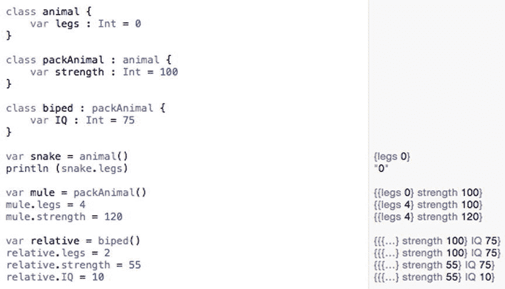

图 12-4. 查看继承如何在不同类存储的属性之间运作


## 理解多态

当一个类（子类）继承自另一个类（超类）时，它会包含超类中存储的所有属性和方法。尽管子类继承了超类的所有属性和方法，但这些属性和方法并不会显示在子类内部。每个类中出现的代码，仅是该类所特有的属性和方法。

从其他类继承来的属性会保持相同的名称和数据类型。从其他类继承来的方法也会保持相同的名称和实现其功能的代码。

继承方法的问题在于，你可能想要修改继承来的方法中的代码。例如，假设你有一个视频游戏，里面有在地上跑的狗和在空中飞的鸟。你可以创建一个像这样的基础类：

```
class gameObject {
    var speed : Int = 0
    var locationX : Int = 3
    var locationY : Int = 3

    func move (X: Int, Y: Int) {
        locationX += X + speed
        locationY += Y + speed
    }
}

var dog = gameObject()
```

现在，从 `gameObject` 类创建的 `dog` 对象，拥有三个属性（`speed`、`locationX` 和 `locationY`）和一个方法（`move`），该方法用于改变 `locationX` 和 `locationY` 属性。

狗只能在地上跑，但鸟可以在二维空间中移动，因此它需要一个额外的 `height` 属性。要移动一个飞行物体，`move` 方法需要能改变 `height` 属性。这意味着 `move` 方法需要有所不同。

解决这个问题的一个笨办法是为 `move` 方法起一个不同的名称，比如将其名称从 `"move"` 改为 `"fly"`：

```
class flyingObject : gameObject {
    var height : Int = 0

    func fly (X: Int, Y: Int) {
        locationX += X + speed
        locationY += Y + speed
        height += (X + Y) / 2
    }
}

var bird = flyingObject()
```

这个解决方案的问题在于，从 `flyingObject` 类创建的 `bird` 对象现在有两个方法：从 `gameObject` 继承来的 `move` 方法，以及在 `flyingObject` 中新定义的 `fly` 方法。

你可以简单地忽略 `move` 方法而使用 `fly` 方法，但如果你意外地使用了 `move` 方法（而不是正确的、能让鸟在二维空间中移动的 `fly` 方法）来改变鸟的位置，这就有产生错误的风险。

这就是多态存在的意义了。多态基本上允许你重复使用一个方法名（比如 `move`），但用完全不同的代码来替换它，使其正常工作。为了表明你在使用多态来重用方法名但修改其代码，必须在你要修改的方法前加上 `"override"` 关键字，例如：

```
override func move (X: Int, Y: Int) {
    locationX += X + speed
    locationY += Y + speed
    height += (X + Y) / 2
}
```

当你覆盖一个方法（使用多态）时，你实际上拥有了两个同名的方法，但一个版本定义在某个类中，第二个版本定义在另一个类中。计算机永远不会搞混，因为你只能通过同时指定对象名和方法名来运行每个方法。尽管方法名相同，但对象名是不同的。

要了解多态如何工作，请遵循以下步骤：

确保你的 `InheritPlayground` 文件已加载到 Xcode 中。按如下方式编辑代码：

```
import Cocoa

class gameObject {
    var speed : Int = 0
    var locationX : Int = 3
    var locationY : Int = 3

    func move (X: Int, Y: Int) {
        locationX += X + speed
        locationY += Y + speed
    }
}

var dog = gameObject()

class flyingObject : gameObject {
    var height : Int = 0

    override func move (X: Int, Y: Int) {
        locationX += X + speed
        locationY += Y + speed
        height += (X + Y) / 2
    }
}

var bird = flyingObject()

dog.move(4, Y: 7)
bird.move(4, Y: 7)
```

要覆盖一个方法，`flyingObject` 类必须首先继承自另一个类。在这个例子中，`flyingObject` 继承自 `gameObject`。现在 `flyingObject` 类可以使用 `"override"` 关键字来指定它正在修改使 `move` 方法工作的代码。在这个例子中，唯一的改动是添加了修改 `height` 属性的代码，但我们完全可以在这个被覆盖的 `move` 方法中添加完全不同的代码。

请注意，当你对 `dog` 对象运行 `move` 方法（`dog.move`）时，`move` 方法只改变 `locationX` 和 `locationY` 的值；但当你对 `bird` 对象运行 `move` 方法（`bird.move`）时，覆盖后的方法会运行，并且也会改变 `height` 属性，如图 12-5 所示。

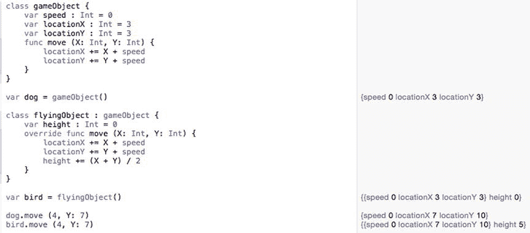

**图 12-5.** 被覆盖的方法可以有不同的行为

当覆盖方法时，你只能修改方法内部的代码。你不能修改方法的参数列表。例如，考虑这个类：

```
class basicDesign {
    var location : Int = 0

    func moveMe (X : Int) {
        location += X
    }
}
```

要覆盖 `moveMe` 方法，下一个类需要继承 `basicDesign` 类，并且只修改被覆盖方法内部的代码。以下做法是行不通的：

```
class newDesign : basicDesign {
    override func moveMe (X: Int, Y: Int) { // 不起作用
    }
}
```

注意，原始的 `moveMe` 方法只有一个参数（`X : Int`），但 `newDesign` 类中的 `moveMe` 方法有两个参数（`X: Int`, `Y: Int`）。尽管方法名相同，但这个方法的参数列表不同，所以它是行不通的。当覆盖方法时，你只能修改代码，而不能修改参数列表。


### 重写属性

除了重写方法之外，Swift 还允许你重写属性。当你重写属性时，必须保持相同的属性名和数据类型。你所能改变的，是一个变量的 getter 和 setter 方法，以及属性观察器。

在最简单的层面上，getter 仅返回一个变量的值。在更复杂的层面上，getter 会计算一个值。请考虑以下代码：

```
class basicDesign {
    var location: Int {
        get {
            return 4
        }
    }
}
```

这个 `basicDesign` 类定义了一个名为 `location` 的属性，其 getter 返回 `location` 属性中的值 `4`。要重写这个属性，你需要保留变量名和数据类型（`Int`），但可以更改 getter 代码，例如：

```
class newDesign : basicDesign {
    override var location: Int {
        get {
            return 7
        }
    }
}
```

这个 `newDesign` 类继承了 `basicDesign` 类中的 `location` 属性。然而，它用一个返回值为 `7` 的新 getter 重写了 `location` 属性。

要查看重写属性是如何工作的，请遵循以下步骤：

确保你的 `InheritPlayground` 文件已加载到 Xcode 中。按如下方式编辑代码：

```
import Cocoa

class basicDesign {
    var location: Int {
        get {
            return 4
        }
    }
}

class newDesign : basicDesign {
    override var location: Int {
        get {
            return 7
        }
    }
}

var ant = basicDesign()
var fly = newDesign()

ant.location
fly.location
```

在这个例子中，`ant` 对象基于 `basicDesign` 类，该类将 `location` 属性的值定义为 `4`。`fly` 对象基于 `newDesign` 类，该类继承了 `location` 属性。然而，`newDesign` 类重写了 `location` 属性的 getter 代码，因此 `location` 属性中存储的值不再是 `4`，而是 `7`，如图 12-6 所示。

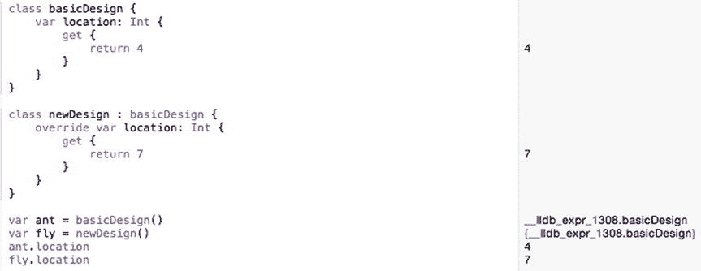

图 12-6. 使用新的 getter 代码重写属性

请记住，在重写方法和属性时，你只能更改：

- 方法中的代码
- 属性的 getter/setter 或属性观察器中的代码

你永远不能更改：

- 方法名
- 方法参数列表
- 属性名
- 属性数据类型

### 防止多态

在某些情况下，你可能希望阻止一个方法、属性甚至整个类通过多态被修改。为此，你只需要插入“final”关键字。如果你想阻止整个类被继承，只需将“final”关键字放在类名前面，如下所示：

```
final class className {
    var propertyName = initialValue
    func methodName() {
    }
}
```

> **注意**  
> 如果你在类名前面放置“final”，它会自动阻止该类的属性和方法被重写，因此你无需在每个属性或方法名前面放置“final”。

如果你想阻止某个单独的属性或方法被重写，只需将“final”关键字放在该属性或方法前面，如下所示：

```
class className {
    final var propertyName = initialValue
    func methodName() {
    }
}
```

上面例子中的“final”关键字阻止了该属性被重写，同时允许该方法被重写。如果你想阻止方法被重写，同时允许属性被重写，则应像这样将“final”关键字放在方法前面：

```
class className {
    var propertyName = initialValue
    final func methodName() {
    }
}
```

## 使用扩展

如果有一个类包含你需要的属性和方法，面向对象的方法是继承该类（创建一个子类）。不断创建子类的问题在于，从略有不同的类文件中创建对象可能会变得笨拙。

当你想要扩展 Cocoa 框架中类的功能时尤其如此。例如，如果你正在使用 `String` 数据类型，你可能不想创建一个 `String` 数据类型的子类，然后基于这个新的子类创建对象。理想情况下，你希望继续使用 `String` 数据类型，但同时拥有新增的功能。

这就是 Swift 提供扩展的原因。扩展本质上允许你向现有类添加代码，而无需创建子类。这样，你仍然可以使用原始类，但同时无需经过继承、多态或子类化，就可以为该类添加新功能。扩展的结构如下所示：

```
extension className {
}
```

扩展可以定义方法以及包含以下代码的属性：

- getter 和 setter
- 初始化器
- 属性观察器

虽然扩展可以在不继承的情况下向类添加新的属性和方法，但扩展无法覆盖类中已有的方法或属性。扩展也不能创建具有初始值的属性，例如：

```
var temperature : Int = 100        // 不能在扩展中使用
```

要了解扩展如何向类添加属性和方法，请通过以下步骤创建一个新的 playground：

启动 Xcode。选择“文件”➤“新建”➤“Playground”。（如果你看到了 Xcode 欢迎屏幕，也可以点击“获取 playground 的入门知识”。）Xcode 会要求输入 playground 名称和平台。点击“名称”文本字段并输入 `ExtensionPlayground`。点击“平台”弹出菜单并选择“OS X”。Xcode 会询问你想将 playground 文件保存到哪里。点击一个你想保存 playground 文件的文件夹，然后点击“创建”按钮。Xcode 会显示 playground 文件。按如下方式编辑代码：

```
import Cocoa

class emptyClass {
}

extension emptyClass {
    var age : Int {
        get {
            return 50
        }
    }

    func retire (testAge : Int) -> String {
        if testAge < 62 {
            return "继续工作"
        } else {
            return "该退休了"
        }
    }
}

var aWorker = emptyClass ()
aWorker.retire(65)
aWorker.age
```

这段代码创建了一个完全空的类，然后创建一个扩展，向该空类添加一个“age”属性和一个“retire”方法。最后，它从那个空类创建了一个对象，调用“retire”方法（在扩展中定义），并显示存储在“age”属性中的值，如图 12-7 所示。

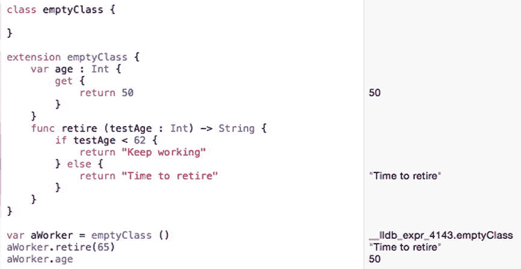

图 12-7. 使用扩展向空类添加属性和方法

你可以看到，这个类本身什么也没做，但通过扩展，这个类现在获得了它之前没有的新功能。


## 使用协议

在本章开头，你首次接触了为了学习各章基本原理而创建的 `AppDelegate.swift` 文件中出现的内容。这个 `AppDelegate` 类的声明如下：

`class AppDelegate: NSObject, NSApplicationDelegate {`

这行代码创建了一个名为 `AppDelegate` 的类，它继承了 Cocoa 框架中 `NSObject` 类的属性和方法。然而，`NSApplicationDelegate` 是另一个文件的名称，用于在不通过继承或子类化的情况下扩展类。

`NSApplicationDelegate` 文件是一个协议文件。上述 Swift 代码创建了一个名为 `AppDelegate` 的类，它从 `NSObject` 类继承属性和方法，同时也从 `NSApplicationDelegate` 文件继承代码。（你可以在 Xcode 文档窗口中查看 `NSApplicationDelegate` 协议的更多细节。）

类（如 `NSObject`）与协议（如 `NSApplicationDelegate`）之间的主要区别在于：类定义了属性和方法，而协议仅定义了属性和方法的名称，并不包含实际实现它们的任何代码。协议有时被称为空类，因为它从不定义任何使事物实际运行的 Swift 代码。

协议定义了一组用于解决特定类型问题的属性和方法名称。采用或遵循此协议的类需要提供实际的 Swift 代码来实现每个方法或属性的声明。

协议的声明看起来与类或结构体的声明相同。唯一的区别在于协议声明使用“protocol”关键字：

```
protocol 协议名称 {

}
```

在这个协议声明中，你可以定义属性和方法，但不实现任何 Swift 代码，如下所示：

```
protocol 协议名称 {
    var 属性 1 : 数据类型 { get }        // 只读
    var 属性 2 : 数据类型 { get set }    // 读写
    func 方法名 (参数) -> 数据类型
}
```

当协议定义了一个属性或方法时，任何采用该协议的类都必须按照协议中的定义精确实现该属性或方法。在上述示例中，`属性 1` 定义为仅有 getter，而 `属性 2` 定义为同时有 getter 和 setter。

这意味着当一个类实现这两个属性时，它必须仅为 `属性 1` 定义 getter，而为 `属性 2` 同时定义 getter 和 setter。

同样，协议中定义的方法在类文件中采用时必须完全一致。也就是说，如果协议中定义的方法带有两个整数参数，那么该方法的实现也必须具有完全相同的两个整数参数。

协议通常用于处理常见的用户界面元素，这些元素需要特定类型的方法来操作它们，但由于不同程序的数据可能不同，因此无法精确定义如何操作它们。

例如，表格视图是一种用户界面元素，它以行的形式显示数据列表。表格视图需要知道要容纳多少行数据以及每行显示什么类型的数据。由于每个表格视图都需要知道这些信息，因此创建标准方法来处理这一需求是合理的；同时，由于每个表格视图需要包含不同的信息，因此避免编写实际的 Swift 代码来填充表格视图数据也是合理的。

任何包含表格视图的程序都可以利用存储在协议中的预定义方法名称来操作数据。你只需添加 Swift 代码来用数据填充表格视图即可。

通过使用协议，你可以在不同程序之间使用相同的方法名称来操作表格视图。如果没有表格视图协议，你将被迫自己发明在表格视图中添加和显示数据的方法名称。因此，协议在 Cocoa 框架中通常用于提供一致的方法列表来执行常见任务。

要了解协议的工作原理，请按照以下步骤操作：

确保 `ExtensionPlayground` 文件已加载到 Xcode 中。按如下方式编辑代码：

```
import Cocoa

protocol testMe {
    var cash : Int { get }
    var creditCheck : Int { get set }
    func purchase (price : Int) -> String
}

class windowShopper : testMe {
    var tempValue : Int = 0
    var cash : Int = 0
    
    var creditCheck : Int {
        get {
            return tempValue
        }
        set (newValue) {
            tempValue = newValue
            cash -= 10
        }
    }
    
    func purchase (price : Int) -> String {
        cash -= price
        return "买到了东西！"
    }
}

var shopper = windowShopper()
shopper.cash = 450
shopper.purchase(129)
shopper.cash
```

注意，`testMe` 协议定义了两个属性和一个方法。`cash` 属性仅定义了 getter。`creditCheck` 属性同时定义了 getter 和 setter。`purchase` 方法只列出了它的参数（`price` 为整数）及其返回值，返回值是一个 `String`。注意，协议实际上并没有实现任何必要的 Swift 代码。

当创建 `windowShopper` 类时，它采用或遵循了 `testMe` 协议。这意味着它必须提供 Swift 代码来定义 `cash` 属性的 getter，以及 `creditCheck` 属性的 getter 和 setter。它还需要实现 `purchase` 方法的 Swift 代码。

如果你未能为 `testMe` 协议中定义的所有属性和方法编写 Swift 代码，Xcode 将给出错误提示，指出 `windowShopper` 类未能遵循该协议。在采用协议时，请务必实现所有必要的属性和方法。

运行上述代码会显示结果，如图 12-8 所示。

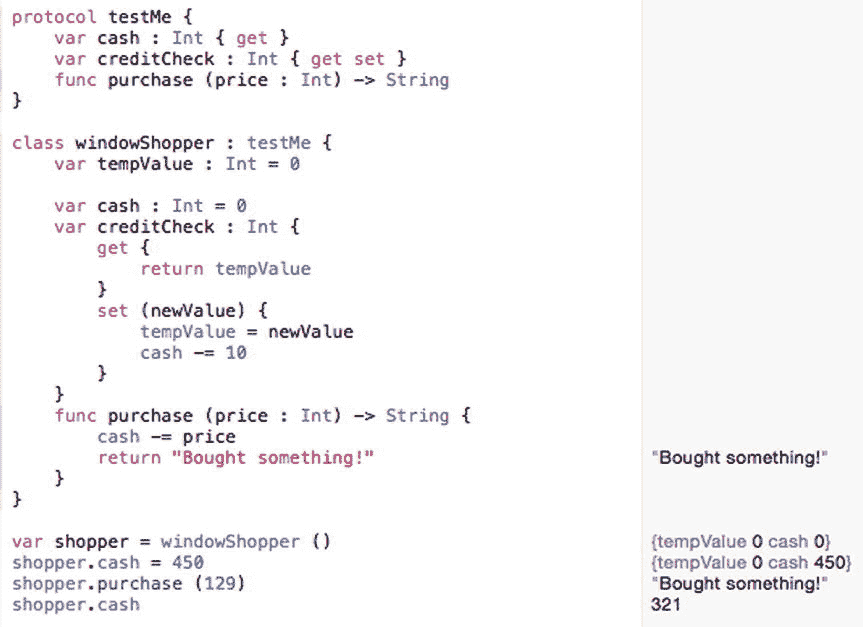

图 12-8. 符合协议的类


### 在协议中定义可选属性和方法

当你创建协议时，你定义的每个属性和方法都必须被任何采用该协议的类所实现。但是，你也可以让一个或多个属性和方法成为可选的，这样它们就可以被忽略。要定义可选属性或方法，你需要使用 `@objc` 关键字标记协议，并同样使用 `optional` 关键字标记单个属性或方法，例如：

```
@objc protocol 协议名称 {
    var 必需属性 : 数据类型 { get }
    optional var 可选属性 : 数据类型 { get }
    optional func 可选方法 ()
}
```

要采用或遵循此协议，一个类只需要实现任何未被 `optional` 关键字标记的属性或方法。要实现必需的属性或方法，你需要使用 `@objc` 关键字标记它们，例如：

```
class 类名称 : 协议名称 {
    @objc var 必需属性 : 数据类型 = 初始值
}
```

然而，如果你想实现一个可选的属性或方法，你可以省略 `@objc` 关键字，像这样：

```
class 类名称 : 协议名称 {
    @objc var 必需属性 : 数据类型 = 初始值
    var 可选属性 : 数据类型 = 初始值
}
```

要了解如何在协议中创建可选属性和方法，请按照以下步骤操作：

确保 `ExtensionPlayground` 文件已加载到 Xcode 中。按如下方式编辑代码：

```
import Cocoa

@objc protocol 人 {
    var 姓名 : String { get }
    optional var 年龄 : Int { get }
    optional func 移动 (X: Int) -> Int
}

class 政治家 : 人 {
    @objc var 姓名 : String = ""
}

var 候选人 = 政治家 ()
候选人.姓名 = "约翰·多伊"
```

请注意，上面 `人` 协议中唯一必需的项目是属性 `姓名`。这就是为什么 `政治家` 类只需要实现 `姓名` 属性，但必须使用 `@objc` 关键字来标记它。

尝试将不同的属性和方法设置为可选，这样你就能看到它们如何影响你在类中实现它们的方式。

### 将继承与协议结合使用

协议甚至可以从其他协议继承属性和方法。这使得一个协议可以从多个协议中继承属性和方法。现在，一个类必须采用或遵循所有协议中定义的所有属性和方法。

要了解如何从多个协议中继承属性和方法，请按照以下步骤操作：

确保 `ExtensionPlayground` 文件已加载到 Xcode 中。按如下方式编辑代码：

```
import Cocoa

protocol 第一个 {
    var 姓名 : String { get }
}

protocol 第二个 {
    var ID : Int { get }
}

protocol 第三个: 第一个, 第二个 {
    var 电子邮件 : String { get }
}

class 继承协议 : 第三个 {
    var 姓名 : String = ""
    var ID : Int = 0
    var 电子邮件 : String = ""
}

var 朋友 = 继承协议()
朋友.姓名 = "辛迪·史密斯"
朋友.ID = 12
朋友.电子邮件 = "cindysmith@isp.com"
```

在这个例子中，`姓名`、`ID` 和 `电子邮件` 属性定义在三个不同的协议中。`第三个` 协议继承了 `第一个` 和 `第二个` 协议。

现在，当某个类采用最后一个协议时，它必须实现所有协议中存储的属性和方法。尽管 `姓名`、`ID` 和 `电子邮件` 属性都在不同的协议中声明，但 `继承协议` 类可以访问它们全部，如图 12-9 所示。

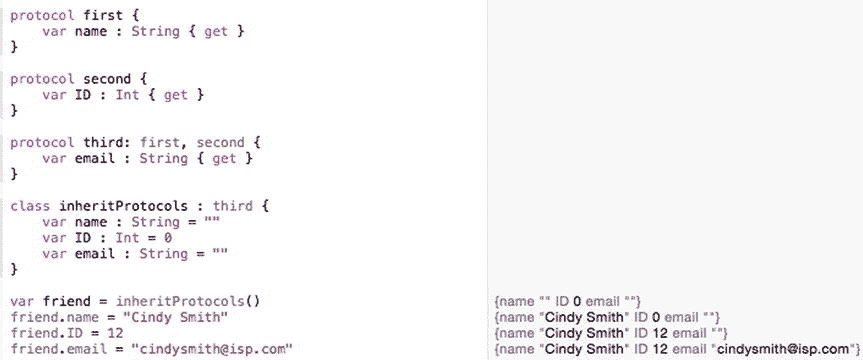

**图 12-9.** 从多个协议继承属性和方法

## 使用委托

协议与委托密切相关。委托背后的主要思想是让一个类将责任移交或委托给存储在另一个类中的代码。因此，与其创建新的子类来添加新功能，你可以使用包含额外功能的委托。

使用委托的一种常见方式是允许视图（用户界面）与控制器通信。通常，控制器通过 `IBOutlet` 与视图通信，这些 `IBOutlet` 允许控制器在用户界面上显示数据或从用户界面检索数据。

然而，视图也可以通过协议与控制器通信。协议文件定义了方法，并将实现这些方法的责任委托给控制器。控制器实现的最常见的方法类型包括名称中包含 `will`、`should` 和 `did` 的方法，例如 `applicationDidFinishLaunching` 或 `applicationWillTerminate`。

图 12-10 展示了控制器如何通过 `IBOutlet` 与视图通信，以及视图如何通过协议与控制器通信。

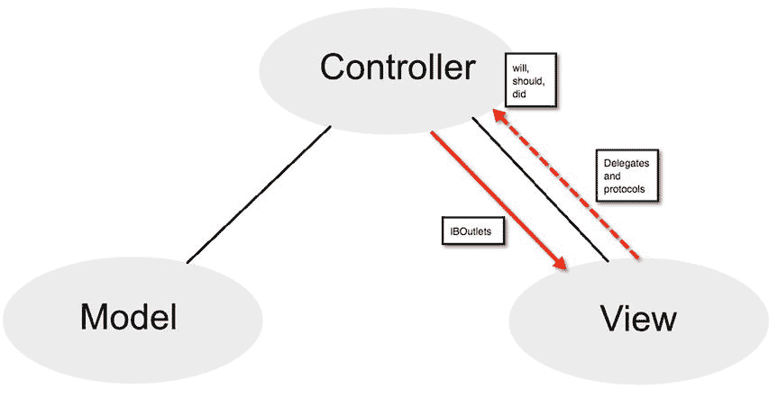

**图 12-10.** 视图可以通过协议与控制器通信

要了解视图如何使用委托与控制器通信，请按照以下步骤操作：

在 Xcode 内，选择 **文件 ➤ 新建 ➤ 项目**。在 OS X 类别下点击 **应用程序**。点击 **Cocoa 应用程序**，然后点击 **下一步** 按钮。Xcode 现在会询问产品名称。在 **产品名称** 文本字段中点击并输入 `DelegateProgram`。确保 **语言** 弹出菜单显示 `Swift`，并且没有勾选任何复选框。点击 **下一步** 按钮。Xcode 会询问你希望将项目存储在哪里。选择一个文件夹来存储你的项目，然后点击 **创建** 按钮。在项目导航器中点击 `AppDelegate.swift` 文件。`AppDelegate.swift` 文件的内容会出现在 Xcode 窗口的中间。查找以下代码行：

```
class AppDelegate: NSObject, NSApplicationDelegate {
```

这一行定义了一个名为 `AppDelegate` 的类，该类继承了 `NSObject` 类的属性和方法。此外，它还采用了 `NSApplicationDelegate` 文件定义的任何属性和方法。

点击文档窗口左上角的关闭按钮（红点）将其关闭。Xcode 窗口再次出现。请注意，`AppDelegate.swift` 文件包含两个空函数，分别名为 `applicationDidFinishLaunching` 和 `applicationWillTerminate`。这些函数由 `NSApplicationDelegate` 协议文件定义，但在 `AppDelegate.swift` 文件中实现。按如下方式修改这两个函数：

松开 **Option** 键，然后在弹出窗口底部的 **NSApplicationDelegate Protocol Reference** 上点击鼠标。文档窗口出现，显示关于 `NSApplicationDelegate` 协议的详细信息，如图 12-14 所示。注意 `NSApplicationDelegate` 协议定义的两个方法分别名为 `applicationDidFinishLaunching` 和 `applicationWillTerminate`。

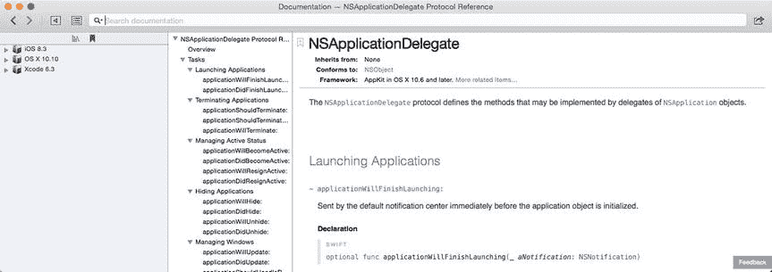

**图 12-14.** 在文档窗口中查看 `NSApplicationDelegate` 协议

点击文档窗口左上角的关闭按钮（红点）将其关闭。按住 **Option** 键，在 `NSApplicationDelegate` 上点击鼠标。当鼠标指针变为问号时，在 `NSApplicationDelegate` 上点击，使弹出窗口出现，如图 12-13 所示。

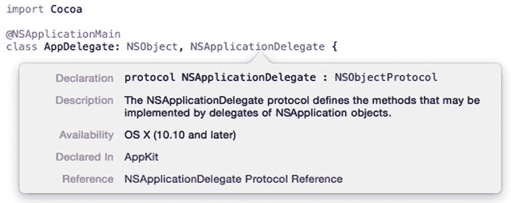

**图 12-13.**


按住 Option 键并点击可显示关于 `NSApplication` 协议的信息。松开 Option 键，然后将鼠标移到弹出窗口底部的 `NSObject Class Reference` 上并点击。此时会出现“文档”窗口，其中显示了 `NSObject` 类中可用的不同属性和方法的详细信息，如图 12-12 所示。所有这些属性和方法在你的 `AppDelegate` 类中同样可用。

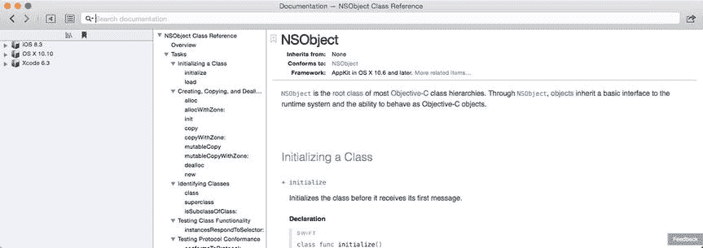

图 12-12. 显示 `NSObject` 类信息的“文档”窗口。

按住 Option 键并点击 `NSObject`。当鼠标指针变为问号时，点击 `NSObject`，将会出现一个弹出窗口，如图 12-11 所示。

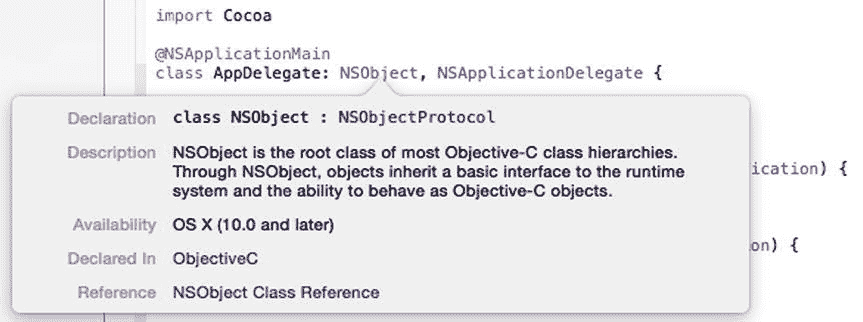

图 12-11. 按住 Option 键并点击类名，即可显示该类的信息。

```
func applicationDidFinishLaunching(aNotification: NSNotification) {
    print ("This line should print after the program runs")
}

func applicationWillTerminate(aNotification: NSNotification) {
    print ("This line should print before your program stops")
}
```

选择 Product ➤ Run。Xcode 会运行你的 `DelegateProgram` 项目并显示一个空的用户界面。选择 DelegateProgram ➤ Quit DelegateProgram。Xcode 窗口会再次出现。Xcode 窗口底部的调试区现在会显示两个 `println` 命令输出的文本。注意，`applicationDidFinishLaunching` 函数中的 `println` 命令会先执行，如图 12-15 所示。

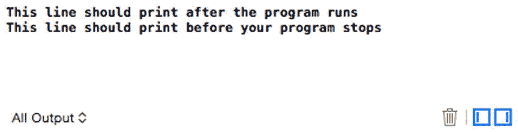

图 12-15. `NSApplicationDelegate` 文件定义的方法告诉程序用户界面的行为。

## 在 OS X 程序中使用继承

继承允许你创建在两个类之间底层代码发生变化时仍保持相同的方法名。在本示例程序中，你将定义一个类，然后为第二个类继承属性和方法。第二个类还将覆写一个方法，并添加一些代码，使被覆写的方法的行为略有不同。

若要创建展示继承如何工作的示例程序，请按以下步骤操作：

1. 在 Xcode 中，选择 File ➤ New ➤ Project。
2. 在 OS X 类别下点击 Application。
3. 点击 Cocoa Application，然后点击 Next 按钮。Xcode 会询问产品名称。
4. 在 Product Name 文本框中点击，输入 `InheritProgram`。
5. 确保 Language 弹出菜单显示为 Swift，并且没有勾选任何复选框。
6. 点击 Next 按钮。Xcode 会询问你希望将项目存储在何处。
7. 选择一个文件夹来存储你的项目，然后点击 Create 按钮。
8. 在项目导航器中点击 `MainMenu.xib` 文件。
9. 点击 `StructureProgram` 图标，使用户界面窗口出现。
10. 选择 View ➤ Utilities ➤ Show Object Library，使对象库出现在 Xcode 窗口的右下角。
11. 在用户界面上拖放一个按钮和两个标签，然后双击按钮和标签，修改它们上面显示的文本，使其与图 12-16 类似。

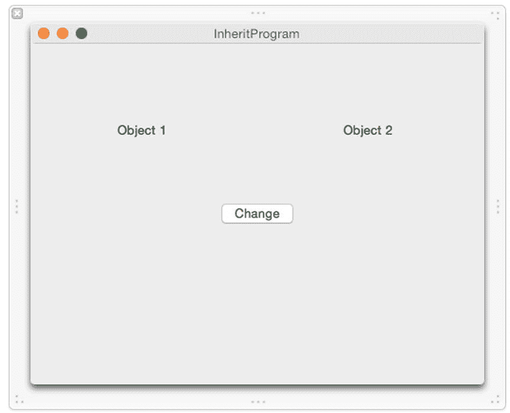

图 12-16. `InheritProgram` 的用户界面。

该用户界面显示两个标签，代表两个不同的对象。对象 1 只包含一个属性和一个修改该属性的方法。对象 2 继承自对象 1，包含一个额外的属性，并覆写了对象 1 中定义的方法。

当你点击 Change 按钮时，两个标签的外观将根据每个对象定义的属性和方法而改变。要将你的用户界面连接到你的 Swift 代码，请按以下步骤操作：

1. 在用户界面仍然显示在 Xcode 窗口中的情况下，选择 View ➤ Assistant Editor ➤ Show Assistant Editor。`AppDelegate.swift` 文件会出现在用户界面旁边。
2. 将鼠标移到 Change 按钮上，按住 Control 键，然后拖拽到 `AppDelegate.swift` 文件底部最后一个花括号的上方。
3. 松开鼠标和 Control 键。会弹出一个窗口。
4. 点击 Connection 弹出菜单，选择 Action。
5. 点击 Name 文本框，输入 `changeButton`。
6. 点击 Type 弹出菜单，选择 `NSButton`。然后点击 Connect 按钮。Xcode 会创建一个名为 `changeButton` 的空 `IBAction` 方法。
7. 将鼠标移到 Object 1 标签上，按住 Control 键，然后拖拽到 `AppDelegate.swift` 文件中 `@IBOutlet` 行的下方。
8. 松开鼠标和 Control 键。会弹出一个窗口。
9. 点击 Name 文本框，输入 `ObjectOne`，然后点击 Connect 按钮。
10. 将鼠标移到 Object 2 标签上，按住 Control 键，然后拖拽到 `AppDelegate.swift` 文件中 `@IBOutlet` 行的下方。
11. 松开鼠标和 Control 键。会弹出一个窗口。
12. 点击 Name 文本框，输入 `ObjectTwo`，然后点击 Connect 按钮。你现在应该拥有以下代表用户界面上所有标签的 `IBOutlets`：

```
@IBOutlet weak var window: NSWindow!
@IBOutlet weak var ObjectOne: NSTextField!
@IBOutlet weak var ObjectTwo: NSTextField!
```

直接在 `IBOutlet` 代码行下方输入以下内容：

```
class one {
    var myColor : NSColor = NSColor.blackColor ()
    func change () {
        myColor = NSColor.redColor()
    }
}

class two : one {
    var myBackground : NSColor = NSColor.whiteColor()
    override func change() {
        myColor = NSColor.blueColor()
        myBackground = NSColor.greenColor()
    }
}

var ThingOne = one ()
var ThingTwo = two()
```

按如下方式修改 `IBAction` 的 `changeButton` 方法：

```
@IBAction func changeButton(sender: NSButton) {
```


`ThingOne.change()`

`ThingTwo.change()`

`ObjectOne.textColor = ThingOne.myColor`

`ObjectTwo.textColor = ThingTwo.myColor`

`ObjectTwo.drawsBackground = true`

`ObjectTwo.backgroundColor = ThingTwo.myBackground`

`}`

这个 IBAction 方法分别运行了基于 `one` 和 `two` 类的 `ThingOne` 与 `ThingTwo` 对象中的 `change()` 方法。`two` 类继承自 `one` 类，但重写了 `change()` 方法，以修改一个名为 `myBackground` 的额外属性。

在 `ThingOne` 和 `ThingTwo` 都改变了各自的属性后，第一个标签（由 `ObjectOne` 代表）将其文本颜色设置为 `ThingOne` 对象中的 `myColor` 属性。第二个标签（由 `ObjectTwo` 代表）改变了其 `myColor` 和 `myBackground` 属性，因此将这些属性设置给了该标签。

`AppDelegate.swift` 文件的完整内容应如下所示：

```
import Cocoa

@NSApplicationMain
class AppDelegate: NSObject, NSApplicationDelegate {

    @IBOutlet weak var window: NSWindow!
    @IBOutlet weak var ObjectOne: NSTextField!
    @IBOutlet weak var ObjectTwo: NSTextField!

    class one {
        var myColor : NSColor = NSColor.blackColor()
        func change() {
            myColor = NSColor.redColor()
        }
    }

    class two : one {
        var myBackground : NSColor = NSColor.whiteColor()
        override func change() {
            myColor = NSColor.blueColor()
            myBackground = NSColor.greenColor()
        }
    }

    var ThingOne = one()
    var ThingTwo = two()

    func applicationDidFinishLaunching(aNotification: NSNotification) {
        // 在此处插入代码以初始化你的应用程序
    }

    func applicationWillTerminate(aNotification: NSNotification) {
        // 在此处插入代码以清理你的应用程序
    }

    @IBAction func changeButton(sender: NSButton) {
        ThingOne.change()
        ThingTwo.change()
        ObjectOne.textColor = ThingOne.myColor
        ObjectTwo.textColor = ThingTwo.myColor
        ObjectTwo.drawsBackground = true
        ObjectTwo.backgroundColor = ThingTwo.myBackground
    }

}
```

要查看此程序的工作原理，请按照以下步骤操作：

选择 InheritProgram ➤ 退出 InheritProgram。

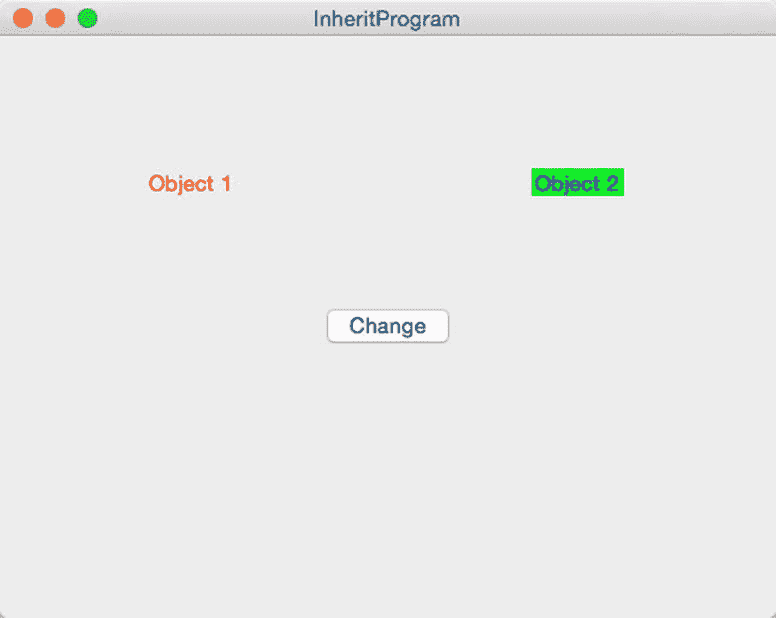

**图 12-17.** 点击 Change 按钮会使用相同的方法名称修改两个不同的对象

选择 Product ➤ Run。Xcode 会运行你的 InheritProgram 项目。注意两个标签看起来一模一样。点击 Change 按钮。Object 1 标签仅改变了其文本颜色，因为它代表的是一个只有一个属性（`myColor`）的类。Object 2 标签同时改变了其文本颜色和背景颜色，因为它拥有两个属性（`myColor` 和 `myBackground`）。尽管 `change()` 方法名称在两个类中相同，但它在第二个类中被重写了，以修改 `myBackground` 属性。

## 总结

类让你能够将相关代码组织在一起，使数据（属性）和操作这些数据的函数（方法）存储在同一位置。扩展类功能最直接的方式是通过继承来创建子类。

继承允许你继承另一个类的所有属性和方法。一个类只能继承自一个其他类，但那个其他类也可以继承自另一个类，从而形成类之间相互继承的链式效果。Cocoa 框架正是基于这种类继承链的理念构建的。

要阻止继承，你可以使用 `final` 关键字。要标识你正在重写一个属性或方法，你需要使用 `override` 关键字。

除了继承之外，你还可以通过扩展和协议来扩展类的功能。协议通常与 Cocoa 框架一起使用，以扩展类的功能。通过继承、扩展和协议，你可以扩展任何类的功能，从而轻松地重用现有代码。

