# 13. 创建用户界面

虽然可以创建完全不需要与用户交互的程序（例如控制交通信号灯的程序），但更常见的是创建显示某种用户界面的程序。通常这意味着显示一个窗口，其中包含各种项目，例如用于显示文本的标签、允许用户输入内容的文本字段，以及用于让用户控制程序的按钮或下拉菜单。

创建有效的用户界面完全取决于程序的目的。商业程序通常遵循带有下拉菜单和按钮的标准规范，但视频游戏可能会创建自定义界面，看起来可能与标准的 OS X 程序完全不同。归根结底，用户界面需要满足用户的需求。如果在遵循标准用户界面设计规范和让用户界面更易于用户使用之间做出选择，请始终将用户放在首位。

为了帮助你更好地理解用户界面设计，Apple 提供了一份名为《OS X 人机界面指南》的免费文档。这份文档简要概述了典型的 OS X 用户界面如何有效地工作，并特别强调了利用 OS X 最新特性。通过这样做，你的 OS X 程序将呈现出现代和与时俱进的外观。未能利用 OS X 的最新特性意味着你的程序即使是全新的，也可能看起来过时。

在前面的章节中，你已经使用 Xcode 设计了简单的用户界面。在本章中，我们将更深入地探讨 Xcode 中专注于帮助你设计用户界面的不同部分。

记住，没有“完美”的用户界面设计。“完美”的用户界面是那种使任务尽可能简单、不费吹灰之力，以至于用户甚至感觉不到与任何用户界面交互的界面。用户界面充当着你与程序之间的中间人或翻译者。任何用户界面的目标都是让用户感觉他们是在直接与程序进行沟通和操作。

## 理解用户界面文件

Cocoa 框架定义了一系列类，用于创建从按钮（`NSButton` 类）、文本字段（`NSTextField`）、滑块（`NSSlider`）到日期选择器（`NSDatePicker`）等各种可能的用户界面元素。理论上，完全可以用纯 Swift 代码来创建整个用户界面。但这样做可能很繁琐，因为在程序实际运行之前，你无法看到用户界面的样子。这就像试图通过精确描述画笔在画布上的位置以及手移动的特定角度和方向来画画一样笨拙。

Xcode 并没有强制你编写 Swift 代码来定义用户界面，而是提供了一个名为 Interface Builder 的功能。Interface Builder 的理念是，你可以通过将元素拖放到窗口上来设计用户界面。

通过拖放元素来创建用户界面的优势在于，你可以看到用户界面的样子，从而能够快速调整和修改它。此外，通过将用户界面的设计与 Swift 代码分离，你可以在不影响 Swift 代码的情况下更改用户界面，反之亦然。

在过去，程序员必须编写代码来创建用户界面，修改用户界面代码可能会影响程序运行的核心代码（反之亦然）。这意味着程序的修改过程会很缓慢，因为你必须不断测试，以确保你的更改不会影响程序的其他部分。

通过将用户界面与 Swift 代码隔离，Xcode 让你能够比以前更快地创建可靠的程序。现在，你可以替换掉一个用户界面，用另一个来取代它，而不影响你的代码；或者你可以修改代码，而不影响用户界面。

Xcode 为你提供了两种存储用户界面的选项：

*   在 `.xib` 文件中
*   在 `.storyboard` 文件中

一个 `.xib` 文件（代表 Xcode Interface Builder）通常包含用户界面的单个窗口或视图。一个简单的程序可能只需要一个 `.xib` 文件来存放其用户界面，但更复杂的程序很可能需要多个 `.xib` 文件来存储不同的窗口。

一个 `.storyboard` 文件由一个或多个视图（view）以及转场（segue）组成，其中视图通常代表屏幕上出现的一个窗口，而转场定义了从一个视图到下一个视图的过渡。

实际上，你可以将 `.xib` 和 `.storyboard` 文件结合在同一个项目中，来创建程序的用户界面。由于 `.storyboard` 文件常用于创建 iOS 应用，它们现在也越来越普遍地用于创建 OS X 用户界面。（第 14 章会更详细地解释故事板和转场。）

用户界面的基本组件是视图（view），它在屏幕上显示信息。一个视图可以是一个完整的窗口，也可以只是一个能显示信息（如表格、文本滚动列表或图片）的框。无论你使用的是 `.xib` 还是 `.storyboard` 文件，用户界面总是由一个或多个包含其他用户界面元素（如按钮和文本字段）的视图组成。

## 搜索对象库

要显示程序的用户界面，你需要在项目导航器窗格中点击 `.xib` 或 `.storyboard` 文件。一旦你选择了要修改的用户界面文件，就可以从对象库（位于 Xcode 窗口的右下角）中拖拽元素，并将其放置在用户界面的任何位置。要查看对象库，请选择 视图 ➤ 实用工具 ➤ 显示对象库。

搜索对象库有两种方法。一种方法是简单地上下滚动，直到找到你想要的元素。由于对象库列出了所有可用的用户界面元素，滚动查找可能会很笨拙且缓慢。

更快捷的方法是使用对象库窗格底部的搜索字段，如图 13-1 所示。只需输入你想要的用户界面元素名称的一部分，对象库就会过滤掉所有不匹配你输入内容的元素。

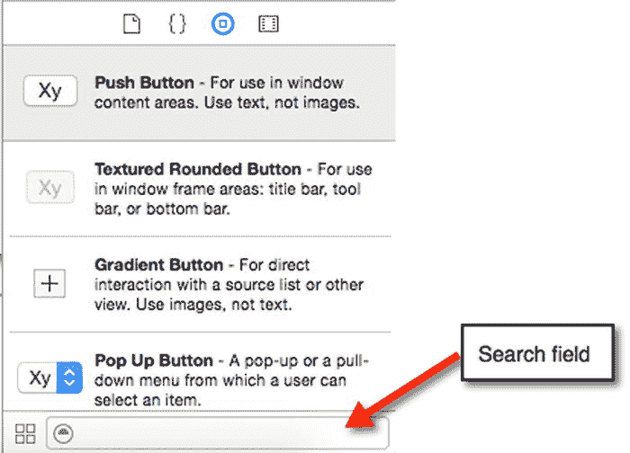

图 13-1.

搜索字段让你能够快速地在对象库中找到用户界面元素

要了解如何搜索对象库，请按照以下步骤操作：

1.  在 Xcode 中，选择 文件 ➤ 新建 ➤ 项目。
2.  在 OS X 分类下点击 应用程序。
3.  点击 Cocoa 应用程序，然后点击 下一步 按钮。Xcode 现在会要求你输入产品名称。
4.  点击 产品名称 文本字段，输入 `UIProgram`。
5.  确保 语言 弹出菜单显示为 Swift，并且没有勾选任何复选框。注意，此时你可以通过选择“使用故事板”复选框来选择使用故事板，如图 13-2 所示。暂时保持“使用故事板”复选框未选中状态。
6.  点击 下一步 按钮。Xcode 会询问你希望将项目存储在哪里。
7.  选择一个文件夹来存储你的项目，然后点击 创建 按钮。
8.  在项目导航器中点击 `MainMenu.xib` 文件。程序的用户界面将会显示出来。
9.  点击 UIProgram 图标，如图 13-3 所示，以显示程序用户界面的窗口。
10. 选择 视图 ➤ 实用工具 ➤ 显示对象库。对象库会出现在 Xcode 窗口的右下角。
11. 在对象库中上下滚动。注意你可以添加到用户界面中的各种不同元素的名称和种类。
12. 点击对象库底部的搜索字段，输入 `text`。注意，对象库现在只显示名称或描述中包含“text”的元素，如图 13-4 所示。
13. 点击对象库底部的搜索字段，然后点击关闭图标（搜索字段最右侧灰色圆圈内的 X）来清除搜索字段。
14. 输入 `button`。注意，对象库现在只显示名称或描述中包含“button”的元素。如果你知道自己想要元素的全部或部分名称或用途，在对象库中搜索它比在冗长的所有可用用户界面元素列表中滚动要快得多。

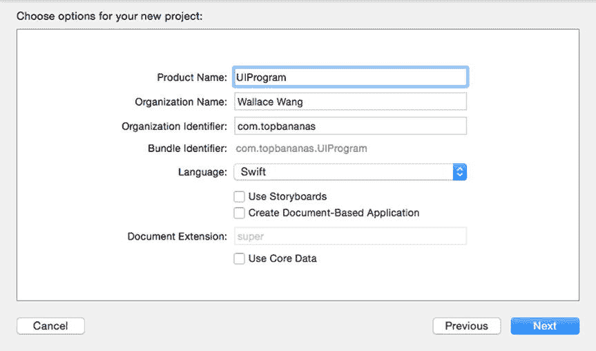

图 13-2.

创建新项目时，你可以选择为你的用户界面使用故事板

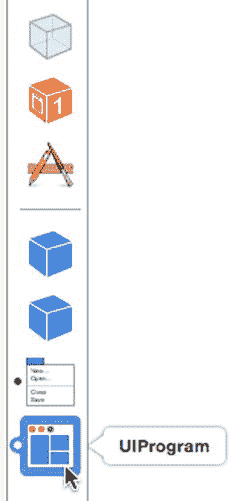

图 13-3.

UIProgram 图标代表你的用户界面窗口

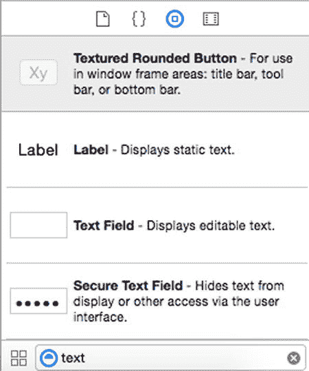

图 13-4.

在对象库中搜索“text”

### 显示和接受文本的用户界面项

虽然对象库中包含大量可用于用户界面的项，但大多数项可按功能分类。请记住，用户界面具有三项功能：

- 向用户显示信息
- 接受用户输入的数据
- 允许用户控制程序

在用户界面上显示信息的最简单方式是通过标签。在 Cocoa 框架中，标签基于 `NSTextField` 类。本质上，标签是一种不可编辑的文本字段。要识别对象库中任何项的类，只需点击该项，便会弹出一个窗口，描述该项的用途及其所基于的类，如图 13-5 所示。

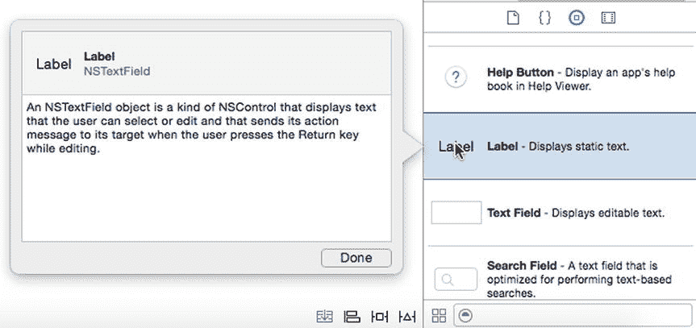

图 13-5. 在对象库中识别用户界面项的类

任何基于 `NSTextField` 的用户界面项都可用于显示和接受文本，尽管更常见的做法是使用标签显示文本，而使用其他类型的文本字段让用户输入文本。基于 `NSTextField` 的用户界面项列表如图 13-6 所示：

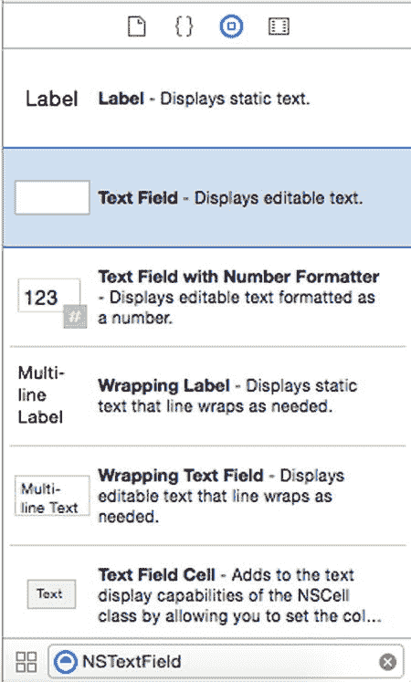

图 13-6. 基于 `NSTextField` 类的用户界面项

- **标签** – 显示文本，但不允许用户输入或编辑文本。
- **文本字段** – 允许用户输入和编辑文本。
- **安全文本字段** – 使用字符掩盖输入的文本，例如隐藏输入的密码。
- **带数字格式器的文本字段** – 让用户轻松输入和编辑格式化数字。
- **自动换行标签** – 在多行上显示文本。
- **自动换行文本字段** – 允许用户输入和编辑显示在多行上的文本。

### 限制选项的用户界面项

让用户在文本字段中输入数据提供了最大的灵活性。然而，这种灵活性也意味着程序无法预知用户可能输入何种数据。如果程序期望用户输入年龄数字，但用户输入了“forty-nine”，程序很可能崩溃，因为它期望的是数字，却收到了单词。

更糟的是，程序可能要求输入某人的年龄，而用户可能输入负数或高得离谱的数字，如 239，这显然不可能是人的年龄。为确保用户输入正确的数据，可以使用多种不同的用户界面项，让用户从有效选项范围内选择。显示文本（包括数字）选项的用户界面项包括：

- **弹出按钮** (`NSPopUpButton`) – 显示一个包含有效选项的菜单。
- **单选按钮组** (`NSMatrix`) – 显示一组单选按钮，在任意时刻只能选中一个。
- **复选框** (`NSButton`) – 显示一个或多个复选框，让用户选择多个选项。
- **组合框** (`NSComboBox`) – 功能类似于组合了文本字段和弹出按钮的控件，用户既可以输入文本，也可以从有效选项列表中选择。

允许用户选择有效数值范围选项的用户界面项包括：

- **日期选择器** (`NSDataPicker`) – 让用户选择日期，包括日、月、年。
- **水平/垂直/圆形滑块** (`NSSlider`) – 让用户拖动滑块，以选择固定范围内的有效数值。
- **步进器** (`NSStepper`) – 以固定增量增减数值。

对于文本选项，你需要列出所有用户可选择的合法选项。对于数值选项，你只需列出一个有效值的范围，例如让用户选择 1 到 100 之间的数字。

### 接受命令的用户界面项

最常见的用户界面项是接受命令的项，以便用户控制程序。两种最常见的接受命令的用户界面项是按钮和菜单。每个按钮或菜单项代表一条单独的命令，因此当用户点击按钮或菜单项时，该命令会指示程序执行相应操作。

按钮和菜单项都允许视图通过一种称为目标-动作（target-action）的机制与控制器通信，如图 13-7 所示。目标是按钮或菜单项，它会触发控制器中的动作，例如运行一个 `IBAction` 方法。

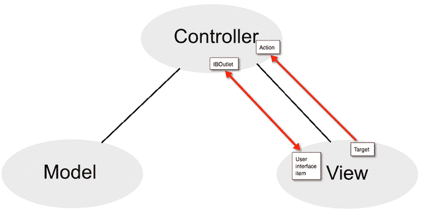

图 13-7. 按钮和菜单项允许视图与控制器通信

用户界面按钮基于 `NSButton` 类。菜单项基于 `NSMenuItem` 类。对象库中显示了多种不同类型的按钮和菜单项，但它们的工作方式都相同，即按钮或菜单项代表一条命令。要使该命令生效，需要将用户界面上的按钮连接到 Swift 文件中的 `IBAction` 方法。

### 分组项的用户界面项

有一类用户界面项仅用于对用户界面上的其他项进行分组和组织，例如在相关按钮或文本周围显示一个框。这类用户界面项更具装饰性，因此你可能不需要使用 `IBOutlets` 或 `IBAction` 方法将它们连接到 Swift 代码。一些用于分组和组织其他用户界面项的项示例如下：

- **表格视图** (`NSTableView`) – 以行形式显示数据。
- **集合视图** (`NSCollectionView`) – 以行和列形式显示数据。
- **框** (`NSBox`) – 显示一个在相关项周围绘制边框的盒子。
- **标签视图** (`NSTabView`) – 显示两个或多个标签，这些标签可以更改框内显示的数据，如图 13-8 所示。

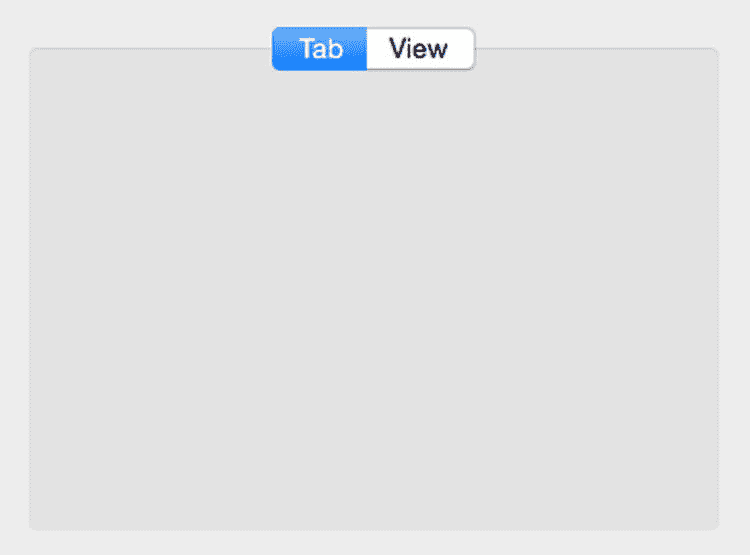

图 13-8. 标签视图可以在同一个框中对两组或多组相关项进行分组

- **窗口** (`NSWindow`) – 显示一个可以容纳其他用户界面项的窗口。
- **工具栏** (`NSToolbar`) – 显示代表命令的图标。

尽管对象库中包含许多其他项，但它们通常属于以下四类之一：

- 显示或接受文本的项。
- 让用户在有限的有效选项范围内选择的项。
- 让用户选择命令以控制程序的项。
- 对其他用户界面项进行分组或组织的项。

## 在自动布局中使用约束

无论你在用户界面上放置何种类型的项，都需要考虑用户调整窗口大小时会发生什么。窗口太大可能会在用户界面上留下过多空白区域。窗口太小则可能截断项目，如图 13-9 所示。

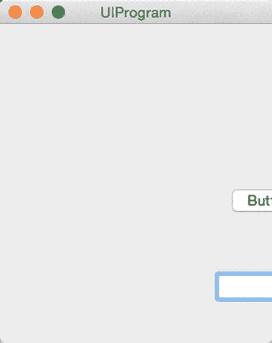

图 13-9. 用户调整窗口大小时不适应的用户界面存在截断项目的风险

有两种方法可以确保用户界面在用户调整窗口大小时保持可用。首先，你可以为窗口定义最小和最大尺寸，以防止窗口过度缩小或扩大。其次，你可以对单个项目设置约束，定义相邻项目之间以及项目与窗口边缘之间的距离。

在大多数情况下，你可以同时使用这两种方法。这样，你既可以定义窗口的最小和最大尺寸，也可以定义用户界面上的项目应如何适应窗口大小的变化。

### 定义窗口尺寸

窗口在屏幕上显示程序的用户界面。`Xcode` 允许你为窗口定义以下内容，如图 13-10 所示：

-   窗口的初始尺寸。
-   窗口的最小尺寸。
-   窗口的最大尺寸。
-   窗口在屏幕上的初始位置。

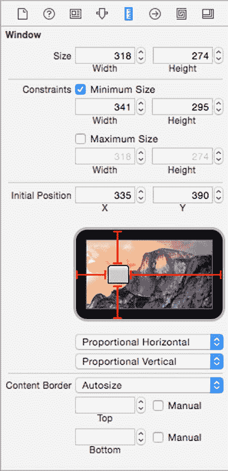

*图 13-10.* `尺寸检查器` 可让你定义窗口的尺寸

要在 `Xcode` 中定义 `.xib` 文件的窗口尺寸，请按以下步骤操作：

1.  在 `项目导航器` 窗格中点击 `.xib` 文件。`Xcode` 会显示该 `.xib` 文件中存储的用户界面。
2.  如有必要，请点击左下角出现的 `隐藏文档大纲` 图标，如图 13-11 所示。

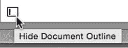

*图 13-11.* `隐藏文档大纲` 图标

3.  点击代表用户界面窗口的底部图标，如图 13-12 所示。

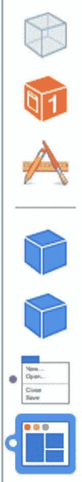

*图 13-12.* 底部图标代表你的用户界面窗口

4.  选择 `View ➤ Utilities ➤ Show Size Inspector`。`尺寸检查器` 窗格就会出现（参见图 13-10）。

存储在 `.storyboard` 文件中的窗口与 `.xib` 文件的窗口略有不同。要在 `Xcode` 中定义 `.storyboard` 文件的窗口尺寸，请按以下步骤操作：

1.  在 `项目导航器` 窗格中点击 `.storyboard` 文件。`Xcode` 会显示该 `.storyboard` 文件中存储的用户界面。
2.  点击要修改的窗口的 `视图控制器`，如图 13-13 所示。

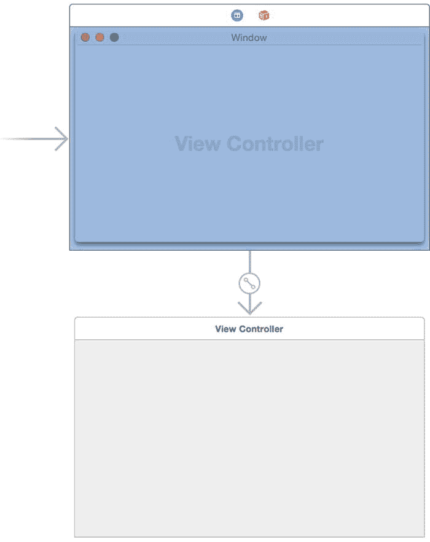

*图 13-13.* `视图控制器` 定义了你的用户界面窗口

3.  选择 `View ➤ Utilities ➤ Show Size Inspector`。`尺寸检查器` 窗格就会出现（参见图 13-10）。

`Xcode` 提供了两种更改窗口尺寸的方法。首先，你可以使用鼠标拖动窗口（或视图控制器）的边或角。其次，你可以点击 `尺寸` 标签旁边的 `宽度` 和 `高度` 文本字段，为窗口的宽度和高度选择精确的尺寸，如图 13-14 所示。

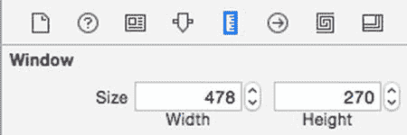

*图 13-14.* `视图控制器` 定义了你的用户界面窗口

定义窗口的最小和/或最大尺寸需要两个步骤。首先，你需要选中 `最小尺寸` 和/或 `最大尺寸` 复选框。其次，你需要输入或选择一个宽度和高度，来定义窗口的最小或最大尺寸，如图 13-15 所示。

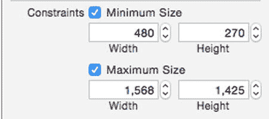

*图 13-15.* 定义窗口的最小和最大尺寸

最后，你可以定义窗口首次出现时的初始位置。你可以通过拖动模拟屏幕上的窗口图标，或者在 `初始位置` 文本字段中输入 `X` 和 `Y` 值来实现，如图 13-16 所示。

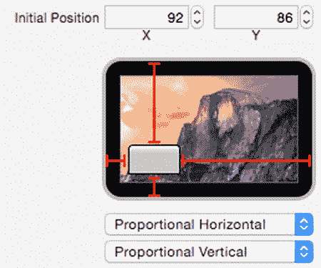

*图 13-16.* 定义窗口的初始位置

模拟屏幕下方的两个弹出菜单让你可以定义如何确定窗口的初始位置：

- **从左侧/右侧固定** – 定义窗口边缘与屏幕边缘之间的固定值
- **水平/垂直比例** – 根据屏幕大小，定义窗口边缘与屏幕边缘之间的比例值
- **水平/垂直居中** – 定义窗口出现在屏幕中央

为了了解如何指定窗口的位置及最小/最大尺寸，我们来创建一个简单的程序并修改其窗口。

在 `Xcode` 内部，选择 `File ➤ New ➤ Project`。  
点击 `OS X` 类别下的 `Application`。  
点击 `Cocoa Application`，然后点击 `Next` 按钮。`Xcode` 现在会要求输入产品名称。  
点击 `Product Name` 文本字段，输入 `WindowProgram`。  
确保 `Language` 弹出菜单显示为 `Swift`，并且没有选中任何复选框。  
点击 `Next` 按钮。`Xcode` 会询问你想将项目存储在何处。  
选择一个文件夹来存储你的项目，然后点击 `Create` 按钮。  
在 `项目导航器` 中点击 `MainMenu.xib` 文件。  
点击 `WindowProgram` 图标，使用户界面的窗口显示出来。  
选择 `View ➤ Utilities ➤ Show Size Inspector`。`尺寸检查器` 窗格就会出现。  
点击 `最小内容尺寸` 复选框。`Xcode` 会显示窗口当前的宽度和高度，因此保留这些值。  
点击 `最大内容尺寸` 复选框，并将 `宽度` 和 `高度` 文本字段更改为 `600`。  
将 `初始位置` 类别中的灰色窗口矩形拖到最右下角。`尺寸检查器` 窗格应该如图 13-17 所示。

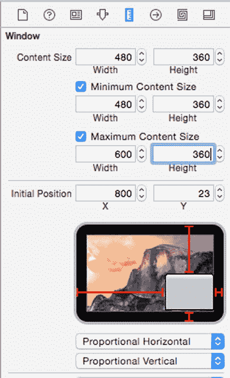

*图 13-17.* 指定窗口的最小、最大和初始位置

选择 `Product ➤ Run`。注意，程序的窗口出现在右下角，因为你在那里定义了它的初始位置。  
将鼠标指针移到窗口的左边缘，按住鼠标左键，然后左右拖动鼠标。请注意，你只能将窗口加宽和缩小到固定尺寸。这是因为你同时定义了窗口的最小和最大尺寸。  
选择 `WindowProgram ➤ Quit WindowProgram`。

### 对用户界面项施加约束

为窗口定义最小尺寸可以防止用户将窗口缩得太小，以至于切断了显示在用户界面上的项目。但是，如果用户放大了窗口会发生什么呢？理想情况下，窗口内的项目应该调整它们的位置以适应放大后的窗口尺寸。

`Constraints`（约束）定义了两个项目之间的距离，例如按钮与窗口边缘之间，或者两个按钮之间。Xcode 提供了三种方式来对用户界面项施加约束：

*   按住 Control 键并从用户界面项拖拽到另一个项目或窗口边缘
*   选择 Editor（编辑器）➤ Pin（固定）或 Resolve Auto Layout Issues（解决自动布局问题）
*   点击右下角的 Pin（固定）或 Resolve Auto Layout Issues（解决自动布局问题）图标，如下图所示 13-18

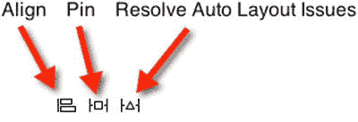

图 13-18. Align（对齐）、Pin（固定）和 Resolve Auto Layout Issues（解决自动布局问题）图标

要使用 Control-拖拽方式来放置约束，请遵循以下步骤：

将鼠标指针移到你想要约束的用户界面项上。按住 Control 键，并向另一个用户界面项或窗口边缘方向拖拽鼠标。当鼠标指针出现在另一个用户界面项或窗口边缘附近时，松开 Control 键和鼠标按钮。此时会弹出一个窗口，如图 13-19 所示。

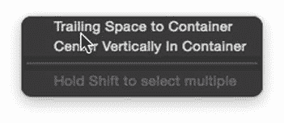

图 13-19. 松开 Control 键和鼠标会显示一个弹出窗口

根据你 Control-拖拽鼠标的方向，弹出窗口中将显示不同的选项。

| 朝向窗口边缘的方向 | 约束选项 |
| --- | --- |
| 向上 | 容器顶部间距 |
| 向下 | 容器底部间距 |
| 向右 | 容器尾部间距 |
| 向左 | 容器前导间距 |

除了 Control-拖拽到窗口边缘，你还可以从一个用户界面项 Control-拖拽到另一个用户界面项上。这样做可以让你定义用户界面上两个项目之间的距离，例如两个按钮之间，或一个按钮与一个文本字段之间的距离。

当你将鼠标 Control-拖拽到另一个用户界面项上时，会弹出一个窗口。如果你定义的是两个并排项目之间的距离，弹出窗口将显示 Horizontal Spacing（水平间距）选项。如果你定义的是两个上下堆叠项目之间的距离，弹出窗口将显示 Vertical Spacing（垂直间距）选项。

| 朝向另一项的方向 | 约束选项 |
| --- | --- |
| 左/右 | 水平间距 |
| 上/下 | 垂直间距 |

Control-拖拽方法可以让你直观地在不同的用户界面项上放置约束。另一种定义约束的方法是点击你想要约束的用户界面项，然后点击 Pin（固定）图标以显示弹出窗口。要通过 Pin 图标定义约束，请遵循以下步骤：

点击你想要约束的用户界面项。点击 Pin（固定）图标。此时会出现一个弹出窗口，显示上、下、左、右四个方向的约束，如图 13-20 所示。

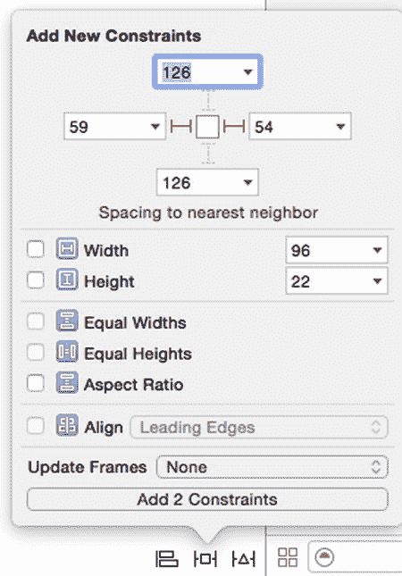

图 13-20. Pin（固定）图标显示了一个包含约束的弹出窗口

点击一个约束以将其选中（在图 13-20 中，左边和右边的约束被选中，因此显示为红色，但上边和下边的约束未选中，所以显示为虚线）。勾选任何额外的复选框。点击弹出窗口底部的 Add X Constraints（添加 X 个约束）按钮以定义约束。

Pin（固定）弹出窗口允许你为所选用户界面项定义其他类型的约束：

*   Width（宽度）或 Height（高度）—— 这将使所选用户界面项保持固定尺寸
*   Equal Widths（等宽）或 Heights（等高）—— 这使两个或多个所选用户界面项保持相同的固定尺寸
*   Aspect Ratio（宽高比）—— 如果所选用户界面项被调整大小，这将保持其宽高比正确
*   Align（对齐）—— 这将对齐两个或多个所选用户界面项

第三种定义约束的方法是让 Xcode 为你选择约束。这可以让你快速添加约束，但存在 Xcode 可能无法正确定义约束的风险。幸运的是，你之后始终可以编辑约束。

要让 Xcode 选择约束，请遵循以下步骤：

点击你想要约束的用户界面项。点击 Resolve Auto Layout Issues（解决自动布局问题）图标以显示弹出窗口，如图 13-21 所示（或选择 Editor（编辑器）➤ Resolve Auto Layout Issues（解决自动布局问题））。

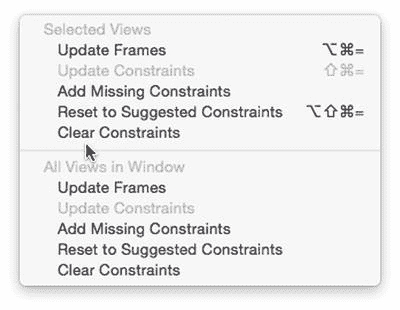

图 13-21. Resolve Auto Layout Issues（解决自动布局问题）弹出窗口

选择 Add Missing Constraints（添加缺失约束）或 Reset to Suggested Constraints（重置为建议约束）。

如果你选择窗口上半部分的选项，将只影响所选的用户界面项。如果你选择窗口下半部分的选项，则无论你是否选择了它们，都将影响当前显示窗口上的所有用户界面项。

请记住，添加约束可能是一个反复试验的过程：先定义一个约束，观察其效果，然后修改或完全删除它。当你添加约束时，Xcode 会在你的用户界面项周围显示约束线。如果 Xcode 认为约束不足，该项上的所有约束将显示为橙色。一旦 Xcode 认为你对某个项施加了足够的约束，约束将显示为蓝色。

要查看约束如何与用户界面项配合使用，请遵循以下步骤：

确保你的 WindowProgram 项目已加载到 Xcode 中。在 Project Navigator（项目导航器）窗格中点击 MainMenu.xib。点击 Window（窗口）图标以使用户界面窗口可见。选择 View（视图）➤ Utilities（实用工具）➤ Show Object Library（显示对象库）。对象库会出现在 Xcode 窗口的右下角。从对象库中拖拽一个 Push Button（按钮）项，并将其放在窗口的任何位置。将鼠标指针移到刚刚放在窗口上的按钮上。按住 Control 键，并向右拖拽鼠标，直到整个窗口变为蓝色。然后松开 Control 键和鼠标。此时会弹出一个菜单（见图 13-19）。选择 Trailing Space to Container（容器尾部间距）。Xcode 会在窗口边缘和按钮的右边缘之间显示一条约束，如图 13-22 所示。

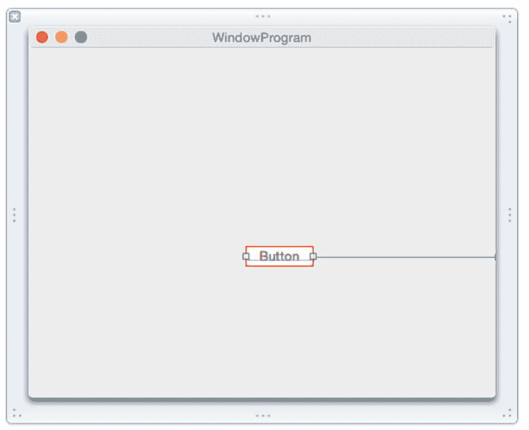

图 13-22. 将约束连接到窗口边缘

选择 Product（产品）➤ Run（运行）。你的窗口会出现在你之前定义的初始位置。将窗口移到屏幕中央，并调整其右边缘。请注意，当你调整窗口右边缘时，按钮会同时移动其位置。选择 WindowProgram（窗口程序）➤ Quit WindowProgram（退出窗口程序）。

### 编辑约束

一旦定义了一个或多个约束，您可以随时删除或编辑现有约束。要删除约束，您有几种选择：

-   点击该约束，然后按下 `Delete` 或 `Backspace` 键。
-   点击包含该约束的用户界面项，打开尺寸检查器面板，然后点击该约束并按下 `Delete` 或 `Backspace` 键。

您也可以从单个用户界面项或当前显示的用户界面中的所有项上删除或清除所有约束。为此，您有两个选项：

-   选择 `Editor ➤ Resolve Auto Layout Issues`（编辑器 ➤ 解决自动布局问题）。
-   点击窗口右下角的 `Resolve Auto Layout Issues`（解决自动布局问题）图标。

选择任一选项后，您将看到一个分为上半部分和下半部分的菜单，如图 13-23 所示。点击上半部分的 `Clear Constraints`（清除约束）只会清除当前选中项的约束。点击下半部分的 `Clear Constraints`（清除约束）会清除当前显示的用户界面中所有项的约束，无论您是否选中它们。

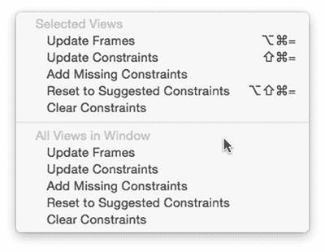

*图 13-23. 一个弹出窗口允许您修改约束。*

除了删除约束，您还可以编辑它。编辑可以让您修改其行为方式。您可以修改一个约束的三个值包括：

-   `Constant`（常量） – 一个定义约束值的固定值。
-   `Priority`（优先级） – 一个决定哪些约束必须首先被遵循的数值。
-   `Modifier`（修饰符） – 一个定义影响两个值的比率的数值，例如一个项的高度与宽度之比，或一个项的宽度与第二个项的宽度之比。

要编辑一个约束，请遵循以下步骤：

1.  点击包含您要编辑的约束的用户界面项。
2.  选择 `View ➤ Utilities ➤ Show Size Inspector`（视图 ➤ 工具 ➤ 显示尺寸检查器）。`Size Inspector`（尺寸检查器）面板会列出所有已定义的约束，如图 13-24 所示。

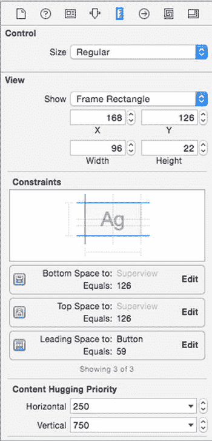

*图 13-24. 在尺寸检查器面板中查看已定义约束的列表。*

3.  点击您要修改的约束最右侧的 `Edit`（编辑）按钮。将出现一个弹出窗口，如图 13-25 所示。

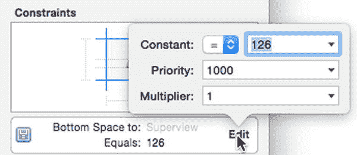

*图 13-25. 一个弹出窗口允许您修改约束。*

请注意，在 `Constant:`（常量：）标签的右侧，有一个显示等号（`=`）的弹出菜单。如果您点击此弹出菜单，可以选择大于或等于（`>=`）、小于或等于（`<=`）或等于（`=`）。

更右边是 `Constant:`（常量：）标签，其下方是一个显示数字的下拉字段。如果您点击向下箭头，您将能够在三个选项之间进行选择：

-   您可以输入或编辑的数值。
-   `Use Standard Value`（使用标准值） – 让 Xcode 决定最佳值。
-   `Use Canvas Value`（使用画布值） – 使用屏幕上的当前距离来定义一个固定值。

请记住，固定值或 `Canvas Value`（画布值）在不同尺寸的显示器上可能表现不同。您可能需要反复尝试，才能为您的特定用户界面找到合适的值。

优先级用于解决两个或多个可能相互矛盾的约束之间的冲突，例如，一个约束将一个按钮固定到窗口的右边缘，第二个约束将同一个按钮固定到窗口的左边缘，而第三个约束则将该按钮保持为固定宽度。通过修改优先级，您可以确保您的约束不会冲突。

找到正确的约束组合有时可能既繁琐又令人沮丧。为了简化设置约束的过程，Xcode 提供了两种为您定义约束的方法：

-   `Add Missing Constraints`（添加缺失的约束） – 保留您已定义的所有现有约束，并添加 Xcode 认为您缺失的新约束。
-   `Reset to Suggested Constraints`（重置为建议的约束） – 删除您可能为某个项设置的所有约束，并用其自身的约束替换。

当您首次定义约束时，Xcode 会以橙色显示它们，以告知您没有足够的约束来定义用户界面上某个项的位置。一旦您定义了足够的约束来指定位置，Xcode 就会以蓝色显示约束。

如果您定义了约束，您可能会看到一条橙色的虚线，它代表了您当前选中项的轮廓。这条虚线是一个框架，显示了当您实际运行程序时该项将出现的位置。

要将某个项移动到其正确位置，您需要选择 `Editor ➤ Resolve Auto Layout Issues ➤ Update Frames`（编辑器 ➤ 解决自动布局问题 ➤ 更新框架），或者点击 Xcode 窗口右下角的 `Resolve Auto Layout Issues`（解决自动布局问题）图标并选择 `Update Frames`（更新框架）（参见图 13-23）。

要了解 Xcode 如何自动定义约束，请遵循以下步骤：

1.  确保您的 `WindowProgram` 项目已在 Xcode 中加载。
2.  在项目导航器面板中点击 `MainMenu.xib`。
3.  点击 `Window`（窗口）图标以使用户界面窗口可见。
4.  点击程序窗口上的 `Push Button`（按钮）以选中该按钮。
5.  选择 `Editor ➤ Resolve Auto Layout Issues`（编辑器 ➤ 解决自动布局问题）。将出现一个弹出菜单（参见图 13-23）。
6.  选择菜单上半部分的 `Clear Constraints`（清除约束）。（菜单的上半部分仅影响选中的项，即该按钮。菜单的下半部分影响窗口上的所有项。在这种情况下，唯一的项就是该按钮，因此您实际上可以选择菜单上半部分或下半部分的 `Clear Constraints`（清除约束）。）Xcode 会从按钮上移除该约束。
7.  选择 `Editor ➤ Resolve Auto Layout Issues`（编辑器 ➤ 解决自动布局问题）。将出现一个弹出菜单（参见图 13-23）。
8.  选择菜单上半部分的 `Add Missing Constraints`（添加缺失的约束）。Xcode 会添加它认为该按钮所需的约束，如图 13-26 所示。

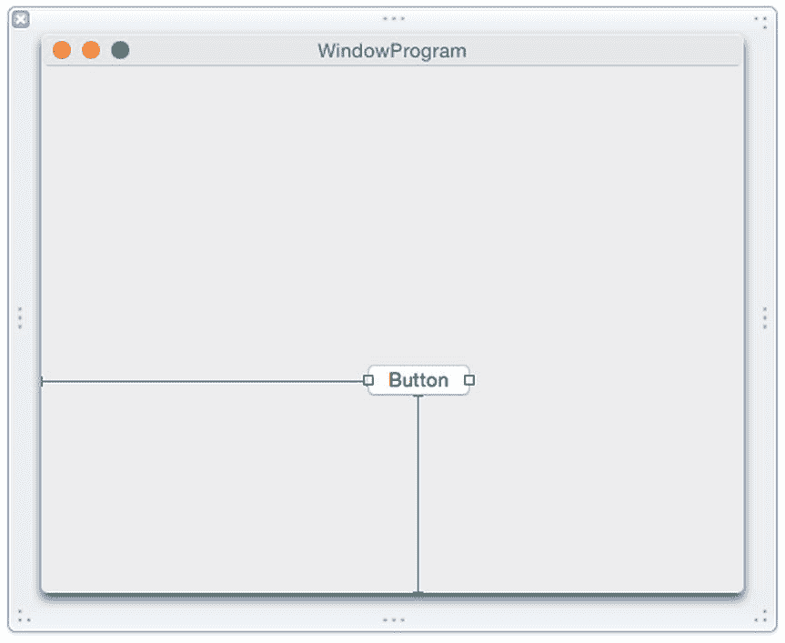

*图 13-26. Xcode 自动添加所有必要的约束。*

9.  选择 `Product ➤ Run`（产品 ➤ 运行）。您的窗口将出现在您之前定义的初始位置。
10. 将窗口移动到屏幕中央并调整左边缘的大小。请注意，当您调整窗口左边缘的大小时，按钮会同时移动其位置。
11. 选择 `WindowProgram ➤ Quit WindowProgram`（WindowProgram ➤ 退出 WindowProgram）。

## 在 OS X 程序中定义约束

要充分理解约束的工作原理，你需要观察它们在实际程序中的应用。这样才能看到用户界面在每次调整窗口大小时是如何适配的。在这个示例程序中，我们将为按钮和文本字段定义关系约束，同时为图片定义宽高比约束。

本章前面部分，你已经创建了一个名为 `UIProgram` 的 OS X 项目，我们将利用它来观察约束的实际效果：

确保你的 `UIProgram` 项目已在 `Xcode` 中加载。点击项目导航器中的 `MainMenu.xib` 文件。点击 `UIProgram` 图标，调出用户界面的窗口。选择**视图** ➤ **工具** ➤ **显示对象库**，使对象库显示在 Xcode 窗口的右下角。向用户界面拖入一个按钮、一个文本字段和一个文本视图，使其外观与图 13-27 相似。

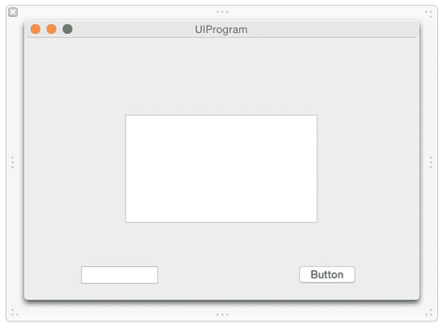

图 13-27.

`InheritProgram` 的用户界面

虽然这个用户界面目前看起来还可以，但一旦用户调整窗口大小，它就会变得很难看。选择**产品** ➤ **运行**，然后调整窗口大小，观察窗口缩小时如何裁剪或隐藏用户界面上的元素。现在扩大窗口大小，注意扩大后窗口内出现的空白区域。选择 **UIProgram** ➤ **退出 UIProgram**，退出程序。

首先，我们来定义窗口的最小尺寸，步骤如下：

将鼠标指针移到用户界面窗口四周框架的右下角。拖动鼠标，直到出现蓝色参考线，显示按钮与窗口边缘之间的边界，如图 13-28 所示。

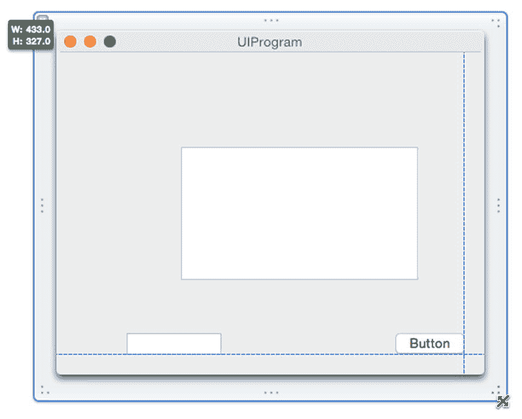

图 13-28.

调整用户界面窗口的尺寸 点击用户界面窗口周围的框架，选择**视图** ➤ **工具** ➤ **显示尺寸检查器**，显示窗口约束（见图 13-16）。勾选**最小尺寸**复选框，将当前窗口尺寸定义为最小尺寸。选择**产品** ➤ **运行**。调整用户界面窗口大小。注意，你只能将窗口缩小到一定尺寸。选择 **UIProgram** ➤ **退出 UIProgram** 退出程序。

通过定义最小窗口尺寸，你已防止了用户将窗口缩得太小时用户界面被裁剪或元素消失的情况。现在让我们添加约束，使窗口放大时用户界面能够自适应调整。

将鼠标指针移到按钮上，按住 **Control** 键，向右拖动鼠标，在接近窗口右边缘前停下，如图 13-29 所示。

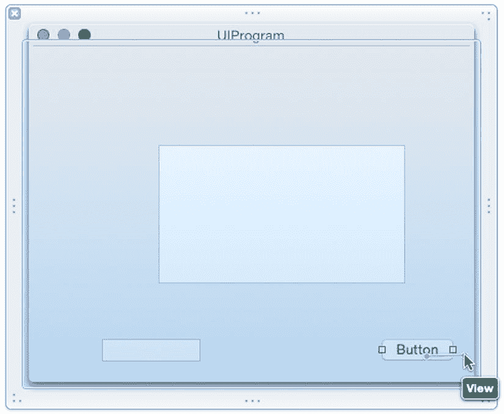

图 13-29.

调整用户界面窗口的尺寸 松开 **Control** 键和鼠标。出现一个弹出式窗口。选择**尾随空间到容器**。注意，约束以橙色显示，表明按钮上的约束还不够。将鼠标指针移到按钮上，按住 **Control** 键，向下拖动鼠标，在接近窗口底边前停下。松开 **Control** 键和鼠标。出现一个弹出式窗口。选择**底部空间到容器**。点击文本字段将其选中。选择**编辑器** ➤ **解决自动布局问题** ➤ **添加缺失约束**。Xcode 会自动添加约束，如图 13-30 所示。

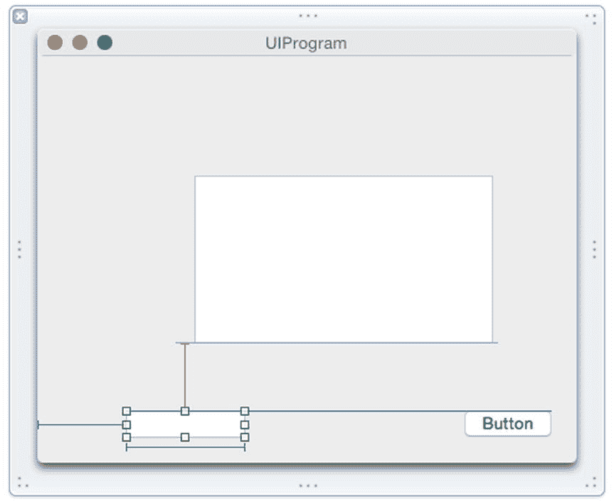

图 13-30.

文本字段上的约束 将鼠标指针移到文本视图上的任意位置。按住 **Control** 键，以 45 度角向上或向下拖动鼠标，如图 13-31 所示。

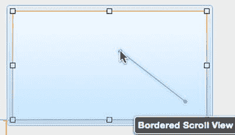

图 13-31.

定义宽高比约束 松开 **Control** 键和鼠标。出现一个弹出式窗口。选择**宽高比**，以保持宽度和高度的比例。Xcode 会在文本视图周围显示橙色约束，表明文本视图上的约束不够。点击右下角的**解决自动布局问题**图标，选择**添加缺失约束**。Xcode 会添加缺失的约束，此时它们显示为蓝色。选择**产品** ➤ **运行**。调整窗口大小。注意用户界面元素在窗口放大时是如何调整的。如你所见，无论用户如何调整窗口大小，约束都能将用户界面元素保持在适当的位置和尺寸。你可以随意尝试编辑约束，了解它们的工作方式。选择 **UIProgram** ➤ **退出 UIProgram** 退出程序。

## 摘要

程序的用户界面决定了用户与程序的交互方式。每个用户界面都需要显示信息、从用户处获取信息，并允许用户选择命令。理想情况下，用户界面应更侧重于使用程序，而非理解其工作原理。

`对象库` 列出了所有可以添加到用户界面的元素，无论你使用的是 `.xib` 文件还是 `.storyboard` 文件。为了帮助你快速找到 `对象库` 中的元素，你可以在 `对象库` 底部的搜索字段中输入完整的或部分单词进行搜索。

约束可以帮助你的用户界面在用户调整程序窗口大小时始终保持美观。两种基本的约束类型如下：

*   **关系约束**：定义相邻元素之间的距离，例如两个按钮之间，或按钮与窗口边缘之间的距离。
*   **尺寸约束**：定义元素的高度、宽度或宽高比。

你可以自行定义约束、让 Xcode 定义约束，或两者结合使用。定义约束可能是一个反复试验的过程，直到你的用户界面能以你期望的方式适应窗口大小的调整。

