# 使用视图和故事板

电子补充材料 本章在线版本 (doi:[10.​1007/​978-1-4842-1233-2_​14](http://dx.doi.org/10.1007/978-1-4842-1233-2_14)) 包含补充材料，仅限授权用户使用。

每个程序用户界面中最常见的部分是一个窗口，其中显示按钮和文本字段等元素。在 Xcode 中，窗口被称为 `视图`。除了最简单的程序外，大多数程序的用户界面可能包含两个或更多的窗口或视图。这意味着你的程序需要知道如何打开额外的窗口以及如何关闭它们。

创建和存储视图的两种方式是使用 `.xib` 文件和 `.storyboard` 文件。一个 `.xib` 文件包含一个视图，因此如果需要显示多个视图，你需要创建多个 `.xib` 文件。一个 `.storyboard` 文件可以包含一个或多个视图。

你可以使用 `.xib` 文件、`.storyboard` 文件，或两者的组合来创建用户界面。通常，`.storyboard` 文件最适合逻辑上相互关联的窗口。`.storyboard` 文件的最大优势在于，它能以逻辑顺序将多个视图连接起来。`.storyboard` 文件的最大劣势在于，如果你的程序中有多个视图，可能并不存在一个严格的逻辑顺序来按特定次序显示不同视图。在这种情况下，`.storyboard` 文件可能会显得杂乱且难以组织。

与了解如何设计一个良好的用户界面相比，使用 `.xib` 文件还是 `.storyboard` 文件并不那么重要——良好的用户界面应能使用户尽可能轻松地完成任务。


## 创建用户界面文件

当你创建一个项目时，`Xcode` 会提供选择是否使用故事板的选项，如图 14-1 所示。如果你选择不使用故事板，那么 `Xcode` 会将你的用户界面创建并存储在一个 `.xib` 文件中。如果你选择使用故事板，那么 `Xcode` 会将你的用户界面存储在一个 `.storyboard` 文件中。

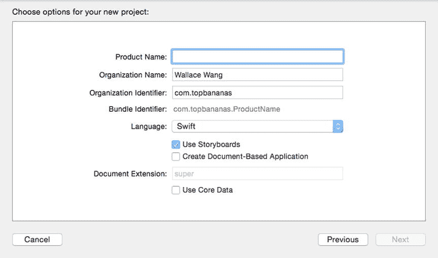

图 14-1.

创建 OS X 项目时，`Xcode` 会提供选择是否使用故事板的选项

创建项目后，无论你最初是否选择了故事板，你都可以随时添加额外的 `.xib` 或 `.storyboard` 文件。

### 添加 `.xib` 或 `.storyboard` 文件

要向项目添加 `.xib` 或 `.storyboard` 文件，请按照以下步骤操作：

点击 **下一步** 按钮。`Xcode` 会询问你希望将项目存储在何处。  
选择一个文件夹来存储你的项目，然后点击 **创建** 按钮。你的 `.xib` 或 `.storyboard` 用户界面文件会出现在 **项目导航器** 面板中。  
在 `Xcode` 中，选择 `File` ➤ `New` ➤ `File`。  
在 **OS X** 类别下点击 **User Interface**。  
点击 **Window (`.xib`)** 或 **Storyboard (`.storyboard`)**，如图 14-2 所示。

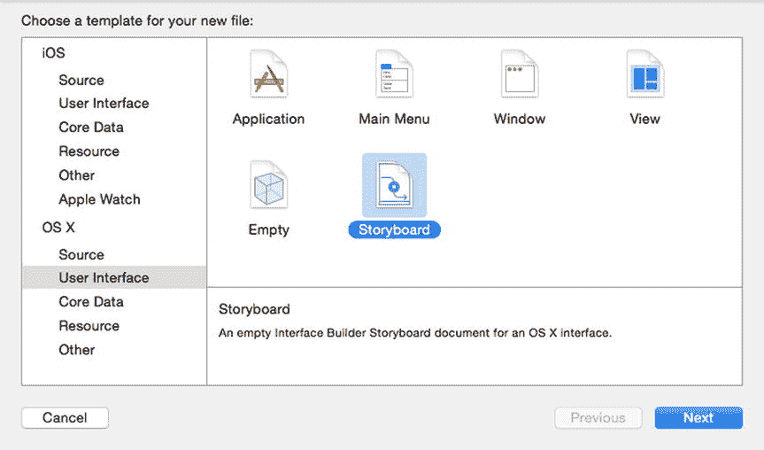

图 14-2.

向项目添加 `.xib` 或 `.storyboard` 文件

如果你使用上述步骤创建了一个 `.xib` 文件，你可能仍然需要创建一个名为视图控制器的 Swift 文件来管理视图。要同时创建一个视图控制器 Swift 文件和一个 `.xib` 文件，请按照以下步骤操作：

点击 **下一步** 按钮。`Xcode` 会询问你希望将新文件存储在何处。  
点击 **创建** 按钮。`Xcode` 会在 **项目导航器** 面板中创建一个 `.xib` 文件和一个配套的 `.swift` 文件。  
点击 **下一步** 按钮。`Xcode` 会询问类名、子类，以及你是否想创建一个配套的 `.xib` 文件。  
在 **名称** 文本字段中输入任意名称。  
点击 **Subclass of:** 弹出菜单并选择 `NSViewController`。  
选中“**Also create XIB file for user interface**”复选框，并确保 **语言** 弹出菜单显示为 `Swift`，如图 14-4 所示。

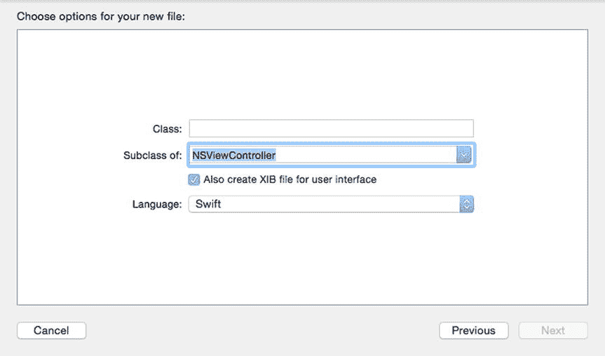

图 14-4.

定义类名、子类和 `.xib` 文件  
在 `Xcode` 中，选择 `File` ➤ `New` ➤ `File`。  
在 **OS X** 类别下点击 **Source**，然后点击 **Cocoa Class**，如图 14-3 所示。

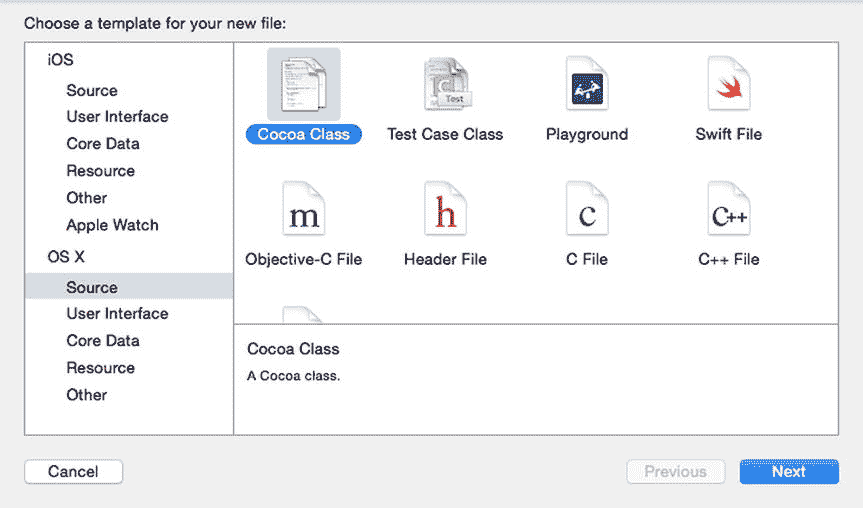

图 14-3.

在 **Source** 类别下选择 **Cocoa Class**

## 定义主用户界面

如果你的项目只包含一个单一的 `.xib` 或 `.storyboard` 文件，那么 `Xcode` 会将该文件用作程序的主用户界面。但是，如果你有多个用户界面文件（例如两个 `.xib` 或 `.storyboard` 文件，或者 `.xib` 和 `.storyboard` 文件的组合），你需要定义哪个文件应该是你的主用户界面。

要定义主用户界面文件，请按照以下步骤操作：

在 **项目导航器** 面板中，点击你在步骤 2 中选择的 `.xib` 或 `.storyboard` 文件，以便编辑主用户界面。  
点击 **项目导航器** 面板顶部的项目名称。`Xcode` 会显示一系列你可以为项目定义的设置。  
点击 **主界面** 弹出菜单，并选择你想要使用的用户界面文件（`.xib` 或 `.storyboard`），如图 14-5 所示。

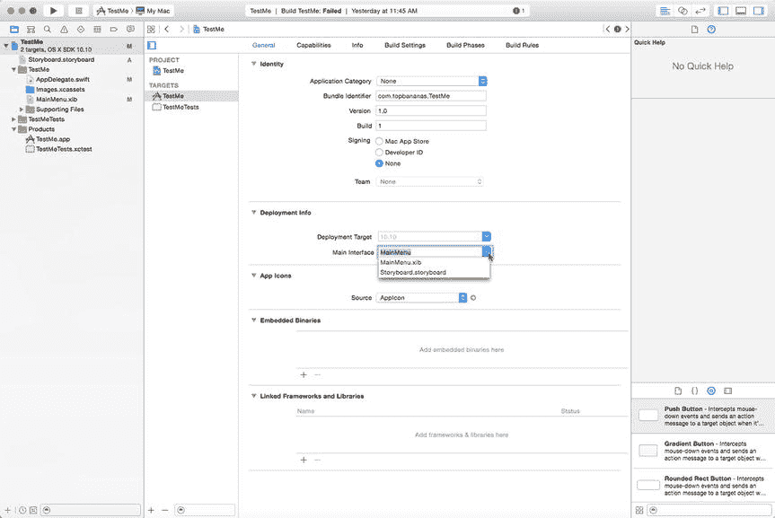

图 14-5.

为项目选择主用户界面

## 显示多个 `.xib` 文件

如果项目中有多个 `.xib` 文件，你需要指定一个 `.xib` 文件作为主用户界面。这意味着其他 `.xib` 文件在你明确让它们显示之前是不可见的。要从一个 `.xib` 文件打开另一个，你需要执行三个步骤：

- 创建一个视图控制器和 `.xib` 文件
- 创建一个对象来表示你的视图控制器
- 使用 `showWindow` 和 `close` 命令来打开 `.xib` 文件，然后将其关闭

要了解如何打开和关闭一个 `.xib` 文件，请按照以下步骤操作：

选择 `View` ➤ `Utilities` ➤ `Show Object Library`。**对象库** 会出现在 `Xcode` 窗口的右下角。  
将一个 **Push Button** 拖到你的用户界面窗口上，并将其标签修改为“**Open Window**”。  
在 `Xcode` 中，选择 `File` ➤ `New` ➤ `Project`。  
在 **OS X** 类别下点击 **Application**。  
点击 **Cocoa Application**，然后点击 **下一步** 按钮。`Xcode` 会询问产品名称。  
点击 **产品名称** 文本字段并输入 `XIBProgram`。  
确保 **语言** 弹出菜单显示为 `Swift`，并且没有选中任何复选框。  
点击 **下一步** 按钮。`Xcode` 会询问你希望将项目存储在何处。  
选择一个文件夹来存储你的项目，然后点击 **创建** 按钮。  
在 **项目导航器** 中点击 `MainMenu.xib` 文件。你的程序用户界面会出现。  
点击 `XIBProgram` 图标以显示程序用户界面的窗口。  
选择 `View` ➤ `Utilities` ➤ `Show Attributes Inspector`。**属性检查器** 面板会显示，如图 14-6 所示。**属性检查器** 为你提供了修改用户界面各个窗口外观的选项。现在，不要更改任何内容。

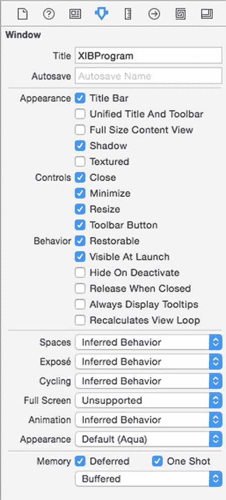

图 14-6.

**属性检查器** 面板允许你修改窗口的外观

此时，你的程序由一个 `MainMenu.xib` 文件组成，该文件显示一个带有一个按钮的单个窗口。现在，我们需要按照以下步骤创建一个视图控制器（包含 Swift 代码）和一个配套的 `.xib` 文件：

点击 **下一步** 按钮。`Xcode` 会询问你希望将文件存储在何处。  
点击 **创建** 按钮。`Xcode` 会在 **项目导航器** 面板中显示一个 `secondView.swift` 文件和一个 `secondView.xib` 文件。  
选择 `File` ➤ `New` ➤ `File`。会弹出一个模板对话框。  
在 **OS X** 类别下选择 **Source**，然后点击 **Cocoa Class**（参见图 14-3）。点击 **下一步** 按钮。会弹出另一个对话框，要求输入类名。  
在 **类名** 文本字段中输入 `secondView`。  
点击 **Subclass of:** 弹出菜单并选择 `NSWindowController`。  
选中“**Also create XIB file for user interface**”复选框。  
确保 **语言** 弹出菜单显示为 `Swift`，如图 14-7 所示。

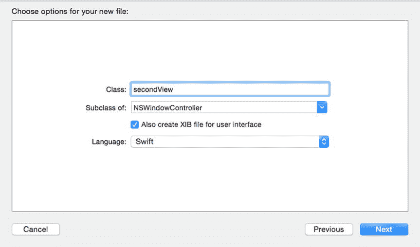

图 14-7.

定义第二个 `.xib` 文件及其视图控制器的特性

此时，你已经创建了第二个 `.xib` 文件和一个配套的视图控制器文件。现在，是时候编写 Swift 代码来让一切正常运行了，请按照以下步骤操作：

点击 **连接** 按钮。`Xcode` 会创建一个空的 `IBAction` 方法。  
在 `@IBOutlet` 行下方，输入以下内容：  
在 **项目导航器** 面板中点击 `MainMenu.xib` 文件。  
选择 `View` ➤ `Assistant Editor` ➤ `Show Assistant Editor`。`Xcode` 会在 `MainMenu.xib` 文件右侧显示 `AppDelegate.swift` 文件。  
将鼠标指针移动到 **Open Window** 按钮上，按住 **Control** 键，然后将鼠标拖到 `AppDelegate.swift` 文件中最后一个大括号上方。  
松开 **Control** 键和鼠标按钮。会弹出一个弹出窗口。  
点击 **Connection** 弹出菜单并选择 **Action**。  
点击 **名称** 文本字段并输入 `openWindow`。  
点击 **类型** 弹出菜单并选择 `NSButton`，如图 14-8 所示。


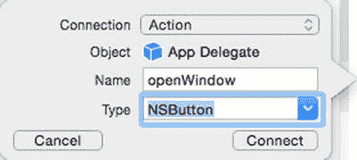

图 14-8. 为“打开窗口”按钮创建 `IBAction` 方法

`var windowController = secondView(windowNibName: "secondView")`

按如下方式修改 `IBAction` 方法：

```
@IBAction func openWindow(sender: NSButton) {
    windowController.showWindow(sender)
}
```

单击 `secondView.xib` 文件。保持助理编辑器打开，并在右侧显示 `secondView.swift` 文件。将一个“下压按钮”拖拽到 `secondView.xib` 文件的窗口中，并将此按钮标记为“返回”。将鼠标移到刚创建的“返回”按钮上，按住 Control 键，然后将鼠标拖拽到 `secondView.swift` 文件最后一个大括号的上方。松开 Control 键和鼠标。此时会弹出一个窗口。单击“连接”弹出菜单，选择“操作”。在“名称”文本框中单击，输入 `closeWindow`。在“类型”弹出菜单中单击，选择 `NSButton`。单击“连接”按钮。按如下方式修改 `IBAction` 方法 `closeWindow`：

```
@IBAction func closeWindow(sender: NSButton) {
    self.close()
}
```

单击“返回”按钮，关闭由 `secondView.xib` 文件定义的第二个窗口。选择 XIBProgram ➤ 退出 XIBProgram。选择 产品 ➤ 运行。你的程序将会出现。单击“打开窗口”按钮。第二个窗口出现，如图 14-9 所示。

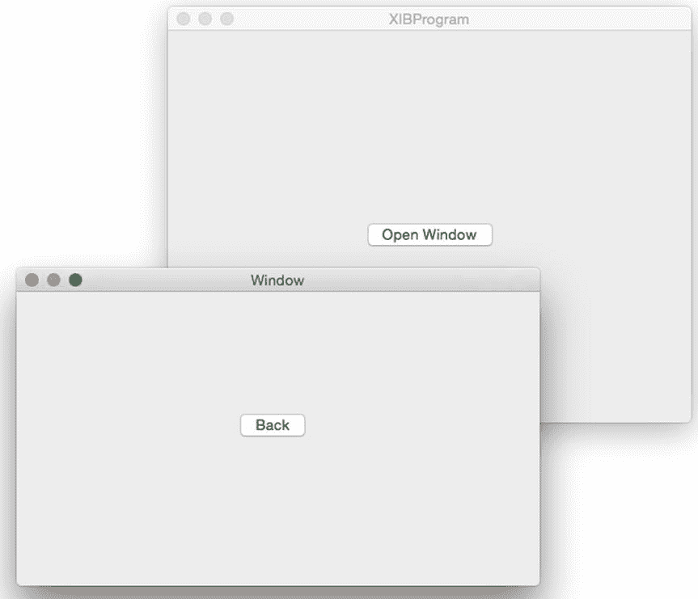

图 14-9. 运行 XIBProgram

你所做的是用视图控制器创建了第二个 `.xib` 文件。然后，你在 `AppDelegate.swift` 文件中创建了一个名为 `windowController` 的对象，该对象基于加载 `secondView.xib` 文件的 `secondView` 类。

在 `openWindow` 这个 `IBAction` 方法内部，你使用了 `showWindow` 方法来打开存储在 `windowController` 对象中的 `.xib` 文件，该对象属于 `secondView` 类。

当这个第二个窗口出现时，你点击了“返回”按钮，该按钮执行了用于关闭窗口的 `self.close()` 命令。

如你所见，打开和关闭多个 `.xib` 文件需要 Swift 代码。为了使窗口之间的转换更加容易，Xcode 还提供了故事板。

## 使用故事板

故事板由两部分组成：

- **场景** – 显示用户界面的窗口
- **连线** – 定义场景之间的过渡

你可以创建场景，并在场景上放置按钮和文本字段等控件。然后，你使用连线连接场景。通过这种方式，你可以定义用户界面如何在屏幕上显示信息。

要尝试使用故事板，你需要按照以下步骤创建一个使用故事板的项目：

在 Xcode 中，选择 文件 ➤ 新建 ➤ 项目。在 OS X 类别下，单击“应用程序”。单击“Cocoa 应用程序”，然后单击“下一步”按钮。Xcode 现在会要求输入产品名称。在“产品名称”文本框中单击，输入 `StoryProgram`。确保“语言”弹出菜单显示为 Swift，并且仅选中“使用故事板”复选框。单击“下一步”按钮。Xcode 会询问你想要在哪里存储项目。选择一个文件夹来存储你的项目，然后单击“创建”按钮。

当你创建一个使用故事板的项目时，你会看到两个框，其中一个框代表你的窗口或视图（标有“窗口控制器”），第二个框代表该窗口的内容（其标题栏中标有“视图控制器”），如图 14-10 所示。第二个框（带有一个指向它的箭头）是你可以放置其他用户界面元素（如按钮、文本字段和标签）的地方。

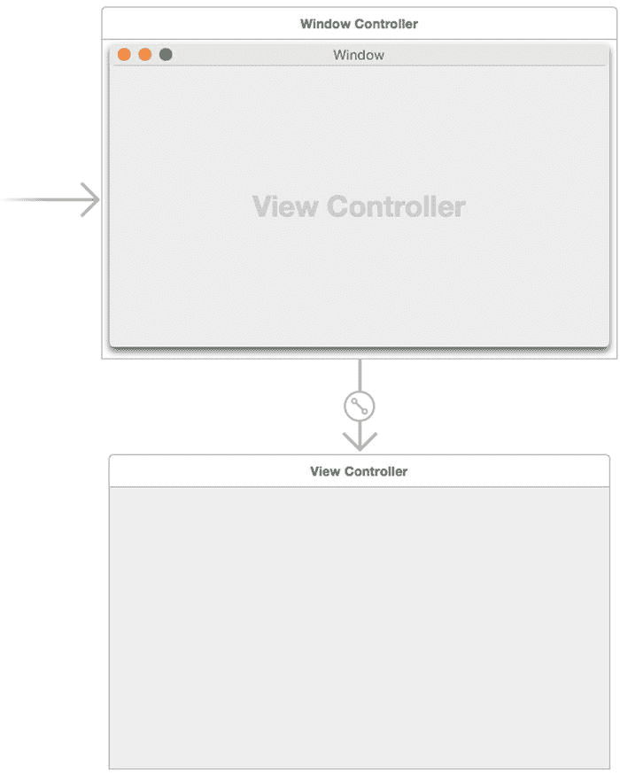

图 14-10. 故事板中的视图控制器和视图

你可以将对象库中的元素放到底部窗口（标有“视图控制器”）上。要向故事板添加额外的窗口，你可以使用对象库并将不同的控制器对象拖入你的故事板，如图 14-11 所示。

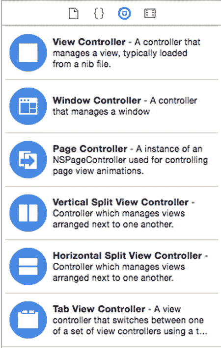

图 14-11. 可以添加到故事板的控制器

### 缩放故事板

当你在项目导航器窗格中单击一个 `.storyboard` 文件时，Xcode 会显示你的故事板。故事板的一个问题是它们往往包含多个场景和连线，你很难一目了然。

为了帮助你查看整个故事板或其中的一部分，你可以进行缩放。Xcode 提供了两种缩放方式：

-   双击故事板上任何元素之外的空白区域（这会在放大和缩小故事板之间切换）。
-   在故事板的空白区域上右键单击，然后从弹出菜单中选择一个缩放级别，如图 14-12 所示。

    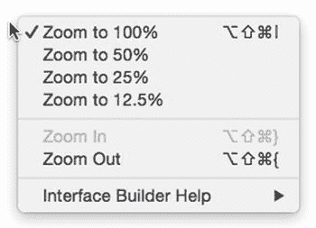

    图 14-12. 右键单击会显示一个缩放弹出菜单

缩放级别越低，你能看到的故事板越多，因此 25% 的缩放级别比 50% 的缩放级别能显示更多的故事板。

**注意：** 当你想要在用户界面上放置不同的元素（如按钮或文本字段）时，需要将故事板缩放级别更改为 100%。

### 向故事板添加场景

你可以在任何缩放级别下向故事板添加场景。较低的缩放级别（例如 25% 或 50%）只是让你更容易看到故事板中各个场景是如何连接的。要在故事板上放置一个新场景，请按照以下步骤操作：

在项目导航器窗格中单击 `.storyboard` 文件。选择 视图 ➤ 工具 ➤ 显示对象库。将对象库中的任何蓝色控制器（参见图 14-11）拖到故事板的任意位置。

你可以放置在故事板上的五种控制器包括：

- **视图控制器** – 控制一个 `.xib` 文件，以便你可以将其包含在故事板中
- **窗口控制器** – 控制单个窗口或视图
- **页面控制器** – 定义视图之间的动画
- **垂直/水平分割视图控制器** – 并排显示两个视图，或将它们上下堆叠显示
- **标签视图控制器** – 显示一个带有标签的界面，用于控制两个或更多视图

你可以将窗口控制器视为一个包含视图的窗口。窗口中显示的视图由从窗口控制器指向视图的箭头标识，如图 14-13 所示。

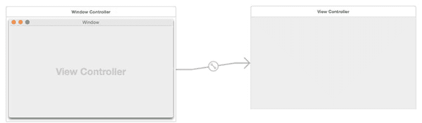

图 14-13. 窗口控制器包含单个视图

另一方面，垂直/水平分割视图控制器的作用就像一个包含两个视图的窗口，这两个视图可以并排放置，也可以上下堆叠，如图 14-14 所示。

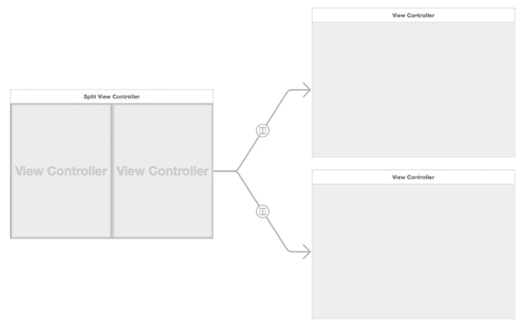

图 14-14. 分割视图控制器包含两个视图

标签视图控制器也由一个可以包含两个或更多视图的窗口组成。不同之处在于它可以显示标签，每个标签代表一个不同的视图，如图 14-15 所示。你也可以向标签视图控制器添加两个以上的视图。

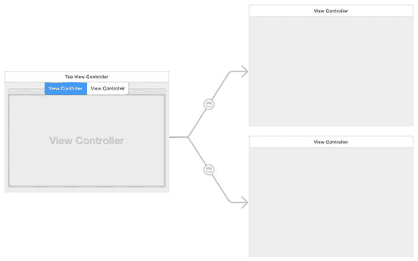

图 14-15. 标签视图控制器在一个窗口中显示两个或更多视图，并通过标签标识


### 在故事板中定义初始场景

在每个故事板中，必须将其中一个场景指定为初始场景，它将在程序运行时作为第一个窗口或视图出现。`Xcode` 会用一个指向右侧的箭头来标识初始场景。

另一种识别初始场景的方法是：点击控制器顶部中央的蓝色图标，并打开 `显示属性检查器` 面板。如果选中了 `是初始控制器` 复选框，那么当前选中的窗口就是初始场景，如图 14-16 所示。

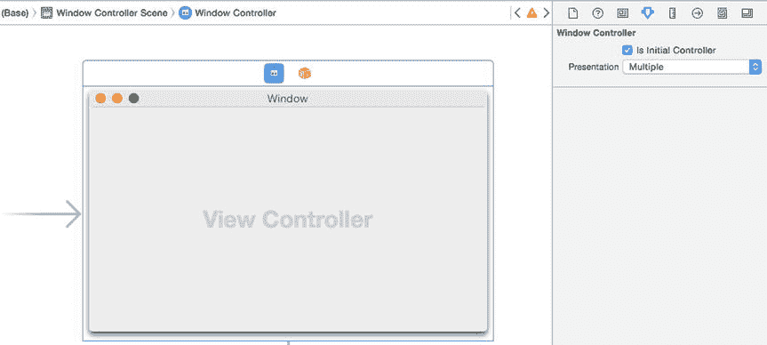

图 14-16. 箭头和 `是初始控制器` 复选框用于标识初始场景

要更改初始场景，你可以执行以下任一操作：
- 拖拽初始场景箭头，使其指向另一个场景
- 为另一个场景选中 `是初始控制器` 复选框

**注：** 同一时间只能有一个初始场景。

### 用 Segue 连接场景

当故事板包含两个或多个场景时，你需要一种方式来显示其他场景。首先，你需要一种从一个场景切换到另一个场景的方法。其次，你需要一种返回的方法。第三，你可能需要在场景之间传递数据。

从一个场景移动到另一个场景需要创建场景间的转场（segue）。要创建场景间的转场，请遵循以下步骤：

1.  确保你的 `StoryProgram` 项目已加载到 `Xcode` 中，并点击 `项目导航器` 面板中的 `Main.storyboard` 文件。
2.  在第一个场景上放置一个按钮。
3.  将鼠标指针移到该按钮上，按住 `Control` 键，并将鼠标从该按钮拖拽到第二个场景上。`Xcode` 会高亮显示第二个场景，如图 14-17 所示。

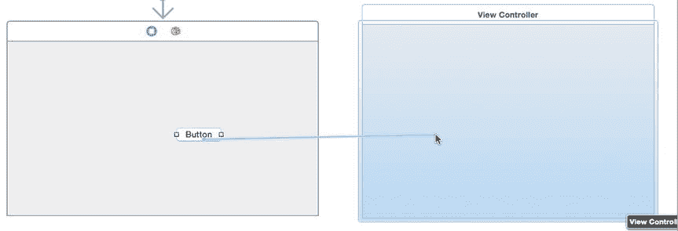

图 14-17. 按住 Control 键从按钮拖拽到另一个场景即可创建转场

4.  松开 `Control` 键和鼠标。`Xcode` 会显示一个弹出菜单，如图 14-18 所示。

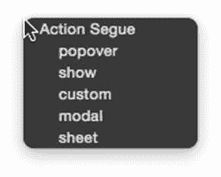

图 14-18. 弹出菜单允许你定义场景的显示方式

5.  选择一个选项，例如 `popover` 或 `sheet`。`Xcode` 会在两个场景之间创建一个转场。如果点击某个转场，`Xcode` 会高亮运行该转场的按钮。如果打开 `显示属性检查器` 面板，你可以为转场指定一个标识名称，并更改转场样式，如图 14-19 所示。

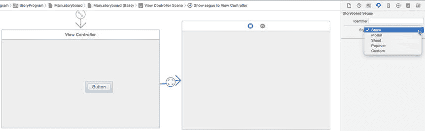

图 14-19. 点击转场可以编辑其属性，并识别运行该转场的用户界面元素

### 通过转场显示场景

转场不仅连接一个场景到另一个场景，还定义了第二个场景如何显示。场景可以出现的五种不同方式包括：
- **弹出窗口（Popover）** – 将场景显示为在连接转场的按钮上方或下方弹出的窗口
- **显示（Show）** – 将场景显示为一个可以移动和调整大小的独立窗口
- **自定义（Custom）** – 允许你为场景创建自定义外观
- **模态（Modal）** – 将场景显示为一个对话框，用户在关闭该场景之前无法进行任何其他操作
- **工作表（Sheet）** – 将场景显示为从窗口标题栏向下滑出的面板

首次创建转场时，你可以定义转场应如何显示场景。但是，你始终可以按照以下步骤进行更改：

1.  确保你的 `StoryProgram` 项目已加载到 `Xcode` 中，并点击 `项目导航器` 面板中的 `Main.storyboard` 文件。
2.  点击你想要修改的转场。`Xcode` 会高亮显示你选择的转场。
3.  选择 `视图` ➤ `工具` ➤ `显示属性检查器`。`属性检查器` 面板允许你修改 `标识符` 和 `样式` 属性（参见图 14-19）。
4.  在 `显示属性检查器` 面板中点击 `样式` 弹出菜单，并选择其他样式，例如 `模态` 或 `工作表`。


## 执行转场后移除场景

转场是单向的，从一个场景过渡到第二个场景。当你使用 Modal、Sheet、Popover 或 Custom 转场创建第二个场景时，你可以通过编写 **Swift** 代码来关闭这个第二个场景。具体操作是，你需要为该场景创建一个 Swift 控制器文件，然后连接该场景中的一个用户界面元素（例如按钮），定义一个 `IBAction` 方法，并在该方法中编写关闭场景的 Swift 代码。

如果你使用的是 Show 转场打开场景，用户可以直接点击关闭按钮来关闭场景，这完全不需要你编写任何 Swift 代码。

若要移除通过 Modal、Sheet、Popover 或 Custom 转场呈现的场景，请遵循以下步骤：

1.  将一个按钮拖拽到第二个场景上，并将其标签修改为 **Close Scene**。
2.  选择 View ➤ Assistant Editor ➤ Show Assistant Editor。助理编辑器会显示你刚刚创建的 `secondView.swift` 文件。
3.  将鼠标指针移动到第二个场景的按钮上，按住 **Control** 键，然后将鼠标拖拽至 `secondView.swift` 文件底部最后一个花括号的上方。此时会弹出一个窗口。
4.  点击 **Connection** 弹出菜单，并选择 **Action**。
5.  点击 **Name** 文本字段，并输入 `closeScene`。
6.  点击 **Type** 弹出菜单，并选择 `NSButton`。然后点击 **Connect** 按钮。Xcode 会显示一个空的 `IBAction` 方法。
7.  按如下方式修改 `IBAction` 方法：
8.  选择一个文件夹，然后点击 **Create** 按钮。Xcode 会在 **Project Navigator** 窗格中显示你的 Swift 类。此时，Swift 类和场景之间尚未建立连接，我们需要通过将场景的视图控制器设置为我们刚刚创建的 Swift 文件中的一个类来解决这个问题。
9.  点击 `Main.storyboard` 文件以显示你的用户界面。
10. 点击有转场指向的那个场景上的蓝色 **View Controller** 图标。这应该就是你想要关闭的那个场景。
11. 选择 View ➤ Utilities ➤ Show Identity Inspector。
12. 点击 **Class** 弹出菜单，并选择 `secondView`，即你之前创建的视图控制器，如图 14-21 所示。

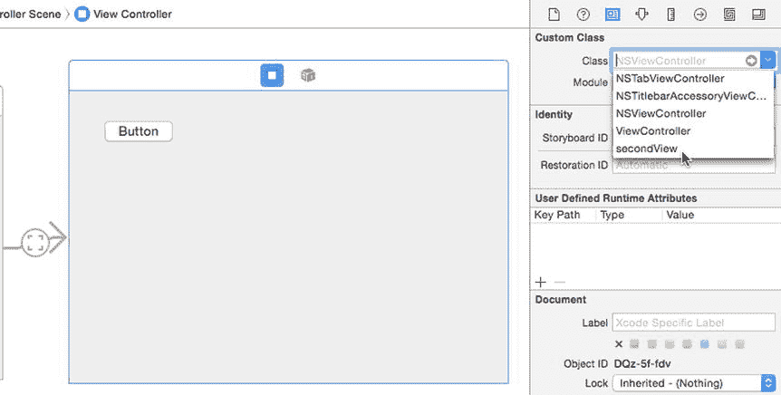

**图 14-21.** 将场景连接到 Swift 视图控制器文件

确保你的 `StoryProgram` 项目已在 Xcode 中加载，然后点击 **Project Navigator** 窗格中的 `Main.storyboard` 文件。

-   在第一个场景上放置一个按钮，并将其标签修改为 **Open Scene**。
-   点击转场，选择 View ➤ Utilities ➤ Show Attributes Inspector，并确保 **Style** 弹出菜单显示为 Modal、Sheet、Popover 或 Custom。
-   选择 File ➤ New ➤ File。Xcode 会显示不同的模板供你选择。
-   在 **OS X** 下选择 **Source**，然后点击 **Cocoa Class** 图标。接着点击 **Next** 按钮。会弹出另一个对话框，要求你输入名称和子类。
-   点击 **Name** 文本字段，输入一个描述性的名称作为你的类名，用于控制场景。
-   点击 **Subclass of:** 弹出菜单，并选择 `NSViewController`。
-   清除 "Also create XIB file for user interface" 复选框。
-   确保 **Language** 弹出菜单显示为 **Swift**，如图 14-20 所示。点击 **Next** 按钮。Xcode 会询问你想将新的 Swift 类保存到哪里。

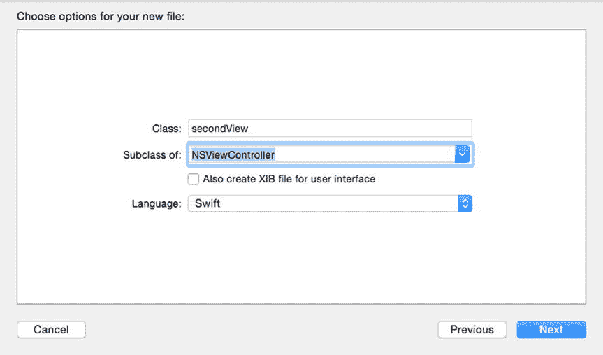

**图 14-20.** 创建 Swift 类来控制故事板中的场景

```
@IBAction func closeScene(sender: NSButton) {
    self.dismissController(self)
}
```

-   选择 Product ➤ Run。你的程序的初始场景会出现，并带有一个 **Open Scene** 按钮。
-   点击 **Open Scene**。第二个场景会以你定义的转场方式（如 Modal、Sheet、Popover 或 Custom）出现。
-   点击第二个场景上的 **Close Scene** 按钮。第二个场景随即消失。
-   选择 StoryProgram ➤ Quit StoryProgram。

## 在场景间传递数据

当你在一个场景中做出更改，然后打开另一个场景时，你可能希望第二个场景能知道你在前一个场景中所做的更改。为此，你需要执行以下操作：

-   在第一个场景中，创建一个 `prepareForSegue` 方法，该方法使用 `segue.destinationViewController` 命令来识别第二个场景视图控制器的名称，并将一个值赋给 `representedObject` 属性。
-   在第二个场景的视图控制器中，声明一个变量来保存要从第一个场景接收的数据，并解包 `representedObject` 中的值。

若要了解如何将数据从一个场景传递到另一个场景，请遵循以下步骤：

1.  选择 View ➤ Assistant Editor ➤ Show Assistant Editor 以显示控制初始场景的 `ViewController.swift` 文件。
2.  将鼠标指针移动到文本字段上，按住 **Control** 键，然后将鼠标从文本字段拖拽到 `class ViewController` 行下方。
3.  松开 **Control** 键和鼠标。会弹出一个菜单。
4.  点击 **Name** 文本字段，输入 `passedText`，然后点击 **Connect** 按钮。Xcode 会创建一个如下的 `IBOutlet`：

确保你的 `StoryProgram` 项目已在 Xcode 中加载，然后点击 **Project Navigator** 窗格中的 `Main.storyboard` 文件。

在包含 **Open Scene** 按钮的场景上拖拽一个文本字段并将其加宽，如图 14-22 所示。

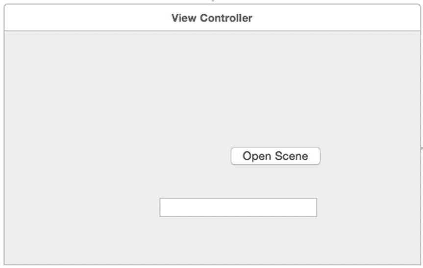

**图 14-22.** 初始场景的用户界面

```
@IBOutlet weak var passedText: NSTextField!
```

编写 `prepareForSegue` 方法，使 `ViewController.swift` 文件中的完整代码如下所示：

```
import Cocoa

class ViewController: NSViewController {

    @IBOutlet weak var passedText: NSTextField!

    override func viewDidLoad() {
        super.viewDidLoad()
        // 加载视图后执行任何其他设置。
    }

    override func prepareForSegue(segue: NSStoryboardSegue, sender: AnyObject?) {
        let secondScene = segue.destinationController as! secondView
        secondScene.representedObject = passedText.stringValue
    }

    override var representedObject: AnyObject? {
        didSet {
            // 如果视图已加载，则更新视图。
        }
    }

}
```

`passedText` 这个 `IBOutlet` 会检索用户在文本字段中输入的文本。然后，`prepareForSegue` 方法创建一个名为 `secondScene` 的常量，它代表转场的目标，即 `secondView` 类。接着，它从 `passedText` 这个 `IBOutlet` 中获取文本，并将其存储到 `representedObject` 属性中。

选择 View ➤ Assistant Editor ➤ Show Assistant Editor。如果助理编辑器没有显示 `secondView.swift` 文件，请点击助理编辑器左上角的 **Automatic** 以显示一个菜单。在此菜单中，选择 Manual ➤ StoryProgram ➤ StoryProgram，然后点击 `secondView.swift` 文件。

-   将鼠标指针移动到标签上，按住 **Control** 键，然后将鼠标从标签拖拽到 `class secondView` 行下方。
-   松开 **Control** 键和鼠标。会弹出一个菜单。
-   点击 **Name** 文本字段，输入 `receivedText`，然后点击 **Connect** 按钮。Xcode 会创建一个如下的 `IBOutlet`：

在你的故事板中点击第二个场景，在上面放置一个 **Label** 并将其加宽，如图 14-23 所示。

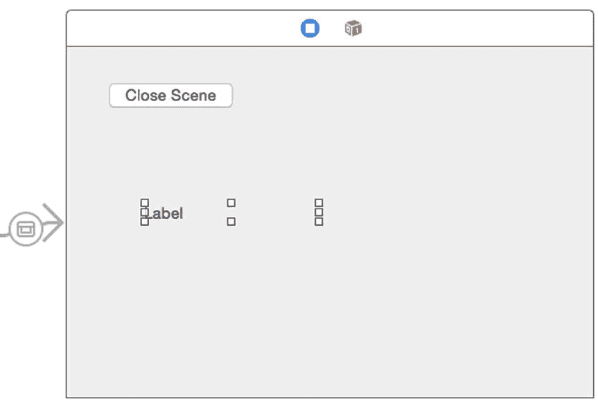

**图 14-23.** 第二个场景的用户界面

```
@IBOutlet weak var receivedText: NSTextField!
```

修改 `viewDidLoad` 方法，使 `secondView.swift` 文件中的完整代码如下所示：

```
import Cocoa

class secondView: NSViewController {

    @IBOutlet weak var receivedText: NSTextField!

    override func viewDidLoad() {
        super.viewDidLoad()
        // 在此处进行视图设置。
        receivedText.stringValue = self.representedObject! as! String
    }

    @IBAction func closeScene(sender: NSButton) {
        self.dismissController(self)
    }

}
```


好的，作为高级文档工程师和翻译员，我将严格遵守您提供的注意事项和示例格式，对给定的英文文本进行翻译。


`receivedText` IBOutlet 显示标签中出现的文本。然后，`viewDidLoad` 方法获取 `representedObject` 属性，将其强制转换或转化为 `String` 数据类型，并将其存储到 `receivedText` IBOutlet 中。

点击 segue，然后选择 View ➤ Utilities ➤ Show Attributes Inspector 以显示 Attributes Inspector 面板。选择 Product ➤ Run。初始场景会显示出来。点击文本字段并输入任意文本，例如你的名字。点击 Open Scene 按钮。第二个场景会显示出来，你输入的文本现在显示在标签中。点击 Close Scene 按钮，让第二个场景消失。选择 StoryProgram ➤ Quit StoryProgram。

## 总结

创建用户界面并将其存储在多个 `.xib` 文件中，或存储在包含多个场景的单个 `.storyboard` 文件中。要打开和关闭不同的 `.xib` 文件，你必须编写 Swift 代码。要在故事板中打开一个场景，只需从某个场景的按钮 `Control`-拖拽到另一个场景即可。

要使打开的第二个场景关闭，你必须编写 Swift 代码。你还需要使用 Swift 代码来在场景之间传输数据。当你在场景之间传输数据时，可以使用 `representedObject` 属性。要访问 `representedObject` 属性中的任何值，你必须解包它，并将其强制转换或转化为特定的数据类型。

故事板允许你定义构成程序用户界面的场景出现的顺序。为了便于查看整个故事板，你可以调整缩放比例以缩小或放大故事板。但是，当你想在故事板场景上放置项目时，必须将缩放比例放大到 100%。

当你在故事板中添加额外的场景时，你需要创建控制这些场景的 Swift 文件。这些 Swift 文件必须是 `NSViewController` 类，然后你必须将你的场景连接到该 Swift 文件。

设计程序用户界面涉及使用 `.xib` 或 `.storyboard` 文件，或两者的组合。故事板减少了编写 Swift 代码的需求，但无论使用哪种类型的文件，你仍然需要编写 Swift 代码来使你的用户界面完全正常工作。

