# 15. 用按钮选择命令

**电子补充材料** 本章的在线版本 (doi:[10.​1007/​978-1-4842-1233-2_​15](http://dx.doi.org/10.1007/978-1-4842-1233-2_15)) 包含补充材料，可供授权用户使用。

每个程序都需要为用户提供控制计算机的方式。在过去，这意味着要知道如何输入正确的命令来使程序运行，但在今天的图形用户界面中，控制程序更简单的方式是从可用命令列表中进行选择。向程序发出命令最简单的方法是通过按钮。

通过在屏幕上显示多个按钮，用户界面随时为用户提供多种选择。用户不需要记忆晦涩的命令，只需通过鼠标指向并点击来选择命令即可。

Xcode 提供了多种不同类型的按钮，你可以将其放置在用户界面上，但它们的工作方式都是相同的。一个按钮代表一个命令，点击该按钮会运行存储在 `IBAction` 方法中的 Swift 代码。

要使用按钮，只需将它们放置在用户界面（可以是 `.xib` 或 `.storyboard` 文件）上，修改标签以显示你希望按钮代表的命令，然后通过 `IBAction` 方法将按钮连接到 Swift 代码。

所有按钮都基于 Cocoa 框架中定义的 `NSButton` 类。虽然大多数按钮显示可以包含按钮所代表命令的文本，但有些按钮根本不显示文本。尽管外观上存在差异，但所有按钮的工作方式相同，并且可以随时更改为另一种按钮类型。可用的不同按钮类型如图 15-1 所示：

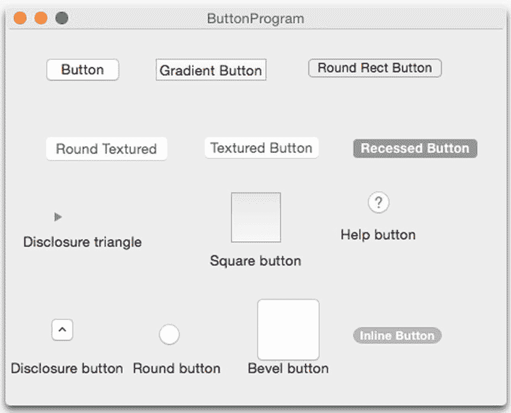

**图 15-1.** 可以放置在用户界面上的不同类型的按钮

*   **推送按钮** (Push Button)
*   **渐变按钮** (Gradient Button)
*   **圆角矩形按钮** (Rounded Rect Button)
*   **圆角纹理按钮** (Rounded Textured Button)
*   **纹理按钮** (Textured Button)
*   **凹入按钮** (Recessed Button)
*   **展开三角形**（不显示文本）(Disclosure Triangle)
*   **方形按钮**（不显示文本）(Square Button)
*   **帮助按钮**（不显示文本）(Help Button)
*   **展开按钮**（不显示文本）(Disclosure Button)
*   **圆形按钮**（不显示文本）(Round Button)
*   **斜面按钮**（不显示文本）(Bevel Button)
*   **内联按钮** (Inline Button)

没有标题的按钮占用空间更小，但可能看起来令人费解，因为用户不知道那个按钮可能有什么作用。方形按钮和斜面按钮通常用于显示代表命令的图片。


### 修改按钮上的文本

对于显示文本的按钮，Xcode 提供了两种修改按钮文本的方式：

-   直接双击按钮文本进行编辑。
-   单击按钮以选中它，选择“视图”➤“实用工具”➤“显示属性检查器”，然后编辑“标题”属性，如图 15-2 所示。

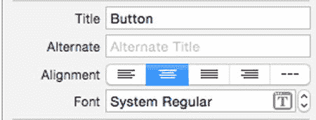

**图 15-2.** “显示属性检查器”面板可让您编辑按钮的标题。

要修改按钮上的文本，您可以打开“显示属性检查器”面板并编辑“标题”属性，或者直接在 Swift 代码中修改标题属性。为此，您必须首先创建一个代表用户界面按钮的 `IBOutlet`。然后使用如下代码在 Swift 中修改“标题”属性：

```
@IBOutlet weak var myButton: NSButton!
myButton.Title = "New Text"
```

在“标题”属性下方是“备选”属性，您也可以通过 Swift 代码将文本存储在按钮的 `alternateTitle` 属性中来调整它。只有当按钮的“类型”属性设置为“切换”或“开关”（如图 15-3 所示）时，“备选标题”文本才会显示。

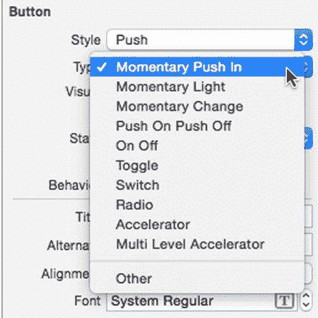

**图 15-3.** 更改按钮的“类型”属性。

当按钮的“备选标题”文本非空，且按钮的“类型”属性为“切换”或“开关”时，点击“切换”或“开关”按钮会在显示“标题”文本和“备选标题”文本之间切换。要了解按钮的“标题”和“备选标题”属性如何工作，请按照以下步骤操作：

1.  点击“下压按钮”，然后选择“视图”➤“实用工具”➤“显示属性检查器”。“显示属性检查器”面板出现在 Xcode 窗口的右上角。
2.  点击“类型”弹出菜单并选择“切换”。
3.  点击“标题”文本字段并输入"Change Me"。
4.  点击“备选”文本字段并输入"Alternate Text"。
5.  选择“产品”➤“运行”。您的用户界面出现。
6.  点击“Change Me”按钮。请注意，按钮上的文本现在显示为"Alternate Text"。
7.  再次点击同一个按钮。请注意，文本在"Change Me"和"Alternate Text"之间切换。
8.  选择“ButtonProgram”➤“退出 ButtonProgram”。
9.  在 Xcode 中，选择“文件”➤“新建”➤“项目”。
10. 点击 OS X 类别下的“应用程序”。
11. 点击“Cocoa 应用程序”，然后点击“下一步”按钮。Xcode 现在会询问产品名称。
12. 点击“产品名称”文本字段并输入`ButtonProgram`。
13. 确保“语言”弹出菜单显示为 Swift，并且没有选中任何复选框。
14. 点击“下一步”按钮。Xcode 会询问您想要将项目存储在哪里。
15. 选择一个文件夹来存储您的项目，然后点击“创建”按钮。
16. 在项目导航器中点击`MainMenu.xib`文件。您的程序用户界面出现。
17. 点击“ButtonProgram”图标以显示程序用户界面的窗口。
18. 选择“视图”➤“实用工具”➤“显示对象库”。“对象库”出现在 Xcode 窗口的右下角。
19. 将一个“下压按钮”和一个“文本字段”拖到用户界面窗口上，并调整这两个项目的大小，使其看起来如图 15-4 所示。

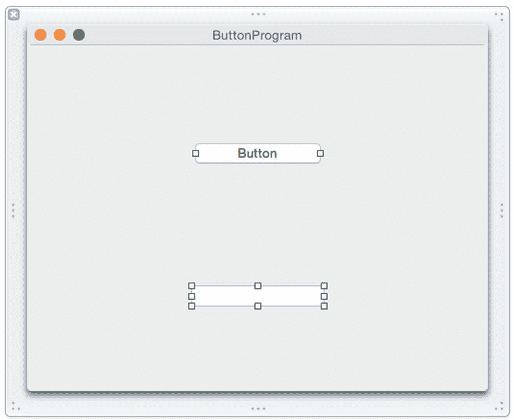

**图 15-4.** ButtonProgram 的用户界面。

现在，让我们看看如何通过从文本字段获取文本并将其存储到按钮的“标题”属性中来修改按钮的标题，请按照以下步骤操作：

1.  在项目导航器窗格中点击`MainMenu.xib`文件。
2.  点击按钮“ButtonProgram”以确保用户界面窗口出现并显示下压按钮和文本字段。
3.  选择“视图”➤“助理编辑器”➤“显示助理编辑器”。`AppDelegate.swift`文件出现在`MainMenu.xib`文件旁边。
4.  将鼠标指针移到下压按钮上，按住 Control 键，然后将鼠标拖到`AppDelegate.swift`文件中`@IBOutlet`行的下方。
5.  松开 Control 键和鼠标。出现一个弹出菜单。
6.  点击“名称”文本字段并输入`myButton`。
7.  将鼠标指针移到文本字段上，按住 Control 键，然后将鼠标拖到`AppDelegate.swift`文件中`@IBOutlet`行的下方。
8.  松开 Control 键和鼠标。出现一个弹出菜单。
9.  点击“名称”文本字段并输入`changeText`。现在您应该已经创建了两个 IBOutlet，如下所示：

```
@IBOutlet weak var myButton: NSButton!
@IBOutlet weak var changeText: NSTextField!
```

10. 将鼠标指针移到下压按钮上，按住 Control 键，然后将鼠标拖到`AppDelegate.swift`文件底部最后一个大括号的上方。
11. 松开 Control 键和鼠标。出现一个弹出菜单。
12. 点击“连接”弹出菜单并选择“动作”。
13. 点击“名称”文本字段并输入`changeTitle`。
14. 点击“类型”弹出菜单并选择`NSButton`，然后点击“连接”按钮。Xcode 会创建一个空的 IBAction 方法。
15. 按如下方式修改此 IBAction 方法：

```
@IBAction func changeTitle(sender: NSButton) {
    myButton.title = changeText.stringValue
}
```

这段 Swift 代码会检索文本字段（`IBOutlet changeText`）中的文本，并将其存储到按钮（`IBOutlet myButton`）的“标题”属性中。

16. 选择“产品”➤“运行”。您的用户界面出现。
17. 点击文本字段并输入"Hello there!"。
18. 点击“Change Me”按钮。“备选文本”出现在按钮上。
19. 再次点击该按钮。文本字段中的文本现在出现。
20. 选择“ButtonProgram”➤“退出 ButtonProgram”。


## 为按钮添加图片和声音

按钮通常会显示文本，列出其所代表的命令。不过，你也可以在按钮上显示图片。这在创建工具栏图标时非常有用，可以用描述性图标来表示命令（例如，用打印机图标表示“打印”命令）。图片可以单独显示在按钮上，也可以与描述性文本一起显示。

除了显示图片，按钮还可以播放声音，为用户提供听觉反馈。虽然大多数人可能使用鼠标（或触控板）点击按钮，但有些人可能更喜欢使用键盘快捷键。因此，你也可以为按钮分配快捷键，以运行链接到特定按钮的 `IBAction` 方法。

要为按钮添加图片，你只需修改 `Image` 属性及其下方的 `Alternate` 属性，如图 15-5 所示。

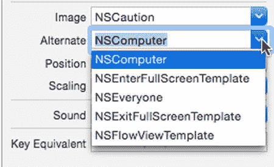

**图 15-5.** `Image` 和 `Alternate` 弹出菜单让你从预定义图片列表中进行选择

你也可以使用 `NSButton` 的 `image` 和 `alternateImage` 属性来定义按钮上显示的图片。当定义按钮上显示的图片时，你还可以选择该图片相对于按钮上任何文本的位置。

`Position` 属性定义了图片与文本的排列方式，其中文本用水平线表示，图片用方块表示，如图 15-6 所示。

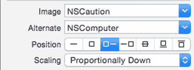

**图 15-6.** `Position` 属性让你对齐按钮上的文本和图片

从左到右的七种不同位置分别是：

- 仅文本
- 仅图片
- 图片在左，文本在右
- 文本在左，图片在右
- 文本重叠在图片中间
- 文本在图片下方
- 文本在图片上方

要定义用户点击按钮时播放的声音，可以修改 `Sound` 属性，如图 15-7 所示。（你可能需要调整电脑的音量，才能听到点击按钮时播放的声音。）

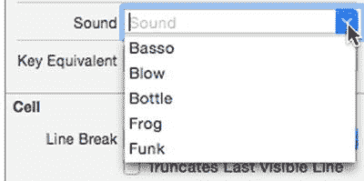

**图 15-7.** `Sound` 属性让你选择要播放的声音

要了解如何为按钮添加图片和声音，请按以下步骤操作：

1.  在项目导航面板中点击 `MainMenu.xib` 文件。
2.  点击用户界面上的“推送按钮”（push button）以将其选中。
3.  选择“视图” ➤ “工具” ➤ “显示属性检查器”。显示属性检查器面板会出现在 Xcode 窗口的右上角。
4.  点击 `Image` 弹出菜单，然后选择 `NSCaution`。
5.  点击 `Alternate` 弹出菜单，然后选择 `NSComputer`（见图 15-5）。
6.  点击 `Position` 属性，选择左数第三个图标（图片在左，文本在右）（见图 15-6）。
7.  点击 `Sound` 弹出菜单，然后选择一个声音，例如 `Frog`。
8.  选择“产品” ➤ “运行”。你的程序会运行起来。请注意，按钮上出现了警告图标。
9.  在文本字段中点击并输入 `Hello there!`。
10. 点击按钮。按钮上的文本会显示备用文本，并播放你选择的声音。每次点击按钮时，它都会在显示 `Title` 和 `Image` 属性与显示 `Alternate`（文本和图片）属性之间切换。
11. 选择“ButtonProgram” ➤ “退出 ButtonProgram”。

## 将多个用户界面项连接到 IBAction 方法

通常，你会将一个 `IBAction` 方法连接到一个用户界面项（例如一个按钮）。但是，也可以将多个项连接到一个 `IBAction` 方法。这样做时，`IBAction` 方法需要知道是哪个用户界面项调用了该方法以运行。

为了标识特定的用户界面项，你需要更改每个连接到同一个 `IBAction` 方法的项的 `Tag` 属性。`Tag` 属性可以保存一个整数值，因此你可以使用不同的 `Tag` 值来标识不同的用户界面项。

为每个用户界面项分配了不同的 `Tag` 值后，你可以像往常一样，使用从一个用户界面项按住 Control 键拖拽到 Swift 文件的方法来创建一个 `IBAction` 方法。然后，使用相同的 Control 键拖拽方法，将其余的用户界面项连接到这个已有的 `IBAction` 方法上。

只要使用 `Tag` 属性来标识是哪个用户界面项调用了 `IBAction` 方法，你可以将任意数量的项连接到同一个 `IBAction` 方法，没有数量限制。

要了解如何将多个项连接到一个 `IBAction` 方法，请按以下步骤操作：

1.  在 Xcode 中选择“文件” ➤ “新建” ➤ “项目”。
2.  在 OS X 类别下点击“应用程序”。
3.  点击“Cocoa 应用程序”，然后点击“下一步”按钮。Xcode 现在会询问产品名称。
4.  在产品名称文本字段中点击并输入 `MultipleProgram`。
5.  确保语言弹出菜单显示为“Swift”，并且所有复选框都处于清除且未选中状态。
6.  点击“下一步”按钮。Xcode 会询问你希望将项目存储在何处。
7.  选择一个文件夹来存储你的项目，然后点击“创建”按钮。
8.  在项目导航面板中点击 `MainMenu.xib` 文件。
9.  点击 `MultipleProgram` 图标，使用户界面窗口显示出来。
10. 将一个“推送按钮”（Push Button）、“凹入按钮”（Recessed Button）、“内联按钮”（Inline Button）和“标签”（Label）拖拽到用户界面上，并按图 15-8 所示调整标签的宽度。

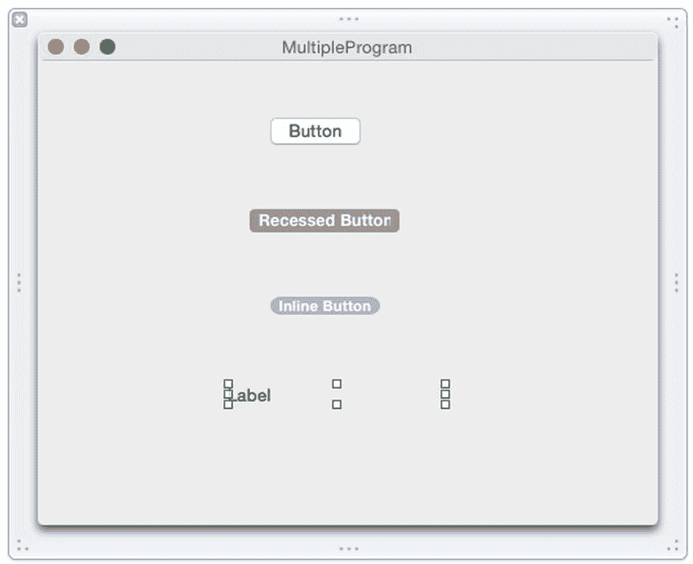

**图 15-8.** `MultipleProgram` 的用户界面

此时，你的窗口中已经有了三种不同类型的按钮和一个标签。我们将创建一个单一的 `IBAction` 方法，所有三个按钮都可以运行它。当你点击一个按钮时，标签将显示该按钮的标题，以指示你刚刚点击了哪个按钮。

首先，我们需要修改每个按钮的 `Tag` 属性。顶部按钮的 `Tag` 值设为 0，中间按钮的 `Tag` 值设为 1，底部按钮的 `Tag` 值设为 2。

然后，我们将创建一个 `IBAction` 方法，该方法识别 `Tag` 属性并在标签中显示按钮的标题。为此，请按以下步骤操作：

1.  在项目导航面板中点击 `MainMenu.xib` 文件。
2.  选择“视图” ➤ “助理编辑器” ➤ “显示助理编辑器”。Xcode 会在用户界面旁边显示 `AppDelegate.swift` 文件。
3.  将鼠标指针移至“标签”上方，按住 Control 键，然后将鼠标拖拽到 `AppDelegate.swift` 文件中 `IBOutlet` 行的下方。
4.  松开 Control 键和鼠标按钮。会弹出一个窗口。
5.  在“名称”文本字段中点击，输入 `displayLabel`，然后点击“连接”按钮。你应该会得到如下的 `IBOutlet`：

```
@IBOutlet weak var displayLabel: NSTextField!
```


释放`Control`键和鼠标按钮。Xcode 将`Recessed Button`连接到`IBAction`方法。  
将鼠标指针移到`Inline Button`上，按住`Control`键，将鼠标拖到`IBAction`方法上，直到 Xcode 高亮显示整个`IBAction`方法。  
释放`Control`键和鼠标按钮。Xcode 将`Inline Button`连接到`IBAction`方法。  
点击`Recessed Button`将其选中，然后选择`View ➤ Utilities ➤ Show Attributes Inspector`。`Show Attributes Inspector`窗格出现在 Xcode 窗口的右上角。  
向下滚动到`View`类别，在`Tag`文本字段中单击并输入`1`（`Push Button`的默认`Tag`值为`0`，`Recessed Button`的`Tag`值将为`1`，`Inline Button`的`Tag`值将为`2`）。  
点击`Inline Button`将其选中。  
向下滚动到`View`类别，在`Tag`文本字段中单击并输入`2`。  
按如下方式修改`IBAction`方法：  
将鼠标指针移到`Push Button`上，按住`Control`键，将鼠标拖到`AppDelegate.swift`文件底部最后一个花括号上方。  
释放`Control`键和鼠标按钮。出现一个弹出窗口。  
在`Connection`弹出菜单中点击，选择`Action`。  
在`Name`文本字段中点击，输入`displayButton`。  
确保`Type`弹出菜单显示为`AnyObject`。如果希望将`IBAction`方法仅限制为按钮，可以将其更改为`NSButton`，但我们希望稍后让其他用户界面项也能连接到这个`IBAction`方法。  
点击`Connect`按钮。Xcode 显示一个空的`IBAction`方法。  
将鼠标指针移到`Recessed Button`上，按住`Control`键，将鼠标拖到`IBAction`方法上，直到 Xcode 高亮显示整个`IBAction`方法，如图 15-9 所示。

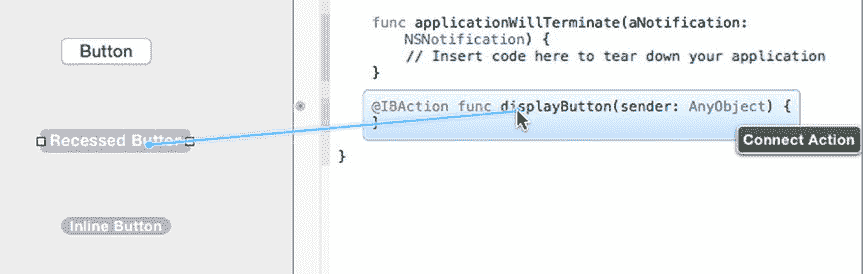

图 15-9.

连接到现有的`IBAction`方法

```
@IBAction func displayButton(sender: AnyObject) {
    if sender is NSButton {
        let whichObject = sender as! NSButton
        switch whichObject.tag {
        case 0:
            displayLabel.stringValue = "Clicked Push Button"
        case 1:
            displayLabel.stringValue = "Clicked Recessed Button"
        case 2:
            displayLabel.stringValue = "Clicked Inline Button"
        default:
            displayLabel.stringValue = "Unknown"
        }
    }
}
```

`sender: AnyObject`代码意味着`IBAction`方法可以连接到任何类型的用户界面项。首先，我们将检查`sender`（调用`IBAction`方法的用户界面项）是否为`NSButton`。如果是，我们将把`sender`强制转换为`NSButton`，并将该按钮赋值给`whichObject`。

现在我们将使用`whichObject`的`tag`属性，通过`switch`语句来确定用户点击了哪个按钮。根据用户点击的按钮，我们将在标签中显示相应的消息。

选择`Product ➤ Run`。程序用户界面出现。  
点击三个不同的按钮，查看标签中显示相应的消息。  
选择`MultipleProgram ➤ Quit MultipleProgram`。

在此示例中，您将多个按钮连接到了单个`IBAction`方法。然而，只要`IBAction`方法的参数为`(sender: AnyObject)`，您就可以将不同的用户界面项连接到同一个`IBAction`方法。

要了解另一个用户界面项如何连接到`IBAction`方法，请按照以下步骤操作：

拖拽一个`Vertical Slider`，并将其放置在用户界面的任意位置。  
将鼠标指针移到`Vertical Slider`上，按住`Control`键，将鼠标拖到`IBAction displayButton`方法上，直到 Xcode 高亮显示整个`IBAction`方法。  
释放`Control`键和鼠标按钮。`IBAction`方法现在已链接到`Vertical Slider`。  
按如下方式修改`IBAction`方法：

```
@IBAction func displayButton(sender: AnyObject) {
    if sender is NSButton {
        let whichObject = sender as! NSButton
        switch whichObject.tag {
        case 0:
            displayLabel.stringValue = "Clicked Push Button"
        case 1:
            displayLabel.stringValue = "Clicked Recessed Button"
        case 2:
            displayLabel.stringValue = "Clicked Inline Button"
        default:
            displayLabel.stringValue = "Unknown"
        }
    } else if sender is NSSlider {
        displayLabel.stringValue = "Dragged slider"
    }
}
```

代码最后的`else if`部分检查`sender`是否为`NSSlider`，这意味着用户拖动了垂直滑块，从而调用了`IBAction`方法。如果用户拖动了垂直滑块，则代码会将字符串`"Dragged slider"`放入标签中。

选择`Product ➤ Run`。用户界面出现。  
拖动垂直滑块。注意，标签中显示`"Dragged slider"`。  
点击任意按钮。注意，标签现在会标识您点击的是哪个按钮。按钮和垂直滑块都链接到同一个`IBAction`方法，该方法必须确定是哪个用户界面项调用了它并执行相应操作。  
选择`MultipleProgram ➤ Quit MultipleProgram`。

## 使用弹出按钮

按钮可以方便地在屏幕上显示命令，但如果需要提供多个选项，让每个按钮代表一个命令可能会变得繁琐和拥挤。一种方法是将多个选项合并到一个弹出按钮中。弹出按钮占用空间更少，并且可以为用户提供大量可选选项。

要了解弹出按钮的工作原理，请按照以下步骤操作：

在 Xcode 中，选择`File ➤ New ➤ Project`。  
在`OS X`类别下点击`Application`。  
点击`Cocoa Application`，然后点击`Next`按钮。Xcode 现在要求输入产品名称。  
在`Product Name`文本字段中点击，输入`PopupProgram`。  
确保`Language`弹出菜单显示为`Swift`，并且没有选中任何复选框。  
点击`Next`按钮。Xcode 询问项目存储位置。  
选择一个文件夹来存储项目，然后点击`Create`按钮。  
在项目导航器中点击`MainMenu.xib`文件。程序用户界面出现。  
点击`PopupProgram`图标以显示程序用户界面的窗口。  
选择`View ➤ Utilities ➤ Show Object Library`。对象库出现在 Xcode 窗口的右下角。  
拖拽一个`Popup Button`和一个`Label`到用户界面窗口上，并调整`Label`的宽度，使其如图 15-10 所示。

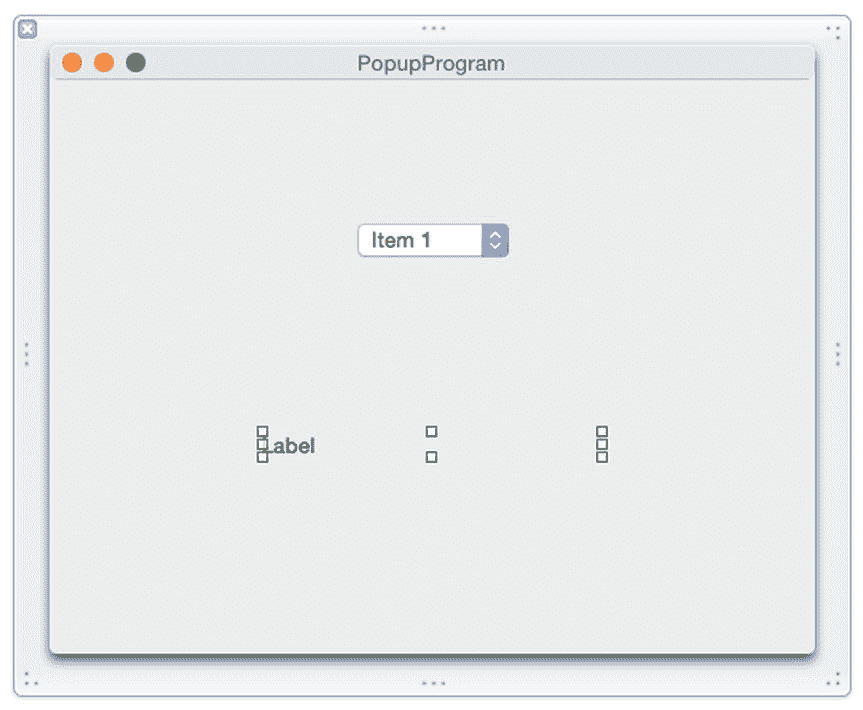

图 15-10.

`PopupProgram`的用户界面  
选择`View ➤ Assistant Editor ➤ Show Assistant Editor`。Xcode 将`AppDelegate.swift`文件显示在用户界面旁边。  
将鼠标指针移到标签上，按住`Control`键，拖到`AppDelegate.swift`文件中`IBOutlet`行的下方。  
释放`Control`键和鼠标。出现一个弹出窗口。  
在`Name`文本字段中点击，输入`labelChoice`，然后点击`Connect`按钮。Xcode 创建了一个`IBOutlet`，如下所示：

```
@IBOutlet weak var labelChoice: NSTextField!
```

将鼠标指针移到弹出按钮上，按住`Control`键，将鼠标拖到`AppDelegate.swift`文件底部最后一个花括号上方。  
释放`Control`键和鼠标。出现一个弹出窗口。  
在`Connection`弹出菜单中点击，选择`Action`。  
在`Name`文本字段中点击，输入`showChoice`。  
在`Type`弹出菜单中点击，选择`NSPopUpButton`。然后点击`Connect`按钮。Xcode 显示一个空的`IBAction`方法。  
按如下方式修改`IBAction`方法：

```
@IBAction func showChoice(sender: NSPopUpButton) {
    labelChoice.stringValue = sender.titleOfSelectedItem!
}
```

选择`Product ➤ Run`。用户界面窗口出现。  
点击弹出按钮。注意，默认情况下，弹出按钮包含三个通用项，分别标记为`Item 1`、`Item 2`和`Item 3`。  
点击一个选项。注意，您选择的选项会出现在标签中。  
选择`PopupProgram ➤ Quit PopupProgram`。


### 可视化修改弹出菜单项

弹出按钮包含一个包含三个项目的默认列表。不过，你可以随时添加、编辑或删除该列表中的项目。要编辑弹出菜单列表，请按照以下步骤操作：

双击你想要编辑的菜单项。Xcode 会高亮显示所选菜单项的文本，如图 15-12 所示。

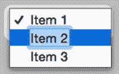

图 15-12. 双击菜单项即可编辑文本

双击用户界面上的弹出按钮。当前菜单项列表随即显示，如图 15-11 所示。

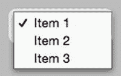

图 15-11. 双击弹出按钮即可显示其菜单项列表

> **注意：** 你也可以选择“视图”➤“工具”➤“显示属性检查器”，然后通过编辑所选菜单项的“标题”属性来修改其文本。

使用箭头键、Backspace 或 Delete 键来编辑文本，并输入任何新文本。

按下 Return 键。Xcode 会保存你对菜单项文本所做的编辑。

要从弹出按钮中删除某个菜单项，请按照以下步骤操作：

1.  双击用户界面上的弹出按钮。当前菜单项列表随即显示（见图 15-11）。
2.  点击你想要删除的菜单项。Xcode 会高亮显示你所选的菜单项。
3.  按下 Backspace 或 Delete 键。你所选的菜单项即会消失。

> **注意：** 如果误删了某个菜单项，只需按下 Command+Z 或选择“编辑”➤“撤销”即可撤销删除命令。

要向弹出按钮中添加菜单项，请按照以下步骤操作：

1.  选择“视图”➤“工具”➤“显示对象库”。对象库会出现在 Xcode 窗口的右下角。
2.  在对象库底部的搜索框中输入“menu item”并按 Return 键。对象库会显示一个菜单项列表，如图 15-13 所示。
3.  将“菜单项”从对象库拖拽到用户界面弹出按钮所存储的菜单项列表上。
4.  松开鼠标按钮。Xcode 会在弹出按钮列表中添加一个菜单项。

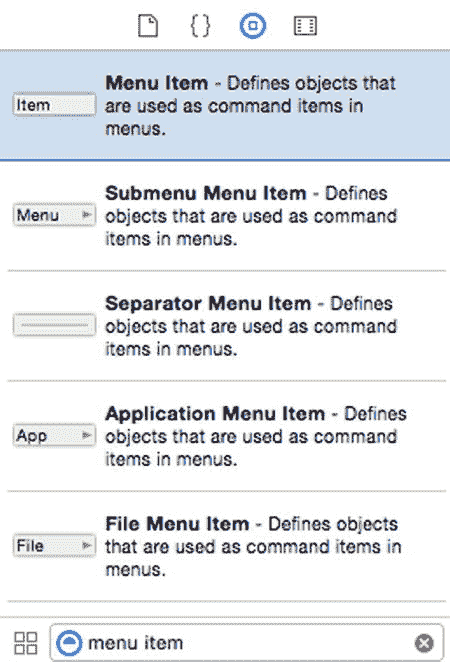

图 15-13. 对象库中的菜单项列表

### 使用 Swift 代码添加弹出菜单项

除了可视化修改弹出按钮中的菜单项外，你还可以使用 Swift 代码来添加、删除或更改菜单项。弹出按钮的菜单项基于 `NSMenuItem` 类，但你可以在 `NSMenu` 类中找到操作弹出按钮菜单项列表所需的方法。

如果你想向弹出按钮中仅添加一个新菜单项，可以使用 `addItemWithTitle` 方法并指定一个字符串，例如：

```
myPopUp.addItemWithTitle("New Item")
```

你也可以通过将新菜单项存储在数组中，并使用 `addItemsWithTitles` 方法来添加一个列表，例如：

```
myPopUp.addItemsWithTitles(["Cat", "Dog", "Bird", "Fish", "Reptile"])
```

你可以使用 `removeItemAtIndex` 方法来移除单个菜单项，该方法需要一个 `Int` 值来指定要移除的项目。弹出菜单列表中的第一个项目索引为 0，第二个索引为 1，以此类推。

要移除弹出按钮菜单列表中的所有项目，只需使用 `removeAllItems()` 方法，无论当前列表中存储了多少个项目，该方法都会清空整个列表。

要了解如何使用 Swift 代码在弹出按钮菜单列表中添加和删除项目，请按照以下步骤操作：

1.  选择“视图”➤“辅助编辑器”➤“显示辅助编辑器”。Xcode 会在用户界面旁边显示 `AppDelegate.swift` 文件。
2.  将鼠标指针移到弹出按钮上，按住 Control 键，然后将鼠标拖拽到 `AppDelegate.swift` 文件顶部附近的 `IBOutlet` 行下方。
3.  松开 Control 键和鼠标。此时会弹出一个窗口。
4.  点击“名称”文本字段，输入 `myPopUp`。然后点击“连接”按钮。Xcode 会创建一个 `IBOutlet`。
5.  将鼠标指针移到文本字段上，按住 Control 键，然后将鼠标拖拽到 `AppDelegate.swift` 文件顶部附近的 `IBOutlet` 行下方。
6.  松开 Control 键和鼠标。此时会弹出一个窗口。
7.  点击“名称”文本字段，输入 `newItem`。然后点击“连接”按钮。Xcode 会创建另一个 `IBOutlet`，因此你应该会有两个 `IBOutlet`，如下所示：

```
@IBOutlet weak var myPopUp: NSPopUpButton!
@IBOutlet weak var newItem: NSTextField!
```

在 Xcode 中，选择“文件”➤“新建”➤“项目”。

1.  在 OS X 类别下点击“应用程序”。
2.  点击“Cocoa 应用程序”，然后点击“下一步”按钮。Xcode 现在会要求输入产品名称。
3.  点击“产品名称”文本字段，输入 `EditPopProgram`。
4.  确保“语言”弹出菜单显示“Swift”，并且没有选中任何复选框。
5.  点击“下一步”按钮。Xcode 会询问你希望将项目存储在哪里。
6.  选择一个文件夹来存储你的项目，然后点击“创建”按钮。
7.  在项目导航器中点击 `MainMenu.xib` 文件。你的程序用户界面会显示出来。
8.  点击 `EditPopProgram` 图标以显示程序用户界面的窗口。
9.  选择“视图”➤“工具”➤“显示对象库”。对象库会出现在 Xcode 窗口的右下角。
10. 将一个“弹出按钮”、三个“按钮”和一个“文本字段”拖拽到用户界面窗口上，并编辑两个“按钮”的标题，使其看起来如图 15-14 所示。

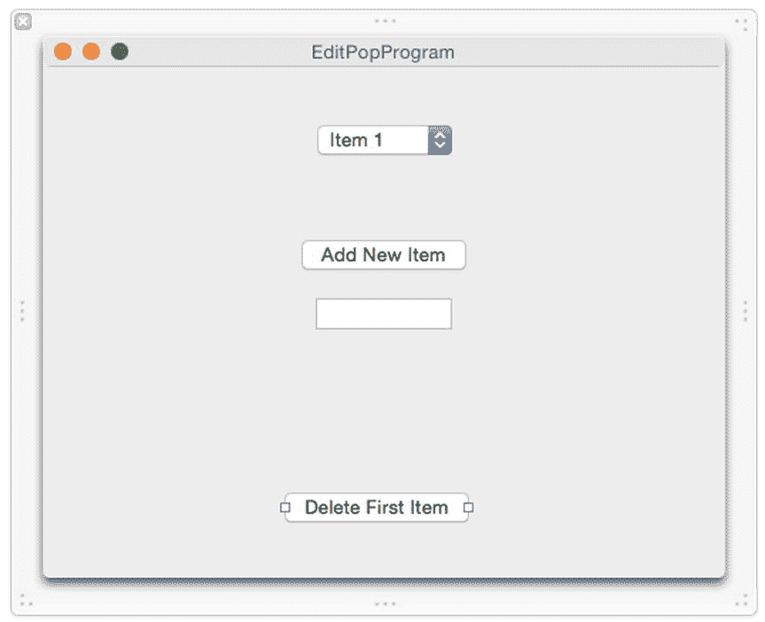

图 15-14. `EditPopProgram` 的用户界面


将鼠标指针移到`Add New Item`按钮上，按住`Control`键，然后将鼠标拖到`AppDelegate.swift`文件底部最后一个花括号的上方。松开`Control`键和鼠标，会弹出一个窗口。点击`Connection`弹出菜单，选择`Action`。点击`Name`文本字段，输入`addNewItem`。点击`Type`弹出菜单，选择`NSButton`。然后点击`Connect`按钮。Xcode 会创建一个空的`IBAction`方法。

将鼠标指针移到`Delete First Item`按钮上，按住`Control`键，然后将鼠标拖到`AppDelegate.swift`文件底部最后一个花括号的上方。松开`Control`键和鼠标，会弹出一个窗口。点击`Connection`弹出菜单，选择`Action`。点击`Name`文本字段，输入`deleteFirstItem`。点击`Type`弹出菜单，选择`NSButton`。然后点击`Connect`按钮。Xcode 会创建一个空的`IBAction`方法。

将鼠标指针移到`Add New List`按钮上，按住`Control`键，然后将鼠标拖到`AppDelegate.swift`文件底部最后一个花括号的上方。松开`Control`键和鼠标，会弹出一个窗口。点击`Connection`弹出菜单，选择`Action`。点击`Name`文本字段，输入`addList`。点击`Type`弹出菜单，选择`NSButton`。然后点击`Connect`按钮。Xcode 会创建另一个空的`IBAction`方法。

按如下所示修改所有三个`IBAction`方法：

```
@IBAction func addNewItem(sender: NSButton) {
myPopUp.addItemWithTitle(newItem.stringValue)
}

@IBAction func deleteFirstItem(sender: NSButton) {
myPopUp.removeItemAtIndex(0)
}

@IBAction func addList(sender: NSButton) {
myPopUp.removeAllItems()
myPopUp.addItemsWithTitles(["Cat", "Dog", "Bird", "Fish", "Reptile"])
}
```

`addNewItem`这个`IBAction`方法从文本字段获取文本，并使用`addItemWithTitle`方法将该文本作为新的菜单项添加到弹出按钮列表中。`deleteFirstItem`这个`IBAction`方法使用`removeItemAtIndex`方法删除弹出按钮列表中的第一个菜单项。`addList`这个`IBAction`方法使用`removeAllItems`方法清空弹出按钮中的当前列表，然后用一个新的字符串数组替换它。

选择`Product` ➤ `Run`。你的用户界面会出现。点击弹出按钮。注意，菜单项列表显示三个项目，标签分别是`Item 1`、`Item 2`和`Item 3`。点击`Delete First Item`按钮。再次点击弹出按钮。注意，菜单项列表现在只显示两个项目，标签分别是`Item 2`和`Item 3`。点击文本字段，输入`My Item`。点击`Add New Item`按钮。再次点击弹出按钮。注意，现在菜单项列表显示三个项目，标签分别是`Item 2`、`Item 3`和`My Item`。点击`Add New List`按钮。再次点击弹出按钮。注意，现在菜单项列表显示的是在`addList`这个`IBAction`方法内部定义的字符串数组。选择`EditPopProgram` ➤ `Quit EditPopProgram`。

## 总结

按钮代表用户可以通过点击来选择某个选项的命令。Xcode 提供了几种不同类型的按钮可以放置在用户界面上，但它们都基于 Cocoa 框架中定义的同一个`NSButton`类。

并非所有按钮都显示文本，但那些显示文本的按钮使用`Title`属性来保存文本。如果希望在按钮上显示图像，可以使用`Image`属性来定义图像。如果将按钮的`Type`属性更改为`Switch`或`Toggle`，那么就可以让按钮显示`Title`属性中存储的文本，同时还可以显示`Alternate Text`属性和/或`Alternate Image`属性中的文本。

如果需要向用户提供多个选项，在用户界面上放置多个按钮可能会显得杂乱无章。一个更简单的替代方法是使用弹出按钮，它显示一个选项列表，你可以通过可视化方式或 Swift 代码来修改这个列表。

按钮通常连接到一个`IBAction`方法，但你可以将多个按钮（或其他用户界面项）链接到同一个`IBAction`方法。当将多个用户界面项连接到一个`IBAction`方法时，你需要使用 Swift 代码来识别调用该`IBAction`方法的用户界面项。按钮是向用户提供可选选项的最直接方式。

