# 16. 使用单选按钮、复选框、日期选择器和滑块做出选择

电子补充材料 本章的在线版本 (doi:[10.1007/978-1-4842-1233-2_16](http://dx.doi.org/10.1007/978-1-4842-1233-2_16)) 包含补充材料，仅供授权用户使用。

用户界面通常不是让用户通过按钮选择特定命令，而是提供选项供其挑选。这些选择允许用户选取一个或多个选项，例如自定义程序的工作方式。当用户界面需要提供多个选项时，最常见的两种方式是通过单选按钮和复选框。

单选按钮的名称来源于汽车收音机，你可以按下按钮切换到不同的广播电台。由于一次只能收听一个电台，因此单选按钮提供多个选项，但限制一次只能选择一个按钮。当你选择另一个按钮时，之前的选择就不再被选中。使用单选按钮时，你可以选择零个按钮，或者一次恰好选择一个按钮。

复选框的工作原理略有不同。与单选按钮一样，复选框也提供多个选项。主要区别在于，对于一组复选框，你可以同时选择零个或多个复选框，因此可以一次选择多个选项。

当需要将用户限制为零个或一个选择时，请使用单选按钮。当需要让用户选择零个或多个选项时，请使用复选框。图 16-1 展示了 Xcode 偏好设置对话框，它同时使用单选按钮和复选框让用户自定义 Xcode 的行为。

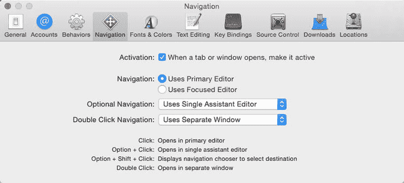  
图 16-1. Xcode 偏好设置对话框使用单选按钮和复选框让用户选择选项

虽然单选按钮和复选框通常用于显示文本形式的选项，但日期选择器则显示不同类型的日期供用户选择。然后日期选择器会以一种特殊的日期格式存储用户的选择（而不是表示月份的单独文本或表示日期的数字）。

通过以特殊格式存储日期，你的程序可以根据用户计算机上的设置正确显示日期。例如，在世界上的某些地区，日期显示为这样：`mm/dd/yyyy`。而在世界的其他地区，日期显示为这样：`dd/mm/yyyy`。

日期选择器无需担心每个用户计算机上的特定日期格式设置，它使用一种特殊的日期格式，这样计算机就可以根据用户当前的设置正确显示相应的格式。

日期选择器与单选按钮和复选框一样，为用户提供固定但有限的、有效的选项范围供其选择。这确保了无论用户做出何种选择，该选择对于你的程序来说都是可以接受的。

复选框和单选按钮适用于为用户提供有限的、通常是文本类的选项。为了向用户提供一个可供选择的数值范围，你可以使用滑块。滑块允许用户直观地选择一个有效的选项范围。


## 使用复选框

您可以单独使用一个复选框，也可以将多个复选框组合在一起使用。复选框实际上基于 `NSButton` 类，尽管其外观和操作方式与典型的按钮有很大不同。对于复选框，最重要的三个属性包括：

- **标题** – 显示在复选框旁边，描述供用户选择的选项文本。
- **状态** – 决定复选框是选中（1）还是未选中（0）。
- **替代文本** – 复选框未选中时显示的文本。（选中复选框时显示的是标题文本。）

要了解复选框的工作原理，请按照以下步骤操作：

选择 “视图” ➤ “工具” ➤ “显示属性检查器”。属性检查器窗格会出现在 Xcode 窗口的右上角。点击顶部的复选框，在属性检查器窗格中，将其标题改为“无狗”，替代文本改为“狗”。点击中间的复选框，在属性检查器窗格中，将其标题改为“无猫”，替代文本改为“猫”。点击底部的复选框，在属性检查器窗格中，将其标题改为“无鸟”，替代文本改为“鸟”。双击按钮，将其标题改为“检查”。选择 “视图” ➤ “助理编辑器” ➤ “显示助理编辑器”。Xcode 会在用户界面旁边显示 `AppDelegate.swift` 文件。将鼠标指针移到“狗”复选框上，按住 Control 键，然后将鼠标拖到 `AppDelegate.swift` 文件中的 `IBOutlet` 行下方。松开 Control 键和鼠标。会弹出一个窗口。点击“名称”文本字段，输入 `dogBox`，然后点击“连接”按钮。将鼠标指针移到“猫”复选框上，按住 Control 键，然后将鼠标拖到 `AppDelegate.swift` 文件中的 `IBOutlet` 行下方。松开 Control 键和鼠标。会弹出一个窗口。点击“名称”文本字段，输入 `catBox`，然后点击“连接”按钮。将鼠标指针移到“鸟”复选框上，按住 Control 键，然后将鼠标拖到 `AppDelegate.swift` 文件中的 `IBOutlet` 行下方。松开 Control 键和鼠标。会弹出一个窗口。点击“名称”文本字段，输入 `birdBox`，然后点击“连接”按钮。将鼠标指针移到文本视图上，按住 Control 键，然后将鼠标拖到 `AppDelegate.swift` 文件中的 `IBOutlet` 行下方。松开 Control 键和鼠标。会弹出一个窗口。点击“名称”文本字段，输入 `messageBox`，然后点击“连接”按钮。现在您应该有四个新的 `IBOutlet`，看起来像这样：在 Xcode 中选择 “文件” ➤ “新建” ➤ “项目”。在 OS X 类别下点击“应用程序”。点击“Cocoa 应用程序”，然后点击“下一步”按钮。Xcode 会要求输入产品名称。点击“产品名称”文本字段，输入 `CheckProgram`。确保“语言”弹出菜单显示为 Swift，并且没有选中任何复选框。点击“下一步”按钮。Xcode 会询问您希望将项目存储在哪里。选择一个文件夹来存储项目，然后点击“创建”按钮。点击项目导航器中的 `MainMenu.xib` 文件。程序的主界面会显示出来。点击 `CheckProgram` 图标以显示程序主界面的窗口。选择 “视图” ➤ “工具” ➤ “显示对象库”。对象库会出现在 Xcode 窗口的右下角。将一个按钮、三个复选框和一个文本视图拖到用户界面窗口上。确保调整文本视图和所有复选框的宽度，使其看起来如图 16-2 所示。

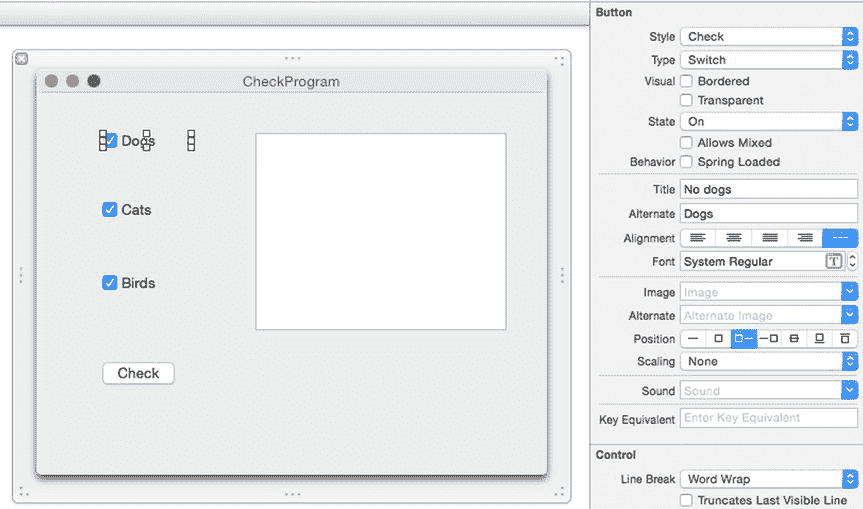

图 16-2. `CheckProgram` 的用户界面。

```
@IBOutlet weak var dogBox: NSButton!
@IBOutlet weak var catBox: NSButton!
@IBOutlet weak var birdBox: NSButton!
@IBOutlet weak var messageBox: NSTextField!
```

将鼠标指针移到“检查”按钮上，按住 Control 键，然后将鼠标拖到 `AppDelegate.swift` 文件底部最后一个花括号上。松开 Control 键和鼠标。会弹出一个窗口。点击“连接”弹出菜单，选择“操作”。点击“名称”文本字段，输入 `checkBoxes`。点击“类型”弹出菜单，选择 `NSButton`。Xcode 会创建一个空的 `IBAction` 方法。按如下方式修改这个复选框的 `IBAction` 方法：

```
@IBAction func checkBoxes(sender: NSButton) {
    let nextLine = "\r\n"
    var message : String = ""
    if dogBox.state == 1 {
        message = "Dog check box selected" + nextLine
    } else {
        message = "Dog check box NOT selected" + nextLine
    }
    if catBox.state == 1 {
        message = message + "Cat check box selected" + nextLine
    } else {
        message = message + "Cat check box NOT selected" + nextLine
    }
    if birdBox.state == 1 {
        message = message + "Bird check box selected" + nextLine
    } else {
        message = message + "Bird check box NOT selected" + nextLine
    }
    messageBox.stringValue = message
}
```

这段代码创建了一个常量，表示回车符 `\r` 和换行符 `\n`。它声明了一个可以存储 `String` 数据类型的 `message` 变量，初始值为 `""`，即空字符串。多个 `if-else` 语句检查每个复选框的 `State` 属性，以确定它是选中状态（`state = 1`）还是未选中状态（`state = 0`）。然后将结果显示在由名为 `messageBox` 的 `IBOutlet` 变量表示的文本视图中。

选择 “产品” ➤ “运行”。用户界面会显示出来。点击不同的复选框。注意，每次选中或取消选中复选框时，都会显示标题或替代文本。点击“检查”按钮。文本视图会标识出您选中了哪些复选框，以及哪些是未选中的。选择 “CheckProgram” ➤ “退出 CheckProgram”。


## 使用单选按钮

与允许用户选择多个选项的复选框不同，单选按钮会显示多个选项，但一次只允许用户选择一项。当用户选择另一个单选按钮时，当前选中的单选按钮会自动取消选中。

在 Cocoa 框架中，单选按钮由 `NSMatrix` 类定义。这意味着当你创建一组单选按钮时，需要通过定义行数和列数来确定所需的数量，如图 16-3 所示。

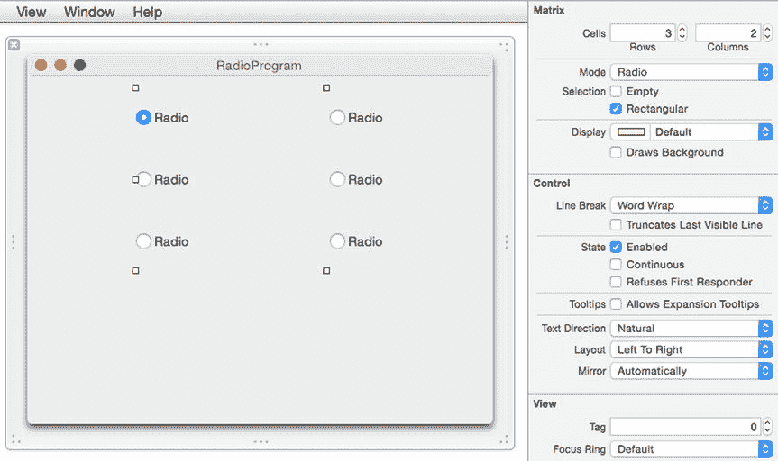

图 16-3.

单选组（Radio Group）的“显示属性检查器”（Show Attributes Inspector）面板允许你定义显示单选按钮的行数和列数。

要添加或移除单选按钮，只需调整“显示属性检查器”面板中“矩阵”（Matrix）类别下的行数和列数即可。如果需要创建奇数个单选按钮，选择你不想要的单选按钮，并选中其“透明”（Transparent）属性，如图 16-4 所示。

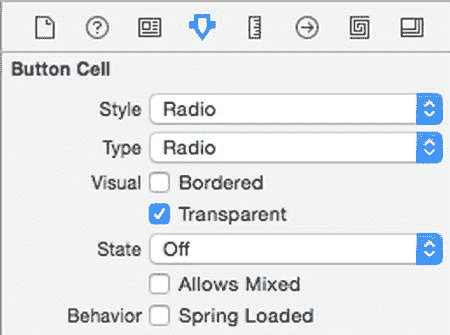

图 16-4.

“透明”属性允许你隐藏组中的某个单选按钮。

要确定用户选择了哪个单选按钮，你需要单独更改每个单选按钮的“标签”（Tag）属性。然后，你可以使用 `selectedTag()` 方法来获取选中的单选按钮。

要了解如何使用单选按钮，请按照以下步骤操作：

1.  在“显示属性检查器”面板的“按钮单元”（Button Cell）类别下，选中“透明”复选框（见图 16-4）。你选择的单选按钮会消失。
2.  点击左上角的顶部单选按钮，并确保其“显示属性检查器”面板中的“标签”属性设置为 0。
3.  点击左列的中间单选按钮，并确保其“显示属性检查器”面板中的“标签”属性设置为 1。
4.  点击左列的底部单选按钮，并确保其“显示属性检查器”面板中的“标签”属性设置为 2。
5.  点击右列的顶部单选按钮，并确保其“显示属性检查器”面板中的“标签”属性设置为 3。
6.  点击右列的中间单选按钮，并确保其“显示属性检查器”面板中的“标签”属性设置为 4。
7.  选择“视图”（View）➤“助理编辑器”（Assistant Editor）➤“显示助理编辑器”（Show Assistant Editor）。`AppDelegate.swift` 文件会出现在你的用户界面旁边。
8.  将鼠标指针移到单选组上，按住 Control 键，然后拖拽到 `IBOutlet` 行的下方。
9.  松开 Control 键和鼠标。会弹出一个窗口。
10. 点击“名称”（Name）文本字段，输入 `radioMatrix`。会生成一个 `IBOutlet`，如下所示：
    ```
    @IBOutlet weak var radioMatrix: NSMatrix!
    ```
11. 点击单选组右下角的那个单选按钮。Xcode 会高亮显示你选择的单选按钮，如图 16-6 所示。

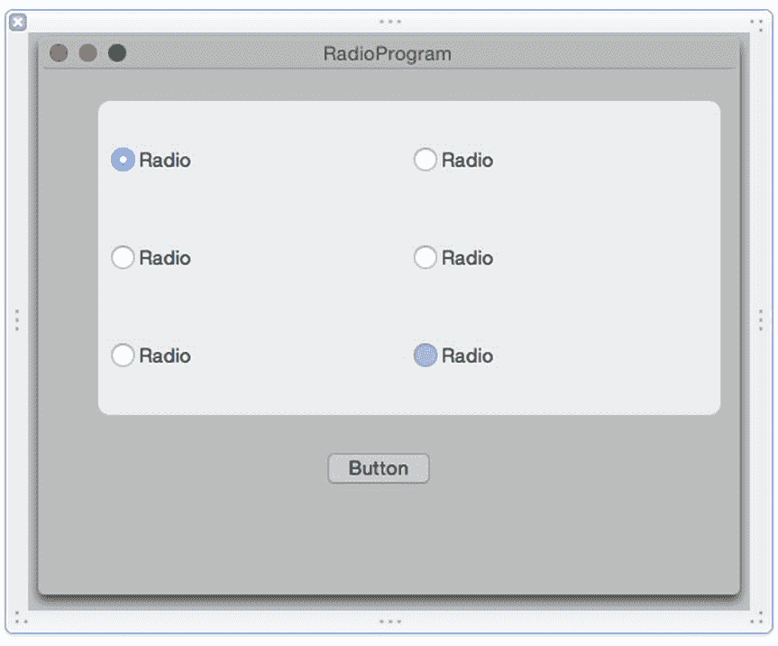

图 16-6.

选择要修改的单选按钮。

12. 在 Xcode 中，选择“文件”（File）➤“新建”（New）➤“项目”（Project）。
13. 在 OS X 类别下点击“应用程序”（Application）。
14. 点击“Cocoa 应用程序”（Cocoa Application），然后点击“下一步”（Next）按钮。Xcode 会要求输入产品名称。
15. 在“产品名称”（Product Name）文本字段中，输入 `RadioProgram`。
16. 确保“语言”（Language）弹出菜单显示为 Swift，并且没有复选框被选中。
17. 点击“下一步”按钮。Xcode 会询问你希望将项目存储在何处。
18. 选择一个文件夹来存储你的项目，然后点击“创建”（Create）按钮。
19. 在项目导航器中点击 `MainMenu.xib` 文件。你的程序用户界面会显示出来。
20. 点击 RadioProgram 图标，显示程序用户界面的窗口。
21. 选择“视图”➤“工具”（Utilities）➤“显示对象库”（Show Object Library）。对象库会出现在 Xcode 窗口的右下角。
22. 将一个“下压按钮”（Push Button）和一个“单选组”（Radio Group）拖拽到用户界面窗口上。
23. 点击单选组，然后选择“视图”➤“工具”➤“显示属性检查器”，在 Xcode 窗口的右上角打开“显示属性检查器”面板。
24. 修改“行数”和“列数”，将其设置为 3 行和 2 列，使其看起来像图 16-5 所示。

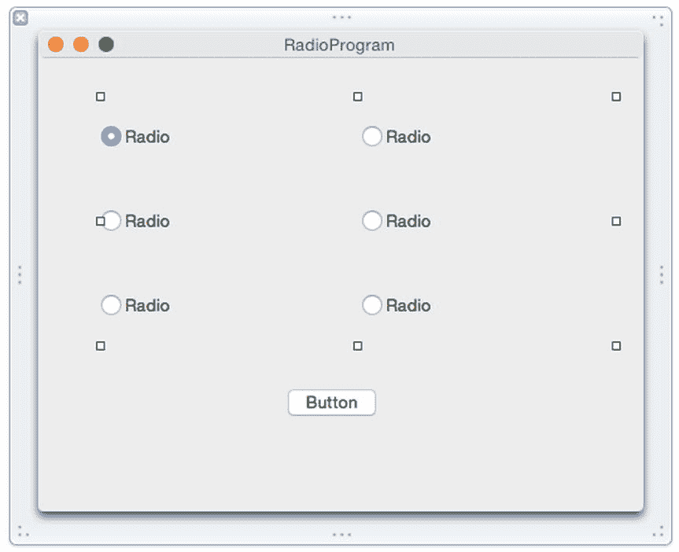

图 16-5.

`RadioProgram` 的用户界面。

25. 将鼠标指针移到下压按钮上，按住 Control 键，然后将鼠标拖到 `AppDelegate.swift` 文件底部的最后一个花括号上。
26. 松开 Control 键和鼠标。会弹出一个窗口。
27. 点击“连接”（Connect）弹出菜单，选择“动作”（Action）。
28. 在“名称”文本字段中，输入 `whichButton`。
29. 在“类型”（Type）弹出菜单中，选择 `NSButton`。Xcode 会创建一个空的 `IBAction` 方法。
30. 按如下方式修改 `IBAction` 方法：

    ```
    @IBAction func whichButton(sender: NSButton) {
    
    var myAlert = NSAlert()
    
    myAlert.messageText = "你点击了标签为 \(radioMatrix.selectedTag()) 的单选按钮"
    
    myAlert.runModal()
    
    }
    ```

31. 选择“产品”（Product）➤“运行”（Run）。你的用户界面会显示出来。
32. 点击一个单选按钮，然后点击下压按钮。会弹出一个提示对话框，显示你选择的单选按钮的标签编号。
33. 点击“确定”（OK）按钮，关闭提示对话框。
34. 选择“RadioProgram”➤“退出 RadioProgram”（Quit RadioProgram）。


## 使用日期选择器

日期选择器能让用户以规范的格式轻松选择日期和/或时间。三种日期选择器外观类型如图 16-7 所示：

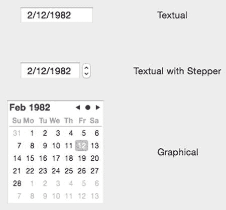

图 16-7.
日期选择器的三种变体

*   **文本型** – 在一个文本字段中显示日期，要求用户手动输入正确的日期。
*   **带步进器的文本型** – 在一个文本字段中显示日期，用户可以通过点击步进器来修改当前选中的日期部分。
*   **图形型** – 显示一个日历，用户可以直接点击选择日期。

可在日期选择器中修改的部分属性如图 16-8 所示：

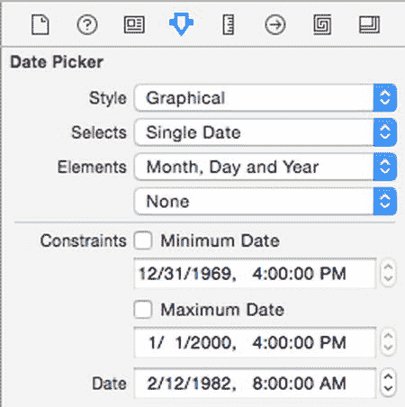

图 16-8.
显示在“属性检查器”面板中的日期选择器属性

*   **样式** – 决定日期选择器的外观。
*   **选择** – 决定用户是选择单个日期还是一个日期范围。
*   **元素** – 决定要显示的日期和时间元素，例如月、日、年、时、分和秒。
*   **最小日期** – 定义最早可能的日期。
*   **最大日期** – 定义最晚可能的日期。
*   **日期** – 定义当前显示的日期和/或时间。

要从日期选择器中获取用户选择的日期，你需要访问 `dateValue` 属性，它代表一个 `NSDate` 类型。

要了解如何使用日期选择器，请遵循以下步骤：

1.  选择“视图” ➤ “助手编辑器” ➤ “显示助手编辑器”。Xcode 会在用户界面旁边显示 `AppDelegate.swift` 文件。
2.  将鼠标指针移到日期选择器上，按住 Control 键，然后将鼠标拖到 `AppDelegate.swift` 文件中的 `IBOutlet` 行下方。
3.  松开 Control 键和鼠标按钮。会弹出一个窗口。
4.  点击“名称”文本字段，输入 `chooseDate`，然后点击“连接”按钮。Xcode 会创建一个 `IBOutlet`，如下所示：
    ```
    @IBOutlet weak var chooseDate: NSDatePicker!
    ```
5.  在 Xcode 中，选择“文件” ➤ “新建” ➤ “项目”。
6.  在 OS X 类别下点击“应用程序”。
7.  点击“Cocoa 应用程序”，然后点击“下一步”按钮。Xcode 现在会要求输入产品名称。
8.  点击“产品名称”文本字段，输入 `DateProgram`。
9.  确保“语言”弹出菜单显示为 Swift，并且所有复选框都处于未选中状态。
10. 点击“下一步”按钮。Xcode 会询问你想要存储项目的位置。
11. 选择一个文件夹来存储你的项目，然后点击“创建”按钮。
12. 在项目导航器面板中点击 `MainMenu.xib` 文件。
13. 点击 `DateProgram` 图标，使用户界面窗口出现。
14. 将一个“按钮”和一个“日期选择器”拖拽到用户界面上。
15. 点击日期选择器，然后选择“视图” ➤ “实用工具” ➤ “显示属性检查器”。
16. 点击“样式”弹出菜单，选择“图形型”，使日期选择器看起来像月历，如图 16-9 所示。

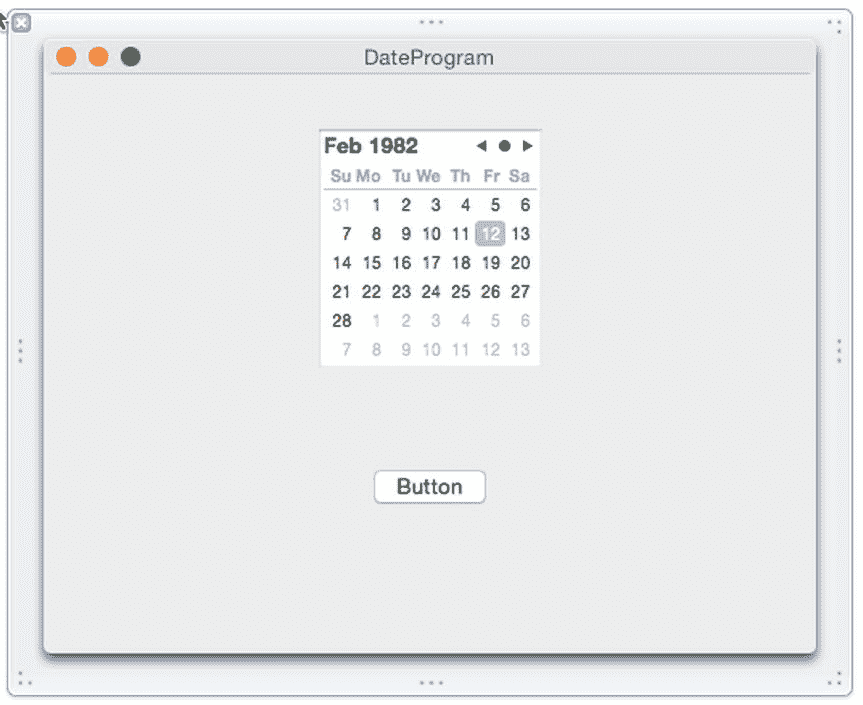

图 16-9.
`DateProgram` 的用户界面

17. 将鼠标指针移到按钮上，按住 Control 键，然后将鼠标拖到 `AppDelegate.swift` 文件底部最后一个大括号的上方。
18. 松开 Control 键和鼠标。会弹出一个窗口。
19. 点击“连接”弹出菜单，选择“动作”。
20. 点击“名称”文本字段，输入 `showDate`。
21. 点击“类型”弹出菜单，选择 `NSButton`。然后点击“连接”按钮。Xcode 会创建一个 IBAction 方法。
22. 按如下方式修改此 IBAction 方法：
    ```
    @IBAction func showDate(sender: NSButton) {
        var myAlert = NSAlert()
        myAlert.messageText = "你选择的日期是 =  \(chooseDate.dateValue)"
        myAlert.runModal()
    }
    ```
23. 选择“产品” ➤ “运行”。你的用户界面会出现。
24. 在日期选择器上选择一个日期，然后点击按钮。会弹出一个警告对话框，显示你选择的日期。
25. 点击“确定”按钮关闭此警告对话框。
26. 选择“DateProgram” ➤ “退出 DateProgram”。

## 使用滑块

滑块可以垂直或水平显示。滑块通过视觉方式表示一个值范围，用户可以通过前后（或上下）拖动滑块来选择其中某个值。一端代表最小值（左侧或底部），另一端代表最大值（右侧或顶部）。为了帮助用户理解滑块代表的不同值，你也可以选择显示刻度线，如图 16-10 所示。

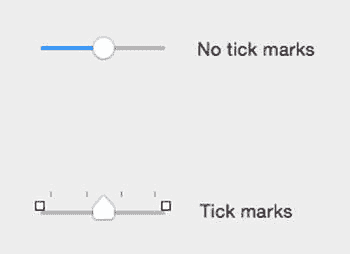

图 16-10.
带刻度线和不带刻度线的滑块外观

需要在滑块上定义的一些比较重要的属性包括：

*   **刻度线** – 定义刻度线的位置以及要显示的刻度线数量。
*   **最小值** – 定义可能的最小值。
*   **最大值** – 定义可能的最大值。
*   **当前值** – 标识滑块首次出现在用户界面时的初始值。

你可以使用 `integerValue` 属性来获取滑块的当前值，并将其显示在其他用户界面元素（如文本字段）中。要了解如何操作，请遵循以下步骤：

1.  选择“视图” ➤ “助手编辑器” ➤ “显示助手编辑器”。Xcode 会在用户界面旁边显示 `AppDelegate.swift` 文件。
2.  将鼠标指针移到水平滑块上，按住 Control 键，然后将鼠标拖到 `AppDelegate.swift` 文件中的 `IBOutlet` 行下方。
3.  松开 Control 键和鼠标。会弹出一个窗口。
4.  点击“名称”文本字段，输入 `mySlider`，然后点击“连接”按钮。
5.  将鼠标指针移到文本字段上，按住 Control 键，然后将鼠标拖到 `AppDelegate.swift` 文件中的 `IBOutlet` 行下方。
6.  松开 Control 键和鼠标。会弹出一个窗口。
7.  点击“名称”文本字段，输入 `sliderValue`，然后点击“连接”按钮。你现在应该有以下两个 `IBOutlet`：
    ```
    @IBOutlet weak var mySlider: NSSlider!
    @IBOutlet weak var sliderValue: NSTextField!
    ```
8.  在 Xcode 中，选择“文件” ➤ “新建” ➤ “项目”。
9.  在 OS X 类别下点击“应用程序”。
10. 点击“Cocoa 应用程序”，然后点击“下一步”按钮。Xcode 现在会要求输入产品名称。
11. 点击“产品名称”文本字段，输入 `SliderProgram`。
12. 确保“语言”弹出菜单显示为 Swift，并且所有复选框都处于未选中状态。
13. 点击“下一步”按钮。Xcode 会询问你想要存储项目的位置。
14. 选择一个文件夹来存储你的项目，然后点击“创建”按钮。
15. 在项目导航器面板中点击 `MainMenu.xib` 文件。
16. 点击 `SliderProgram` 图标，使用户界面窗口出现。
17. 将一个“水平滑块”和一个“文本字段”拖拽到用户界面上，使其看起来如图 16-11 所示。

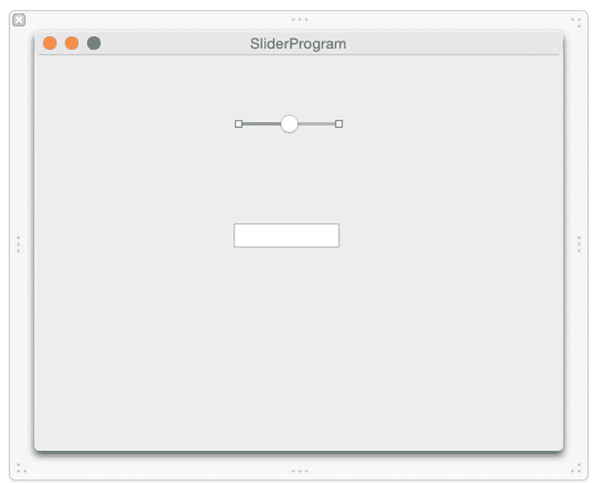

图 16-11.
`SliderProgram` 的用户界面

18. 将鼠标指针移到水平滑块上，按住 Control 键，然后将鼠标拖到 `AppDelegate.swift` 文件底部最后一个大括号的正上方。
19. 松开 Control 键和鼠标。会弹出一个窗口。
20. 点击“连接”弹出菜单，选择“动作”。
21. 点击“名称”文本字段，输入 `getValue`。
22. 点击“类型”弹出菜单，选择 `NSSlider`。然后点击“连接”按钮。Xcode 会创建一个空的 IBAction 方法。
23. 按如下方式修改此 IBAction 方法：
    ```
    @IBAction func getValue(sender: NSSlider) {
        sliderValue.integerValue = mySlider.integerValue
    }
    ```
24. 选择“产品” ➤ “运行”。你的用户界面会出现。
25. 向左和向右拖动滑块。请注意，每次拖动滑块并松开鼠标按钮时，滑块的当前值会显示在文本框中。
26. 选择“SliderProgram” ➤ “退出 SliderProgram”。


## 摘要

复选框、单选按钮和日期选择器可让您为用户提供一系列有效的选项以供选择。这确保了用户不会因误操作（或故意）向程序提供无效数据。

复选框允许用户选择零个或多个选项。一组单选按钮只允许用户选择一个选项。日期选择器则允许用户选择格式正确的日期。

要确定用户选择了哪些复选框，需检查每个复选框的`State`属性。若`State`值为 1，则表示该复选框被选中；若`State`值为 0，则表示该复选框未被选中。

可以在复选框和单选按钮上显示替代文本。这样一来，当复选框或单选按钮被选中时显示一种文本，未被选中时则显示另一种不同的文本。

要确定用户可能选择了哪个单选按钮，您需要使用`Tag`属性。每个单选按钮需要一个唯一的`Tag`值，该值可以是整数。通过识别`Tag`值，您就能确定用户选中的是哪个单选按钮。

日期选择器使用户能够轻松选择日期和/或时间。日期选择器将选定的日期/时间存储为一种特殊的`NSDate`格式，您可以通过日期选择器的`dateValue`属性访问该格式。

滑块允许用户从一系列有效的数值范围内进行选择。通过使用复选框、单选按钮、日期选择器和滑块，程序可以确保用户只能从一系列有效的选项中进行选择。

