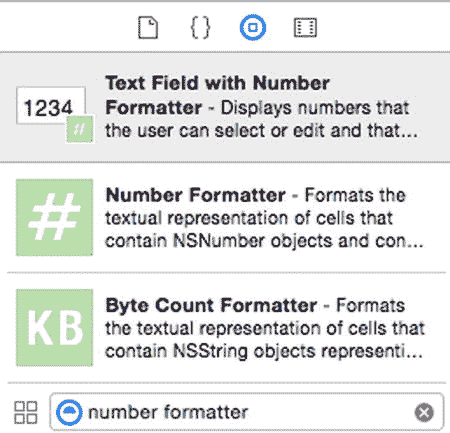
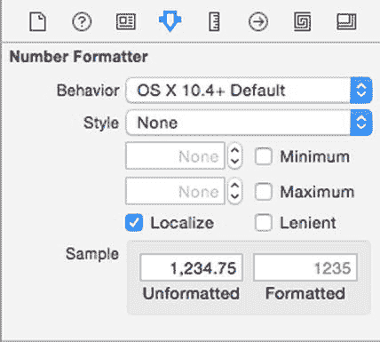
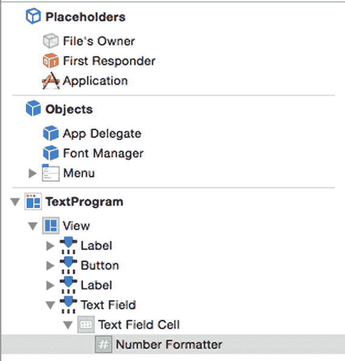
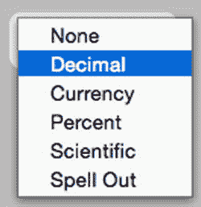
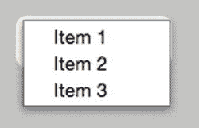
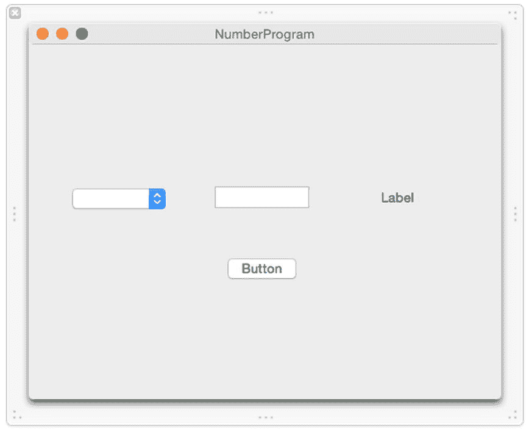
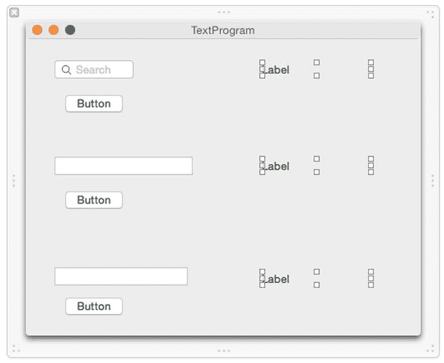
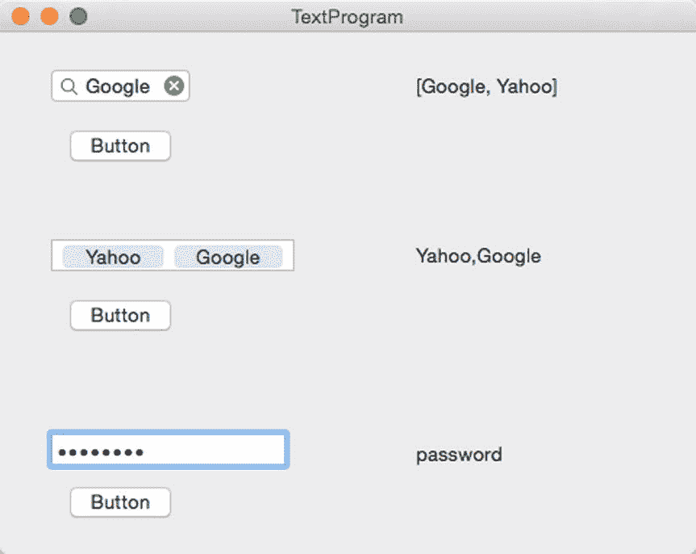
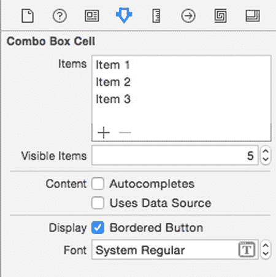
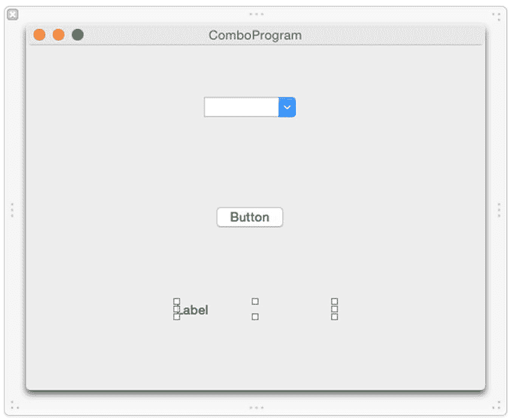

# 17. 在标签、文本字段和组合框中使用文本

电子补充材料 本章的在线版本（doi:10.1007/978-1-4842-1233-2_17）包含补充材料，仅供授权用户使用。

当程序可以为用户提供有限的有效选项范围时，就应使用复选框、单选按钮、日期选择器或滑块。然而，有时程序需要允许用户输入无法提前预判的数据，例如人名。当程序需要允许用户输入数据时，就需要使用文本字段或组合框。

文本字段允许用户输入任何内容，包括数字、特殊字符或普通字母。这意味着程序需要验证用户输入的数据是否有效。

有时，程序可以同时为用户提供从有限有效选项中选择或自行输入数据的选项。例如，一个程序可能要求用户选择一个国家。那么该程序可以提供一组有限的可能性选项，或者让用户自由输入其他内容。

这种既可以从有限选项中选择，也可以自行输入的能力，是组合框的主要优势。组合框得名于它结合了弹出按钮（显示有效选项列表）的功能和像文本字段一样自由输入文本的能力。

虽然文本字段和组合框用于接收用户输入的数据，而标签则用于向用户显示信息。当您只需要显示信息，例如显示说明或指明文本字段的用途（如告诉用户输入姓名或地址）时，就可以使用标签。标签、文本字段和组合框协同工作，在用户界面上接收和显示文本。

## 使用文本字段

由于用户可以在文本字段中输入任何内容，文本字段会将数据存储为字符串，您可以通过`stringValue`属性来获取该字符串。但是，由于用户可以输入整数或小数，文本字段具有足够的通用性来识别这些数字。

如果用户输入的是整数，您可以通过访问`intValue`属性来获取该值。如果用户输入的是小数，您可以通过访问`floatValue`或`doubleValue`属性来获取该值。

无论用户在文本字段中输入什么，您都能获取到相应的值。由于文本字段可以接受字符串或数字，您的程序可以通过访问以下任一属性来获取正确的值：

- `intValue` – 获取整数值。如果用户输入的是字符串，此属性会存储 0。如果用户输入的是小数（如 10.9），则仅存储整数值（如 10）。
- `floatValue` 或 `doubleValue` – 获取单精度或双精度浮点数值。如果用户输入的是字符串，此属性会存储 0.0。如果用户输入的是整数（如 4），`floatValue`和`doubleValue`属性会将其存储为小数（如 4.0）。
- `stringValue` – 获取字符串值。如果用户输入的是数字，它会将该数字存储为字符串（例如“4.305”）。

注意

当用户在文本字段中输入文本时，输入的文本会存储在所有四个属性中：`intValue`、`floatValue`、`doubleValue`和`stringValue`。

除了标准文本字段，Xcode 还提供了几种适用于不同文本输入类型的文本字段变体：

- **带数字格式化器的文本字段** – 定义可以输入的数字类型
- **安全文本字段** – 将输入的文本进行掩码处理
- **搜索字段** – 存储先前输入文本的列表
- **令牌字段** – 允许用户除了输入普通文本外，还可以输入内容令牌


### 使用数字格式化器

数字格式化器允许你定义用户可在文本框中输入的有效数值，例如最小值或最大值，或者特定的数据输入方式，如使用`%`符号，或将数字输入为“four”而不是输入 4。

`Xcode`提供了两种方法来创建带有数字格式化器的文本框。首先，你可以从对象库中拖放“带有数字格式化器的文本框”并将其放置在你的用户界面上。其次，你可以从对象库中拖放“数字格式化器”并将其放置在用户界面上已有的文本框上。

找到这两个项目的最快方法是在对象库底部的搜索文本框中输入“Number Formatter”，如图 17-1 所示。



**图 17-1.** 对象库中的“带有数字格式化器的文本框”和“数字格式化器”

无论你是使用“带有数字格式化器的文本框”项目创建一个新的文本框，还是将“数字格式化器”应用于现有文本框，都需要定义数字格式化器的设置。为此，请按照以下步骤操作：

-   选择**视图 ➤ 实用工具 ➤ 显示属性检查器**。显示属性检查器面板会出现在`Xcode`窗口的右上角，如图 17-3 所示。



**图 17-3.** 显示属性检查器面板

-   点击显示文档大纲图标以显示文档大纲。
-   点击使用数字格式化器的文本框左侧的展开三角形。
-   点击文本框下方的“文本框单元”左侧出现的展开三角形。
-   点击数字格式化器，如图 17-2 所示。



**图 17-2.** 数字格式化器出现在文档大纲中

**最小值**和**最大值**复选框允许你定义文本框可接受的最小值和/或最大值。如果你定义了最小值 10，而用户输入了小于 10 的数字，文本框将不会接受该数字。

**本地化**复选框告诉`Xcode`使用用户的本地设置来确定小数点和货币符号的外观。在世界上的某些地区，小数点使用句点，而在其他地区则使用逗号。货币方面也是如此，欧洲人使用欧元符号，美国人使用美元符号，而英国用户则使用英镑符号。选中**本地化**复选框可确保无论程序在世界哪个地方被使用，文本框数字格式化器都能正常工作。

**样式**弹出菜单允许你定义不同的数字格式方式。当你选择一种**样式**时，**示例**类别下的**未格式化**和**已格式化**文本字段会显示你的数字可能的外观。例如，在图 17-3 中，选择`None`**样式**意味着如果用户在有数字格式化器的文本框中输入`1,234.75`并按下`Return`，文本框会将数字格式化为简单的`1235`。但是，如果**样式**是`Currency`、`Percent`、`Scientific`或`Spell Out`，则意味着用户可以按照`Formatted`示例定义的方式输入数字，而文本框将按照`Unformatted`示例所示的方式存储该数字。

要查看如何使用这些不同的数字格式化器，请按照以下步骤操作：

1.  选择**视图 ➤ 助理编辑器 ➤ 显示助理编辑器**。`AppDelegate.swift`文件会出现在用户界面旁边。
2.  将鼠标指针移到弹出按钮上，按住`Control`键，然后拖到`IBOutlet`行下方。
3.  松开`Control`键和鼠标。将出现一个弹出窗口。
4.  点击**名称**文本字段，输入`popUpChoice`，然后点击**连接**按钮。将出现一个`IBOutlet`。
5.  将鼠标指针移到文本框上，按住`Control`键，然后拖到`IBOutlet`行下方。
6.  松开`Control`键和鼠标。将出现一个弹出窗口。
7.  点击**名称**文本字段，输入`textBox`，然后点击**连接**按钮。
8.  将鼠标指针移到标签上，按住`Control`键，然后拖到`IBOutlet`行下方。
9.  松开`Control`键和鼠标。将出现一个弹出窗口。
10. 点击**名称**文本字段，输入`labelResult`，然后点击**连接**按钮。
11. 点击显示文档大纲图标以显示文档大纲。
12. 将鼠标指针移到数字格式化器上，按住`Control`键，然后拖到`IBOutlet`行下方。
13. 松开`Control`键和鼠标。将出现一个弹出窗口。
14. 点击**名称**文本字段，输入`numberFormat`，然后点击**连接**按钮。

你应得到四条`IBOutlet`行，如下所示：



**图 17-6.** 修改后的弹出按钮菜单

15. 双击**项目 1**，当`Xcode`高亮显示时，输入`None`。
16. 双击**项目 2**，当`Xcode`高亮显示时，输入`Decimal`。
17. 双击**项目 3**，当`Xcode`高亮显示时，输入`Currency`。
18. 从对象库中拖三个菜单项到弹出按钮列表的底部。
19. 分别双击这三个新菜单项，并修改名称使其显示为`Percent`、`Scientific`和`Spell Out`。
20. 双击弹出按钮。`Xcode`会显示一个包含三个选项的列表，分别标记为**项目 1**、**项目 2**和**项目 3**，如图 17-5 所示。



**图 17-5.** 修改弹出按钮

21. 在`Xcode`中，选择**文件 ➤ 新建 ➤ 项目**。
22. 在**OS X**类别下点击**应用程序**。
23. 点击**Cocoa 应用程序**，然后点击**下一步**按钮。`Xcode`现在会要求输入产品名称。
24. 点击**产品名称**文本字段，输入`NumberProgram`。
25. 确保**语言**弹出菜单显示为`Swift`，并且未选中任何复选框。
26. 点击**下一步**按钮。`Xcode`会询问你将项目存储在哪里。
27. 选择存储项目的文件夹，然后点击**创建**按钮。
28. 在项目导航器中点击`MainMenu.xib`文件。你的程序用户界面将会出现。
29. 点击`NumberProgram`图标以显示程序用户界面的窗口。
30. 选择**视图 ➤ 实用工具 ➤ 显示对象库**。对象库会出现在`Xcode`窗口的右下角。
31. 将一个弹出按钮、一个推送按钮和一个带有数字格式化器的文本框拖到用户界面窗口上，使其看起来像图 17-4。



**图 17-4.** NumberProgram 的用户界面

32. `AppDelegate.swift`中的`IBOutlet`行应如下所示：

```
@IBOutlet weak var popUpChoice: NSPopUpButton!
@IBOutlet weak var textBox: NSTextField!
@IBOutlet weak var labelResult: NSTextField!
@IBOutlet weak var numberFormat: NSNumberFormatter!
```

33. 点击隐藏文档大纲图标以隐藏文档大纲。
34. 将鼠标指针移到推送按钮上，按住`Control`键，然后拖到`AppDelegate.swift`文件底部最后一个花括号上方。
35. 松开`Control`键和鼠标按钮。将出现一个弹出窗口。
36. 点击**连接**弹出菜单，并选择**动作**。
37. 点击**名称**文本字段，输入`showResults`。
38. 点击**类型**弹出菜单，选择`NSButton`，然后点击**连接**按钮。`Xcode`会创建一个空的`IBAction`方法。
39. 按如下方式修改`IBAction`方法。


`@IBAction func showResults(sender: NSButton) {`

`if popUpChoice.titleOfSelectedItem! == "None" {`

`numberFormat.numberStyle = NSNumberFormatterStyle.NoStyle`

`} else if popUpChoice.titleOfSelectedItem! == "Decimal" {`

`numberFormat.numberStyle = NSNumberFormatterStyle.DecimalStyle`

`} else if popUpChoice.titleOfSelectedItem! == "Currency" {`

`numberFormat.numberStyle = NSNumberFormatterStyle.CurrencyStyle`

`} else if popUpChoice.titleOfSelectedItem! == "Percent" {`

`numberFormat.numberStyle = NSNumberFormatterStyle.PercentStyle`

`} else if popUpChoice.titleOfSelectedItem! == "Scientific" {`

`numberFormat.numberStyle = NSNumberFormatterStyle.ScientificStyle`

`} else if popUpChoice.titleOfSelectedItem! == "Spell Out" {`

`numberFormat.numberStyle = NSNumberFormatterStyle.SpellOutStyle`

`}`

`labelResult.stringValue = String(stringInterpolationSegment: textBox.doubleValue)`

`}`

选择“产品”➤“运行”。您的用户界面会显示出来。点击弹出按钮，选择“Decimal”（十进制），在文本字段中输入一个十进制数，然后点击“Push Button”（下压按钮）。标签将显示文本字段数值格式化器所包含的结果。点击弹出按钮，选择“Currency”（货币），在文本字段中输入 $4.56，然后点击“Push Button”。标签将显示 4.56。点击弹出按钮，选择“Percent”（百分比），在文本字段中输入 25%，然后点击“Push Button”。标签将显示 0.25。点击弹出按钮，选择“Scientific”（科学计数），在文本字段中输入 1.2E3，然后点击“Push Button”。标签将显示 1200.0。点击弹出按钮，选择“Spell Out”（拼写输出），在文本字段中输入 forty-five，然后点击“Push Button”。标签将显示 45.0。选择“NumberProgram”➤“退出 NumberProgram”。

上述 IBAction 方法中的 Swift 代码使用了 `titleOfSelectedItem` 属性来判断用户选择了哪个选项。然后它使用多个 `if-else if` 语句来更改数值格式化器的 `numberStyle` 属性。

弹出按钮让您可以选择不同的数值格式样式，这样当您在文本字段中输入格式化数字时，就能看到它们的工作效果。通过选择不同的格式样式，您可以观察文本字段如何让您输入不同格式的数字，例如 25%（会被转换为 0.25）或 1.2E3（会被转换为 1200.0）。

### 使用安全文本字段、搜索字段和令牌字段

安全文本字段在用户输入时，会用圆点隐藏文本。这对于掩盖实际文本（如密码、信用卡号或其他敏感信息）非常有用。除了屏蔽输入内容外，安全文本字段的工作方式与普通文本字段完全相同，您可以使用 `intValue`、`floatValue`、`doubleValue` 或 `stringValue` 属性来获取输入的值。

搜索文本字段的外观类似于浏览器中常见的搜索字段，它带有一个放大镜图标和一个可以一键删除搜索字段中文本的关闭图标。每次用户在搜索字段中输入内容并按回车键时，搜索字段都会将文本存储为列表，保存在 `recentSearches` 属性中。

通过访问这个 `recentSearches` 属性，您可以查看用户之前在该搜索字段中输入的所有内容的列表。

令牌字段允许您输入文本，然后将该文本封装在一个令牌中。尽管令牌的外观特殊，您仍然可以通过访问 `stringValue` 属性来获取令牌字段的文本。

要了解如何使用安全文本字段、搜索字段和令牌字段，请按照以下步骤操作：

选择“视图”➤“助理编辑器”➤“显示助理编辑器”。Xcode 将在用户界面旁边显示 `AppDelegate.swift` 文件。将鼠标指针移动到“搜索字段”上，按住 Control 键，然后将鼠标拖到 `AppDelegate.swift` 文件中的 `IBOutlet` 行下方。松开 Control 键和鼠标按钮。将出现一个弹出窗口。点击“名称”文本字段，输入 `searchBox`，然后点击“连接”按钮。将鼠标指针移动到搜索字段右侧的标签上，按住 Control 键，然后将鼠标拖到 `IBOutlet` 行下方。松开 Control 键和鼠标按钮。将出现一个弹出窗口。点击“名称”文本字段，输入 `historyBox`，然后点击“连接”按钮。您应该会得到如下两个 IBOutlet：

```
@IBOutlet weak var searchBox: NSSearchField!
@IBOutlet weak var historyBox: NSTextField!
```

在 Xcode 中，选择“文件”➤“新建”➤“项目”。在 OS X 类别下点击“应用程序”。点击“Cocoa 应用程序”，然后点击“下一步”按钮。Xcode 会要求您输入产品名称。点击“产品名称”文本字段，输入 TextProgram。确保“语言”弹出菜单显示为 Swift，并且所有复选框都处于清除且未选中状态。点击“下一步”按钮。Xcode 会询问您希望将项目存储在何处。选择一个文件夹来存储您的项目，然后点击“创建”按钮。在项目导航面板中点击 MainMenu.xib 文件。点击 TextProgram 图标，使用户界面的窗口显示出来。将三个下压按钮、一个搜索字段、一个令牌字段、一个安全文本字段以及三个调整宽度以扩展的标签拖到用户界面上，如图 17-7 所示。



图 17-7. TextProgram 的用户界面

将鼠标指针移动到“令牌字段”上，按住 Control 键，然后将鼠标拖到 `AppDelegate.swift` 文件中的 `IBOutlet` 行下方。松开 Control 键和鼠标按钮。将出现一个弹出窗口。点击“名称”文本字段，输入 `tokenBox`，然后点击“连接”按钮。将鼠标指针移动到搜索字段右侧的标签上，按住 Control 键，然后将鼠标拖到 `IBOutlet` 行下方。松开 Control 键和鼠标按钮。将出现一个弹出窗口。点击“名称”文本字段，输入 `tokenResult`，然后点击“连接”按钮。您应该会再得到两个 IBOutlet，如下所示：

```
@IBOutlet weak var tokenBox: NSTokenField!
@IBOutlet weak var tokenResult: NSTextField!
```


将鼠标指针移到安全文本字段上，按住 Control 键，然后将鼠标拖到 `AppDelegate.swift` 文件中的 `IBOutlet` 行下方。松开 Control 键和鼠标按钮。此时会弹出一个窗口。在“名称”文本字段中点击，输入 `secureBox`，然后点击“连接”按钮。

将鼠标指针移到搜索字段右侧的标签上，按住 Control 键，然后将鼠标拖到 `IBOutlet` 行下方。松开 Control 键和鼠标按钮。此时会弹出一个窗口。在“名称”文本字段中点击，输入 `secureResults`，然后点击“连接”按钮。此时你应拥有两个 `IBOutlet`，如下所示：

```
@IBOutlet weak var secureBox: NSSecureTextField!
```

```
@IBOutlet weak var secureResults: NSTextField!
```

将鼠标指针移到搜索字段下方的推送按钮上，按住 Control 键，然后将鼠标拖到 `AppDelegate.swift` 文件底部的最后一个花括号上方。松开 Control 键和鼠标。此时会弹出一个窗口。点击“连接”弹出菜单并选择“操作”。在“名称”文本字段中点击并输入 `showHistory`。点击“类型”弹出菜单并选择 `NSButton`。然后点击“连接”按钮。Xcode 会创建一个 `IBAction` 方法。

将鼠标指针移到令牌字段下方的推送按钮上，按住 Control 键，然后将鼠标拖到 `AppDelegate.swift` 文件底部的最后一个花括号上方。松开 Control 键和鼠标。此时会弹出一个窗口。点击“连接”弹出菜单并选择“操作”。在“名称”文本字段中点击并输入 `showToken`。点击“类型”弹出菜单并选择 `NSButton`。然后点击“连接”按钮。Xcode 会创建一个 `IBAction` 方法。

将鼠标指针移到安全文本字段下方的推送按钮上，按住 Control 键，然后将鼠标拖到 `AppDelegate.swift` 文件底部的最后一个花括号上方。松开 Control 键和鼠标。此时会弹出一个窗口。点击“连接”弹出菜单并选择“操作”。在“名称”文本字段中点击并输入 `showSecret`。点击“类型”弹出菜单并选择 `NSButton`。然后点击“连接”按钮。Xcode 会创建一个 `IBAction` 方法。

按如下方式修改这些 `IBAction` 方法：

```
@IBAction func showHistory(sender: NSButton) {
    historyBox.stringValue = String(stringInterpolationSegment: searchBox.recentSearches)
}
```

```
@IBAction func showToken(sender: NSButton) {
    tokenResult.stringValue = tokenBox.stringValue
}
```

```
@IBAction func showSecret(sender: NSButton) {
    secureResults.stringValue = secureBox.stringValue
}
```

选择“文本程序”➤“退出文本程序”。选择“产品”➤“运行”。你的用户界面会出现。在搜索字段中点击，输入 `Yahoo`，然后按回车键。点击关闭图标（灰色圆圈中的 X）以清除搜索字段，输入 `Google`，然后按回车键。点击搜索字段下方的推送按钮。注意，右侧的标签会显示两个搜索结果。

在令牌字段中点击，输入 `Yahoo`，然后按回车键。注意，令牌字段会将你输入的文本以令牌形式显示。在令牌字段中点击，并在 Yahoo 令牌旁边输入 `Google`，然后按回车键。点击令牌字段下方的推送按钮。注意，右侧的标签会显示你的两个令牌文本。

在安全文本字段中点击，输入 `password`。注意，安全文本字段会遮罩该文本。点击安全文本字段下方的推送按钮。注意，右侧的标签会显示安全文本字段中的文本，如图 17-8 所示。



**图 17-8.** 文本程序的运行结果

尽管搜索字段、令牌字段和安全文本字段外观不同，但在需要访问其中存储的值时，它们的行为与文本字段完全一致。

## 使用组合框

文本字段允许用户输入任何内容，而弹出按钮则显示固定的选项范围。当你希望显示固定的选项范围并允许用户输入文本时，就可以使用组合框。

组合框基于 `NSComboBox` 类，而该类又基于定义所有文本字段的 `NSTextField` 类。因此，你可以使用 `intValue`、`floatValue`、`doubleValue` 或 `stringValue` 属性从组合框中检索值。

使用组合框时，有两种方式填充其弹出选项列表。首先，你可以使用“显示属性检查器”面板创建一个内部列表。其次，你可以使用外部数据源，使组合框从数据库文件或通过互联网检索数据。


### 创建内部列表

当你事先确切知道要在组合框中存储多少个项目以及具体是哪些项目时（例如国家列表或产品名称列表），内部列表是最佳选择。要创建内部列表，请遵循以下步骤：

在程序界面上放置一个组合框。点击选中该组合框。选择 `View ➤ Utilities ➤ Show Attributes Inspector`。“Items”列表将出现，如图 17-9 所示。



图 17-9. “Items”列表允许你定义要在组合框中显示的项目

要编辑列表中的现有项目，点击该项目将其选中，然后按下 `Return` 键。现在你就可以编辑文本了。

要移除现有项目，点击该项目将其选中，然后点击减号图标。

要添加新项目，点击加号图标。然后点击新添加的项目，按下 `Return` 键，并编辑文本。

“Visible Items”文本字段定义了组合框菜单显示的项目数量。

“Autocompletes”复选框允许组合框显示其列表中与用户开始输入内容相匹配的项目。因此，如果用户输入一个字母，自动完成功能会显示组合框列表中所有以该字母开头的项目。

“Uses Data Source”复选框决定组合框是使用其内部“Items”列表来显示菜单项，还是从其他来源检索数据。如果选中了“Uses Data Source”复选框，那么你需要编写 Swift 代码来填充组合框数据。

要了解如何使用内部列表填充组合框，请遵循以下步骤：

选择 `View ➤ Assistant Editor ➤ Show Assistant Editor`。Xcode 会在用户界面旁边显示 `AppDelegate.swift` 文件。将鼠标指针移到组合框上，按住 `Control` 键，将鼠标拖到 `AppDelegate.swift` 文件中 `IBOutlet` 行的下方。松开 `Control` 键和鼠标。此时会弹出一个窗口。点击“Name”文本字段，输入 `myCombo`，然后点击“Connect”按钮。将鼠标指针移到标签上，按住 `Control` 键，将鼠标拖到 `AppDelegate.swift` 文件中 `IBOutlet` 行的下方。松开 `Control` 键和鼠标。此时会弹出一个窗口。点击“Name”文本字段，输入 `comboResult`，然后点击“Connect”按钮。现在你应该拥有这两个 `IBOutlet`：

在 Xcode 中选择 `File ➤ New ➤ Project`。在 OS X 类别下点击“Application”。点击“Cocoa Application”，然后点击“Next”按钮。Xcode 现在会要求输入产品名称。点击“Product Name”文本字段，输入 `ComboProgram`。确保“Language”弹出菜单显示为 Swift，并且所有复选框均为清除状态且未选中。点击“Next”按钮。Xcode 会询问你希望将项目存储在哪里。选择一个文件夹来存储项目，然后点击“Create”按钮。在项目导航窗格中点击 `MainMenu.xib` 文件。点击“ComboProgram”图标以显示用户界面窗口。将一个“Combo Box”、一个“Push Button”和一个 Label 拖到用户界面上，并加宽标签，使其看起来如图 17-10 所示。



图 17-10. `ComboProgram` 的用户界面

```
@IBOutlet weak var myCombo: NSComboBox!
@IBOutlet weak var comboResult: NSTextField!
```

将鼠标指针移到 Push Button 上，按住 `Control` 键，将鼠标拖到 `AppDelegate.swift` 文件底部最后一个花括号的上方。松开 `Control` 键和鼠标。此时会弹出一个窗口。点击“Connection”弹出菜单，选择“Action”。点击“Name”文本字段，输入 `showResult`。点击“Type”弹出菜单，选择 `NSButton`。然后点击“Connect”按钮。Xcode 会创建一个空的 `IBAction` 方法。按如下方式修改此 `IBAction` 方法：

```
@IBAction func showResult(sender: NSButton) {
    comboResult.stringValue = myCombo.stringValue
}
```

选择 `Product ➤ Run`。你的用户界面会显示出来。点击组合框并输入 `Hello`。点击 Push Button。单词 `Hello` 会出现在标签中。点击组合框右侧边缘的向下箭头以显示其项目列表。由于我们没有修改默认列表，组合框列表包含三个项目，分别标记为 `Item 1`、`Item 2` 和 `Item 3`。点击 `Item 3`，然后点击 Push Button。下方的标签会显示 `Item 3`。选择 `ComboProgram ➤ Quit ComboProgram`。

此示例使用了组合框的默认项目列表。尝试添加或修改此组合框项目列表，并选中“Autocompletes”复选框，以了解这些选项如何修改组合框的行为。


### 使用数据源

当组合框需要显示可能随时间变化的数据时（例如显示来自数据库的信息列表），使用数据源是最佳方式。要使用数据源，你需要编写 Swift 代码。首先，你需要在类中遵循 `NSComboBoxDataSource` 协议，如下所示：

```
class AppDelegate: NSObject, NSApplicationDelegate, NSComboBoxDataSource {
```

接下来，你需要编写两个函数。一个函数需要计算要在组合框中显示的项数。第二个函数需要检索数据以插入到组合框的项列表中。

最后，你需要指定一个数据源（包含你想在组合框中显示的数据的文件），并确保在“显示属性检查器”窗格中选中了组合框的 `usesDataSource` 属性，或者通过 Swift 代码将其设置为 `true`。

要了解数据源如何将项列表填充到组合框中，请按以下步骤操作：

确保 `ComboProgram` 项目已在 Xcode 中加载。修改类名以包含 `NSComboBoxDataSource` 协议，如下所示：

```
class AppDelegate: NSObject, NSApplicationDelegate, NSComboBoxDataSource {
```

在“项目导航器”窗格中点击 `AppDelegate.swift` 文件。在 `IBOutlet` 行下方，添加以下行以创建一个将填充组合框项列表的字符串数组：

```
let myArray = ["三明治", "薯片", "苏打水", "沙拉"]
```

修改 `applicationDidFinishLaunching` 函数，如下所示：

```
func applicationDidFinishLaunching(aNotification: NSNotification) {

    // 在此处插入代码以初始化你的应用程序
    myCombo.dataSource = self
    myCombo.usesDataSource = true
    numberOfItemsInComboBox(myCombo)
    comboBox(myCombo, objectValueForItemAtIndex: 0)

}
```

这段 Swift 代码将组合框的数据源（由 `myCombo` IBOutlet 标识）定义为 `self`，这意味着同一个类同时也是数据源。它确保 `usesDataSource` 属性为 `true` 以使用数据源。然后它调用了由 `NSComboBoxDataSource` 协议定义的两个函数。

在 IBAction 方法上方，添加以下两个函数实现：

```
func numberOfItemsInComboBox(aComboBox: NSComboBox) -> Int {
    return myArray.count
}

func comboBox(aComboBox: NSComboBox, objectValueForItemAtIndex index: Int) -> AnyObject {
    return myArray[index]
}
```

`numberOfItemsInComboBox` 函数计算 `myArray` 数组中的所有项并返回该整数。`comboBox` 函数将每个数组项放入组合框的项列表中。

选择“产品”➤“运行”。点击组合框向下的箭头。注意其项列表包含了 `myArray` 中定义的项（“三明治”、“薯片”、“苏打水”和“沙拉”）。在组合框中点击“三明治”以选中它，然后点击按钮。注意下方的标签显示“三明治”。选择“ComboProgram”➤“退出 ComboProgram”。

这个简单的程序展示了如何从另一个数据源（本例中是一个名为 `myArray` 的数组）检索项列表，以填充组合框的项列表。`AppDelegate.swift` 文件的完整代码应如下所示：

```
import Cocoa

@NSApplicationMain
class AppDelegate: NSObject, NSApplicationDelegate, NSComboBoxDataSource {

    @IBOutlet weak var window: NSWindow!
    @IBOutlet weak var myCombo: NSComboBox!
    @IBOutlet weak var comboResult: NSTextField!

    let myArray = ["三明治", "薯片", "苏打水", "沙拉"]

    func applicationDidFinishLaunching(aNotification: NSNotification) {
        // 在此处插入代码以初始化你的应用程序
        myCombo.usesDataSource = true
        myCombo.dataSource = self
        numberOfItemsInComboBox(myCombo)
        comboBox(myCombo, objectValueForItemAtIndex: 0)
    }

    func applicationWillTerminate(aNotification: NSNotification) {
        // 在此处插入代码以终止应用程序
    }

    func numberOfItemsInComboBox(aComboBox: NSComboBox) -> Int {
        return myArray.count
    }

    func comboBox(aComboBox: NSComboBox, objectValueForItemAtIndex index: Int) -> AnyObject {
        return myArray[index]
    }

    @IBAction func showResult(sender: NSButton) {
        comboResult.stringValue = myCombo.stringValue
    }

}
```

## 总结

文本字段允许用户输入任何内容，例如数字或字符串，因此文本字段提供了多个属性（`intValue`、`floatValue`、`doubleValue` 和 `stringValue`）以将输入的信息存储为适当的数据类型。要限制用户可能输入的数字信息，你可以使用数字格式化器来定义最小值和/或最大值，同时定义用户可以输入数字数据的不同方式，例如使用百分号或货币符号。

除了普通的文本字段外，Xcode 还提供了几种用于特定目的的文本字段变体。标签仅用于显示文本，不允许用户编辑显示的文本。安全文本字段会屏蔽输入的数据，以防止被窥视。令牌字段将输入的数据显示为组或令牌，而搜索字段则提供了一个属性来记住之前输入的数据。

组合框结合了文本字段和弹出按钮的功能。组合框可以显示一个有效选项列表，用户可以点击这些选项，也可以自行输入数据。你可以在“显示属性检查器”窗格中定义组合框的选项列表，也可以从其他来源（如数组）检索数据。

文本字段和组合框的主要目的是让用户能够输入任何类型的数据。当用户输入数据时，你可能需要编写 Swift 代码来验证输入的数据对你的程序是否确实有效。

