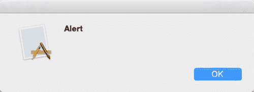
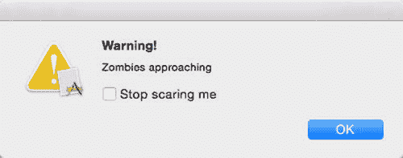
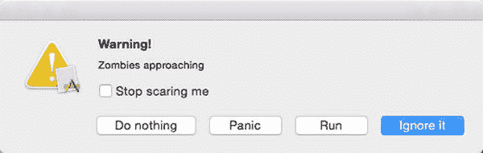
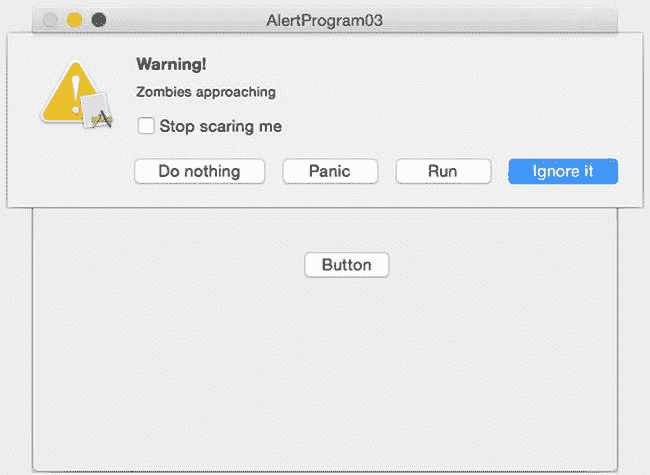
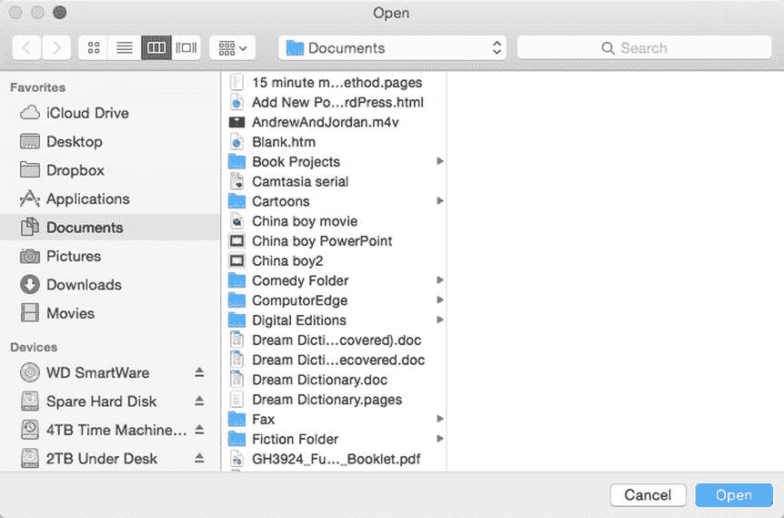
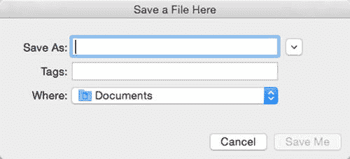
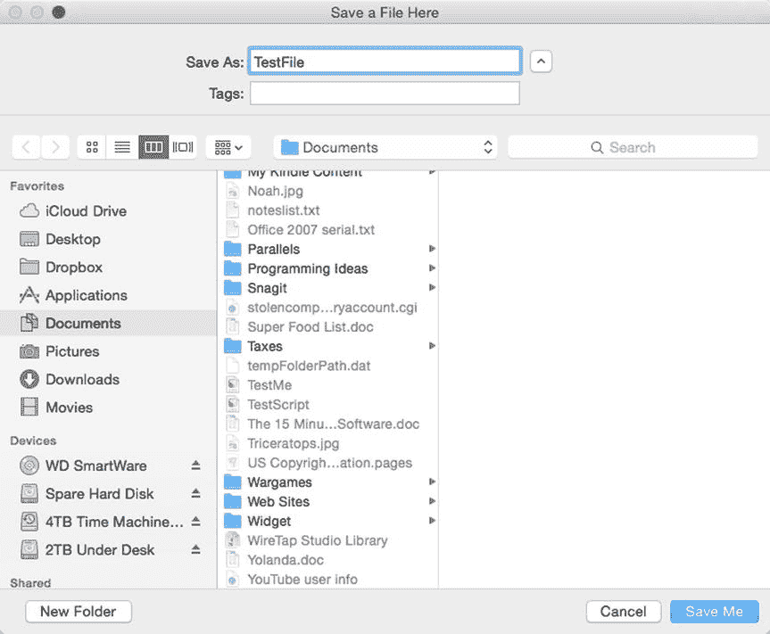

# 18. 使用警告和面板

电子补充材料 本章的在线版本 (doi:[10.1007/978-1-4842-1233-2_18](http://dx.doi.org/10.1007/978-1-4842-1233-2_18)) 包含补充材料，可供授权用户使用。

在每个程序中，你都需要设计程序的独特功能，同时让 Cocoa 框架负责让你的程序看起来和表现得像标准的 OS X 程序。几乎所有 OS X 程序的两个常见功能是警告和面板。

警告通常会弹出在屏幕上以通知用户，例如要求用户确认删除文件，或提醒用户出现问题。面板显示常见的用户界面项目，例如 OS X 程序通常显示打印面板以提供打印选项，或用于选择文件的打开面板。

通过使用警告和面板，你可以添加常见的 OS X 用户界面元素，而无需创建自己的用户界面或编写 Swift 代码。警告和面板是 Cocoa 框架的一部分，你的 OS X 程序可以使用它们来创建标准的 OS X 用户界面。


## 使用提醒

提醒功能基于 Cocoa 框架中的 `NSAlert` 类。在最简单的层面上，你可以用两行 Swift 代码创建一个提醒：

```
var myAlert = NSAlert()
myAlert.runModal()
```

第一行声明了一个基于 `NSAlert` 类的名为 `myAlert` 的对象。接着第二行使用 `runModal()` 方法来显示该提醒。当提醒出现时，它被认为是模态的，这意味着在用户关闭提醒之前，应用不会让用户执行任何其他操作。

上述两行代码创建了一个通用的提醒，它显示一个“确定”按钮、一个通用图形图像和一条通用文本消息，如图 18-1 所示。



图 18-1. 创建一个通用提醒

要自定义提醒，你可以修改以下属性：

- `messageText` – 以粗体显示主要提醒消息。在图 18-1 中，“Alert”就是 `messageText`。
- `informativeText` – 在 `messageText` 正下方显示非粗体文本。在图 18-1 中，没有 `informativeText`。
- `icon` – 显示一个图标。默认情况下，图标是程序的图标。
- `alertStyle` – 当设置为 `NSAlertStyle.CriticalAlertStyle` 时，显示一个关键图标。否则显示默认的提醒图标。
- `showsSuppressionButton` – 显示一个复选框，其默认文本为“不再显示此消息”，除非定义了 `suppressionButton?.title`。
- `suppressionButton?.title` – 用自定义文本替换复选框的默认文本（“不再显示此消息”）。

要了解如何自定义提醒，请按照以下步骤操作：

在 Xcode 中，选择“文件” ➤ “新建” ➤ “项目”。在“OS X”分类下点击“应用程序”。点击“Cocoa 应用程序”，然后点击“下一步”按钮。Xcode 现在会要求输入产品名称。点击“产品名称”文本字段，然后输入 `AlertProgram`。确保“语言”弹出菜单显示为 Swift，并且没有选中任何复选框。点击“下一步”按钮。Xcode 会询问你想在哪里存储项目。选择一个文件夹来存储你的项目，然后点击“创建”按钮。在项目导航器中点击 `MainMenu.xib` 文件。你的程序用户界面就会出现。点击 `AlertProgram` 图标以显示你程序用户界面的窗口。选择“视图” ➤ “工具” ➤ “显示对象库”。对象库会出现在 Xcode 窗口的右下角。将一个“下压按钮”拖到用户界面窗口上。选择“视图” ➤ “助理编辑器” ➤ “显示助理编辑器”。`AppDelegate.swift` 文件会出现在你的用户界面旁边。将鼠标指针移到下压按钮上，按住 Control 键，然后将鼠标拖到 `AppDelegate.swift` 文件底部最后一个花括号的上方。松开 Control 键和鼠标按钮。会弹出一个窗口。点击“连接”弹出菜单，然后选择“操作”。点击“名称”文本字段，然后输入 `showAlert`。点击“类型”弹出菜单，选择 `NSButton`，然后点击“连接”按钮。Xcode 会创建一个空的 `IBAction` 方法。按如下方式修改 `IBAction` 方法：

```
@IBAction func showAlert(sender: NSButton) {
    var myAlert = NSAlert()
    myAlert.messageText = "Warning!"
    myAlert.informativeText = "Zombies approaching"
    myAlert.alertStyle = NSAlertStyle.CriticalAlertStyle
    myAlert.showsSuppressionButton = true
    myAlert.suppressionButton?.title = "Stop scaring me"
    myAlert.runModal()
}
```

点击提醒上的“确定”按钮使其消失。选择“AlertProgram” ➤ “退出 AlertProgram”。选择“产品” ➤ “运行”。你的用户界面就会出现。点击下压按钮。会显示一个提醒，如图 18-2 所示。



图 18-2. 显示一个自定义提醒

### 从提醒处获取反馈

提醒通常只显示一个“确定”按钮，以便用户可以关闭提醒。然而，提醒可以通过以下两种方式之一从用户处获取反馈：

- 选择抑制复选框
- 点击“确定”按钮以外的按钮

要判断用户是否选择了抑制复选框，你需要访问 `suppressionButton!.state` 属性。如果复选框被选中，`suppressionButton!.state` 属性的值为 1。如果复选框未被选中，该属性的值为 0。

从提醒处获取反馈的第二种方式是在提醒上显示两个或更多按钮。要向提醒添加更多按钮，你需要使用 `addButtonWithTitle` 方法。然后，要确定用户点击了哪个按钮，你需要使用 `NSAlertFirstButtonReturn`、`NSAlertSecondButtonReturn` 或 `NSAlertThirdButtonReturn` 常量。

如果你的提醒上有四个或更多按钮，你可以通过使用 `NSAlertThirdButtonReturn + 1` 来检测第四个按钮，使用 `NSAlertThirdButtonReturn + 2` 来检测第五个按钮，以此类推，处理第三个按钮之后的每个额外按钮。

要了解如何在提醒中识别用户选择了哪些选项，请按照以下步骤操作：

确保你的 `AlertProgram` 项目已在 Xcode 中加载。在“项目导航器”窗格中点击 `AppDelegate.swift` 文件。按如下方式修改 `IBAction showAlert` 方法：

```
@IBAction func showAlert(sender: NSButton) {
    var myAlert = NSAlert()
    myAlert.messageText = "Warning!"
    myAlert.informativeText = "Zombies approaching"
    myAlert.alertStyle = NSAlertStyle.CriticalAlertStyle
    myAlert.showsSuppressionButton = true
    myAlert.suppressionButton?.title = "Stop scaring me"
    myAlert.addButtonWithTitle("Ignore it")
    myAlert.addButtonWithTitle("Run")
    myAlert.addButtonWithTitle("Panic")
    myAlert.addButtonWithTitle("Do nothing")
    let choice = myAlert.runModal()
    switch choice {
    case NSAlertFirstButtonReturn:
        print ("User clicked Ignore it")
    case NSAlertSecondButtonReturn:
        print ("User clicked Run")
    case NSAlertThirdButtonReturn:
        print ("User clicked Panic")
    case NSAlertThirdButtonReturn + 1:
        print ("User clicked Do nothing")
    default: break
    }
    if myAlert.suppressionButton!.state == 1 {
        print ("Checked")
    } else {
        print ("Not checked")
    }
}
```

`addButtonWithTitle` 方法在提醒上创建按钮，其中第一个 `addButtonWithTitle` 方法创建一个默认按钮，其他的 `addButtonWithTitle` 方法创建额外的按钮。为了捕获用户点击的按钮，上述代码创建了一个名为“choice”的常量。

然后它使用一个 switch 语句来识别用户点击了哪个按钮。请注意，第四个按钮是通过在 `NSAlertThirdButtonReturn` 常量上加 1 来标识的。

`suppressionButton!.state` 属性检查用户是否选择了出现在提醒上的复选框。如果其值为 1，则表示用户选中了该复选框。否则，如果其值为 0，则表示复选框未被选中。

点击“Stop scaring me”复选框以选中它。点击其中一个按钮，例如“Panic”或“Run”。无论你点击哪个按钮，提醒都会消失。选择“AlertProgram” ➤ “退出 AlertProgram”。Xcode 会再次出现，并在调试区域中显示文本，例如“User clicked Panic”和“Checked”。选择“产品” ➤ “运行”。你的用户界面就会出现。点击该按钮。提醒如图 18-3 所示。



图 18-3. 由 Swift 代码创建的提醒


### 以工作表形式显示警告

警告通常以模态对话框的形式出现，它会创建一个独立于主程序窗口并可单独移动的窗口。另一种显示警告的方式是作为工作表，它看起来像是从当前活动窗口的标题栏向下展开。

要使警告以工作表形式显示，你需要使用 `beginSheetModalForWindow` 方法，如下所示：

`alertObject.beginSheetModalForWindow(window, completionHandler: closure)`

第一个参数定义了你希望工作表出现的窗口。在 `AlertProgram` 项目中，代表用户界面窗口的 `IBOutlet` 被称为 `window`。第二个参数是完成处理器的标签，它标识了一个称为闭包的特殊函数的名称。

闭包代表了一种编写函数的简写方式。不必像这样以传统方式编写函数：

```
func functionName(parameters) -> Type {
// 在此处插入代码
return value
}
```

你可以像这样编写闭包：

```
let closureName = { (parameters) -> Type in
// 在此处插入代码
}
```

要了解如何将警告转换为工作表并使用闭包，请遵循以下步骤：

确保你的 `AlertProgram` 项目已在 Xcode 中加载。在项目导航窗格中点击 `AppDelegate.swift` 文件。修改 `IBAction showAlert` 方法如下：

```
@IBAction func showAlert(sender: NSButton) {
var myAlert = NSAlert()
myAlert.messageText = "警告！"
myAlert.informativeText = "僵尸正在逼近"
myAlert.alertStyle = NSAlertStyle.CriticalAlertStyle
myAlert.showsSuppressionButton = true
myAlert.suppressionButton?.title = "别再吓我了"
myAlert.addButtonWithTitle("忽略它")
myAlert.addButtonWithTitle("逃跑")
myAlert.addButtonWithTitle("恐慌")
myAlert.addButtonWithTitle("什么都不做")
let myCode = { (choice:NSModalResponse) -> Void in
switch choice {
case NSAlertFirstButtonReturn:
print ("用户点击了“忽略它”")
case NSAlertSecondButtonReturn:
print ("用户点击了“逃跑”")
case NSAlertThirdButtonReturn:
print ("用户点击了“恐慌”")
case NSAlertThirdButtonReturn + 1:
print ("用户点击了“什么都不做”")
default: break
}
if myAlert.suppressionButton!.state == 1 {
print ("已勾选")
} else {
print ("未勾选")
}
}
myAlert.beginSheetModalForWindow(window, completionHandler: myCode)
}
```

点击“别再吓我了”复选框以选中它。点击其中一个按钮，例如“恐慌”或“逃跑”。无论你点击哪个按钮，警告都会消失。选择 **AlertProgram** ➤ **退出 AlertProgram**。Xcode 重新出现，并在调试区域显示文本，例如 `User clicked Run` 和 `Checked`。选择 **产品** ➤ **运行**。用户界面出现。点击该按钮。现在请注意，警告会像图 18-4 所示的那样以工作表形式下拉。



**图 18-4.** 作为工作表的警告

在上述 Swift 代码中，闭包定义如下：

```
let myCode = { (choice:NSModalResponse) -> Void in
switch choice {
case NSAlertFirstButtonReturn:
print ("用户点击了“忽略它”")
case NSAlertSecondButtonReturn:
print ("用户点击了“逃跑”")
case NSAlertThirdButtonReturn:
print ("用户点击了“恐慌”")
case NSAlertThirdButtonReturn + 1:
print ("用户点击了“什么都不做”")
default: break
}
if myAlert.suppressionButton!.state == 1 {
print ("已勾选")
} else {
print ("未勾选")
}
}
```

然而，你也可以将闭包内联放置，这意味着完成处理器不是标识闭包名称，而是直接将闭包本身放在那个位置。因此，在上述代码中，`beginSheetModalForWindow` 方法通过名称调用闭包，如下所示：

`myAlert.beginSheetModalForWindow(window, completionHandler: myCode)`

你可以将闭包名称“`myCode`”替换为实际的闭包代码，如下所示：

`myAlert.beginSheetModalForWindow(window, completionHandler: { (choice:NSModalResponse) -> Void in`

```
switch choice {
case NSAlertFirstButtonReturn:
print ("用户点击了“忽略它”")
case NSAlertSecondButtonReturn:
print ("用户点击了“逃跑”")
case NSAlertThirdButtonReturn:
print ("用户点击了“恐慌”")
case NSAlertThirdButtonReturn + 1:
print ("用户点击了“什么都不做”")
default: break
}
if myAlert.suppressionButton!.state == 1 {
print ("已勾选")
} else {
print ("未勾选")
}
```

`})`

在方法中直接内联放置闭包可以缩短你需要编写的代码量，但可能以牺牲整体代码的可读性为代价。通过名称分离闭包，然后按名称调用它，可以让你在程序的其他地方更容易地重用该闭包（如果需要），但也会迫使你编写更多代码，不过代码会更清晰。

选择你最喜欢的方法，但就像编程的各个方面一样，坚持使用一种风格，以便日后如果你不在场解释代码的运行方式，其他程序员也能轻松理解你的代码。

## 使用面板

面板代表了 OS X 程序所需的常见用户界面元素，例如显示一个“打开”面板让用户选择要打开的文件，以及一个“保存”面板让用户选择文件夹来存储文件。“打开”面板基于 `NSOpenPanel` 类，而“保存”面板基于 `NSSavePanel` 类。


### 创建打开面板

打开面板让用户可以选择要打开的文件。如果用户选择了文件，打开面板需要返回一个文件名。打开面板使用的一些属性包括：

- `canChooseFiles` – 允许用户选择一个文件。
- `canChooseDirectories` – 允许用户选择一个文件夹或目录。
- `allowsMultipleSelection` – 允许用户选择多个项目。
- `URLs` – 保存所选项目的名称。如果`allowsMultipleSelection`属性设置为`true`，则`URLs`属性保存一个项目数组。否则，它保存单个项目。

要了解如何使用打开面板，请按照以下步骤操作：

在 Xcode 中选择 File ➤ New ➤ Project。在 OS X 类别下点击 Application。点击 Cocoa Application，然后点击 Next 按钮。Xcode 现在会要求您输入产品名称。点击 Product Name 文本字段并输入`PanelProgram`。确保 Language 弹出菜单显示 Swift，并且未选中任何复选框。点击 Next 按钮。Xcode 会询问您希望将项目存储在哪里。选择一个文件夹来存储您的项目，然后点击 Create 按钮。在 Project Navigator 中点击`MainMenu.xib`文件。您的程序用户界面将出现。点击`PanelProgram`图标以显示程序用户界面的窗口。选择 View ➤ Utilities ➤ Show Object Library。Object Library 会出现在 Xcode 窗口的右下角。将一个 Push Button 拖到用户界面窗口上，双击它以将其标题更改为 Open。选择 View ➤ Assistant Editor ➤ Show Assistant Editor。`AppDelegate.swift`文件会出现在您的用户界面旁边。将鼠标指针移到按钮上，按住 Control 键，然后将鼠标拖到`AppDelegate.swift`文件底部最后一个花括号的上方。松开 Control 键和鼠标按钮。会弹出一个窗口。点击 Connect 弹出菜单并选择 Action。点击 Name 文本字段并输入`openPanel`。点击 Type 弹出菜单，选择`NSButton`，然后点击 Connect 按钮。Xcode 会创建一个空的 IBAction 方法。按如下所示修改 IBAction 方法：

```
@IBAction func openPanel(sender: NSButton) {
    var myOpen = NSOpenPanel()
    myOpen.canChooseFiles = true
    myOpen.canChooseDirectories = true
    myOpen.allowsMultipleSelection = true
    myOpen.beginWithCompletionHandler { (result) -> Void in
        if result == NSFileHandlingPanelOKButton {
            print (myOpen.URLs)
        }
    }
}
```

选择 Product ➤ Run。用户界面将出现。点击该按钮。一个打开面板将出现，如图 18-5 所示。



图 18-5。

打开面板。按住 Command 键并点击两个不同的项目，例如两个不同的文件，或一个文件和一个文件夹。点击 Open 按钮。选择 PanelProgram ➤ Quit PanelProgram。Xcode 将再次出现。在 Debug 区域，您应该会看到您所选择的文件/文件夹列表。

注意：打开面板仅用于选择文件/文件夹，您仍然需要编写 Swift 代码来实际打开用户选择的任何文件。

### 创建保存面板

保存面板的外观与打开面板相似，但其目的是让用户选择一个文件夹并定义一个文件名来保存。如果用户选择了文件，保存面板需要返回一个文件名。保存面板使用的一些属性包括：

- `title` – 在保存面板顶部显示文本。如果未定义，默认显示“Save”。
- `prompt` – 在默认按钮上显示文本。
- `URL` – 保存用户选择的路径名和文件名。
- `nameFieldStringValue` – 仅保存用户选择的文件名。

要了解如何使用保存面板，请按照以下步骤操作：

确保`PanelProgram`已加载到 Xcode 中。在 Project Navigator 窗格中点击`MainMenu.xib`文件。将一个 Push Button 拖到用户界面上，双击它以将其标题更改为 Save。选择 View ➤ Assistant Editor ➤ Show Assistant Editor。Xcode 会在用户界面旁边显示`AppDelegate.swift`文件。将鼠标指针移到 Save 按钮上，按住 Control 键，然后将鼠标拖到`AppDelegate.swift`文件中`IBOutlet`行下方。松开 Control 键和鼠标。会弹出一个窗口。点击 Connection 弹出菜单并选择 Action。点击 Name 文本字段，输入`savePanel`，然后点击 Connect 按钮。点击 Type 弹出菜单并选择`NSButton`。然后点击 Connect 按钮。Xcode 会创建一个空的 IBAction 方法。按如下所示修改此 IBAction 方法：

```
@IBAction func savePanel(sender: NSButton) {
    var mySave = NSSavePanel()
    mySave.title = "Save a File Here"
    mySave.prompt = "Save Me"
    mySave.beginWithCompletionHandler { (result) -> Void in
        if result == NSFileHandlingPanelOKButton {
            print (mySave.URL)
            print (mySave.nameFieldStringValue)
        }
    }
}
```

选择 Product ➤ Run。您的用户界面将出现。点击 Save 按钮。一个保存面板将出现，如图 18-6 所示。请注意，`title`属性创建了显示在保存面板顶部的文本，而`prompt`属性创建了显示在保存面板右下角默认按钮上的文本。



图 18-6。

紧凑型保存面板。点击“Save As”文本字段最右侧出现的 Expand 按钮。保存面板将展开，如图 18-7 所示。



图 18-7。

展开后的保存面板。点击“Save As”文本字段并输入`TestFile`。点击 Save Me 按钮。选择 PanelProgram ➤ Quit PanelProgram。Xcode 窗口将再次出现。在 Xcode 窗口底部的 Debug Area 中，您应该会看到您所选择的文件和文件夹的完整路径名，以及您输入的完整文件名。

## 总结

在设计标准的 OS X 用户界面时，您不必自己创建所有内容。通过利用 Cocoa 框架，您可以创建外观和行为与其他 OS X 程序相似的警告和面板，而无需编写太多额外的代码。

警告让您可以向用户显示简短的消息，例如警告。您可以使用文本和图形自定义警告，并在警告上放置两个或更多按钮。如果您在警告上放置了两个或更多按钮，则需要编写 Swift 代码来识别用户点击了哪个按钮。

警告通常作为单独的窗口出现，但您也可以使其作为从窗口标题栏下拉的工作表出现。

面板显示常用的用户界面项目，例如用于选择要打开的文件的打开面板，以及用于选择文件夹和文件名以保存数据的保存面板。打开和保存面板是 Cocoa 框架的一部分，但您需要编写额外的 Swift 代码才能使打开和保存面板实际打开文件或将文件保存到硬盘。

警告和面板让您无需编写太多额外代码即可创建标准的 OS X 用户界面元素。通过使用 Cocoa 框架的这些功能，您可以创建可靠运行且行为符合用户预期的标准 OS X 程序。


