# 19. 创建下拉菜单

电子补充材料 本章在线版本（doi:[10.1007/978-1-4842-1233-2_19](http://dx.doi.org/10.1007/978-1-4842-1233-2_19)）包含补充材料，仅供授权用户使用。

下拉菜单是与 OS X 程序交互的标准方式。虽然你的程序可以显示按钮来表示命令，但按钮过多会使屏幕显得杂乱。为了避免在屏幕上挤入过多按钮，可以将相关命令分组到多个下拉菜单中。默认情况下，Xcode 为每个 OS X 项目创建以下下拉菜单标题：

- **文件** – 显示用于打开、保存、创建和打印的命令。
- **编辑** – 显示用于复制、剪切、粘贴、撤销和重做命令的命令。
- **格式** – 显示用于修改文本或图形的命令，例如更改字体或对齐文本。
- **视图** – 显示用于更改数据在窗口中显示方式的命令，例如缩放或显示其他用户界面项（如工具栏）。
- **窗口** – 显示用于操作文档窗口的命令，例如在多个打开的窗口之间切换。
- **帮助** – 显示用于获取程序使用帮助的命令。

除了使用标准下拉菜单标题外，你还可以添加自己的标题或删除现有标题。为了组织下拉菜单中的命令，你可以使用水平线将相似命令分组，或将它们存储在子菜单中。为了方便用户，你还可以为命令分配快捷键。

下拉菜单是用户控制程序的标准方式。通过为你自己的程序创建下拉菜单，你可以构建一个熟悉的用户界面，让其他人无需额外培训或经过很少培训就能快速学习和使用你的程序。

## 编辑下拉菜单

每次创建 Cocoa 应用程序项目时，Xcode 都会创建一个包含常用菜单标题和命令的默认下拉菜单。无需编写一行 Swift 代码，其中许多命令就能正常工作。例如，应用程序菜单（你的程序名称，例如 `MenuProgram`）下的“退出”命令知道如何退出程序，而“窗口”菜单标题下的“缩放”和“最小化”命令知道如何缩放和最小化用户界面窗口。

在大多数情况下，你需要通过编辑现有命令、添加新命令和删除现有命令来自定义这些下拉菜单。要修改程序的下拉菜单，你有两个选择：

- 直接编辑下拉菜单
- 打开文档大纲并编辑菜单

要直接编辑下拉菜单，请单击项目导航器窗格中的 `.xib` 或 `.storyboard` 文件，然后直接单击程序的下拉菜单，如图 19-1 所示。

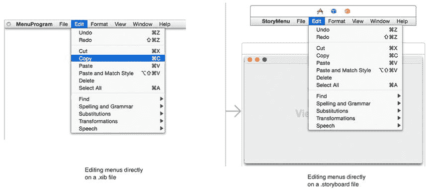

图 19-1。你可以直接单击程序的下拉菜单来选择单个项目

编辑下拉菜单的第二种方法是单击“显示文档大纲”图标打开文档大纲，如图 19-2 所示。

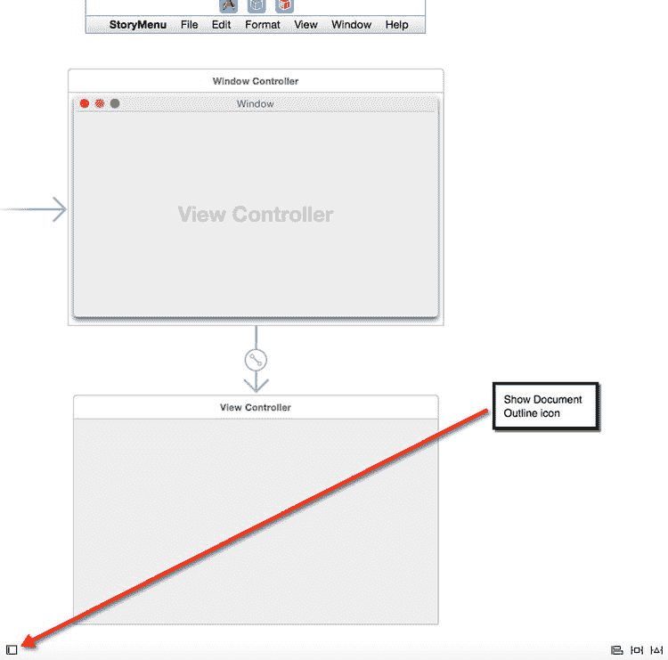

图 19-2。“显示文档大纲”图标

打开文档大纲后，你可以单击展开三角形来查看不同的下拉菜单及其命令，如图 19-3 所示。

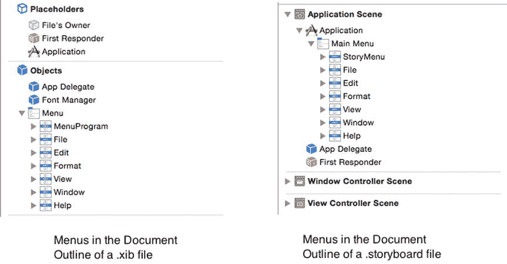

图 19-3。在文档大纲窗格中查看菜单

要删除菜单项，请单击选中它（通过直接单击下拉菜单项或在文档大纲窗格中单击菜单项），然后按退格键或删除键。这样可以删除单个菜单项或整个菜单标题，例如“文件”或“编辑”下拉菜单标题。

注意：如果不小心删除了菜单项或整个下拉菜单标题，只需选择**编辑 ➤ 撤销**或按下 `Command+Z` 即可立即恢复。

要向程序的下拉菜单添加项目，你有两个选择：

- 向现有的下拉菜单标题（如“文件”或“编辑”）添加新菜单项
- 添加一个新的下拉菜单标题，该标题包含自己的命令

### 向菜单栏添加新的下拉菜单标题

你可以直接在下拉菜单上或文档大纲内添加菜单项和下拉菜单标题。

对象库显示以下下拉菜单标题，你可以将它们添加到程序的菜单栏中，如图 19-4 所示：

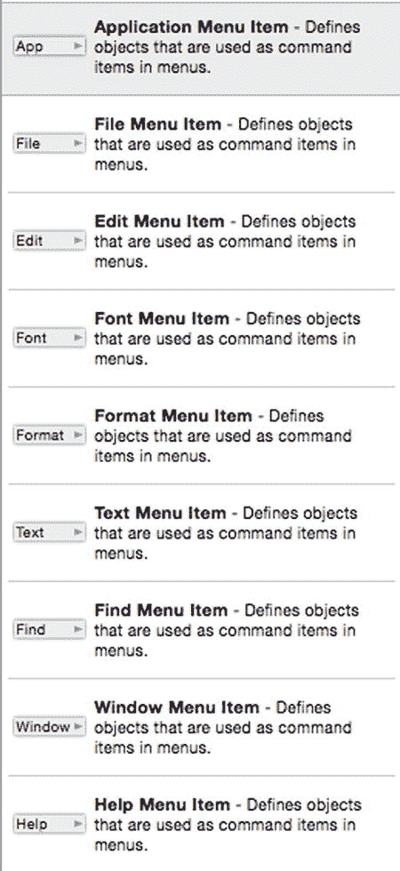

图 19-4。可以添加到程序菜单栏的下拉菜单标题

- **应用程序菜单项** – 包含应用程序下拉菜单标题中的典型命令，例如“关于”、“偏好设置”和“服务”。
- **文件菜单项** – 包含文件下拉菜单标题中的典型命令，例如“打开”、“新建”和“保存”。
- **编辑菜单项** – 包含编辑下拉菜单标题中的典型命令，例如“剪切”、“复制”和“粘贴”。
- **字体菜单项** – 包含字体下拉菜单标题中的典型命令，例如“粗体”、“放大”和“复制样式”。
- **格式菜单项** – 包含格式下拉菜单标题中的典型命令，例如“字体”和“文本”。
- **文本菜单项** – 包含文本下拉菜单标题中的典型命令，例如“居中”、“书写方向”和“显示标尺”。
- **查找菜单项** – 包含查找下拉菜单标题中的典型命令，例如“查找”、“查找与替换”和“查找下一个”。
- **窗口菜单项** – 包含窗口下拉菜单标题中的典型命令，例如“最小化”、“置于顶层”和“缩放”。
- **帮助菜单项** – 包含帮助下拉菜单标题中的典型命令，例如“应用程序帮助”。

要将下拉菜单标题添加到程序的菜单栏，请执行以下步骤：

单击项目导航器窗格中的 `.xib` 或 `.storyboard` 文件。选择**视图 ➤ 工具 ➤ 显示对象库**以在 Xcode 窗口的右下角显示对象库。从对象库中拖拽一个下拉菜单项（参见图 19-4），将鼠标移动到程序的菜单栏上方，直到出现一条蓝色竖线，显示下拉菜单标题将出现的位置，如图 19-5 所示。

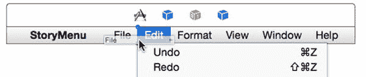

图 19-5。向菜单栏添加新的下拉菜单标题

除了将鼠标拖拽到程序的菜单栏上，你也可以将鼠标拖拽到文档大纲中的下拉菜单标题之间，直到出现一条蓝色横线，显示菜单标题将出现的位置，如图 19-6 所示。

释放鼠标。新的下拉菜单标题就会出现在菜单栏上。

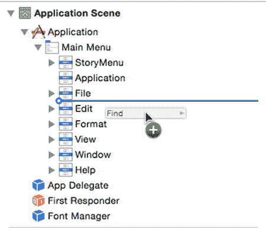

图 19-6。使用文档大纲向菜单栏添加新的下拉菜单标题

要重新排列下拉菜单标题，请将鼠标指针移动到要移动的菜单标题上（位于菜单栏或文档大纲中），然后拖拽鼠标将菜单标题移动到新位置。


### 向下拉菜单添加新命令

你可以随时在任何下拉菜单上删除、重新排列和添加命令。要删除命令，只需选中它并按 `Backspace` 或 `Delete` 键。要重新排列命令，将其拖放到新位置即可。

要向下拉菜单添加新命令，你需要使用来自 `Object Library` 的以下三个项目，如图 19-7 所示：

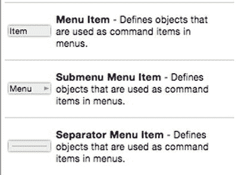

图 19-7. 用于修改下拉菜单上命令的三个项目

- `Menu Item` – 表示单个命令。
- `Submenu Menu Item` – 表示一个包含附加命令的子菜单。
- `Separate Menu Item` – 显示一条水平线，用于分隔下拉菜单上的命令。

要向下拉菜单添加新命令，请遵循以下步骤：

1.  释放鼠标。`Xcode` 会将你的新菜单项添加到下拉菜单中。如果你添加的是 `Submenu Menu Item`，现在即可编辑其子菜单中存储的命令。
2.  从 `Object Library` 中拖动一个菜单项（见图 19-7），并将鼠标移动到下拉菜单列表中，直到出现一条水平蓝色线，指示该命令将出现的位置，如图 19-9 所示。

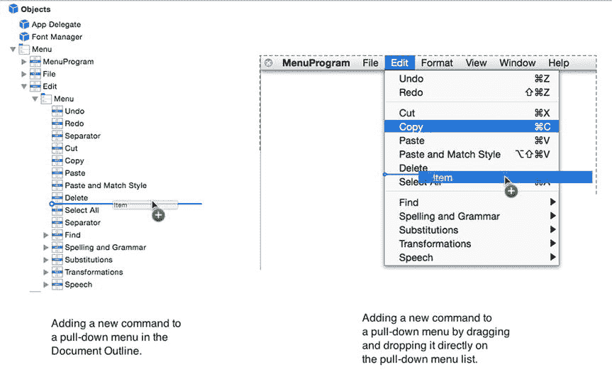

图 19-9. 在下拉菜单列表中拖放新命令

3.  在 `Project Navigator` 窗格中点击 `.xib` 或 `.storyboard` 文件。
4.  选择 `View` ➤ `Utilities` ➤ `Show Object Library`，以在 `Xcode` 窗口的右下角显示 `Object Library`。
5.  点击你想要添加新命令的下拉菜单。你可以直接点击菜单栏上的下拉菜单标题，或者点击展开三角形以打开 `Document Outline` 中的下拉菜单标题，如图 19-8 所示。

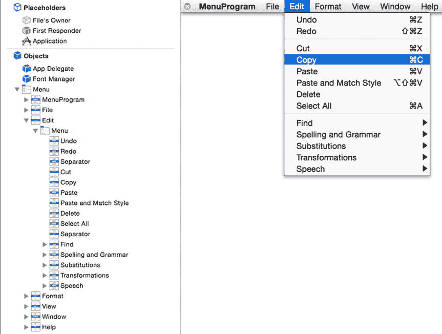

图 19-8. 你可以直接在下拉菜单上或通过 `Document Outline` 添加新命令

### 编辑命令

一旦你修改了菜单栏上出现的下拉菜单标题以及每个下拉菜单上出现的命令，你或许还想使用 `Inspector` 窗格进一步编辑每个命令。`Inspector` 窗格对于修改以下属性非常有用：

- `Title` – 显示菜单命令的文本。
- `Key Equivalent` – 为命令定义快捷键。

要编辑命令（或下拉菜单标题），请遵循以下步骤：

1.  在 `Inspector` 窗格中点击 `Title` 文本字段以编辑命令的文本。
2.  点击 `Key Equivalent` 文本字段，然后按下（而非输入）你想要分配给命令的快捷键。确保此快捷键未被其他命令占用（例如用于 `Cut` 命令的 `Command+X`）。`Xcode` 会在下拉菜单中该命令的右侧显示你的快捷键。
3.  在 `Project Navigator` 窗格中点击 `.xib` 或 `.storyboard` 文件。
4.  点击你想要编辑的下拉菜单命令（或下拉菜单标题）。可以在 `Document Outline` 中点击，也可以直接点击下拉菜单本身。
5.  选择 `View` ➤ `Utilities` ➤ `Show Attributes Inspector`。此时将显示 `Show Attributes Inspector` 窗格，如图 19-10 所示。

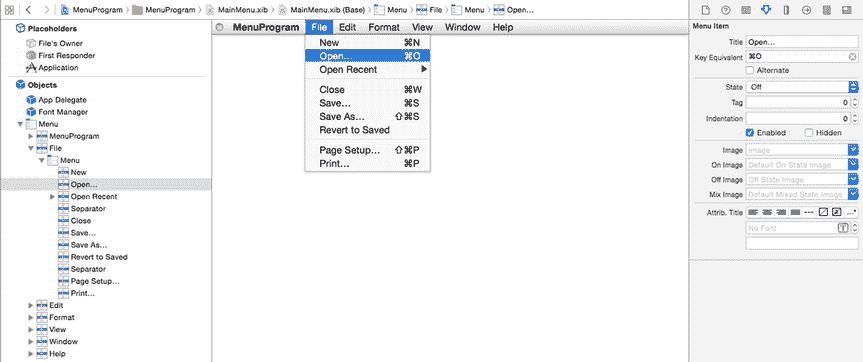

图 19-10. 在下拉菜单列表中拖放新命令

### 将菜单命令连接到 Swift 代码

一旦你修改了下拉菜单标题并用适当的命令填充了它们，你最终需要让这些命令实际执行操作。这意味着将你的菜单命令链接到 `IBAction` 方法，就像将按钮或其他用户界面项连接到包含 Swift 代码的文件一样。你可以从下拉菜单上的菜单命令本身，或者从 `Document Outline` 中显示的菜单命令进行 `Control-drag` 操作。

当你创建一个 Cocoa 应用程序项目时，你会发现许多菜单命令已经可以工作，例如 `File` ➤ `Print`、`Window` ➤ `Minimize` 以及应用程序名称 ➤ `About` 命令。这些功能由 Cocoa 框架中的 `NSApplication`、`NSWindow`、`NSView` 和 `NSResponder` 类提供。

如果你点击 Cocoa 应用程序项目中的某个菜单命令，然后选择 `View` ➤ `Utilities` ➤ `Show Connections Inspector`，你会在 `Xcode` 窗口的右上角看到 `Connections Inspector` 窗格。

`Connections Inspector` 窗格让你可以看到选中的用户界面项（如下拉菜单上的命令）连接到了什么，如图 19-11 所示。

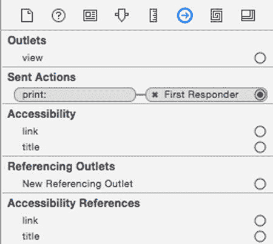

图 19-11. `Connections Inspector` 窗格显示用户界面连接到了哪个 `IBAction` 方法

通常，当你查看用户界面项的 `Connections Inspector` 时，你会在左侧看到 `IBAction` 方法的名称（例如 `print`），并且有一条线将其连接到实际存储该 `IBAction` 方法的文件（例如 `AppDelegate`）。

在图 19-11 中，`File` 菜单上的 `Print` 菜单命令连接到了 `print` `IBAction` 方法，但此 `IBAction` 方法并未存储在特定文件中。相反，它连接到了名为 `First Responder` 的对象，该对象由 `NSResponder` 类定义。

用户界面由多个基于 `NSApplication`、`NSWindow` 和 `NSView` 的对象组成，因此 `First Responder` 仅指向应首先响应用户点击用户界面项（例如 `File` 菜单上的 `Print` 命令）的对象。如果这个第一个对象没有 `print` `IBAction` 方法，那么它会搜索下一个对象中的这个 `IBAction` 方法。

因此，如果你在窗口上有一个文本字段，并点击 `File` 菜单上的 `Print` 命令，`Print` 命令会首先在该文本字段中查找 `print` `IBAction` 方法（文本字段基于 `NSTextfield`，而 `NSTextfield` 又基于 `NSView`）。如果在 `NSTextfield` 类中找不到 `print` `IBAction` 方法，它会接着在窗口（基于 `NSWindow`）或应用程序本身（基于 `NSApplication`）中查找。

如果你点击 `First Responder` 图标，然后选择 `View` ➤ `Utilities` ➤ `Show Connections Inspector`，你可以看到 `First Responder` 的 `Connections Inspector` 窗格，其中标识了连接到典型 Cocoa 应用程序项目默认下拉菜单的所有 `IBAction` 方法，如图 19-12 所示。

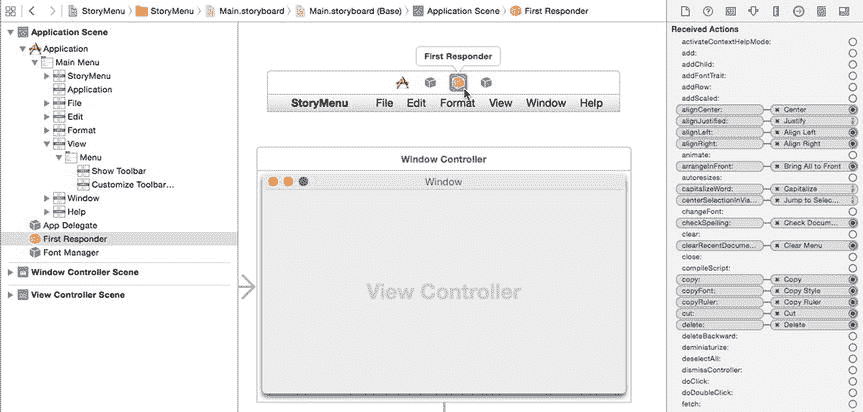

图 19-12. `First Responder` 的 `Connections Inspector` 窗格列出了连接到 Cocoa 应用程序项目默认下拉菜单的所有 `IBAction` 方法

> **注:** 查看 `Connections Inspector` 的另一种方法是右键点击 `First Responder` 图标。

尽管 Cocoa 应用程序模板创建了标准的下拉菜单和命令，你仍然需要编写 Swift 代码才能使其中许多命令实际工作。例如，`Save` 命令不知道要保存什么或如何保存，而 `New` 命令不知道要创建哪种类型的文档。

要了解菜单命令如何像其他用户界面项一样与 `IBAction` 方法配合使用，请遵循以下步骤。


选择“View ➤ Assistant Editor ➤ Show Assistant Editor”。`AppDelegate.swift`文件会出现在用户界面旁边。将鼠标指针悬停在文本字段上，按住`Control`键，然后拖动鼠标到`AppDelegate.swift`文件中`IBOutlet`行的下方。松开`Control`键和鼠标按钮，会出现一个弹出窗口。在“Name”文本字段中点击，输入`textResult`，然后点击“Connect”按钮，这样你的`IBOutlet`应如下所示：

在 Xcode 中选择“File ➤ New ➤ Project”。  
点击“OS X”类别下的“Application”。  
点击“Cocoa Application”，然后点击“Next”按钮。Xcode 会要求输入产品名称。  
点击“Product Name”文本字段，输入`MenuProgram`。  
确保“Language”弹出菜单显示为“Swift”，并且没有勾选任何复选框。  
点击“Next”按钮。Xcode 会询问项目存储位置。  
选择一个文件夹来存储项目，然后点击“Create”按钮。  

点击项目导航器中的`MainMenu.xib`文件。程序用户界面会显示出来。  
点击`MenuProgram`图标以显示程序用户界面的窗口。  
选择“View ➤ Utilities ➤ Show Object Library”。对象库会出现在 Xcode 窗口的右下角。  
将一个文本字段拖拽到用户界面窗口上。你可能需要加宽文本字段的宽度。  
将一个菜单项从对象库拖拽到“File”菜单的底部。你可以将菜单项拖拽到“File”下拉菜单中，或者拖拽到文档大纲中，如图 19-13 所示。

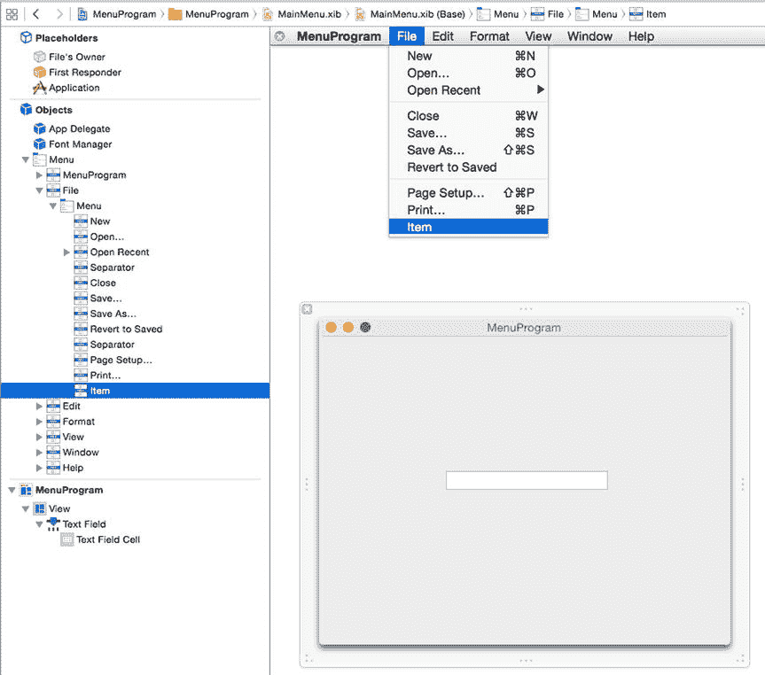

**图 19-13.** 将菜单项拖拽到“File”下拉菜单的底部

`@IBOutlet weak var textResult: NSTextField!`

将鼠标指针悬停在你刚刚添加到“File”下拉菜单底部的菜单项上（无论是在下拉菜单中还是在文档大纲中），按住`Control`键，然后拖动鼠标到`AppDelegate.swift`文件底部最后一个花括号的上方。松开`Control`键和鼠标按钮，会出现一个弹出窗口。点击“Connection”弹出菜单，选择“Action”。在“Name”文本字段中点击，输入`myMenu`。点击“Type”弹出菜单，选择`NSMenuItem`，然后点击“Connect”按钮。Xcode 会创建一个空的`IBAction`方法。按如下方式修改`IBAction`方法：

```
@IBAction func myMenu(sender: NSMenuItem) {

    textResult.stringValue = "Clicked on = " + sender.title    
}
```

松开`Control`键和鼠标按钮。Xcode 将“Save”命令连接到`myMenu IBAction`方法。  
选择“Product ➤ Run”。用户界面会显示出来。  
点击“File”菜单标题。注意，你添加的菜单项（标签为“Item”）会出现在“File”下拉菜单的底部。  
点击“Save”命令。文本字段会显示“Clicked on = Save…”。  
点击“File”菜单标题，然后点击你添加的菜单项“Item”。文本字段会显示“Clicked on = Item.”。  
选择“MenuProgram ➤ Quit MenuProgram”。  
点击出现在“First Responder”左侧的关闭图标（X）。这会切断“Save”命令与`saveDocument IBAction`方法之间的连接。  
将鼠标指针悬停在“File”下拉菜单中的“Save”命令上，按住`Control`键，然后拖动鼠标到你第 22 步创建的`myMenu IBAction`方法上。确保 Xcode 高亮了整个`IBAction`方法，并显示“Connect Action”，如图 19-15 所示。

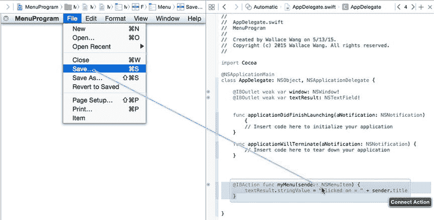

**图 19-15.** 将“Save”命令连接到现有的`IBAction`方法

点击“File”下拉菜单中的“Save”命令。  
选择“View ➤ Utilities ➤ Show Connections Inspector”。“Connections Inspector”面板会显示“Save”命令已连接到“First Responder”中的`saveDocument IBAction`方法，如图 19-14 所示。

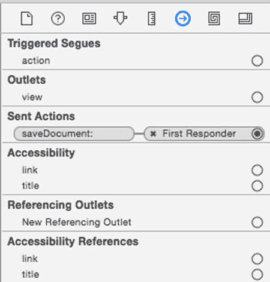

**图 19-14.** “File”下拉菜单中“Save”命令的“Connections Inspector”

`MenuProgram`项目演示了如何将菜单命令连接到文本字段，以便文本字段显示用户点击的菜单命令名称。但是，在使用故事板时，连接菜单命令的方式略有不同。

主要区别在于，在故事板中，下拉菜单存储在与实际用户界面不同的场景中，如图 19-16 所示。

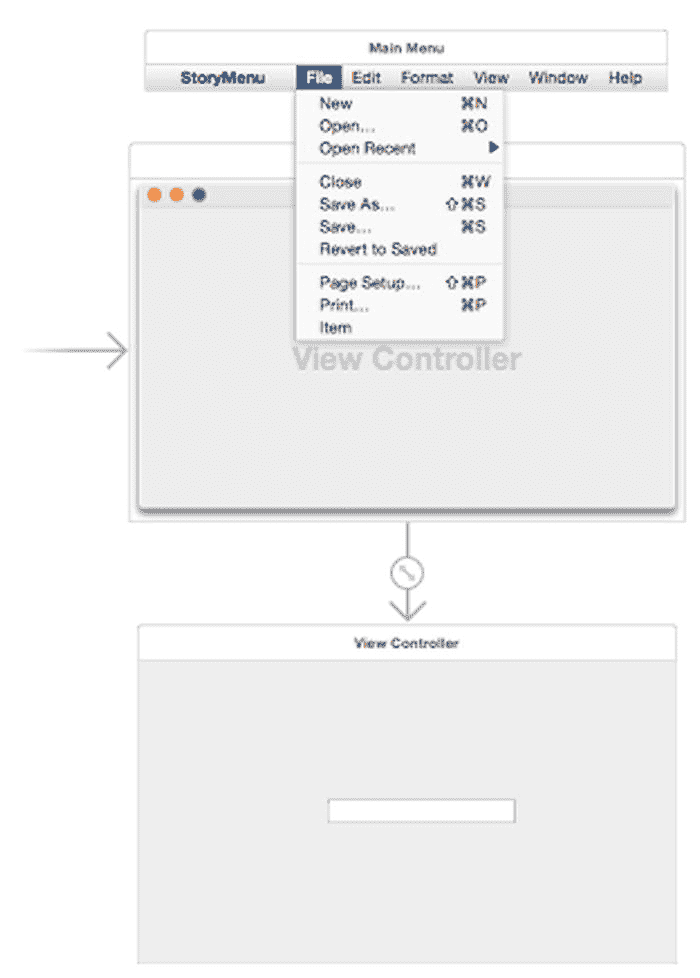

**图 19-16.** 在故事板中，下拉菜单出现在与用户界面不同的场景中

这意味着，当你按住`Control`键拖拽下拉菜单命令时，Xcode 会将你的 Swift 代码存储在`AppDelegate.swift`文件中；但如果你按住`Control`键拖拽用户界面元素（如文本字段），Xcode 会将你的 Swift 代码存储在`ViewController.swift`文件中。

本质上，这意味着如果你为文本字段创建了一个`IBOutlet`，它会存储在`ViewController.swift`文件中，而你的下拉菜单命令的`IBAction`方法存储在`AppDelegate.swift`文件中，因此`IBOutlet`不知道`IBAction`方法的存在（反之亦然）。

解决此问题的方法是将下拉菜单命令连接到“First Responder”图标。这意味着你的程序将首先在其`AppDelegate.swift`文件中查找`IBAction`方法，但随后也会在其他文件中查找相同的`IBAction`方法。

诀窍是在`AppDelegate.swift`文件中创建一个空的`IBAction`方法，并在`ViewController.swift`文件中创建一个完全相同的`IBAction`方法，不同之处在于你需要填写第二个`IBAction`方法中的 Swift 代码，使其能够检索所选菜单命令的标题。

要了解菜单命令如何与故事板配合使用，请按照以下步骤操作：

在 Xcode 中选择“File ➤ New ➤ Project”。  
点击“OS X”类别下的“Application”。  
点击“Cocoa Application”，然后点击“Next”按钮。Xcode 会要求输入产品名称。  
点击“Product Name”文本字段，输入`StoryMenu`。  
确保“Language”弹出菜单显示为“Swift”，并且只勾选了“Use storyboards”复选框。  
点击“Next”按钮。Xcode 会询问项目存储位置。  
选择一个文件夹来存储项目，然后点击“Create”按钮。  

点击项目导航器中的`Main.storyboard`文件。程序用户界面会显示出来。  
选择“View ➤ Utilities ➤ Show Object Library”，将一个文本字段拖拽到用户界面（由标题栏中的“View Controller”标识）上。你可能需要加宽文本字段的宽度。  
选择“View ➤ Assistant Editor ➤ Show Assistant Editor”。Xcode 会在用户界面旁边显示`ViewController.swift`文件。  
将鼠标指针悬停在文本字段上，按住`Control`键，然后拖动鼠标到`class ViewController`行的下方。  
松开`Control`键和鼠标。会出现一个弹出窗口。在“Name”文本字段中点击，输入`textResult`，然后点击“Connect”按钮。Xcode 会创建以下`IBOutlet`：

```
@IBOutlet weak var textResult: NSTextField!
```


点击 `myMenu`。将鼠标指针移至 `File` 下拉菜单中的 `Save` 命令上。按住 Control 键并从 `Save` 命令拖拽至 `First Responder` 图标。松开 `Control` 键和鼠标。此时会出现一个弹出菜单（参见图 19-18）。点击 `myMenu`。选择 `View` ➤ `Standard Editor` ➤ `View Standard Editor`，以便在 Xcode 窗口中仅显示一个文件。点击 `Project Navigator` 面板中的 `ViewController.swift` 文件。将光标移至 `ViewController.swift` 文件最后一个花括号的上方，然后选择 `Edit` ➤ `Paste`。Xcode 会粘贴您在第 20 步创建的 `IBAction` 方法。按如下方式修改此 IBAction 方法：松开 `Control` 键和鼠标。此时会出现一个如图 19-18 所示的弹出菜单。

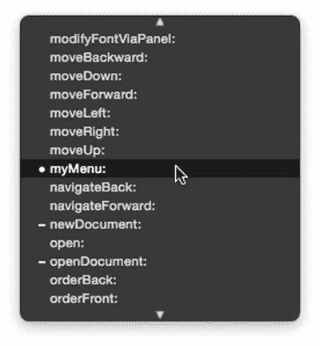

图 19-18。

将菜单命令连接到 `First Responder` 图标。点击 `File` 下拉菜单以显示其完整列表。此时助理编辑器应显示 `AppDelegate.swift` 文件。将 `Object Library` 中的 `Menu Item` 拖拽至 `File` 下拉菜单的底部。将鼠标指针移至您刚刚添加到 `File` 下拉菜单底部的新 `Menu Item` 上，按住 `Control` 键，然后将鼠标拖拽至 `AppDelegate.swift` 文件底部最后一个花括号的上方。此时会出现一个弹出窗口。点击 `Connection` 弹出菜单并选择 `Action`。点击 `Name` 文本字段并输入 `myMenu`。点击 `Type` 弹出菜单，选择 `NSMenuItem`，然后点击 `Connect` 按钮。Xcode 会创建一个空的 `IBAction` 方法。选中这个空的 `IBAction` 方法，然后选择 `Edit` ➤ `Copy`。将鼠标指针移至您刚刚添加到 `File` 菜单底部的新 `Menu Item` 上，按住 `Control` 键，然后将鼠标拖拽至 `First Responder` 图标上（如图 19-17 所示）。

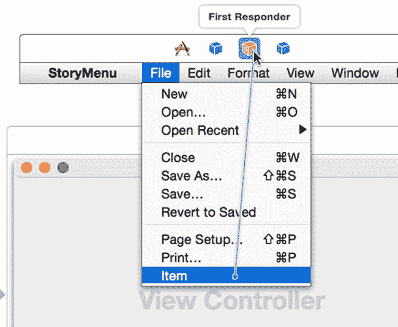

图 19-17。

将菜单命令连接到 `First Responder` 图标

```
@IBAction func myMenu(sender: NSMenuItem) {

textResult.stringValue = "Clicked on = " + sender.title

}
```

选择 `Product` ➤ `Run`。您的用户界面将出现。在 StoryMenu 菜单栏上选择 `File` ➤ `Save`。请注意，文本字段显示“Clicked on = Save…”。在 StoryMenu 菜单栏上选择 `File` ➤ `Item`。请注意，文本字段现在显示“Clicked on = Item-”。选择 `StoryMenu` ➤ `Quit StoryMenu`。

## 总结

当您创建 Cocoa 应用程序项目时，Xcode 会自动为您的程序创建下拉菜单。您可以添加、删除或重新排列菜单栏上的菜单标题或下拉菜单中的菜单命令。为了方便用户，您甚至可以为菜单命令分配键盘快捷键。

要编辑下拉菜单，您可以直接在下拉菜单上进行编辑，也可以打开 `Document Outline`。您可以从下拉菜单命令或 `Document Outline` 按住 Control 键拖拽，将菜单命令连接到 `IBAction` 方法。

在处理 `.storyboard` 文件时，您通常会将菜单命令连接到 `First Responder` 图标。然后，您可以在正确的 Swift 文件中实现 `IBAction` 方法，以使该菜单命令生效。在处理 `.xib` 文件时，您可以直接将菜单命令连接到 `IBAction` 方法。

当 Xcode 为您的 Cocoa 应用程序创建下拉菜单时，其中许多菜单命令已经知道如何工作，例如 `Window` ➤ `Zoom` 和 `File` ➤ `Close`。然而，大多数菜单命令在您编写自己的 Swift 代码以使它们在特定程序中正常工作之前，不会执行任何操作。

下拉菜单上的菜单命令为您提供了另一种将命令连接到 `IBAction` 方法的方式。由于大多数 OS X 程序都依赖下拉菜单，因此应首先专注于将程序命令组织到下拉菜单中，然后编写 Swift 代码以使每个菜单命令实际生效。

