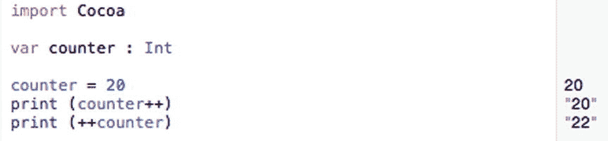
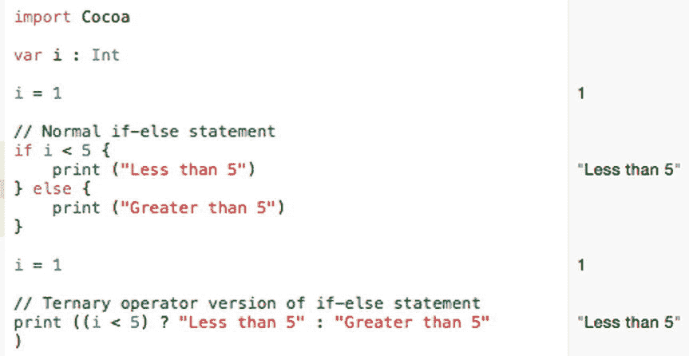
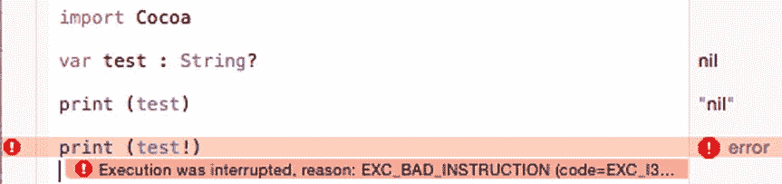
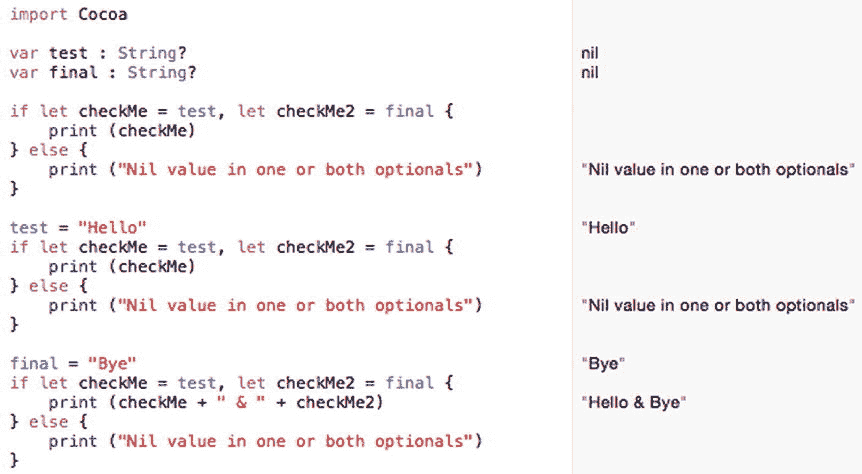
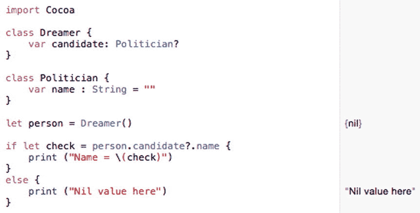
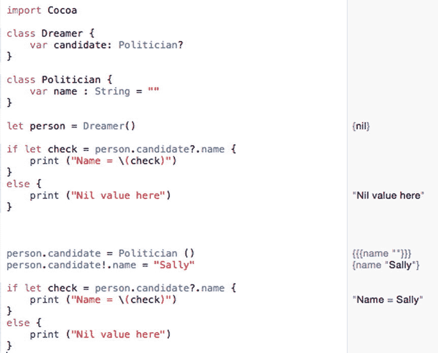
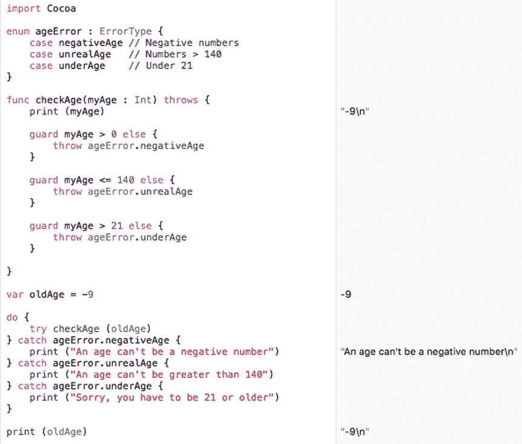

# 21. 防御性编程

程序员往往过于乐观，因为他们在编写代码时，总是假设代码能正确运行。然而，在编程时，悲观一些往往更好。与其假设你的代码一次就能运行成功，不如安全地假设你的代码根本不会运行。这会迫使你在编写 Swift 代码时格外小心，确保代码完全按照你的意图执行，并且不会出现任何意外行为。

没有程序是零错误的。与其浪费时间排查问题，不如提前预见问题并尽最大努力防止它们潜入代码中。虽然不可能 100% 编写出零错误的代码，但你在编写代码时越具有防御性，就越不需要花时间排查导致代码无法正常运行的错误。

总的来说，不要做任何假设。假设每次都会让你大吃一惊，而且很少会让事情变得更好。通过提前预见问题，你可以为它们制定计划，这样它们就不会破坏你的程序，也不会迫使你花费无数时间试图修复一个你认为根本不应该存在的问题。

## 使用极限值进行测试

测试代码最简单的方法是从极限值开始，看看程序如何处理远超出预期范围的数据。处理数字时，程序通常假设用户会提供固定范围内的有效数据，但如果用户输入的是字母或笑脸等符号而不是数字，会发生什么？如果用户输入的是整数而不是小数（或者反之）呢？如果用户输入的是像 420 亿或 -0.00000005580 这样的极端数字呢？

处理字符串时，也要进行同样的测试。当程序期待一个字符串却收到一个数字时，它会如何反应？如果收到一个包含 3000 个字符的巨大字符串呢？如果收到带有重音符号或特殊字母的外语符号呢？

通过使用极限值测试程序，你可以观察程序是优雅地响应，还是直接崩溃。最终目标是避免崩溃并优雅地响应。这可能意味着反复要求用户提供有效数据，或者至少在程序接收到无效数据时警告用户。可靠的程序需要防范任何威胁其正常运行的情况。


## 当心语言快捷方式

每种编程语言都提供快捷方式，让你能用更少的代码来加快编程速度。然而，即使是经验最丰富的程序员，也常常会被这些语言快捷方式绊倒，因此要谨慎使用它们。

一个简单的错误就是混淆前缀和后缀运算符，例如 `counter++` 或 `++counter`。尽管后缀和前缀自增运算符看起来几乎一模一样，但它们会产生两种完全不同的结果，如图 21-1 所示。



图 21-1. 前缀与后缀自增快捷方式的使用

注意，后缀自增运算符（`counter++`）会先使用 `counter` 的值，然后再加 1。这就是为什么 `print(counter++)` 这一行打印出 20。在它打印出 20 之后，后缀自增运算符立即给 `counter` 变量加上了 1。

另一方面，前缀自增运算符（`++counter`）会先加 1，然后再使用 `counter` 的值。在 `counter++` 运算符给 20 加上 1 得到 21 之后，`++counter` 前缀自增运算符在使用它之前又给它加了 1。这就是为什么它会打印出 22。

根据你的需求，混淆这两个自增运算符可能会产生略有不同的结果，进而导致程序无法正常运行。如果你不确定这些自增运算符是如何工作的，为了稳妥起见，就使用 `counter = counter + 1` 代替。清晰总比混乱好，哪怕这意味着要多写几行代码。

要了解后缀自增运算符与前缀自增运算符的区别，请遵循以下步骤：

-   在 Xcode 中，选择 文件 ➤ 新建 ➤ Playground。Xcode 会要求输入一个 playground 名称。
-   在名称文本字段中单击，然后输入 `DefensePlayground`。
-   确保平台弹出菜单显示的是 OS X。
-   点击下一步按钮。Xcode 会询问你想把 playground 保存在哪里。
-   选择一个文件夹来存储你的项目，然后点击创建按钮。
-   按如下方式编辑 playground 代码：

```
import Cocoa
var counter : Int
counter = 20
print (counter++)
print (++counter)
```

后缀自增运算符和前缀自增运算符可以是一种快捷方式，但如果使用不当，可能会带来意想不到的后果。另一种快捷方式是 Swift 的 if-else 语句。它通常看起来像这样：

```
if Booleancondition {
    // 如果条件为真，则执行此处的代码
} else {
    // 如果条件为假，则执行此处的代码
}
```

然而，Swift 也提供了一种 if-else 快捷方式，看起来像这样：

```
Booleancondition ? Result1 : Result2
```

除非你熟悉这种 if-else 语句的快捷版本，否则它可能会让人感到困惑，即使它更简短。任何时候代码让人困惑，就有错误使用它的风险。要了解这个 if-else 语句如何工作，请遵循以下步骤：

-   确保 `DefensePlayground` 已加载到 Xcode 中。
-   按如下方式编辑 playground 代码：

```
import Cocoa
var i : Int
i = 1
// 普通的 if-else 语句
if i < 5 {
    print ("小于 5")
} else {
    print ("大于 5")
}
i = 1
// 三元运算符版本的 if-else 语句
print ((i < 5) ? "小于 5" : "大于 5")
```

注意，两个 if-else 语句的工作方式完全相同，如图 21-2 所示，但为了减少代码量，快捷版本更难理解。任何时候代码难以理解，就有错误使用它的风险。如有疑问，就不要使用快捷方式。



图 21-2. if-else 语句的快捷版本

## 使用可选变量

Swift 最强大的特性之一就是可选变量。可选变量可以包含一个值，也可以什么都不包含（由 `nil` 值标识）。但是，你必须谨慎使用可选变量，因为如果你在它们包含 `nil` 值时尝试使用它们，程序可能会崩溃。

在使用可选变量时，你需要关注以下几点：

-   可选变量是否持有 `nil` 值
-   解包可选变量以获取其实际值

通常，你可以通过使用感叹号来访问存储在可选变量中的值，这被称为解包可选变量。解包可选变量的一个大问题是假设它的值不是 nil。假设你有以下代码：

```
var test : String?
print (test)
print (test!)
```

由于 `test` 可选变量尚未被赋值，其默认值为 `nil`。第一个 `print` 命令简单地打印出 `nil`。然而，第二个 `print` 命令试图解包这个可选变量，但由于其值为 `nil`，这会导致错误，如图 21-3 所示。



图 21-3. 解包具有 nil 值的可选变量会导致错误

在处理可选变量时，始终要在尝试使用它们之前检查其是否为 nil。检查 nil 值的一种方法是简单地测试可选变量是否等于 `nil`，例如：

```
import Cocoa
var test : String?
if test == nil {
    print ("Nil 值")
} else {
    print (test!)
}
```

在这个例子中，if-else 语句首先检查 `test` 可选变量是否等于 `nil`。如果是，则打印 `"Nil 值"`。如果不是，则可以安全地使用感叹号解包该可选变量。

另一种检查 nil 值的方法是将一个常量赋值给可选变量，这被称为可选绑定。你不是直接使用可选变量，而是将它的值赋值或绑定给一个常量，例如：

```
if let 常量 = 可选变量 {
    // 可选变量不为 nil
} else {
    // 可选变量是 nil 值
}
```

如果你需要测试多个可选变量，可以像这样将它们列在同一行：

```
if let 常量 = 可选变量, 常量 2 = 可选变量 2 {
    // 所有可选变量都不为 nil
} else {
    // 一个或多个可选变量为 nil
}
```

如果该常量持有值，那么 if-else 语句就可以使用这个常量值。如果该常量没有持有值（包含 `nil`），那么 if-else 语句会执行其他操作，以避免使用 nil 值。通过使用常量来存储可选变量的值，可以避免使用感叹号来解包可选变量。

让我们来看看如何使用可选绑定：

-   确保 `DefensePlayground` 已加载到 Xcode 中。
-   按如下方式编辑 playground 代码：

```
import Cocoa
var test : String?
var final : String?
if let checkMe = test, let checkMe2 = final {
    print (checkMe)
} else {
    print ("一个或两个可选变量中为 Nil 值")
}
test = "Hello"
if let checkMe = test, let checkMe2 = final {
    print (checkMe)
} else {
    print ("一个或两个可选变量中为 Nil 值")
}
final = "Bye"
if let checkMe = test, let checkMe2 = final {
    print (checkMe + " & " + checkMe2)
} else {
    print ("一个或两个可选变量中为 Nil 值")
}
```

上面的代码将两个不同的可选变量值赋值给两个不同的常量。只有当两个常量都包含非 nil 值时，if-else 语句的第一部分才会运行。如果一个或两个常量包含 nil 值，则执行 if-else 语句的 else 部分，如图 21-4 所示。同时还要注意，没有任何代码使用感叹号解包任何可选变量。



图 21-4. 使用可选绑定将可选变量的值赋值给常量


## 使用可选链

在处理可选类型时，通常用问号 `?` 声明可选变量，例如 `Int?`、`String?`、`Float?` 和 `Double?`。除了使用常见数据类型，你还可以将任何类型（包括类）声明为可选变量。

要将普通数据类型声明为可选变量，只需在数据类型名称后添加一个问号，像这样：

`var myNumber : String?`

通常情况下，类中的属性持有常见数据类型，如 `String`、`Int` 或 `Double`。然而，类属性也可以持有另一个类。如果你可以将一个类声明为类型，那么也可以将其声明为可选变量，像这样：

```
class Dreamer {
    var candidate: Politician?
}

class Politician {
    var name = ""
}
```

现在，如果你基于 `Dreamer` 类创建一个对象，就会得到一个持有可选变量的 `candidate` 属性。

`let person = Dreamer()`

`person` 对象基于 `Dreamer` 类，这意味着它也持有一个名为 `candidate` 的属性。然而，`candidate` 属性本身也是一个基于 `Politician` 类的可选变量对象。此时，`candidate` 属性的初始值为 `nil`。

要了解一个对象如何将另一个对象作为可选变量，请遵循以下步骤：

确保 `DefensePlayground` 已加载到 Xcode 中。按如下方式编辑 playground 代码：

```
import Cocoa
class Dreamer {
    var candidate: Politician?
}
class Politician {
    var name : String = ""
}
let person = Dreamer()
if let check = person.candidate?.name {
    print ("Name = \(check)")
}
else {
    print ("Nil value here")
}
```

这段代码没有从 `Politician` 类创建对象，因此 `candidate` 属性为 `nil`。由于我们将 `candidate` 属性声明为可选变量，因此可以使用所谓的**可选链**在 `if-else` 语句中访问其 `name` 属性，如图 21-5 所示。



图 21-5. 可选链可以访问类的可选变量属性

要在 `candidate` 属性中存储值，我们需要像这样创建另一个对象：

`person.candidate = Politician ()`

然后，我们需要在 `Politician` 类的 `name` 属性中存储数据。为此，我们需要解包这个可选变量（即 `Politician` 类）以访问其 `name` 属性，像这样：

`person.candidate!.name = "Sally"`

请记住，只有在绝对确定可选变量包含值时，才应使用感叹号解包可选变量。在这种情况下，我们正在给可选变量赋值（`"Sally"`），因此解包它是安全的。

让我们看看如何修改之前的代码，从而在可选变量属性中存储值：

确保 `DefensePlayground` 已加载到 Xcode 中。按如下方式编辑 playground 代码：

```
import Cocoa
class Dreamer {
    var candidate: Politician?
}
class Politician {
    var name : String = ""
}
let person = Dreamer()
if let check = person.candidate?.name {
    print ("Name = \(check)")
}
else {
    print ("Nil value here")
}
person.candidate = Politician ()
person.candidate!.name = "Sally"
if let check = person.candidate?.name {
    print ("Name = \(check)")
}
else {
    print ("Nil value here")
}
```

注意，`candidate` 可选变量（`Politician`）在显式存储值之前是未定义的或 `nil`。一旦我们将字符串（`"Sally"`）存储到 `name` 属性中，它就不再持有 `nil` 值，如图 21-6 所示。



图 21-6. 你需要解包可选变量才能在其中存储值

处理可选变量的关键是要确保正确使用问号 `?` 和感叹号 `!` 符号。幸运的是，如果你遗漏了任何一个符号，Xcode 通常会提示你选择正确的符号，如图 21-7 所示。


图 21-7. 在处理可选变量时，Xcode 的编辑器可以提示你何时使用 `?` 或 `!` 符号

问号 `?` 符号用于创建可选变量或安全地访问可选变量。感叹号 `!` 符号用于解包可选变量，因此请确保这些被解包的可选变量持有非 nil 值。

通常，只要你看到问号 `?` 与可选变量一起使用，在处理 `nil` 值时你的代码很可能是安全的。然而，只要你看到感叹号 `!` 与可选变量一起使用，请确保可选变量包含一个值，因为如果它包含 `nil` 值，你的代码可能不安全并可能导致崩溃。

## 错误处理

由于你无法每次都写出没有 bug 的代码，Swift 提供了一种称为错误处理的特性。错误处理背后的理念是识别并捕获可能出现的错误，以便你的程序能够优雅地处理它们，而不是让程序崩溃或产生不可预测的行为。要处理错误，你需要遵循以下几个步骤：

*   定义你想要识别的具有描述性的错误
*   标识一个或多个函数来检测错误并识别发生的错误类型
*   处理错误

### 使用 `enum` 和 `ErrorType` 定义错误

在过去，程序经常显示充满十六进制数字和奇怪符号的晦涩错误消息。这类错误消息通常对于识别可能发生的问题毫无用处。这就是为什么处理错误的第一步是创建一个描述性错误类型的列表。

你为不同错误取的名字完全是任意的，但你应该为不同类型的错误消息赋予有意义的名称。要创建一个描述性错误类型的列表，你需要创建一个遵循 `ErrorType` 协议的 `enum`，像这样：

```
enum enumName : ErrorType {
    case descriptiveError1
    case descriptiveError2
    case descriptiveError3
}
```

将 `enumName` 替换为一个能标识你想要识别的错误类型的描述性名称。然后使用 `case` 关键字键入一个描述性的错误名称（作为一个单词，不含空格）。你的可能错误列表可以包含从一到任意数量的错误，因此你不受固定数量的限制。如果你想创建一个列出三种错误类型的 `enum`，你可能会使用如下代码：

```
enum ageError : ErrorType {
    case negativeAge // 负数
    case unrealAge   // 大于 140 的数字
    case underAge    // 未满 21 岁
}
```


### 创建错误识别函数

在创建描述性错误类型列表后，现在需要创建一个或多个你认为可能发生错误的函数。通常你会像下面这样定义一个函数：

```
func functionName () {
    // 代码写在这里
}
```

为了让函数能够识别错误，你需要像这样插入 `throws` 关键字：

```
func functionName () throws {
    // 代码写在这里
}
```

如果函数有返回值，`throws` 关键字应放在返回值数据类型之前，如下所示：

```
func functionName () throws -> dataType {
    // 代码写在这里
}
```

`throws` 关键字意味着该函数会“抛出”错误，交由代码的其他部分来处理。在包含 `throws` 关键字的函数内部，你需要使用一个或多个 `guard` 语句。

`guard` 语句用于识别允许的情况，其工作原理类似于 `if-else` 语句。如果 `guard` 语句的布尔条件为 `true`，则不执行任何操作。但如果 `guard` 语句的条件为 `false`，则 `guard` 语句可以使用 `throw` 关键字来识别特定类型的错误，如下所示：

```
guard 布尔条件 else {
    throw 枚举名称.描述性错误
}
```

如果只想允许大于 21 的值，你可以创建如下的 `guard` 语句：

```
guard myAge > 21 else {
    throw ageError.underAge
}
```

如果布尔条件 (`myAge > 21`) 为 `true`，该 `guard` 语句不会执行任何操作。否则，它会抛出 `ageError.underAge` 错误，其中 `ageError` 是用于列出不同错误的枚举名称，而 `underAge` 是可能发生的错误之一。

`guard` 语句总是定义可接受的行为 (`myAge > 21`)，否则它会通过 `throw` 关键字识别错误。一个带有 `throws` 关键字的函数可以包含一个或多个 `guard` 语句。

### 处理错误

在识别出一个或多个带有 `throws` 关键字的函数，并且这些函数使用了一个或多个 `guard` 语句来识别可能的错误之后，最后还需要一种方法来处理这些错误。在 Swift 中，你可以使用 `do-try-catch` 语句来实现，如下所示：

```
do {
    try 调用会抛出错误的函数
} catch 枚举名称.描述性错误 {
    // 处理错误的代码
}
```

`do-try-catch` 语句会尝试运行一个可以使用 `throws` 关键字识别错误的函数。如果该函数没有通过 `guard` 语句识别出任何错误，那么 `do-try-catch` 语句的执行效果就与普通函数调用完全一样。

但是，如果函数识别出了错误，你就需要在 `do-try-catch` 语句中编写代码来处理该错误。处理错误的方式可以很简单，比如打印一条消息来提示问题，也可以很复杂，比如运行一整套全新的代码来处理问题。

关键在于，如果你能预判可能的错误并编写代码加以处理，你的程序就不太可能崩溃。如果程序确实崩溃了，只需找出原因（这可能并不容易），创建一个新的描述性错误名称来标识它，然后创建一个新的 `catch` 语句来处理该错误。

让我们看看错误处理如何工作：

确保 `DefensePlayground` 已加载到 Xcode 中。按如下方式编辑 playground 代码：

```
import Cocoa

enum ageError : ErrorType {
    case negativeAge // 负数
    case unrealAge   // 大于 140 的数
    case underAge    // 小于 21 岁
}

func checkAge(myAge : Int) throws {
    print (myAge)
    guard myAge > 0 else {
        throw ageError.negativeAge
    }
    guard myAge <= 140 else {
        throw ageError.unrealAge
    }
    guard myAge > 21 else {
        throw ageError.underAge
    }
}

var oldAge = -9

do {
    try checkAge (oldAge)
} catch ageError.negativeAge {
    print ("年龄不能是负数")
} catch ageError.unrealAge {
    print ("年龄不能大于 140")
} catch ageError.underAge {
    print ("抱歉，你必须年满 21 岁或以上")
}

print (oldAge)
```

注意，如图 21-8 所示，负数是如何被识别并通过一条简单消息处理的。



**图 21-8.** 错误处理包含一个枚举、一个带有 guard 语句的函数以及一个 do-try-catch 语句

将 `oldAge` 变量的值改为 250，观察 `do-try-catch` 语句如何将该数字捕获为大于 140（这意味着不现实）。将 `oldAge` 变量的值改为 15，观察 `do-try-catch` 语句如何识别出小于 21 的年龄。

要在程序中使用错误处理，首先必须识别可能的问题，然后需要决定如何处理这些问题。错误处理只能识别你已经知道的错误，但它可以使你的程序在面对可能遇到的常见问题时更不易出错。

## 总结

无论你作为程序员多么有天赋、有技巧或受过多少教育，偶尔总会犯错。有时这些错误是很容易纠正的简单错误，但有时你犯的错误会导致各种细微的问题，这些问题会给你的查找和修复带来挑战和挫败感。这本身就是编程的本质。

然而，你无意中造成的任何问题，也是你可以学会发现和修复的问题。一旦你学会了某种错误的产生机制，你很可能就会记住将来如何修复这类错误，无论将来是你自己还是其他人再次犯下这些错误。这样你就能腾出手来，去犯那些你可能从未遇到过的新错误。

减少程序错误的最佳方法是仔细检查代码，并且假定任何事情都不会一帆风顺。然后，寻找所有可能的方法，确保它不可能出错。你越是以防御性思维编写代码，就越有可能在问题发生之前就将其预防。

编程更像是一门艺术而非科学，所以请学习最适合你的方法，以减少在程序中引入错误。在尝试新代码时，通常更安全的做法是在 Swift playground 或一个独立于你实际程序的简单程序中对其进行测试。

这样，你就可以安全地隔离和测试代码。当代码正常工作后，再将其复制粘贴到你的程序中。

错误是编程世界中的常态。理想情况下，你希望花更多时间编写代码，而花更少时间调试代码。

