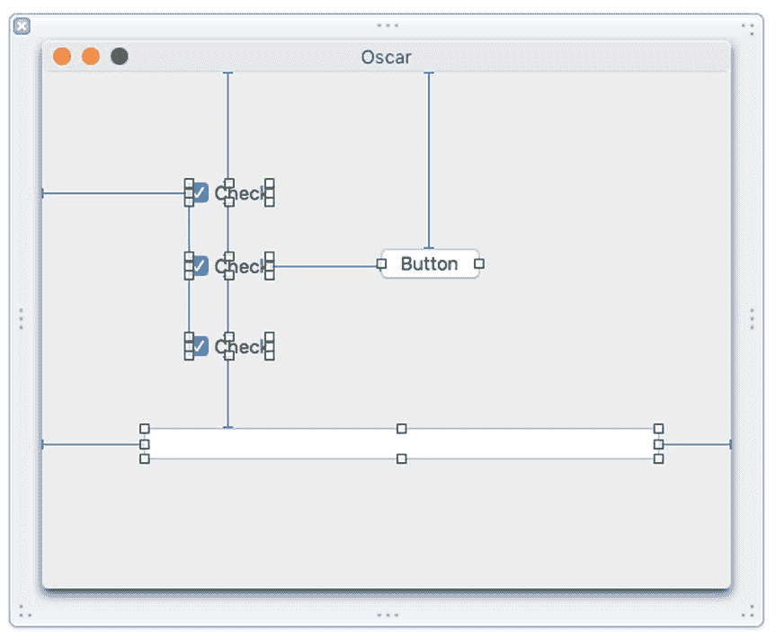
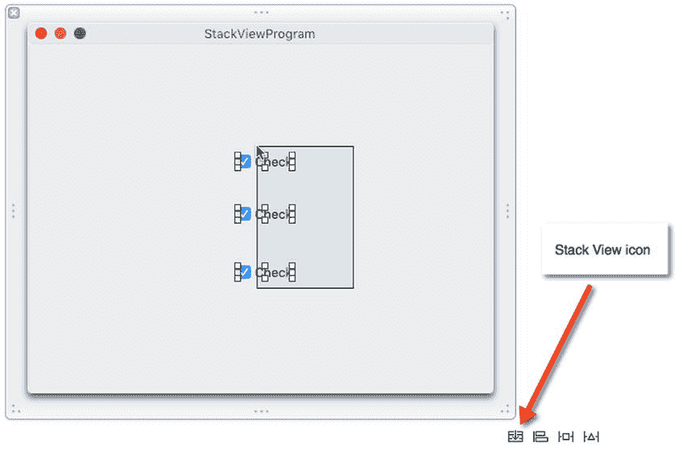
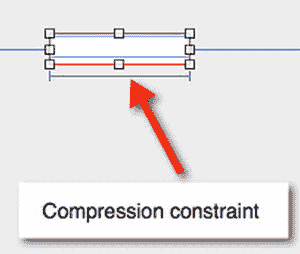
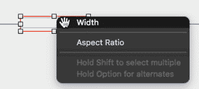
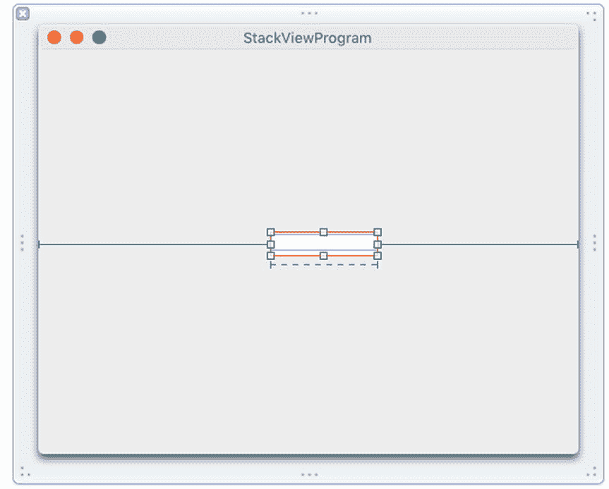
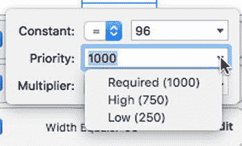
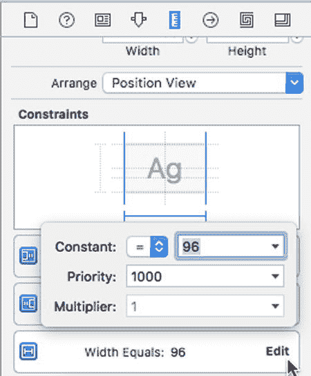
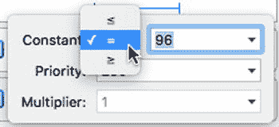

# 简化用户界面设计

设计用户界面可能具有挑战性。你不仅需要设计一个易于使用的用户界面，还需要设计一个自适应用户界面，能够响应用户对窗口大小所做的任何更改。如果用户缩小窗口，你的用户界面必须相应缩小，且不裁剪任何元素。如果用户放大窗口，你的用户界面必须相应扩展，以保持外观的一致。

为了帮助创建自适应用户界面，Xcode 提供了约束，可以将各种用户界面元素的边缘固定到窗口边缘或其他用户界面元素的边缘。在本章中，你将了解更多关于约束和 storyboard 的知识，这将帮助用户界面设计变得比以往任何时候都更加简单。

## 使用堆栈视图

如果你的用户界面包含少量项目（例如文本字段、按钮和标签），为这些项目添加约束以确保它们位于正确位置相对简单。然而，当用户界面包含多个项目时，为每个项目添加大量约束就会变得混乱。改动一个约束可能导致整个用户界面无法正确适配，这往往意味着需要花费时间重新调整多个约束。图 22-1 展示了在拥挤的用户界面上，多个约束可能带来的混乱情况。

图 22-1. 多个约束使得布局用户界面变得困难

为解决这一问题，Xcode 提供了一项名为“堆栈视图”的功能。堆栈视图的核心思想是：用户界面中的项目组往往需要保持在一起。你不必为每个项目单独设置约束，而是将它们分组到一个堆栈视图中，然后为这个单一的堆栈视图设置约束。

要了解如何创建和使用堆栈视图，请按照以下步骤操作：

-   选择 `Editor` ➤ `Embed In` ➤ `Stack View`（或点击 Xcode 中间窗格右下角的堆栈视图图标）。Xcode 会将选中的项目组合到单个堆栈视图内。
-   将鼠标指针移到三个复选框的堆栈视图上，按住 `Control` 键，向窗口右边缘拖动鼠标。
-   松开 `Control` 键和鼠标按钮，会弹出一个窗口。
-   选择 `Trailing Space to Container`。Xcode 会显示整个堆栈视图的约束。
-   将鼠标指针移到三个复选框的堆栈视图上，按住 `Control` 键，向窗口底部边缘拖动鼠标。
-   松开 `Control` 键和鼠标按钮，会弹出一个窗口。
-   选择 `Bottom Space to Container`。Xcode 会显示整个堆栈视图的约束。
-   选择 `Product` ➤ `Run`。程序的用户界面将显示。
-   拖动窗口右下角来缩小和放大窗口。注意，当你改变窗口的宽度和高度时，三个复选框的堆栈会作为一个整体一起移动。
-   选择 `StackViewProgram` ➤ `Quit StackViewProgram`。
-   在 Xcode 中，选择 `File` ➤ `New` ➤ `Project`。
-   在 `OS X` 类别下点击 `Application`。
-   点击 `Cocoa Application`，然后点击 `Next` 按钮。Xcode 会要求输入产品名称。
-   点击 `Product Name` 文本字段，输入 `StackViewProgram`。
-   确保 `Language` 弹出菜单显示为 `Swift`，且未选中任何复选框。
-   点击 `Next` 按钮。Xcode 会询问你希望将项目存储在何处。
-   选择一个文件夹来存储项目，然后点击 `Create` 按钮。
-   在项目导航器中点击 `MainMenu.xib` 文件。
-   在项目导航器右侧出现的窗格中，点击窗口图标。程序的用户界面将显示。
-   选择 `View` ➤ `Utilities` ➤ `Show Object Library`。对象库会出现在 Xcode 窗口的右下角。
-   将三个复选框拖到用户界面窗口上，使它们上下堆叠显示。请注意，除非你精确对齐每个复选框，否则它们看起来会不整齐。
-   拖动鼠标选中所有三个复选框，如图 22-2 所示。（另一种选择多个项目的方法是按住 `Shift` 键并点击你想选择的每个项目。）

图 22-2. 拖动是快速选择多个项目的方法

通过使用堆栈视图，你可以将分组项目保持在一起，并且仅对整个组使用一组约束，而不是为每个项目逐一添加约束。

## 解决约束冲突

理想情况下，约束应使项目与窗口边缘或其他用户界面项目边缘保持特定距离。然而，当你缩小或放大窗口时，约束可能会产生意外问题。

让我们看看为用户界面项目设置两个约束是如何引发问题的：

-   确保 `StackViewProgram` 项目已加载到 Xcode 中。
-   在项目导航器窗格中点击 `MainMenu.xib` 文件。
-   在项目导航器右侧出现的窗格中，点击窗口图标。程序的用户界面将显示。
-   选择 `Edit` ➤ `Select All`（或按 `Command+A`）。Xcode 会选中当前位于用户界面窗口上的堆栈视图。
-   按键盘上的 `Delete` 键，或选择 `Edit` ➤ `Delete`，从窗口中删除所有用户界面项目。
-   选择 `View` ➤ `Utilities` ➤ `Show Object Library`。
-   将单个文本字段拖到用户界面窗口的中间位置。（无需担心精确定位。）
-   将鼠标指针移到文本字段上，按住 `Control` 键，向窗口右边缘拖动鼠标。
-   松开 `Control` 键和鼠标按钮，会弹出一个窗口。
-   选择 `Trailing Space to Container`。Xcode 会创建一个从文本字段右边缘到窗口右边缘的约束。
-   将鼠标指针移到文本字段上，按住 `Control` 键，向窗口左边缘拖动鼠标。
-   松开 `Control` 键和鼠标按钮，会弹出一个窗口。
-   选择 `Leading Space to Container`。Xcode 会创建一个从文本字段左边缘到窗口左边缘的约束。
-   选择 `Product` ➤ `Run`。用户界面窗口将显示。
-   将鼠标指针移到窗口右边缘，向右拖动鼠标以扩展窗口宽度。注意，文本字段会随之向右扩展。
-   将鼠标指针移到窗口右边缘，向左拖动鼠标以缩小窗口宽度。注意，文本字段会随之缩小。如果你持续缩小窗口宽度，文本字段最终会完全消失，这很可能不是你期望的结果。
-   选择 `StackViewProgram` ➤ `Quit StackViewProgram`。

目前，我们有两个约束使文本字段与两个窗口边缘保持固定距离，但它们无法阻止文本字段在窗口过度缩小时消失。一种解决方法是为其创建一个压缩约束。

压缩约束用于防止用户界面项目过度缩小或扩展。要创建压缩约束，你需要按住 `Control` 键并在该用户界面元素的边界内拖动鼠标。

-   选择 `Product` ➤ `Run`。用户界面窗口将显示。
-   将鼠标指针移到窗口右边缘，尝试拖动窗口以扩展或缩小其宽度。注意，由于压缩约束的存在，你无法做到这一点。
-   选择 `StackViewProgram` ➤ `Quit StackViewProgram`。
-   选择 `Width`。Xcode 会在文本字段下方显示一个压缩约束，如图 22-4 所示。

图 22-4. 压缩约束显示在用户界面项目下方

-   确保 `StackViewProgram` 项目已加载到 Xcode 中。
-   在项目导航器窗格中点击 `MainMenu.xib` 文件。
-   将鼠标指针移到文本字段上。
-   按住 `Control` 键，向左或向右拖动鼠标，同时保持鼠标指针在文本字段的边界内。
-   松开 `Control` 键和鼠标按钮，会弹出一个菜单，如图 22-3 所示。

图 22-3. 定义压缩约束

压缩约束告诉`Xcode`保持文本字段固定宽度，而左侧和右侧约束告诉`Xcode`保持文本字段与窗口左右边缘的固定距离。为满足所有这些约束，窗口的宽度将无法再调整大小。

如果希望保持文本字段宽度不小于其当前宽度，但允许窗口调整大小，该怎么办？一种解决方案是使用约束优先级。

优先级定义了哪些约束必须首先满足。每次创建约束时，`Xcode`都会为其赋予优先级`1000`，这是可能的最高优先级。如果为约束赋予较低的优先级，则该约束将允许更高优先级的约束优先执行。让我们看看更改约束优先级的效果：

选择`Product ➤ Run`。用户界面窗口出现。将鼠标指针移动到窗口右边缘，并尝试拖动窗口以扩展或缩小其宽度。请注意，如果缩小窗口宽度，文本字段会再次消失。选择`StackViewProgram ➤ Quit StackViewProgram`。选择`Low (250)`。请注意，`Xcode`现在以虚线显示宽度约束，直观地表明其优先级低于实线显示的约束，如图 22-7 所示。

图 22-7. 低优先级约束显示为虚线

点击`Priority`文本字段右侧的向下箭头。弹出菜单出现，如图 22-6 所示。

图 22-6. 更改约束优先级

确保`StackViewProgram`项目已在`Xcode`中加载。点击项目导航窗格中的`MainMenu.xib`文件。点击文本字段以选中它。选择`View ➤ Utilities ➤ Show Size Inspector`。`Size Inspector`窗格出现在`Xcode`窗口的右上角。点击`Width`约束右侧的`Edit`。弹出窗口出现，如图 22-5 所示。

图 22-5. 编辑约束

更改约束优先级并不总能得到想要的结果，因此可能需要更改约束的工作方式。大多数约束定义了一个必须满足的固定值。为了更灵活，您还可以将此相等约束更改为大于或等于或小于或等于约束。

选择`Greater than or equal to`符号。点击`Priority`文本字段右侧的向下箭头以显示菜单，并选择`High (750)`。选择`Product ➤ Run`。请注意，如果缩小窗口宽度，压缩约束只会将文本字段收缩到有限距离，然后停止，以防止文本字段完全消失。如果扩展窗口宽度，文本字段会随之扩展。选择`StackViewProgram ➤ Quit StackViewProgram`。确保`StackViewProgram`项目已在`Xcode`中加载。点击项目导航窗格中的`MainMenu.xib`文件。点击文本字段以选中它。选择`View ➤ Utilities ➤ Show Size Inspector`。`Size Inspector`窗格出现在`Xcode`窗口的右上角。点击`Width`约束右侧的`Edit`。弹出窗口出现（见图 22-5）。点击`Constant`标签右侧的弹出菜单。弹出菜单出现，如图 22-8 所示。

图 22-8. 将等号更改为大于或等于或小于或等于符号

当用户界面无法正确适应时，请尝试以下一个或多个选项：

*   添加或删除约束
*   更改约束优先级
*   将约束从等于固定值更改为大于或等于或小于或等于关系

每个适应窗口大小调整的用户界面问题可能都不同，因此解决问题可能简单到修改一个约束，也可能复杂到修改多个约束。如果一组用户界面项目一起移动，则可以将它们分组到一个堆栈视图中以简化处理。

通常，您可能需要尝试修改不同的约束，以了解它们在不同组合下的工作方式。只要了解修改约束的各种选项，最终就能为特定的用户界面找到最佳解决方案。

## 总结

每个程序的用户界面对用户控制程序都至关重要。如果用户界面让用户感到沮丧并阻止他们使用该程序，那么程序的功能再强大也无济于事。

由于每个用户界面都需要响应用户可能对窗口大小做出的更改，因此堆栈视图允许您将相关项目分组，并对整个堆栈视图应用约束。如果不将相关项目分组，您将需要单独对每个项目应用约束，这可能会变得混乱，并且在它们未能按预期响应时难以修复。

如果存在约束冲突，您可以修改每个约束的优先级和/或修改约束的工作方式。最初创建约束时，`Xcode`会使约束等于一个固定值。为了提供灵活性，您可以将此等号更改为大于或等于或小于或等于符号。

为了保持用户界面项目可见，您还可以应用压缩约束。与将项目链接到另一个项目或窗口边缘的普通约束不同，压缩约束定义了用户界面项目的宽度和/或高度。如果用户调整窗口大小，压缩约束可防止用户界面项目消失。

对于设计按特定顺序显示窗口或视图的用户界面，您可能会发现使用故事板文件比使用多个`.xib`文件更容易。您无需将整个用户界面存储在一个故事板文件中（这可能会变得杂乱且难以理解），而是可以创建故事板引用。

故事板引用将用户界面划分为多个故事板文件。通过将用户界面分离到多个故事板文件中，您可以更轻松地设计和理解用户界面的结构。

