# 23. 调试你的程序

在专业的软件领域，你实际上会花更多时间来修改现有程序，而非创建新的程序。在编写新程序或编辑现有程序时，无论你拥有多少经验或学历，都没什么区别，因为即使是最优秀的程序员也会犯错。事实上，无论你多么小心，都难免会犯错误。一旦你接受了编程中这个不可避免的事实，你就可以学习如何找到并修正你的错误。

在计算机世界里，错误通常被称为“bug”，这个名称源于早期一台使用物理开关工作的计算机。有一天这台计算机出了故障，当技术人员打开计算机时，发现一只飞蛾被压在一个开关里，导致开关无法闭合。从那时起，编程错误就被称为 bug，而修复计算机问题则被称为调试。

三种常见的计算机错误类型是：

*   **语法错误** – 当你拼错某些内容（如关键字、变量名、函数名或类名），或者符号使用不正确时发生。
*   **逻辑错误** – 当你正确使用了命令，但代码的逻辑并未实现你的意图时发生。
*   **运行时错误** – 当程序遇到意外情况时发生，例如用户输入了无效数据，或者另一个程序意外地干扰了你的程序。

语法错误最容易发现和修复，因为它们仅仅是你创建的变量名的拼写错误，或者 Swift 命令的拼写错误，而`Xcode`可以帮助你识别这些错误。如果你输入一个 Swift 关键字，比如`var`或`let`，`Xcode`会将该关键字显示为粉色（或你在`Xcode`编辑器中为显示关键字指定的任何颜色）。

现在，如果你输入了一个 Swift 关键字，但它没有显示为其通常的标识颜色，那么你就知道可能输错了。通过为代码着色，`Xcode`的编辑器可以帮助你直观地识别常见的拼写错误或笔误。

除了颜色之外，`Xcode`编辑器还提供了第二种方式来帮助你在需要输入`Cocoa`框架中定义的方法或类的名称时避免错误。一旦`Xcode`识别出你可能在输入来自`Cocoa`框架的内容，它就会显示一个包含可能选项的弹出菜单。现在，你无需自己键入整个命令，只需在弹出菜单中单击你的选择，然后按一次或多次`Tab`键，即可让`Xcode`正确地键入你选择的命令，如图 23-1 所示。

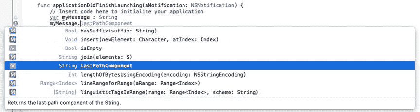

图 23-1.

`Xcode`显示一个你可能想使用的命令菜单

语法错误常常会使你的程序完全无法运行。当语法错误阻止程序运行时，`Xcode`通常可以识别出程序中出现拼写错误命令的那一行（或附近区域），以便你进行修复，如图 23-2 所示。

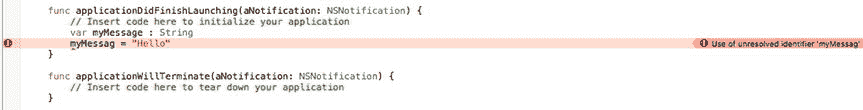

图 23-2.

语法错误常常会阻止程序运行，这便使得`Xcode`能够识别出语法错误

逻辑错误比语法错误更难发现和检测。`Xcode`能够识别语法错误，是因为它能识别出正确拼写的 Swift 关键字（例如`var`）与类似但拼写错误的 Swift 关键字（例如将`var`写成`varr`）之间的差异。

然而，逻辑错误发生时，你正确使用了 Swift 代码，但代码并未按你的意图执行。由于你的代码实际上是有效的，`Xcode`无法知道它没有按你预期的方式工作。因此，逻辑错误可能难以调试，因为你认为自己正确编写了代码，但（显然）并非如此。

如何在你认为编写正确的代码中找到错误？找到错误通常需要从程序的开头开始，逐行仔细排查，直到最后。（当然，有一些比逐行搜索整个程序更快的方法，你将在本章稍后学到。）

最后，最难发现和调试的错误是运行时错误。语法错误通常会使程序无法运行，因此如果你的程序确实运行了，你可以假设已经消除了代码中大部分（即使不是全部）的语法错误。

逻辑错误可能更难找到，但它们是可预测的。例如，如果你的程序要求用户输入密码，但即使用户输入了正确的密码，程序也无法授予用户访问权限，你就知道存在逻辑错误。每次运行程序时，你都可以可靠地预测逻辑错误会在何时发生。

运行时错误则更加隐蔽，因为它们并不总是可预测地发生。例如，你的程序在你的电脑上可能运行得非常完美，但当你在一台完全相同的电脑上运行同一个程序时，程序可能会出错。这是因为两台不同电脑之间的条件永远不会完全相同。

因此，同一个程序在一台电脑上可以正常运行，但在另一台同类型的电脑上却可能失败。问题在于，意外的外部环境可能会影响程序的行为。例如，你的程序运行良好，直到用户按下了数字小键盘上的数字键，而不是字母数字键区顶部的数字键。

即使用户输入的是完全相同的数字（例如`5`），程序也可能会将`R`和`T`键上方的`5`键视为与数字小键盘上的`5`键完全不同的按键。尽管这很细微，但可能足以导致程序出错或崩溃。

由于运行时错误并不总是能重现，因此找到它们可能很令人沮丧，修复起来甚至更难，因为你无法始终检查程序在其他电脑上运行时可能面临的每一种情况。有些程序一直被认为工作完美——除非用户同时意外地按下两个键。另一些程序则运行良好——直到用户恰好在一个程序试图通过网络接收电子邮件的同时保存文件。

通常，你可以消除大部分语法错误，并找到和修复大多数逻辑错误。然而，要找到并完全消除程序中所有的运行时错误可能是不可能的。避免花时间寻找 bug 的最佳方法是努力编写代码并仔细测试，以确保代码尽可能地没有错误。


## 简单调试技巧

当程序无法正常运行时，往往毫无头绪。虽然你可以不厌其烦地从头到尾检查代码，但通常更快的办法是直接猜测错误可能出在哪里。

一旦大致判断出程序中可能存在问题的地方，你有两种选择。第一种是删除可疑代码并重新运行程序。如果问题神奇地消失了，那么你就能确定删除的代码很可能是罪魁祸首。

然而，如果程序仍然无法正常工作，你就得把删掉的代码重新输入到程序中。一个更简单的办法是将代码从 Xcode 剪切粘贴到文本编辑器（如每台 Mac 都自带的 TextEdit 程序）中，但这个操作也可能很繁琐。

因此第二种办法是临时隐藏怀疑有问题的代码。这样，如果问题依旧存在，你只需取消隐藏即可让代码重新可见。在 Xcode 中要实现这点，只需将代码变成注释。

记住，注释是 Xcode 完全忽略的文本。有三种创建注释的方式：

- 在要转为注释的每一行开头添加`//`符号。此方法可以将单行代码转为注释。
- 在要转为注释的代码开头添加`/*`符号，在结尾添加`*/`符号。此方法可以将一行或多行代码转为注释。
- 选中要转为注释的代码行，然后选择“编辑器”➤“结构”➤“注释选中的内容”（或按 `Command + /`）。此方法通过在选中的每行代码开头放置`//`符号，将一行或多行代码转为注释。

**注意：** Xcode 会用绿色（或你定义的任何注释标识颜色）为注释着色。创建注释后，请确保 Xcode 正确着色，以确认注释已创建。如果 Xcode 未能识别你的注释，它会将你的文本当作有效的 Swift 命令处理，这很可能导致程序无法正常运行。

通过将代码变为注释，你实际上将这些代码隐藏了起来，不让 Xcode 看到。如果你想把注释重新变回代码，只需移除定义注释的`//`或`/*`和`*/`符号。

如果你是通过选择“编辑器”➤“结构”➤“注释选中的内容”（或按 `Command + /`）来注释代码的，那么只需再次选择“编辑器”➤“结构”➤“取消注释选中的内容”（或再按一次 `Command + /`），就能将注释代码重新转换为可运行的代码。

除了将代码变为注释以临时隐藏外，第二个简单的调试技巧是使用`print`命令。这个思路是在代码中放入`print`命令，来打印出某个变量的值。

通过这么做，你可以看到一个或多个变量可能包含什么值。在程序中放置多个`print`命令，能让你有机会确保程序运行正确。

要了解如何结合使用`print`命令和注释代码来调试程序，请遵循以下步骤：

1. 在 Xcode 中选择“文件”➤“新建”➤“项目”。
2. 在 OS X 类别下点击“应用程序”。
3. 点击“Cocoa 应用程序”，然后点击“下一步”按钮。Xcode 会要求输入产品名称。
4. 点击“产品名称”文本字段，输入`DebugProgram`。
5. 确保“语言”弹出菜单显示为 Swift，并且没有勾选任何复选框。
6. 点击“下一步”按钮。Xcode 会询问你想要存储项目的位置。
7. 选择一个文件夹来存储项目，然后点击“创建”按钮。
8. 在项目导航器中点击`AppDelegate.swift`文件。`AppDelegate.swift`文件的内容会显示出来。
9. 按如下方式编辑`applicationDidFinishLaunching`方法：

```
func applicationDidFinishLaunching(aNotification: NSNotification) {
    var myMessage = "Temperature in Celsius:"
    let temp = 100.0
    print (myMessage + "\(temp)")
    myMessage = "Temperature in Fahrenheit:"
    print (myMessage + "\(C2F(temp))")
}
```

10. 直接在此函数上方，添加以下代码：

```
func C2F (tempC : Double) -> Double {
    var tempF : Double
    tempF = tempC + 32 * 9/5
    return tempF
}
```

11. 选择“产品”➤“运行”。程序用户界面（空白界面）出现。
12. 选择“DebugProgram”➤“退出 DebugProgram”。Xcode 界面出现。如果你查看 Xcode 窗口底部调试区的内容，可以看到两个`print`命令打印出的内容，即“Temperature in Celsius: 100.0”和“Temperature in Fahrenheit: 157.6”，如图 23-3 所示。

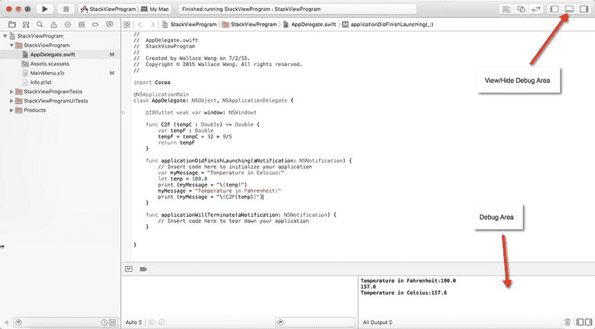

**图 23-3.** `print`命令在 Xcode 窗口的调试区显示文本

要显示或隐藏调试区，你有三种选择：

- 点击 Xcode 窗口右上角的“显示/隐藏调试区”图标。
- 选择“视图”➤“调试区”➤“显示/隐藏调试区”。
- 按 `Shift+Command+Y`。

通过查看调试区，我们可以看到`print`命令显示的内容。如果你对摄氏温标和华氏温标有所了解，就会知道摄氏的沸点是 100 度，华氏的沸点是 212 度。然而我们的温度转换程序计算出 100 摄氏度等于 157.6 华氏度，这意味着华氏温度应该是 212 而不是 157.6。显然有问题，下面我们用`print`命令和注释来帮助调试。

1. 确保 Xcode 中加载了`DebugProgram`项目。
2. 点击项目导航器窗格中的`AppDelegate.swift`文件。
3. 按如下方式编辑`C2F`函数，在`*`符号（乘号）左侧输入`//`符号：

```
func C2F (tempC : Double) -> Double {
    var tempF : Double
    tempF = tempC + 32//* 9/5
    return tempF
}
```

这个注释可以让我们检查`tempC`参数是否正确传入`C2F`函数并存储在`tempF`变量中。

4. 在 return 语句上方添加`print (tempC)`命令，如下所示：

```
func C2F (tempC : Double) -> Double {
    var tempF : Double
    tempF = tempC + 32 //* 9/5
    print (tempF)
    return tempF
}
```

5. 选择“产品”➤“运行”。程序的空白用户界面出现。
6. 选择“DebugProgram”➤“退出 DebugProgram”。Xcode 界面再次出现，并在调试区显示结果，打印内容如下：

```
Temperature in Celsius: 100.0 132.0 Temperature in Fahrenheit: 132.0
```

通过注释掉代码的计算部分并使用`print (tempF)`命令，我们可以看到`C2F`函数正确地将 100.0 存储在`tempC`变量中，并在将其存入`tempF`变量之前加上了 32。因为我们注释掉了代码的计算部分，所以可以推断错误一定出在我们注释掉的代码部分。


尽管公式看似正确，但错误之所以发生，是因为 Swift（以及大部分编程语言）计算公式的方式。首先，它们从左到右进行计算。其次，它们会先计算乘法等运算，再计算加法。

错误之所以发生，是因为我们的转换公式首先将 32 乘以 9（得到 288），然后将结果（288）除以 5 得到 57.6。最后，它将 57.6 加到 100.0 上，得到错误结果 157.6。而正确的做法应该是将 9/5 乘以摄氏温度，然后将结果加上 32。

按如下方式修改 `C2F` 函数：

```
func C2F (tempC : Double) -> Double {
    var tempF : Double
    tempF = tempC * (9/5) + 32
    print (tempF)
    return tempF
}
```

选择“产品” ➤ “运行”。程序会显示一个空白用户界面。选择“DebugProgram” ➤ “退出 DebugProgram”。Xcode 会再次出现。查看调试区，你会发现程序现在正确地将 100 摄氏度转换为 212 华氏度。

对于简单的调试，临时将代码变为注释并使用 `print` 命令是可行的，但反复添加和移除注释符号以及 `print` 命令会相当笨拙。更好的解决方案是使用断点和变量监视，这本质上与使用注释和 `print` 命令的效果相同。

## 使用 Xcode 调试器

虽然注释和 `print` 命令可以帮助你隔离代码中的问题，但它们用起来可能很笨拙。`print` 命令尤其繁琐，因为你必须将它输入到代码中，然后在准备发布程序时再记得将其删除。

尽管在程序中遗留一个或多个 `print` 命令不太可能损害程序的性能，但在程序中保留不再起任何作用的代码是一种糟糕的编程实践。

作为在程序中到处输入 `print` 命令的替代方案，Xcode 提供了使用 Xcode 调试器的更便捷方式。调试器提供了两种查找和识别程序中 bug 的方法：

-   断点
-   变量监视

### 使用断点

断点允许你指定代码中希望程序暂停执行的特定行。程序暂停后，你可以逐行单步执行代码。在执行过程中，你还可以查看一个或多个变量的内容，以检查变量是否持有正确的值。

例如，如果你的程序将摄氏温度转换为华氏温度，但不知何故将 100 摄氏度转换为 -41259 华氏度，你就知道代码运行不正常。通过在代码中插入断点并检查每个断点处的变量值，你可以找出代码计算值的位置。一旦发现计算错误的代码行，你就找到了程序中需要修复的确切区域。

你可以通过以下任一方式设置断点：

-   单击要设置断点的代码左侧
-   将光标移到要设置断点的行，然后按 Command + \
-   将光标移到要设置断点的行，然后选择“调试” ➤ “断点” ➤ “在当前行添加断点”

### 单步执行代码

一旦断点停止了程序的运行，你可以使用“单步执行”命令逐行浏览代码。Xcode 提供多种不同的“单步执行”命令，但最常用的三个是：

-   单步跳过
-   单步进入
-   单步跳出

“单步跳过”命令会执行下一行代码，并将函数或方法调用视为单行代码。

“单步进入”命令的工作方式与“单步跳过”命令完全相同，直到它高亮显示一个函数或方法调用。此时，它会跳转到该函数或方法的第一行代码。

“单步跳出”命令用于提前退出通过“单步进入”命令进入的函数或方法。“单步跳出”命令会返回到调用函数或方法的代码行。

所有这三个单步执行命令都在程序暂时停在断点处后使用。通过使用单步命令，你可以逐行检查代码，并查看存储在不同变量中的值如何变化。

这种变量监视允许你检查一个或多个变量的内容，以验证它是否持有正确的数据。一旦发现某个变量持有错误数据，你就可以锁定产生该错误的代码行。

断点最大的优点在于你可以轻松添加和移除它们，因为它们完全不会修改代码，这与注释和多个 `print` 命令不同。Xcode 可以为你自动移除所有断点，因此你无需在代码中逐一寻找并移除它们。

要了解如何使用断点、单步命令和变量监视，请按照以下步骤操作：

选择“调试” ➤ “单步跳出”（或按 F8）。Xcode 会高亮显示调用 `C2F` 函数的代码行。  
选择“调试” ➤ “继续”以继续运行程序，直到遇到下一个断点。在此程序中只有一个断点，因此程序会显示其空白的用户界面。  
选择“DebugProgram” ➤ “退出 DebugProgram”。Xcode 窗口会再次出现。  
选择“调试” ➤ “停用断点”。Xcode 会使断点变暗。Xcode 将忽略已停用的断点。  
选择“产品” ➤ “运行”。请注意，由于你已停用断点，Xcode 会忽略它并通过显示空白的用户界面来运行程序。  
选择“DebugProgram” ➤ “退出 DebugProgram”。Xcode 窗口会再次出现。  
多次选择“调试” ➤ “单步跳过”（或按 F6），直到 Xcode 高亮显示以下代码行：`print (myMessage + "\(C2F(temp))")`  
选择“调试” ➤ “单步进入”（或按 F7）。Xcode 现在会高亮显示 `C2F` 函数的第一行代码，如图 23-7 所示。

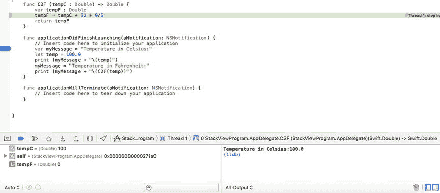  
图 23-7. “单步进入”命令允许你逐行执行函数或方法中存储的代码

选择“调试” ➤ “单步跳过”（或按 F6）。Xcode 会高亮显示断点下的下一行代码。调试区左侧的信息会显示程序当前使用的值，如图 23-6 所示。请注意，在断点代码运行后，`myMessage` 变量的值现在被定义为字符串“Temperature in Celsius:”。

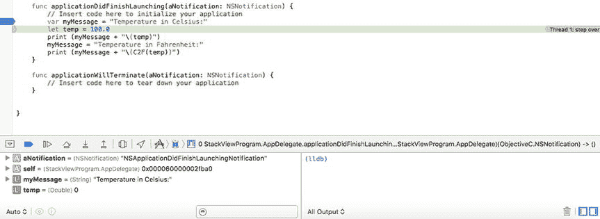  
图 23-6. 通过观察变量如何变化，可以看到每一行代码如何影响每个变量

选择“产品” ➤ “运行”。请注意，Xcode 会高亮显示断点所在的代码行，如图 23-5 所示。请注意，最初 `myMessage` 变量的值未定义。

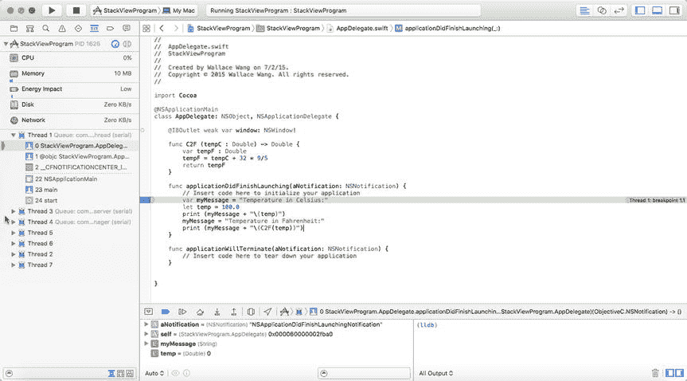  
图 23-5. 断点会暂停程序执行，以便你检查其当前状态

确保在 Xcode 中加载了 DebugProgram 项目。  
在项目导航器窗格中单击 `AppDelegate.swift` 文件。  
按如下方式修改 `C2F` 函数：

```
func C2F (tempC : Double) -> Double {
    var tempF : Double
    tempF = tempC + 32 * 9/5
    return tempF
}
```

将光标移动到 `applicationDidFinishLaunching` 函数中下面这行代码内的任意位置：`var myMessage = "Temperature in Celsius:"`  
选择“调试” ➤ “断点” ➤ “在当前行添加断点”。Xcode 会显示一个断点，如图 23-4 中的蓝色箭头所示。

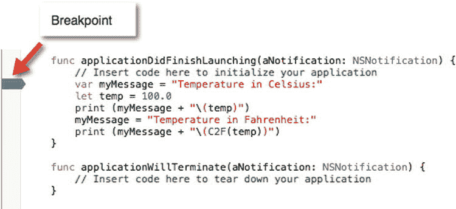  
图 23-4. 断点出现在 Swift 代码的左侧


### 管理断点

在程序中可以设置任意数量的断点，因此请根据需要随意放置，以帮助追踪错误。当然，如果在程序中设置了断点，你可能会忘记已经设置了多少个断点以及它们的位置。为了帮助你管理断点，Xcode 提供了断点导航器。

你可以通过以下三种方式之一打开断点导航器：

- 选择 `View ➤ Navigators ➤ Show Breakpoint Navigator`
- 按下 `Command+7`
- 在导航器窗格中点击 `Show Breakpoint Navigator` 图标

断点导航器会列出你在程序中设置的所有断点，标识断点所在的文件以及每个断点的行号，如图 23-8 所示。

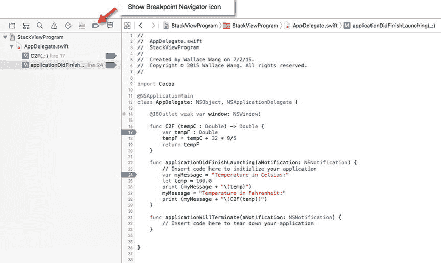

图 23-8. 断点导航器标识了所有断点

由于断点导航器通过行号来标识断点，你可能希望 Xcode 编辑器中显示行号（见图 23-8）。要开启行号显示，请按照以下步骤操作：

1. 选择 `Xcode ➤ Preferences`。Xcode 偏好设置窗口出现。
2. 点击 `Text Editing` 图标。文本编辑选项出现。
3. 勾选 `Line numbers` 复选框，如图 23-9 所示。

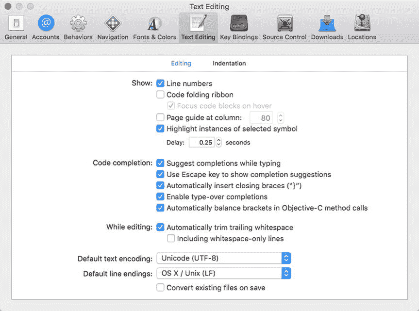

图 23-9. `Line numbers` 复选框用于在 Xcode 编辑器中显示或隐藏行号

点击 Xcode 偏好设置窗口左上角的关闭按钮（红色按钮）。Xcode 现在会在编辑器的左侧边距中显示行号。

要了解如何使用断点导航器，请按照以下步骤操作：

1. 选择 `Disable Breakpoint`。请注意，这样你可以单独停用或禁用断点，而不是通过 `Debug ➤ Deactivate Breakpoints` 命令一次性全部停用。
2. 在断点导航器窗格中右键点击任意断点，然后选择 `Delete Breakpoint`。（删除断点的另一种方法是将断点从代码中拖开，然后松开鼠标左键。）
3. 删除所有断点，直到没有剩余断点。
4. 确保 Xcode 中已载入 `DebugProgram` 项目。
5. 在 Xcode 中开启行号显示。
6. 在项目导航器窗格中点击 `AppDelegate.swift` 文件。
7. 在你喜欢的位置放置三个断点，可以使用你最擅长的方法，例如在 Xcode 编辑器的左侧边距中点击、按下 `Command+\`，或选择 `Debug ➤ Breakpoints ➤ Add Breakpoint at Current Line`。（具体位置无关紧要。）
8. 在项目导航器窗格中点击 `MainMenu.xib` 文件。Xcode 会显示程序的用户界面。
9. 选择 `View ➤ Navigators ➤ Show Breakpoint Navigator`。断点导航器会显示你的三个断点。
10. 点击任意断点。Xcode 会显示包含该断点的文件。
11. 在断点导航器窗格中右键点击任意断点。会弹出一个菜单，如图 23-10 所示。

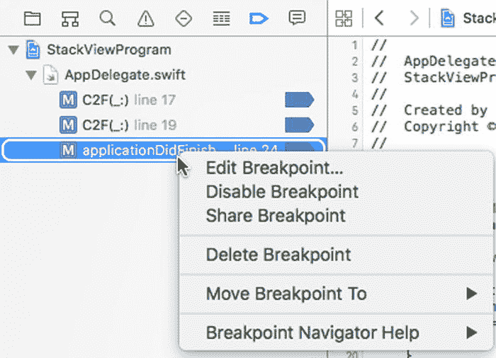

图 23-10. 断点导航器让你可以查看断点的放置位置

### 使用符号断点

创建断点时，必须将其放在希望程序执行暂时停止的行上。然而，这通常意味着需要猜测问题可能在哪里，然后使用各种逐步命令逐行检查代码。

为了避免这个问题，Xcode 提供了符号断点。符号断点仅在特定函数或方法运行时才停止程序执行。如果你不希望每次特定函数或方法运行时程序都停止执行，可以告诉 Xcode 忽略一定次数，例如十次。这意味着该函数或方法可以运行多达十次，然后在第十一次被调用时，符号断点会暂时暂停执行，以便你可以逐行调试代码。

要创建符号断点，你可以定义以下内容：

- `Symbol` – 要暂停程序执行的函数或方法名称。
- `Module` – 包含 `Symbol` 文本字段所定义函数或方法的文件名。
- `Ignore` – 在暂时暂停程序执行之前，希望函数或方法运行的次数（从 0 或更多次数开始）。

要了解符号断点的工作原理，请按照以下步骤操作：

1. 选择 `Product ➤ Stop` 来停止程序运行。
2. 选择 `View ➤ Navigators ➤ Show Breakpoint Navigator`。断点导航器窗格出现。
3. 在断点导航器窗格中右键点击 `C2F` 断点，在弹出的菜单中选择 `Delete Breakpoint`。此时断点导航器窗格中应不再显示任何断点。
4. 点击 `Symbol` 文本字段并输入 `C2F`，这是你要检查的函数或方法的名称。
5. （可选）如果在 `Symbol` 文本字段中指定的函数或方法名称在其他文件中也有使用，请点击 `Module` 文本字段并输入一个文件名。该文件名会将符号断点限制在指定文件的该函数或方法中。由于 `C2F` 函数只使用一次，你可以将 `Module` 文本字段留空。
6. （可选）点击 `Ignore` 文本字段并输入一个数字，以指定在暂停程序执行之前忽略函数或方法被调用的次数。在本例中，将 `Ignore` 文本字段保留为 `0`。
7. 点击符号断点弹出窗口之外的任意位置，使其消失。
8. 选择 `Product ➤ Run`。`C2F` 符号断点会导致程序在 `C2F` 函数中计算结果的第一行代码处暂时暂停执行，如图 23-12 所示。

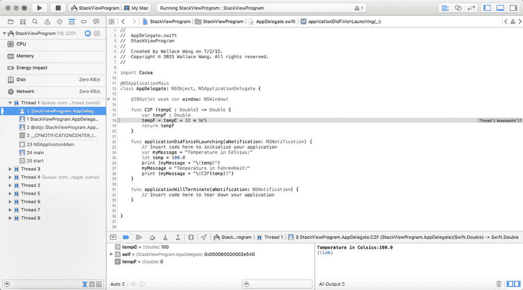

图 23-12. 符号断点暂停了 `Symbol` 文本字段定义的 `C2F` 函数的执行

9. 确保 Xcode 中已载入 `DebugProgram` 项目。
10. 选择 `Debug ➤ Breakpoints ➤ Create Symbolic Breakpoint`。符号断点弹出窗口出现，如图 23-11 所示。

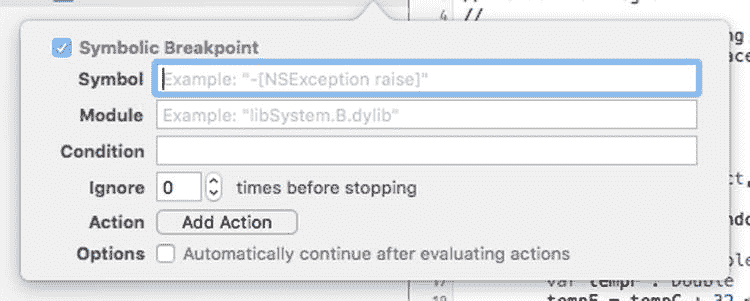

图 23-11. 符号断点弹出窗口允许你定义断点

> **注意**：另一种不指定具体代码行来设置断点的方法是创建异常断点。通常，如果程序崩溃，Xcode 会显示一堆晦涩难懂的错误信息，你根本不知道是什么原因导致的。如果设置了异常断点，Xcode 就能识别导致崩溃的代码行，从而便于修复。


### 使用条件断点

断点通常会在每次执行到特定代码行时暂停程序。然而，你可能只希望在满足某个条件时才在该行暂停程序执行，例如当某个变量超过特定值时，这可以作为程序出现异常的提示信号。

要了解条件断点的工作方式，请按照以下步骤操作：

1. 点击“条件”文本字段，输入 `C2F(temp) > 200`，然后按回车键。
2. 选择“产品”➤“运行”。Xcode 会高亮显示你的断点，并临时暂停程序执行，这意味着条件（`C2F(temp) > 200`）必须为真。
3. 选择“产品”➤“停止”来终止并退出程序，返回 Xcode。
4. 选择“视图”➤“导航器”➤“显示断点导航器”，右键点击你创建的断点，选择“编辑断点”。将弹出窗口。
5. 点击“条件”文本字段，将文本编辑为 `C2F(temp > 500)`。按回车键。
6. 选择“产品”➤“运行”。注意，这次断点没有暂停程序执行，因为其条件（`C2F(temp) > 500`）不成立。由于断点没有中断程序，程序的空白用户界面出现了。
7. 选择“调试程序”➤“退出调试程序”。
8. 将断点从左侧边栏拖走，松开鼠标左键即可删除该断点。（你也可以在“断点导航器”窗格中右键点击该断点，选择“删除断点”。）
9. 确保 `DebugProgram` 项目已加载到 Xcode 中。
10. 在“项目导航器”窗格中点击 `AppDelegate.swift` 文件。
11. 通过点击左侧边栏，或将光标移至该行并按 Command+\，或选择“调试”➤“断点”➤“在当前行添加断点”，在以下代码行设置断点：`print (myMessage + "\(C2F(temp))")`
12. 选择“视图”➤“导航器”➤“显示断点导航器”。“断点导航器”窗格出现，显示你刚刚创建的断点。
13. 在“断点导航器”窗格中右键点击该断点，选择“编辑断点”。弹出窗口如图 23-13 所示。

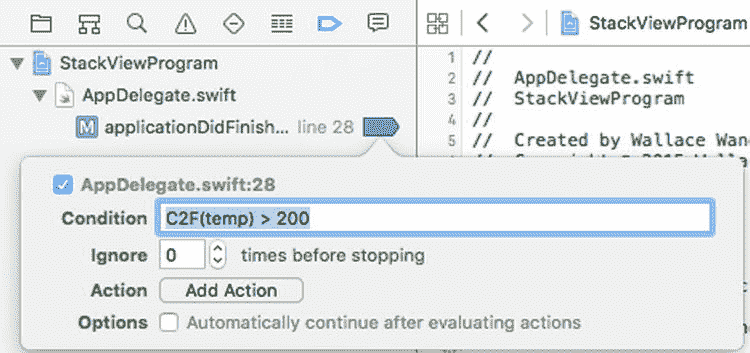

**图 23-13.** 符号断点在“符号”文本字段定义的 `C2F` 函数中暂停程序执行

### 在 Xcode 中排除断点故障

从操作系统、游戏到电子表格和文字处理器，每个程序中都会出现 Bug。请记住，Xcode 本身也是一个程序，因此它也存在 Bug，这有时会令你困扰，直到 Apple 在后续版本中更新并修复这些 Bug。

在 Xcode 中使用断点时一个常见问题是它们并非始终有效。断点本应暂停程序执行，但如果 Xcode 似乎忽略了你的断点，可能有多方面原因（不涉及 Xcode 本身的 Bug）。

首先，请确认你没有通过按 Command+Y 或选择“调试”➤“停用断点”而意外停用了所有断点。

其次，Xcode 可以在带或不带调试信息的情况下编译程序。通常你需要开启调试信息以便调试程序。然而，当程序准备发布时，你需要剥离调试信息以减少程序的内存和存储占用。如果你意外关闭了调试信息，Xcode 会忽略你设置的所有断点。

要确保调试信息已开启，请按照以下步骤操作：

1. 选择“产品”➤“方案”➤“编辑方案”。出现一个工作表窗口。
2. 点击左侧窗格中的“运行”，如图 23-14 所示。
3. 确保选中“调试可执行文件”复选框。
4. 确保“构建配置”弹出菜单显示的是“调试”（而非“发布”）。
5. 点击“关闭”按钮。

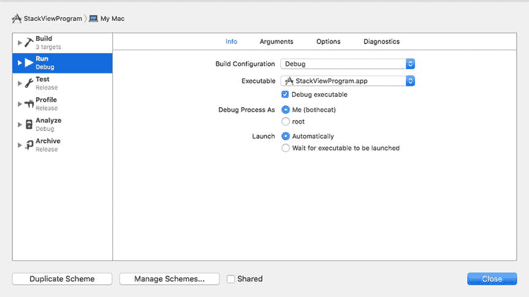

**图 23-14.** 开启调试信息

## 总结

任何程序中都难免出现错误或 Bug。语法错误容易发现和修复，而逻辑错误则更难定位，因为你原本以为代码会产生一种结果，最终却产生了另一种结果。于是，当你自认为一切正确时，却要努力找出哪里做错了。更难追踪的错误是运行时错误，它们往往由于影响程序的未知条件而看似随机发生。

为了帮助你追踪并消除大部分 Bug，你可以使用 `print` 命令结合注释，但对于更稳健的调试，你应该使用 Xcode 内置的调试器。借助调试器，你可以在代码中设置断点，并观察值如何存储在一个或多个变量中。

条件断点仅在满足特定条件时暂停程序执行。符号断点仅在特定函数或方法被调用时暂停程序执行。一旦断点暂停了程序，你可以使用各种单步命令逐行检查代码。“进入”命令允许你查看函数或方法内部存储的代码，而“跳出”命令则允许你提前退出函数或方法并跳回到调用点。

通过使用断点和单步命令，你可以逐行详尽地检查程序的工作方式，从而尽可能多地消除错误。程序中的错误越少，用户就会越满意。


