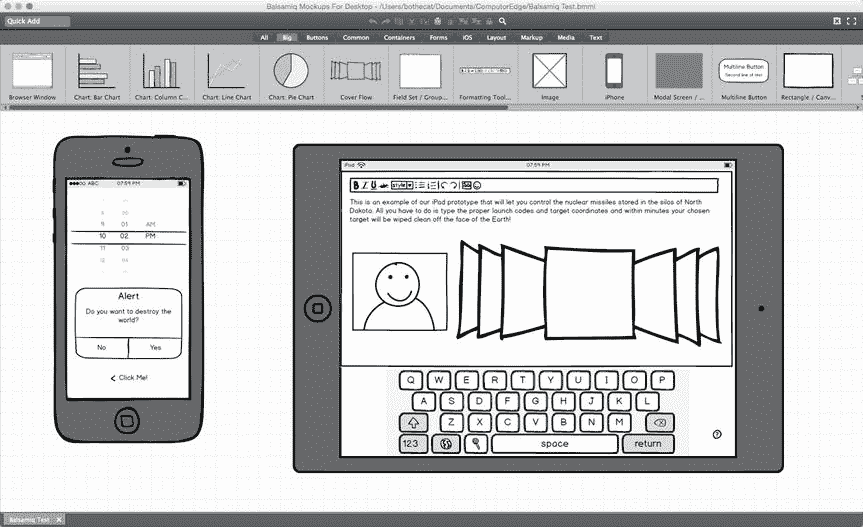
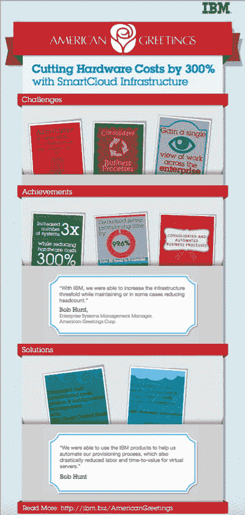

# 24. 编程前后的规划

在你投入数天、数周、数月甚至数年的时间开发一个程序之前，首先要确保这个世界确实需要你的程序。如果你是为自己编写程序，那大可不必理会外界的看法。然而，如果你打算将程序出售给他人，那么在开始之前，就要确保你的程序有未来。

判断你的程序是否有市场，其中一种方法是寻找竞争对手。大多数人认为瞄准一个没有竞争的市场更好，但如果没有竞争，这很可能是一个强烈信号——这个市场也不存在。

相反，如果你发现某个市场充斥着大量竞争对手，这意味着这类程序有着活跃的市场。只要快速搜索一下彩票选号软件或占星程序，你就会发现大量的竞争者。竞争越激烈，市场就越活跃。

如果一个市场仅由一两家大公司主导，那么该市场的机会很可能已经过去了。例如，尽管有 OS X 和 Linux 操作系统，但 Windows 仍然是个人电脑的主宰操作系统。这意味着你试图编写一个与之抗衡的操作系统，多半是在浪费时间。

同样地，当今市场上主流文字处理器、电子表格和演示文稿软件屈指可数，这意味着试图开发另一款通用的文字处理器、电子表格或演示文稿软件，很可能徒劳无功。

竞争激烈意味着市场活跃。竞争极少或没有竞争，则意味着该市场可能已有一个领导者，你的程序很可能永远无法推翻它。试图说服人们放弃 `Microsoft Word` 或 `Pages` 来购买你的文字处理器，很可能是浪费时间。

不过，可以寻找利基市场。例如，文字处理器市场可能已被 `Microsoft Word` 主导，但专业化的文字处理器仍有需求。虽然 `Microsoft Word` 可以用来写剧本和小说，但它并非为此优化。正因如此，其他公司才能成功销售专门用于剧本写作或小说写作的文字处理器，这些工具能帮助你组织思路。

这类细分市场对于大公司来说太小，不值得担忧，这意味着你永远不必直接与这些大公司竞争。除了瞄准大公司忽视的利基市场外，第二种方法是找出大公司软件中缺少的功能，然后编写一个满足这一缺失需求的程序。

例如，`Microsoft Office` 提供了密码保护功能来锁定文件。然而，微软的加密功能很弱，很容易被破解。因此，存在一个对软件的市场需求，这类软件能提供比 `Microsoft Office` 好得多的文件加密功能，同时又提供与 `Microsoft Office` 类似的用户界面。

最重要的是，编写程序应该是因为你对这个特定领域感兴趣，而不是因为你认为它能让你赚大钱。销售房地产管理软件或无人机控制软件可能有利可图，但除非你对这些领域感兴趣，否则你很可能缺乏热情和长期兴趣，无法投入开发并推广面向这些用户所需的大量时间。

一般情况下，要避免直接与大公司竞争。即使是苹果公司，也无法在个人电脑操作系统市场上与 `Microsoft Windows` 抗衡，而像 `Linux` 这样的免费产品也未能对 `Windows` 取得太大成功。

与其直接与大公司竞争，不如寻找那些大公司因为规模太小而不愿涉足的利基市场，或者寻找补充大公司现有程序的方式。最重要的是，在你充满热情致力于解决的领域里发现问题，这能给你动力去创造最优秀的程序。

## 明确程序的目的

当程序员刚开始有一个想法时，他们的自然倾向是冲向电脑，开始编写代码。然而，这就像你住在洛杉矶，突然想去纽约，然后跳上车就直接开过去。你最终或许能到达那里，但如果没有计划，你很可能因为没有规划好路线或没有带上能让旅途更愉快的东西而浪费时间。

正如你在匆忙前往另一个城市之前，应该花时间提前规划一样，在开发一个新程序时，你也应该花时间提前规划。如果你在灵感迸发下匆忙开始编写 Swift 代码，很可能在程序完成之前很久，你的精力和想法就已用尽。这很可能导致一个半成品、设计糟糕的程序，为了让它能工作，需要大量修改或者彻底丢弃。

编写代码实际上是创建任何程序中最直接的部分。编程最困难的部分可能是决定程序完成后你希望得到什么。

例如，如果你正在学习和试验 Swift，你可能创建程序只是为了了解某个特定功能，比如如何从股票市场网站检索数据，或者如何为游戏创建动画。在这种情况下，你的目标只是创建一些短小的、一次性使用的程序，让你理解如何使用特定的编程功能。

如果你打算为他人创建程序，那么你需要做一些额外的规划。首先，你为什么想为别人创建程序？也许你想为某个特定的人创建一个定制程序。也许你想创建一个具备当前程序所缺少功能的程序。无论出于什么原因，每个程序最终都必须满足用户的需求。

如果你创建程序是为了自己使用，那么你就是用户。但如果你是为他人创建程序，那么用户可能是特定的某个人和某台电脑（比如你所在牙科诊所的一位牙医），或者是一个通用的用户群体（任何需要管理牙科诊所的牙医）。无论用户是谁，都要确定你的程序必须为用户解决的最重要的一个任务。然后确保你的程序能正确完成这一关键任务。

> **注意**
> 2000 年至 2005 年间，美国联邦调查局花费了 1.7 亿美元创建了一个名为 `Virtual Case File` 的程序。由于该程序应该做什么以及如何工作的规格不断变更，政府最终放弃了整个项目。如果你不知道程序应该做什么，你就不会知道它应该如何实现那个结果。

在编写任何程序之前，请明确以下内容：

- 谁是这个程序的用户？
- 这个程序应该为用户做什么？
- 这个程序将如何为用户实现那个结果？

你的程序的用户完全决定了程序用户界面的设计。比较一下 777 喷气式客机的驾驶舱和普通汽车的仪表盘。对普通人来说，777 的驾驶舱可能看起来令人生畏，但对经验丰富的飞行员来说，一切都在触手可及且易于理解的范围内。如果你的程序面向专业人士，你的用户界面可以依赖用户的知识来操作。如果你的程序面向普通大众，你的用户界面可能需要更频繁地引导用户。

每个程序都必须为用户创造有用的结果。文字处理器将文本组织成排版整齐的页面，电子表格自动且准确地计算数学公式，即使是游戏也提供了娱乐。想象你的程序赋予用户一种通过其他方式无法获得的神奇能力。你的程序将赋予用户什么神奇能力呢？

一旦你明确了程序应如何为用户提供服务，最后一步便是确定它将如何实现这一目标。程序通常从用户处接受输入，以某种方式处理该输入，然后提供新的结果。作为程序员，你需要一步步确定如何达成这个新结果。接着，你需要将这些步骤翻译成一种编程语言，例如 `Swift`。

归根结底，编程是一门创造性的技艺，需要明确、具体的目标和有方法论的坚持才能成功。

## 设计程序的结构

一旦你清楚程序需要做什么以及如何做，下一步就是设计程序实际运行的方式。编写程序没有唯一的“最佳”方法，因为同样一个程序你可以用一百万种不同的方式去写。然而，你需要设计的程序不仅要能运行，还必须易于理解和未来的修改。

每个程序总有改进的空间。有时改进意味着优化程序，使其运行更快或占用更少内存。其他时候改进则意味着为程序增加新功能。无论哪种情况，每个程序在其生命周期中很可能会经历多次修改，因此从一开始就设计出易于理解和修改的程序至关重要。

在面向对象编程的世界里，设计程序的常见方法是将一个大型程序拆分为多个代表逻辑功能的对象。例如，如果你正在设计一个控制汽车的程序，你可以将程序划分为以下对象：

-   引擎对象
-   转向对象
-   音响对象
-   变速箱对象

现在，如果你需要改进程序的转向能力，你只需用一个新的转向对象替换旧的转向对象，而不会影响到程序的其他部分。

如何将程序划分为对象是完全任意的。你同样可以把同一个汽车程序设计成以下对象：

-   前部对象
-   后部对象
-   内部对象
-   底盘对象

如果你从一开始就设计好了程序，你或其他人将来就能轻松地对其进行修改。

## 设计程序的用户界面

除了程序结构的设计，程序的另一个关键元素是用户界面。借助 `Xcode`，你可以将程序的结构（其各种对象）与用户界面完全隔离地进行设计（反之亦然）。这让你可以自由地轻松设计和修改程序结构或用户界面，而不会影响程序的另一部分。

用户界面定义了用户如何看待你的程序。糟糕的用户界面使程序难以使用。良好的用户界面则让程序易于使用。即使程序的底层结构很糟糕，一个好的用户界面也能让程序看起来响应迅速、优雅且设计精良。

那么，什么是好的用户界面呢？理想情况下，用户界面应当消融在背景中，以至于用户甚至意识不到它的存在。当你用两个手指在 `iPhone` 或 `iPad` 屏幕上捏合时，你可以让图像变大或变小。

从用户的角度来看，用户界面似乎根本不存在，因为用户感觉到的是直接操作图像。实际上，用户界面将用户的指尖位置转换为放大图像外观的操作。用户界面仍然存在，但用户无需阅读厚厚的培训手册并遵循多个步骤来操作它。一个优秀的用户界面本质上会融入背景之中。

以下是一个笨拙的用户界面完成完全相同任务的方式。首先，用户必须点击屏幕上的一个按钮来显示一个菜单。其次，用户必须从该菜单中选择一个缩放命令。第三，用户必须输入一个代表缩放百分比的数字，例如 50%或 125%。第四，用户必须点击一个确定按钮，才能最终完成任务并改变图像的缩放比例。

你更愿意使用哪个用户界面？

作为一般规则，完成任务所需的步骤越多，用户界面就越难使用，因为如果用户遗漏了一个步骤或搞乱了其中一个步骤的顺序，整个任务就会失败。程序员常常试图通过添加快捷键或工具栏图标等方式来增加完成同一任务的途径，以修复糟糕的用户界面设计。不幸的是，如果你的用户界面本身就很差，增加更多完成同一任务的方式并不一定会让界面变得更容易使用。

如果你有一个糟糕的用户界面，与其尝试修复一个有缺陷的设计，不如重新设计整个界面可能更容易。

### 用纸笔设计用户界面

作为一般规则，你对用户界面的第一个想法很少会是最终设计。这是因为你认为可行的方案实际上可能行不通，而你甚至可能没考虑到的因素对于你的用户来说却至关重要。因此，与其先设计好用户界面再被迫修改，不如先用纸笔画草图来设计用户界面，这样会快得多，也简单得多。

一旦你在纸上有了初步设计，就把它展示给最终用户以获取他们的反馈。尽管看着粗糙画出的、静态的用户界面图像似乎没什么意义，但它可以让你获得关于用户界面整体设计的反馈。在评估初步用户界面时，可以问你的用户：

-   缺少什么？是否有需要展示但没有展示出来的命令或功能？
-   什么是不需要的？当前是否展示了某些不必要显示的命令或功能？
-   什么可以更简单？如何重新排列或组织用户界面以使其更简洁？
-   什么令人困惑？有没有用户不理解的地方？帮助菜单和描述性工具提示永远无法替代更清晰的用户界面设计。
-   什么是直观的？用户会期望用你的用户界面做什么？你的用户界面是支持还是挫败了用户的期望？

在纸上设计用户界面既快又简单。因为你没有在任何一个特定的用户界面设计上投入过多时间，所以放弃糟糕的设计比试图辩解说它该保留要容易得多。

此外，纸面设计便于你或他人在上面涂画以重新设计。因为纸面上的用户界面设计任何人都可以快速简便地完成，所以请随意尝试。你创建的用户界面设计越多，你就越有可能偶然发现一个可行的方案。

研究现有的程序，看看你最喜欢什么，最不喜欢什么。然后将你喜欢的和不喜欢的特性都融入到不同的用户界面设计中去。你认为最好的设计，别人可能最不喜欢；而你认为最不好的设计，别人可能认为是最好的。

### 使用软件设计用户界面

在尝试了不同的用户界面设计并找到一种或多种有潜力的方案后，就该超越纸笔阶段，创建人们能在电脑屏幕上实际看到的用户界面原型了。

纸上看起来不错的设计，在电脑屏幕上可能行不通。更重要的是，电脑屏幕可以创建一种简单的交互形式。当用户点击按钮时，一个新的屏幕就会像真实用户界面那样出现。这种交互性是纸笔设计难以完美模拟的。

创建交互式用户界面原型的一种快速方法是使用演示文稿软件，例如 `PowerPoint` 或 `Keynote`。演示文稿软件允许你创建幻灯片，每张幻灯片可以代表用户界面的一个窗口。你可以放置按钮和图形来创建粗略的用户界面设计，然后在这些按钮和幻灯片之间创建链接，以实现有限形式的交互。

交互式用户界面原型能让你测试用户期望用户界面如何响应。例如，用户可能希望在点击某个命令后看到一个特定窗口。如果你的交互式原型向用户显示了不同的窗口，那么你就会知道需要修正什么。

与纸笔设计一样，用户界面原型的目标是发现哪些设计有效、哪些无效，同时尽可能少花时间在原型设计上。你在原型设计上花的时间越少，就能有越多时间来构思替代方案并进行测试。

除了使用演示文稿软件创建用户界面原型外，你还可以购买专门的模拟软件，这些软件包含常见的用户界面元素，如按钮、窗口和复选框。你可以快速拖放这些元素来创建一个模拟的用户界面，如图 24-1 所示。

图 24-1. `Balsamiq Mockups` 是一款用于创建用户界面原型的专用程序

用户界面原型的软件版本提供了交互性。当你对用户界面设计的原型感到满意后，最后一步就是将原型转换成实际的 `Xcode` 用户界面。

请记住，`Xcode` 允许你将 `Swift` 代码与用户界面完全分开创建。这意味着你无需编写一行代码就能在 `Xcode` 中创建用户界面。当你对用户界面的外观和设计感到满意后，可以将其各种元素（按钮、菜单等）连接到 `IBOutlet` 和 `IBAction` 方法，从而将用户界面与你的 `Swift` 代码关联起来。

## 营销你的软件

创建程序后，你需要对其进行测试以确保它能正常工作。这些早期测试者（被称为 Alpha 和 Beta 测试者）可以帮助发现程序中的错误，以便你立即修复它们。当你的程序尽可能做到无错误时，就是将它推向市场的时候了。

以下是大多数人会犯的最大错误：他们编写了一个程序，建立一个网站来推广该程序或他们的公司，然后坐等订单滚滚而来。在 OS X 世界中，`Apple` 提供了一个特殊的 `Mac App Store`，让每个 `Macintosh` 用户都能接触到你的软件。

然而，仅仅在网站或 `Mac App Store` 上推广你的软件，然后坐等人们购买是远远不够的。为了最大化销售额，你还必须推广你的软件。

对许多人来说，营销意味着花钱做广告。虽然你可以这样做，但最好还是尽量少花钱。花钱做广告和营销很容易，但除非你的广告和营销支出低于其所产生的销售额，否则你就有慢慢破产的风险。大多数人出错的地方在于，他们在广告和营销上花了钱，却完全不知道这些广告和营销是否产生了足够的销售额来证明这笔开销是合理的。

这就是为什么你应该专注于免费的广告和营销方式来推广你的软件，这样你就能了解人们喜欢你的软件的哪些方面、哪些类型的人更有可能购买你的软件，以及接触潜在用户的最佳途径，而这一切都无需让你破产。

例如，假设你销售一款能让视频看起来像几十年前用胶片拍摄的老电影的软件，画面带有划痕、褪色效果，并伴有电影放映机中胶片转动的音效。你可能初步将目标用户锁定为那些想把自己的视频趣味性地变成老电影的人，但你可能会发现，你真正的市场是好莱坞的工作室，他们需要创造视觉特效来模拟老电影。

你最初定位的市场可能对你的软件不感兴趣，但一个完全不同的市场却可能非常需要它。如果你在最初的市场广告上花了钱，就等于把钱浪费在了那些实际上并不真正想要你程序的人身上。只有后来你可能才会找到自己软件的真正市场，它可能来自一个你之前从未想过的、意想不到的细分领域。

所以，不要用花钱来代替市场调研。花更多的钱很容易。但花时间去评估你的营销和广告实际效果如何，以及你的软件是否从一开始就瞄准了最有利可图的市场，这却要困难得多。

除了通过网站以最低成本推广软件之外，以下是一些几乎不花钱或低成本推广软件的方法：

- 开设博客。
- 赠送免费软件。
- 在视频分享网站（如 `YouTube`）上发布你的软件视频。
- 创建并免费提供存储在 `PDF` 文件中的信息，为你的软件的潜在客户提供技巧。
- 找到你的潜在客户聚集的社交网络，参与讨论并回答他们的问题。

### 为你的软件写博客

建立一个网站就像在沙漠中央放置一块广告牌，并希望人们能神奇地找到它。虽然搜索引擎可以帮助人们找到你的网站，但在你的网站上同时包含一个博客会好得多。

博客有几个作用。首先，通过坚持至少每周写一篇博客，你可以为网站生成新内容。新内容会告诉搜索引擎你的网站是活跃的，因此搜索引擎会将你的网站排名比那些数月甚至数年未更新的网站更高。所以，博客能提升你的搜索引擎排名，从而增加潜在客户找到你产品的机会。

其次，博客让你的软件背后有血有肉。通过讨论你在创建软件时遇到的挑战，并回应人们关于你软件的问题，你展示出背后有一个关心产品并愿意回应问题的人。当潜在客户在向一个冷冰冰的公司购买，还是向一个看起来像真人的人购买之间做选择时，这种微妙的差异可以增加他们购买你软件的可能性。

第三，每篇博客文章都像是一则微型广告，为你的软件宣传。大多数人创建一个描述软件的网站，希望这能说服人们购买。然而，博客让你可以专注于软件的不同方面。一篇博文可能谈论你特别引以为傲的一个特色功能。第二篇博文可能讲述一个满意的客户使用你的软件解决某个问题的故事。第三篇博文则可能解释你为何选择以这种方式设计你的程序。

由于每篇博文略有不同，你避免了重复。但同时，由于每篇博文都在持续推广你的软件，你便从不同角度不断为你的软件做广告。这增加了其中某篇博文说服某人购买你软件的可能性。

写博客仅仅是花费时间，但能在反复推广软件的同时，获得更高的搜索引擎排名。把博客看作是互联网上一种免费的广告方式吧。

### 赠送免费软件

公司为什么会免费赠送从食品到牙膏的各种样品，这是有原因的。他们知道，一旦你试用并喜欢上某个产品，你就更有可能购买它。如果你从未试用过某个产品，公司很难说服你去购买。

赠送免费软件的道理相同。有些公司会赠送功能齐全的“精简版”软件。这让客户可以免费试用和使用你的软件。其中一定比例的人最终会想要更高级的功能，这些人就会转化为付费客户。

使用你免费软件的人越多，愿意为高级版付费的人也就越多。

例如，假设有 1% 试用你免费软件的人决定购买你的高级版。如果你能让 100 人使用你的免费软件，那就能带来一笔销售。然而，如果你能让 10,000 人使用你的免费软件，那就能带来 100 笔销售。

由于分发免费软件不会产生任何复制或分发成本，你的广告和营销成本基本上为零。

除了提供程序的免费“精简版”，你还可以提供与主程序相关的免费软件。例如，假设你销售一款面向科学家的文字处理器，用于编写复杂的数学和化学公式。与其赠送程序的免费“精简版”，不如赠送你的目标受众（工程师和科学家）可能会喜欢的免费软件，比如一个交互式元素周期表或一个简单的方程求解程序。

这类免费软件只是白送一些东西给潜在客户。现在，如果他们喜欢你的免费软件，就更有可能信任你的商业软件。如果你的免费软件设计精良且实用，潜在客户就会相信你的商业软件也一定同样设计精良且实用。免费软件让潜在客户可以零风险地试用你的产品。

### 发布关于你软件的视频

对于喜欢阅读的人来说，写博客推广软件是个好办法。不幸的是，在当今繁忙的世界里，很多人没有时间阅读。这就是为什么你可以制作简短视频演示你的软件如何工作，让人们看到你的软件能解决什么问题以及如何解决。

一般来说，没人想购买或使用你的软件。他们真正想要的是你的软件提供的解决方案，而这正是你需要在视频中强调的。不要解释菜单系统或用户界面的组织方式。要专注于解决一个单一问题，并强调你软件的独特之处。

例如，假设你的软件旨在帮助房地产经纪人。你的潜在客户要么想节省时间，要么想赚更多钱，所以要展示你的软件如何帮助房地产经纪人实现这两个目标。展示一个简化现有耗时流程的功能。再展示另一个能通过少量额外工作就增加房产潜在买家数量的功能。始终专注于你的软件如何为用户带来好处。

保持视频简短且切中要害。更多人会观看一个演示单一功能且时长不超过一分钟的视频。而观看一个演示多个功能、时长三十分钟视频的人则要少得多。借助像 YouTube 这样的许多视频分享网站，你甚至可以将多个视频链接在一起，这样当一个视频结束时，第二个视频就会自动开始。现在，每个视频都成了你产品的又一个广告，通过将每个视频与另一个链接，每个新视频都增加了有人找到并至少观看其中一个的机会。

### 免费提供信息

人们倾向于从他们信任的人那里购买更多东西，所以让人们对产生信任的一种方法是免费提供有用的信息。例如，如果你的软件有助于编辑照片，那么可以撰写一份关于拍出更好照片的技巧清单。然后以 PDF 文件的形式分享这份技巧清单，并免费赠送，同时附带一个指向你宣传软件的网站的链接。

免费、有用的信息是一种巧妙的广告。传统广告会直白地推广产品，这可能会立刻让即使是最好的潜在客户也感到反感。免费信息则巧妙地推广产品。由于免费信息对潜在客户有用，他们会更愿意查看它，甚至与他人分享。如果他们需要更多信息，可以访问你的网站。

提供免费信息的一种视觉上吸引人的方式是通过结合文字和图表的**信息图**。信息图以丰富多彩的方式呈现信息，使其易于阅读和理解，而无需浏览大量文字。如图 24-2 所示，就连 IBM 也创建并分发免费的信息图来推广他们的服务和产品。

图 24-2. IBM 提供了一个 PDF 格式的信息图，以推广他们的服务如何帮助了 American Greetings

通过提供免费、有用的信息，你将自己确立为一个权威。如果你能在你的网站上以 PDF 文件和博文的形式提供免费、有用的信息，你就会给人们更多理由反复访问你的网站/博客。人们访问的次数越多，他们最终购买你的软件或告诉他人你的网站/博客的可能性就越大。

免费、有用的信息让你显得值得信赖，从而降低了购买你软件的门槛。人们越信任你，他们就越有可能相信你的产品能实现你所宣称的功能。

### 加入社交网络

在博客中或通过 PDF 文件免费分享有用的信息，有助于将你塑造成所在领域的权威。然而，博客需要有人访问你的网站，而 PDF 文件则需要有人下载。另一种免费分享有用信息的方式是，与流行的社交网络保持持续联系。

找出你潜在客户常去的社交网络并加入其中。现在，当有人提出问题，你就可以介入其中，用有用的建议来回答。目的是解答人们的疑问，并建立自己值得信赖的形象。然后确保你发布的每一条内容都包含一个指向你网站或博客的链接。

访问社交网络能让你比期待他们访问你的博客或找到你的 PDF 文件更快地接触到潜在客户。关键是要确保你提供的是有用的信息，而不是只会惹恼他人的、伪装拙劣的广告文案。人们在社交网络上越是信任你，他们就越有可能访问你的网站或博客。

通过所有这些技巧，目标并非让人立即购买你的产品（尽管那总是好事）。真正的目标是引导他们向进一步了解你和你的产品迈进一步。人们对你的产品了解得越多，就越有可能向你购买。

广告和营销基本上是一场数字游戏。持续以不占用大量时间或金钱的方式免费帮助他人，你最终会发现，人们会主动找到你并购买你的软件。你帮助别人越多，别人就越信任你，并愿意向你购买。

传统的营销和广告方式试图强迫人们听广告、违背他们的意愿进行购买（这也是许多人反感营销和广告的原因）。新的营销和广告方式则是在你要求别人购买之前，先向他们提供一些有价值的东西。

## 总结

大多数程序员专注于提升自己的编程技术知识。虽然尽可能多地了解 Swift 的特性和 Cocoa 框架总是有益的，但仅凭技术知识通常是不够的。

编程不仅仅是编写代码。在你开始编写 Swift 代码之前，需要确保你的程序有市场。与其试图与大公司竞争，不如寻找被大公司忽视的利基市场，或者寻找你的程序可以补充大公司产品的方式。大公司拥有多得多的资源来碾压任何直接竞争对手，因此，通过瞄准利基市场或补充其产品的方式，你可以避免与更大的公司直接竞争。

在开始编写 Swift 代码之前，先创建你的软件用户界面的原型。尽管对程序员来说，用户界面设计可能听起来不如深入研究编写代码的细节那么有吸引力，但它是任何软件项目至关重要的部分。用户界面决定了人们如何看待你的程序。设计良好的用户界面能让你的程序更易用。设计欠佳的用户界面则会让程序看起来更难用，即使它可能具备某些技术特性。

使用纸和笔尽可能快速、低成本地测试你的用户界面设计。当你需要创建交互式的用户界面版本时，可以使用 Keynote 或 PowerPoint 等演示软件创建简单的模拟图，或者考虑购买专门的模拟图构建软件。

当你确定了最终的用户界面设计后，在 Xcode 中将其实现。只需记住，随着你的程序不断演进，你可能仍然需要对你的用户界面做出改变。

最后，当你的程序完成时，你的工作仍未结束。你仍然需要为你的软件做广告和营销。与其花钱购买广告，不如选择免费的方式来推广，这样成本低得多，而且往往更有效。

开一个博客，免费提供信息，为他人提供有价值的东西。你给予别人的越多，别人就越有可能被你的产品吸引并向你购买。

如你所见，编码只是创建和销售软件的一个阶段。技术知识可以创造出软件，但在编码前后，你还需要额外的技能来恰当地设计你的程序，并最终成功将其销售出去。

