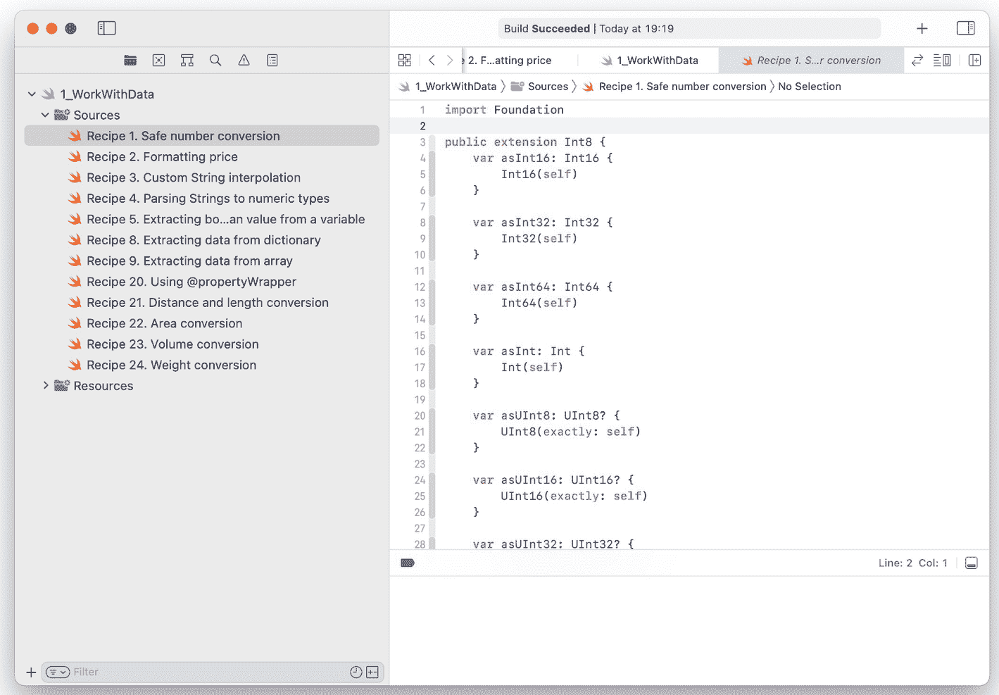

# 1. 处理数据

数据处理是所有计算设备的核心功能。而 iPhone 就是移动计算机。你在社交网络上的个人资料、网站上的 Cookie、电子邮件和短信，甚至是用户界面——所有这些都是数据结构。例如，iOS storyboard 具有 XML 格式；你可以在文本编辑器中打开它们。

因此，将学习如何处理数据作为起点非常重要。我们将处理代表二进制数据的 `Data` 类；我们将转换数据类型并处理转换错误，从 `Dictionary` 和 `Array`（它们是 XML、JSON 及其他交换格式的 Swift 表示）中提取数据，并创建这些结构以将数据传递给 API。最后，我们将讨论序列化和反序列化，这是数据处理中极其重要的概念。

## 数据类型之间的转换

所有编程语言都有基本数据类型和更复杂的结构——Swift 也不例外。Swift 中的基本类型如下：

- `Int` – 整数。例如，1、15 或 -1536。根据架构，它可以是 32 位或 64 位数字。所有现代 Apple 设备都配备 64 位处理器。在这些平台上，`Int` 的范围是从 −2⁶³ 到 2⁶³ − 1。如果你需要使用更大或更小的范围，可以在类型名称中添加位宽整数（存储一个值所需的内存位数）。例如 `Int16` 和 `Int64`。无符号整数具有 `UInt` 类型。
- `Float` 和 `Double` – 浮点数，分别为 32 位和 64 位。这些类型在 UI 开发中被广泛使用。屏幕上的所有坐标都是浮点数。`Float` 的范围是 1.2 * 10^(-38) 到 3.4 * 10³⁸。`Double` 的范围是 2.3 * 10^(-308) 到 1.7 * 10³⁰⁸。浮点数的一个例子是 3.14159265359。
- `Bool` – 布尔值，只能取两个值之一：`true` 或 `false`。用于逻辑表达式和存储简单值（是/否）。
- `String` – 文本数据。在 Swift 中，它是一个 Unicode 文本字符串，这意味着它可以包含所有语言的文本，甚至表情符号。
- `Character` – 单个字符。在 Swift 中，它是一个 16 位的值。

除了基本类型之外，还有数百种更复杂的类型，这些类型是包含基本类型或其他类型的结构。

数据转换是什么意思？Swift 是一种强类型语言，虽然像 C 或 JavaScript 这样的语言允许这样的场景：`a = 1 if (a) ...`，但在 Swift 中是不允许的。你只能在 `if` 语句中使用布尔变量，并且只能将 `Double` 值赋值给 `Double` 变量，甚至不能赋值给 `Float` 变量。这有助于避免许多错误，但迫使开发者手动执行数据转换。还有更复杂的数据转换示例。例如，`1` 和 `"1"` 不是一回事，尽管乍一看可能如此。第一种情况是整数值，而第二种情况是文本（`String` 或 `Character`）。要将一种类型转换为另一种类型，需要编写额外的代码。并且务必不要忘记可能的问题。如果 `String` 中的值对于 `Int` 来说太大怎么办？如果它不是一个数字怎么办？如果它是 `"1"`、`true` 或 `false` 怎么办？

### 安全的数字转换

如果你有几种不同的数字类型，例如 `Int` 和 `Double`，可以这样转换它们：

```
let d: Double = 1.0
let i = Int(d)
```

在前面的示例中，变量 `i` 的值将为 `1`。如果 `d` 的值不在 `i` 的范围内，你将会得到一个……崩溃：

```
let d: Double = 1000000000.0
let i = Int16(d)
```

输出：`Fatal error: Double value cannot be converted to Int16 because the result would be greater than Int16.max.`

解决方案是使用可选的构造器 `init?(exactly:)`：

```
let d: Double = 1000000000.0
let i = Int16(exactly: d)
```

变量 `i` 将是可选的，并且具有 `Int16?` 类型，应用程序不会崩溃，而是会变成 `nil`。还有一个严重的问题——`init?(exactly:)` 仅在浮点值没有小数部分时才返回非 nil 值。如果 `d` 是 `10.5`，转换将返回 `nil`。这个问题有一个很好的解决方案——`rounded()` 方法。它解决了两个问题：

- 它允许精确转换——`10.9` 不会再返回 `nil`。
- 它按照数学规则对数字进行四舍五入。例如，`10.9` 将变成 `11`。

如果四舍五入不是期望的行为，还有另一个选项——`floor` 函数。例如：

```
var i = Int16(exactly: trunc(d))
```

最后，让我们使其更加通用，并允许 `d` 成为可选值：

```
extension Double {
    var asInt16: Int16? {
        Int16(exactly: self.rounded())
    }
}
let d1: Double? = 1000000000.0
let d2: Double? = 10.9
let i1 = d1?.asInt16    // nil
let i2 = d2?.asInt16    // 11
```

在食谱 1-1 中，我们对 `Double` 类进行了扩展。它会自动在 `Double?` 上工作。它简单、100% 安全且通用。


```swift
public extension Int8 {
    var asInt16: Int16 { Int16(self) }
    var asInt32: Int32 { Int32(self) }
    var asInt64: Int64 { Int64(self) }
    var asInt: Int { Int(self) }
    var asUInt8: UInt8? { UInt8(exactly: self) }
    var asUInt16: UInt16? { UInt16(exactly: self) }
    var asUInt32: UInt32? { UInt32(exactly: self) }
    var asUInt64: UInt64? { UInt64(exactly: self) }
    var asUInt: UInt? { UInt(exactly: self) }
    var asFloat: Float { Float(self) }
    var asDouble: Double { Double(self) }
}

public extension UInt8 {
    var asInt8: Int8? { Int8(exactly: self) }
    var asInt16: Int16 { Int16(self) }
    var asInt32: Int32 { Int32(self) }
    var asInt64: Int64 { Int64(self) }
    var asInt: Int { Int(self) }
    var asUInt16: UInt16 { UInt16(self) }
    var asUInt32: UInt32 { UInt32(self) }
    var asUInt64: UInt64 { UInt64(self) }
    var asUInt: UInt { UInt(self) }
    var asFloat: Float { Float(self) }
    var asDouble: Double { Double(self) }
}

public extension Int16 {
    var asInt8: Int8? { Int8(exactly: self) }
    var asInt32: Int32 { Int32(self) }
    var asInt64: Int64 { Int64(self) }
    var asInt: Int { Int(self) }
    var asUInt8: UInt8? { UInt8(exactly: self) }
    var asUInt16: UInt16? { UInt16(exactly: self) }
    var asUInt32: UInt32? { UInt32(exactly: self) }
    var asUInt64: UInt64? { UInt64(exactly: self) }
    var asUInt: UInt? { UInt(exactly: self) }
    var asFloat: Float { Float(self) }
    var asDouble: Double { Double(self) }
}

public extension UInt16 {
    var asInt8: Int8? { Int8(exactly: self) }
    var asInt16: Int16? { Int16(exactly: self) }
    var asInt32: Int32 { Int32(self) }
    var asInt64: Int64 { Int64(self) }
    var asInt: Int { Int(self) }
    var asUInt8: UInt8? { UInt8(exactly: self) }
    var asUInt32: UInt32 { UInt32(self) }
    var asUInt64: UInt64 { UInt64(self) }
    var asUInt: UInt { UInt(self) }
    var asFloat: Float { Float(self) }
    var asDouble: Double { Double(self) }
}

public extension Int32 {
    var asInt8: Int8? { Int8(exactly: self) }
    var asInt16: Int16? { Int16(exactly: self) }
    var asInt64: Int64 { Int64(self) }
    var asInt: Int { Int(self) }
    var asUInt8: UInt8? { UInt8(exactly: self) }
    var asUInt16: UInt16? { UInt16(exactly: self) }
    var asUInt32: UInt32? { UInt32(exactly: self) }
    var asUInt64: UInt64? { UInt64(exactly: self) }
    var asUInt: UInt? { UInt(exactly: self) }
    var asFloat: Float { Float(self) }
    var asDouble: Double { Double(self) }
}

public extension UInt32 {
    var asInt8: Int8? { Int8(exactly: self) }
    var asInt16: Int16? { Int16(exactly: self) }
    var asInt32: Int32? { Int32(exactly: self) }
    var asInt64: Int64 { Int64(self) }
    var asInt: Int? { Int(exactly: self) }
    var asUInt8: UInt8? { UInt8(exactly: self) }
    var asUInt16: UInt16? { UInt16(exactly: self) }
    var asUInt64: UInt64 { UInt64(self) }
    var asUInt: UInt { UInt(self) }
    var asFloat: Float { Float(self) }
    var asDouble: Double { Double(self) }
}

public extension Int64 {
    var asInt8: Int8? { Int8(exactly: self) }
    var asInt16: Int16? { Int16(exactly: self) }
    var asInt32: Int32? { Int32(exactly: self) }
    var asInt: Int? { Int(exactly: self) }
    var asUInt8: UInt8? { UInt8(exactly: self) }
    var asUInt16: UInt16? { UInt16(exactly: self) }
    var asUInt32: UInt32? { UInt32(exactly: self) }
    var asUInt64: UInt64? { UInt64(exactly: self) }
    var asUInt: UInt? { UInt(exactly: self) }
    var asFloat: Float { Float(self) }
    var asDouble: Double { Double(self) }
}

public extension UInt64 {
    var asInt8: Int8? { Int8(exactly: self) }
    var asInt16: Int16? { Int16(exactly: self) }
    var asInt32: Int32? { Int32(exactly: self) }
    var asInt64: Int64? { Int64(exactly: self) }
    var asInt: Int? { Int(exactly: self) }
    var asUInt8: UInt8? { UInt8(exactly: self) }
    var asUInt16: UInt16? { UInt16(exactly: self) }
    var asUInt32: UInt32? { UInt32(exactly: self) }
    var asUInt: UInt? { UInt(exactly: self) }
    var asFloat: Float { Float(self) }
    var asDouble: Double { Double(self) }
}

public extension Int {
    var asInt8: Int8? { Int8(exactly: self) }
    var asInt16: Int16? { Int16(exactly: self) }
    var asInt32: Int32? { Int32(exactly: self) }
    var asInt64: Int64 { Int64(self) }
    var asUInt8: UInt8? { UInt8(exactly: self) }
    var asUInt16: UInt16? { UInt16(exactly: self) }
    var asUInt32: UInt32? { UInt32(exactly: self) }
    var asUInt64: UInt64? { UInt64(exactly: self) }
    var asUInt: UInt? { UInt(exactly: self) }
    var asFloat: Float { Float(self) }
    var asDouble: Double { Double(self) }
}

public extension UInt {
    var asInt8: Int8? { Int8(exactly: self) }
    var asInt16: Int16? { Int16(exactly: self) }
    var asInt32: Int32? { Int32(exactly: self) }
    var asInt64: Int64? { Int64(exactly: self) }
    var asInt: Int? { Int(exactly: self) }
    var asUInt8: UInt8? { UInt8(exactly: self) }
    var asUInt16: UInt16? { UInt16(exactly: self) }
    var asUInt32: UInt32? { UInt32(exactly: self) }
    var asUInt64: UInt64 { UInt64(self) }
    var asFloat: Float { Float(self) }
    var asDouble: Double { Double(self) }
}

public extension Float {
    var asInt8: Int8? { Int8(exactly: self.rounded()) }
    var asInt16: Int16? { Int16(exactly: self.rounded()) }
    var asInt32: Int32? { Int32(exactly: self.rounded()) }
    var asInt64: Int64? { Int64(exactly: self.rounded()) }
    var asInt: Int? { Int(exactly: self.rounded()) }
    var asUInt8: UInt8? { UInt8(exactly: self.rounded()) }
    var asUInt16: UInt16? { UInt16(exactly: self.rounded()) }
    var asUInt32: UInt32? { UInt32(exactly: self.rounded()) }
    var asUInt64: UInt64? { UInt64(exactly: self.rounded()) }
    var asUInt: UInt? { UInt(exactly: self.rounded()) }
    var asDouble: Double { Double(self) }
}

public extension Double {
    var asInt8: Int8? { Int8(exactly: self.rounded()) }
    var asInt16: Int16? { Int16(exactly: self.rounded()) }
    var asInt32: Int32? { Int32(exactly: self.rounded()) }
    var asInt64: Int64? { Int64(exactly: self.rounded()) }
    var asInt: Int? { Int(exactly: self.rounded()) }
    var asUInt8: UInt8? { UInt8(exactly: self.rounded()) }
    var asUInt16: UInt16? { UInt16(exactly: self.rounded()) }
    var asUInt32: UInt32? { UInt32(exactly: self.rounded()) }
    var asUInt64: UInt64? { UInt64(exactly: self.rounded()) }
    var asUInt: UInt? { UInt(exactly: self.rounded()) }
    var asFloat: Float? { Float(exactly: self) }
}
```

## 秘籍 1-1：安全的数值转换

本秘籍可让你安全地将一种数值类型转换为另一种数值类型，并支持此类转换的链式调用。例如，如果你有一个 `Int`，但函数是以 `Double` 扩展的形式提供的，那么这种链式调用就能解决问题：`x.asDouble.process.asInt`。

> **注意**
> 
> 最佳学习方式就是动手尝试。而尝试 Swift 代码的最佳方式就是 Xcode Playground（图 1-1）。要创建新的 playground，请打开 Xcode，打开“File”菜单，选择“New”，然后点击“Playground…”。



*一个 IDE 界面，其中打开了名为“recipe 1 safe number conversion”的代码文件。左侧面板列出了各种源代码和资源。其中定义了 16 位、32 位和 64 位整数。*

**图 1-1**  
Swift Playground


### 数字与字符串的相互转换

将任何类型的数字转换为 `String` 的最简单方法是*字符串插值*。在 Swift 中，你可以通过在变量名前添加 `\(` 并在其后添加 `)`，将任何变量包含在 `String` 中。它甚至适用于表达式和函数。例如：

```
let age = 30
let str = "Your age is \(age). Next year you'll be \(age+1)"
```

如果需要格式化，情况会更复杂。如果你需要获取一个包含价格的字符串，你可能希望货币部分有两位数字。

有两种方法。你可以使用 `String(format:_:...)` 构造器。第一个参数是模板，其余参数是变量。如果你熟悉 C 家族编程语言，你应该知道 `sprintf` 函数。它的工作原理完全相同。示例：

```
let price = 14.50
let priceString = String(format: "Price: $%.02f", price)
```

有时，你需要更灵活的处理。虽然大多数国家使用两位数字表示货币单位，但其他一些国家需要三位数字。一个巴林第纳尔等于 1000 费尔，一个人民币元等于 10 角，依此类推。

根据应用程序的功能，你可以为所有必要的数据类型编写格式化器。如果你使用 `Double` 来存储价格，你可以编写一个扩展来格式化它，并在需要的地方使用它。这样的扩展如配方 1-2 所示。

> **注意**
> 使用 `Double` 来表示价格并不是一个好主意。尽管它们具有高精度，但丢失 0.000...1 可能会使你的显示价格从 1.00 变为 0.99。更可靠的方法是使用简单的 `Int` 并以货币单位来存储价格。或者，你可以使用更复杂的数据结构，将其存储为两个 `Int` 变量——一个表示整数单位，另一个表示货币单位。

```
public extension Double {
    var asPrice: String {
        guard let cents = (self * 100.0).asInt else {
            return ""
        }
        return String(format: "%d.%02d", cents / 100, cents % 100)
    }
}
public extension Int {
    var asPrice: String {
        String(format: "%d.%02d", self / 100, self % 100)
    }
}
配方 1-2
格式化价格
```

*用法*

```
let price = 14.5
let priceString = "Price: $\(price.asPrice)"
```

类似地，你可以格式化任何其他数据。

另一种格式化数字的方法是扩展 `String.StringInterpolation`。它使你可以访问插值逻辑。通常，它用于日期和自定义类型，但你也可以将其用于数字。除非应用程序用于科学目的，否则你不需要超过三位小数来表示双精度浮点数。

快速的解决方案如下：

```
public extension String.StringInterpolation {
    mutating func appendInterpolation(_ value: Double) {
        let formatter = NumberFormatter()
        formatter.decimalSeparator = "."
        formatter.maximumFractionDigits = 3
        if let result = formatter.string(from: value as NSNumber) {
            appendLiteral(result)
        }
    }
}
```

上述扩展将小数位数限制为三位，并添加了小数点分隔符。

但在 `UITableView` 或 `UICollectionView` 中使用时，它只是写起来很快；这可能会导致性能问题。为什么？因为我们每次都会创建并设置 `NumberFormatter`。

正确的解决方案是创建一个惰性变量，它只会创建一次 `NumberFormatter`，然后每次都重用。我们不能在扩展中创建变量，因此我们必须创建一个辅助类，如配方 1-3 所示。

```
class MyFormatters {
    static var formatterWithThreeFractionDigits: NumberFormatter = {
        let formatter = NumberFormatter()
        formatter.decimalSeparator = "."
        formatter.maximumFractionDigits = 3
        return formatter
    }()
}
public extension String.StringInterpolation {
    mutating func appendInterpolation(_ value: Double) {
        let formatter = MyFormatters.formatterWithThreeFractionDigits
        if let result = formatter.string(from: value as NSNumber) {
            appendLiteral(result)
        }
    }
}
配方 1-3
自定义字符串插值
```

> **注意**
> 所有静态变量都是惰性的，因此你无需添加 `lazy` 关键字。更甚至，你也不能这样做。

那么反向转换呢？如果我们得到一个 `String`，如何将其转换为 `Int` 或 `Double` 来执行数值运算？一个简单的答案是：

```
let str = "123.5"
let i = Int(str)
let d = Double(str)
```

这段代码是安全的，因为它返回可选值。在上面的例子中，`i` 将是 `nil`，而 `d` 将是 `123.5`。这是一段非常好用的代码，但存在两种有问题的情形：

1. 如果 `str` 是可选的，它将无法编译。这可以通过 nil 合并运算符（`str ?? ""`）来解决。如果 `str` 是 `nil`，它将被替换为空字符串。由于空字符串无法解析为数字（无论是 `Double` 还是 `Int`），结果将为 `nil`。

2. 在某些语言环境中，小数点分隔符是“`,`”而不是“`.`”。这在解析用户输入时可能会成为一个问题。快速修复方法是将逗号替换为点号：`.replacingOccurrences(of: ",", with: ".")`。

让我们总结一下，并创建一个易于使用的 `String` 扩展（配方 1-4）。

```
public extension StringProtocol {
    var asInt8: Int8? { Int8(self) }
    var asUInt8: UInt8? { UInt8(self) }
    var asInt16: Int16? { Int16(self) }
    var asUInt16: UInt16? { UInt16(self) }
    var asInt32: Int32? { Int32(self) }
    var asUInt32: UInt32? { UInt32(self) }
    var asInt64: Int64? { Int64(self) }
    var asUInt64: UInt64? { UInt64(self) }
    var asInt: Int? { Int(self) }
    var asUInt: UInt? { UInt(self) }
    var asDouble: Double? { Double(self.replacingOccurrences(of: ",", with: ".")) }
    var asFloat: Float? { Float(self.replacingOccurrences(of: ",", with: ".")) }
}
配方 1-4
将字符串解析为数字类型
```

### 布尔值转换

尽管 `Bool` 是最简单的类型，只有两个值，但解析它可能是一个挑战。为了理解原因，请尝试判断 `1` 是 `true` 还是 `false`。大多数开发者会说 `1` 无疑是 `true`，因为 `0` 是 `false`，而任何其他值都是 `true`。这在 Swift 和大多数其他编程语言中正是这样运作的。在某些情况下，`0` 可能表示成功（无错误），而其他值则表示错误代码。如果你遇到这种情况，请记住这一点，但我们将假设 `Int` 在等于 `0` 时转换为 `false`，否则转换为 `true`。

其他问题包括：是否应该将 `"yes"` 或 `"true"` 解析为 `true`，以及如何处理像 `5` 或 `"success"` 这样的自定义值。这取决于数据的来源。你应该阅读所使用的 API 或库的文档并据此做出决定。

配方 1-5 遵循表 1-1 中指定的规则集。

**表 1-1** 任意类型到 Bool 的转换规则

| 解析类型 | 规则 |
| --- | --- |
| `Bool` | 按原样返回解析后的值。 |
| `Int` | 如果值为 `0`，则返回 `false`，否则返回 `true`。 |
| `Float` 或 `Double` | 返回 `nil` 以避免混淆。布尔值绝不应表示为浮点数。 |
| `String` | 如果值为 `"true"` 或 `"yes"`，则返回 `true`；如果值为 `"false"` 或 `"no"`，则返回 `false`；在所有其他情况下返回 `nil`。字符串比较应不区分大小写。 |
| 其他类型 | 返回 `nil`。 |

```
// Any 无法被扩展，因此它是一个函数
func parseAsBool(value: Any?) -> Bool? {
    if let boolValue = value as? Bool {
        return boolValue
    } else if let intValue = value as? Int {
        return intValue != 0
    } else if value is Float || value is Double {
        return nil
    } else if let strValue = value as? String {
        let strPrepared = strValue.trimmingCharacters(in: .whitespacesAndNewlines).lowercased()
        if strPrepared == "true" || strPrepared == "yes" {
            return true
        } else if strPrepared == "false" || strPrepared == "no" {
            return false
        } else {
            return nil
        }
    } else {
        return nil
    }
}
配方 1-5
从变量中提取布尔值
```

如果你希望所有数字类型都转换为 `Bool`，你可以使用 `isZero` 函数，而不是返回 `nil`。如果 `Double.isZero` 返回 `true`，则返回 `false`。否则，返回 `true`。


### 字符串与数据的相互转换

`String`和`Data`是 Swift 中两种高度常用的类型。`Data`拥有一个不带有特定语义的字节缓冲区。`String`本质上是相同的，但 Swift 将这一缓冲区解释为字符序列，包括空格和换行等特殊符号。

根据不同的使用场景，你可能需要将`String`转换为`Data`，或者反之。

```
let data = Data()
let str = String(data: data, encoding: .utf8)
```

如果数据无法使用指定的编码（此处为 UTF-8）进行解析，这段代码将返回`nil`。例如，如果你从 iPhone 的存储中读取一个 JPEG 文件（或从互联网上下载它）并将其传递给`String`构造器，它将始终返回`nil`。

从`String`到`Data`的转换在使用 UTF-8 编码时很少失败：

```
let str = "I'm a string"
let data = str.data(using: .utf8)
```

但有些情况下，你可能需要将其编码为 ASCII（美国信息交换标准码），它是 UTF 引入之前的标准。ASCII 每个符号使用 7 位，仅支持 128 个字符（包括特殊字符）。阿拉伯语、日语或西里尔字母无法以此方式编码，因此转换会失败，`Data`将为`nil`。UTF8 数据的转换在秘籍 1-6 中展示。

我们将在第二章更详细地讨论`String`类型及其特性。

```
public extension StringProtocol {
    var asUtf8Data: Data {
        data(using: .utf8)!
    }
}

public extension Data {
    var asUtf8String: String? {
        String(data: self, encoding: .utf8)
    }
}

秘籍 1-6
字符串与数据的相互转换
```

### 日期、时间戳与 ISO 8601 格式

我们经常需要将日期表示为字符串。Swift 内置了`Date`结构体。它同时表示日期和时间，支持时区，并作为许多函数和方法的参数或返回类型使用。使用`Date`的最大问题在于它是 Swift 的内部格式——你无法直接将其传递给服务器；必须将其转换为`String`、`Int`或其他通用格式。

其中一种标准称为*时间戳*或*UNIX 时间戳*。它是一个整数值，表示自*纪元*以来的秒数或毫秒数。纪元是指 1970 年 1 月 1 日午夜。在 Swift 中，时间戳以`Double`表示；它们包含整数部分（秒）和小数部分（秒的分数）。

这两个函数——一个方法和一个构造器——用于`Date`与`Double`之间的相互转换：

```
let date = Date()
let timestamp = date.timeIntervalSince1970
let restoredDate = Date(timeIntervalSince1970: timestamp)
```

时间戳最大的问题在于缺少时区信息。Swift 的`Date`返回自 1970 年 1 月 1 日 UTC（协调世界时）以来的秒数。因此，如果你将其转换为`Date`对象，需要进行正确的时区转换。

另一种表示时间的方式是 ISO 8601 格式。ISO 代表国际标准化组织。任何以 ISO 开头的事物都意味着它是一个标准。

Swift 并未直接提供 ISO 8601 格式的`String`与`Date`之间的转换选项，但使用`DateFormatter`类可以相当容易地实现它，如秘籍 1-7 所示。

```
public extension Formatter {
    static let iso8601withFractionalSeconds: DateFormatter = {
        let formatter = DateFormatter()
        formatter.calendar = Calendar(identifier: .iso8601)
        formatter.locale = Locale(identifier: "en_US_POSIX")
        formatter.dateFormat = "yyyy-MM-dd'T'HH:mm:ss.SSSZZZZZ"
        return formatter
    }()
}

public extension Date {
    var iso8601String: String {
        Formatter.iso8601withFractionalSeconds.string(from: self)
    }

    init?(iso8601String: String) {
        guard let date = Formatter.iso8601withFractionalSeconds.date(from: iso8601String) else {
            return nil
        }
        self = date
    }
}

秘籍 1-7
日期转换为 ISO 8601
```

*用法*

```
let dateWrong = Date(iso8601String: "现在是 5 点")
// dateWrong 为 nil

let dateCorrect = Date(iso8601String: "2021-07-01T18:30:00.000+04:00")
// dateCorrect 是一个有效的 Date 对象
```

请注意，在调试会话中，你将看到你本地时区的时间，这通常就是你想要展示给用户的内容。

## 从字典和数组中提取数据

仅靠简单的数据类型能做的工作有限。在真实的应用中，会使用更复杂的类型。你可以拥有一个包含不同数据类型和内部嵌套不同结构体的结构体。这被称为`Dictionary`。基本上，`Dictionary`是一组键和值的集合。它们可以被特定的数据类型限制。在 Swift 代码中你很少会看到`Dictionary`这个关键字。更常见的语法是：

```
var dict: [String: Any] = [:]
```

这段代码创建了一个`Dictionary`变量。每个键必须是`String`类型。值可以是任何类型，包括另一个字典。

如果你需要一个相同类型值的有序列表，可以使用`Array`。它没有键，但使用索引代替。

```
var arr: [String] = []
```

### 复杂数据类型

字典和数组的组合允许你创建任意复杂度的数据结构。

很容易看出它与 JSON（JavaScript 对象表示法）结构的相似性。JSON 是 API 请求和响应中最流行的格式。当移动应用请求读取天气预报、用户信息或服务器上的任何其他数据时，几乎可以确定它得到的是 JSON。

从 API 返回的`String`或`Data`中解析 JSON 结构将在后面讨论。现在让我们专注于从`Dictionary`和`Array`中提取数据。

### 从字典中提取数据

假设我们有一个`Dictionary`：

```
var dict: [String: Any] = [
    "name": "John",
    "surname": "Doe",
    "age": 30
]
```

今天是 John 的生日，所以我们需要让他年长一岁：

```
if var age = dict["age"] {
    age += 1
    dict["age"] = age
}
```

这里我们遇到了一个问题——代码无法编译。`age`不是数字；它是`Any`。我们不能对`Any`进行递增操作，这没有意义。类型转换可以解决这个问题：

```
if var age = dict["age"] as? Int {
    age += 1
    dict["age"] = age
}
```

这是一段可工作的代码，除了一种情况。API 响应通常由脚本语言生成，而不是像 JavaScript 这样的严格类型语言。年龄很有可能是`"30"`而不是`30`。相反的问题也可能发生。如果文本字符串由数字组成，它可能被解析为一个数字。例如，银行卡号可能被解析为一个很大的`Int`，而你可能需要它作为`String`。或者用户的密码`123456`可能被解析为`Int`而不是`String`。

正如我们已经知道的，Swift 的类型转换不会自动将`Int`变成`String`。而`Bool`变量则完全不确定。秘籍 1-8 中的`Dictionary`扩展将帮助我们解决这个问题。


```swift
public extension Dictionary where Key: ExpressibleByStringLiteral {
    func getInt8(_ key: String, defVal: Int8? = nil) -> Int8? {
        let val = self[key as! Key]
        if val == nil {
            return defVal
        }
        if let ival = val as? Int8 {
            return ival
        }
        if let dval = val as? Double {
            return dval.asInt8
        }
        if let sval = val as? String {
            return sval.asInt8 ?? defVal
        }
        return defVal
    }
    func getUInt8(_ key: String, defVal: UInt8? = nil) -> UInt8? {
        let val = self[key as! Key]
        if val == nil {
            return defVal
        }
        if let ival = val as? UInt8 {
            return ival
        }
        if let dval = val as? Double {
            return dval.asUInt8
        }
        if let sval = val as? String {
            return sval.asUInt8 ?? defVal
        }
        return defVal
    }
    func getInt16(_ key: String, defVal: Int16? = nil) -> Int16? {
        let val = self[key as! Key]
        if val == nil {
            return defVal
        }
        if let ival = val as? Int16 {
            return ival
        }
        if let dval = val as? Double {
            return dval.asInt16
        }
        if let sval = val as? String {
            return sval.asInt16 ?? defVal
        }
        return defVal
    }
    func getUInt16(_ key: String, defVal: UInt16? = nil) -> UInt16? {
        let val = self[key as! Key]
        if val == nil {
            return defVal
        }
        if let ival = val as? UInt16 {
            return ival
        }
        if let dval = val as? Double {
            return dval.asUInt16
        }
        if let sval = val as? String {
            return sval.asUInt16 ?? defVal
        }
        return defVal
    }
    func getInt32(_ key: String, defVal: Int32? = nil) -> Int32? {
        let val = self[key as! Key]
        if val == nil {
            return defVal
        }
        if let ival = val as? Int32 {
            return ival
        }
        if let dval = val as? Double {
            return dval.asInt32
        }
        if let sval = val as? String {
            return sval.asInt32 ?? defVal
        }
        return defVal
    }
    func getUInt32(_ key: String, defVal: UInt32? = nil) -> UInt32? {
        let val = self[key as! Key]
        if val == nil {
            return defVal
        }
        if let ival = val as? UInt32 {
            return ival
        }
        if let dval = val as? Double {
            return dval.asUInt32
        }
        if let sval = val as? String {
            return sval.asUInt32 ?? defVal
        }
        return defVal
    }
    func getInt64(_ key: String, defVal: Int64? = nil) -> Int64? {
        let val = self[key as! Key]
        if val == nil {
            return defVal
        }
        if let ival = val as? Int64 {
            return ival
        }
        if let dval = val as? Double {
            return dval.asInt64
        }
        if let sval = val as? String {
            return sval.asInt64 ?? defVal
        }
        return defVal
    }
    func getUInt64(_ key: String, defVal: UInt64? = nil) -> UInt64? {
        let val = self[key as! Key]
        if val == nil {
            return defVal
        }
        if let ival = val as? UInt64 {
            return ival
        }
        if let dval = val as? Double {
            return dval.asUInt64
        }
        if let sval = val as? String {
            return sval.asUInt64 ?? defVal
        }
        return defVal
    }
    func getInt(_ key: String, defVal: Int? = nil) -> Int? {
        let val = self[key as! Key]
        if val == nil {
            return defVal
        }
        if let ival = val as? Int {
            return ival
        }
        if let dval = val as? Double {
            return dval.asInt
        }
        if let sval = val as? String {
            return sval.asInt ?? defVal
        }
        return defVal
    }
    func geUtInt(_ key: String, defVal: UInt? = nil) -> UInt? {
        let val = self[key as! Key]
        if val == nil {
            return defVal
        }
        if let ival = val as? UInt {
            return ival
        }
        if let dval = val as? Double {
            return dval.asUInt
        }
        if let sval = val as? String {
            return sval.asUInt ?? defVal
        }
        return defVal
    }
    func getFloat(_ key: String, defVal: Float? = nil) -> Float? {
        let val = self[key as! Key]
        if val == nil {
            return defVal
        }
        if let fval = val as? Float {
            return fval
        }
        if let ival = val as? Int {
            return ival.asFloat
        }
        if let sval = val as? String {
            return sval.asFloat ?? defVal
        }
        return defVal
    }
    func getDouble(_ key: String, defVal: Double? = nil) -> Double? {
        let val = self[key as! Key]
        if val == nil {
            return defVal
        }
        if let dval = val as? Double {
            return dval
        }
        if let ival = val as? Int {
            return ival.asDouble
        }
        if let sval = val as? String {
            return sval.asDouble ?? defVal
        }
        return defVal
    }
    func getString(_ key: String, defVal: String? = nil) -> String? {
        let val = self[key as! Key]
        if val == nil {
            return defVal
        }
        if let sval = val as? String {
            return sval.trimmingCharacters(in: .whitespacesAndNewlines)
        }
        return defVal
    }
    func getBool(_ key: String, defVal: Bool? = nil) -> Bool? {
        let val = self[key as! Key]
        if val == nil {
            return defVal
        }
        return parseAsBool(value: val) ?? defVal
    }
}
```

**技巧 1-8** 从字典中提取数据

### 从数组中提取数据

从类型化的 `Array` 中提取数据非常简单：

```swift
let arr: [String] = ["one", "two", "three"]
let firstElement = arr[0]
```

不过最好先确认存在下标为 `0` 的元素。更具挑战性的任务是从 `[Any]` 中获取类型化数据，而我们从解析器中得到的正是这种类型的 `Array`。

其逻辑与 `Dictionary` 相同，但我们还需要检查指定索引的元素是否存在。如果不存在，则返回 `nil`。同理，如果存在数据类型冲突也返回 `nil`。技巧 1-9 展示了完整的 `Array` 扩展。


```swift
public extension Array {
    func getInt8(_ idx: Int, defVal: Int8? = nil) -> Int8? {
        if idx = count {
            return nil
        }
        let val = self[idx]
        if let ival = val as? Int8 {
            return ival
        }
        if let dval = val as? Double {
            return dval.asInt8
        }
        if let sval = val as? String {
            return sval.asInt8 ?? defVal
        }
        return defVal
    }
    func getUInt8(_ idx: Int, defVal: UInt8? = nil) -> UInt8? {
        if idx = count {
            return nil
        }
        let val = self[idx]
        if let ival = val as? UInt8 {
            return ival
        }
        if let dval = val as? Double {
            return dval.asUInt8
        }
        if let sval = val as? String {
            return sval.asUInt8 ?? defVal
        }
        return defVal
    }
    func getInt16(_ idx: Int, defVal: Int16? = nil) -> Int16? {
        if idx = count {
            return nil
        }
        let val = self[idx]
        if let ival = val as? Int16 {
            return ival
        }
        if let dval = val as? Double {
            return dval.asInt16
        }
        if let sval = val as? String {
            return sval.asInt16 ?? defVal
        }
        return defVal
    }
    func getUInt16(_ idx: Int, defVal: UInt16? = nil) -> UInt16? {
        if idx = count {
            return nil
        }
        let val = self[idx]
        if let ival = val as? UInt16 {
            return ival
        }
        if let dval = val as? Double {
            return dval.asUInt16
        }
        if let sval = val as? String {
            return sval.asUInt16 ?? defVal
        }
        return defVal
    }
    func getInt32(_ idx: Int, defVal: Int32? = nil) -> Int32? {
        if idx = count {
            return nil
        }
        let val = self[idx]
        if let ival = val as? Int32 {
            return ival
        }
        if let dval = val as? Double {
            return dval.asInt32
        }
        if let sval = val as? String {
            return sval.asInt32 ?? defVal
        }
        return defVal
    }
    func getUInt32(_ idx: Int, defVal: UInt32? = nil) -> UInt32? {
        if idx = count {
            return nil
        }
        let val = self[idx]
        if let ival = val as? UInt32 {
            return ival
        }
        if let dval = val as? Double {
            return dval.asUInt32
        }
        if let sval = val as? String {
            return sval.asUInt32 ?? defVal
        }
        return defVal
    }
    func getInt64(_ idx: Int, defVal: Int64? = nil) -> Int64? {
        if idx = count {
            return nil
        }
        let val = self[idx]
        if let ival = val as? Int64 {
            return ival
        }
        if let dval = val as? Double {
            return dval.asInt64
        }
        if let sval = val as? String {
            return sval.asInt64 ?? defVal
        }
        return defVal
    }
    func getUInt64(_ idx: Int, defVal: UInt64? = nil) -> UInt64? {
        if idx = count {
            return nil
        }
        let val = self[idx]
        if let ival = val as? UInt64 {
            return ival
        }
        if let dval = val as? Double {
            return dval.asUInt64
        }
        if let sval = val as? String {
            return sval.asUInt64 ?? defVal
        }
        return defVal
    }
    func getInt(_ idx: Int, defVal: Int? = nil) -> Int? {
        if idx = count {
            return nil
        }
        let val = self[idx]
        if let ival = val as? Int {
            return ival
        }
        if let dval = val as? Double {
            return dval.asInt
        }
        if let sval = val as? String {
            return sval.asInt ?? defVal
        }
        return defVal
    }
    func geUtInt(_ idx: Int, defVal: UInt? = nil) -> UInt? {
        if idx = count {
            return nil
        }
        let val = self[idx]
        if let ival = val as? UInt {
            return ival
        }
        if let dval = val as? Double {
            return dval.asUInt
        }
        if let sval = val as? String {
            return sval.asUInt ?? defVal
        }
        return defVal
    }
    func getFloat(_ idx: Int, defVal: Float? = nil) -> Float? {
        if idx = count {
            return nil
        }
        let val = self[idx]
        if let fval = val as? Float {
            return fval
        }
        if let ival = val as? Int {
            return ival.asFloat
        }
        if let sval = val as? String {
            return sval.asFloat ?? defVal
        }
        return defVal
    }
    func getDouble(_ idx: Int, defVal: Double? = nil) -> Double? {
        if idx = count {
            return nil
        }
        let val = self[idx]
        if let dval = val as? Double {
            return dval
        }
        if let ival = val as? Int {
            return ival.asDouble
        }
        if let sval = val as? String {
            return sval.asDouble ?? defVal
        }
        return defVal
    }
    func getString(_ idx: Int, defVal: String? = nil) -> String? {
        if idx = count {
            return nil
        }
        let val = self[idx]
        if let sval = val as? String {
            return sval.trimmingCharacters(in: .whitespacesAndNewlines)
        }
        return defVal
    }
    func getBool(_ idx: Int, defVal: Bool? = nil) -> Bool? {
        if idx = count {
            return nil
        }
        let val = self[idx]
        return parseAsBool(value: val) ?? defVal
    }
}
```

**烹饪秘诀 1-9** 从数组中提取数据

## 本章小结

在本章中，我们展示了即使是简单的数据类型也需要关注，尤其是在类型转换以及从字典和数组等复杂类型中提取数据时。

在下一章中，我们将回顾序列化、数据交换和数据语义等概念，届时数字将不仅仅是一串比特和字节，而是长度、重量或距离。

