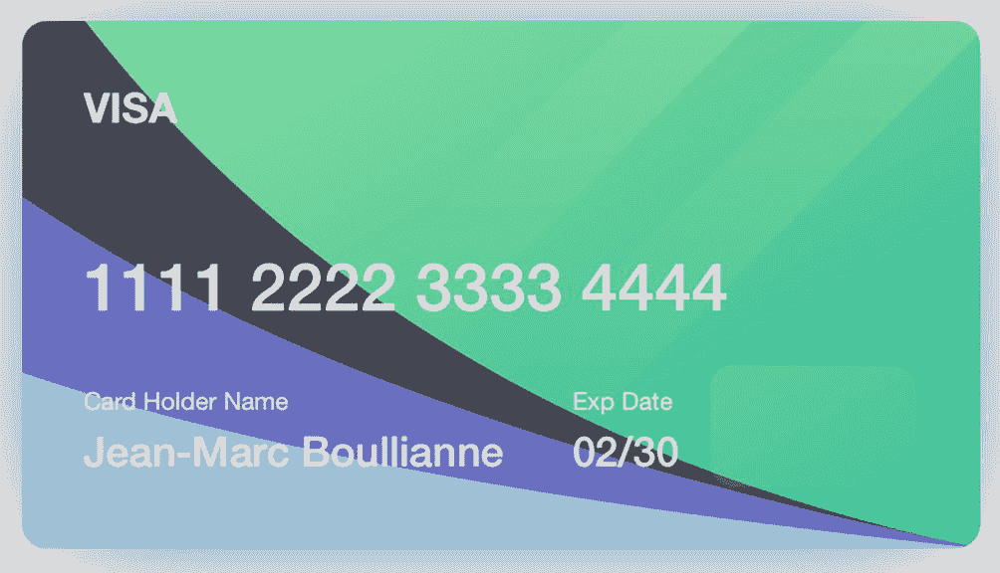

# 3. 使用字符串

字符串也是数据——它们是字节数组。但与简单的`Data`不同，`String`类知道如何解释这些数据。为了正确解释数据，我们需要知道编码。最广泛使用的选项是 UTF-8 和 UTF-16，也称为 Unicode。

UTF-8 使用 1 到 4 个字节来编码一个字符。ASCII 范围内的拉丁字符使用一个字节。如果文本仅包含拉丁字符、空格和标准标点符号，则 ASCII 和 UTF-8 文本字符串是相同的。

UTF-16 每个字符使用 2 或 4 个字节。由于两个字节有 65536 种组合，它们覆盖了大多数现有符号，但并非全部。这就是为什么某些符号需要四个字节。

我们不需要知道`String`或`Character`结构内部使用哪种编码（是的，在 Swift 中，它们被定义为结构体，而不是类）。但是，知道它是一个`String`，我们可以获取关于存储数据的更多信息，相比`Data`对象而言。

我们知道文本字符串由字符组成，因此我们可以获取其中的一个字符。我们还可以获取一个范围，称为`Substring`。我们不需要考虑一个`Character`有多宽；Swift 会自动计算字节宽度。我们可以去除空格和/或换行符，可以将其转换为小写或大写，并且可以分析其内容等。


## 分析字符串内容

假设我们有一个 `String` 对象，想要知道里面具体是什么内容。它包含拉丁字母吗？还是数字？它是一个强密码吗？或者是一个有效的电子邮件地址？

`UIKit` 提供了两个用于获取用户文本输入的类：`UITextField` 和 `UITextView`。两者都将输入数据作为字符串返回。即使我们要求用户输入一个数字（例如他们的年龄、银行卡号、需要猜的数字），并选择仅显示数字的屏幕键盘，我们得到的仍然是一个 `String`（参见方法 3-1）。

```
public extension StringProtocol {
var containsOnlyDigits: Bool {
let notDigits = NSCharacterSet.decimalDigits.inverted
return rangeOfCharacter(from: notDigits, options: String.CompareOptions.literal, range: nil) == nil
}
var containsOnlyLetters: Bool {
let notLetters = NSCharacterSet.letters.inverted
return rangeOfCharacter(from: notLetters, options: String.CompareOptions.literal, range: nil) == nil
}
var containsIllegalCharacters: Bool {
rangeOfCharacter(from: NSCharacterSet.illegalCharacters, options: String.CompareOptions.literal, range: nil) != nil
}
var containsOnlyPasswordAllowed: Bool {
var allowedCharacters = CharacterSet()
allowedCharacters.insert(charactersIn: "!"..."~")
let forbiddenCharacters = allowedCharacters.inverted
return rangeOfCharacter(from: forbiddenCharacters, options: String.CompareOptions.literal, range: nil) == nil
}
var isAlphanumeric: Bool {
let notAlphanumeric = NSCharacterSet.decimalDigits.union(NSCharacterSet.letters).inverted
return rangeOfCharacter(from: notAlphanumeric, options: String.CompareOptions.literal, range: nil) == nil
}
var containsLetters: Bool {
rangeOfCharacter(from: NSCharacterSet.letters, options: String.CompareOptions.literal, range: nil) != nil
}
var containsDigits: Bool {
rangeOfCharacter(from: NSCharacterSet.decimalDigits, options: String.CompareOptions.literal, range: nil) != nil
}
var containsUppercaseLetters: Bool {
rangeOfCharacter(from: NSCharacterSet.uppercaseLetters, options: String.CompareOptions.literal, range: nil) != nil
}
var containsLowercaseLetters: Bool {
rangeOfCharacter(from: NSCharacterSet.lowercaseLetters, options: String.CompareOptions.literal, range: nil) != nil
}
var containsNonAlphanumericCharacters: Bool {
let notAlphanumeric = NSCharacterSet.decimalDigits.union(NSCharacterSet.letters).inverted
return rangeOfCharacter(from: notAlphanumeric, options: String.CompareOptions.literal, range: nil) != nil
}
}
方法 3-1
检查字符串中的数字和字母
```

这三个扩展使我们能够进行快速（但简单）的内容分析：

*   如果 `String` 只包含数字，则 `containsOnlyDigits` 返回 `true`。没有小数点分隔符，没有空格，没有特殊字符。通过将 `String` 转换为 `Int` 也可以得到类似结果，但不会出现潜在溢出问题，并且我们可以区别处理负数。
*   `containsOnlyLetters` 在 `String` 仅包含字母时返回 `true`。未经修改时，它的用途不大，但我们稍后会对其进行更新，使其更强大。
*   `isAlphanumeric` 在 `String` 包含字母和数字时返回 `true`。例如，Firestore 文档 ID 和 MD5 哈希值的 `String` 表示形式始终是字母数字的。

既然我们在讨论现实世界的例子，就让我们谈谈用例吧。注册表单可能包含：

*   名和姓
*   电子邮件地址
*   密码
*   电话号码
*   性别
*   出生日期或年龄
*   信用卡信息
*   地址

当 Apple 的审核人员在注册屏幕上看到这样的列表时，他们会拒绝该应用。但对于特定功能来说，其中任何字段都是必需的。

我们将地址验证排除在讨论范围之外，因为它因国家而异，然后讨论其他字段。对于接下来描述的所有扩展，我们将使用以 `isValid` 开头的名称，例如 `isValidName` 和 `isValidEmail`，并将它们写为计算属性。

**注意**

使用函数还是计算属性始终由程序员决定。有一种流行的观点认为：当函数反映对象的属性且不改变该属性时，应使用计算属性。

## 名、姓和其他名称

根据应用的目标地区和你的偏好，可以是一个全名字段，也可以是分开的名和姓字段，还可以是一组更详细的字段（包括中间名或父名）。这些字段只能包含字母、空格、连字符，或许还可以包含像 "Jr." 或 "Mr." 这种头衔中的点符号。名称验证的示例如方法 3-2 所示。

```
public extension StringProtocol {
var isValidName: Bool {
let allowedCharactgers = NSCharacterSet.letters.union(NSCharacterSet.whitespaces).union(CharacterSet(charactersIn: ".-"))
let forbiddenCharacters = allowedCharactgers.inverted
return rangeOfCharacter(from: forbiddenCharacters, options: String.CompareOptions.literal, range: nil) == nil
}
}
方法 3-2
名称验证
```

此扩展合并了三个字符集：

*   空格
*   字母
*   字符 `.` 和 `-`

它反转结果集，并验证在 `String` 中未发现任何禁止字符。

**注意**

2020 年 5 月，著名商业巨头埃隆·马斯克（PayPal、特斯拉、SpaceX）和加拿大音乐人格莱姆斯有了一个儿子，这个儿子因其非常不寻常的名字 – X Æ A-12 – 而立即声名鹊起。然而，加利福尼亚州的户籍登记处要求名字仅包含英语的 26 个字母字符（外加连字符和撇号）；因此，这个名字被拒绝了。这对夫妇不得不将名字改为 X AE A-XII，其中 X 是名字，AE A-XII 是中间名。就像加利福尼亚州的管理部门一样，我们的扩展也会拒绝第一个选项，而接受最终版本。

## 电子邮件地址

这个话题总是引起很多争议。一些开发者试图将电子邮件地址限制在无问题的范围内，而另一些人则希望给予用户尽可能多的自由——甚至放弃客户端的验证。例如，电子邮件地址 `root@localhost` 有效吗？它实际上是有效的。但是，当用户在应用中注册时，它没什么用，因为我们无法向它发送任何电子邮件，而且它也不是唯一的。

我们将在用户注册的上下文中讨论电子邮件验证。我们将只允许以下格式的电子邮件：`some-string@some-domain.ext`。其中 `some-string` 可以包含拉丁字母、数字以及符号 `.`、`_`、`-`、`%` 和 `+`；`some-domain` 可以包含拉丁字母、数字、`-` 以及用于子域的 `.`；`ext` 必须只包含拉丁字母，长度不小于 2 个字符且不超过 64 个字符。

可以使用正则表达式进行分析，如方法 3-3 所示。我们不会详细讨论正则表达式。简而言之，它是一种模式。正则表达式有标准的语法，该语法在不同的平台和语言中是通用的。用于电子邮件验证的正则表达式如下所示：`[A-Z0-9a-z._%+-]+@[A-Za-z0-9.-]+\.[A-Za-z]{2,64}`。

这并不是正则表达式的唯一选择。还有其他选项，但这个表达式效果很好，并且已经经过数十万用户的测试。它可以与 Firebase Auth 框架一起使用，用于过滤不必要的请求，但如果你有自定义后端，它会更加有用。

```
extension StringProtocol {
var isValidEmail: Bool {
let emailRegEx = "[A-Z0-9a-z._%+-]+@[A-Za-z0-9.-]+\\.[A-Za-z]{2,64}"
let emailTest = NSPredicate(format: "SELF MATCHES %@", emailRegEx)
return emailTest.evaluate(with: self)
}
}
方法 3-3
电子邮件验证
```


### 密码

多么令人烦恼——当你试图将`"12345678"`设置为密码，而应用或网站却不允许时，不是吗？根据应用的具体情况，密码的最低强度要求应有所不同。如果你正在开发一个金融服务应用，密码应该很强。如果是一个个人卡路里计数器或在线视频流媒体服务，那么允许使用简单得多的密码也无妨。但无论如何，有些密码是绝不应被允许的，例如`"12345678"`。

密码的基本建议如下：

*   密码应至少包含一个大写字母和一个小写字母。
*   密码应至少包含一个数字。
*   密码应至少包含一个特殊字符（标点符号、百分号、美元符号等）。
*   密码不应包含空格、换行符或制表符。

最后一条建议是大多数服务的标准，尽管并非严格规则。前面的建议也并非绝对严格，但强制用户满足至少三条中的两条是一个好习惯。

来自配方 3-4 的扩展将验证：

*   字符串仅包含字母数字字符，以及一些特殊字符（点号、逗号等）。
*   字符串至少包含一个英文字母。
*   满足以下三个条件中的两个：
    *   字符串同时包含小写和大写字母。
    *   字符串至少包含一个数字字符。
    *   字符串至少包含一个允许的非字母数字字符。

```swift
public extension StringProtocol {
var isValidPassword: Bool {
if containsIllegalCharacters || !containsOnlyPasswordAllowed {
return false
}
if !containsLetters {
return false
}
var strength = 0
if containsUppercaseLetters {
strength += 1
}
if containsLowercaseLetters {
strength += 1
}
if containsDigits {
strength += 1
}
if containsNonAlphanumericCharacters {
strength += 1
}
return strength >= 3
}
}
配方 3-4
密码验证
```

### 电话号码

电话号码验证是另一项常见操作。毫无疑问，服务器应进行自己的验证。但为了避免不必要的流量、提供快速的错误处理并保护服务器免受潜在有害请求的攻击，最好也在客户端进行验证。

虽然电子邮件地址有更大的灵活性，但电话号码受到数字、加号和分隔符的限制。长度范围很窄，并且因国家而异。我们可以使用正则表达式进行基本验证，但还有一种更高效的方式，我们将在后面讨论。

`PhoneNumberKit`库允许解析电话号码、验证其有效性，并将本地电话号码转换为国际格式。在配方 3-5 中，我们使用该库来验证电话号码的有效性。让我们将其添加到`Podfile`中：

```swift
import PhoneNumberKit
public extension String {
var isValidPhoneNumber: Bool {
do {
try phoneNumberKit.parse("+33 6 89 017383")
return true
}
catch {
return false
}
}
}
配方 3-5
电话号码验证
```

```ruby
pod 'PhoneNumberKit'
```

### 性别

除非绝对必要，否则性别选择不应出现在注册表单中。如果确实需要，请尽量将其设为可选。首先，苹果要求你的应用遵循其《指南》，该指南不允许索要不必要的个人数据。要让苹果相信了解用户性别对应用功能来说是必要的，将会很复杂。其次，向用户提供哪一系列性别选项也并不明确。如果你只提供男性和女性之间的选择，可能会让 LGBTQ+群体感到不满。他们同样是潜在客户，因此这一点需要谨记。

如果你仍然决定在应用中添加性别选择，请将其作为两个或更多选项的选择项来添加，无需使用键盘。这样会使字符串分析变得不必要。

### 出生日期

如果你有成人内容，这个字段可能是必需的。年龄（或出生日期）选择可以让你了解应显示或隐藏哪些内容。如果你的应用销售食品和饮料，你可以对未成年人隐藏酒精和烟草（具体年龄限制取决于地区）。

最佳实践是在你的 UI 中添加一个日期选择器组件，例如`UIDatePicker`。然后使用与你所在地区匹配的日期格式化器之一来格式化日期。例如：

```swift
let selectedDate = Date()
let dateFormatter = DateFormatter()
dateFormatter.dateFormat = "MM/dd/yyyy"
dateFormatter.string(from: selectedDate)
```

日期格式因国家而异。你的应用应使用你所在地区常用的格式，或根据设备设置提供几种选项。

如果你需要处理用户输入，又没有添加日期选择器的选项，`NSDataDetector`可以派上用场（参见配方 3-6）。

```swift
public extension String {
var asDate: Date? {
let range = NSRange(location: 0, length: count)
return try? NSDataDetector(types: NSTextCheckingResult.CheckingType.date.rawValue)
.matches(in: self, range: range)
.compactMap(\.date)
.first
}
}
配方 3-6
从字符串解析日期
```

此扩展将尝试将任何用户输入的字符串转换为`Date`对象，如果无法转换则返回`nil`。


### 信用卡信息

如果想为应用添加任何付费功能，就需要使用应用内购买。苹果不允许你使用直接付款，否则应用将被拒绝。

另一方面，如果你销售的商品或服务不属于应用本身，那么你可能需要获取用户的信用卡号。典型的例子包括外卖应用、在线商店和预订服务。

最常用的信用卡包含以下四个组成部分：

- `Number`（卡号）
- `Expiration`（有效期）月份和年份
- `Security code`（安全码）（`CVC`/`CVV`）
- `Name`（持卡人姓名）

根据卡类型的不同，卡号位数从 16 到 19 位不等。通常，卡号每四位用空格分隔，但这并非强制要求。因此，我们会在验证之前移除所有空格。

至于有效期月份和年份，一切都很直接。月份是 1 到 12 之间的数字，年份有两位或四位数字。我们需要验证有效期是否在当前年月的当月或之后。

安全码始终是一个数字，由三位或四位组成。由于它可能以零开头，因此其整数表示范围是 0 到 9999。

姓名的验证与注册表单上用户名的验证方式相同，因此我们只需复用现有代码即可。完整的信用卡验证代码在示例 3-7 中给出。

```
public struct CreditCard {
    public var number: String
    public var expMonth: Int
    public var expYear: Int
    public var securityCode: Int
    public var nameOnCard: String
    public init(number: String, expMonth: Int, expYear: Int, securityCode: Int, nameOnCard: String) {
        self.number = number
        self.expMonth = expMonth
        self.expYear = expYear
        self.securityCode = securityCode
        self.nameOnCard = nameOnCard
    }
    var isNumberValid: Bool {
        let numberProcessed = String(number.filter { !" ".contains($0) })
        return numberProcessed.containsOnlyDigits && numberProcessed.count >= 16 && numberProcessed.count <= 19
    }
    var isExpirationValid: Bool {
        if expMonth < 1 || expMonth > 12 {
            return false
        }
        let expYear4Digits = (expYear < 100 ? 2000 : 0) + expYear
        let monthToday = Calendar.current.component(.month, from: Date())
        let yearToday = Calendar.current.component(.year, from: Date())
        switch expYear4Digits - yearToday {
        case ..<0: return false
        case 0: return expMonth >= monthToday
        default: return true
        }
    }
    var isSecurityCodeValid: Bool {
        securityCode < 10000
    }
    var isNameValid: Bool {
        nameOnCard.isValidName
    }
    public var isCardValid: Bool {
        isNumberValid && isExpirationValid && isSecurityCodeValid && isNameValid
    }
}
```

与我们之前的大多数示例不同，这个示例是一个类，而不是扩展。信用卡卡号是一个整体概念——例如，我们同时验证月份和年份，因此不会将它们拆分成一组扩展。

在此之前，需要向验证结构中填入数据。使用 `isCardValid` 属性来获取布尔类型的验证结果。如果你需要知道哪个号码组件无效，可以使用 `isNameValid`、`isNumberValid` 等函数。

注意：本章我们讨论的是信息处理，而非用户界面，但有时在应用中（而非 playground）尝试代码可能更为实用。为此，你可以使用用于输入（扫描）和展示银行卡的库。在图 3-1 中，你可以看到由 `CreditCardView` 库（ [`github.com/jboullianne/CreditCardView`](https://github.com/jboullianne/CreditCardView) ）生成的展示效果。至于扫描，你可以使用 `card.io`（ [`github.com/card-io/card.io-iOS-SDK`](https://github.com/card-io/card.io-iOS-SDK) ）。



一张典型的 VISA 卡图片，包含用于容纳 16 位卡号的占位符。持卡人姓名为 Jean Marc Boullianne。有效期是 02/30。

**图 3-1** iOS 应用中的信用卡可视化展示

## Base64 与十六进制编码

我们经常需要将 `Data` 以 `String` 的形式呈现。这可能出于调试输出、传递给服务器或 JSON 集成的需要。有两种常见方式：Base64 编码和十六进制编码。

### Base64 编码

Base64 是一种将二进制数据表示为文本字符串的方法。它将数据分割成 6 位的片段，并使用人类可读的字符进行编码：

- 26 个大写拉丁字母
- 26 个小写拉丁字母
- 10 个数字
- `+`（加号）
- `/`（斜杠）

由于我们只能编码整数个字节，而 1 字节等于 8 位，数据长度需要能被 3 整除。如果不能，则使用填充。当你需要在数据末尾添加空位时，会使用等号（`=`）进行填充。通过添加一个或两个填充位，你总能得到一个同时能被 6 和 8 整除的位数。

Base64 编码的优势在于，用于编码的字符是基本的 ASCII 字符，这意味着它们在所有单字节编码中表示方式相同。

表 3-1 将单词 `"Swift"` 编码为 Base64。

**表 3-1** 单词“Swift”的二进制表示

| S | w | i | f | t |
| --- | --- | --- | --- | --- |
| 0101 0011 | 0111 0111 | 0110 1001 | 0110 0110 | 0111 0100 |

总共得到 40 位，不能被 6 整除，因此我们需要填充。表 3-2 将其分割成 6 位的片段。

**表 3-2** 单词“Swift”的 Base64 表示

| 010100 | 110111 | 011101 | 101001 | 011001 | 100111 | 0100XX |
| --- | --- | --- | --- | --- | --- | --- |
| U | 3 | d | p | Z | n | Q= |

结果：“Swift” -> U3dpZnQ=。

将 ASCII 文本编码为 Base64 通常没有意义，但使用同样的方法，我们可以将图片、音频文件以及几乎所有内容编码为字符串。它比十六进制编码更紧凑，后者每个字节需要两个符号来表示，而 Base64 易于编码和解码。Base64 编码的二进制文件的典型例子是电子邮件附件。示例 3-8 展示了如何从 Base64 解码以及如何编码为这种格式。

```
let base64String = "U3dpZnQ="
let data = Data(base64Encoded: base64String)!
// 检查我们是否得到了正确的文本
let decodedString = String(data: data, encoding: .utf8)!
print(decodedString)
let base64Again = data.base64EncodedString()
print(base64Again)
```

在前面的例子中，我们使用可选构造器 `Data(base64Encoded:)` 将 Base64 字符串解码为 `Data`。在这种情况下，我们使用了强制解包，因为我们知道它有效。请记住，在生产代码中，这不是推荐的做法。

`Data` 有一个用于编码的方法 `base64EncodedString`。这些是标准的 Swift 函数；在这种情况下不需要额外的代码。


### 十六进制编码

十六进制表示法更易读且更简单。我们不需要任何填充；每个字节用两个十六进制符号表示。十六进制符号是 0 到 9 的数字或 A 到 F 的字母。每个十六进制符号编码 4 位信息。

让我们重复对字符串 `"Swift"` 的编码过程（表 3-3）。

**表 3-3** 单词“Swift”的二进制表示

| S | w | i | f | t |
| --- | --- | --- | --- | --- |
| 0101 0011 | 0111 0111 | 0110 1001 | 0110 0110 | 0111 0100 |

表 3-4 展示了它在十六进制表示中的样子。

**表 3-4** 单词“Swift”的十六进制表示

| 0101 | 0011 | 0111 | 0111 | 0110 | 1001 | 0110 | 0110 | 0111 | 0100 |
| --- | --- | --- | --- | --- | --- | --- | --- | --- | --- |
| 5 | 3 | 7 | 7 | 6 | 9 | 6 | 6 | 7 | 4 |

如你所见，十六进制比 Base64 更长。在这个特定案例中，它看起来像一个数字。但通过一些练习，你可以学会阅读它。例如，S 将始终编码为 53，w 编码为 77，以此类推。

**注意**

在源代码中，十六进制数字以 `0x` 开头，以避免与十进制数字混淆。如果十六进制表示为 `String`，它会被引号包裹，但没有任何前缀。

让我们切换到代码。来自配方 3-9 的扩展提供了一个计算属性，将 `Data` 转换为十六进制编码的 `String`，以及一个执行反向操作的可选构造函数。

```
public extension Data {
init?(hexString: String) {
if hexString.count % 2 != 0 {
return nil
}
let allowedCharacters = CharacterSet(charactersIn: "01234567890abcdefABCDEF")
if hexString.rangeOfCharacter(from: allowedCharacters.inverted, options: String.CompareOptions.literal, range: nil) != nil {
return nil
}
self.init(capacity: hexString.count / 2)
for i in stride(from: 0, to: hexString.count, by: 2) {
let startIndex = hexString.index(hexString.startIndex, offsetBy: i)
let endIndex = hexString.index(hexString.startIndex, offsetBy: i + 1)
let hexPair = String(hexString[startIndex...endIndex])
let num = UInt8(hexPair, radix: 16)!
self.append(num)
}
}
var hexString: String {
map { String(format: "%02hhx", $0) }.joined()
}
}
```

**配方 3-9** 在十六进制字符串与 Data 之间相互转换

请注意，该构造器是可选的，因为并非每个 `String` 都能转换为 `Data`。我们还使用了强制解包，因为我们提前完成了所有必要的检查，知道将 `hexPair` 转换为 `UInt8` 永远不会失败。

下面的示例将一个十六进制编码的 `"Swift"` 字符串转换为可读文本。

```
let hexSwift = "5377696674"
let hexData = Data(hexString: hexSwift)!
let hexString = String(data: hexData, encoding: .utf8)!
print(hexString)
```

类似地，这些转换可以作为 `String` 扩展来呈现（配方 3-10）：

```
public extension String {
init(hexFromData: Data) {
append(contentsOf: hexFromData.map { String(format: "%02hhx", $0) }.joined())
}
func hexToData() -> Data? {
if hexString.count % 2 != 0 {
return nil
}
let allowedCharacters = CharacterSet(charactersIn: "01234567890abcdefABCDEF")
if hexString.rangeOfCharacter(from: allowedCharacters.inverted, options: String.CompareOptions.literal, range: nil) != nil {
return nil
}
var result = Data(capacity: self.count / 2)
for i in stride(from: 0, to: hexString.count, by: 2) {
let startIndex = hexString.index(hexString.startIndex, offsetBy: i)
let endIndex = hexString.index(hexString.startIndex, offsetBy: i + 1)
let hexPair = String(hexString[startIndex...endIndex])
let num = UInt8(hexPair, radix: 16)!
result.append(num)
}
return result
}
}
```

**配方 3-10** 在十六进制字符串与 Data 之间相互转换（作为字符串扩展）

### MD5、SHA 与其他哈希

当你需要将数据转换为短字符串，且无需恢复原始数据时，哈希非常有用。哈希无法被还原，但可以进行比较。相同的数据总是产生相同的哈希值。

最常见的用例之一是存储密码。你可能知道，需要注册的网站和应用在尝试恢复密码时，绝不会将你的密码发给你——而是建议创建一个新密码。它们之所以这样做，是因为它们不存储你的密码（这并不安全）。它们所做的是存储你密码的哈希值。当你下次登录时输入相同的密码，它们的哈希值匹配，服务器就会返回一个成功的响应。该响应通常是一个会话令牌。如果你至少输错了一个字符，哈希值就会不同，服务器将返回一个错误。哈希值匹配的可能性微乎其微，小到可以忽略不计。

**注意**

一个 MD5 哈希的长度是 128 位（16 字节）。这意味着有 2¹²⁸ 个唯一的哈希值。两个哈希值意外相同的概率是 1/2¹²⁸，大约为 3 × 10^(−39)，即 3 × 10^(−37)%，即 0.0000000000003 幺分比。

哈希的另一个常见用途是数据校验。如果你发送一大块数据（一首 mp3 格式的歌曲包含数百万个字节），你可能希望确保它安全地到达另一端。我们在互联网上使用的协议栈能够为我们保证这一点——它们在底层使用了哈希和控制序列。但有时，我们需要自己验证数据。例如，在应用崩溃或为了省电而终止后，确认数据已完整下载。为此，我们可以预先计算文件的哈希值并将其存储在服务器上。在应用端，我们计算下载文件的哈希值，然后进行比较。如果哈希值匹配，则极有可能是同一份数据。而且，由于哈希值只有 16 字节长（以 MD5 为例），验证起来并不麻烦。

现在让我们看看如何计算哈希值，从最流行的 MD5 开始。


### MD5 哈希

MD5（消息摘要算法第五版）最初是为密码学应用而设计的，但如今已在其他领域得到应用。另一方面，由于存在广泛的安全漏洞，密码学领域已不再广泛使用它。

任何数据都可以进行编码，但通常涉及的是`Data`和`String`对象。在计算哈希值之前，`String`需要先转换为`Data`。结果始终是一个`Data`对象，可以通过十六进制或 Base64 表示形式来打印。

Swift 本身不提供原生的 MD5 哈希实现，但我们可以使用`CommonCrypto`库。请记住，如果您使用的是生产环境的应用（而非 playground），则需要创建一个桥接头文件并包含`CommonCrypto`头文件：

```objc
#import <CommonCrypto/CommonCrypto.h>
```

此外，如果您测试以下代码，可能会收到此警告：

```
'CC_MD5' was deprecated in iOS 13.0: This function is cryptographically broken and should not be used in security contexts. Clients should migrate to SHA256 (or stronger).
```

这意味着 Swift 认为 MD5 算法不适用于加密目的，但可以用于数据验证。至于 SHA-256 及其他算法，我们将在本章后面介绍。配方 3-11 展示了如何计算`Data`和`String`的 MD5 哈希。

```swift
import var CommonCrypto.CC_MD5_DIGEST_LENGTH
import func CommonCrypto.CC_MD5
import typealias CommonCrypto.CC_LONG

public extension String {
    var md5: Data? {
        data(using: .utf8)?.md5
    }
}

public extension Data {
    var md5: Data {
        let length = Int(CC_MD5_DIGEST_LENGTH)
        var hash = Data(count: length)
        _ = hash.withUnsafeMutableBytes { digestBytes -> UInt8 in
            self.withUnsafeBytes { messageBytes -> UInt8 in
                if let messageBytesBaseAddress = messageBytes.baseAddress, 
                   let digestBytesBlindMemory = digestBytes.bindMemory(to: UInt8.self).baseAddress {
                    let messageLength = CC_LONG(self.count)
                    CC_MD5(messageBytesBaseAddress, messageLength, digestBytesBlindMemory)
                }
                return 0
            }
        }
        return hash
    }
}

// 配方 3-11
// 计算 MD5 哈希
```

上述扩展允许我们计算`String`和`Data`对象的 MD5 哈希。为了计算`String`的哈希，它会获取其 UTF-8 表示形式。

> **注意**  
> 尽管这是一个函数，并且并非最简单的方式，但我们将其表示为计算属性，因为首先它不会更改原始对象，其次它是该对象的一个属性或特征。

如果您的应用目标平台为 iOS 13 或更高版本，可以使用`CryptoKit`，如配方 3-12 所示。

```swift
import CryptoKit

public extension Data {
    var md5: Data {
        let bytes = Insecure.MD5.hash(data: self).map { $0 as UInt8 }
        return Data(bytes: bytes, count: bytes.count)
    }
}

// 配方 3-12
// 使用 CryptoKit 计算 MD5（iOS 13 或更高版本）
```

这两种实现返回的结果相同。区别在于，第一种适用于较旧版本的 iOS，而第二种则更短、更清晰。一旦您放弃对 iOS 12 及更早版本的支持，建议立即迁移到新算法。

> **注意**  
> 此扩展不会生成警告，但其中包含单词“Insecure”。这应提醒开发者，此函数的使用必须受到限制。

### SHA 哈希

正如我们之前所讨论的，MD5 不适用于安全目的。它速度太快且过于简单。用于密码存储和其他安全目的的良好解决方案是使用 SHA 组的哈希。SHA 代表安全哈希算法（Secure Hash Algorithm）。该组中有多种算法，但最常见的是 SHA-1 和 SHA-256。

SHA-1 生成 160 位哈希。自 1995 年起为人所知，它被认为不够安全，但比 MD5 安全得多。

SHA-256 是 SHA-2 算法的一个变体。它生成 256 位哈希。它在性能和安全性之间提供了良好的平衡，并被推荐用于安全目的。计算`Data`和`String`的 SHA-1、SHA-256 和 SHA-512 的方法如配方 3-13 所示。

```swift
public extension String {
    var sha1: Data? {
        data(using: .utf8)?.sha1
    }
    var sha256: Data? {
        data(using: .utf8)?.sha256
    }
    var sha512: Data? {
        data(using: .utf8)?.sha512
    }
}

public extension Data {
    var sha1: Data {
        let bytes = Insecure.SHA1.hash(data: self).map { $0 as UInt8 }
        return Data(bytes: bytes, count: bytes.count)
    }
    var sha256: Data {
        let bytes = SHA256.hash(data: self).map { $0 as UInt8 }
        return Data(bytes: bytes, count: bytes.count)
    }
    var sha512: Data {
        let bytes = SHA512.hash(data: self).map { $0 as UInt8 }
        return Data(bytes: bytes, count: bytes.count)
    }
}

// 配方 3-13
// 计算 SHA 哈希
```

如您所见，从 SHA-256 开始，不安全前缀消失了。类似地，您可以实现其他算法。

### Hashable 协议与 Swift 哈希

Swift 提供了自己的哈希功能。任何符合`Hashable`协议的类、结构体或其他语言构造都可以被哈希。此功能用于`Dictionary`和`Set`。Swift 不存储键，而是存储哈希值。`Hashable`协议有一个函数`hash(into:)`：

```swift
func hash(into hasher: inout Hasher) {
    hasher.combine(property1)
    hasher.combine(property2)
    // ... 其他属性
}
```

您通常不需要实现此函数。如果您的类或结构体的所有成员都是可哈希的，您只需要声明对`Hashable`协议的遵循即可。

`Hashable`的类也应是可相等的（遵循`Equatable`协议）。这意味着它们应声明一个函数来检查两个实例是否相等。

> **注意**  
> Swift 提供了两个不同的运算符：`==`和`===`。第一个是相等运算符，遵循`Equatable`协议需要实现它。第二个是恒等运算符，它比较两个类的内存地址。如果两个可等价的类是恒等的，则它们也必然是相等的；但如果它们是相等的，并不能保证它们是恒等的。

Swift `Hasher`在底层使用的算法在不同的 Swift 版本中并不相同。我们不需要知道具体使用了哪种算法；对我们来说，这是一种抽象。如果尝试使用类实现的特定细节，当新版本的 Swift 再次更改实现时，将会引发问题。

此外，生成的哈希值绝不应在应用外部使用，甚至不应被存储。它们仅用于比较`Set`或`Dictionary`等结构中的键。要将哈希值发送到服务器，您需要使用标准算法之一，如 SHA 或 MD5。


### 盐值

正如我们之前讨论密码哈希时提到的，有必要介绍一下*盐值*。它不是常见的调味料，而是应用在哈希计算前添加到密码开头和/或结尾的一段代码字符串。盐值必须保持一致，并且在应用的新版本中不应更改。

盐值有助于保护密码隐私。如果两个不同的服务都使用 `SHA-256` 存储密码，那么相同的密码会生成相同的 `SHA-256`，这会造成安全漏洞。服务器管理员将能够利用你的密码哈希值登录到其他服务。使用盐值非常简单。你可以在配方 3-14 中看到如何使用。

**注意**：不建议在两个不同的服务中使用相同的密码，但作为开发者，你应该始终假设用户会忽略这个建议。

```
let password = "..."
let leftSalt = "..." // 字符串常量，应在所有版本的应用中保持一致
let rightSalt = "..." // 字符串常量，应在所有版本的应用中保持一致
let saltedPassword = "\(leftSalt)\(password)\(rightSalt)"
let passwordHash = saltedPassword.sha256
```

这是一种安全地将密码发送到服务器的方式。在服务器端，服务器脚本可以添加另一个盐值并计算另一个密码哈希值。

在开发安全系统时，要富有创意。添加意想不到的保护层。黑客对这里描述的一切都了如指掌。要做更多。结合不同的方法来迷惑他们，并保持领先一步。

## 整数索引

Swift 不接受整数作为 `String` 的索引。例如，你不能简单地获取一个 `String` 的第 5 个 `Character`。苹果公司解释这是由于内部编码的原因。由于字符可能具有不同的长度，用 `Int` 来索引它们（如在 C 语言中那样）可能会造成混淆，索引到的可能不是第 5 个字符，而是第 5 个字节或第 5 对字节。

与 `Int` 不同，`String.Index` 提供了上下文。它属于特定的 `String`，知道它引用的是哪个 `Character`，并知道它有*多宽*。

在实际生活中，我们经常需要获取单词中的第 n 个字母，或者获取具有已知索引的范围，就像我们在“十六进制编码”小节的配方 3-9 中将十六进制 `String` 转换为 `Data` 时那样。

我们将在本节中编写的 `String` 扩展将添加使用基于 `Int` 的下标或范围从 `String` 获取 `Character` 或 `Substring` 的功能。

在继续之前，有一个细节需要注意。Swift 允许两种不同的结构：`String` 和 `Substring`。`String` 实际存储文本数据，而 `Substring` 仅仅是对现有 `String` 的引用。

`Substring` 可以轻松转换为 `String`：

```
let substring: Substring = ...
let string: String = String(substring)
```

同时，如果你频繁操作子字符串，你可能会希望在函数中使用 `StringProtocol` 而不是 `String`。这将允许你同时传入 `String` 和 `Substring`。如果你不修改它，两者没有区别；你无需相互转换。但这样做也有代价——当你将 `Substring` 转换为 `String` 时，Swift 会将所有数据复制到一个新的内存片段中。如果你只对短字符串执行一两次操作，这可能不重要，但如果你需要一个高效的应用，就需要牢记这一点。

配方 3-15 展示了如何向项目中的 `Strings` 添加整数索引功能，但首先让我们确定我们的需求：

```
public extension String {
subscript (i: Int) -> Character {
return self[index(startIndex, offsetBy: i)]
}
subscript (bounds: CountableRange<Int>) -> Substring {
let start = index(startIndex, offsetBy: bounds.lowerBound)
let end = index(startIndex, offsetBy: bounds.upperBound)
if end < startIndex { return "" }
return self[start..<end]
}
subscript (bounds: CountableClosedRange<Int>) -> Substring {
let start = index(startIndex, offsetBy: bounds.lowerBound)
let end = index(startIndex, offsetBy: bounds.upperBound)
if end < startIndex { return "" }
return self[start...end]
}
subscript (bounds: PartialRangeThrough<Int>) -> Substring {
let end = index(startIndex, offsetBy: bounds.upperBound)
if end < startIndex { return "" }
return self[startIndex...end]
}
subscript (bounds: PartialRangeUpTo<Int>) -> Substring {
let end = index(startIndex, offsetBy: bounds.upperBound)
if end < startIndex { return "" }
return self[startIndex..<end]
}
subscript (bounds: PartialRangeFrom<Int>) -> Substring {
let start = index(startIndex, offsetBy: bounds.lowerBound)
let end = index(endIndex, offsetBy: -1)
if end < startIndex { return "" }
return self[start...end]
}
}
```

```
let str = "Some string"
let substring = str[5...] // "string" 单词被封装在 Substring 对象中
let firstChar = substring[0] // Character "S"
```

## 本地化

iOS 有自己的本地化系统。它会根据用户的设置自动选择首选语言，并且如果你提供了本地化内容，它会对故事板和源代码中的字符串进行本地化。

### NSLocalizedString 宏

要获取源代码中字符串的本地化版本，应该使用一个宏：

```
NSLocalizedString(key, comment)
```

它在 iOS 应用的任何部分都可用。`key` 参数是字符串的标识符。标识符应该是唯一的，并且可以包含 Swift `String` 对象中允许的任何符号。`comment` 用于为翻译人员生成文件。如果你不打算使用 Xcode 或 `genstrings` 工具生成翻译文件，可以将其保留为空。

### 翻译文件

你应该添加扩展名为 `strings` 的文件（例如 `Localised.strings`）来提供翻译。你可以手动将它们放入对应语言的目录中，或者通过 Xcode 进行操作。

strings 文件是一个包含键值对的简单文本文件。键值对之间用分号分隔。键和值之间用等号分隔。键和值都应放在引号内：

```
"firstName": "First Name";
```

为了避免混淆，我们使用更精确的标识符，例如：

```
"auth.firstName.title": "First Name";
"auth.firstName.placeholder": "Enter your first name here";
```

### LocalizedStringKey 结构体

SwiftUI 中的本地化通常使用 `LocalizedStringKey` 完成。它是一个 `struct`，但也遵循 `ExpressibleByStringLiteral` 协议，这意味着我们可以将 `String` 赋值给它。

```
let name: LocalizedStringKey = "name"
let text = Text(name)
```

此代码中的 `Text` 将从翻译中获取值。

`LocalizedStringKey` 也遵循 `ExpressibleByStringInterpolation` 协议。你可以将它与 `\()` 构造一起使用。

```
let name = "Alex"
Text("hello \(name)")
```

翻译文件应包含：

```
"hello %@" = "Hello %@!";
```

`Text` 视图将以字符串 "Hello Alex!" 创建。

### 语法糖

当你有大量需要本地化的内容时，每次都输入 `NSLocalizedString` 可能会很烦人。使用配方 3-16 中的扩展，看起来不是好很多吗？

```
public extension StringProtocol {
var localised: String {
NSLocalizedString(self, "")
}
}
```

现在你可以这样使用它：

```
label.text = "auth.firstName.title".localised
```

**注意**：来自故事板或 nib 文件的 UI 元素可以在不编写代码的情况下进行本地化。在 Xcode Interface Builder 中将故事板或 nib 文件标记为可本地化。Xcode 将自动生成必要的文件，你只需要更改文本即可。

## 总结

像 C 语言这样的旧编程语言没有专门的字符串类型，程序员使用字节数组来存储它们。这在代码中造成了大量潜在的错误，并使字符串分析几乎不可能。Swift 凭借其 `String` 类型和扩展，提供了完全不同的方法。

在本章中，我们看到了如何检查 `String` 是否包含字母或数字，是否包含有效的姓名、电子邮件或其他数据。我们使用 `String` 来存储哈希值、验证数据以及加密密码。最后，我们讨论了 iOS 应用的本地化。

到目前为止，我们一直在讨论数据处理，但没有讨论呈现。在下一章中，我们将解决这个问题，并讨论用户界面。


