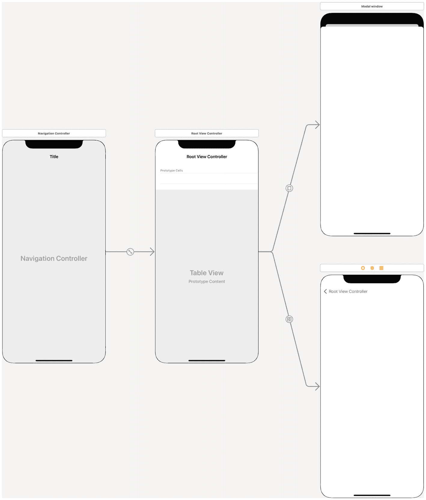
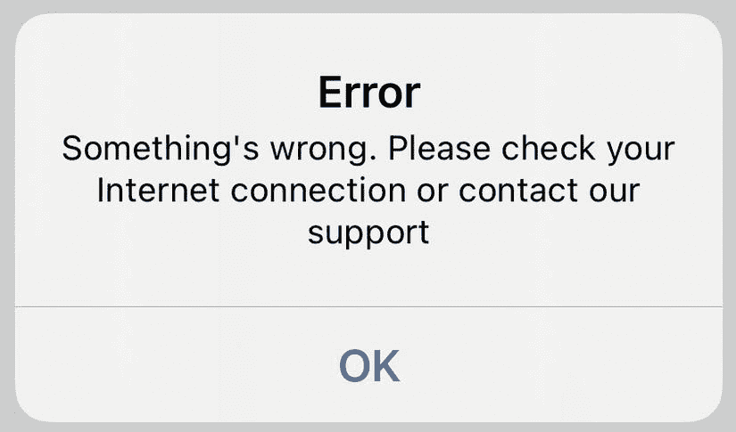
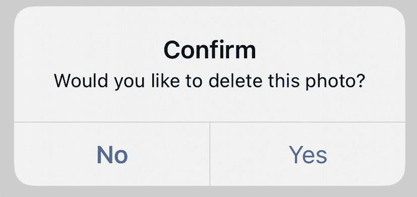
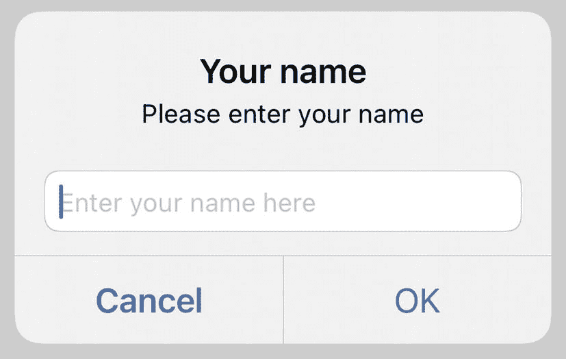
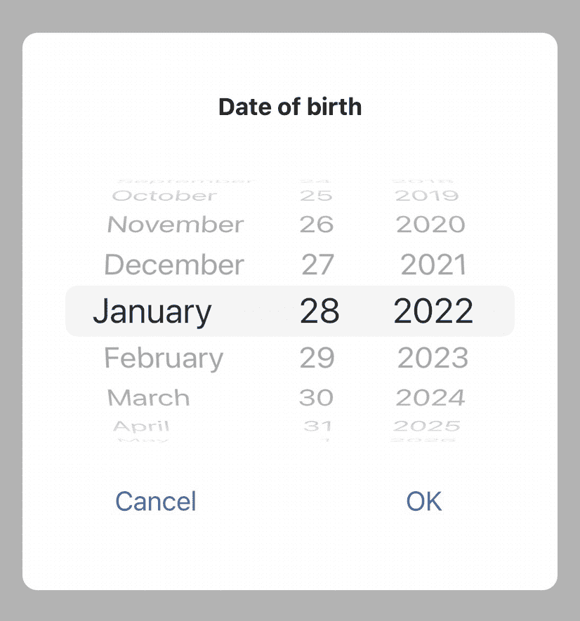

# UIKit 与 Storyboards

多年来，UIKit 一直是 iOS 应用中实现用户界面的唯一方式，而 Storyboards 机制则是进行界面布局的主要工具。近期，SwiftUI 被引入，它是从 Objective-C 向纯 Swift 原生代码过渡的必然环节。但 UIKit 在 iOS 开发中仍然扮演着重要角色。

首先，存在大量遗留代码。许多应用和框架早在 SwiftUI 推出之前就已开始开发。那些最流行的 iOS 库历经数年才赢得开发者信任，我们尚未准备好停止使用它们并全面转向 SwiftUI。

其次，SwiftUI 仅在 iOS 13.0、macOS 10.15 等版本中引入。如果你的应用需要支持 iOS 12（至少目前来看，这很有必要），你就无法使用 SwiftUI。

第三，UIKit 元素可以集成到 SwiftUI 代码中。如果你在 GitHub 上发现了一个外观酷炫的 UI 库，但它是用 UIKit 编写的，而你的应用使用的是 SwiftUI，这并不能成为不使用它的理由。我们将在关于 SwiftUI 的章节中详细探讨这一点。

现在，让我们看看如何充分利用 UIKit 和 iOS Storyboards。

## 应用界面间的导航

每个 iOS 应用都有多个界面。Web 开发者通常称其为页面，许多 iOS 开发者也开始沿用此说法。不过，应用界面和网页之间仍存在差异。与此同时，现代设备开始支持分屏视图，这使得移动应用仅使用设备屏幕的一部分，并支持使用外接屏幕的设备。在 iOS 13.0 中，Apple 引入了 Scene（场景）的概念。每个场景可以有一个或多个窗口，并包含一个或多个视图控制器。有点令人困惑，对吧？让我们深入了解一下。

### 屏幕、窗口与视图

如果你有一台 iOS 设备，你就拥有一个屏幕。屏幕由 `UIScreen` 对象表示。主屏幕是一个单例；你可以从应用的任何部分访问它。如果你正在编写一个单屏应用，可以认为不存在其他内容。

`UIScreen` 拥有一个 `UIWindow` 对象。这是一个可见的窗口。术语 *window* 源于桌面开发。我们都熟悉 Windows 操作系统，它将 *window* 作为核心概念。与桌面操作系统不同，在 iOS 中，`UIWindow` 没有边框或装饰。

创建 `UIWindow` 是为了显示用户界面，而用户界面则由 *视图* 组成。其中之一是根视图。这个根视图显示一个 *应用界面* 或 *应用页面*（正如 Web 开发者所称）。在 UIKit 中，它由 `UIViewController`、`UINavigationController` 或其他控制器管理。

这些控制器内部包含其他控制器或视图。这样，我们就得到了一个树状结构的视图和控制器层次体系。

### iOS 应用中的导航

UIKit 提供了两种主要的导航方式：

*   模态呈现新元素
*   使用 `UINavigationController` 压入元素

注意：基于标签的导航在移动应用中很常见。iOS 中的标签模型是一个控制器 `UITabBarController`，最多可有五个子控制器。我们将其留作超出本文范围的内容。

这里的元素是某个控制器，通常是 `UIViewController`。

`UIViewController` 包含一个由 `UIView` 对象及其子类构成的树。其中之一是根 `UIView`，而其他 `UIView` 则直接或通过其他对象位于其内部。

当我们在 iOS 应用中谈论导航时，通常指的是从一个 `UIViewController` 切换到另一个（图 4-1）。当你拥有 `UINavigationController` 时，你可以将一个新的控制器压入导航栈：

```
pushViewController(_:animated:)
```

当你以模态方式呈现时，使用以下方法：

```
present(_:animated:completion:)
```

有什么区别呢？

除了视觉效果外，它们在逻辑上也有显著差异。使用 `UINavigationController` 时，你有一个导航栈，可以返回到之前压入的任何元素。你还可以向栈中添加元素、更改顺序以及执行许多其他操作。

当你呈现一个模态元素时，你只能将其关闭。你无法访问整个栈，也无法一次性关闭多个元素。但这仍然很有用。假设你正在编写一个订餐应用。用户浏览菜单，将商品添加到购物车，然后打开购物车。这种情况下，使用模态呈现是合理的。但我们呈现的不是 `UIViewController`，而是包含购买流程的 `UIViewController` 元素的 `UINavigationController`。当用户完成购买后，你通过关闭模态元素返回到菜单。



描述 iOS 应用导航的示意图：第一张 iPhone 图片上标注为导航控制器，随后是根视图控制器，该控制器被分为两张图片：模态窗口和根视图控制器。

**图 4-1** iOS 应用中的导航。导航控制器、根控制器以及使用模态和推送方式呈现的视图控制器（从左到右）

除了这两种显示另一个界面的方法，你还可以使用替换等方式。如果你有一个加载界面，我们不想将其保留在导航栈中，或保留在活动 UI “背后”的内存中。我们只想替换它。稍后我们将看到如何实现。

最后一个重要概念是对话框或弹出式呈现。从逻辑上讲，它与模态呈现相同，但不是在后台替换界面，而是将其显示在界面上方。拿起你的 iPhone 或 iPad，在主屏幕上点击任意应用并长按。你会看到一个菜单。这就是弹出式呈现的一个例子。

### 场景

自 iOS 13 起，Apple 引入了 *Scenes*。如果最初使用场景是可选的，那么 Xcode 12 已经不再提供选择。你仍然可以删除所有与场景相关的代码，使用传统方式，但未来这可能不再可行。

注意：尽管场景是与 SwiftUI 一起引入的，但它们同样用于 UIKit。

场景提供 `UIWindowScene` 对象，用于管理应用中的窗口和视图控制器。基本上，这是一种创建多窗口应用的方式。每个场景必须有一个代理——一个 `UIWindowSceneDelegate` 对象，但它们不必不同。你可以为多个场景使用同一个代理。场景共享应用内存和其他资源。

我们将多窗口应用留作本文范围之外的内容，但使用场景改变了我们访问 `UIWindow` 和处理应用生命周期的方式；这就是了解如何使用场景很重要的原因。


### 返回操作

故事板允许我们创建控制器、视图控制器以及用于在应用屏幕间切换的 Segue。它们让我们可以选择展示方式并设置转场动画，但却无法实现像“返回”这样简单的操作。

根据你切换到当前视图控制器的方式，可以通过以下两种方法之一实现返回：

```
dismiss(animated:, completion:)
// 以及
navigationController?.popViewController(animated:)
```

在这两种情况下，我们都需要创建一个 `@IBAction` 函数并将其连接到按钮上。而且这个函数在所有视图控制器中应该相同——或者几乎相同。如果我们编写一个函数（配方 4-1），无论当前视图是通过模态展示还是通过 `UINavigationController` 压入栈中，它都能精确地返回到上一个元素，那会怎样呢？

```
public extension UIViewController {
    @IBAction func goBack() {
        if let nc = navigationController,
           nc.viewControllers.count >= 2 {
            nc.popViewController(animated: true)
        } else {
            dismiss(animated: true, completion: nil)
        }
    }
}
配方 4-1
返回到上一个屏幕
```

首先，我们检查该 `UIViewController` 是否位于 `UINavigationController` 内。如果是，则它具有非空的 `navigationController` 属性。在这种情况下，我们需要检查它是否是那个 `UINavigationController` 的根 `UIViewController`。如果是根控制器，则无法执行 pop 操作，该操作会被直接忽略，我们需要将其 dismiss。如果 `navigationController` 为 `nil`，则意味着它从未进入 `UINavigationController` 的栈，我们只能将其 dismiss。

作为 `UIViewController` 的扩展编写，此函数将对应用中所有视图控制器可用。如果你有一个简单的“关于”屏幕，没有任何逻辑，你甚至无需为其创建 `UIViewController` 的子类。

**注意**

此配方在更复杂的控制器（如 `UITabController`）内部无法工作。如果你需要在用户点击返回按钮时返回到上一个标签页，你必须自行创建栈管理。

### 替换根视图

我们之前讨论过的另一种典型情况是替换。如果你不需要某个屏幕及其之前的所有屏幕，你可以实例化一个新的视图控制器并将其设置为根视图。

在标准的 iOS 应用中，存在 `AppDelegate` 类。Xcode 会在你创建新项目时自动生成它。根据配置的不同，`AppDelegate` 可能拥有一个 window 属性，或者该属性可能位于 `SceneDelegate` 类中。

当你获取到 `UIWindow` 对象的引用时，可以像配方 4-2 所示那样替换根视图控制器：

```
public extension UIWindow {
    func replaceRootViewController(with viewController: UIViewController) {
        rootViewController = viewController
        makeKeyAndVisible()
    }
}
配方 4-2
替换根视图控制器
```

这里的难点在于获取 window 实例。在旧式项目中，我们通过 `UIApplication` 的属性获取 window。幸运的是，在包含场景的项目中，`UIApplication` 还有另一个属性—— `connectedScenes`。其中一些“连接的场景”属于 `UIWindowScene` 类型。从 `UIWindowScene` 中，我们可以提取到 `UIWindow` 对象的引用（配方 4-3 至 4-5）。

```
@available(iOS 13.0, *)
public extension UIApplication {
    var currentWindow: UIWindow? {
        connectedScenes
            .filter { $0.activationState == .foregroundActive }
            .compactMap { $0 as? UIWindowScene }
            .first?
            .windows
            .first(where: { $0.isKeyWindow })
    }
}
配方 4-3
在含场景的项目中获取主 UIWindow
```

在不含场景的项目中，获取方式更简单。

```
public extension UIWindow {
    static var main: UIWindow? {
        (UIApplication.shared.delegate as? AppDelegate)?.window
    }
}
配方 4-4
在不含场景的项目中获取主 UIWindow
```

**注意**

此配方假设你的应用拥有 `AppDelegate` 类，该类实现了 `UIApplicationDelegate` 协议，并且是你的应用的主代理。

最后，我们可以将所有方法封装到 `UIWindow` 扩展中的一个静态函数里。

```
public extension UIWindow {
    static func replaceMainRootViewController(with viewController: UIViewController) -> Bool {
        var window: UIWindow?
        if #available(iOS 13, *) {
            window = UIApplication.shared.currentWindow
        } else {
            window = UIWindow.main
        }
        window?.replaceRootViewController(with: viewController)
        return window != nil
    }
}
配方 4-5
替换根视图控制器（静态方法）
```

函数 `replaceMainRootViewController` 会替换主窗口中的根视图控制器（如果存在）。如果窗口不存在或函数无法找到它，则返回 false，否则返回 true。

### 修改 UINavigationController 栈

假设你有一个很长的屏幕序列，用户在其中进行选择。例如，用户正在参加一个测试。他们可以提交问题或跳过问题。如果提交了问题，该问题就会永久消失；否则，它会保留在栈中，以便用户以后回来回答。

再看另一个例子。用户正在订购家具。他们选择配置、颜色以及所有细节。最后，用户完成支付，从这一刻起，我们不想让他们再返回去修改购买配置。我们想显示订单跟踪。但我们也不想清除整个栈——当用户点击返回按钮时，他们应该回到之前使用过的应用部分，而订购流程应该消失，直到他们再次下单。

还有一种情况——添加一个新屏幕。例如，我们可能想警告用户，如果返回，他们的订单将被取消。我们不想让用户卡在某个屏幕上，否则他们只会“杀掉”应用。但我们需要提醒他们订购流程尚未完成，他们应该在返回前完成它。这可以通过弹窗实现，但设计师可能有其他意见。

我们将研究以下情况：

- 从栈中移除不必要的 `UIViewController`
- 将用户返回到栈中的特定 `UIViewController`
- 向栈中添加 `UIViewController`

正如我们之前讨论过的，当 `UIViewController` 是导航栈的一部分时，它具有非空的 `navigationController` 属性。这个 `navigationController` 有一个非常重要的属性——`viewController`。该属性包含导航栈——一个以根元素开头的 `UIViewController` 对象列表。

**注意**

当你从 `UIViewController` 中访问 `navigationController?.viewControllers` 时，结果始终包含 `self`。

#### 从导航栈中移除元素

假设用户完成了一个流程，我们不希望他们返回该流程，但允许他们返回到该流程之前的视图控制器。由于栈中不必要的元素始终是我们应用的一部分且是已知的，我们了解这些元素的类名。配方 4-6 展示了如何使用 `filter` 方法从导航栈中移除不必要的元素。

```
public extension UINavigationController {
    func removeElements<T>(of type: T.Type) {
        viewControllers = viewControllers.filter {
            !($0 is T)
        }
    }
}
配方 4-6
从导航栈中移除已知类型的元素
```

*用法*

```
navigationController?.removeElements(of: UnnecessaryViewController.self)
```

我建议你不要通过这种方式移除当前的前台视图控制器。如果你需要移除它，请改用 `navigationController?.popViewController(animated:)` 或本章开头部分的 `goBack` 函数。此外，最好在前台视图控制器完全呈现在屏幕上时修改栈。这应该在 `viewDidAppear(animated:)` 函数中或之后进行。


### 将用户返回到特定的视图控制器

假设您正在开始一个新游戏，第一件事就是创建自己的角色。您选择他们的身体、面部、发色、鼻子的形状……然后您发现自己完全不喜欢这个角色！您可以返回上一步，或者重新开始。这个“重新开始”功能就是导航到特定视图控制器的一个示例。

与上一节类似，我们将通过类来识别视图控制器，实际上，它应该是 `UIViewController` 的一个子类。从选定的视图控制器到最前面的视图控制器之间的所有视图控制器都应从堆栈中移除，如代码 4-7 所示。

```
public extension UINavigationController {
    func returnToElement<T: UIViewController>(of type: T.Type, animated: Bool) -> Bool {
        guard let lastIndex = viewControllers.lastIndex(where: { $0 is T }) else {
            return false
        }
        if viewControllers[lastIndex] == viewControllers.last {
            return false
        }
        viewControllers.removeSubrange(lastIndex.advanced(by: 1)..<viewControllers.endIndex.advanced(by: -1))
        popViewController(animated: animated)
        return true
    }
}
```

**代码 4-7** 将用户返回到特定的视图控制器

*用法*

```
navigationController?.returnToElement(of: StartViewController.self, animated: true)
```

如果您想返回到导航堆栈的起点，可以使用标准方法：

```
navigationController?.popToRootViewController(animated: true)
```

### 弹窗与对话框

带有信息或问题的弹窗在用户界面中非常常见（图 4-2、4-3 和 4-4）。iOS 提供了 `UIAlertController` 来显示弹窗，但显示一条简单的消息就需要三行代码。对于更复杂的情况，我们需要编写更多代码。当我们有多个代码分支需要验证数据并显示错误消息时，在每个分支中创建和设置 `UIAlertController` 就违背了 DRY 原则。

#### 显示提示、错误和警告

除了代码更短更清晰之外，如果您将来想使用自定义样式，这些函数也很有用。您无需在整个项目中替换标准弹窗，而是可以将它们集中在一个地方。代码 4-8 展示了 `UIViewController` 显示警告对话框的简单扩展。



**图 4-2** 错误对话框

```
public extension UIViewController {
    func show(error: String) {
        let alert = UIAlertController(title: "Error", message: error, preferredStyle: .alert)
        alert.addAction(UIAlertAction(title: "OK", style: .cancel, handler: nil))
        present(alert, animated: true, completion: nil)
    }
    func show(warning: String) {
        let alert = UIAlertController(title: "Warning", message: warning, preferredStyle: .alert)
        alert.addAction(UIAlertAction(title: "OK", style: .cancel, handler: nil))
        present(alert, animated: true, completion: nil)
    }
}
```

**代码 4-8** 显示简单弹窗

这些弹窗被编写为 `UIViewController` 的扩展。这是调用它们最常见的地方。它们不提供任何反馈，只显示一个弹窗。如果您的应用已本地化为多种语言，您可以将 `"Error"` 或 `"OK"` 这样的硬编码字符串替换为本地化版本。

如果您在 `UIViewController` 内部，可以这样调用它们：

```
let error: Error // 来自 API 调用的错误
self.show(error: error.localizedDescription)
```

不要忘记，您必须在主线程中执行此操作。如果不确定，请修改这些函数以确保始终在主线程中执行。

#### 询问一般性问题

一般性问题（也称为极性问句）是一个带有两种可能答案（肯定或否定）的问题。通常是“是”或“否”。“您确定要退出吗？”“要覆盖此文件吗？”“无法连接。您要重新输入密码吗？”……听着耳熟吗？这些都是带有一般性问题的弹窗。代码 4-9 展示了如何创建一个询问此类问题的函数，并且只需一行代码即可调用。



**图 4-3** 确认对话框

```
public extension UIViewController {
    func ask(title: String?, question: String?, positiveButtonTitle: String = "Yes", negativeButtonTitle: String = "No", isDangerousAction: Bool = false, delegate: @escaping (_ agreed: Bool) -> Void) {
        let alert = UIAlertController(title: title, message: question, preferredStyle: .alert)
        alert.addAction(UIAlertAction(title: positiveButtonTitle, style: isDangerousAction ? .destructive : .default) { (_) in
            delegate(true)
        })
        alert.addAction(UIAlertAction(title: negativeButtonTitle, style: .cancel) { (_) in
            delegate(false)
        })
        present(alert, animated: true, completion: nil)
    }
}
```

**代码 4-9** 一般性问题弹窗

#### 询问单行字符串答案的问题

另一种典型的弹窗是询问简单问题并要求文本答案的对话框。例如，当您加入网络时，可能会要求输入密码。它必须始终有两个按钮——“确定”和“取消”。代码 4-10 展示了如何将此对话框编写为 `UIViewController` 扩展。



**图 4-4** 文本输入对话框

```
public extension UIViewController {
    func ask(title: String?, question: String?, placeholder: String?, keyboardType: UIKeyboardType = .default, delegate: @escaping (_ answer: String?) -> Void) {
        let alert = UIAlertController(title: title, message: question, preferredStyle: .alert)
        alert.addTextField { (textField) in
            textField.placeholder = placeholder
            textField.keyboardType = keyboardType
        }
        alert.addAction(UIAlertAction(title: "OK", style: .default) { (_) in
            let answer = alert.textFields?.first?.text
            delegate(answer)
        })
        alert.addAction(UIAlertAction(title: "Cancel", style: .cancel) { (_) in
            delegate(nil)
        })
        present(alert, animated: true, completion: nil)
    }
}
```

**代码 4-10** 简单文本问题弹窗

#### 选择日期和时间

在第 2 章中，我们讨论了用户表单的验证，并决定日期的最佳解决方案是显示日期选择器。我们可以将其显示在屏幕键盘的位置，或者以弹窗形式显示。

能否将 `UIDatePicker` 添加到 `UIAlertView` 中？可以，但这并不是一个好主意。问题在于 `UIAlertView` 没有组件堆栈；它原生只能包含 `UILabel` 和 `UITextField`。`UIAlertView` 的大小是根据这些组件的大小计算的。`UIView` 可以有子视图，因此您*可以*将其他 `UIView` 子类添加进去，但不能保证其适配良好。

代码 4-11 展示了如何创建一个完全自定义的弹窗并将其添加到布局顶层。如何请求此弹窗如代码 4-12 所示。要使用 Auto Layout 功能创建布局，我们将使用 GitHub 上可用的 SnapKit 框架：[`https://github.com/SnapKit/SnapKit`](https://github.com/SnapKit/SnapKit)。


### 什么是 SnapKit？

`SnapKit` 是一个流行且维护良好的库，它允许你以编程方式创建布局，无需使用 storyboard 或 nib 文件，也无需手动编写冗长的单行约束代码。简单来说，这个库为约束编写代码添加了语法糖。

例如，下面这段来自官方 `SnapKit` 网站的代码创建了一个绿色方块，并将其添加到根视图中。

```
import SnapKit
class MyViewController: UIViewController {
lazy var box = UIView()
override func viewDidLoad() {
super.viewDidLoad()
self.view.addSubview(box)
box.backgroundColor = .green
box.snp.makeConstraints { (make) -> Void in
make.width.height.equalTo(50)
make.center.equalTo(self.view)
}
}
}
```

### 日期与时间选择器弹出窗口

要获得一个弹出窗口，我们需要一个包含四个子视图的 `UIView`：

*   标题标签
*   日期选择器
*   确定按钮
*   取消按钮

```
private var frameView: UIView!
private var titleLabel: UILabel!
private var datePicker: UIDatePicker!
private var okButton: UIButton!
private var cancelButton: UIButton!
```

它应该有一个代理，返回一个 `Date` 对象或 `nil`。

```
var delegate: (_ date: Date?) -> Void = { _ in }
```

弹出窗口的基类将是 `UIView`。请记住，实现方式可以不同。我们只是展示一个示例，但你可以根据自己的需求进行调整。

```
import SnapKit
public class DatePickerPopup: UIView {
private var frameView: UIView!
private var titleLabel: UILabel!
private var datePicker: UIDatePicker!
private var okButton: UIButton!
private var cancelButton: UIButton!
var delegate: (_ date: Date?) -> Void = { _ in }
var title: String {
get {
titleLabel.text ?? ""
}
set {
titleLabel.text = newValue
}
}
override init(frame: CGRect) {
super.init(frame: frame)
commonInit()
}
required init?(coder: NSCoder) {
super.init(coder: coder)
commonInit()
}
func commonInit() {
// 深色遮罩
backgroundColor = UIColor(red: 0.0, green: 0.0, blue: 0.0, alpha: 0.3)
// 框架视图
frameView = UIView()
frameView.layer.cornerRadius = 10
frameView.layer.masksToBounds = true
frameView.backgroundColor = .white
addSubview(frameView)
frameView.snp.makeConstraints { (make) in
make.center.equalTo(self)
}
// 标题标签
titleLabel = UILabel()
titleLabel.font = UIFont.systemFont(ofSize: 16, weight: .bold)
titleLabel.textColor = .black
titleLabel.textAlignment = .center
frameView.addSubview(titleLabel)
titleLabel.snp.makeConstraints { (make) in
make.top.equalToSuperview().offset(40)
make.leading.equalToSuperview().offset(40)
make.trailing.equalToSuperview().offset(-40)
}
// 日期选择器
datePicker = UIDatePicker()
datePicker.preferredDatePickerStyle = .wheels
datePicker.datePickerMode = .date
datePicker.date = Date()
frameView.addSubview(datePicker)
datePicker.snp.makeConstraints { (make) in
make.top.equalTo(titleLabel.snp.bottom).offset(20)
make.leading.equalToSuperview().offset(20)
make.trailing.equalToSuperview().offset(-20)
}
// 按钮
cancelButton = UIButton()
cancelButton.setTitle("取消", for: .normal)
cancelButton.setTitleColor(UIColor(red: 0.0, green: 0.478431, blue: 1.0, alpha: 1.0), for: .normal)
cancelButton.addTarget(self, action: #selector(cancelPressed), for: .touchUpInside)
okButton = UIButton()
okButton.setTitle("确定", for: .normal)
okButton.setTitleColor(UIColor(red: 0.0, green: 0.478431, blue: 1.0, alpha: 1.0), for: .normal)
okButton.addTarget(self, action: #selector(okPressed), for: .touchUpInside)
frameView.addSubview(cancelButton)
frameView.addSubview(okButton)
cancelButton.snp.makeConstraints { (make) in
make.top.equalTo(datePicker.snp.bottom)
make.left.equalToSuperview()
make.height.equalTo(40)
make.bottom.equalToSuperview().offset(-40)
}
okButton.snp.makeConstraints { (make) in
make.top.equalTo(datePicker.snp.bottom)
make.left.equalTo(cancelButton.snp.right)
make.right.equalToSuperview()
make.height.equalTo(40)
make.width.equalTo(cancelButton.snp.width)
}
}
@objc func cancelPressed() {
disappearAndReturn(date: nil)
}
@objc func okPressed() {
disappearAndReturn(date: datePicker.date)
}
private func disappearAndReturn(date: Date?) {
UIView.animate(withDuration: 0.3) {
self.alpha = 0.0
} completion: { (_) in
self.removeFromSuperview()
self.delegate(date)
}
}
static func createAndShow(in viewController: UIViewController, title: String, delegate: @escaping (_ date: Date?) -> Void) -> DatePickerPopup {
let popup = DatePickerPopup(frame: viewController.view.bounds)
popup.title = title
popup.delegate = delegate
popup.alpha = 0.0
viewController.view.addSubview(popup)
UIView.animate(withDuration: 0.3) {
popup.alpha = 1.0
}
return popup
}
}
配方 4-11
日期选择器弹出窗口
```

以下扩展允许在 `UIViewController` 内部更简短地请求此弹出窗口。

```
public extension UIViewController {
func askDate(title: String, delegate: @escaping (_ date: Date?) -> Void) {
_ = DatePickerPopup.createAndShow(in: self, title: title, delegate: delegate)
}
}
配方 4-12
从 UIViewController 请求日期
```

现在，当你拥有了这个类，你可以用一行代码来请求日期，再用另一行代码来处理结果：

```
self.askDate(title: "出生日期") { (date) in
print(date)
}
```

结果要么是一个位于屏幕中央的圆角面板（图 4-5），要么是屏幕的中央部分。这取决于你 iPhone 的屏幕尺寸。



一个日期选择对话框窗口的屏幕截图，其中包含一个带有粗体标题“出生日期”的方框，后面是三列的月份、日期和年份。底部还有“取消”和“确定”两个按钮。

**图 4-5** 日期选择对话框

### 底部面板中的日期与时间

显示弹出窗口可能不是请求日期和/或时间的最佳方式。另一种方式是将其显示在屏幕键盘的位置。如果你有一系列 `UITextFields`，对用户来说，在键盘的同一位置看到日期选择器会更方便。

这一次，它不能是扩展；需要将其集成到你的 `UIViewController` 或其他类中，具体取决于你的项目架构。配方 4-13 展示了一个 `UIViewController` 子类的示例，它在键盘位置显示日期选择器。

```
public class DateSelectorViewController: UIViewController {
@IBOutlet weak var tfDOB: UITextField!
@IBOutlet weak var tfNextField: UITextField!
var selectedDOB: Date? = nil
let datePicker = UIDatePicker(frame: CGRect(x: 0, y: 0, width: UIScreen.main.bounds.width, height: 216))
override func viewDidLoad() {
super.viewDidLoad()
if #available(iOS 13.4, *) {
datePicker.preferredDatePickerStyle = .wheels
}
datePicker.datePickerMode = .date
tfDOB.inputView = datePicker
addDoneButtonOnKeyboard()
// ...
}
func addDoneButtonOnKeyboard() {
let doneToolbar: UIToolbar = UIToolbar(frame: CGRect.init(x: 0, y: 0, width: UIScreen.main.bounds.width, height: 50))
doneToolbar.barStyle = .default
let flexSpace = UIBarButtonItem(barButtonSystemItem: .flexibleSpace, target: nil, action: nil)
let done: UIBarButtonItem = UIBarButtonItem(title: "完成", style: .done, target: self, action: #selector(self.doneButtonAction))
let items = [flexSpace, done]
doneToolbar.items = items
doneToolbar.sizeToFit()
tfDOB.inputAccessoryView = doneToolbar
}
@objc func doneButtonAction() {
tfDOB.text = df.string(from: datePicker.date)
selectedDOB = datePicker.date
tfNextField.becomeFirstResponder()
}
}
配方 4-13
在底部面板中显示日期和时间选择器
```


