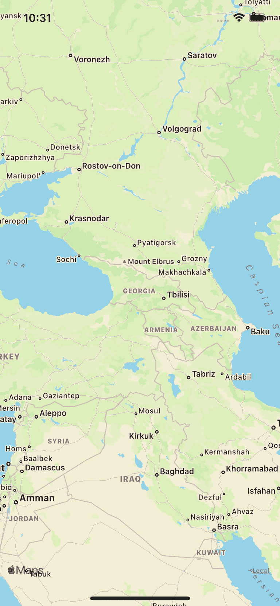
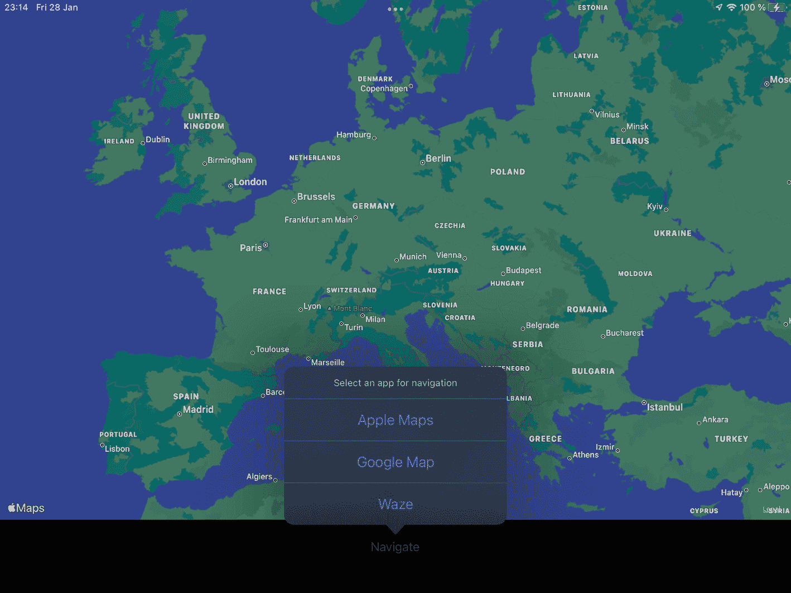
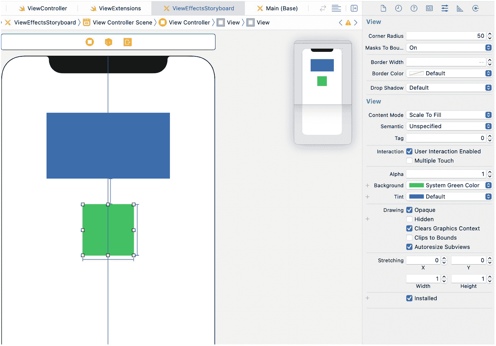
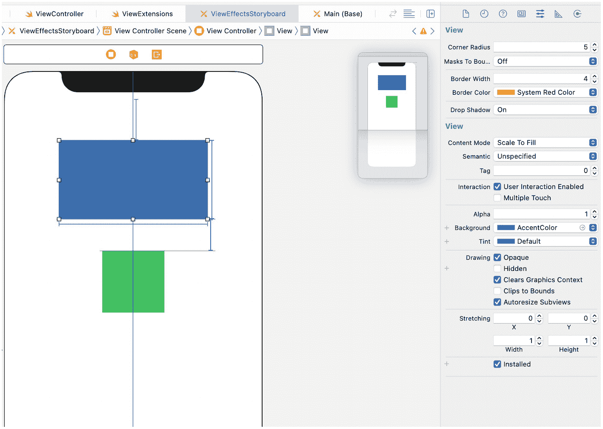
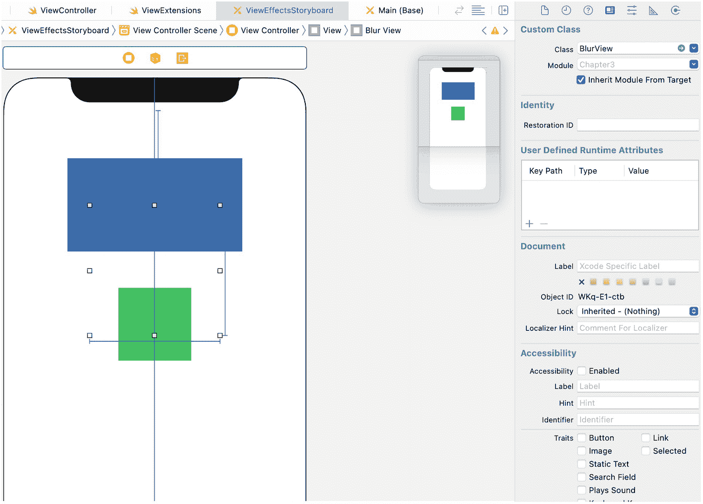
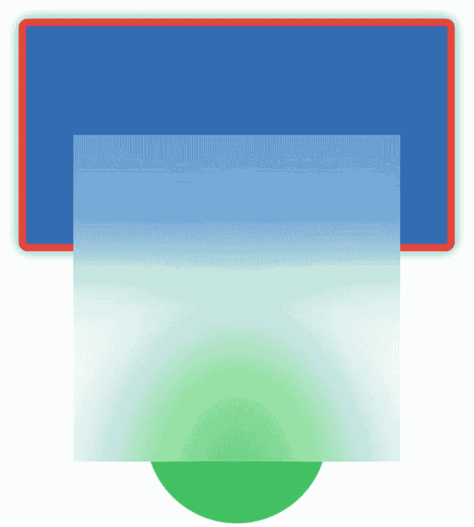

# 地图与导航

iOS 平台拥有原生地图框架 `MapKit`，以及基于该框架预装的系统地图应用。在编写 iOS 应用时，你可以确信用户已拥有这些工具，并且你也可以直接调用它们。苹果地图适用于大多数场景，但也存在功能更优的替代地图框架。许多人更偏好使用谷歌地图与 Waze 进行导航。

在本节中，我们将探讨三种场景：

- 在应用内显示苹果地图
- 在应用内显示谷歌地图
- 使用用户偏好的应用进行动态导航

## 在 iOS 应用中显示苹果地图

自 iOS 3.0 开始，苹果推出了 `MapKit`，允许你将地图作为常规视图直接嵌入应用（见图 4-6）。



*iPhone 上苹果地图视图的截图，地图上带有多个标签。图片顶部显示时间及其他图标。*

**图 4-6** – 作为视图的苹果地图

要添加地图，请打开故事板（或 xib）编辑器，点击 +（加号）按钮，在列表中选择 `Map Kit View`。如果使用约束，请添加约束并创建插座变量。该视图的类名为 `MKMapView`。

```
@IBOutlet weak var mapView: MKMapView!
```

`MKMapView` 是一个动态组件。默认情况下，它允许与地图进行交互。如果需要静态显示，请取消勾选 `User Interaction Enabled`。

> **提示**  
> 此属性适用于所有视图。如果取消勾选 `User Interaction Enabled`（或在代码中将 `isUserInteractionEnabled` 设置为 `false`），视图及其子视图将不会响应用户的触摸和手势操作。

在故事板/xib 编辑器的 Map View 部分，你可以修改地图类型，并限制缩放、滚动等特定操作。

使用地图时有两个典型操作：设置位置/缩放级别，以及添加*标注*（也称为*图钉*和*标记*）。

已知某点的经纬度后，可以缩放至该点附近：

```
let center = CLLocationCoordinate2D(latitude: latitude, longitude: longitude)
let region = MKCoordinateRegion(center: center, span: MKCoordinateSpan(latitudeDelta: 0.01, longitudeDelta: 0.01))
mapView.setRegion(region, animated: true)
```

`latitudeDelta` 和 `longitudeDelta` 指定了中心点周围可见的空间范围。

第二个典型操作是添加标记（也称为图钉）：

```
let annotation = MKPointAnnotation()
let centerCoordinate = CLLocationCoordinate2D(latitude: latitude, longitude: longitude)
annotation.coordinate = centerCoordinate
annotation.title = "标题"
mapView.addAnnotation(annotation)
```

你可以在地图上添加多个标注。

要移除标注，可以调用：

```
func removeAnnotations(_ annotations: [MKAnnotation])
```

要移除所有标注，请使用 `mapView.annotations` 作为参数。

## 在 iOS 应用中显示谷歌地图

与包含在标准库中的苹果地图不同，谷歌地图需要单独安装，并且需要 API 密钥。

如果你使用 CocoaPods 作为依赖管理工具，可以通过以下方式添加：

```
pod 'GoogleMaps'
```

如果你不想使用 CocoaPods，可以从官方网站下载 XCFramework 并手动添加到项目。谷歌官方并未支持 Swift Package Manager。解决方法之一是使用第三方库：[`https://github.com/YAtechnologies/GoogleMaps-SP`](https://github.com/YAtechnologies/GoogleMaps-SP)。该库可以通过 Swift Package Manager 添加，并且包含了谷歌地图框架。用户普遍对该库给予正面反馈，但尽量还是避免使用非官方解决方案。

你可以在 [`https://cloud.google.com`](https://cloud.google.com) 获取 API 密钥。需要创建一个应用并完成以下两个步骤：

- 创建 API 密钥。可以对其进行限制，使其只能从 iOS 应用中使用。这样，该密钥只能被你的应用使用，而不能被其他应用使用。
- 启用 iOS 版 Maps SDK。

如果你已经为同一个 iOS 应用集成了其他谷歌服务，则无需再创建新的谷歌应用——可以使用同一个应用。例如，如果你使用了 Analytics 或 Crashlytics，你的谷歌应用应该已经创建好了。

谷歌地图仅在特定用量范围内免费。因此，如果你之前未启用结算功能，现在需要启用。价格可能会随时间变化，但截至 2021 年 6 月，地图加载是免费的，而街景功能则需要付费。即使你不打算使用街景功能，也建议启用结算。

从此时起，你可以将 `GMSMapView` 添加到应用中。`GMSMapView` 是一个 `UIView` 对象，你可以通过故事板或编程方式进行添加。

地图需要显示区域。对于谷歌地图，你需要设置相机。`GMSCameraPosition` 对象指定了纬度、经度和缩放级别。

我们先通过故事板将地图添加到应用中（方法 4-14）；然后介绍如何通过编程方式实现（方法 4-15）。

在这两种场景中，使用地图前都需要添加密钥；否则应用会崩溃。最佳位置是 `AppDelegate`：

```
import GoogleMaps
// 别忘了调用：
// GMSServices.provideAPIKey("你的 _API_ 密钥")
// 在 AppDelegate 中

class ViewController: UIViewController {
  override func viewDidLoad() {
    super.viewDidLoad()
    let camera = GMSCameraPosition.camera(withLatitude: 41.6168, longitude: 41.6367, zoom: 6.0)
    let mapView = GMSMapView.map(withFrame: self.view.frame, camera: camera)
    self.view.addSubview(mapView)
  }
}
```

**方法 4-15** – 通过编程方式设置地图视图

```
import GoogleMaps
// 别忘了调用：
// GMSServices.provideAPIKey("你的 _API_ 密钥")
// 在 AppDelegate 中

class ViewController: UIViewController {
  @IBOutlet var mapView: GMSMapView!
  override func viewDidLoad() {
    super.viewDidLoad()
    let camera = GMSCameraPosition.camera(withLatitude: 41.6168, longitude: 41.6367, zoom: 6.0)
    mapView.camera = camera
  }
}
```

**方法 4-14** – 通过故事板设置地图视图

```
GMSServices.provideAPIKey("你的 _API_ 密钥")
```

谷歌地图功能强大。你可以添加标记、绘制区域、缩放至特定区域，以及为相机添加动画效果。

GooglePlaces 库提供了用于处理地点和地址的 SDK。你可以解析坐标、搜索附近地点，并提供其他基于位置的功能。

更多信息可访问谷歌地图平台门户：[`https://developers.google.com/maps`](https://developers.google.com/maps)。


### 动态导航

让我们更仔细地分析一个相当典型的场景：我们有坐标（纬度和经度）以及一个地名。我们需要打开用户最喜欢的应用来导航到目的地（见图 4-7）。我们不会尝试在应用内部集成导航功能，因为通常这并不值得。导航应用具备许多功能，例如后台导航、通知等，这些功能实现起来并不容易。



一张地图的截图显示，通过屏幕底部名为“导航”的按钮，弹出了三个用于导航的应用选项。这三个应用分别是 Apple 地图、Google 地图和 Waze。

**图 4-7** — 选择导航应用

每个服务都有启动导航的方式（配方 4-16 至 4-18）。

```
let wazeURL = "waze://?ll=\(latitude),\(longitude)&navigate=false"
if UIApplication.shared.canOpenURL(wazeURL) {
UIApplication.shared.open(wazeURL, options: [:], completionHandler: nil)
}
```

**配方 4-18** — 在 Waze 中打开位置

```
let googleURL = "comgooglemaps://?daddr=\(latitude),\(longitude)&directionsmode=driving"
if UIApplication.shared.canOpenURL(googleURL) {
UIApplication.shared.open(googleURL, options: [:], completionHandler: nil)
}
```

**配方 4-17** — 在 Google 地图中打开位置

```
let appleURL = "http://maps.apple.com/?daddr=\(latitude),\(longitude)"
if UIApplication.shared.canOpenURL(appleURL) {
UIApplication.shared.open(appleURL, options: [:], completionHandler: nil)
}
```

**配方 4-16** — 在 Apple 地图中打开位置

Google 和 Waze 拥有自定义 URL。配方 4-19 展示了如何检查它们当前系统中是否可用。

```
public extension UIViewController {
func openMapButtonAction(latitude: Double, longitude: Double) {
let appleURL = "http://maps.apple.com/?daddr=\(latitude),\(longitude)"
let googleURL = "comgooglemaps://?daddr=\(latitude),\(longitude)&directionsmode=driving"
let wazeURL = "waze://?ll=\(latitude),\(longitude)&navigate=false"
let googleItem = ("Google Map", URL(string:googleURL)!)
let wazeItem = ("Waze", URL(string:wazeURL)!)
var installedNavigationApps = [("Apple Maps", URL(string:appleURL)!)]
if UIApplication.shared.canOpenURL(googleItem.1) {
installedNavigationApps.append(googleItem)
}
if UIApplication.shared.canOpenURL(wazeItem.1) {
installedNavigationApps.append(wazeItem)
}
let alert = UIAlertController(title: "Select an app for navigation", message: nil, preferredStyle: .actionSheet)
for app in installedNavigationApps {
let button = UIAlertAction(title: app.0, style: .default, handler: { _ in
UIApplication.shared.open(app.1, options: [:], completionHandler: nil)
})
alert.addAction(button)
}
let cancel = UIAlertAction(title: "Cancel", style: .cancel, handler: nil)
if let popoverController = alert.popoverPresentationController {
popoverController.sourceView = self.view
}
alert.addAction(cancel)
present(alert, animated: true)
}
}
```

**配方 4-19** — 通用导航

## 圆角、阴影和其他效果

如果你使用 storyboard 或 nib 进行 UI 设计，你会知道它们缺少许多功能。通常，你需要在代码中进行一些调整，这意味着你需要创建一个 `@IBOutlet`。这很不方便。

通过添加几个扩展，你可以解决诸如添加圆角、阴影、内容裁剪等问题。图 4-8 展示了其效果。

### 圆角、内容裁剪和边框

圆角是 iOS 和 macOS 应用中非常流行的设计特性。与越来越方正的 Windows 不同，Apple 产品拥有更多曲线。如果将 Big Sur（macOS 11）与 Catalina（macOS 10.15）进行比较，你会立刻发现差异。

`UIKit` 提供了一种原生方式来为几乎所有元素添加圆角，但这是通过在 `UILayer` 中实现，而不是在 `UIView` 中。Storyboard 编辑器无法直接访问图层，因此你不能在其中添加圆角。配方 4-20 展示了一种简单的修复方法。

```
public extension UIView {
@IBInspectable var cornerRadius: CGFloat {
set { layer.cornerRadius = newValue }
get { layer.cornerRadius  }
}
}
```

**配方 4-20** — 圆角

当你设置圆角半径时，它会应用于图层本身的背景、边框和其他属性，但不会应用于内容。它也不会应用于 `UIView` 的子视图。如果你想将圆角应用于所有内容，你需要设置 `masksToBounds` 属性。这是图层的一个属性。配方 4-21 展示了具体做法：

```
public extension UIView {
@IBInspectable var masksToBounds: Bool {
set { layer.masksToBounds = newValue }
get { layer.masksToBounds  }
}
}
```

**配方 4-21** — 内容裁剪

现在你可以直接在 storyboard 编辑器中设置它了。这里需要提醒一下——它确实会应用于所有内容。例如，如果你在 `UIView` 上设置它，那么它的所有子视图将永远不会超出 `UIView` 父视图的边界。

你可能需要这种行为的场景之一是 `UIViewController` 的根 `UIView`。当你添加一个可能大于根 `UIView` 的填充背景时，在过渡期间它将是可见的。当你将一个新的 `UIViewController` 推送到 `UINavigationController` 时，它会出现在屏幕的右侧（或在从右到左布局中的左侧）。一些屏幕外的元素可能会可见。如果这不是你想要的行为，请设置 `maskToBounds` 属性，这样所有屏幕外的元素在过渡期间将不可见。

在我们继续之前，我们还需要另一个有用的扩展。问题是 Swift 有两个类：`UIColor` 和 `CGColor`。`UIColor` 对开发者更方便；它能更好地访问颜色分量，并且可以通过 `@IBInspectable` 属性暴露给 storyboard 编辑器。`CGColor` 更像是一个内部的东西。尽管它们在 Swift 中都代表颜色，但它们是两种不同的类型。配方 4-22 将 `CGColor` 转换为 `UIColor`。

```
public extension CGColor {
var UIColor: UIKit.UIColor {
return UIKit.UIColor(cgColor: self)
}
}
```

**配方 4-22** — 将 `CGColor` 转换为 `UIColor`

配方 4-23 中的扩展允许我们添加边框。边框可以有颜色和宽度，因此我们向 `UIView` 类添加两个属性。在 UIKit 中，所有可见元素都是 `UIView` 的子类，因此你可以为它们中的任何一个添加边框。

```
extension UIView {
@IBInspectable var borderWidth: CGFloat {
set { layer.borderWidth = newValue }
get { layer.borderWidth }
}
@IBInspectable var borderColor: UIColor? {
set { layer.borderColor = newValue?.cgColor }
get { layer.borderColor?.UIColor }
}
@IBInspectable var cornerRadius: CGFloat {
set { layer.cornerRadius = newValue }
get { layer.cornerRadius  }
}
@IBInspectable var masksToBounds: Bool {
set { layer.masksToBounds = newValue }
get { layer.masksToBounds  }
}
}
```

**配方 4-23** — 边框



一张在 storyboard 编辑器中进行用户界面视图配置的截图，显示了一个 iPhone 的轮廓，其右侧边框内粘贴了两个方框。左侧图片有一个窗口，其中包含可修改的选项，如圆角半径、边框宽度、透明度等。

**图 4-8** — Storyboard 编辑器中的 `UIView` 配置


### 阴影

阴影（图 4-9）是一种更复杂的效果，不是因为实现困难，而是因为当布局发生变化时必须更新它。当 iPhone 或 iPad 改变方向，或者屏幕上元素出现或消失时，阴影应该重新渲染。为 `UIView` 添加阴影的扩展如食谱 4-24 所示：

```swift
public extension UIView {
@IBInspectable var dropShadow: Bool {
set {
layer.shadowOffset = CGSize(width: 0, height: 0)
if newValue {
updateShadow()
} else {
layer.shadowColor = UIColor.clear.cgColor
layer.shadowOpacity = 0.0
layer.shadowRadius = 0
layer.shadowPath = nil
layer.shouldRasterize = false
}
}
get {
layer.shadowOpacity > 0.0 && layer.shadowRadius > 0
}
}
func updateShadow() {
layer.shadowColor = UIColor.black.cgColor
layer.shadowOpacity = 0.5
layer.shadowRadius = 4
layer.shadowPath = UIBezierPath(roundedRect: bounds, cornerRadius: layer.cornerRadius).cgPath
layer.shouldRasterize = true
layer.rasterizationScale = UIScreen.main.scale
}
func updateShadows() {
if self.dropShadow {
self.updateShadow()
}
subviews.forEach {
$0.updateShadows()
}
}
}
```

> 注：颜色、半径和阴影透明度在此食谱中已硬编码。这通常是最佳解决方案，因为这些参数在整个应用中保持一致。如果需要使其动态化，可以将它们添加为其他可检查属性，并且每个属性应在设置时触发 `updateShadow` 函数。



设置带有阴影、边框等效果的用户界面视图的屏幕截图：左侧显示了一个 iPhone 轮廓，轮廓内部粘贴了两个方框；右侧图像显示了一个带有选项的窗口。

**图 4-9** 使用阴影、边框和其他效果设置 `UIView`

此扩展提供了一个可检查属性和两个方法。`dropShadow` 属性用于添加或移除阴影。`updateShadow` 方法使用实际的 `UIView` 大小创建阴影。为了方便起见，还有另一个方法——`updateShadows`。它更新 `UIView` 及其所有子视图中的阴影。每次布局更改时都应调用此方法。调用它的好位置是 `UIViewController` 的生命周期方法 `viewDidLayoutSubviews`。

```swift
override func viewDidLayoutSubviews() {
super.viewDidLayoutSubviews()
view.updateShadows()
}
```

如果你的 UI 需要不同的阴影配置，可以将所有属性暴露给故事板编辑器。食谱 4-25 展示了具体做法。

```swift
@IBDesignable
class ShadowView: UIView {
@IBInspectable var shadowOffset: CGSize {
get {
layer.shadowOffset
}
set {
layer.shadowOffset = newValue
}
}
@IBInspectable var shadowColor: UIColor? {
get {
if let sc = layer.shadowColor {
return UIColor(cgColor: sc)
} else {
return nil
}
}
set {
layer.shadowColor = newValue?.cgColor
}
}
@IBInspectable var shadowRadius: CGFloat {
get {
layer.shadowRadius
}
set {
layer.shadowRadius = newValue
}
}
@IBInspectable var shadowOpacity: Float {
get {
layer.shadowOpacity
}
set {
layer.shadowOpacity = newValue
}
}
override init(frame: CGRect) {
super.init(frame: frame)
}
required init?(coder: NSCoder) {
super.init(coder: coder)
}
}
```

这是一个单独的类。如果在同一项目中同时使用了这两种方法，则不应在此 `ShadowView` 实例中设置 `dropShadow` 属性。相反，应根据所需结果单独配置所有参数。

### UITextField 内边距

故事板编辑器中另一个缺失的功能是向 `UITextField` 元素添加内边距。内边距可用于不同目的，从改善视觉外观到在 `UITextField` 两侧添加图标和按钮。同时，我们通常希望保持此区域处于激活状态。当用户点击它时，我们希望键盘弹出。食谱 4-26 展示了如何实现。

```swift
@IBDesignable
class TextFieldWithPadding: UITextField {
@IBInspectable var paddingLeft: CGFloat = 0.0
@IBInspectable var paddingRight: CGFloat = 0.0
var padding: UIEdgeInsets {
UIEdgeInsets(top: 0, left: paddingLeft, bottom: 0, right: paddingRight)
}
required init?(coder aDecoder: NSCoder) {
super.init(coder: aDecoder)
}
override func textRect(forBounds bounds: CGRect) -> CGRect {
bounds.inset(by: padding)
}
override func placeholderRect(forBounds bounds: CGRect) -> CGRect {
bounds.inset(by: padding)
}
override func editingRect(forBounds bounds: CGRect) -> CGRect {
bounds.inset(by: padding)
}
}
```

`TextFieldWithPadding` 类提供了两个额外属性：

- `paddingLeft`
- `paddingRight`

不幸的是，它必须是一个新类，而不仅仅是 `UITextField` 的扩展，因为我们需要重写 `textRect`、`placeholderRect` 和 `editingRect` 方法。

要使用它，只需在故事板编辑器中添加 `UITextField`，将类更改为 `TextFieldWithPadding`，然后设置 `leftPadding` 和 `rightPadding`。

### UITextView 占位符

与具有原生占位符的 `UITextField` 不同，`UITextView` 不提供类似功能。这相当奇怪，尤其是考虑到 `UITextView` 只是 `UITextField` 的多行版本，可能还带有一些额外功能。

令人惊讶的是，这个问题也可以通过扩展来解决。但这次，它已经存在了，我们无需重新发明。该库名为 `UITextView+Placeholder`，使用 Objective-C 编写。

与 `UITextField` 一样，`UITextView` 可能也需要内边距。食谱 4-27 提供了一个类似的扩展来为 `UITextView` 添加内边距。

```swift
@IBDesignable
class TextViewWithPadding: UITextView {
@IBInspectable var paddingLeft: CGFloat = 0.0 {
didSet {
updateInsets()
}
}
@IBInspectable var paddingRight: CGFloat = 0.0 {
didSet {
updateInsets()
}
}
@IBInspectable var paddingTop: CGFloat = 0.0 {
didSet {
updateInsets()
}
}
@IBInspectable var paddingBottom: CGFloat = 0.0 {
didSet {
updateInsets()
}
}
required init?(coder aDecoder: NSCoder) {
super.init(coder: aDecoder)
updateInsets()
}
func updateInsets() {
textContainerInset = UIEdgeInsets(top: paddingTop, left: paddingLeft, bottom: paddingBottom, right: paddingRight)
}
}
```

你可以像使用 `TextFieldWithPadding` 一样使用 `TextViewWithPadding`。


### 渐变

另一种流行的设计元素是渐变。与之前的大多数情况类似，渐变很容易实现，但不能直接从故事板编辑器中完成。和之前的情况一样，修复起来也很简单。

我们的渐变将具有以下属性：

-   `startColor`
-   `endColor`
-   `direction`

在 UIKit 中，可以通过向 `UIView` 添加一个图层来实现渐变。有一个能够渲染渐变的图层——`CAGradientLayer`。

由于它是一个类，而不是扩展，因此我们可以直接重写 `layoutSubviews` 方法，以便在几何形状发生变化时更新渐变（参见配方 4-28）。

```
@IBDesignable
class GradientView: UIView {
    enum Direction: Int {
        case horizontal
        case vertical
    }
    @IBInspectable var startColor: UIColor = .white {
        didSet {
            gradientLayer?.colors = [
                startColor.cgColor,
                endColor.cgColor
            ]
        }
    }
    @IBInspectable var endColor: UIColor = .black {
        didSet {
            gradientLayer?.colors = [
                startColor.cgColor,
                endColor.cgColor
            ]
        }
    }
    @IBInspectable var direction: Int = Direction.horizontal.rawValue {
        didSet {
            if direction == Direction.horizontal.rawValue {
                gradientLayer?.startPoint = CGPoint(x: 0.0, y: 0.5)
                gradientLayer?.endPoint = CGPoint(x: 1.0, y: 0.5)
            } else {
                gradientLayer?.startPoint = CGPoint(x: 0.5, y: 0.0)
                gradientLayer?.endPoint = CGPoint(x: 0.5, y: 1.0)
            }
        }
    }
    var gradientLayer: CAGradientLayer? = nil
    override func layoutSubviews() {
        super.layoutSubviews()
        if gradientLayer == nil {
            gradientLayer = CAGradientLayer()
            gradientLayer!.colors = [
                startColor.cgColor,
                endColor.cgColor
            ]
            if direction == Direction.horizontal.rawValue {
                gradientLayer!.startPoint = CGPoint(x: 0.0, y: 0.5)
                gradientLayer!.endPoint = CGPoint(x: 1.0, y: 0.5)
            } else {
                gradientLayer!.startPoint = CGPoint(x: 0.5, y: 0.0)
                gradientLayer!.endPoint = CGPoint(x: 0.5, y: 1.0)
            }
            layer.addSublayer(gradientLayer!)
        }
        gradientLayer?.cornerRadius = layer.cornerRadius
        gradientLayer?.frame = self.bounds
    }
}
配方 4-28
渐变
```

`GradientView` 类仅支持水平和垂直渐变，但你可以通过添加对角线渐变甚至自定义角度来修改它。在设置 `gradientLayer` 的 `startPoint` 和 `endPoint` 时进行一些数学运算即可实现。

### 模糊

最后一个流行效果，也是在 iOS 中特别流行的，是模糊。模糊是一种平滑滤镜，能使整个屏幕或部分屏幕变得……模糊。这种效果非常流行，以至于你几乎找不到不熟悉它的 iOS 用户。当你打开通知栏、小组件面板、任务管理器或 iOS 主屏幕或锁定屏幕上的任何其他面板时，iPhone 和 iPad 的界面会变得模糊。

UIKit 有一个类 `UIVisualEffectView`，它可以借助硬件加速将模糊效果应用于所有底层视图。配方 4-29 以最小的改动使用了它。由于我们需要将模糊效果应用于视图后面的视图，而不是视图本身，因此需要一个清晰的背景。默认情况下背景不清晰，这可能会造成混淆。

```
class BlurView: UIVisualEffectView {
    override init(effect: UIVisualEffect?) {
        super.init(effect: effect)
        commonInit()
    }
    required init?(coder: NSCoder) {
        super.init(coder: coder)
        effect = UIBlurEffect(style: .dark)
        commonInit()
    }
    private func commonInit() {
        backgroundColor = .clear
    }
}
配方 4-29
模糊
```

`BlurView` 类创建一个模糊效果并自动清除背景，因此它已准备好使用。在故事板编辑器中添加一个 `UIView`，将类名更改为 `BlurView` 并设置所需的模糊类型——就这样！



在 iPhone 中设置用户界面视图的屏幕截图，左侧有一个 iPhone 轮廓，边框内粘有两个方框。右侧图像有一个带有选择项的窗口。

图 4-10

在故事板中使用 BlurView

这些类和扩展的强大之处在于你可以将它们一起使用。添加一个带有圆角、边框甚至阴影的模糊面板，你会看到你的界面如何开始看起来专业且吸引人。

图 4-11 显示了图 4-8、4-9 和 4-10 中所示的三个 UIView 在运行的 iOS 应用中的样子。此示例没有使用一行代码，仅在故事板中进行设计。



一个不同颜色重叠的示意图，代表运行中的 iOS 应用程序中的自定义用户界面视图。它有一个带边框的矩形框和一个由淡蓝色方块连接的圆形。

图 4-11

运行中的 iOS 应用中的自定义 UIView

## 总结

UIKit 是在 iOS 应用中开发 UI 的强大工具包。它出现在早期版本的 iOS 中，并一直活跃使用至今。尽管如此，UIKit 经常需要大量代码才能完成简单的事情。在本章中，我们简化了 iOS 应用导航，编写了仅用一行代码显示警报的函数，并回顾了不同的地图选项和 GPS 导航。在 iOS 应用中设计 UI 的主要方式是故事板。即使作为 UIKit 的一部分，许多功能也无法在其中使用。幸运的是，这很容易修复。最后几个配方展示了如何向故事板添加模糊、圆角和其他效果。在下一章中，我们将讨论 UI 开发的另一个重要部分——图像。

