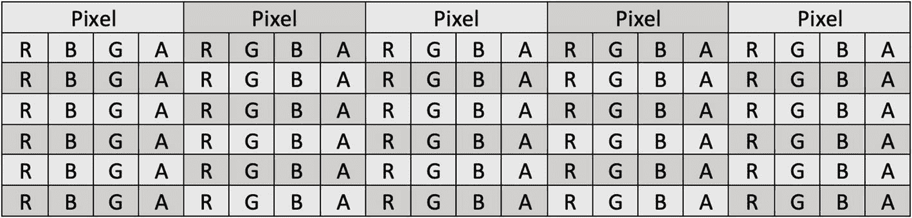
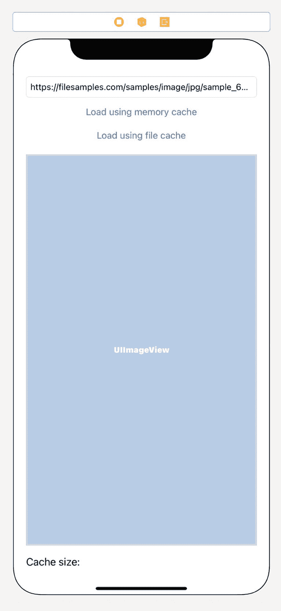
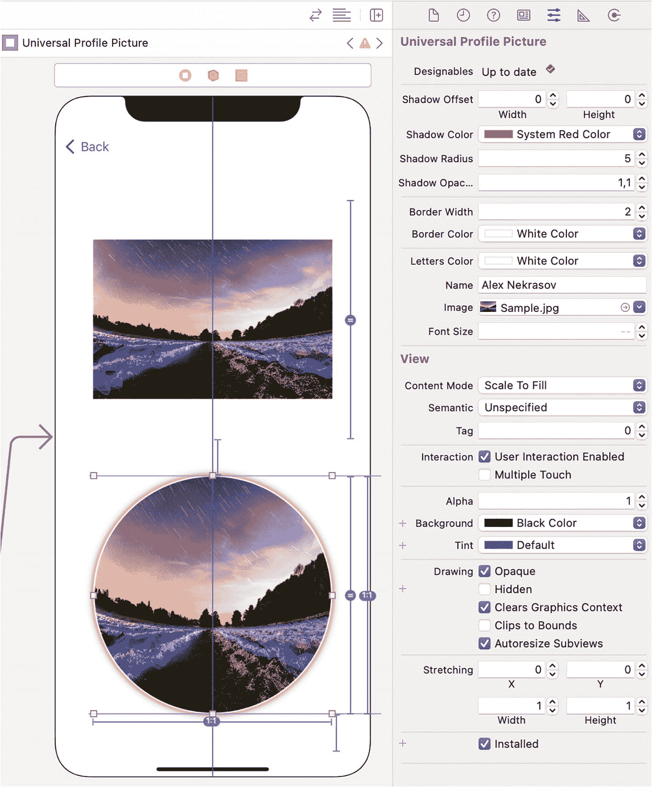

# 5. 图像处理

在设备屏幕上显示图像、使其半透明、移动、旋转和缩放——这些都是 UIKit 的标准功能。它们可以通过在 `UIImageView` 中显示 `UIImage` 来完成。但这并不是你在 iOS 上能获得的一切。Apple 提供了强大的框架来绘制和处理图像。除了标准框架之外，还有开源图像处理库。

我们可以对图像做什么？首先，我们将学习从文件加载图像并保存它们。文件可以存储在设备文件系统中，存储在内存中，甚至存储在网络上。然后我们将讨论图像下载和缓存，并了解像 Kingfisher 这样的库如何工作。

其次，我们将进行非常简单的图像处理，而不使用外部库。这些包括调整大小和裁剪。这对于个人资料图片可能很有用。大多数应用要求它们具有正方形形状，可能圆角成圆形。我们已经知道如何显示带有圆角的图像，但在上传前将其裁剪为正方形则完全是另一个话题。

然后我们将讨论图像蒙版。你可以通过仅修改 `UIImageView` 的层来显示带有圆角的图像，但在某些情况下，我们需要更复杂的形状。你可能希望允许用户将物品（如眼镜或胡须）放在图片之上。

最后一个主题是效果和滤镜。更改亮度和对比度、伽马值和饱和度——所有这些都可以使用外部库完成。更重要的是，流行的类似 Instagram 的滤镜可以直接在你的应用中应用。这包括棕褐色、模糊、高通/低通、像素化、素描、晕影、漩涡以及数十种其他滤镜。

### 读取和写入图像

在 iOS 中处理图像时有不同的框架。第一个是 UIKit。它有 `UIImage` 类。这是一个高级类，提供有限的功能；同时，它针对与 `UIImageView` 和其他 UIKit 组件的使用进行了优化。

来自 CoreImage 框架的 `CIImage` 是 `UIImage` 中的底层数据。它不为开发者提供任何功能，也不应该被直接访问。

底层类是 `CGImage`，它是 Core Graphics 框架的一部分。这个类提供了对图像缓冲区及其特性的完全访问。如果你需要更改图像中的几个像素或应用某个滤镜，`CGImage` 正是你所需要的。

`UIImage`、`CGImage` 和 `CIImage` 可以相互转换。


好的，作为一名高级文档工程师和翻译员，我将严格遵循您的要求，将给定的英文文本翻译成中文。


### 图像缓冲区

无论使用哪个类，它都有一个指向图像缓冲区的指针——要么是公开的，要么是在其内部实现中。图像缓冲区是一个像素数组。每个像素由一个或多个字节编码。最常见的图像数据存储方式是 RGB 和 RGBA。RGB 格式为每个像素使用 3 个字节，每个字节代表以下分量之一：红色、绿色和蓝色。RGBA 为每个像素使用 4 个字节。除了红色、绿色和蓝色之外，还有 alpha 分量，用于指示每个像素的透明度（图 5-1）。



该网格展示了像素的 R G B A 字节调色板。alpha 分量指示每个像素的透明度。

图 5-1
具有 RGBA 调色板的图片结构

如果图像是灰度的，每个像素通常用 1 个字节编码。如果字节包含 0，则为黑色；如果为 255，则为白色。中间的所有值是不同深浅的灰色。

公开图像缓冲区最多信息的类是 `CGImage`。它具有以下属性：

-   `width` 和 `height` 包含图像大小。
-   `bitsPerComponent` 包含单个分量的位数。
-   `bitsPerPixel` 包含每个像素的位数。
-   其他属性。

要在设备屏幕上绘制图片，您需要将其传递给视频芯片。它理解前面提到的其中一种格式的像素缓冲区，或经过特殊准备的纹理。对于 UIKit，您无需直接执行此操作。相反，您只需将其传递给 `UIImageView`，它会完成其余工作。

### 文件格式

图像在文件中的存储方式与在内存中不同。最接近像素缓冲区图像格式的是 BMP（Windows 设备无关位图），但由于其文件大小，它很少被使用。单独存储每个像素，为其分配 3 或 4 个字节的内存，非常消耗资源。例如，iPhone 11 的分辨率为 828 × 1792 像素。即使没有 alpha 通道（并且 BMP 不支持 alpha 通道），这样的图片也需要大约 4.24 MB。11 英寸 iPad Pro 的分辨率更高——2388 × 1668 像素。以 BMP 格式保存的简单截图将占用近 11.4 MB 的设备内存。它适用于活跃使用的纹理，但将所有图形资源以此格式存储是不可能的。

对于 iOS 应用资源和网络图像，最流行的格式是 PNG（便携式网络图形）、JPEG/JPG（联合图像专家组）和 GIF（图形交换格式）。这些格式可以解析为 `UIImage` 或 `CGImage`。另一种兼容格式是 TIF/TIFF（标签图像文件格式）。

PNG 文件质量好且支持透明。同时，它们比 BMP 或图像缓冲区小得多。PNG 是应用资产的推荐格式，至少对于部分透明的图片是如此。

最小的文件是使用 JPG 编码的。根据压缩率，它们可以更小但质量更差，或者更大但质量更好。JPG 将图片分割成方块，并允许每个方块中只使用一定范围的颜色。更好的质量需要每个方块使用更多字节，但提供了更大的颜色范围。更好的压缩则相反。JPG 质量范围从 0 到 1 或从 0 到 10。

GIF 图片是索引的。GIF 不使用颜色分量，而是使用颜色索引。每张图片最多可以有 256 种不同的颜色，这些颜色存储在调色板中。GIF 中不允许使用调色板之外的颜色。GIF 的另一个众所周知的特点是动画。GIF 在一个文件中可能包含多张图片。一系列图片构成一个动画。GIF 动画在即时通讯工具和一些应用中很受欢迎。我们将在本章末尾讨论它们。

### 从文件加载（读取）图像

在讨论了图像在文件和内存中的存储方式之后，让我们看看如何加载图像并获取 `UIImage` 或 `CGImage` 对象。

图像文件可以存储在内存中、磁盘上（对于 iPhone 来说是闪存）或网络上。根据文件位置，我们将使用 `UIImage` 和 `CGImage` 的不同初始化方法。

第一种情况是图像文件存储在内存中，具体来说，是在一个 `Data` 对象中。

函数 `loadImageFromData(_:, into:)` 解码作为第一个参数传递的数据文件，并设置第二个参数中 `UIImageView` 的 image 属性。如果提供的文件包含有效的图像文件，该函数返回 `true`，否则返回 `false`（代码段 5-1）。

```
public func loadImageFromData(_ data: Data, into imageView: UIImageView) -> Bool {
if let image = UIImage(data: data) {
imageView.image = image
return true
} else {
return false
}
}
代码段 5-1
从内存加载图像
```

如果应用使用可下载的资源，您将需要从文件（代码段 5-2）打开图像，可能来自归档文件，但我们将其留作范围之外。

此函数可能有三种结果：

-   文件未找到。
-   文件不是图像。
-   图像加载成功。

```
public enum LoadImageError: Error {
case fileNotFound
case notAnImage
}
public func loadImageFromFileWithError(_ file: String, into imageView: UIImageView) throws {
guard let data = try? Data(contentsOf: URL(fileURLWithPath: file)) else {
throw LoadImageError.fileNotFound
}
if !loadImageFromData(data, into: imageView) {
throw LoadImageError.notAnImage
}
}
代码段 5-2
从文件加载图像
```

最后一种可能性是直接从网络加载图片。而这种方式比看起来要复杂一些，首先是因为缓存的原因。在没有至少短期缓存的情况下从网络加载图像，对用户体验来说是一场灾难。想象一下，当用户离开又再次进入屏幕时，看到所有图片都重新加载。如果在 `UITableView` 或 `UICollectionView` 中使用这些图片呢？

一个简单的解决方案是使用外部库。其中之一是 Kingfisher。它是一个非常受欢迎的开源库，并且是免费的。

如果您不喜欢第三方库，您可以在您的应用内部制作一个简单的缓存系统。我们将在本章后面讨论它。

### 将图像保存（写入）到文件

当用户拍照并且我们处理它时，我们需要将其保存为我们之前提到的一种流行格式。我们不能将其作为 `UIImage`、`CGImage` 或图像缓冲区发送到服务器。

这个过程与读取非常相似，但我们也需要添加一些参数——例如，JPG 格式的压缩率（见代码段 5-3）。

```
func saveImageAsPNG(image: UIImage) -> Data? {
return image.pngData()
}
func saveImageAsJPEG(image: UIImage, compressionQuality: CGFloat) -> Data? {
return image.jpegData(compressionQuality: compressionQuality)
}
代码段 5-3
将图像保存到内存
```

代码段 5-4 中的函数不应在项目中使用，因为它们会增加代码量。但它们说明了将 `UIImage` 转换为 `Data` 是多么容易。

将图像保存到文件也很有用，可用于缓存目的或在处理前制作备份副本。一些库还需要文件的 URL 而不是 `Data` 对象。

```
public enum SaveImageError: Error {
case dataNotAvailable
}
func saveImageAsPNGFile(image: UIImage, fileName: String) throws {
if let data = image.pngData() {
try data.write(to: URL(fileURLWithPath: fileName))
} else {
throw SaveImageError.dataNotAvailable
}
}
func saveImageAsJPEGFile(image: UIImage, compressionQuality: CGFloat, fileName: String) throws {
if let data = image.jpegData(compressionQuality: compressionQuality) {
try data.write(to: URL(fileURLWithPath: fileName))
} else {
throw SaveImageError.dataNotAvailable
}
}
代码段 5-4
将图像保存到文件
```

这两个函数都可能抛出异常，因此需要将它们包装在 do-try-catch 块中。


## 下载与缓存图像

通常我们不需要手动完成图像的下载和缓存，但理解其原理十分重要。我们有一个图像 URL 和一个缓存存储器。该存储器本质上是一个`Dictionary`。键是 URL，或者为了获得更好的性能，也可以是 URL 的哈希值。值可以是图像本身，也可以是本地文件系统中的图像路径。

让我们从算法开始：

- 获取 URL，检查它是否在缓存中。
- 如果在缓存中，则返回已有的图像。
- 如果不在缓存中，则下载图像并将其添加到缓存中。
- 在将图像添加到缓存之前，需要检查缓存的大小。如果其中元素过多，则需要清理一些旧数据。如果缓存包含对本地文件系统的引用，则可以容纳更多项目。如果所有图像都存储在内存中，最好将其限制在 10`–`20 个元素。

### 下载文件

我们将回顾两种下载文件的方式。一种是使用 iOS 原生框架，另一种是借助一个非常流行的框架：Alamofire。

文件下载，具体来说就是图像下载，与任何 GET 请求并无二致。我们根据 URL、请求头、参数和其他数据构建一个请求。根据所使用的 HTTP 框架，实现方式可能有所不同，但其背后的理念是相同的。

由于本章讨论的是图像处理，我们将会把网络组件简化到最低限度。我们假设图像在网络上公开可访问，并且下载无需授权。

#### 使用 Alamofire 下载文件

在使用 Alamofire 之前，你应该将其添加到你的项目中。如果你使用 Swift Package Manager，请添加这个包：[`https://github.com/Alamofire/Alamofire`](https://github.com/Alamofire/Alamofire)。

对于 CocoaPods，请在你的`Podfile`中添加这一行：

```
pod 'Alamofire'
```

拥有文件 URL 后，你可以通过异步请求来下载它（参见配方 5-5）。*异步*意味着方法调用不会立即执行其全部功能。部分功能（在我们的例子中是下载）需要耗时，但该方法不会在文件下载完成前阻塞应用的执行。

> **注意**  
> Swift 5.5 提供了 `async`/`await` 关键字，使得异步方法调用几乎像同步调用一样，去除了闭包和扭曲的代码。这项技术是新的，大多数框架尚未原生支持，但将任何带有完成处理器的函数转换为异步函数是相当容易的。我们将在本章后面部分进行回顾。

```
import Alamofire
func downloadFile(url: String, delegate: @escaping (_ data: Data?, _ error: Error?) -> Void) {
AF.request(url)
.responseData { response in
DispatchQueue.main.async {
if let data = response.data {
// 我们在这里得到了 Data 对象
delegate(data, nil)
} else {
delegate(nil, response.error)
}
}
}
}
配方 5-5
使用 Alamofire 下载数据
```

#### 使用 URLSession/URLRequest 下载文件

使用外部库可以简化代码，但这会使你的应用变得臃肿。如果你正在编写一个大型应用，可能希望像配方 5-6 所示那样原生下载文件，以保持应用尽可能轻量和快速。

```
func downloadFileNatively(url: URL, delegate: @escaping (_ data: Data?, _ error: Error?) -> Void) {
let sessionConfig = URLSessionConfiguration.default
let session = URLSession(configuration: sessionConfig)
let request = URLRequest(url: url)
let task = session.dataTask(with: request) { data, response, error in
DispatchQueue.main.async {
if let data = data {
// 我们在这里得到了 Data 对象
delegate(data, nil)
} else {
delegate(nil, error)
}
}
}
task.resume()
}
配方 5-6
原生下载文件
```

获得一个`Data`对象后，我们就可以进入下一步了。

### 将带有完成处理器的函数转换为异步函数

多个异步调用会使应用逻辑变得扭曲，并可能产生错误。当你进行一个 API 调用，然后处理它，并根据第一次调用的结果进行更多调用时，你会得到许多小函数，或者一个庞大且难以维护的函数。

在 Swift 5.5 中，苹果引入了一项新技术——异步函数。如果你使用过其他编程语言，比如 JavaScript 或 Dart，你可能已经熟悉了这个概念。

带有完成处理器的常规函数会在后台线程中执行一些工作，然后将结果返回到作为参数传入的一个逃逸函数中。这个函数通常接受两个参数——正确结果和错误信息。例如：

```
func download(url: URL, completion: @escaping (_ result: Data?, _ error: Error?) -> Void)
```

如果下载成功，返回结果`Data`对象，`error`为`nil`。否则，`result`为`nil`，`error`指示问题所在。

在 Swift 5.5 中，你可以这样重写：

```
func downloadAsync(url: URL) async throws -> Data
```

有了原始的带有完成处理器的函数，我们可以像配方 5-7 所示那样编写第二个函数。

```
func downloadAsync(url: URL) async throws -> Data {
try await withUnsafeThrowingContinuation { continuation in
download(url: url) { data, error in
if let error = error {
continuation.resume(throwing: error)
} else if let data = data {
continuation.resume(returning: data)
}
fatalError("Error in download function")
}
}
}
配方 5-7
异步包装器
```

将 `download` 替换为 `downloadFile` 或 `downloadFileNatively`，你将得到这些函数的异步版本。使用方法如下：

```
do {
let downloadResult = try await downloadAsync(url: url)
// downloadedResult 包含一个非可选的 Data 对象
} catch {
print(error)
}
```

### 在内存中缓存文件

最简单且最快的方法是将下载的文件保存在内存中。缺点在于 iOS 应用的内存相当有限。尽管限制很高（一个应用最多可以占用 5 GB），但不建议使用大量内存。当你的应用在前台运行时，iOS 可能会关闭后台应用；更糟的是，一旦你的应用进入后台，它很可能连同你的缓存一起被卸载。

配方 5-8 展示了一个没有大小控制的最简单的缓存实现。

```
public class SimpleImageCache {
private var cache: [Int: Data] = [:]
public func addToCache(url: String, data: Data) {
cache[url.hash] = data
}
public func getFromCache(url: String) -> Data? {
cache[url.hash]
}
public static let sharedInstance = SimpleImageCache()
}
配方 5-8
简单内存缓存
```

配方 5-9 使用了这个类来实现带缓存的图像加载。

```
func downloadFileWithCache(url: URL, delegate: @escaping (_ data: Data?, _ error: Error?) -> Void) {
if let data = SimpleImageCache.sharedInstance.getFromCache(url: url.absoluteString) {
delegate(data, nil)
return
}
let sessionConfig = URLSessionConfiguration.default
let session = URLSession(configuration: sessionConfig)
let request = URLRequest(url: url)
let task = session.dataTask(with: request) { data, response, error in
if let data = data {
SimpleImageCache.sharedInstance.addToCache(url: url.absoluteString, data: data)
delegate(data, nil)
} else {
delegate(nil, error ?? NSError())
}
}
task.resume()
}
配方 5-9
带缓存下载文件
```

在编写带有委托的异步函数时，我们应始终牢记，代码的所有部分都应该调用`delegate`。否则，用户可能会被永久的加载状态卡住。最好显示一个错误，即使它除了阻止用户并迫使他们关闭你的应用（可能永远不再打开）之外，没有任何有用的信息。

### 在文件系统中缓存文件

在内存中缓存文件和在文件系统中缓存文件有两个主要区别：

- 每次应用重启时，内存都会被清理，因此我们无需自行清理缓存。
- 缓存的文件不会存储在像 `Dictionary` 这样的结构中；我们必须自己管理它们。

其余部分相似。


#### 获取目录路径

在写入任何文件之前，我们需要先确定存储位置。缓存数据有三种可能的存储位置：

*   Documents 目录
*   Caches 目录
*   Temporary 目录

我们并非必须使用 Caches 目录来存储缓存，但这是一种良好的实践。在不同情况下，iOS 会以不同方式对待这些目录。例如，当手机内存已满时，我们希望 iOS 能清理 caches 和 temporary 目录。另一方面，已安装应用的 Documents 目录，在没有用户明确指令的情况下不应被改动。技巧 5-10 展示了如何获取最常见的路径。

```
// 获取用户的 documents 目录路径
func getDocumentDirectoryPath() -> URL {
    let arrayPaths = FileManager.default.urls(for: .documentDirectory, in: .userDomainMask)
    let docDirectoryPath = arrayPaths[0]
    return docDirectoryPath
}
// 获取用户的 cache 目录路径
func getCacheDirectoryPath() -> URL {
    let arrayPaths = FileManager.default.urls(for: .cachesDirectory, in: .userDomainMask)
    let cacheDirectoryPath = arrayPaths[0]
    return cacheDirectoryPath
}
// 获取用户的 temp 目录路径
func getTempDirectoryPath() -> URL {
    let tempDirectoryPath = URL(fileURLWithPath: NSTemporaryDirectory(), isDirectory: true)
    return tempDirectoryPath
}
技巧 5-10
获取目录路径
```

#### 将文件保存到缓存

既然我们决定将缓存存储在一个为此目的专门创建的文件夹中，并且已经通过 URL 对象获得了该文件夹的路径，那么我们就可以保存下载的文件，并在需要时进行检索。

除了文件本身，我们还需要存储关于它们的额外数据——例如，原始 URL。我们很快就会发现，记录最后使用日期和文件大小对于下一步操作也很有用。

我们需要一个已知的 URL 以及本地文件名。一个显而易见的解决方案是让文件名与其 URL 相匹配。这个方案看似合理，但其实是错误的。问题在于文件名在长度和允许使用的字符上都有限制。好消息是，我们不需要完整的 URL，我们只需要它的哈希值。我们可以用哈希值来代替 URL。

在技巧 5-11 中，我们将修改 `SimpleImageCache` 类，并将其转变为 `FileImageCache`。

```
public class SimpleFileImageCache {
    private func getCacheDirectoryPath() -> URL {
        let arrayPaths = FileManager.default.urls(for: .cachesDirectory, in: .userDomainMask)
        let cacheDirectoryPath = arrayPaths[0]
        return cacheDirectoryPath
    }
    private func getLocalURL(url: String) -> URL {
        let baseURL = getCacheDirectoryPath()
        return baseURL.appendingPathComponent("\(url.hash)")
    }
    public func addToCache(url: String, data: Data) {
        let localURL = getLocalURL(url: url)
        _ = try? data.write(to: localURL, options: .atomic)
    }
    public func getFromCache(url: String) -> Data? {
        let localURL = getLocalURL(url: url)
        return try? Data(contentsOf: localURL)
    }
    public static let sharedInstance = SimpleFileImageCache()
}
技巧 5-11
文件图像缓存
```

`getCacheDirectoryPath` 函数被改成了一个私有方法，但它仍然可以像前一个技巧中那样被直接使用。

`addToCache` 方法并不总是能成功。例如，如果内存已满，它就会失败。但这不应导致应用完全崩溃，只会使其变得不太稳定。这当然不好，但对此我们也没有太多办法来处理。我们甚至不需要显示错误弹窗。但如果多次尝试都失败，情况可能会变得更糟，甚至可能导致应用崩溃。

#### 验证缓存大小

根据存储位置的不同，验证缓存大小有两种不同的方法：

*   如果缓存文件存储在内存中，我们可以遍历所有 `Data` 对象并汇总它们的大小。
*   如果缓存文件存储在文件系统中，我们需要计算所有文件的大小，或者将它们的大小存储在一个索引文件中。

现在，既然我们有了更智能的缓存清理机制，就需要存储日期和时间信息，以便移除最早的文件。于是问题来了：我们是应该删除那些下载时间较早的文件，还是删除那些使用时间较早的文件？两种方案都可行，但第二种更有效。技巧 5-12 基于之前的方案提供了一个新的 `ImageCache` 类，用于记录最后一次使用数据，并在每次访问图像时更新该数据。当缓存满了之后，我们会删除其中 30% 的、较长时间未被使用的图像。

话不多说，回到编码环节！

```
public class ImageCache {
    private struct CachedFile {
        var hash: Int
        var size: Int {
            data.count
        }
        var data: Data
        var lastAccess: Date
    }
    private var cache: [Int: CachedFile] = [:]
    var totalSize: Int {
        var size = 0
        for f in cache.values {
            size += f.size
        }
        return size
    }
    var sizeThreshold = 104_857_600 // 100Mb
    public func addToCache(url: String, data: Data) {
        var totalSize = self.totalSize
        if totalSize + data.count > sizeThreshold {
            // 移除 10% 的缓存文件
            let sortedFiles = cache.values.sorted { cf1, cf2 in
                cf1.lastAccess.timeIntervalSince1970 < cf2.lastAccess.timeIntervalSince1970
            }
            while totalSize + data.count > sizeThreshold * 9 / 10 {
                guard let lastFile = sortedFiles.last else {
                    break
                }
                totalSize -= lastFile.size
                cache.removeValue(forKey: lastFile.hash)
            }
        }
        cache[url.hash] = CachedFile(hash: url.hash, data: data, lastAccess: Date())
    }
    public func getFromCache(url: String) -> Data? {
        guard var cacheFile = cache[url.hash] else {
            return nil
        }
        cacheFile.lastAccess = Date()
        return cacheFile.data
    }
    public static let sharedInstance = ImageCache()
}
技巧 5-12
内存缓存系统
```

`CachedFile` 结构体包含了缓存文件的所有必要信息。每次请求图像时，`lastAccess` 字段都会被更新。

`sizeThreshold` 字段定义了可用于缓存的内存大小上限。默认情况下，这个值是 100 兆字节。`addToCache` 方法会检查新图像是否能被容纳，如果不能，则会移除文件，直到在添加新文件后缓存至少还有 10% 的空闲内存。

我们缓存系统的下一个版本（技巧 5-13），即 `FileImageCache`，也遵循相同的原则。它在 `init` 方法中创建缓存，并在 `deinit` 方法中（如有必要）清理 10% 的缓存空间。


```swift
public class FileImageCache {
    private struct CachedFile {
        var hash: Int
        var size: Int
        var lastAccess: Date
    }
    
    private var cache: [Int: CachedFile] = [:]
    
    var totalSize: Int {
        var size = 0
        for f in cache.values {
            size += f.size
        }
        return size
    }
    
    private func getCacheDirectoryPath() -> URL {
        let arrayPaths = FileManager.default.urls(for: .cachesDirectory, in: .userDomainMask)
        let cacheDirectoryPath = arrayPaths[0]
        if !FileManager.default.fileExists(atPath: cacheDirectoryPath.path) {
            do {
                try FileManager.default.createDirectory(at: cacheDirectoryPath, withIntermediateDirectories: true, attributes: nil)
            } catch {
                print(error)
            }
        }
        return cacheDirectoryPath
    }
    
    private func getLocalURL(url: String) -> URL {
        let baseURL = getCacheDirectoryPath()
        return baseURL.appendingPathComponent("\(url.hash)")
    }
    
    init() {
        // Get a list of files from filesystem
        do {
            let fileURLs = try FileManager.default.contentsOfDirectory(at: getCacheDirectoryPath(), includingPropertiesForKeys: nil, options: [.skipsHiddenFiles, .skipsSubdirectoryDescendants])
            for fileURL in fileURLs {
                guard let hash = Int(fileURL.lastPathComponent) else {
                    continue
                }
                let attributes = try? FileManager.default.attributesOfItem(atPath: fileURL.path)
                let fileSize = attributes?[.size] as? UInt64 ?? 0
                cache[hash] = CachedFile(hash: hash, size: Int(fileSize), lastAccess: Date())
            }
        } catch {
            print("Error loadign cache from filesystem")
        }
    }
    
    deinit {
        cleanIfNeeded()
    }
    
    var sizeThreshold = 104_857_600 // 100Mb
    
    private func cleanIfNeeded(newFileSize: Int = 0) {
        var totalSize = self.totalSize
        if totalSize + newFileSize > sizeThreshold {
            // Remove 10% of cached files
            let sortedFiles = cache.values.sorted { cf1, cf2 in
                cf1.lastAccess.timeIntervalSince1970 > cf2.lastAccess.timeIntervalSince1970
            }
            while totalSize > sizeThreshold * 9 / 10 {
                guard let lastFile = sortedFiles.last else {
                    break
                }
                do {
                    try FileManager.default.removeItem(atPath: getLocalURL(url: "\(lastFile.hash)").absoluteString)
                    totalSize -= lastFile.size
                } catch {
                    print(error.localizedDescription)
                }
                cache.removeValue(forKey: lastFile.hash)
            }
        }
    }
    
    public func addToCache(url: String, data: Data) {
        cleanIfNeeded(newFileSize: data.count)
        do {
            try data.write(to: getLocalURL(url: url))
            cache[url.hash] = CachedFile(hash: url.hash, size: data.count, lastAccess: Date())
        } catch {
            print(error.localizedDescription)
        }
    }
    
    public func getFromCache(url: String) -> Data? {
        guard var cacheFile = cache[url.hash] else {
            return nil
        }
        cacheFile.lastAccess = Date()
        let fullURL = getLocalURL(url: url)
        do {
            return try Data(contentsOf: fullURL)
        } catch {
            print(error)
            return nil
        }
    }
    
    public static let sharedInstance = FileImageCache()
}
```

## 配方 5-13：文件系统缓存系统

这两种方法可以合并为一个。内存缓存可以容纳少量数据，例如 10–15 Mb。文件系统缓存则可以容纳数倍于此的数据。当内存缓存达到极限时，它会将部分文件保存到磁盘，并在需要时重新读取。

这有什么实际用途？假设你在开发一个展示餐厅菜单的应用。菜单中包含`UITableView`或`UICollectionView`，并带有小图片。用户上下滑动屏幕，试图决定今天想吃什么。这种情况下非常适合使用内存缓存。反复从磁盘读取文件会消耗更长时间，即使磁盘是高速闪存。当用户进入购物车页面时，菜单图片不再需要，我们可以将其从内存中移除。另一方面，用户可能会返回菜单页面，或在点单后继续浏览菜单。我们只需从磁盘重新加载所有图片即可。

本书不深入讨论两级缓存，但你可以尝试自行实现作为练习。这将是一次宝贵的经验。

最后，让我们回顾一个使用示例。我们将三个 UIKit 视图添加到屏幕上：

```swift
// 显示当前缓存大小的 UILabel
@IBOutlet weak var lblCacheSize: UILabel!
// 用于输入 URL 的 UITextField
@IBOutlet weak var tfURL: UITextField!
// 用于显示已加载（或缓存）图片的 UIImageView
@IBOutlet weak var ivImage: UIImageView!
```

此外，我们添加两个按钮。一个通过内存缓存加载图片，另一个通过文件系统缓存加载图片。它们将触发以下操作：

```swift
@IBAction func loadUsingMemory()
@IBAction func loadUsingFiles()
```

Storyboard 的设计可能如图 5-2 所示。



**图 5-2** 图片缓存视图的 Storyboard

为了更好地理解，现在我们来查看一个图片缓存的使用示例。

示例很直观，只需明确以下几点：

1. 部分函数接受 `URL`，而其他函数要求 `String`。对于文件，URL 以 `file://` 开头，因此要转换为文件路径，需使用 `.path` 而非 `.absoluteString`。

2. 要从文本字段 `tfURLString` 输入的字符串创建 URL 对象，需要对字符进行转义；否则 URL 可能为 nil。为此，我们使用 `.addingPercentEncoding(withAllowedCharacters: CharacterSet.urlQueryAllowed)` 方法。

3. 空格也可能导致 URL 无效，因此需对输入的 `String` 进行修剪：`.trimmingCharacters(in: .whitespacesAndNewlines)`。

## 调整大小与裁剪

通过访问 `CGImage` 中的图像缓冲区，我们可以对其进行修改——既可以在现有图像对象内部操作，也可以创建新的图像缓冲区并将其转换为新的 `CGImage` 或 `UIImage`。

我们可以对图像进行哪些操作？

* 缩放图像。可等比或非等比缩放，可放大或缩小。

* 裁剪图像。我们可以将图像裁剪成所需比例的方形或矩形。裁剪后的图像始终比原始图像小。


### 图像缩放

缩放分为两种类型：放大和缩小。第一种情况，新图像比原始图像更大；第二种情况则更小。如果缩放不成比例，则可能同时涉及放大和缩小。但我们通常需要保持宽高比，因此这里不讨论这种情况。

幸运的是，`CoreImage` 框架为我们处理了一切；我们只需要计算新的尺寸。这个尺寸会是什么样呢？

我们可能需要设置图像的最大尺寸，例如，当用户选择头像时。现代 `iPhone` 相机的分辨率非常高。图像尺寸在 5000 × 5000 像素左右是正常的。但对于头像来说，这并非必要，因此应用程序需要将其缩小。

如果用户从图库中选择图片，图片可能会太小。在这种情况下，我们需要将其放大。或者，应用程序可以弹出一个提示，要求用户选择质量更好的图片。配方 5-14 展示了一种可能的尺寸调整方案，而配方 5-15 则仅对图像进行缩小。

```
extension UIImage {
    func downscaled(maxSize: CGFloat) -> UIImage? {
        let maxDimension = size.width > size.height ? size.width : size.height
        if maxDimension > maxSize {
            return resized(maxSize: maxSize)
        } else {
            return self
        }
    }
}
配方 5-15
缩小图像
```

```
extension UIImage {
    func resized(maxSize: CGFloat) -> UIImage? {
        let scale: CGFloat
        if size.width > size.height {
            scale = maxSize / size.width
        } else {
            scale = maxSize / size.height
        }
        let newWidth = size.width * scale
        let newHeight = size.height * scale
        UIGraphicsBeginImageContext(CGSize(width: newWidth, height: newHeight))
        draw(in: CGRect(x: 0, y: 0, width: newWidth, height: newHeight))
        let newImage = UIGraphicsGetImageFromCurrentImageContext()
        UIGraphicsEndImageContext()
        return newImage
    }
}
配方 5-14
将图像缩放到所需尺寸
```

现在是时候讨论*图像上下文*了。直接在 `UIImage` 或 `CGImage` 中更改像素效率不高。如果我们手动计算像素，就会失去所有图形加速能力。正确的做法是创建一个图像上下文。

一次只能处理一个图像上下文。所有工作都在以下两个调用之间进行：

```
UIGraphicsBeginImageContext
// ... 和 ...
UIGraphicsEndImageContext
```

你可以使用 `UIImage` 实例在当前上下文中绘制，也可以使用 `UIBezierPath` 和其他利用图像上下文的类绘制线条或其他形状。

最后，你需要使用 `UIGraphicsGetImageFromCurrentImageContext` 函数将上下文转换为一个新的 `UIImage` 对象。

### 图像裁剪

当我们需要特定的宽高比时，就需要进行图像裁剪。许多应用程序需要方形图片。例如，`Instagram` 上的所有帖子都是方形的。头像通常也是方形的。有时是圆角方形，有时是圆形。从图像处理的角度来看，方形、圆角方形和圆形是相同的，因为圆角处理由 `UIKit` 执行，区别仅在于圆角半径。

另一种选择是矩形。电脑显示器通常具有 16:9 的比例。全高清是 1920 × 1080。如果你将 1920 除以 16 或 1080 除以 9，结果都是 120。`UHD` 或 `4K` 在每个维度上的像素是其两倍——3840 × 2160。如果你将宽度除以 16 或高度除以 9，两种情况下结果都是 240。

`iPad` 屏幕的宽高比为 4:3。例如，配备视网膜屏的典型 `iPad Pro` 屏幕分辨率为 2048 × 1536 像素。512 × 4 = 2048，512 × 3 = 1536。`iPad Pro` 的宽高比并非完美的 4:3，但非常接近。例如，11 英寸的 `iPad Pro` 分辨率为 2388 × 1668 像素。其比例是 1.43:1，或 4.29:3。

编写应用程序时，保持必要的宽高比比保持分辨率更重要。有几种更改宽高比的方法：

*   不保持宽高比缩放图像。这是最简单的方法，但结果会拉伸变形。
*   裁剪图像。如果原始图像太宽，我们可以移除其两侧的一些像素。
*   添加边距。在家看电影时，你会注意到大多数电影屏幕的顶部和底部都有黑色区域。这是因为在电影院中宽高比不同（屏幕更宽），而电影通常针对电影院进行了优化。

让我们为 `UIImage` 编写两个扩展。来自配方 5-16 的一个扩展将使用最短的维度将图像裁剪为正方形。来自配方 5-17 的另一个扩展将图像裁剪为所需的宽高比。

```
extension UIImage {
    func changeAspectRatio(aspectRatio: CGFloat) -> UIImage? {
        guard let originalCGImage = self.cgImage else {
            return nil
        }
        // Create a copy of the image without the imageOrientation property so it is in its native orientation
        let contextImage: UIImage = UIImage(cgImage: originalCGImage)
        // Get the size of the contextImage
        let contextSize: CGSize = contextImage.size
        let posX: CGFloat
        let posY: CGFloat
        let width: CGFloat
        let height: CGFloat
        if aspectRatio == contextSize.width / contextSize.height {
            // New aspect ratio is the same as old
            posX = 0
            posY = 0
            width = contextSize.width
            height = contextSize.height
        } else if aspectRatio < contextSize.width / contextSize.height {
            // New aspect ratio is less then original
            // Cut from left/right
            posX = (contextSize.width - contextSize.height * aspectRatio) / 2
            posY = 0
            width = contextSize.height * aspectRatio
            height = contextSize.height
        } else {
            // Cut from top/bottom
            posX = 0
            posY = (contextSize.height - contextSize.width / aspectRatio) / 2
            width = contextSize.width
            height = contextSize.width / aspectRatio
        }
        let rect: CGRect = CGRect(x: posX, y: posY, width: width, height: height)
        // Create bitmap image from context using the rect
        if let imageRef = contextImage.cgImage?.cropping(to: rect) {
            return UIImage(cgImage: imageRef, scale: self.scale, orientation: self.imageOrientation)
        } else {
            return nil
        }
    }
}
配方 5-17
将图像裁剪为自定义宽高比
```

```
extension UIImage {
    var squared: UIImage? {
        guard let originalCGImage = self.cgImage else {
            return nil
        }
        // Create a copy of the image without the imageOrientation property so it is in its native orientation
        let contextImage: UIImage = UIImage(cgImage: originalCGImage)
        // Get the size of the contextImage
        let contextSize: CGSize = contextImage.size
        let posX: CGFloat
        let posY: CGFloat
        let width: CGFloat
        let height: CGFloat
        // Check to see which length is the longest and create the offset based on that length, then set the width and height of our rect
        if contextSize.width > contextSize.height {
            posX = (contextSize.width - contextSize.height) / 2
            posY = 0
            width = contextSize.height
            height = contextSize.height
        } else {
            posX = 0
            posY = (contextSize.height - contextSize.width) / 2
            width = contextSize.width
            height = contextSize.width
        }
        let rect: CGRect = CGRect(x: posX, y: posY, width: width, height: height)
        if let imageRef = contextImage.cgImage?.cropping(to: rect) {
            // Create a new image based on the imageRef and rotate back to the original orientation
            return UIImage(cgImage: imageRef, scale: self.scale, orientation: self.imageOrientation)
        } else {
            return nil
        }
    }
}
配方 5-16
将图像裁剪为正方形
```

**注意**

这些计算属性和函数通常应该成功，但如果可能出现问题，我们假定它会出错。这就是为什么结果是可选的。究竟可能出什么问题？例如，宽高比可能过小或过大，导致其中一个维度为零；或者设备内存不足——在这些情况下，我们可能会得到 `nil`。


## 准备与展示个人头像

我们无法控制用户拍摄照片的几何形状。如果从社交网络获取这些照片，可控性就更低了。用户尝试下载尺寸或宽高比错误的图片时，虽然可以选择显示错误信息，但这会造成不良用户体验。

更好的解决方案是在上传前处理图片。我们通常希望限制图片尺寸并使其成为正方形。在本例中，我们将限制为 512 `×` 512 像素。

### 上传前处理个人头像

基于之前编写的扩展，我们只需一行代码即可准备好个人头像，如示例 5-18 所示。以下是我们的算法：

-   用户拍照。来源无关紧要，可以是相机或相册。
-   如果宽度和高度都大于 512 像素，则缩小图片，使至少一个维度变为 512 像素（另一个维度会更大）。
-   如果宽度不等于高度，则裁剪图片。为简化操作，我们将从两侧均匀裁剪像素。

```
extension UIImage {
func prepareProfilePicture() -> UIImage {
squared?.downscaled(maxSize: 512) ?? self
}
}
示例 5-18
处理用作个人头像的图片
```

如您所见，这是之前编写的函数的组合。如果其中一个函数失败，我们可以返回一个可选的`UIImage`。另一种选择是像前面的示例那样返回原始图片。

### 展示个人头像

如果个人头像已妥善准备，我们可以确保它将是正方形，且每个维度不超过 512 像素。另一方面，错误也时有发生。幸运的是，`UIImageView`可以根据设计需求，将任何图片显示为正方形、圆角正方形甚至圆形（见图 5-3 和示例 5-19）。



一张手机屏幕图像，显示矩形和圆形轮廓中的图片及其属性。给出了诸如阴影偏移、边框颜色和语义等属性。

**图 5-3** 通用个人头像视图

```
class ProfilePicture: UIImageView {
override init(frame: CGRect) {
super.init(frame: frame)
commonInit()
}
required init?(coder: NSCoder) {
super.init(coder: coder)
commonInit()
}
private func commonInit() {
contentMode = .scaleAspectFill
layer.masksToBounds = true
}
override func layoutSubviews() {
super.layoutSubviews()
layer.cornerRadius = min(bounds.width, bounds.height) / 2.0
}
}
示例 5-19
自定义个人头像视图
```

示例 5-20 为我们提供了通过效果增强应用外观的方法。结合之前学到的几个技巧，让我们创建一个通用的个人头像组件，包含阴影、轮廓，以及如果未上传头像则显示用户首字母的功能。

```
@IBDesignable
class UniversalProfilePicture: UIView {
@IBInspectable var shadowOffset: CGSize {
get {
layer.shadowOffset
}
set {
layer.shadowOffset = newValue
}
}
@IBInspectable var shadowColor: UIColor? {
get {
if let sc = layer.shadowColor {
return UIColor(cgColor: sc)
} else {
return nil
}
}
set {
layer.shadowColor = newValue?.cgColor
}
}
@IBInspectable var shadowRadius: CGFloat {
get {
layer.shadowRadius
}
set {
layer.shadowRadius = newValue
}
}
@IBInspectable var shadowOpacity: Float {
get {
layer.shadowOpacity
}
set {
layer.shadowOpacity = newValue
}
}
@IBInspectable var borderWidth: CGFloat = 2.0 {
didSet {
layer.borderWidth = borderWidth
}
}
@IBInspectable var borderColor: UIColor = .white {
didSet {
layer.borderColor = borderColor.cgColor
}
}
@IBInspectable var lettersColor: UIColor = .white {
didSet {
self.setInitials()
}
}
@IBInspectable var name: String = "John Doe" {
didSet {
self.setInitials()
}
}
@IBInspectable var image: UIImage? {
didSet {
picture?.image = image
}
}
@IBInspectable var fontSize: CGFloat = 32 {
didSet {
self.setInitials()
}
}
var picture: UIImageView?
var initials: UILabel?
override init(frame: CGRect) {
super.init(frame: frame)
commonInit()
}
required init?(coder: NSCoder) {
super.init(coder: coder)
commonInit()
}
private func commonInit() {
picture = UIImageView(frame: bounds)
initials = UILabel(frame: bounds)
addSubview(initials!)
addSubview(picture!)
picture?.contentMode = .scaleToFill
picture?.layer.masksToBounds = true
picture?.image = image
initials?.textAlignment = .center
setInitials()
}
override func layoutSubviews() {
super.layoutSubviews()
picture?.frame = bounds
initials?.frame = bounds
layer.cornerRadius = min(bounds.width, bounds.height) / 2.0
picture?.layer.cornerRadius = min(bounds.width, bounds.height) / 2.0
initials?.layer.cornerRadius = min(bounds.width, bounds.height) / 2.0
}
private func setInitials() {
initials?.font = UIFont.systemFont(ofSize: fontSize)
let initialsText = name
.components(separatedBy: " ")
.reduce("") {
($0 == "" ? "" : "\($0.first!)") + "\($1.first!)"
}
initials?.text = initialsText
initials?.textColor = lettersColor
}
}
示例 5-20
通用个人头像组件
```

最后一个示例复制了前面描述的一些功能。利用第 3 章的`UIView`扩展，`UniversalProfilePicture`类可以更简洁。

## 图像遮罩

本章前面部分介绍了如何进行基本图像处理。下一步是将两个或多个图片合并为一个。所有流行的即时通讯软件、社交网络、博客平台及其他应用都提供添加效果的功能，这些效果不会改变图像本身，而是在其上添加一些内容。可以是文字、简单绘图、贴纸、烟雾、星星等。

这可以通过在底层图片上添加一个带有透明度的图片来实现。顶层图片可以是预定义图片、用户选择的图片或新生成的图片。

这里的关键概念是 Alpha 通道。图像由像素组成。每个像素都有表示颜色或透明度级别的通道。包括智能手机在内的计算机设备上最常见的调色板是 RGBA。RGBA 代表红色、绿色、蓝色和 Alpha。

红色、绿色和蓝色是颜色分量。这些颜色的混合构成了整个显示调色板。红色和绿色混合产生黄色；红色和蓝色混合产生洋红色；蓝色和绿色混合产生青色。当所有通道都达到最大值时，显示为白色。

Alpha 分量是透明度级别。如果它占用 1 个字节，其范围是 0 到 255，其中 0 表示完全透明的像素，255 表示完全不透明的像素。

但这一切为什么重要呢？


### 合并图像

当我们将图像合并为一张时，我们会使用 alpha 通道作为乘数，分别合并每个通道。假设背景图像不透明，我们可以通过以下方式进行合并：

```
r = (r1 * (255 - a2) + r2 * a2) / 255
g = (g1 * (255 - a2) + g2 * a2) / 255
b = (b1 * (255 - a2) + b2 * a2) / 255
```

或者，如果颜色用 `Float` 或 `Double` 值表示，我们可以像这样合并：

```
r = r1 * (1.0 - a2) + r2 * a2
g = g1 * (1.0 - a2) + g2 * a2
b = b1 * (1.0 - a2) + b2 * a2
```

这些公式可以是非线性的，但这是最简单的解决方案，并且它展示了 alpha 通道的用法。

在方案 5-21 中，我们有两张图像。第一张图像可以是完全不透明的。第二张图像是部分透明的，其大小与第一张图像相同或更小。

```
extension UIImage {
func simpleMerge(with topImage: UIImage, x: CGFloat, y: CGFloat) -> UIImage? {
UIGraphicsBeginImageContext(CGSize(width: size.width, height: size.height))
draw(at: CGPoint(x: 0, y: 0))
topImage.draw(at: CGPoint(x: x, y: y))
let newImage = UIGraphicsGetImageFromCurrentImageContext()
UIGraphicsEndImageContext()
return newImage
}
}
方案 5-21
合并两张图像——简单情况
```

让我们进入下一阶段（方案 5-22）。现在，我们假设图像可以有任意尺寸；最终结果图像将包含两个源图像且不裁剪。

```
extension UIImage {
func universalMerge(with topImage: UIImage, x: CGFloat, y: CGFloat) -> UIImage? {
let x1 = (x < 0) ? -x : 0
let y1 = (y < 0) ? -y : 0
let x2 = (x < 0) ? 0 : x
let y2 = (y < 0) ? 0 : y
let newWidth = max(x1 + size.width, x2 + topImage.size.width)
let newHeight = max(y1 + size.height, y2 + topImage.size.height)
UIGraphicsBeginImageContext(CGSize(width: newWidth, height: newHeight))
draw(at: CGPoint(x: x1, y: y1))
topImage.draw(at: CGPoint(x: x2, y: y2))
let newImage = UIGraphicsGetImageFromCurrentImageContext()
UIGraphicsEndImageContext()
return newImage
}
}
方案 5-22
合并两张图像——通用情况
```

有时我们需要保持原始尺寸，并使结果图像与背景图像相同。在这种情况下，我们忽略第二张图像超出背景图片范围的像素，如方案 5-23 所示。

```
extension UIImage {
func croppingMerge(with topImage: UIImage, x: CGFloat, y: CGFloat) -> UIImage? {
let cropX = (x < 0) ? -x : 0
let cropY = (y < 0) ? -y : 0
let cropW: CGFloat
let cropH: CGFloat
if x < 0 {
cropW = min(topImage.size.width + x, size.width)
} else {
cropW = min(topImage.size.width, size.width - x - cropX)
}
if y < 0 {
cropH = min(topImage.size.height + y, size.height)
} else {
cropH = min(topImage.size.height, size.height - y - cropY)
}
if cropW <= 0 || cropH <= 0 {
return self
}
let topImageCropped: UIImage
if cropW == topImage.size.width && cropH == topImage.size.height {
topImageCropped = topImage
} else {
guard let topCGImage = topImage.cgImage,
let imageRef = topCGImage.cropping(to: CGRect(x: cropX, y: cropY, width: cropW, height: cropH))
else {
return nil
}
topImageCropped = UIImage(cgImage: imageRef)
}
UIGraphicsBeginImageContext(CGSize(width: size.width, height: size.height))
draw(at: CGPoint(x: 0, y: 0))
topImageCropped.draw(at: CGPoint(x: max(x, 0), y: max(y, 0)))
let newImage = UIGraphicsGetImageFromCurrentImageContext()
UIGraphicsEndImageContext()
return newImage
}
}
方案 5-23
带裁剪的合并图像
```

**注意**

如果你测试了这些方法，可能已经注意到简单合并和带裁剪的合并会得到相同的结果。这是因为 `UIImage` 的 `draw` 方法会在图像部分超出边界时进行裁剪。基本上，方案 5-23 展示了其内部机制。使用其中任何一种方法都是完全有效的。

### 应用蒙版

如果你有一张矩形图像，例如来自 iPhone 相机拍摄的，并且想要赋予它其他形状，你可能需要应用一个蒙版。蒙版是仅包含一个通道——alpha 通道的图像。由于在任何图像格式中都不允许将 alpha 作为唯一通道，因此通常使用灰度图像作为蒙版。

白色表示完全不透明的像素，而黑色表示完全透明的像素。假设 `m` 是蒙版像素的白度级别。

```
a = a1 * m // 如果 m 的范围是 0.0 到 1.0
// 或者
a = a1 * m / 255 // 如果 m 的范围是 0 到 255
```

当我们应用蒙版时，红、绿、蓝通道保持不变。

在方案 5-24 中，我们将应用一个蒙版。如果蒙版比原始图像小，我们会假定蒙版之外的像素是透明的。如果蒙版部分超出图像边界，我们将忽略这些像素。

与之前的方案不同，在这个方案中，我们将直接使用图像缓冲区进行操作。

```
extension UIImage {
func apply(mask: UIImage) -> UIImage? {
guard let originalCGImage = cgImage,
let maskCGImage = mask.cgImage
else {
return nil
}
let colorSpace = CGColorSpaceCreateDeviceRGB()
let bytesPerPixel = 4
let bytesPerRow = bytesPerPixel * originalCGImage.width
let bytesPerRowMask = bytesPerPixel * maskCGImage.width
let bitsPerComponent = 8
let bitmapInfo: UInt32 = CGImageAlphaInfo.premultipliedLast.rawValue
guard let context = CGContext(data: nil, width: originalCGImage.width, height: originalCGImage.height, bitsPerComponent: bitsPerComponent, bytesPerRow: bytesPerRow, space: colorSpace, bitmapInfo: bitmapInfo),
let ptr = context.data?.assumingMemoryBound(to: UInt8.self) else {
return nil
}
guard let contextMask = CGContext(data: nil, width: maskCGImage.width, height: maskCGImage.height, bitsPerComponent: bitsPerComponent, bytesPerRow: bytesPerRowMask, space: colorSpace, bitmapInfo: bitmapInfo),
let ptrMask = contextMask.data?.assumingMemoryBound(to: UInt8.self) else {
return nil
}
context.draw(originalCGImage, in: CGRect(x: 0, y: 0, width: originalCGImage.width, height: originalCGImage.height))
contextMask.draw(maskCGImage, in: CGRect(x: 0, y: 0, width: maskCGImage.width, height: maskCGImage.height))
for y in 0..<originalCGImage.height {
for x in 0..<originalCGImage.width {
let pixelOffset = (y * originalCGImage.width + x) * 4
let maskX = x
let maskY = originalCGImage.height - 1 - y
let maskPixelOffset = (maskY * maskCGImage.width + maskX) * 4
if maskX >= maskCGImage.width || y >= maskCGImage.height {
ptr[pixelOffset + 3] = 0
} else {
ptr[pixelOffset + 3] = UInt8((UInt(ptrMask[maskPixelOffset]) + UInt(ptrMask[maskPixelOffset + 1]) + UInt(ptrMask[maskPixelOffset])) / 3)
}
ptr[pixelOffset] = UInt8(UInt(ptr[pixelOffset]) * UInt(ptr[pixelOffset + 3]) / 255)
ptr[pixelOffset + 1] = UInt8(UInt(ptr[pixelOffset + 1]) * UInt(ptr[pixelOffset + 3]) / 255)
ptr[pixelOffset + 2] = UInt8(UInt(ptr[pixelOffset + 2]) * UInt(ptr[pixelOffset + 3]) / 255)
}
}
guard let resultCGImage = context.makeImage() else {
return nil
}
return UIImage(cgImage: resultCGImage)
}
}
方案 5-24
为图像应用蒙版
```

如果你从未直接操作过图像缓冲区，这可能看起来有些复杂，因为这对程序员来说并不常见。但如果你正在编写使用图像处理的应用程序或游戏，这会非常有用。

让我们详细回顾一下。首先，我们需要获取对 `CGImage` 对象的非可选引用。

```
guard let originalCGImage = cgImage,
let maskCGImage = mask.cgImage
else {
return nil
}
```

然后我们定义图像的参数。我们需要它们来创建上下文。即使原始图像没有 alpha 通道，新图像也应当包含 alpha 通道。

```
let colorSpace = CGColorSpaceCreateDeviceRGB()
let bytesPerPixel = 4
let bytesPerRow = bytesPerPixel * originalCGImage.width
let bytesPerRowMask = bytesPerPixel * maskCGImage.width
let bitsPerComponent = 8
let bitmapInfo: UInt32 = CGImageAlphaInfo.premultipliedLast.rawValue
```

最复杂的部分是*预乘 alpha*。这是什么意思？在具有预乘 alpha 的图像或*预乘图像*中，每个像素的所有分量都乘以该像素的 alpha 值。这是视频加速的工作方式。

**注意**


非透明像素的值与无 alpha 通道的像素相同，范围为 0 到 255。完全透明的像素四个分量均为 0。

下一步是为图像和蒙版分别创建上下文和原始指针。

```
guard let context = CGContext(data: nil, width: originalCGImage.width, height: originalCGImage.height, bitsPerComponent: bitsPerComponent, bytesPerRow: bytesPerRow, space: colorSpace, bitmapInfo: bitmapInfo),
let ptr = context.data?.assumingMemoryBound(to: UInt8.self) else {
return nil
}
guard let contextMask = CGContext(data: nil, width: maskCGImage.width, height: maskCGImage.height, bitsPerComponent: bitsPerComponent, bytesPerRow: bytesPerRowMask, space: colorSpace, bitmapInfo: bitmapInfo),
let ptrMask = contextMask.data?.assumingMemoryBound(to: UInt8.self) else {
return nil
}
```

`ptr` 和 `ptrMask` 的类型均为 `UnsafeMutablePointer<UInt8>`。如果你熟悉 C 语言家族（包括 Objective-C），这等同于 `unsigned char *`，可以像数组一样通过索引访问。

由于两个上下文均以 `nil` 初始化，我们需要在这些上下文中绘制原始图像和蒙版：

```
context.draw(originalCGImage, in: CGRect(x: 0, y: 0, width: originalCGImage.width, height: originalCGImage.height))
contextMask.draw(maskCGImage, in: CGRect(x: 0, y: 0, width: maskCGImage.width, height: maskCGImage.height))
```

然后逐像素应用蒙版：

```
for y in 0..<originalCGImage.height {
let lineOffset = y * bytesPerRow
let maskLineOffset = y * bytesPerRowMask
for x in 0..<originalCGImage.width {
let pixelOffset = lineOffset + x * 4
let maskPixelOffset = maskLineOffset + x * 4
if x >= maskCGImage.width || y >= maskCGImage.height {
ptr[pixelOffset + 3] = 0
} else {
ptr[pixelOffset + 3] = UInt8((UInt(ptrMask[maskPixelOffset]) + UInt(ptrMask[maskPixelOffset + 1]) + UInt(ptrMask[maskPixelOffset])) / 3)
}
ptr[pixelOffset] = UInt8(UInt(ptr[pixelOffset]) * UInt(ptr[pixelOffset + 3]) / 255)
ptr[pixelOffset + 1] = UInt8(UInt(ptr[pixelOffset + 1]) * UInt(ptr[pixelOffset + 3]) / 255)
ptr[pixelOffset + 2] = UInt8(UInt(ptr[pixelOffset + 2]) * UInt(ptr[pixelOffset + 3]) / 255)
}
}
```

常量 `lineOffset` 和 `maskLineOffset` 表示每行的起始指针。我们可以为每个像素单独计算，但为每行保存它们速度更快。

多次转换为 `UInt` 和 `UInt8` 是计算中的关键部分。我们不能安全地将两个 `UInt8` 变量相加而不冒溢出的风险。在将结果赋值回 `ptr` 之前，需要将其转换回 `UInt8`。当然，计算结果应在 0 到 255 范围内。

该算法并非最优，只是一个通用解决方案。针对特定任务，可以按需优化。

## 效果与滤镜

可以直接操作像素缓冲区或图像上下文来应用滤镜，但这并非最高效的方式。现代 iOS 设备拥有性能优异的 GPU，专门用于图像处理。

### CoreImage

Apple 提供了 CoreImage 框架，其中包含硬件加速的图像滤镜。配方 5-25 展示了如何对 `UIImage` 对象应用高斯模糊：

```
import CoreImage
extension UIImage {
func gaussianBlur(radius: CGFloat) -> UIImage? {
let ciContext = CIContext(options: nil)
guard let blurFilter = CIFilter(name: "CIGaussianBlur") else {
return nil
}
blurFilter.setValue(CIImage(image: self), forKey: "inputImage")
blurFilter.setValue(radius, forKey: "inputRadius")
guard let outputImageData = blurFilter.value(forKey: "outputImage") as? CIImage,
let outputImage = ciContext.createCGImage(outputImageData, from: outputImageData.extent)
else {
return nil
}
return UIImage(cgImage: outputImage)
}
}
Recipe 5-25
Gaussian Blur with CoreImage
```

该框架的问题在于缺乏良好的协议。它使用 `String` 参数来指定滤镜类型和参数，而非预定义的常量、方法和类。

### GPUImage

GPUImage 框架是一个开源的库，托管在 GitHub 上。该框架的第一代于 2013 年用 Objective-C 编写，更新的版本是 GPUImage2 和 GPUImage3，它们具有相似的接口，区别在于 Swift 版本。

要添加该框架，请访问 Brad Larson 的 GitHub 账户上的仓库：[`https://github.com/BradLarson`](https://github.com/BradLarson)。该账户下的仓库包含所有必要的文档。

注意

GPUImage2 和 GPUImage3 不能通过 CocoaPods 获取。你可以使用 Swift Package Manager 替代。

使用 GPUImage，你可以获得 CoreImage 功能的便捷快捷方式，以及额外的滤镜和效果。配方 5-26 展示了如何使用 GPUImage 应用相同的高斯模糊：

```
import GPUImage
extension UIImage {
func gaussianBlurGPU(radius: CGFloat) -> UIImage? {
let blurFilter = GPUImageGaussianBlurFilter()
blurFilter.blurRadiusInPixels = radius
return blurFilter.image(byFilteringImage: self)
}
}
Recipe 5-26
Gaussian Blur with GPUImage
```

## GIF 动画

GIF 动画出现于 1987 年，但现在它们比以往任何时候都更流行。但它们有两个严重的限制：

*   它们使用索引颜色。每个 GIF 文件包含一个最多 256 种颜色的调色板。它可以重复使用相同颜色，但同一张图片中不能使用更多颜色。
*   GIF 不支持半透明像素。如果在另一张图片上显示 GIF 图片或动画，将会有明显的锐利边缘。

GIF 适用于小型动画，而非剪辑或电影。

iOS 并不能直接播放 GIF 动画。你需要编写一些代码或使用相应的库。

### Kingfisher 中的 AnimatedImageView

Kingfisher 是一个流行的用于从网络下载图片的框架。它集成了缓存系统，提供实时图像处理和即用的视图。

要使用 Swift Package Manager 添加 Kingfisher，请添加以下链接：[`https://github.com/onevcat/Kingfisher`](https://github.com/onevcat/Kingfisher)

也有对应的 CocoaPods pod。如果你更倾向于使用 CocoaPods，请添加以下行：

```
pod 'Kingfisher'
```

其中一个视图是 `AnimatedImageView`。它是 `UIImageView` 的子类，使用起来非常方便。你可以在 `AnimatedImageView` 中本地使用或加载远程 GIF 文件。配方 5-27 展示了如何以编程方式创建它，并循环播放在线 GIF。

```
import Kingfisher
func createAndPlayAnimatedImageView(parentView: UIView, gifURL: URL, delegate: AnimatedImageViewDelegate?) {
let animatedImageView = AnimatedImageView(frame: parentView.bounds)
animatedImageView.delegate = delegate
animatedImageView.kf.setImage(with: gifURL, placeholder: nil, options: nil) { result in
switch result {
case .success:
animatedImageView.startAnimating()
case .failure(let error):
print(error.localizedDescription)
}
}
parentView.addSubview(animatedImageView)
}
Recipe 5-27
Using AnimatedImageView
```

注意

如果你在生产环境中使用此代码，请勿忘记考虑可能的布局变化。


### SwiftyGif

SwiftyGif 是一个专用于播放 GIF 动画的框架，其最大优势在于能在标准的 `UIImageView` 中运行。它既支持本地 GIF 文件，也支持远程 GIF 文件。

要使用 Swift Package Manager 将 SwiftyGif 添加到你的项目中，请添加以下链接：[`https://github.com/kirualex/SwiftyGif`](https://github.com/kirualex/SwiftyGif)。

如果使用 CocoaPods 添加，请修改你的 Podfile：

```
pod 'SwiftyGif'
```

配方 5-28 和 5-29 展示了如何重复之前的配方，但这次使用 SwiftyGif 代替 Kingfisher。

```
import SwiftyGif
func createAndPlaySwiftyGif(parentView: UIView, gifURL: URL, delegate: SwiftyGifDelegate?) {
let imageview = UIImageView(gifURL: gifURL, manager: .defaultManager, loopCount: -1)
imageview.frame = parentView.bounds
imageview.delegate = delegate
parentView.addSubview(imageview)
}
配方 5-28
使用 SwiftyGif 加载远程 GIF
```

SwiftyGif 的另一个优势是从应用程序包中加载动画的能力。

```
import SwiftyGif
func loadLocalGif(name: String, into imageView: UIImageView) {
if let gifImage = try? UIImage(gifName: name) {
imageView.setGifImage(gifImage)
}
}
配方 5-29
从应用程序包加载 GIF
```

加载后，动画可以通过 `UIImageView` 的方法进行控制：

```
imageView.startAnimatingGif()
imageView.stopAnimatingGif()
imageView.showFrameAtIndexDelta(delta: Int)
imageView.showFrameAtIndex(index: Int)
```

## 总结

图像以各种方式存在于所有 iOS 应用中。有时只是简单地显示捆绑的图片，有时则需要加载和处理。在本章中，我们讨论了图像的不同表现方式：在 UIKit 中、在内存中以及在文件系统中。我们探讨了如何从网络加载图像，包括使用外部库和不使用外部库的方法，并关注了作为此机制一部分的缓存。我们对图像进行了放大和缩小以获得所需尺寸，更改了几何形状，并对现有图像进行了处理。我们回顾了诸如高斯模糊等简单效果。最后，我们研究了更复杂的图像显示场景——显示动画。在下一章中，我们将继续讨论 UIKit，特别是文本编辑。

