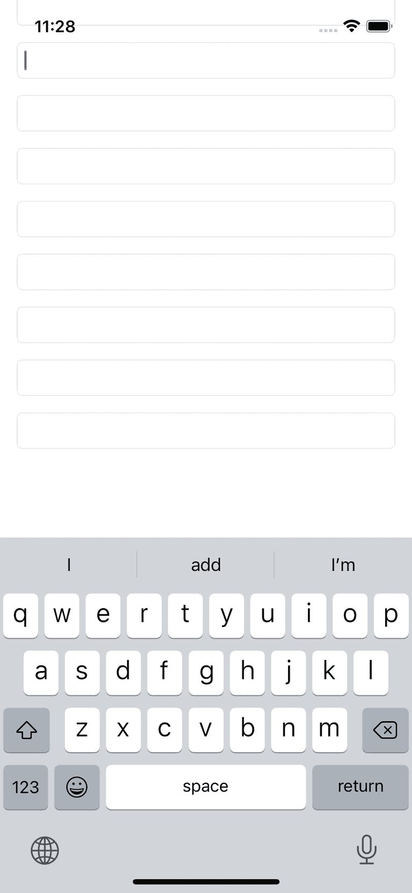
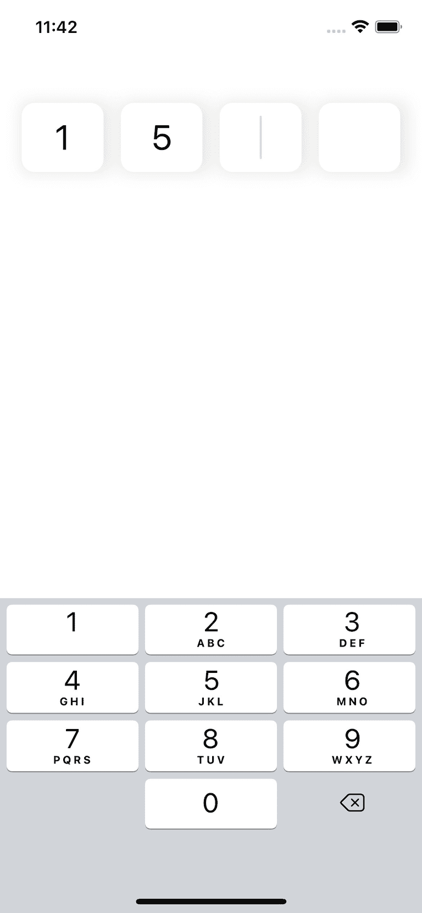

# 现在让我们在配方 6-2 中创建一个简单的验证器。所有验证器都各不相同，但基本结构是相似的。假设我们需要用户的电子邮件地址。我们的`EmailInputValidator`类应被指定为`UITextField`的委托。它会移除电子邮件地址中不允许的所有字符，并在地址有效时调用自身的委托函数。

请在配方 3-3 或 GitHub 上配方 6-2 的完整版本中查找`String`扩展`isValidEmail`。

```
protocol EmailInputValidatorDelegate: AnyObject {
    func validityChanged(isValid: Bool)
}

class EmailInputValidator: NSObject, UITextFieldDelegate {
    weak var delegate: EmailInputValidatorDelegate?

    func textField(_ textField: UITextField, shouldChangeCharactersIn range: NSRange, replacementString string: String) -> Bool {
        let allowedRegEx = "[A-Z0-9a-z._%+-@]+"
        let allowedTest = NSPredicate(format: "SELF MATCHES %@", allowedRegEx)
        if !allowedTest.evaluate(with: string) && !string.isEmpty {
            return false
        }
        if let text = textField.text,
           let textRange = Range(range, in: text) {
            let updatedText = text.replacingCharacters(in: textRange, with: string)
            delegate?.validityChanged(isValid: updatedText.isValidEmail)
        }
        return true
    }
}
```

**配方 6-2**  
**电子邮件输入验证器**

你可以在`UIViewController`中这样使用它：

```
class ViewController: UIViewController {
    @IBOutlet weak var textField: UITextField!
    var emailValidator = EmailInputValidator()

    override func viewDidLoad() {
        super.viewDidLoad()
        textField.delegate = emailValidator
        emailValidator.delegate = self
    }
}

extension ViewController: EmailInputValidatorDelegate {
    func validityChanged(isValid: Bool) {
        print(isValid)
    }
}
```

## 格式化用户输入

某些类型的数据需要视觉装饰才能易于理解，例如电话号码。不同国家的电话号码长度不同，但平均大约有十位数字。看到连续十位数字而没有分隔对人类来说难以辨认——如果以这种方式呈现，你几乎认不出自己的电话号码。添加一些空格、括号和破折号可以使电话号码更具可读性和易理解性。

另一个例子是银行卡号。其长度也不尽相同，但最常见的是将数字以四位一组进行分隔。

我们不能期望用户提供完美的文本格式。更有甚者，我们通常只允许在此类字段中输入数字——屏幕键盘上没有空格、破折号或括号。我们需要自动完成这些操作。

### 格式化电话号码

下一个配方将使用`libPhoneNumber`库。你可以从以下仓库添加它： [`https://github.com/iziz/libPhoneNumber-iOS`](https://github.com/iziz/libPhoneNumber-iOS)。如果你使用 Swift Package Manager，请在那里输入 URL；否则，使用 `pod`：

```
import libPhoneNumber_iOS

class PhoneViewController: UIViewController, UITextFieldDelegate {
    @IBOutlet weak var phoneNumberTextField: UITextField!
    let countryId = "US"
    let phoneUtil = NBPhoneNumberUtil.sharedInstance()

    func textField(_ textField: UITextField, shouldChangeCharactersIn range: NSRange, replacementString string: String) -> Bool {
        if string.isEmpty {
            return true
        }
        if let text = textField.text,
           let textRange = Range(range, in: text) {
            let updatedText = text.replacingCharacters(in: textRange, with: string)
            if let phoneUtil = self.phoneUtil,
               let phoneNumber = try? phoneUtil.parse(updatedText, defaultRegion: countryId),
               let formattedString = try? phoneUtil.format(phoneNumber, numberFormat: .NATIONAL) {
                DispatchQueue.main.async {
                    textField.text = formattedString
                }
            }
        }
        return true
    }
}
```

**配方 6-3**  
**在 UITextField 中格式化电话号码**

```
pod 'libPhoneNumber-iOS'
```

让我们逐行分析一下。

在你的 UI 文件（storyboard 或 xib）中，添加一个国家选择器和一个`UITextField`。国家选择器通常是一个包含旗帜、国家名称或代码的列表。更改国家应更改`countryId`变量。我们将其留在此范围之外讨论。`UITextField`应有一个`@IBOutlet`，并将视图控制器作为其委托。

我们创建一个常量`phoneUtil`，作为对`NBPhoneNumberUtil`单例的引用。

所有逻辑都位于委托方法内。如果字符串为空，我们直接返回`true`而不进行任何验证。这将允许我们自由删除符号，即使结果不是有效的电话号码。允许用户从`UITextField`中删除符号对于友好的用户界面非常重要。

```
if string.isEmpty {
    return true
}
```

然后，我们按照本章之前讨论的方式计算`updatedText`。

```
let updatedText = text.replacingCharacters(in: textRange, with: string)
```

现在，当我们得到更新后的文本后，我们尝试将其解析为电话号码，并使用`countryId`作为参数，将其格式化为国家号码。`formattedString`要么包含格式化后的号码，要么为`nil`。如果它有内容，我们就将其设置为新文本。

这部分需要特别注意，因为它非常重要。我们不能直接设置文本，因为`textField`的更改发生在`true`返回之后。如果我们在此函数内部更改文本属性，它将被覆盖。这就是为什么我们将其包装在`DispatchQueue.main.async`中。

```
DispatchQueue.main.async {
    textField.text = formattedString
}
```

### 格式化银行卡号

信用卡号格式化背后的思路与电话号码格式化完全相同，但在这种情况下，我们不需要任何库。配方 6-4 展示了如何实现。

```
extension String {
    func group(by groupSize: Int = 4, separator: String = " ") -> String {
        if count < groupSize {
            return self
        }
        let startIndex = self.startIndex
        let endIndex = self.index(startIndex, offsetBy: groupSize)
        let firstGroup = self[startIndex..<endIndex]
        let rest = String(self[endIndex...])
        return firstGroup + separator + rest.group(by: groupSize, separator: separator)
    }
}

class CardViewController: UIViewController, UITextFieldDelegate {
    @IBOutlet weak var cardTextField: UITextField!

    func textField(_ textField: UITextField, shouldChangeCharactersIn range: NSRange, replacementString string: String) -> Bool {
        if string.isEmpty {
            return true
        }
        if let text = textField.text,
           let textRange = Range(range, in: text) {
            let updatedText = text
                .replacingCharacters(in: textRange, with: string)
                .filter("0123456789".contains)
            let formattedString = updatedText.group()
                .trimmingCharacters(in: .whitespacesAndNewlines)
            DispatchQueue.main.async {
                textField.text = formattedString
            }
        }
        return true
    }
}
```

**配方 6-4**  
**在 UITextField 中格式化银行卡号**

在实际生活中，信用卡号可能更复杂，但我们只是将数字按四位一组进行分组。在更复杂的情况下，我们可以通过前几位数字检测卡的类型，并应用适当的格式化。

获取`updatedText`后，我们只保留数字并丢弃所有其他字符（即空格）。然后我们在每四位数字后添加一个空格，并在`DispatchQueue.main.async`块内设置新文本。

我们使用`String`的`group`扩展方法作为辅助函数。这个方法相当直观；它取出字符串的前`groupSize`个字符，添加一个分隔符，然后对剩余的字符串递归执行相同操作。结果，在默认参数下，它将数字按四位一组进行分组，并在每组之间插入空格。


## 使用表情符号

表情符号出现在 20 世纪 80 年代，并在 90 年代流行起来。那时还没有图片，只有文字符号。眼睛是冒号，鼻子是短横线，嘴巴是括号。像这样：`:-)`。你只有把头侧过来才能看到一张脸，但总比没有好。看不到对方的脸也听不到他们的声音，你就无法知道他们的语调。

随着时间的推移，表情符号成了互联网文化的重要组成部分，并逐渐渗透到我们生活的其他方面。统一码联盟不断向标准中添加更多表情符号；屏幕键盘上也有了单独的表情符号布局；最终，它们不仅仅是图片，还常常是动画图片。

与此同时，表情符号对我们开发者来说可能是一个问题。即使有了标准化，表情符号的编码方式仍然可能不同，而且旧设备或旧版本的操作系统可能不支持新的表情符号。这就是为什么最好在大多数文本输入中屏蔽它们。在社交媒体帖子、评论和视频描述中，表情符号完全可以接受，但用户不应当在电子邮件地址、密码、法定姓名、银行账号等字段中使用表情符号。

要阻止用户输入表情符号，我们需要两个步骤：

-   检测`String`中是否包含表情符号。
-   通过`UITextField`代理阻止包含表情符号的文本。

### 检测字符串中的表情符号

与第 3 章中的字符串分析器类似，让我们添加一些扩展来检测`String`中是否有表情符号（方案 6-5）。我们知道，`String`是一个`Character`实例的序列。为了确保`String`中没有表情符号，我们需要检查每个`Character`。要检查`String`中是否有表情符号，我们需要找到至少一个`Character`，它是一个表情符号。

```
extension Character {
    var isSimpleEmoji: Bool {
        guard let firstScalar = unicodeScalars.first else { return false }
        return firstScalar.properties.isEmoji && firstScalar.value > 0x238C
    }
    var isCombinedIntoEmoji: Bool { unicodeScalars.count > 1 && unicodeScalars.first?.properties.isEmoji ?? false }
    var isEmoji: Bool { isSimpleEmoji || isCombinedIntoEmoji }
}
方案 6-5
检查字符是否为表情符号
```

简单表情符号和组合表情符号有什么区别？问题在于现代表情符号不仅仅是脸和花朵，它们还有许多其他特征，比如肤色、发色和性别。如果一个简单的黄脸可以用一个 Unicode 符号表示，那么更复杂的表情符号就是符号序列。

计算属性 `isEmoji` 告诉我们`Character`是否是任何类型的表情符号，无论其复杂性如何。方案 6-6 中的其他扩展可用于检测`String`是否包含表情符号。

```
extension String {
    var isSingleEmoji: Bool { count == 1 && containsEmoji }
    var containsEmoji: Bool { contains { $0.isEmoji } }
    var containsOnlyEmoji: Bool { !isEmpty && !contains { !$0.isEmoji } }
    var emojiString: String { emojis.map { String($0) }.reduce("", +) }
    var emojis: [Character] { filter { $0.isEmoji } }
    var emojiScalars: [UnicodeScalar] { filter { $0.isEmoji }.flatMap { $0.unicodeScalars } }
}
方案 6-6
检查字符串是否包含表情符号
```

我们不需要所有这些计算属性来分析用户输入，但它们对其他目的可能有用。例如，如果你让用户用三个表情符号来描述某篇帖子，`containsOnlyEmoji` 函数就会很方便。

### 阻止用户在输入中使用表情符号

要阻止用户在输入中使用表情符号，我们只需要结合之前的一些方案。方案 6-7 展示了我们得到的结果。

```
extension ViewController: UITextFieldDelegate {
    func textField(_ textField: UITextField, shouldChangeCharactersIn range: NSRange, replacementString string: String) -> Bool {
        if string.containsEmoji && !string.isEmpty {
            return false
        }
        // 如有必要进行验证
        return true
    }
}
方案 6-7
阻止用户在输入中使用表情符号
```

## 浮动前缀或后缀

有时，我们需要在`UITextField`的开头或结尾添加不可编辑的文本字符串。可以是货币符号、验证徽章或任何其他信息。

根据文本的位置（前缀或后缀），有不同的方法。要添加前缀，我们需要给文本输入添加内边距。后缀则更复杂；每次可编辑文本发生变化时，我们都需要移动它们。

### 添加前缀

要添加前缀，你需要两个步骤：

-   创建一个`UILabel`对象并正确对齐。
-   给`UITextField`添加内边距，这样可编辑文本就会位于前缀的右侧。

让我们创建两个对象并添加插座变量：

```
@IBOutlet weak var prefixLabel: UILabel!
@IBOutlet weak var mainText: TextFieldWithPadding!
```

注意

`TextFieldWithPadding` 是在第 4 章“UITextField 内边距”部分创建的一个类。你可以在方案 4-26 中找到它的源代码。

我们需要知道`prefixLabel`的宽度。如果它是静态的，我们可以在`viewDidLayoutSubviews`中调整它。如果不是，每次文本改变时我们都需要重新调整。

```
mainText.paddingLeft = prefixLabel.bounds.width + 8
```

我们额外增加了 8 个点作为前缀和主文本之间的间距。完整的解决方案如方案 6-8 所示。

```
class FloatingPrefixViewController: UIViewController {
    @IBOutlet weak var prefixLabel: UILabel!
    @IBOutlet weak var mainText: TextFieldWithPadding!
    static let gapWidth = CGFloat(8)

    override func viewDidLayoutSubviews() {
        mainText.paddingLeft = prefixLabel.bounds.width + FloatingPrefixViewController.gapWidth
    }

    func setPrefix(_ prefix: String) {
        prefixLabel.text = prefix
        DispatchQueue.main.async {
            self.mainText.paddingLeft = self.prefixLabel.bounds.width + FloatingPrefixViewController.gapWidth
        }
    }
}

extension FloatingPrefixViewController: UITextFieldDelegate {
    func textFieldShouldReturn(_ textField: UITextField) -> Bool {
        setPrefix(textField.text ?? "")
        textField.text = ""
        return false
    }
}
方案 6-8
带前缀的 UITextField
```

如你所见，`setPrefix` 方法中包含一个异步部分。我们需要它来让`UILabel`在用到其新宽度之前完成更新。如果异步部分对你来说不可接受，你可以手动计算文本宽度。

出于演示目的，此方案包含一个扩展，每次用户点击*返回*键时都会设置一个新的标签文本。请勿在实际应用中使用此扩展。


### 添加后缀

与前缀不同，后缀并非静态；每次输入文本时，它们都会移动。我们不需要在布局准备就绪时添加内边距，而是需要添加 `UITextField` 委托，并重写 `func textField(_: UITextField, shouldChangeCharactersIn: NSRange, replacementString: String) -> Bool`。

垂直对齐方式与之前的食谱相同，但在水平方向上，`UILabel` 应与 `UITextField` 的左侧（前导）对齐。每次用户更改输入时，我们都需要更改此约束。

另一个可能的问题是右侧（尾部）的空间。如果输入的文本加上后缀后宽度超过我们的可用区域，标签将超出区域，或者文本将被裁剪。这就是为什么我们需要使用相同的 `TextFieldWithPadding` 类，但使用 `rightPadding` 而不是 `leftPadding`。食谱 6-9 提供了浮动后缀问题的解决方案。

```
class FloatingSuffixViewController: UIViewController, UITextFieldDelegate {
    @IBOutlet weak var suffixLabel: UILabel!
    @IBOutlet weak var mainText: TextFieldWithPadding!
    @IBOutlet weak var suffixLeadingSpace: NSLayoutConstraint!
    static let gapWidth = CGFloat(8)
    override func viewDidLayoutSubviews() {
        mainText.paddingRight = suffixLabel.bounds.width + FloatingPrefixViewController.gapWidth
    }
    func setSuffix(_ suffix: String) {
        suffixLabel.text = suffix
        DispatchQueue.main.async {
            self.mainText.paddingLeft = self.suffixLabel.bounds.width + FloatingPrefixViewController.gapWidth
        }
    }
    func textField(_ textField: UITextField, shouldChangeCharactersIn range: NSRange, replacementString string: String) -> Bool {
        if let text = textField.text,
           let textRange = Range(range, in: text) {
            let updatedText = text.replacingCharacters(in: textRange, with: string)
            if let font = mainText.font {
                let fontAttributes = [NSAttributedString.Key.font: font]
                let size = (updatedText as NSString).size(withAttributes: fontAttributes)
                suffixLeadingSpace.constant = size.width
                view.layoutIfNeeded()
            }
        }
        return true
    }
}
食谱 6-9
带后缀的 UITextField
```

此处的宽度计算是通过 `NSString` 方法 `size` 执行的。它返回一个 `CGSize` 结构体，其中包含给定属性下文本的宽度和高度。我们设置的唯一属性是 `NSAttributedString.Key.font`。在 iOS 中，`UIFont` 对象不仅包含字体，还包含字号，因此 `size` 方法拥有足够的信息来进行计算。

## 键盘处理

正如我们在本章开头所讨论的，屏幕键盘对开发者来说可能是一个大问题。默认情况下，当用户点击 `UITextField` 或 `UITextView` 时，键盘将会弹出，但它不会自行消失，并且除了遮挡 `UITextField` 或 `UITextView` 之外，什么也不做。如果您在屏幕底部添加一个输入框，键盘将会遮挡它。

### 用户点击文本框外部时隐藏键盘

如果文本字段不在可滚动区域内，隐藏它就相当容易。您只需要在 `UIViewController` 中重写一个函数并调用 `view.endEditing(true)`，如食谱 6-10 所示。

```
class HidingKeyboardViewController: UIViewController {
    override func touchesBegan(_ touches: Set<UITouch>, with event: UIEvent?) {
        super.touchesBegan(touches, with: event)
        view.endEditing(true)
    }
}
食谱 6-10
隐藏键盘
```

### 在可滚动区域中隐藏键盘

如果您需要在可滚动区域内进行文本输入（这在表单中很常见），那么之前的食谱将不起作用。这并不意味着您不应该使用它；用户可以点击可滚动区域的外部，但这还不够。

根据您期望的行为，有两种解决方案：

-   用户滚动时隐藏键盘
-   用户点击文本字段外部时隐藏键盘

第一个解决方案需要设置 `UIScrollView` 的一个属性。在 Interface Builder（故事板编辑器）中，选择您的 `UIScrollView`，并将 *Keyboard* 设置为 *Dismiss on drag*。

您也可以通过代码实现相同的效果：

```
scrollView.keyboardDismissMode = .onDrag
```

### 用户离开屏幕时隐藏键盘

用户离开屏幕时，隐藏屏幕键盘是一个好习惯。通常有两种导航方向：

-   移动到下一个屏幕
-   返回到上一个屏幕

假设您有一个带有 `@IBAction` 函数的“下一步”按钮。该函数中的第一行代码应该是：

```
view.endEditing(true)
```

至于返回，解决方案类似。在第 4 章中，我们创建了一个通用函数 `goBack`。食谱 6-11 对其进行了更新以隐藏键盘。如果键盘未显示，这也不会对应用程序造成损害。

```
public extension UIViewController {
    @IBAction func goBack() {
        view.endEditing(true)
        if let nc = navigationController,
           nc.viewControllers.count >= 2 {
            nc.popViewController(animated: true)
        } else {
            dismiss(animated: true, completion: nil)
        }
    }
}
食谱 6-11
更新后的 goBack 函数
```


### 键盘出现时调整布局

当键盘出现时，你的布局必须随之改变。这一点始终是必要的。即使你的文本字段始终位于屏幕顶部，屏幕底部也有需要移动的对象。在使用可滚动区域（如 `UIScrollView`）时，内容偏移量也需要相应调整。

这可以通过处理键盘通知来实现，如代码清单 6-12 所示。

```
class KeyboardListenerViewController: UIViewController {
    override func viewWillAppear(_ animated: Bool) {
        super.viewWillAppear(animated)
        NotificationCenter.default.addObserver(
            self,
            selector: #selector(keyboardWillShow(notification:)),
            name: UIResponder.keyboardWillShowNotification,
            object: nil
        )
        NotificationCenter.default.addObserver(
            self,
            selector: #selector(keyboardWillHide(notification:)),
            name: UIResponder.keyboardWillHideNotification,
            object: nil
        )
    }
    override func viewDidDisappear(_ animated: Bool) {
        NotificationCenter.default.removeObserver(self, name: UIResponder.keyboardWillShowNotification, object: nil)
        NotificationCenter.default.removeObserver(self, name: UIResponder.keyboardWillHideNotification, object: nil)
        super.viewWillDisappear(animated)
    }
    @objc func keyboardWillShow(notification: NSNotification) {
        if let keyboardSize = (notification.userInfo?[UIResponder.keyboardFrameEndUserInfoKey] as? NSValue)?.cgRectValue.size {
            // 键盘高度在 keyboardSize.height 中
        }
    }
    @objc func keyboardWillHide(notification: NSNotification) {
        // 键盘消失时通常不需要键盘尺寸，因此只需重置约束即可
    }
}
代码清单 6-12
处理键盘通知
```

`notification` 参数是可选的；如果你不需要键盘尺寸，可以创建不带此参数的处理程序。别忘了，如果函数签名发生改变，`#selector` 也需要相应更新。

现在，当我们知道了键盘出现和消失的时机，接下来调整布局。一种可行的方案是创建一个约束，我们将其命名为 `bottomConstraint`，用于定义屏幕（或安全区域）底部与最底层视图之间的距离。通常，这个最底层视图就是“下一步”按钮。

通过传递过来的通知，我们可以提取键盘高度并相应地移动布局，如代码清单 6-13 所示。

```
class KeyboardListenerViewController2: UIViewController {
    @IBOutlet weak var bottomConstraint: NSLayoutConstraint!
    override func viewWillAppear(_ animated: Bool) {
        super.viewWillAppear(animated)
        NotificationCenter.default.addObserver(
            self,
            selector: #selector(keyboardWillShow(notification:)),
            name: UIResponder.keyboardWillShowNotification,
            object: nil
        )
        NotificationCenter.default.addObserver(
            self,
            selector: #selector(keyboardWillHide),
            name: UIResponder.keyboardWillHideNotification,
            object: nil
        )
    }
    override func viewDidDisappear(_ animated: Bool) {
        NotificationCenter.default.removeObserver(self, name: UIResponder.keyboardWillShowNotification, object: nil)
        NotificationCenter.default.removeObserver(self, name: UIResponder.keyboardWillHideNotification, object: nil)
        super.viewWillDisappear(animated)
    }
    @objc func keyboardWillShow(notification: NSNotification) {
        if let keyboardSize = (notification.userInfo?[UIResponder.keyboardFrameEndUserInfoKey] as? NSValue)?.cgRectValue.size {
            bottomConstraint.constant = keyboardSize.height
            view.layoutIfNeeded()
        }
    }
    @objc func keyboardWillHide() {
        bottomConstraint.constant = 0
        view.layoutIfNeeded()
    }
}
代码清单 6-13
在键盘出现和消失时更改布局
```

### 滚动以显示当前文本字段

当表单较大时（如图 6-1 所示），我们会使用一个可滚动区域，通常是 `UIScrollView`。当键盘出现时，可供显示的区域变得相当狭小，在填写两到三个文本字段后，光标就会超出显示范围。我们需要自动滚动 `UIScrollView`，使正在编辑的字段保持可见。

有两种处理方式。第一种是缩小 `UIScrollView` 的高度，使其完全位于键盘上方。这种方式有一个重大缺点：每次键盘出现时，`UIScrollView` 的大小都会发生变化，这可能会产生不悦目的视觉效果。第二种方式是每当用户进入另一个 `UITextField` 时，改变内容偏移量（滚动位置）。由于我们知道该字段在父视图中的位置，因此知道需要设置哪个内容偏移量。代码清单 6-14 展示了这种解决方案。



图片显示了一个移动设备屏幕，上面有空的文本字段和一个键盘。光标位于第一个文本框内。键盘显示了文本输入的预测建议。

图 6-1

当键盘出现时移动 `UITextField`

```
class AutoscrollViewController: UIViewController {
    @IBOutlet weak var scrollView: UIScrollView!
    @IBOutlet weak var textField1: UITextField!
    @IBOutlet weak var textField2: UITextField!
    @IBOutlet weak var textField3: UITextField!
    @IBOutlet weak var textField4: UITextField!
    @IBOutlet weak var textField5: UITextField!
    @IBOutlet weak var textField6: UITextField!
    @IBOutlet weak var textField7: UITextField!
    @IBOutlet weak var textField8: UITextField!
    // ...
    static let gap = CGFloat(40)
}

extension AutoscrollViewController: UITextFieldDelegate {
    func textFieldDidBeginEditing(_ textField: UITextField) {
        let offset = textField.frame.origin.y - AutoscrollViewController.gap
        DispatchQueue.main.async {
            self.scrollView.setContentOffset(CGPoint(x: 0, y: offset), animated: true)
        }
    }
    func textFieldShouldReturn(_ textField: UITextField) -> Bool {
        switch textField {
        case textField1: textField2.becomeFirstResponder()
        case textField2: textField3.becomeFirstResponder()
        case textField3: textField4.becomeFirstResponder()
        case textField4: textField5.becomeFirstResponder()
        case textField5: textField6.becomeFirstResponder()
        case textField6: textField7.becomeFirstResponder()
        case textField7: textField8.becomeFirstResponder()
        default: textField.resignFirstResponder()
        }
        return false
    }
}
代码清单 6-14
滚动以显示文本字段
```

这段代码还包含一个*回车*按钮的处理程序。当你点击*回车/下一步/提交*或其他按钮（该按钮通常位于右下角，名称取决于 `UITextField` 的配置）时，焦点会移到下一个输入框。

你可以设计更有趣的滚动机制，例如，让前一个字段也可见，或者仅在字段被部分或完全遮挡时才滚动。但这是一个完全可用的解决方案，因此你可以放心地直接使用。


## 密码键盘 UI 组件

密码的使用频率越来越低，这合情合理。大多数用户要么忘记密码，要么在所有网站和移动应用中使用相同的密码，这极其不安全。

许多现代应用会提供短信验证码或验证器应用（如 Google Authenticator 或 Authy）生成的验证码，作为两步验证的方式。这种验证码通常由四到六位数字组成。有时，它们甚至完全替代了密码。

处理这种情况最优雅、最舒适的方式是使用一个*密码键盘*。普通的 `UITextField` 在这方面的视觉效果并不理想。

让我们来编写一个简单的四位数字密码键盘。

首先，将四个 `UITextField` 对象添加到你的视图中，如图 6-2 所示。你可以将它们放在任何你喜欢的位置，但最好采用居中对齐并将它们置于顶部，这样当键盘出现时，我们无需调整布局。



一张图片展示了一个带有空文本框和数字键盘的移动屏幕。在四个空格中，已输入了数字 1 和 5，光标位于第三个位置。

图 6-2

密码键盘示例

为所有四个文本框选择数字键盘作为键盘类型。按顺序为它们分配从 0 到 3 的标签（tag）。

创建四个输出口：

```
@IBOutlet weak var digit1TextField: UITextField!
...
@IBOutlet weak var digit4TextField: UITextField!
```

让你的 `UIViewController` 子类（本例中为 `PinPadViewController`）成为所有文本框的代理。实现 `UITextFieldDelegate` 协议。我们将需要以下方法：

```
func textFieldShouldBeginEditing(_ textField: UITextField) -> Bool
func textField(_ textField: UITextField, shouldChangeCharactersIn range: NSRange, replacementString string: String) -> Bool
```

第一个方法应清空选中的文本框及其之后的所有文本框。

第二个方法应进行输入验证。我们只允许输入数字，且每个字段只允许输入一个。

为了将焦点从一个字段移动到另一个字段，我们将使用 `editingChanged` 动作。让我们使用一个名为 `textChanged` 的方法：

```
@IBAction func textChanged(_ textField: UITextField)
```

为了方便起见，我们可以将文本框打包成一个数组。

```
class PinPadViewController: UIViewController {
@IBOutlet weak var digit1TextField: UITextField!
@IBOutlet weak var digit2TextField: UITextField!
@IBOutlet weak var digit3TextField: UITextField!
@IBOutlet weak var digit4TextField: UITextField!
private var pinDigitTextFields: [UITextField] = []
override func viewDidLoad() {
super.viewDidLoad()
pinDigitTextFields = [
digit1TextField,
digit2TextField,
digit3TextField,
digit4TextField
]
}
override func viewDidAppear(_ animated: Bool) {
super.viewDidAppear(animated)
clear()
}
@IBAction func textChanged(_ textField: UITextField) {
if textField.tag == 3 {
view.endEditing(true)
validateAndGo()
} else {
pinDigitTextFields[textField.tag + 1].becomeFirstResponder()
}
}
private func clear() {
pinDigitTextFields.forEach {
$0.text = ""
}
digit1TextField.becomeFirstResponder()
}
private func getPin() -> String {
let digit1 = digit1TextField.text ?? ""
let digit2 = digit2TextField.text ?? ""
let digit3 = digit3TextField.text ?? ""
let digit4 = digit4TextField.text ?? ""
return "\(digit1)\(digit2)\(digit3)\(digit4)"
}
private func validateAndGo() {
let pin = getPin()
if pin.count != 4 {
clear()
return
}
// 在此处你可以将 PIN 发送到 API 进行验证（或本地验证）
}
}
extension PinPadViewController: UITextFieldDelegate {
func textFieldShouldBeginEditing(_ textField: UITextField) -> Bool {
for i in textField.tag..<pinDigitTextFields.count {
pinDigitTextFields[i].text = ""
}
return true
}
func textField(_ textField: UITextField, shouldChangeCharactersIn range: NSRange, replacementString string: String) -> Bool {
if let text = textField.text,
let textRange = Range(range, in: text) {
let updatedText = text.replacingCharacters(in: textRange,
with: string)
if updatedText.count > 1 {
return false
}
if !updatedText.containsOnlyDigits {
return false
}
return true
}
return false
}
}
秘方 6-15
密码键盘
```

你应该在 `validateAndGo` 方法中进行验证。

实现某个功能的方式总是多种多样的。这是一种非常简单的实现方式；如果需要视觉效果或装饰，实现起来可能会更复杂。

## 总结

在本章中，我们描述了如何在编辑时验证文本，如何阻止用户输入某些字符，以及如何为文本字段添加前缀或后缀。由于大多数移动设备没有物理键盘，我们绝不应忘记屏幕上的键盘会覆盖部分用户界面。为了处理这种情况，我们需要订阅通知并更新布局。我们还需要记得在屏幕切换时隐藏键盘。最后一个秘方展示了文本字段的一个有趣用例——密码键盘。这是一个用于输入密码或短信验证码的组件。在下一章中，我们将完成对 UIKit 的讨论，并开始讲解动画和视觉效果。

